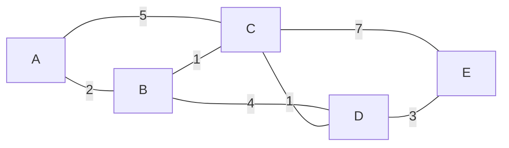

<Callout type="info">
  **이번 문서의 목표:** 거리 벡터 방식과 링크 상태 방식이 각각 어떻게 최적 경로를 계산하는지 설명하고, 작은 그래프에서 다익스트라(Dijkstra) 알고리즘을 직접 계산하며, RIP와 OSPF를 비교하고 무한 카운트(count-to-infinity) 문제가 왜 생기는지 설명할 수 있게 된다.
</Callout>

## 왜 라우터마다 경로 계산 방식이 다른가

14편에서 동적 라우팅은 라우터들이 서로 정보를 주고받아 라우팅 테이블을 자동으로 만든다는 것을 배웠습니다. 그런데 "서로 정보를 주고받는다"는 방식에는 크게 두 가지 철학이 있습니다. 하나는 이웃에게 "내가 어디까지 얼마나 걸리는지"만 알려주는 방식이고, 다른 하나는 네트워크 전체의 연결 지도를 모든 라우터가 똑같이 갖고 각자 계산하는 방식입니다. 이 두 철학이 바로 **거리 벡터**(distance vector)와 **링크 상태**(link state) 라우팅이며, 독학사 시험에서 라우팅 알고리즘 비교 문제로 자주 출제되는 핵심 주제입니다.

## 1. 거리 벡터 라우팅 — 이웃에게만 소문내기

**거리 벡터**(distance vector) 라우팅은 각 라우터가 "어떤 목적지까지 거리(비용)가 얼마인지"를 벡터(방향과 값의 목록) 형태로 만들어, **직접 연결된 이웃 라우터에게만** 주기적으로 전달하는 방식입니다. 라우터는 이웃에게서 받은 정보에 자신과 이웃 사이의 비용을 더해, 그 목적지까지 자신의 새로운 거리를 갱신합니다. 이 원리를 **벨만-포드**(Bellman-Ford) 알고리즘이라고 부릅니다.

> **쉽게 말하면:** 거리 벡터 방식은 옆집 사람에게 "이 목적지까지 몇 분 걸리더라"라는 소문만 듣고, 거기에 옆집까지 가는 시간을 더해 자신의 거리를 짐작하는 방식입니다. 전체 지도를 직접 보지는 못합니다.

거리 벡터 방식의 특징은 다음과 같습니다.

- 각 라우터는 **네트워크 전체의 구조를 알지 못하고**, 이웃이 알려준 거리 값만 신뢰합니다.
- 정보가 이웃에서 이웃으로 퍼지는 데 시간이 걸리므로, 네트워크에 변화가 생겼을 때 모든 라우터가 새 정보를 반영해 안정된 상태(수렴, convergence)에 이르기까지 상대적으로 **느립니다**.
- 대표 프로토콜은 **RIP**(Routing Information Protocol)입니다.

## 2. 링크 상태 라우팅 — 전체 지도를 그린 뒤 최단 경로 계산

**링크 상태**(link state) 라우팅은 각 라우터가 자신과 직접 연결된 링크의 상태(연결된 이웃과 그 비용)를 네트워크 전체에 **flooding**(범람, 모든 라우터에게 퍼뜨리는 방식)으로 알립니다. 이렇게 해서 모든 라우터가 네트워크 전체의 연결 지도(링크 상태 데이터베이스)를 똑같이 갖게 되면, 각 라우터는 이 지도를 바탕으로 **다익스트라 알고리즘**(Dijkstra's algorithm)을 이용해 자신을 기준으로 한 최단 경로를 스스로 계산합니다.

> **쉽게 말하면:** 링크 상태 방식은 모든 사람이 도시 전체 지도를 나눠 갖고, 각자 자신의 위치에서 목적지까지 가장 빠른 길을 직접 계산하는 방식입니다.

대표 프로토콜은 **OSPF**(Open Shortest Path First)입니다.

### 다익스트라 알고리즘 실제 계산

아래와 같은 작은 네트워크 그래프가 있다고 합시다. 노드는 라우터, 간선의 숫자는 링크 비용입니다.

라우터 A를 기준으로 다른 모든 라우터까지의 최단 거리를 다익스트라 알고리즘으로 계산해 보겠습니다. 알고리즘의 규칙은 "아직 방문하지 않은 노드 중 현재까지 계산된 거리가 가장 작은 노드를 방문 확정하고, 그 노드를 거쳐 갈 때 이웃의 거리가 더 짧아지면 갱신한다"입니다.

**초기화**: A까지의 거리는 0, 나머지는 무한대(아직 모름)로 시작합니다.

| 단계 | 방문 확정 | A | B | C | D | E |
|---|---|---|---|---|---|---|
| 0 (초기화) | – | 0 | 무한대 | 무한대 | 무한대 | 무한대 |

**1단계 — A 방문.** 거리가 가장 작은 A(0)를 확정합니다. A와 연결된 B, C의 거리를 갱신합니다. A→B는 2이므로 B=2, A→C는 5이므로 C=5입니다.

| 단계 | 방문 확정 | A | B | C | D | E |
|---|---|---|---|---|---|---|
| 1 | A | 0 | 2 (A경유) | 5 (A경유) | 무한대 | 무한대 |

**2단계 — B 방문.** 미방문 노드 중 가장 작은 값은 B(2)이므로 B를 확정합니다. B를 거쳐 C, D를 갱신합니다. B→C는 1이므로 2+1=3이 기존 C값 5보다 작아 C=3(B경유)로 갱신합니다. B→D는 4이므로 2+4=6, D=6(B경유)으로 갱신합니다.

| 단계 | 방문 확정 | A | B | C | D | E |
|---|---|---|---|---|---|---|
| 2 | A, B | 0 | 2 | 3 (B경유) | 6 (B경유) | 무한대 |

**3단계 — C 방문.** 미방문 중 가장 작은 값은 C(3)이므로 C를 확정합니다. C를 거쳐 D, E를 갱신합니다. C→D는 1이므로 3+1=4가 기존 D값 6보다 작아 D=4(C경유)로 갱신합니다. C→E는 7이므로 3+7=10, E=10(C경유)으로 갱신합니다.

| 단계 | 방문 확정 | A | B | C | D | E |
|---|---|---|---|---|---|---|
| 3 | A, B, C | 0 | 2 | 3 | 4 (C경유) | 10 (C경유) |

**4단계 — D 방문.** 미방문 중 가장 작은 값은 D(4)이므로 D를 확정합니다. D를 거쳐 E를 갱신합니다. D→E는 3이므로 4+3=7이 기존 E값 10보다 작아 E=7(D경유)로 갱신합니다.

| 단계 | 방문 확정 | A | B | C | D | E |
|---|---|---|---|---|---|---|
| 4 | A, B, C, D | 0 | 2 | 3 | 4 | 7 (D경유) |

**5단계 — E 방문.** 남은 노드 E(7)를 확정하면 모든 노드의 최단 거리가 확정됩니다.

| 목적지 | 최단 거리 | 경로 |
|---|---|---|
| B | 2 | A → B |
| C | 3 | A → B → C |
| D | 4 | A → B → C → D |
| E | 7 | A → B → C → D → E |

C까지 직접 가는 경로(A→C, 비용 5)보다 B를 거쳐 가는 경로(A→B→C, 비용 2+1=3)가 더 짧다는 것이 이번 계산의 핵심 포인트입니다. 다익스트라 알고리즘은 이렇게 **직접 경로가 아니라 우회 경로가 더 저렴할 수 있다는 것**까지 반영해 진짜 최단 경로를 찾아냅니다.

**자주 틀리는 점:** 다익스트라 알고리즘에서 매 단계마다 "이미 방문 확정된 노드"의 거리는 이후 단계에서 다시 줄어들지 않는다는 점을 놓치기 쉽습니다. 한 번 방문 확정되면 그 값이 최종 확정 값이며, 이후에는 갱신 대상에서 제외하고 오직 미방문 노드만 갱신 대상으로 삼습니다.

## 3. RIP vs OSPF 비교

| 구분 | RIP(Routing Information Protocol) | OSPF(Open Shortest Path First) |
|---|---|---|
| 라우팅 방식 | 거리 벡터 | 링크 상태 |
| 사용 알고리즘 | 벨만-포드 | 다익스트라 |
| 메트릭 | 홉 수(하나의 라우터를 거칠 때마다 1씩 증가) | 대역폭 기반 비용(속도가 빠를수록 비용이 낮음) |
| 최대 홉 수 | 15홉(16은 도달 불가로 간주) | 제한 없음(대규모 네트워크에 적합) |
| 정보 교환 범위 | 이웃 라우터에게만 자신의 라우팅 테이블 전달 | 네트워크 전체에 링크 상태를 flooding |
| 수렴 속도 | 상대적으로 느림 | 상대적으로 빠름 |
| 정보 교환량 | 주기적으로 테이블 전체를 전달(비교적 단순) | 변화가 있을 때만 갱신을 전달(효율적이지만 계산은 더 복잡) |

RIP가 홉 수를 최대 15로 제한하는 이유는 아래에서 다룰 **무한 카운트 문제**를 일정 범위 안에서 끊어내기 위해서입니다. 16이라는 값에 도달하면 "그 목적지는 도달 불가능하다(infinity, 무한대)"고 간주해 문제가 끝없이 이어지는 것을 막습니다.

**자주 틀리는 점:** "OSPF는 홉 수를 기준으로 최적 경로를 계산한다"는 설명은 틀린 문장으로 자주 나옵니다. 홉 수를 메트릭으로 쓰는 것은 RIP이며, OSPF는 대역폭 기반의 비용을 메트릭으로 사용해 홉 수가 많아도 회선 속도가 빠르면 더 낮은 비용으로 계산될 수 있습니다.

## 4. 수렴과 루프 문제 — 무한 카운트(count-to-infinity)

거리 벡터 방식은 이웃에게서 들은 정보만 믿기 때문에, 네트워크 구성이 바뀌었을 때(예: 링크 장애) 잘못된 정보가 라우터 사이를 오가며 서서히 커지는 **무한 카운트 문제**(count-to-infinity problem)가 생길 수 있습니다.

라우터 R1 – R2 – 네트워크 X가 일렬로 연결되어 있고, R2가 네트워크 X에 직접 연결(비용 0)되어 있으며 R1은 R2를 거쳐 X에 도달(비용 1)한다고 합시다. 그런데 R2와 네트워크 X 사이의 링크가 끊어졌다고 가정합니다.

| 라운드 | 상황 | R2가 아는 X까지 비용 | R1이 아는 X까지 비용 |
|---|---|---|---|
| 0 | 장애 발생 전 | 0(직접 연결) | 1(R2 경유) |
| 1 | R2-X 링크 끊김. R2가 갱신 전에 R1의 오래된 정보(비용 1)를 받아 "R1을 거쳐 2에 갈 수 있다"고 잘못 믿음 | 2(R1 경유로 오인) | 1(갱신 전) |
| 2 | R1이 R2의 새 정보(비용 2)를 받아 자신의 경로를 3으로 갱신 | 2 | 3(R2 경유) |
| 3 | R2가 R1의 새 정보(비용 3)를 받아 다시 4로 갱신 | 4 | 3 |
| 4 | R1이 다시 5로 갱신 | 4 | 5 |
| … | 서로 상대방이 알려준 값에 1씩 더하며 계속 증가 | … | … |
| n | 값이 계속 커지다가 16에 도달 | 16(도달 불가로 확정) | 16(도달 불가로 확정) |

R1과 R2가 서로 상대방에게서 들은(사실은 자신에게서 나온 정보가 되돌아온) 값을 진짜 새로운 경로로 착각해 비용을 1씩 계속 올리는 것이 이 문제의 핵심입니다. 마치 두 사람이 서로 "네가 맞다고 했으니까"라며 잘못된 소문을 부풀려 가는 것과 비슷합니다. RIP는 이 값이 실제로는 무한히 커지지 않도록 **16을 "도달 불가"로 정의**해 두어, 값이 16에 도달하면 그 이상 세지 않고 경로를 포기하도록 만들었습니다. 이것이 앞서 3절에서 본 "RIP의 최대 홉 수는 15, 16은 무한대(도달 불가)"라는 규칙의 이유입니다.

> **쉽게 말하면:** 무한 카운트 문제는 두 라우터가 서로에게 들은 헛소문을 진짜라고 믿고 되돌려주기를 반복하며 숫자를 계속 부풀리는 현상입니다. RIP는 "16번째 부풀리기부터는 그냥 거짓말로 취급하고 끊어버리자"는 규칙으로 이 문제를 막습니다.

이 문제를 줄이기 위해 실제 거리 벡터 프로토콜은 **스플릿 호라이즌**(split horizon, 어떤 경로 정보를 배운 인터페이스로는 그 정보를 다시 돌려보내지 않는 규칙)이나 **경로 포이즈닝**(route poisoning, 도달 불가능해진 경로를 무한대 값으로 즉시 광고하는 규칙) 같은 보완 기법을 함께 사용합니다. 반면 링크 상태 방식(OSPF)은 각 라우터가 이웃의 말이 아니라 **네트워크 전체의 실제 연결 지도를 직접 갖고 있어**, 이런 식으로 되돌아온 헛소문에 속을 가능성이 근본적으로 낮습니다.

**자주 틀리는 점:** "링크 상태 방식도 거리 벡터 방식과 동일하게 무한 카운트 문제가 발생한다"는 설명은 틀렸습니다. 무한 카운트 문제는 이웃의 말만 듣고 전체 구조를 모르는 **거리 벡터 방식의 구조적 약점**이며, 전체 지도를 공유하는 링크 상태 방식에서는 이 문제가 원천적으로 훨씬 적게 발생합니다.

## 핵심 정리

- 거리 벡터 라우팅(RIP)은 이웃에게만 자신의 거리 정보를 전달하고 벨만-포드 알고리즘으로 갱신하며, 홉 수를 메트릭으로 쓰고 최대 15홉(16은 도달 불가)까지만 허용한다.
- 링크 상태 라우팅(OSPF)은 링크 상태를 네트워크 전체에 flooding해 모든 라우터가 같은 지도를 갖고, 각자 다익스트라 알고리즘으로 최단 경로를 계산하며 대역폭 기반 비용을 메트릭으로 쓴다.
- 다익스트라 알고리즘은 매 단계마다 미방문 노드 중 최소 거리 노드를 확정하고, 그 노드를 거쳐 갈 때 이웃 거리가 더 짧아지면 갱신하는 과정을 반복한다.
- 무한 카운트 문제는 거리 벡터 방식에서 잘못된 정보가 라우터 사이를 오가며 값이 계속 커지는 현상이며, RIP는 16을 도달 불가로 정의해 이를 제한한다.
- 링크 상태 방식은 전체 지도를 직접 공유하므로 무한 카운트 문제에 상대적으로 안전하지만, 계산과 flooding에 필요한 처리 부담은 더 크다.

## 마무리 복습

<Quiz
  questionNumber={1}
  question="거리 벡터 라우팅 방식에 대한 설명으로 가장 적절한 것은?"
  options={['각 라우터가 네트워크 전체의 연결 지도를 공유하고 다익스트라 알고리즘으로 최단 경로를 계산한다', '각 라우터가 이웃에게서 받은 거리 정보에 자신과 이웃 간 비용을 더해 경로를 갱신한다', '각 라우터가 링크 상태를 네트워크 전체에 flooding으로 알린다', '메트릭으로 항상 대역폭 기반 비용만 사용한다']}
  correctAnswer={2}
  explanation="거리 벡터 방식은 이웃 라우터가 알려준 거리 값에 자신과 이웃 사이의 비용을 더해 벨만-포드 알고리즘 방식으로 경로를 갱신한다."
  optionExplanations={['전체 지도를 공유하고 다익스트라로 계산하는 것은 링크 상태 방식의 특징이다.', '이웃의 거리 정보에 비용을 더해 갱신한다는 설명이 거리 벡터 방식의 정의와 일치한다.', '링크 상태를 전체에 flooding하는 것은 링크 상태 방식의 특징이다.', 'RIP 같은 거리 벡터 프로토콜은 대역폭이 아니라 홉 수를 메트릭으로 사용한다.']}
/>

<Quiz
  questionNumber={2}
  question="아래 그래프에서 다익스트라 알고리즘으로 A에서 D까지의 최단 거리를 구하면? (간선 비용: A-B=2, B-C=1, C-D=1, A-C=5, B-D=4)"
  options={['3', '4', '5', '6']}
  correctAnswer={2}
  explanation="A에서 B로 2, B에서 C로 1을 더해 A-B-C 경로가 3이 되고, 여기에 C-D 비용 1을 더한 A-B-C-D 경로가 4가 되어 A-C(5)나 A-B-D(6)보다 짧다."
  optionExplanations={['A-B-C 경로까지의 거리이며 D까지는 도달하지 못한 값이다.', 'A-B-C-D 경로의 누적 비용 2+1+1을 정확히 계산한 최단 거리다.', 'A-C 직접 경로의 비용으로, 우회 경로인 A-B-C-D보다 더 길다.', 'A-B-D 경로의 누적 비용 2+4로, 최단 경로인 A-B-C-D보다 더 길다.']}
/>

<Quiz
  questionNumber={3}
  question="RIP와 OSPF의 비교로 옳지 않은 것은?"
  options={['RIP는 거리 벡터 방식, OSPF는 링크 상태 방식이다', 'RIP는 메트릭으로 홉 수를 사용하며 최대 15홉까지만 허용한다', 'OSPF는 메트릭으로 대역폭 기반 비용을 사용해 홉 수가 많아도 회선이 빠르면 더 낮은 비용으로 계산될 수 있다', 'OSPF도 RIP와 마찬가지로 16홉을 도달 불가로 간주해 최대 홉 수를 제한한다']}
  correctAnswer={4}
  explanation="16홉을 도달 불가로 간주해 최대 홉 수를 제한하는 규칙은 RIP의 특징이다. OSPF는 링크 상태 방식으로 홉 수 제한이 없어 대규모 네트워크에 적합하다."
  optionExplanations={['RIP는 거리 벡터, OSPF는 링크 상태 방식이라는 설명이 정확하다.', 'RIP가 홉 수를 메트릭으로 쓰고 최대 15홉까지 허용한다는 설명이 정확하다.', 'OSPF가 대역폭 기반 비용을 메트릭으로 사용한다는 설명이 정확하다.', 'OSPF는 홉 수 제한이 없으므로 이 설명이 옳지 않은 진술이며 정답으로 골라야 한다.']}
/>

<Quiz
  questionNumber={4}
  question="무한 카운트(count-to-infinity) 문제에 대한 설명으로 가장 적절한 것은?"
  options={['링크 상태 방식에서 발생하는 문제로, 라우터가 전체 지도를 계산하는 데 시간이 오래 걸리는 현상이다', '거리 벡터 방식에서 잘못된 경로 정보가 라우터 사이를 오가며 비용 값이 계속 커지는 현상이다', 'OSPF가 flooding을 반복하면서 네트워크 트래픽이 무한히 증가하는 현상이다', 'IP 패킷의 TTL이 계속 감소해 결국 0이 되는 현상이다']}
  correctAnswer={2}
  explanation="무한 카운트 문제는 거리 벡터 방식에서 링크 장애 이후 라우터들이 서로에게서 되돌아온 잘못된 정보를 새로운 정보로 착각해 비용 값을 계속 증가시키는 현상이다."
  optionExplanations={['이 문제는 거리 벡터 방식의 구조적 약점이며 링크 상태 방식의 계산 속도 문제와는 다르다.', '거리 벡터 방식에서 잘못된 정보가 오가며 비용이 계속 커지는 현상이라는 설명과 정확히 일치한다.', 'flooding으로 인한 트래픽 증가는 링크 상태 방식의 별개 특성으로 무한 카운트 문제와 다르다.', 'TTL 감소는 14편에서 다룬 IP 패킷 생존 시간 문제로 무한 카운트 문제와 다른 개념이다.']}
/>

<Quiz
  questionNumber={5}
  question="RIP가 홉 수 16을 도달 불가(infinity)로 정의한 이유로 가장 적절한 것은?"
  options={['라우터의 메모리 용량 한계 때문이다', '무한 카운트 문제로 비용 값이 끝없이 커지는 것을 일정 범위에서 끊기 위해서다', 'OSPF와 호환성을 맞추기 위해서다', '대역폭 계산을 단순화하기 위해서다']}
  correctAnswer={2}
  explanation="거리 벡터 방식에서 링크 장애 시 라우터 간 잘못된 정보로 비용 값이 계속 증가하는 무한 카운트 문제를 막기 위해, RIP는 16을 도달 불가로 정의해 그 이상 값이 커지지 않도록 제한한다."
  optionExplanations={['16이라는 값은 메모리 용량과 직접적인 관련이 없다.', '무한 카운트 문제를 일정 범위에서 끊기 위한 설계라는 설명이 정확하다.', 'RIP와 OSPF는 서로 다른 방식의 프로토콜로 메트릭 체계를 호환시킬 필요가 없다.', '대역폭 계산은 OSPF의 메트릭 방식이며 RIP는 홉 수만 사용한다.']}
/>

<Quiz
  questionNumber={6}
  question="다익스트라 알고리즘의 계산 절차에 대한 설명으로 옳지 않은 것은?"
  options={['시작 노드의 거리를 0으로, 나머지 노드의 거리를 무한대로 초기화한다', '매 단계마다 미방문 노드 중 현재까지의 거리가 가장 작은 노드를 방문 확정한다', '이미 방문 확정된 노드의 거리도 이후 더 짧은 경로가 발견되면 다시 갱신한다', '방문 확정된 노드를 거쳐 이웃 노드까지의 거리가 더 짧아지면 그 이웃의 거리를 갱신한다']}
  correctAnswer={3}
  explanation="다익스트라 알고리즘에서는 한 번 방문 확정된 노드의 거리는 최종 확정 값으로 취급되어 이후 단계에서 다시 갱신되지 않는다. 갱신 대상은 항상 미방문 노드다."
  optionExplanations={['시작 노드를 0, 나머지를 무한대로 초기화하는 것은 알고리즘의 정확한 첫 단계다.', '미방문 노드 중 최소 거리 노드를 확정하는 것은 알고리즘의 정확한 반복 규칙이다.', '방문 확정된 노드의 거리는 다시 갱신되지 않으므로 이 설명이 옳지 않은 진술이며 정답으로 골라야 한다.', '확정된 노드를 거쳐 이웃 거리를 갱신하는 것은 알고리즘의 정확한 갱신 규칙이다.']}
/>

## 참고 자료

- [IETF RFC 1058 - RIP](https://www.rfc-editor.org/rfc/rfc1058)
- [IETF RFC 2328 - OSPF](https://www.rfc-editor.org/rfc/rfc2328)
