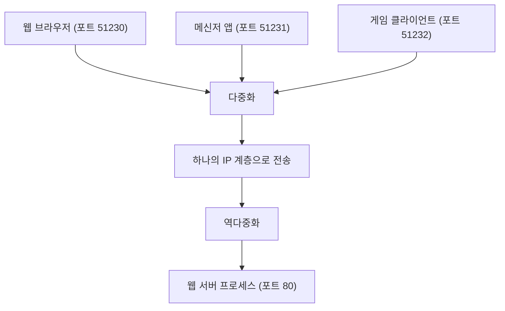
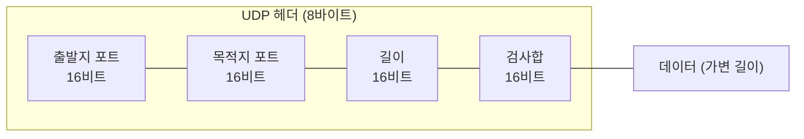
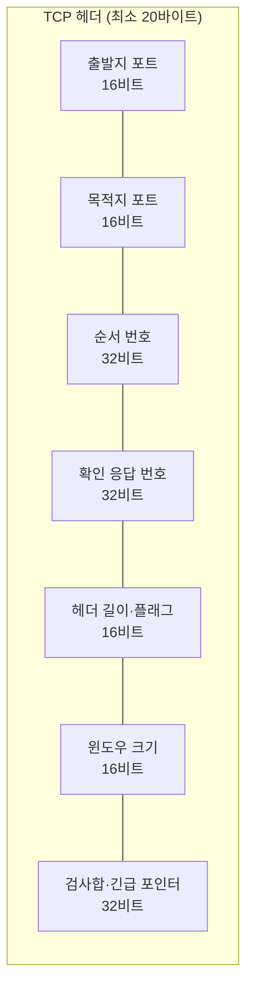

<Callout type="info">
  **이번 문서의 목표:** 이 파일을 다 읽으면 UDP와 TCP 헤더 구조의 차이를 그릴 수 있고, 포트 번호가 왜 필요한지, 연결 지향과 비연결형이 실제로 무엇을 다르게 만드는지 설명할 수 있다.
</Callout>

## 왜 전송 계층이 따로 필요한가

12편과 13편에서 배운 IP 주소는 **호스트(host, 네트워크에 연결된 컴퓨터)까지**만 데이터를 데려다준다. 하지만 실제로 우리가 쓰는 컴퓨터 한 대에서는 웹 브라우저, 메신저, 게임이 동시에 인터넷과 통신한다. IP 주소 하나만으로는 이 여러 프로그램 중 "누구에게" 데이터를 전달해야 할지 구분할 수 없다.

> **쉽게 말하면:** IP가 아파트 건물(호스트)까지 택배를 배달한다면, 전송 계층(transport layer)은 그 건물 안에서 몇 호(포트, port)에 사는 사람에게 전달할지를 정한다.

이 문제를 해결하는 것이 OSI 4계층·TCP/IP 전송 계층이다. 전송 계층은 크게 두 가지 프로토콜을 제공한다.

- **UDP**(User Datagram Protocol, 사용자 데이터그램 프로토콜) — 단순하고 빠르지만 신뢰성을 보장하지 않는다.
- **TCP**(Transmission Control Protocol, 전송 제어 프로토콜) — 복잡하지만 데이터가 순서대로, 빠짐없이 도착함을 보장한다.

독학사 3단계 컴퓨터네트워크에서 이 둘의 차이는 거의 매 회차 출제되는 핵심 비교 주제다. 이번 편에서는 두 프로토콜의 구조를 뜯어보고, 18편에서는 TCP의 연결 설정과 신뢰성 메커니즘을, 19편에서는 TCP 혼잡 제어를 다룬다.

## 포트 번호와 다중화

### 포트가 하는 일

> **쉽게 말하면:** 포트 번호(port number)는 한 컴퓨터 안에서 실행 중인 여러 프로그램(프로세스) 중 데이터를 받을 대상을 구분하는 번호표다.

포트 번호는 16비트 부호 없는 정수이므로 0부터 65535(2의 16제곱 빼기 1)까지 표현할 수 있다. 이 범위는 용도에 따라 세 구간으로 나뉜다.

| 구간 | 범위 | 용도 |
|------|------|------|
| 잘 알려진 포트(well-known port) | 0–1023 | HTTP(80), HTTPS(443), DNS(53), FTP(21)처럼 국제인터넷주소관리기구(IANA)가 표준 서비스에 고정 배정 |
| 등록된 포트(registered port) | 1024–49151 | 특정 애플리케이션(예: MySQL 3306)이 등록해 관례적으로 사용 |
| 동적/사설 포트(dynamic/private port) | 49152–65535 | 클라이언트가 임시로 사용하는 임시 포트(ephemeral port) |

예를 들어 여러분이 웹 브라우저로 한 사이트에 접속하면, 브라우저는 자신의 임시 포트(예: 51230)에서 상대 서버의 443번 포트로 연결을 시작한다. 서버 입장에서는 443번 포트로 오는 여러 접속을 클라이언트의 IP 주소와 포트 번호 조합으로 구분한다.

### 소켓과 다중화·역다중화

**소켓**(socket)은 IP 주소와 포트 번호를 묶은 통신의 끝점(endpoint)이다. 한 세그먼트가 어디서 와서 어디로 가는지는 다음 네 가지 값의 조합, 즉 **소켓 4-튜플**로 완전히 결정된다.

- 출발지 IP 주소(source IP)
- 출발지 포트(source port)
- 목적지 IP 주소(destination IP)
- 목적지 포트(destination port)

여러 애플리케이션 데이터를 하나의 IP 계층으로 모으는 과정을 **다중화**(multiplexing)라 하고, 반대로 도착한 세그먼트를 포트 번호에 따라 알맞은 애플리케이션으로 나누어 주는 과정을 **역다중화**(demultiplexing)라 한다. 07편에서 배운 물리 계층의 다중화(FDM·TDM)와 이름은 같지만 계층과 목적이 다르다는 점을 구분해야 한다. 물리 계층 다중화는 하나의 전송 매체를 여러 신호가 나눠 쓰게 하는 것이고, 전송 계층 다중화는 하나의 IP 스택을 여러 프로세스가 나눠 쓰게 하는 것이다.

## UDP: 최소한의 전송 계층

### UDP의 설계 철학

UDP는 RFC 768(1980년 제정)로 정의된, 전송 계층에서 가장 단순한 프로토콜이다. UDP는 IP가 제공하는 기능에 딱 하나, 포트를 이용한 다중화·역다중화와 최소한의 오류 검출만 얹는다.

> **쉽게 말하면:** UDP는 "일단 보내고 확인은 안 한다." 우체국이 엽서를 부치기만 하고 도착 여부는 신경 쓰지 않는 것과 같다.

UDP가 보장하지 **않는** 것들을 명확히 짚어야 시험에서 헷갈리지 않는다.

- 연결 설정 과정이 없다(비연결형, connectionless) — 보내는 쪽은 상대가 준비됐는지 확인하지 않고 그냥 보낸다.
- 순서를 보장하지 않는다 — 세그먼트가 보낸 순서와 다르게 도착할 수 있다.
- 도착을 보장하지 않는다 — 중간에 유실돼도 재전송하지 않는다.
- 흐름 제어와 혼잡 제어가 없다 — 받는 쪽이 못 따라가거나 네트워크가 혼잡해도 속도를 줄이지 않는다.

### UDP 헤더 구조

UDP 헤더는 8바이트(byte)로, 전송 계층 프로토콜 중 가장 작다.

| 필드 | 크기 | 의미 |
|------|------|------|
| 출발지 포트(Source Port) | 16비트 | 보내는 쪽 애플리케이션의 포트 번호 |
| 목적지 포트(Destination Port) | 16비트 | 받는 쪽 애플리케이션의 포트 번호 |
| 길이(Length) | 16비트 | UDP 헤더 + 데이터의 전체 바이트 수 |
| 검사합(Checksum) | 16비트 | 데이터 전송 중 오류가 생겼는지 확인하는 값(선택적이지만 IPv4에서도 실무상 거의 항상 사용) |

### UDP를 쓰는 이유와 대표 응용

UDP는 기능이 적어서 나쁜 프로토콜이 아니라, 오히려 그 단순함 때문에 특정 상황에 최적이다.

- **헤더 오버헤드가 작다** — 8바이트뿐이므로 짧은 메시지를 자주 보낼 때 효율적이다. DNS(20편에서 다룸) 질의·응답이 대표적이다.
- **지연이 낮다** — 연결 설정 과정과 재전송 대기가 없으므로 실시간성이 중요한 음성(VoIP)·화상 통화·온라인 게임에 유리하다. 패킷 하나가 늦게 도착한 옛날 음성 데이터는 재전송받아도 이미 쓸모가 없으므로, 차라리 버리고 다음 데이터를 받는 편이 낫다.
- **신뢰성이 필요하면 애플리케이션이 직접 구현**할 수 있다 — 필요한 최소한의 재전송·순서 제어만 애플리케이션 계층에서 얹을 수 있어 유연하다.

## TCP: 신뢰성을 보장하는 전송 계층

### TCP의 설계 철학

TCP는 IP가 보장하지 않는 신뢰성(순서, 무손실, 중복 없음)을 전송 계층에서 직접 구현한다. 이를 위해 TCP는 **연결 지향형**(connection-oriented) 프로토콜로 설계됐다 — 실제 데이터를 주고받기 전에 먼저 양쪽이 통신할 준비가 됐는지 확인하는 절차(18편의 3-way handshake)를 거친다.

> **쉽게 말하면:** TCP는 전화 통화와 같다. 말을 시작하기 전에 "여보세요, 들리세요?"로 서로 확인하고, 통화 중에는 상대가 놓친 말이 있으면 다시 말해준다.

### TCP 세그먼트 구조

TCP 헤더는 옵션이 없을 때 기본 20바이트로, UDP의 2.5배다. 이 차이가 바로 TCP가 신뢰성·흐름 제어·혼잡 제어를 위해 추가로 들고 다니는 정보의 크기다.

| 필드 | 크기 | 의미 |
|------|------|------|
| 출발지 포트(Source Port) | 16비트 | 보내는 쪽 포트 번호 |
| 목적지 포트(Destination Port) | 16비트 | 받는 쪽 포트 번호 |
| 순서 번호(Sequence Number) | 32비트 | 이 세그먼트의 첫 데이터 바이트가 전체 데이터 스트림에서 몇 번째 바이트인지 |
| 확인 응답 번호(Acknowledgment Number) | 32비트 | 다음에 받기를 기대하는 바이트 번호(=지금까지 잘 받은 마지막 바이트 번호 + 1) |
| 헤더 길이(Header Length) | 4비트 | TCP 헤더의 길이(옵션 포함) — 4바이트 단위 |
| 제어 플래그(Flags) | 각 1비트 | `SYN`(연결 시작), `ACK`(확인 응답), `FIN`(종료 요청), `RST`(강제 종료), `PSH`(즉시 전달), `URG`(긴급 데이터) |
| 윈도우 크기(Window Size) | 16비트 | 수신 측이 지금 더 받을 수 있는 데이터 양(흐름 제어에 사용, 18편에서 심화) |
| 검사합(Checksum) | 16비트 | 오류 검출 값 |
| 긴급 포인터(Urgent Pointer) | 16비트 | `URG` 플래그가 설정됐을 때 긴급 데이터의 위치 |
| 옵션(Options) | 가변 | 최대 세그먼트 크기(MSS), 윈도우 스케일링 등 확장 정보 |

순서 번호(Sequence Number)와 확인 응답 번호(Acknowledgment Number)는 18편에서 다룰 3-way handshake와 재전송의 핵심 재료이므로 이번 편에서는 "TCP는 바이트 단위로 순서를 센다"는 점만 기억해두자. TCP는 세그먼트 단위가 아니라 **바이트 스트림**(byte stream) 단위로 순서를 매긴다는 점이 자주 나오는 함정이다 — 세그먼트 3개를 보냈다고 순서 번호가 1, 2, 3으로 늘어나는 것이 아니라, 각 세그먼트가 담은 데이터 바이트 수만큼 늘어난다.

## UDP vs TCP 정면 비교

이제 두 프로토콜을 시험에 자주 나오는 다섯 가지 기준으로 정리한다. "옳지 않은 것을 고르시오" 유형에서는 이 표의 항목이 서로 뒤바뀌어 출제되는 경우가 많으므로 각 항목의 이유까지 함께 기억해야 한다.

| 비교 기준 | UDP | TCP |
|-----------|-----|-----|
| 연결 방식 | 비연결형(connectionless) — 연결 설정 없이 바로 전송 | 연결 지향형(connection-oriented) — 3-way handshake로 연결 설정 후 전송 |
| 신뢰성 | 보장하지 않음 — 유실돼도 재전송 없음 | 보장함 — 순서 번호·ACK·재전송으로 무손실 전달 |
| 순서 보장 | 보장하지 않음 — 도착 순서가 뒤섞일 수 있음 | 보장함 — 순서 번호로 재정렬 |
| 헤더 크기 | 8바이트(고정) | 최소 20바이트(옵션 포함 시 더 커짐) |
| 흐름·혼잡 제어 | 없음 | 있음(윈도우 기반 흐름 제어, cwnd 기반 혼잡 제어) |
| 속도·지연 | 빠름 — 오버헤드가 적고 대기가 없음 | 상대적으로 느림 — 연결 설정·확인 응답 대기 필요 |
| 대표 응용 | DNS, VoIP, 온라인 게임, 스트리밍 | HTTP/HTTPS, FTP, 이메일(SMTP), 파일 전송처럼 무손실이 중요한 서비스 |

이 표를 외우기보다 **이유로 연결**해서 이해하는 것이 시험 대비에 더 효과적이다. UDP가 빠른 이유는 확인 절차가 없기 때문이고, TCP가 느린 이유는 바로 그 확인 절차(연결 설정, ACK 대기, 재전송)가 신뢰성의 대가이기 때문이다. 즉 "UDP가 빠르다"와 "TCP가 신뢰성이 높다"는 서로 다른 두 특성이 아니라, **같은 설계 트레이드오프(trade-off, 상충 관계)의 양면**이다.

### 자주 틀리는 점

- **"UDP는 오류 검출도 안 한다"는 착각** — UDP도 검사합(checksum) 필드를 갖고 있어 데이터 손상 여부는 확인할 수 있다. UDP가 안 하는 것은 손상되거나 유실된 데이터의 **재전송**이다. 오류 검출과 오류 정정(재전송)을 구분해야 한다.
- **"TCP는 항상 UDP보다 좋다"는 착각** — 신뢰성이 필요 없거나 오히려 방해가 되는 실시간 스트림에서는 TCP의 재전송 대기가 오히려 지연을 키운다. 좋고 나쁨이 아니라 **용도에 따른 선택**이다.
- **포트 번호와 IP 주소를 혼동** — 포트는 전송 계층(4계층)의 개념이고 IP 주소는 네트워크 계층(3계층)의 개념이다. 같은 IP 주소를 가진 한 컴퓨터 안에서도 포트로 여러 서비스를 구분한다.
- **순서 번호가 세그먼트 개수라는 착각** — 앞서 설명했듯 TCP 순서 번호는 바이트 단위로 증가한다.

## 핵심 정리

- 전송 계층은 포트 번호를 이용해 IP가 구분하지 못하는 애플리케이션 단위 통신을 다중화·역다중화한다.
- UDP는 8바이트 헤더의 비연결형·최소 기능 프로토콜로, 신뢰성·순서·흐름 제어·혼잡 제어를 모두 제공하지 않는 대신 빠르고 가볍다.
- TCP는 최소 20바이트 헤더의 연결 지향형 프로토콜로, 순서 번호·확인 응답 번호·플래그·윈도우 필드를 이용해 신뢰성과 흐름·혼잡 제어를 구현한다.
- UDP와 TCP의 차이는 "속도 대 신뢰성"이라는 하나의 트레이드오프에서 나온다. 어느 쪽이 우월한 게 아니라 응용 목적에 따라 선택된다.
- TCP의 연결 설정·재전송 절차는 18편, 혼잡 제어는 19편에서 이어서 다룬다.

## 마무리 복습

<Quiz
  questionNumber={1}
  question="UDP와 TCP에 대한 설명으로 옳지 않은 것은?"
  options={['UDP 헤더는 8바이트로 TCP 헤더보다 작다', 'TCP는 연결 설정 절차를 거친 뒤 데이터를 전송한다', 'UDP는 검사합 필드가 없어 데이터 손상 여부를 전혀 확인할 수 없다', 'TCP는 순서 번호와 확인 응답 번호로 신뢰성을 구현한다']}
  correctAnswer={3}
  explanation="UDP 헤더에도 16비트 검사합(Checksum) 필드가 있어 데이터 손상 여부는 확인할 수 있다. UDP가 하지 않는 것은 손상되거나 유실된 데이터의 재전송이지, 오류 검출 자체가 아니다. 나머지 세 보기는 모두 옳은 설명이다."
  optionExplanations={['옳은 설명 — UDP 헤더는 출발지 포트·목적지 포트·길이·검사합 각 16비트로 총 8바이트다', '옳은 설명 — TCP는 3-way handshake로 연결을 먼저 설정한 뒤 데이터를 주고받는 연결 지향형 프로토콜이다', '옳지 않은 설명(정답) — UDP도 검사합 필드로 오류를 검출할 수 있다. 다만 오류가 발견돼도 재전송하지 않을 뿐이다', '옳은 설명 — TCP는 32비트 순서 번호와 확인 응답 번호로 데이터의 순서와 수신 여부를 추적해 신뢰성을 보장한다']}
/>

<Quiz
  questionNumber={2}
  question="전송 계층에서 포트 번호가 필요한 근본적인 이유로 가장 적절한 것은?"
  options={['같은 네트워크 안의 여러 호스트를 구분하기 위해', '한 호스트 안에서 실행 중인 여러 애플리케이션을 구분하기 위해', '데이터가 통과하는 라우터의 경로를 지정하기 위해', '물리 계층에서 여러 신호를 하나의 매체로 다중화하기 위해']}
  correctAnswer={2}
  explanation="IP 주소는 호스트까지만 데이터를 전달한다. 한 호스트 안에서 동시에 실행되는 여러 프로그램 중 어디로 전달할지 구분하는 역할은 포트 번호가 담당하며, 이 과정이 전송 계층의 다중화·역다중화다."
  optionExplanations={['틀림 — 호스트 구분은 IP 주소(네트워크 계층)의 역할이다', '정답 — 포트 번호는 IP 주소가 구분하지 못하는 한 호스트 내 애플리케이션(프로세스) 단위를 구분한다', '틀림 — 경로 지정(라우팅)은 IP 주소와 라우팅 테이블의 역할이며 포트 번호와 무관하다', '틀림 — 이는 물리 계층의 FDM·TDM 다중화이며, 전송 계층의 포트 기반 다중화와는 계층과 목적이 다르다']}
/>

<Quiz
  questionNumber={3}
  question="다음 중 UDP를 사용하는 것이 TCP보다 더 적절한 상황으로 가장 알맞은 것은?"
  options={['은행 계좌 이체처럼 데이터 무결성이 절대적으로 중요한 경우', '대용량 파일을 순서대로 정확히 전송해야 하는 FTP 통신', '실시간 음성 통화처럼 지연이 데이터 손실보다 더 치명적인 경우', '웹 페이지의 HTML 문서를 요청하고 받는 HTTP 통신']}
  correctAnswer={3}
  explanation="실시간 음성·영상 스트림은 오래된 패킷을 재전송받아도 이미 재생 타이밍이 지나 쓸모가 없다. 이런 경우 TCP의 재전송 대기가 오히려 지연을 키우므로, 손실을 감수하고 빠르게 전달하는 UDP가 더 적합하다."
  optionExplanations={['틀림 — 계좌 이체는 데이터 손실·중복이 치명적이므로 신뢰성을 보장하는 TCP가 필수다', '틀림 — 파일 전송은 순서와 무결성이 중요하므로 TCP가 적합하다(FTP는 TCP 기반)', '정답 — 실시간성이 손실 허용보다 중요한 상황에서는 UDP의 낮은 지연이 유리하다', '틀림 — HTTP는 웹 문서가 온전히 도착해야 하므로 TCP를 사용한다']}
/>

<Quiz
  questionNumber={4}
  question="TCP 헤더의 필드에 대한 설명으로 옳은 것은?"
  options={['순서 번호는 지금까지 보낸 세그먼트의 개수를 나타낸다', '윈도우 크기 필드는 수신 측이 추가로 받을 수 있는 데이터 양을 나타낸다', 'SYN 플래그는 연결 종료를 요청할 때 사용한다', '확인 응답 번호는 상대방이 보낸 포트 번호를 그대로 복사한 값이다']}
  correctAnswer={2}
  explanation="윈도우 크기(Window Size) 필드는 수신 측의 현재 수신 가능 용량을 알려 흐름 제어에 사용된다. 순서 번호는 세그먼트 개수가 아니라 바이트 스트림에서의 위치를 나타내고, 연결 종료는 FIN 플래그가 담당하며, 확인 응답 번호는 포트 번호와 무관하다."
  optionExplanations={['틀림 — 순서 번호(Sequence Number)는 바이트 단위로 증가하며 세그먼트 개수와는 다르다', '정답 — 윈도우 크기는 수신 버퍼의 여유 공간을 알려 송신 측의 전송량을 조절하는 흐름 제어에 쓰인다', '틀림 — 연결 종료 요청은 FIN 플래그의 역할이다. SYN은 연결 시작을 요청한다', '틀림 — 확인 응답 번호(Acknowledgment Number)는 다음에 받기를 기대하는 데이터 바이트 번호이며 포트 번호와는 무관하다']}
/>

<Quiz
  questionNumber={5}
  question="소켓(socket)을 완전히 식별하는 데 필요한 정보로 옳게 짝지어진 것은?"
  options={['출발지 IP, 목적지 IP만으로 충분하다', '출발지 포트, 목적지 포트만으로 충분하다', '출발지 IP·포트와 목적지 IP·포트의 조합이 필요하다', 'MAC 주소와 IP 주소의 조합이 필요하다']}
  correctAnswer={3}
  explanation="소켓은 출발지 IP, 출발지 포트, 목적지 IP, 목적지 포트로 구성된 4-튜플로 완전히 식별된다. 이 네 값의 조합이 있어야 여러 동시 연결을 서로 구분할 수 있다."
  optionExplanations={['틀림 — IP 주소만으로는 같은 호스트 내 여러 연결이나 애플리케이션을 구분할 수 없다', '틀림 — 포트 번호만으로는 어느 호스트 간의 통신인지 알 수 없다', '정답 — 출발지·목적지 각각의 IP 주소와 포트 번호, 총 네 값의 조합이 하나의 연결(소켓)을 식별한다', '틀림 — MAC 주소는 데이터링크 계층(2계층)의 개념으로 전송 계층의 소켓 식별과는 관련이 없다']}
/>

<Quiz
  questionNumber={6}
  question="UDP와 TCP의 헤더 크기 차이가 발생하는 근본적인 이유로 가장 적절한 것은?"
  options={['UDP는 검사합 필드가 없기 때문이다', 'TCP가 신뢰성·흐름 제어·혼잡 제어를 위한 추가 정보를 담기 때문이다', 'UDP는 포트 번호 필드를 사용하지 않기 때문이다', 'TCP는 IP 주소 정보를 헤더에 추가로 포함하기 때문이다']}
  correctAnswer={2}
  explanation="TCP 헤더가 UDP보다 큰 이유는 순서 번호, 확인 응답 번호, 윈도우 크기, 각종 플래그처럼 신뢰성·흐름 제어·혼잡 제어를 구현하기 위한 필드를 추가로 담기 때문이다. UDP도 검사합과 포트 필드는 갖고 있으며, IP 주소는 어느 헤더에도 포함되지 않는다(네트워크 계층의 몫)."
  optionExplanations={['틀림 — UDP도 16비트 검사합 필드를 갖고 있다', '정답 — TCP는 순서 번호·확인 응답 번호·윈도우 크기 등 UDP에 없는 필드를 추가로 담아 헤더가 커진다', '틀림 — UDP도 출발지·목적지 포트 필드를 각각 16비트씩 갖는다', '틀림 — IP 주소는 네트워크 계층(3계층) 헤더의 필드이며 TCP·UDP 헤더 어디에도 포함되지 않는다']}
/>

## 참고 자료

- [MDN Web Docs - TCP](https://developer.mozilla.org/)
- [IETF RFC 768 - User Datagram Protocol](https://www.rfc-editor.org/rfc/rfc768)
