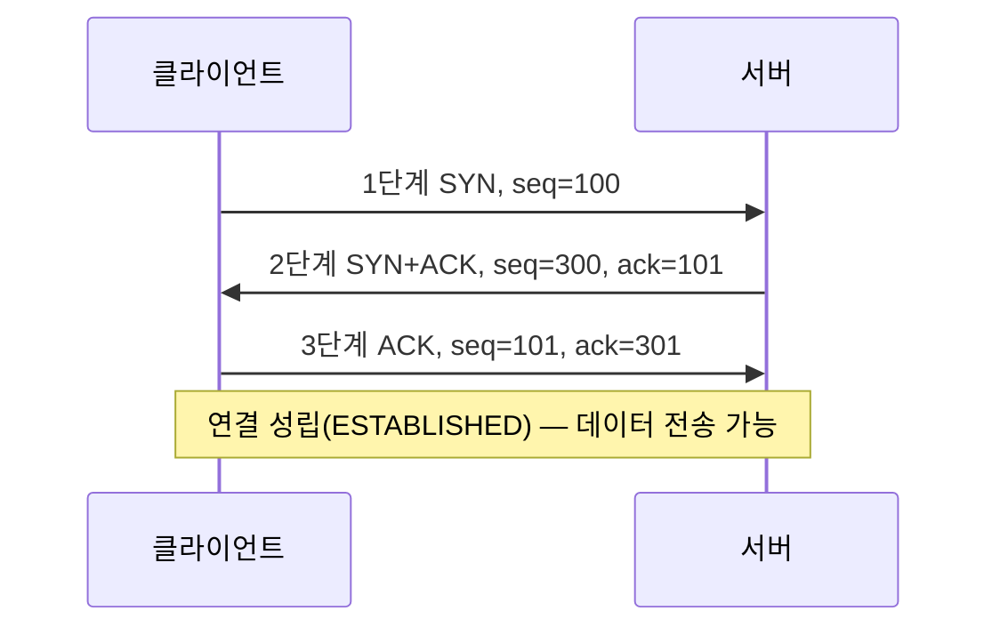
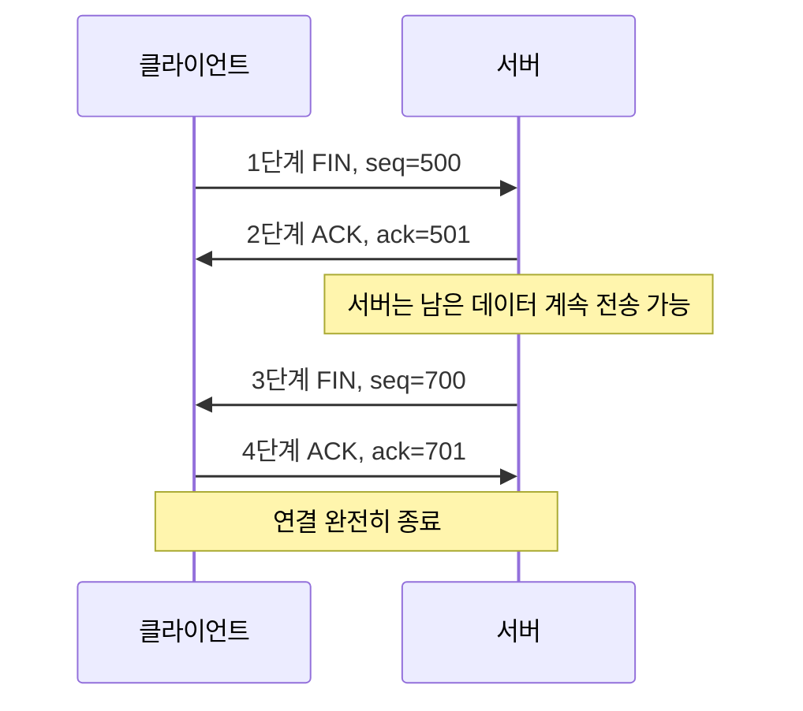

<Callout type="info">
  **이번 문서의 목표:** 이 파일을 다 읽으면 TCP의 3-way handshake와 4-way 종료 절차를 순서 번호·플래그와 함께 그릴 수 있고, TCP가 재전송·흐름 제어로 신뢰성을 만드는 원리를 설명할 수 있다.
</Callout>

## 왜 연결 설정이 필요한가

17편에서 TCP는 연결 지향형(connection-oriented) 프로토콜이라고 배웠다. 데이터를 주고받기 전에 양쪽이 먼저 "서로 통신할 준비가 됐는지", 그리고 "각자 어디서부터 순서 번호(sequence number)를 세기 시작할지"를 맞춰야 한다.

> **쉽게 말하면:** 전화 통화를 시작하기 전에 "여보세요, 들리세요?" "네, 들려요"를 주고받는 것처럼, TCP도 본론(데이터 전송)에 들어가기 전에 짧은 인사를 나눈다.

이 인사 절차가 바로 **3-way handshake**(3방향 핸드셰이크)다. 연결을 마칠 때도 마찬가지로 "이제 끊을게요"를 양쪽이 각각 확인하는 절차, **4-way 종료**(4방향 종료)를 거친다.

## 3-way handshake: 연결 설정

### 왜 초기 순서 번호를 무작위로 정하는가

TCP의 각 호스트는 연결을 시작할 때 자신만의 **초기 순서 번호**(ISN, Initial Sequence Number)를 무작위에 가깝게 정한다. 이렇게 하는 이유는 두 가지다.

- 이전에 종료된 연결의 지연된 세그먼트가 새 연결에 섞여 들어와 순서 번호가 겹치는 사고를 막기 위해서다.
- 순서 번호를 예측해 통신에 끼어드는 보안 공격(순서 번호 추측 공격)을 어렵게 만들기 위해서다.

이해를 돕기 위해 이번 편에서는 클라이언트의 초기 순서 번호를 100, 서버의 초기 순서 번호를 300이라는 구체적인 숫자로 고정해 따라가 본다(실제로는 훨씬 큰 32비트 무작위 값이 쓰인다).

### 3단계 진행

1. **1단계 — `SYN`**: 클라이언트가 서버에게 "연결하고 싶다"는 세그먼트를 보낸다. `SYN` 플래그를 1로 설정하고, 자신의 초기 순서 번호(seq=100)를 싣는다.
2. **2단계 — `SYN` + `ACK`**: 서버가 클라이언트의 요청을 받았음을 확인(`ACK`)하면서 동시에 자신도 연결하고 싶다는 요청(`SYN`)을 함께 보낸다. 확인 응답 번호는 클라이언트가 보낸 순서 번호에 1을 더한 값(ack=101)이고, 자신의 초기 순서 번호(seq=300)도 함께 싣는다.
3. **3단계 — `ACK`**: 클라이언트가 서버의 `SYN`을 받았음을 확인하는 `ACK`를 보낸다. 확인 응답 번호는 서버의 순서 번호에 1을 더한 값(ack=301)이다. 이 단계부터 실제 데이터를 함께 실어 보낼 수도 있다.

`SYN` 플래그가 붙은 세그먼트는 실제 데이터가 없어도 **1바이트를 소모한 것으로 간주**한다. 그래서 확인 응답 번호가 순서 번호보다 정확히 1 큰 값으로 응답되는 것이다. 이는 이후 종료 절차의 `FIN`에도 똑같이 적용되는 규칙이므로 꼭 기억해두자.

### 각 단계의 상태 변화

TCP는 연결의 각 단계를 **상태**(state)로 관리한다. 시험에서는 이 상태 이름과 순서를 묻는 문항이 자주 나온다.

| 단계 | 클라이언트 상태 | 서버 상태 |
|------|-----------------|-----------|
| 연결 시작 전 | CLOSED | LISTEN(서버가 접속을 기다리는 상태) |
| 1단계(SYN) 전송 후 | SYN_SENT | LISTEN |
| 2단계(SYN+ACK) 전송 후 | SYN_SENT | SYN_RCVD |
| 3단계(ACK) 전송 후 | ESTABLISHED | ESTABLISHED |

### 왜 두 번이 아니라 세 번인가

"2-way로 충분하지 않은가"는 자주 나오는 질문이다. 만약 클라이언트의 `SYN`에 서버가 `SYN+ACK`만 보내고 끝낸다면, 서버는 자신의 `SYN`이 클라이언트에게 잘 도착했는지 확인할 방법이 없다. 3단계의 `ACK`가 있어야 **양쪽 모두** "상대가 내 순서 번호를 알고 있다"는 사실을 확인할 수 있다. 즉 3-way handshake는 양방향 각각의 순서 번호 동기화를 보장하기 위한 최소 횟수다.

## 4-way 종료: 연결 해제

### 왜 종료는 네 단계인가

연결 설정은 세 번이지만 종료는 네 번이다. 그 이유는 TCP 연결이 **양방향 독립적**이기 때문이다 — 클라이언트가 더 보낼 데이터가 없어 종료를 원해도, 서버는 아직 보낼 데이터가 남아 있을 수 있다. 그래서 종료는 "클라이언트 → 서버 방향 닫기"와 "서버 → 클라이언트 방향 닫기"를 각각 별도로 확인한다.

> **쉽게 말하면:** 두 사람이 통화를 끝낼 때 "저는 할 말 다 했어요"(클라이언트의 FIN), "네, 알겠어요"(서버의 ACK), 그리고 조금 뒤 "저도 다 했어요"(서버의 FIN), "네, 끊을게요"(클라이언트의 ACK)를 각각 주고받는 것과 같다.

이어서 순서 번호를 구체적으로 따라간다. 데이터 전송이 끝난 시점에 클라이언트의 순서 번호가 500, 서버의 순서 번호가 700이라고 하자.

1. **1단계 — `FIN`**: 클라이언트가 "더 보낼 데이터가 없다"는 `FIN` 세그먼트를 보낸다(seq=500).
2. **2단계 — `ACK`**: 서버가 클라이언트의 `FIN`을 확인하는 `ACK`를 보낸다(ack=501). 이 시점에서 클라이언트 → 서버 방향은 닫히지만, 서버는 아직 데이터를 보낼 수 있다.
3. **3단계 — `FIN`**: 서버도 보낼 데이터를 다 보낸 뒤 자신의 `FIN`을 보낸다(seq=700).
4. **4단계 — `ACK`**: 클라이언트가 서버의 `FIN`을 확인하는 `ACK`를 보낸다(ack=701). 이제 양방향 모두 닫힌다.

### TIME_WAIT: 마지막 대기

4단계의 `ACK`를 보낸 클라이언트(먼저 `FIN`을 보낸 쪽인 경우가 많다)는 곧바로 연결을 완전히 닫지 않고 **TIME_WAIT**이라는 상태로 일정 시간(보통 최대 세그먼트 수명의 2배, 2MSL) 대기한다. 이렇게 기다리는 이유는 마지막 `ACK`가 유실됐을 경우 서버가 `FIN`을 재전송할 수 있는데, 그때 클라이언트가 이미 사라지고 없으면 서버가 영원히 응답을 기다리는 상황을 막기 위해서다.

## 순서 번호와 확인 응답으로 만드는 신뢰성

### 누적 확인 응답

TCP는 **누적 확인 응답**(cumulative acknowledgment) 방식을 쓴다. 확인 응답 번호(ack)는 "지금까지 순서대로 빠짐없이 받은 마지막 바이트의 다음 번호"를 의미한다. 예를 들어 순서 번호 1부터 1000까지의 데이터를 세그먼트 여러 개로 나눠 받았는데 1~500은 도착했고 501~700은 아직 도착하지 않았다면, 수신 측은 ack=501을 돌려보낸다 — 701~1000이 먼저 도착했더라도 501~700의 빈틈이 채워지기 전까지는 501을 계속 요구한다.

### 재전송이 일어나는 두 가지 경우

1. **타임아웃 재전송**(timeout retransmission) — 송신 측은 세그먼트를 보낼 때마다 타이머를 두고, 정해진 시간 안에 확인 응답이 오지 않으면 해당 세그먼트를 다시 보낸다.
2. **중복 확인 응답 재전송**(fast retransmit, 빠른 재전송) — 수신 측이 같은 확인 응답 번호를 반복해서(관례적으로 3번 연속) 보내면, 송신 측은 타임아웃을 기다리지 않고 곧바로 해당 세그먼트를 재전송한다. 예를 들어 501~700 구간이 유실되고 701 이후가 먼저 도착하면, 수신 측은 701 이후 세그먼트가 올 때마다 "나는 여전히 501을 기다린다"는 뜻으로 ack=501을 반복해서 보낸다.

> **쉽게 말하면:** 타임아웃 재전송은 "답장이 안 와서 그냥 다시 보내는 것"이고, 빠른 재전송은 "상대가 같은 말을 세 번이나 반복하길래 눈치채고 먼저 다시 보내는 것"이다.

### 흐름 제어: 수신 윈도우

TCP 헤더의 윈도우 크기(Window Size) 필드는 **흐름 제어**(flow control)에 쓰인다. 흐름 제어는 수신 측의 처리 속도를 넘어서는 데이터가 한꺼번에 쏟아지지 않도록 조절하는 메커니즘이다.

> **쉽게 말하면:** 흐름 제어는 "내 버퍼(임시 저장 공간)가 이만큼 남았으니 그만큼만 보내줘"라고 받는 쪽이 보내는 쪽에게 알려주는 것이다.

수신 측은 자신의 수신 버퍼 중 아직 애플리케이션이 읽어가지 않은 여유 공간의 크기를 **수신 윈도우**(receive window, rwnd)라는 값으로 매 확인 응답마다 알려준다. 송신 측은 이 값을 넘지 않는 범위에서만 확인 응답을 기다리지 않고 연속으로 데이터를 보낼 수 있다. 만약 수신 윈도우가 0이 되면 송신 측은 전송을 멈추고, 수신 측 버퍼에 여유가 생겨 0이 아닌 윈도우 값을 알려줄 때까지 기다린다.

이 흐름 제어는 19편에서 다룰 **혼잡 제어**(congestion control)와 목적이 다르다는 점이 시험에서 자주 헷갈리는 부분이다.

| 구분 | 흐름 제어(Flow Control) | 혼잡 제어(Congestion Control) |
|------|--------------------------|-------------------------------|
| 조절 대상 | 수신 측의 처리 능력(버퍼 여유 공간) | 네트워크 경로 전체의 혼잡 상태 |
| 판단 주체 | 수신 측이 윈도우 크기를 알려줌 | 송신 측이 스스로 손실·지연을 관찰해 추정 |
| 사용하는 값 | 수신 윈도우(rwnd) | 혼잡 윈도우(cwnd, 19편에서 다룸) |
| 목적 | "받는 쪽이 못 따라가는 것"을 방지 | "네트워크 전체가 막히는 것"을 방지 |
| 비유 | 컵에 물이 넘치지 않게 따르는 속도 조절 | 도로 정체를 피해 차량 진입 속도 조절 |

즉 흐름 제어는 **한 연결의 두 끝점 사이**의 문제이고, 혼잡 제어는 **그 사이를 지나는 네트워크 경로 전체**의 문제다. 실제로 송신 측이 한 번에 보낼 수 있는 데이터의 양은 수신 윈도우와 혼잡 윈도우 중 **더 작은 값**으로 제한된다.

### 자주 틀리는 점

- **"3-way handshake는 데이터 전송을 위한 것"이라는 착각** — 3-way handshake의 목적은 순서 번호 동기화와 서로의 준비 상태 확인이다. 데이터는 3단계(`ACK`)부터 실을 수 있지만, handshake 자체가 데이터 전송 절차는 아니다.
- **종료가 4단계라고 해서 항상 클라이언트가 먼저 시작한다는 착각** — `FIN`은 클라이언트든 서버든 먼저 보낼 데이터가 없는 쪽이 먼저 보낼 수 있다.
- **흐름 제어와 혼잡 제어를 같은 것으로 혼동** — 위 표처럼 조절 대상과 판단 주체가 다르다.
- **`SYN`·`FIN`이 데이터를 안 실었으니 순서 번호를 소모하지 않는다는 착각** — `SYN`과 `FIN`은 각각 1바이트로 간주되어 순서 번호를 1씩 증가시킨다.

## 핵심 정리

- 3-way handshake는 `SYN`(seq=100) → `SYN+ACK`(seq=300, ack=101) → `ACK`(ack=301) 순서로 양방향 순서 번호를 동기화한다.
- 4-way 종료는 `FIN` → `ACK` → `FIN` → `ACK` 순서로 양방향을 독립적으로 닫으며, 마지막에는 TIME_WAIT으로 대기한다.
- TCP는 누적 확인 응답, 타임아웃 재전송, 빠른 재전송으로 데이터의 무손실 전달을 보장한다.
- 흐름 제어(수신 윈도우 rwnd)는 수신 측 처리 능력 보호가 목적이고, 혼잡 제어(혼잡 윈도우 cwnd)는 네트워크 전체 혼잡 방지가 목적이다 — 서로 다른 문제를 푸는 별개의 메커니즘이다.
- 19편에서는 혼잡 제어의 구체적인 알고리즘(느린 시작, 혼잡 회피, AIMD)을 숫자로 따라간다.

## 마무리 복습

<Quiz
  questionNumber={1}
  question="TCP 3-way handshake에서 클라이언트가 초기 순서 번호 seq=100으로 SYN을 보냈을 때, 서버가 두 번째 단계에서 보내는 확인 응답 번호(ack)로 옳은 것은?"
  options={['ack=99', 'ack=100', 'ack=101', 'ack=300']}
  correctAnswer={3}
  explanation="SYN 세그먼트는 데이터가 없어도 1바이트를 소모한 것으로 간주되므로, 서버는 클라이언트의 순서 번호(100)에 1을 더한 101을 확인 응답 번호로 돌려준다. 300은 서버 자신의 초기 순서 번호이지 확인 응답 번호가 아니다."
  optionExplanations={['틀림 — 1을 빼는 것이 아니라 더해야 한다', '틀림 — SYN이 1바이트를 소모하므로 받은 순서 번호 그대로가 아니라 1을 더한 값을 보낸다', '정답 — SYN은 1바이트로 간주되어 확인 응답 번호는 100+1=101이 된다', '틀림 — 300은 서버가 자신의 SYN에 담아 보내는 서버 측 초기 순서 번호이며 확인 응답 번호와는 다른 필드다']}
/>

<Quiz
  questionNumber={2}
  question="TCP 연결 종료가 3-way가 아닌 4-way로 이루어지는 근본적인 이유로 가장 적절한 것은?"
  options={['보안을 강화하기 위해 확인 절차를 한 번 더 추가했기 때문이다', 'TCP 연결이 양방향 독립적이어서 각 방향을 따로 닫아야 하기 때문이다', 'FIN 플래그는 반드시 두 번 보내야 상대가 인식하기 때문이다', '순서 번호가 32비트를 초과하지 않도록 확인하는 절차가 추가되기 때문이다']}
  correctAnswer={2}
  explanation="TCP 연결은 클라이언트→서버, 서버→클라이언트 두 방향이 독립적으로 동작한다. 한쪽이 FIN을 보내 자기 방향의 전송을 끝내도 반대 방향은 아직 데이터를 보낼 수 있으므로, 두 방향을 각각 FIN·ACK로 닫아야 해서 총 네 단계가 필요하다."
  optionExplanations={['틀림 — 보안 강화 목적이 아니라 양방향 연결의 구조적 특성 때문이다', '정답 — 클라이언트 방향과 서버 방향을 각각 독립적으로 종료 확인해야 하므로 네 단계가 된다', '틀림 — FIN은 한 방향당 한 번만 보내면 되고, 두 방향이 있어 총 두 번(2단계 짝)이 되는 것이다', '틀림 — 순서 번호 오버플로 확인과 4-way 종료는 관련이 없다']}
/>

<Quiz
  questionNumber={3}
  question="수신 측이 순서 번호 1~500 데이터는 받았지만 501~700 구간이 유실되어 701~900 데이터가 먼저 도착했다면, 수신 측이 보내는 확인 응답 번호(ack)로 가장 적절한 것은?"
  options={['ack=501을 계속 보낸다', 'ack=701을 보낸다', 'ack=901을 보낸다', 'ack=1을 보낸다']}
  correctAnswer={1}
  explanation="TCP는 누적 확인 응답 방식을 쓰므로, 순서대로 빠짐없이 받은 마지막 바이트 다음 번호까지만 인정한다. 701~900이 먼저 도착해도 501~700의 빈틈이 채워지지 않았으므로 수신 측은 계속 ack=501을 요구한다. 이 반복이 빠른 재전송의 신호가 된다."
  optionExplanations={['정답 — 501~700 구간이 채워지기 전까지 누적 확인 응답은 501에 머문다', '틀림 — 701은 701~900 데이터가 도착했다는 뜻이 되어 501~700이 잘 도착한 것으로 오인될 수 있다', '틀림 — 900은 전혀 받지 않은 것으로 오인되는 값으로 실제 수신 상태와 맞지 않는다', '틀림 — 1은 아예 아무것도 받지 못한 상태를 뜻하므로 이미 500바이트를 받은 상황과 맞지 않는다']}
/>

<Quiz
  questionNumber={4}
  question="TCP의 흐름 제어(flow control)와 혼잡 제어(congestion control)의 차이에 대한 설명으로 옳은 것은?"
  options={['흐름 제어는 네트워크 전체의 혼잡을, 혼잡 제어는 수신 측 버퍼 여유를 조절한다', '흐름 제어는 수신 윈도우(rwnd)를, 혼잡 제어는 혼잡 윈도우(cwnd)를 기준으로 동작한다', '흐름 제어와 혼잡 제어는 동일한 메커니즘을 다른 이름으로 부르는 것이다', '혼잡 제어는 수신 측이 알려주는 값을 그대로 사용하고 흐름 제어는 송신 측이 추정한다']}
  correctAnswer={2}
  explanation="흐름 제어는 수신 측이 알려주는 수신 윈도우(rwnd)로 수신 버퍼 여유 공간을 보호하는 메커니즘이고, 혼잡 제어는 송신 측이 스스로 손실·지연을 관찰해 추정하는 혼잡 윈도우(cwnd)로 네트워크 경로의 혼잡을 방지하는 메커니즘이다. 둘은 조절 대상과 판단 주체가 서로 다른 별개의 메커니즘이다."
  optionExplanations={['틀림 — 설명이 서로 뒤바뀌었다. 흐름 제어가 수신 측 버퍼를, 혼잡 제어가 네트워크 전체를 다룬다', '정답 — 흐름 제어는 rwnd, 혼잡 제어는 cwnd라는 서로 다른 값을 기준으로 각자의 목적을 수행한다', '틀림 — 조절 대상과 판단 주체가 다른 별개의 메커니즘이다', '틀림 — 반대로 서술됐다. 흐름 제어가 수신 측이 알려준 값(rwnd)을 쓰고, 혼잡 제어는 송신 측이 스스로 추정한 값(cwnd)을 쓴다']}
/>

<Quiz
  questionNumber={5}
  question="TCP의 빠른 재전송(fast retransmit)이 일어나는 조건으로 가장 적절한 것은?"
  options={['타이머가 만료될 때까지 확인 응답이 오지 않았을 때', '동일한 확인 응답 번호가 반복해서(관례적으로 3번) 도착했을 때', '수신 윈도우 값이 0으로 통보됐을 때', '3-way handshake가 완료되지 않았을 때']}
  correctAnswer={2}
  explanation="빠른 재전송은 수신 측이 빈틈이 채워지지 않아 동일한 확인 응답 번호를 반복해서(관례적으로 3번 연속) 보낼 때, 송신 측이 타임아웃을 기다리지 않고 곧바로 해당 세그먼트를 재전송하는 메커니즘이다."
  optionExplanations={['틀림 — 이는 타임아웃 재전송에 대한 설명이다. 빠른 재전송은 타이머 만료를 기다리지 않는다', '정답 — 중복된 확인 응답 번호가 관례적으로 3번 반복되면 유실을 추정하고 즉시 재전송한다', '틀림 — 수신 윈도우 0은 흐름 제어에서 송신 중단을 뜻하며 재전송 트리거와는 다른 상황이다', '틀림 — handshake 미완료는 연결 자체가 성립되지 않은 상태이며 재전송과 무관하다']}
/>

<Quiz
  questionNumber={6}
  question="TCP 연결 종료 후 먼저 마지막 ACK를 보낸 쪽이 곧바로 연결을 닫지 않고 TIME_WAIT 상태로 대기하는 이유로 가장 적절한 것은?"
  options={['상대방이 아직 3-way handshake를 마치지 않았을 수 있기 때문이다', '자신이 보낸 마지막 ACK가 유실되어 상대의 FIN이 재전송될 경우에 대비하기 위해서다', '혼잡 윈도우 값을 초기화하는 데 시간이 필요하기 때문이다', '수신 윈도우 값을 다시 계산해야 하기 때문이다']}
  correctAnswer={2}
  explanation="마지막 ACK가 네트워크에서 유실되면 상대방은 FIN을 재전송한다. 이때 이미 연결을 닫아버렸다면 재전송된 FIN에 응답할 수 없어 상대방이 계속 대기하게 된다. TIME_WAIT은 이런 상황에 대비해 일정 시간 더 응답할 준비를 갖추는 상태다."
  optionExplanations={['틀림 — TIME_WAIT은 연결 설정이 아니라 종료 단계에서 발생하는 상태다', '정답 — 마지막 ACK 유실에 대비해 FIN 재전송에 응답할 수 있도록 일정 시간 대기한다', '틀림 — 혼잡 윈도우는 19편에서 다루는 별개의 개념으로 TIME_WAIT의 목적과 무관하다', '틀림 — 수신 윈도우 재계산은 흐름 제어의 문제이며 TIME_WAIT의 목적과 무관하다']}
/>

## 참고 자료

- [MDN Web Docs - TCP](https://developer.mozilla.org/)
- [IETF RFC 793 계열 표준 정보 - RFC Editor](https://www.rfc-editor.org)
