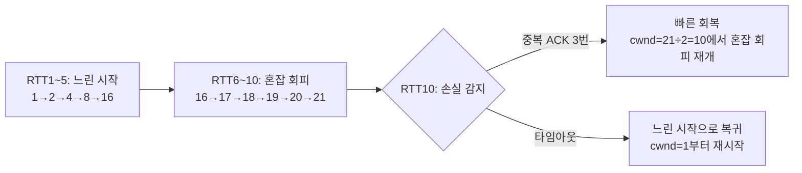

<Callout type="info">
  **이번 문서의 목표:** 이 파일을 다 읽으면 혼잡 윈도우(cwnd)가 느린 시작, 혼잡 회피, 손실 발생 시 각각 어떻게 변하는지 RTT 단위로 직접 계산할 수 있다.
</Callout>

## 왜 혼잡 제어가 필요한가

18편에서 흐름 제어(수신 윈도우)는 **수신 측**의 처리 능력을 보호하는 메커니즘이라고 배웠다. 그런데 수신 측이 아무리 여유가 있어도, 그 사이를 지나가는 라우터와 회선이 감당할 수 있는 양보다 더 많은 데이터를 보내면 어떻게 될까? 라우터의 버퍼가 넘쳐 패킷이 버려지고(패킷 손실), 네트워크 전체 성능이 급격히 떨어지는 **혼잡 붕괴**(congestion collapse)가 일어날 수 있다.

> **쉽게 말하면:** 흐름 제어가 "상대방이 감당할 만큼만 보내는 것"이라면, 혼잡 제어(congestion control)는 "도로(네트워크) 자체가 막히지 않을 만큼만 보내는 것"이다.

문제는 송신 측이 네트워크 내부의 혼잡 상태를 직접 볼 방법이 없다는 것이다. 라우터 버퍼가 얼마나 찼는지, 다른 사용자가 얼마나 트래픽을 쓰는지 송신 측은 알 수 없다. TCP는 이 문제를 **패킷 손실을 혼잡의 신호로 해석**하는 방식으로 우회한다 — "패킷이 유실됐다는 것은 어딘가에서 버퍼가 넘쳤다는 뜻이니, 전송 속도를 줄이자"는 논리다.

## 혼잡 윈도우: 송신 측이 스스로 조절하는 값

**혼잡 윈도우**(cwnd, congestion window)는 송신 측이 확인 응답을 기다리지 않고 한 번에 보낼 수 있다고 스스로 추정하는 데이터의 양이다. 18편에서 배운 수신 윈도우(rwnd)와 이름은 비슷하지만 주체와 목적이 다르다.

- **rwnd**(수신 윈도우) — 수신 측이 "내 버퍼가 이만큼 남았다"고 알려주는 값. 흐름 제어에 사용.
- **cwnd**(혼잡 윈도우) — 송신 측이 "네트워크가 이 정도는 버텨줄 것 같다"고 스스로 추정하는 값. 혼잡 제어에 사용.

실제 송신 측이 한 번에 내보낼 수 있는 데이터 양은 이 둘 중 **더 작은 값**으로 결정된다.

$$
\text{실제 전송 가능량} = \min(\text{cwnd}, \text{rwnd})
$$

이 문서에서는 계산을 단순화하기 위해 cwnd와 ssthresh를 **최대 세그먼트 크기**(MSS, Maximum Segment Size)의 배수, 즉 정수 단위로 표현한다. 예를 들어 cwnd=4는 "한 번에 세그먼트 4개(4×MSS바이트)를 연속으로 보낼 수 있다"는 뜻이다.

## 1단계: 느린 시작(Slow Start)

### 왜 처음부터 크게 보내지 않는가

연결이 갓 시작된 시점에는 송신 측이 네트워크 상태를 전혀 모른다. 그래서 TCP는 아주 작은 값(cwnd=1)에서 시작해 **RTT마다 cwnd를 2배로** 늘려간다. 이름은 "느린 시작"이지만 실제로는 지수적으로 빠르게 증가한다 — "시작할 때는 조심스럽게 1부터 출발한다"는 뜻으로 이해하면 된다.

> **쉽게 말하면:** 낯선 길을 처음 운전할 때 천천히 출발했다가 문제가 없으면 점점 속도를 배로 올리는 것과 같다.

**RTT**(Round-Trip Time, 왕복 시간)는 세그먼트를 보내고 그에 대한 확인 응답이 돌아오기까지 걸리는 시간이다. cwnd 조정은 시간(초) 단위가 아니라 이 RTT를 기준 단위로 이루어진다는 점이 중요하다 — RTT 한 번은 "확인 응답 한 묶음을 받는 주기"를 의미한다.

느린 시작에서 cwnd가 2배씩 느는 이유는, 한 RTT 동안 cwnd개의 세그먼트를 보내면 그만큼의 확인 응답(ACK)이 돌아오는데, 각 ACK마다 cwnd를 1씩 늘리는 규칙 때문이다. cwnd개의 ACK가 도착하면 cwnd가 cwnd만큼 늘어나 결과적으로 두 배(cwnd + cwnd = 2×cwnd)가 된다.

### 언제 느린 시작을 멈추는가

송신 측은 **혼잡 임계값**(ssthresh, slow start threshold)이라는 값을 별도로 관리한다. cwnd가 ssthresh에 도달하면 느린 시작을 멈추고 다음 단계인 혼잡 회피로 전환한다. 이번 예시에서는 ssthresh의 초기값을 16으로 둔다.

## 2단계: 혼잡 회피(Congestion Avoidance)

cwnd가 ssthresh에 도달한 뒤에는 더 이상 2배씩 늘리지 않는다. 대신 **RTT마다 1씩만** 더한다. 지수적 증가에서 선형적 증가로 속도를 크게 줄이는 것이다.

> **쉽게 말하면:** 목적지 근처에 다다르면 과속방지턱을 넘듯 속도를 조심스럽게 올리는 구간이다.

이렇게 조심스럽게 늘리는 이유는, ssthresh 근처는 이전에 혼잡이 감지됐던 지점에 가까워지는 구간이므로 다시 손실이 날 위험이 커지기 때문이다. 손실이 나기 직전까지 최대한 안전하게 전송량을 탐색하는 것이 혼잡 회피의 목적이다.

## 3단계: 손실 감지와 AIMD

혼잡 회피 중에도 언젠가는 실제로 네트워크가 혼잡해져 패킷 손실이 발생한다. 이때 TCP가 반응하는 방식을 **AIMD**(Additive Increase Multiplicative Decrease, 덧셈 증가·곱셈 감소)라고 부른다.

- **덧셈 증가**(Additive Increase) — 손실이 없는 동안은 혼잡 회피 구간에서 RTT마다 cwnd를 1씩 **더한다**.
- **곱셈 감소**(Multiplicative Decrease) — 손실이 감지되면 cwnd를 절반으로 **곱해(×0.5) 줄인다**.

손실을 감지하는 방법에 따라 반응 강도가 다르다.

- **빠른 재전송으로 감지**(중복 ACK 3번) — 네트워크가 완전히 멈춘 것은 아니라고 판단해, ssthresh를 현재 cwnd의 절반으로 낮추고 cwnd도 그 값으로 줄인 뒤 혼잡 회피부터 다시 시작한다(빠른 회복, fast recovery).
- **타임아웃으로 감지**(확인 응답이 아예 오지 않음) — 네트워크 상태를 전혀 알 수 없는 심각한 상황으로 판단해, ssthresh를 현재 cwnd의 절반으로 낮추고 cwnd는 **1로 완전히 초기화**해 느린 시작부터 다시 시작한다.

> **쉽게 말하면:** 중복 ACK로 눈치채면 "속도만 줄이고 계속 달리기", 타임아웃이면 "아예 멈췄다가 처음부터 다시 출발하기"다.

## cwnd 값 변화표: RTT마다 직접 계산

이제 ssthresh 초기값 16, cwnd 초기값 1로 두고 RTT마다 cwnd가 어떻게 변하는지 끝까지 계산한다. 10번째 RTT에서 중복 ACK 3번으로 손실이 감지된다고 가정한다.

### 느린 시작 구간 (RTT 1~5)

cwnd가 2배씩 늘어 ssthresh인 16에 도달할 때까지다.

$$
\text{cwnd}_{n+1} = \text{cwnd}_n \times 2
$$

| RTT | 단계 | 계산 | cwnd(세그먼트 수) |
|-----|------|------|-------------------|
| 1 | 느린 시작 | 시작값 | 1 |
| 2 | 느린 시작 | 1 × 2 | 2 |
| 3 | 느린 시작 | 2 × 2 | 4 |
| 4 | 느린 시작 | 4 × 2 | 8 |
| 5 | 느린 시작 | 8 × 2 | 16 |

RTT 5에서 cwnd가 ssthresh(16)에 도달했으므로, RTT 6부터는 혼잡 회피로 전환한다.

### 혼잡 회피 구간 (RTT 6~10)

cwnd가 RTT마다 1씩만 늘어난다.

$$
\text{cwnd}_{n+1} = \text{cwnd}_n + 1
$$

| RTT | 단계 | 계산 | cwnd(세그먼트 수) |
|-----|------|------|-------------------|
| 6 | 혼잡 회피 | 16 + 1 | 17 |
| 7 | 혼잡 회피 | 17 + 1 | 18 |
| 8 | 혼잡 회피 | 18 + 1 | 19 |
| 9 | 혼잡 회피 | 19 + 1 | 20 |
| 10 | 혼잡 회피 중 손실 감지(중복 ACK 3번) | 20 + 1 | 21 (손실 직전 도달값) |

### 손실 감지 이후 (RTT 10 → RTT 11, 빠른 회복)

RTT 10에서 cwnd=21에 도달한 시점에 중복 ACK 3번으로 손실이 감지됐다. 곱셈 감소를 적용해 새로운 ssthresh와 cwnd를 계산한다.

$$
\text{ssthresh}_{\text{new}} = \frac{\text{cwnd}}{2} = \frac{21}{2} = 10.5 \rightarrow 10
$$

세그먼트는 소수 단위로 나눌 수 없으므로 소수점 이하는 버림(내림) 처리해 정수로 맞춘다.

$$
\text{cwnd}_{\text{new}} = \text{ssthresh}_{\text{new}} = 10
$$

빠른 재전송으로 감지했으므로 cwnd는 1로 초기화되지 않고, 곧바로 새 ssthresh 값인 10에서 혼잡 회피를 재개한다.

| RTT | 단계 | 계산 | cwnd(세그먼트 수) | ssthresh |
|-----|------|------|-------------------|----------|
| 10(손실 직후) | 곱셈 감소 | 21 ÷ 2 = 10.5 → 10 | 10 | 10 |
| 11 | 혼잡 회피 재개 | 10 + 1 | 11 | 10 |
| 12 | 혼잡 회피 | 11 + 1 | 12 | 10 |

### 만약 타임아웃으로 손실을 감지했다면

같은 RTT 10, cwnd=21 시점에 중복 ACK가 아니라 **타임아웃**으로 손실을 감지했다면 계산이 달라진다. ssthresh는 똑같이 cwnd의 절반(10)으로 낮추지만, cwnd 자체는 1로 완전히 초기화하고 느린 시작부터 다시 밟는다.

| RTT | 단계 | 계산 | cwnd(세그먼트 수) | ssthresh |
|-----|------|------|-------------------|----------|
| 10(타임아웃 직후) | cwnd 초기화 | 1로 리셋 | 1 | 10 |
| 11 | 느린 시작 | 1 × 2 | 2 | 10 |
| 12 | 느린 시작 | 2 × 2 | 4 | 10 |
| 13 | 느린 시작 | 4 × 2 | 8 | 10 |
| 14 | 느린 시작 → 혼잡 회피 전환 | 8 × 2 = 16이나 ssthresh(10) 초과 예정이므로 10에서 전환 | 10 | 10 |

여기서 주의할 점은, 느린 시작 중이라도 cwnd가 ssthresh를 넘어서는 순간 즉시 혼잡 회피로 전환한다는 것이다. RTT 13에서 cwnd=8이고 다음 배수(16)가 ssthresh(10)를 넘으므로, RTT 14에서는 8을 2배로 늘리는 대신 ssthresh 지점인 10까지만 늘리고 혼잡 회피 모드로 넘어간다.

### 전체 흐름 그래프로 보는 cwnd 변화

이 표와 그래프에서 확인할 수 있듯, cwnd는 **톱니 모양**(sawtooth)으로 움직인다. 손실이 나기 전까지는 계속 증가하다가(처음엔 지수적으로, 이후엔 선형적으로), 손실이 나는 순간 뚝 떨어진 뒤 다시 증가를 반복한다. 이 톱니 모양 그래프는 TCP 혼잡 제어를 설명하는 대표적인 그림으로 시험에도 자주 인용된다.

### 자주 틀리는 점

- **"느린 시작이라서 계속 느리게 증가한다"는 착각** — 이름과 달리 느린 시작 구간은 RTT마다 2배씩, 즉 **지수적으로** 빠르게 증가한다. "느리다"는 것은 cwnd=1이라는 시작점이 조심스럽다는 뜻이지, 증가 속도가 느리다는 뜻이 아니다.
- **혼잡 회피가 감소 단계라는 착각** — 혼잡 회피도 cwnd가 계속 **증가**하는 단계다. 다만 그 증가 폭이 1(선형)로 줄어들 뿐이다.
- **손실 시 항상 cwnd가 1로 초기화된다는 착각** — 빠른 재전송(중복 ACK)으로 감지했을 때는 cwnd를 1이 아니라 절반으로만 줄이고 혼잡 회피를 재개한다. cwnd가 1로 완전히 초기화되는 것은 타임아웃으로 감지했을 때뿐이다.
- **ssthresh와 cwnd를 같은 값으로 혼동** — ssthresh는 "느린 시작을 멈추는 기준선"이고 cwnd는 "지금 실제로 보낼 수 있는 양"이다. 손실 후에는 두 값이 같아지는 순간이 있을 뿐, 항상 같은 값은 아니다.
- **cwnd 단위를 RTT(시간)와 혼동** — cwnd는 "한 번에 보낼 수 있는 세그먼트 개수"이고, RTT는 "그 세그먼트들에 대한 확인 응답이 돌아오는 주기"다. 서로 다른 종류의 값이다.

## 핵심 정리

- 혼잡 제어는 송신 측이 스스로 추정하는 혼잡 윈도우(cwnd)로 네트워크 경로 전체의 혼잡을 방지하는 메커니즘이며, 흐름 제어(rwnd)와는 조절 대상이 다르다.
- 느린 시작은 cwnd=1에서 시작해 RTT마다 2배씩(지수적) 증가하다가 ssthresh에 도달하면 혼잡 회피로 전환한다.
- 혼잡 회피는 RTT마다 1씩(선형) 증가하며 손실이 나기 직전까지 조심스럽게 전송량을 늘린다.
- AIMD 원칙에 따라 손실이 감지되면 ssthresh를 현재 cwnd의 절반으로 낮추고, 빠른 재전송이면 cwnd를 그 절반 값으로, 타임아웃이면 cwnd를 1로 초기화한다.
- 이 반복이 cwnd의 톱니 모양(sawtooth) 그래프를 만들며, 이는 TCP가 네트워크 용량을 계속 탐색하면서도 손실 시 즉각 물러서는 방식으로 안정성을 유지함을 보여준다.

## 마무리 복습

<Quiz
  questionNumber={1}
  question="TCP 느린 시작(Slow Start) 단계에 대한 설명으로 옳은 것은?"
  options={['cwnd가 RTT마다 1씩 증가한다', 'cwnd가 RTT마다 2배씩(지수적으로) 증가한다', 'cwnd가 항상 ssthresh보다 크게 유지된다', '느린 시작 단계에서는 손실이 발생하지 않는다']}
  correctAnswer={2}
  explanation="느린 시작은 cwnd=1에서 출발해 RTT마다 2배씩 지수적으로 증가한다. 이름과 달리 증가 속도 자체는 빠르며, cwnd가 ssthresh에 도달하면 혼잡 회피로 전환된다."
  optionExplanations={['틀림 — RTT마다 1씩 증가하는 것은 혼잡 회피 단계의 특징이다', '정답 — 느린 시작은 RTT마다 cwnd를 2배로 늘리는 지수적 증가 단계다', '틀림 — cwnd는 ssthresh에 도달하면 혼잡 회피로 전환되므로 항상 더 크게 유지되지 않는다', '틀림 — 느린 시작 단계에서도 손실은 발생할 수 있으며, 이 경우도 AIMD의 감소 규칙이 적용된다']}
/>

<Quiz
  questionNumber={2}
  question="ssthresh=16, cwnd=1로 느린 시작을 시작했을 때, cwnd가 처음으로 16에 도달하는 시점은 몇 번째 RTT인가?"
  options={['3번째 RTT', '4번째 RTT', '5번째 RTT', '6번째 RTT']}
  correctAnswer={3}
  explanation="cwnd는 1(RTT1) → 2(RTT2) → 4(RTT3) → 8(RTT4) → 16(RTT5)의 순서로 2배씩 증가한다. 따라서 cwnd가 처음 16에 도달하는 시점은 5번째 RTT다."
  optionExplanations={['틀림 — 3번째 RTT에서 cwnd는 4다', '틀림 — 4번째 RTT에서 cwnd는 8이다', '정답 — 1→2→4→8→16으로 다섯 번째 RTT에서 16에 도달한다', '틀림 — 5번째 RTT에서 이미 16에 도달했으므로 6번째 RTT는 혼잡 회피 단계로 17이 된다']}
/>

<Quiz
  questionNumber={3}
  question="혼잡 회피(Congestion Avoidance) 단계에서 cwnd=19인 상태로 다음 RTT를 맞이했다. 손실 없이 정상적으로 진행됐다면 다음 RTT의 cwnd 값은?"
  options={['20', '38', '19', '16']}
  correctAnswer={1}
  explanation="혼잡 회피 단계에서는 손실이 없는 한 RTT마다 cwnd가 1씩만 증가한다. 따라서 19에서 다음 RTT는 19+1=20이 된다. 38(두 배)이 되는 것은 느린 시작 단계의 규칙이다."
  optionExplanations={['정답 — 혼잡 회피는 덧셈 증가(Additive Increase) 규칙에 따라 1씩만 늘어난다', '틀림 — 2배로 늘어나는 것은 느린 시작 단계의 규칙이지 혼잡 회피가 아니다', '틀림 — 손실 없이 정상 진행 중이므로 cwnd는 그대로 유지되지 않고 1 증가한다', '틀림 — 16은 ssthresh 값이며 다음 RTT의 cwnd 계산과는 무관하다']}
/>

<Quiz
  questionNumber={4}
  question="cwnd=21일 때 중복 ACK 3번(빠른 재전송)으로 손실이 감지됐다. AIMD 규칙에 따른 새로운 ssthresh와 cwnd 값으로 옳은 것은?"
  options={['ssthresh=21, cwnd=21로 변화 없음', 'ssthresh=10, cwnd=1로 완전히 초기화', 'ssthresh=10, cwnd=10에서 혼잡 회피 재개', 'ssthresh=42, cwnd=42로 두 배 증가']}
  correctAnswer={3}
  explanation="곱셈 감소 규칙에 따라 새 ssthresh는 현재 cwnd의 절반인 21÷2=10.5를 내림해 10이 된다. 빠른 재전송으로 감지했으므로 cwnd도 1로 초기화하지 않고 곧바로 새 ssthresh 값인 10으로 줄여 혼잡 회피를 재개한다."
  optionExplanations={['틀림 — 손실이 감지됐으므로 곱셈 감소가 적용돼야 하며 값이 그대로 유지되지 않는다', '틀림 — cwnd를 1로 초기화하는 것은 타임아웃으로 감지했을 때의 규칙이다', '정답 — 21의 절반인 10.5를 내림한 10을 새 ssthresh와 cwnd로 사용해 혼잡 회피를 재개한다', '틀림 — 손실 감지 시 cwnd는 증가가 아니라 감소해야 한다']}
/>

<Quiz
  questionNumber={5}
  question="같은 cwnd=21 시점에 중복 ACK가 아니라 타임아웃으로 손실을 감지했다면, 빠른 재전송으로 감지한 경우와 비교했을 때 가장 정확한 차이는?"
  options={['ssthresh 계산 방식이 달라진다', 'cwnd가 1로 완전히 초기화되어 느린 시작부터 다시 시작한다', 'cwnd가 즉시 0이 되어 연결이 종료된다', '타임아웃 시에는 ssthresh를 그대로 유지한다']}
  correctAnswer={2}
  explanation="타임아웃으로 손실을 감지하면 네트워크 상태를 전혀 파악할 수 없는 심각한 상황으로 보아 cwnd를 1로 완전히 초기화하고 느린 시작부터 다시 진행한다. ssthresh를 현재 cwnd의 절반으로 낮추는 것은 빠른 재전송과 동일하다."
  optionExplanations={['틀림 — ssthresh를 현재 cwnd의 절반으로 낮추는 계산 방식 자체는 두 경우 동일하다', '정답 — 타임아웃은 더 심각한 신호로 간주되어 cwnd를 1로 초기화하고 느린 시작부터 재시작한다', '틀림 — cwnd가 0이 되어 연결이 끊기는 것이 아니라 1로 초기화될 뿐, 연결 자체는 유지된다', '틀림 — 타임아웃 시에도 ssthresh는 현재 cwnd의 절반으로 낮아진다']}
/>

<Quiz
  questionNumber={6}
  question="TCP 혼잡 윈도우(cwnd)의 시간에 따른 변화 그래프가 톱니 모양(sawtooth)으로 나타나는 이유로 가장 적절한 것은?"
  options={['수신 윈도우 값이 주기적으로 0이 되기 때문이다', '느린 시작과 혼잡 회피로 계속 증가하다가 손실 시 급격히 줄어드는 과정이 반복되기 때문이다', 'RTT 값 자체가 톱니 모양으로 변하기 때문이다', '포트 번호가 주기적으로 재할당되기 때문이다']}
  correctAnswer={2}
  explanation="cwnd는 느린 시작(지수 증가)과 혼잡 회피(선형 증가)를 거치며 계속 커지다가, 손실이 감지되는 순간 곱셈 감소로 급격히 줄어든다. 이 증가와 급락이 반복되면서 그래프가 톱니 모양을 이룬다."
  optionExplanations={['틀림 — 수신 윈도우는 흐름 제어의 값으로 cwnd의 톱니 모양과는 별개의 메커니즘이다', '정답 — AIMD의 덧셈 증가와 곱셈 감소가 반복되며 톱니 모양을 만든다', '틀림 — RTT는 확인 응답 왕복 시간일 뿐 그 자체가 톱니 모양으로 변하는 값이 아니다', '틀림 — 포트 번호 재할당은 혼잡 제어와 관련이 없다']}
/>

## 참고 자료

- [MDN Web Docs - TCP](https://developer.mozilla.org/)
- [IETF RFC 5681 - TCP Congestion Control](https://www.rfc-editor.org/rfc/rfc5681)
