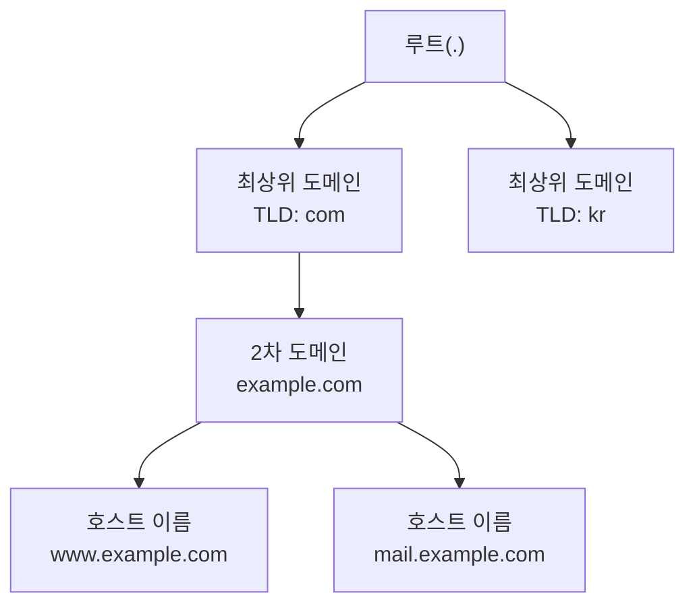
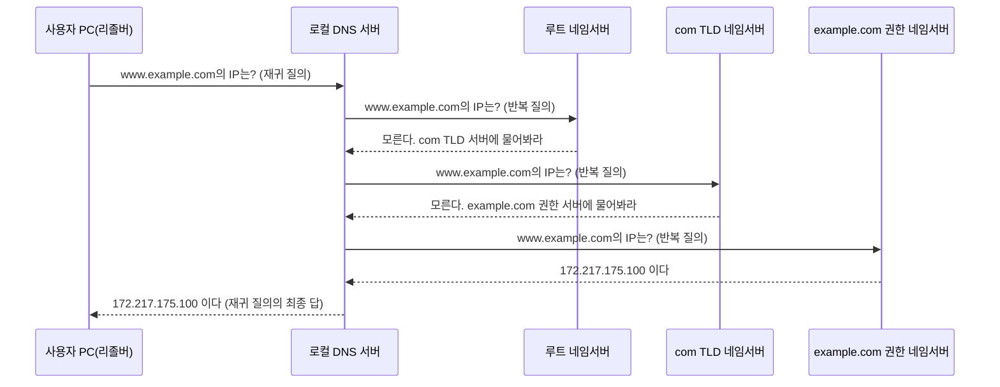
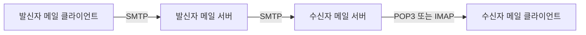

<Callout type="info">
  **이번 문서의 목표:** 이 문서를 다 읽으면 DNS가 도메인 이름을 IP 주소로 바꾸는 과정을 재귀 질의와 반복 질의로 구분해 설명하고, 이메일을 보낼 때와 받을 때 각각 다른 프로토콜(SMTP, POP3, IMAP)이 쓰이는 이유와 차이를 비교할 수 있게 됩니다.
</Callout>

## 왜 응용 계층부터 다시 보는가

지금까지는 아래 계층(물리·데이터링크·네트워크·전송)이 데이터를 "어떻게 옮기는가"를 다뤘습니다. 하지만 사람이 실제로 마주하는 것은 웹 브라우저 주소창에 `www.example.com`을 치는 행위, 이메일을 보내고 받는 행위입니다. 이 행위 뒤에서 동작하는 규칙이 **응용 계층**(application layer) 프로토콜입니다.

응용 계층은 03편에서 다룬 TCP/IP 4계층 모델의 맨 위층으로, OSI 7계층의 세션·표현·응용 계층 역할을 뭉쳐서 담당합니다(자세한 계층 대응은 03편 참고). 이 계층의 프로토콜은 대부분 전송 계층으로 TCP나 UDP를 그대로 빌려 쓰고(17편), 그 위에 "무엇을 주고받을지"에 대한 약속만 추가로 얹습니다.

## 1. DNS — 이름을 주소로 바꾸는 전화번호부

### 왜 필요한가

네트워크 계층(12편)에서 배웠듯, 인터넷에서 실제로 패킷을 주고받으려면 IP 주소가 있어야 합니다. 그런데 사람은 `172.217.175.100` 같은 숫자를 기억하지 못합니다. 이름은 기억하지만 기계는 이름으로 길을 찾지 못하는 이 간극을 메우는 것이 **DNS**(Domain Name System, 도메인 이름 시스템)입니다.

> **쉽게 말하면:** DNS는 전화번호부입니다. 사람 이름(도메인 이름)을 알려주면 전화번호(IP 주소)를 찾아줍니다.

### 도메인 이름의 계층 구조

DNS의 이름 공간은 나무(tree) 구조입니다. `www.example.com`을 오른쪽부터 읽으면 계층이 보입니다.

- **루트**(root): 이름 없이 점(`.`) 하나로 표현되는 최상위 노드. 사실 모든 도메인 이름 끝에는 생략된 점이 하나 더 있습니다(`www.example.com.`).
- **최상위 도메인**(TLD, Top-Level Domain): `com`, `org`, `kr`처럼 루트 바로 아래 계층. 국가 코드(`kr`, `jp`)와 일반 목적(`com`, `org`)으로 나뉩니다.
- **2차 도메인**(second-level domain): 조직이 실제로 등록해 사용하는 이름, 예를 들면 `example.com`.
- **호스트 이름**(host name): 그 조직 안에서 특정 서버를 가리키는 이름, 예를 들면 `www`나 `mail`.

이 계층 구조 덕분에 DNS는 **분산 데이터베이스**로 운영될 수 있습니다. 전 세계 모든 도메인 이름을 한 서버가 관리하는 것이 아니라, 각 계층을 책임지는 **네임서버**(name server)가 나뉘어 있고, 각 네임서버는 자기 하위 영역(zone, 존)만 정확히 알면 됩니다.

### 재귀 질의와 반복 질의

이름을 실제로 찾는 과정에서 질의(query) 방식이 두 가지로 나뉘는 것이 시험에서 자주 나오는 포인트입니다.

- **재귀 질의**(recursive query): 질의를 받은 서버가 답을 모르면, **자신이 대신 다른 서버에 물어서** 최종 답을 찾아 돌려줍니다. 클라이언트 입장에서는 한 번 묻고 최종 답만 받습니다.
- **반복 질의**(iterative query): 질의를 받은 서버가 답을 모르면, "**나는 모르니 이 서버에 물어봐라**"라며 다른 서버의 주소만 알려줍니다. 질의한 쪽이 직접 다음 서버에 다시 물어야 합니다.

실제 DNS 조회는 이 둘이 섞여서 일어납니다. 일반 사용자의 PC(리졸버, resolver)는 보통 **로컬 DNS 서버**(local DNS server, 흔히 ISP가 제공)에게 재귀 질의를 보냅니다. 로컬 DNS 서버는 답을 모르면 루트 → TLD → 권한(authoritative) 네임서버 순서로 반복 질의를 이어가며 답을 찾아, 최종적으로 사용자에게 재귀 질의의 답을 돌려줍니다.

<Callout type="warning">
  **자주 틀리는 점:** "재귀 질의 = 여러 서버를 거친다", "반복 질의 = 한 번만 묻는다"로 거꾸로 외우는 경우가 많습니다. 핵심은 **누가 다음 질문을 던지느냐**입니다. 재귀 질의는 질문을 받은 서버가 책임지고 답을 찾아 오고, 반복 질의는 질문한 쪽이 계속 다른 서버를 찾아다닙니다. 로컬 DNS 서버가 상위 서버들에게 보내는 질의는 반복 질의이지만, 그 상위 서버들이 각자 또 다른 서버에 물어보러 다니지는 않는다는 점도 함께 기억해야 합니다(권한 있는 답 또는 "모른다"만 돌려줍니다).
</Callout>

한 번 찾은 결과는 **캐싱**(caching, 임시 저장)되어 재사용됩니다. DNS 레코드에는 **TTL**(Time To Live, 생존 시간)이 붙어 있어, 이 시간이 지나기 전까지는 다시 질의하지 않고 캐시된 값을 씁니다. TTL을 짧게 두면 변경 사항이 빨리 반영되지만 질의 트래픽이 늘고, 길게 두면 질의는 줄지만 변경 반영이 늦어지는 트레이드오프가 있습니다.

### 주요 레코드 타입

DNS가 저장하는 정보는 레코드(record) 단위입니다. 시험에 자주 등장하는 몇 가지만 정리합니다.

| 레코드 | 의미 | 예시 |
|--------|------|------|
| A | 도메인 이름을 IPv4 주소로 매핑 | `example.com → 93.184.216.34` |
| AAAA | 도메인 이름을 IPv6 주소로 매핑 | `example.com → 2606:2800:220:1::` |
| CNAME | 도메인 이름을 다른 도메인 이름의 별칭으로 지정 | `www.example.com → example.com` |
| MX | 그 도메인의 메일 서버 지정 | `example.com → mail.example.com` |
| NS | 그 영역을 담당하는 네임서버 지정 | `example.com → ns1.example.com` |

## 2. 이메일 프로토콜 — 보내기와 받기는 다른 문제다

### 왜 프로토콜이 여러 개인가

이메일을 주고받는 과정은 우편 제도와 비슷합니다. 편지를 우체통에 넣는 것(보내기)과 우편함에서 편지를 꺼내는 것(받기)은 서로 다른 절차입니다. 이메일도 마찬가지로 **보내는 프로토콜**과 **받는 프로토콜**이 분리되어 있습니다.

> **쉽게 말하면:** 메일을 보낼 때는 우체국(SMTP)에 맡기고, 메일을 받을 때는 내 우편함(POP3, IMAP)을 확인합니다. 우체국 직원과 우편함 관리인은 하는 일이 다릅니다.

### SMTP — 메일을 보내는 프로토콜

**SMTP**(Simple Mail Transfer Protocol, 단순 메일 전송 규약)는 메일을 **발신 클라이언트에서 발신 서버로**, 그리고 **발신 서버에서 수신 서버로** 전달할 때 쓰는 프로토콜입니다. 기본 포트는 25번입니다.

SMTP는 이름 그대로 단순한 텍스트 명령 기반 프로토콜입니다. `HELO`(또는 `EHLO`)로 인사하고, `MAIL FROM`으로 발신자를, `RCPT TO`로 수신자를 알린 뒤, `DATA`로 본문을 전송합니다. 이 흐름 자체가 "메일을 계속 다음 서버로 넘겨주는" 릴레이(relay) 구조라는 점이 핵심입니다.

<Callout type="warning">
  **자주 틀리는 점:** SMTP는 메일을 **보내는 데만** 쓰입니다. 수신자가 자기 메일함에서 메일을 꺼내 올 때는 SMTP를 쓰지 않습니다. "SMTP로 메일을 확인한다"는 표현이 나오면 틀린 진술입니다.
</Callout>

### POP3 — 받아서 내려받고 지운다

**POP3**(Post Office Protocol version 3, 우체국 프로토콜 3판)는 메일 서버에 도착한 메일을 클라이언트로 **다운로드**하는 프로토콜입니다. 기본 포트는 110번입니다.

POP3의 기본 동작 방식은 "메일을 받아오면 서버에서는 삭제한다"입니다(설정으로 서버에 사본을 남길 수도 있지만 기본 개념은 다운로드 후 삭제입니다). 그래서 한 대의 컴퓨터로 메일을 내려받으면, 다른 기기에서는 그 메일을 다시 볼 수 없는 경우가 많습니다.

### IMAP — 서버에 두고 여러 기기에서 본다

**IMAP**(Internet Message Access Protocol, 인터넷 메시지 접근 규약)도 메일을 받아오는 프로토콜이지만, 철학이 다릅니다. 기본 포트는 143번입니다.

IMAP은 메일을 **서버에 그대로 둔 채로** 클라이언트가 그 내용을 조회·검색·정리합니다. 읽음 표시, 폴더 이동 같은 작업도 서버에 반영되기 때문에, 스마트폰과 PC에서 같은 메일함을 열어도 항상 같은 상태를 봅니다.

### 세 프로토콜 비교

| 구분 | SMTP | POP3 | IMAP |
|------|------|------|------|
| 방향 | 보내기 | 받기 | 받기 |
| 기본 포트 | 25 | 110 | 143 |
| 서버에 메일 보관 | 해당 없음(전달만) | 기본은 다운로드 후 삭제 | 서버에 계속 보관 |
| 여러 기기 동기화 | 해당 없음 | 어려움 | 쉬움(상태가 서버 기준) |
| 특징 | 릴레이 구조로 다음 서버에 전달 | 단순, 오프라인 사용에 적합 | 폴더·검색 등 서버 측 관리 기능 풍부 |

<Callout type="warning">
  **자주 틀리는 점:** POP3와 IMAP을 "둘 다 받는 프로토콜"이라고 뭉뚱그리면 "메일 보관 위치"를 묻는 문제를 틀립니다. POP3는 원칙적으로 **클라이언트 로컬**에 메일이 남고, IMAP은 **서버**에 메일이 남는다는 차이를 정확히 구분해야 합니다.
</Callout>

## 3. 잘 알려진 포트 번호

**잘 알려진 포트**(well-known port)는 0번부터 1023번까지의 범위로, 특정 서비스가 관례적으로 고정해 사용하는 포트 번호입니다. 전송 계층(17편)에서 포트는 "같은 IP 주소 안에서 어떤 프로그램에게 데이터를 전달할지" 구분하는 번호였음을 떠올리면, 왜 서비스마다 정해진 포트가 필요한지 이해가 됩니다 — 클라이언트가 "메일 서버에 접속하겠다"고 할 때마다 포트 번호를 새로 묻지 않아도 되기 때문입니다.

| 프로토콜 | 포트 번호 | 용도 |
|----------|-----------|------|
| FTP(제어) | 21 | 파일 전송 명령 채널 |
| FTP(데이터) | 20 | 파일 전송 데이터 채널 |
| SSH | 22 | 원격 접속(암호화) |
| SMTP | 25 | 메일 전송 |
| DNS | 53 | 이름 해석 질의 |
| DHCP(서버) | 67 | 주소 할당 서버 |
| DHCP(클라이언트) | 68 | 주소 할당 클라이언트 |
| HTTP | 80 | 웹 통신 |
| POP3 | 110 | 메일 수신(다운로드형) |
| IMAP | 143 | 메일 수신(서버 보관형) |
| HTTPS | 443 | 암호화된 웹 통신 |

이 표는 21편(HTTP·FTP·DHCP)에서도 이어서 참조하니, 숫자 자체를 외우기보다는 "25는 보내기, 110·143은 받기"처럼 역할과 묶어서 기억하면 헷갈리지 않습니다.

## 핵심 정리

- DNS는 도메인 이름을 IP 주소로 바꾸는 분산 데이터베이스이며, 이름 공간은 루트 → TLD → 2차 도메인 → 호스트 이름의 나무 구조다.
- 재귀 질의는 질의받은 서버가 대신 답을 찾아오고, 반복 질의는 질의한 쪽이 다음 서버를 직접 찾아간다. 일반적인 이름 해석은 클라이언트-로컬 DNS 서버 구간은 재귀, 로컬 DNS 서버-상위 서버 구간은 반복으로 섞여 일어난다.
- SMTP는 메일을 보내는 릴레이 프로토콜(포트 25)이고, POP3(포트 110)는 받은 뒤 서버에서 삭제하는 방식, IMAP(포트 143)은 서버에 보관한 채 여러 기기에서 동기화하는 방식이다.
- 잘 알려진 포트 번호(FTP 20/21, SSH 22, SMTP 25, DNS 53, DHCP 67/68, HTTP 80, POP3 110, IMAP 143, HTTPS 443)는 시험에서 프로토콜 이름과 포트를 짝짓는 문제로 자주 나온다.

## 마무리 복습

<Quiz
  questionNumber={1}
  question="DNS의 재귀 질의(recursive query)에 대한 설명으로 옳은 것은?"
  options={['질의를 받은 서버가 답을 모르면 다른 서버 주소만 알려준다', '질의를 받은 서버가 답을 모르면 대신 다른 서버에 물어서 최종 답을 찾아 돌려준다', '질의한 클라이언트가 직접 여러 서버를 순회하며 답을 찾는다', '루트 네임서버만 사용하는 질의 방식이다']}
  correctAnswer={2}
  explanation="재귀 질의는 질의를 받은 서버가 책임지고 다른 서버에 대신 물어서 최종 답을 찾아 요청자에게 돌려주는 방식이다. 반면 반복 질의는 질의한 쪽이 직접 다음 서버를 찾아다녀야 한다."
  optionExplanations={['이는 반복 질의에 대한 설명이다', '정답이다. 재귀 질의는 서버가 대신 답을 찾아온다', '이는 반복 질의의 특징이다. 재귀 질의에서는 클라이언트가 한 번만 묻는다', '루트 네임서버 사용 여부는 재귀·반복 구분과 무관하다']}
/>

<Quiz
  questionNumber={2}
  question="도메인 이름 www.example.com에서 최상위 도메인(TLD)에 해당하는 부분은?"
  options={['www', 'example', 'com', 'example.com']}
  correctAnswer={3}
  explanation="최상위 도메인(TLD)은 루트 바로 아래 계층으로, www.example.com에서는 com이 이에 해당한다. example은 2차 도메인, www는 호스트 이름이다."
  optionExplanations={['www는 호스트 이름이다', 'example만으로는 TLD가 아니라 2차 도메인의 일부다', '정답이다. com이 최상위 도메인이다', 'example.com은 2차 도메인 전체를 가리키는 표현이다']}
/>

<Quiz
  questionNumber={3}
  question="이메일 프로토콜에 대한 설명으로 옳지 않은 것은?"
  options={['SMTP는 메일을 발신 서버에서 수신 서버로 전달하는 릴레이 구조를 가진다', 'POP3는 기본적으로 메일을 클라이언트로 내려받은 뒤 서버에서 삭제한다', 'IMAP은 메일을 서버에 두고 여러 기기에서 같은 상태로 접근할 수 있게 한다', 'SMTP는 메일을 수신하고 확인할 때 사용하는 프로토콜이다']}
  correctAnswer={4}
  explanation="SMTP는 메일을 보내는(전송하는) 프로토콜이며, 수신자가 메일을 확인하거나 내려받는 데는 사용되지 않는다. 수신에는 POP3나 IMAP이 쓰인다."
  optionExplanations={['옳은 설명이다. SMTP는 릴레이 방식으로 다음 서버에 메일을 전달한다', '옳은 설명이다. POP3의 기본 동작은 다운로드 후 삭제다', '옳은 설명이다. IMAP은 서버 기준으로 상태를 동기화한다', '정답이다. SMTP는 보내기 전용이며 수신 확인에는 쓰이지 않는다']}
/>

<Quiz
  questionNumber={4}
  question="POP3와 IMAP의 가장 근본적인 차이는 무엇인가?"
  options={['사용하는 전송 계층 프로토콜(TCP·UDP)이 다르다', '메일을 서버에 보관하는지 여부와 여러 기기 간 동기화 방식이 다르다', 'POP3만 암호화를 지원한다', 'IMAP은 메일을 보내는 데만 사용된다']}
  correctAnswer={2}
  explanation="POP3는 기본적으로 메일을 로컬로 내려받고 서버에서 삭제하는 반면, IMAP은 메일을 서버에 유지하며 여러 기기에서 같은 상태를 공유한다. 이 보관 위치와 동기화 방식의 차이가 두 프로토콜의 근본적인 차이다."
  optionExplanations={['둘 다 TCP를 전송 계층으로 사용한다', '정답이다. 서버 보관 여부와 동기화 방식이 핵심 차이다', '암호화 지원 여부는 확장(SSL/TLS 적용)의 문제이지 두 프로토콜의 근본 차이가 아니다', 'IMAP도 POP3와 마찬가지로 받기 프로토콜이며 보내기는 SMTP가 담당한다']}
/>

<Quiz
  questionNumber={5}
  question="다음 중 프로토콜과 기본 포트 번호가 올바르게 짝지어지지 않은 것은?"
  options={['SMTP – 25', 'DNS – 53', 'POP3 – 143', 'HTTPS – 443']}
  correctAnswer={3}
  explanation="POP3의 기본 포트는 110번이다. 143번은 IMAP의 기본 포트다. 나머지 짝은 모두 올바르다."
  optionExplanations={['SMTP의 기본 포트는 실제로 25번이 맞다', 'DNS의 기본 포트는 실제로 53번이 맞다', '정답이다. POP3는 110번, 143번은 IMAP의 포트다', 'HTTPS의 기본 포트는 실제로 443번이 맞다']}
/>

<Quiz
  questionNumber={6}
  question="DNS 레코드 중 도메인 이름을 다른 도메인 이름의 별칭으로 지정할 때 사용하는 레코드 타입은?"
  options={['A', 'MX', 'CNAME', 'NS']}
  correctAnswer={3}
  explanation="CNAME 레코드는 한 도메인 이름을 다른 도메인 이름의 별칭(canonical name)으로 지정한다. A 레코드는 IPv4 주소 매핑, MX는 메일 서버 지정, NS는 담당 네임서버 지정에 사용된다."
  optionExplanations={['A 레코드는 도메인 이름을 IPv4 주소로 매핑한다', 'MX 레코드는 해당 도메인의 메일 서버를 지정한다', '정답이다. CNAME은 별칭 지정에 사용된다', 'NS 레코드는 해당 영역을 담당하는 네임서버를 지정한다']}
/>

## 참고 자료

- [IETF RFC 1034 / 1035 - DNS](https://www.rfc-editor.org/rfc/rfc1034)
- [IANA Service Name and Transport Protocol Port Number Registry](https://www.iana.org/assignments/service-names-port-numbers/service-names-port-numbers.xhtml)
