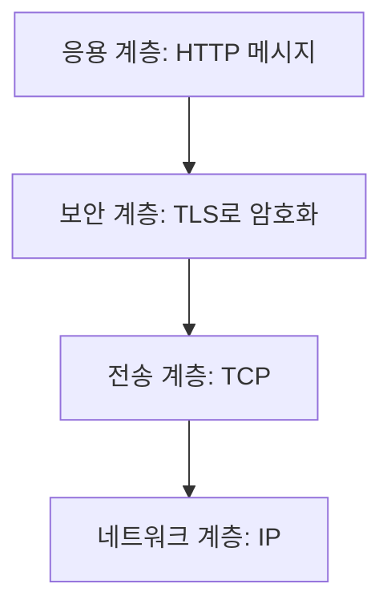
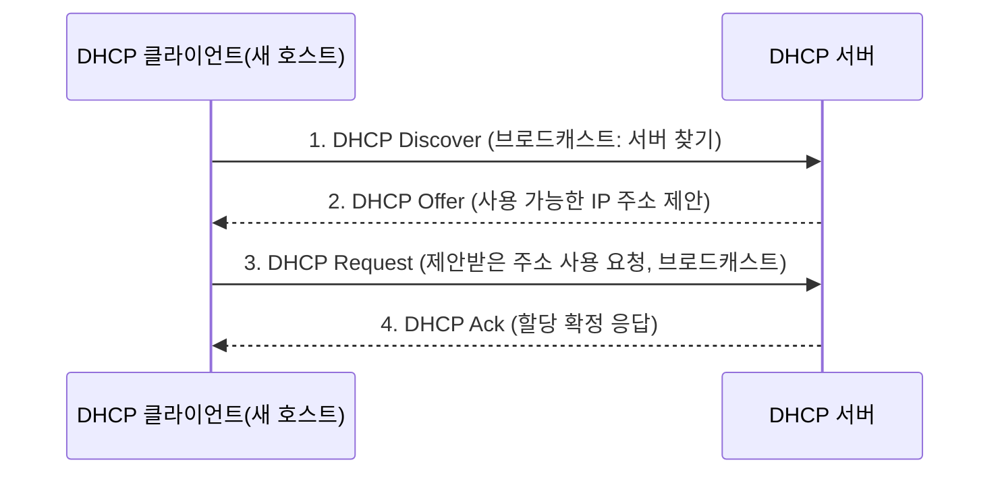

<Callout type="info">
  **이번 문서의 목표:** 이 문서를 다 읽으면 HTTP 요청·응답 메시지의 구조와 상태 코드 계열을 설명하고, FTP가 왜 연결을 두 개 쓰는지, DHCP가 IP 주소를 할당하는 4단계(DORA) 절차를 순서대로 말할 수 있게 됩니다.
</Callout>

## 왜 이 세 프로토콜을 묶는가

20편에서 DNS로 이름을 주소로 바꾸고, 이메일 프로토콜의 보내기·받기 구분을 봤습니다. 이번 편의 세 프로토콜은 성격이 다르지만 독학사 3단계 시험에서 **응용 계층 대표 프로토콜**로 함께 묶여 출제되는 경우가 많습니다.

- **HTTP·HTTPS**: 웹 페이지를 주고받는 프로토콜
- **FTP**: 파일을 전송하는 프로토콜
- **DHCP**: 네트워크에 접속한 호스트에게 IP 주소를 자동으로 나눠주는 프로토콜

셋 다 응용 계층에서 동작하지만, HTTP·FTP는 전송 계층으로 TCP를 쓰고, DHCP는 UDP를 씁니다(17편에서 다룬 TCP·UDP의 성격 차이가 왜 이렇게 갈리는지 이해하는 실마리입니다 — DHCP는 아직 IP 주소도 없는 상태에서 짧은 메시지를 주고받아야 하므로 연결 설정이 필요 없는 UDP가 어울립니다).

## 1. HTTP와 HTTPS

### 요청-응답 구조

**HTTP**(HyperText Transfer Protocol, 하이퍼텍스트 전송 규약)는 웹 브라우저(클라이언트)와 웹 서버가 문서를 주고받는 약속입니다. 기본 포트는 80번입니다.

HTTP의 뼈대는 **요청-응답**(request-response) 구조입니다. 클라이언트가 먼저 요청을 보내야만 서버가 응답합니다. 서버가 먼저 클라이언트에게 데이터를 보내는 일은 없습니다.

요청 메시지는 다음과 같은 형태입니다.

```http
GET /index.html HTTP/1.1
Host: www.example.com
Accept: text/html
```

- **시작 줄**: `메서드 경로 버전` 순서로, `GET /index.html HTTP/1.1`은 "1.1 버전 프로토콜로 /index.html을 달라"는 뜻입니다.
- **헤더**(header): `이름: 값` 형태의 부가 정보. `Host`는 어느 도메인에 대한 요청인지, `Accept`는 어떤 형식의 응답을 원하는지 알려줍니다.
- **본문**(body): GET 요청처럼 조회만 하는 경우 보통 본문이 없습니다.

응답 메시지는 다음과 같습니다.

```http
HTTP/1.1 200 OK
Content-Type: text/html
Content-Length: 1024

<html>...</html>
```

- **상태 줄**: `버전 상태 코드 설명 문구` 순서로, `200 OK`는 "요청이 성공했다"는 뜻입니다.
- **헤더**: 응답 본문의 형식(`Content-Type`)과 크기(`Content-Length`) 등을 알려줍니다.
- **본문**: 실제로 요청한 문서나 데이터.

> **쉽게 말하면:** HTTP는 손님(클라이언트)이 먼저 주문서를 내밀고(요청), 종업원(서버)이 음식을 내오는(응답) 식당과 같습니다. 종업원이 손님보다 먼저 음식을 내오는 일은 없습니다.

### 상태 코드 계열

**상태 코드**(status code)는 세 자리 숫자로, 첫 자리 숫자가 응답의 성격을 나타내는 계열(class)을 결정합니다. 이 계열 구분이 시험에서 자주 나옵니다.

| 계열 | 의미 | 대표 코드 |
|------|------|-----------|
| 1xx | 정보성(informational), 요청을 받았고 처리를 계속 진행 중 | 100 Continue |
| 2xx | 성공(success), 요청이 정상적으로 처리됨 | 200 OK, 201 Created |
| 3xx | 리다이렉션(redirection), 추가 동작이 필요함 | 301 Moved Permanently, 302 Found |
| 4xx | 클라이언트 오류(client error), 요청 자체에 문제가 있음 | 404 Not Found, 400 Bad Request |
| 5xx | 서버 오류(server error), 서버 쪽에서 처리에 실패함 | 500 Internal Server Error |

<Callout type="warning">
  **자주 틀리는 점:** `404`(자원을 찾을 수 없음)와 `500`(서버 내부 오류)을 혼동하는 경우가 많습니다. `404`는 "요청한 주소 자체가 잘못됐다"는 **클라이언트 쪽 원인**이고, `500`은 "요청은 정상인데 서버 내부에서 처리 중 문제가 생겼다"는 **서버 쪽 원인**입니다. 첫 자리 숫자가 4냐 5냐로 책임 소재가 갈린다고 기억하면 헷갈리지 않습니다.
</Callout>

### HTTPS — HTTP에 보안 계층을 얹은 것

**HTTPS**(HTTP Secure, 보안이 적용된 HTTP)는 HTTP 메시지 자체는 그대로 두고, 그 아래에 **TLS**(Transport Layer Security, 전송 계층 보안)라는 암호화 계층을 하나 더 끼워 넣은 것입니다. 기본 포트는 443번입니다.



TLS가 정확히 어떤 역할을 하는지는 23편(네트워크 보안 기초)에서 대칭키·공개키 암호와 함께 자세히 다룹니다. 이번 편에서는 "HTTPS는 HTTP + TLS이며, 포트가 80에서 443으로 바뀐다"는 것만 기억해도 충분합니다.

## 2. FTP — 파일을 옮기는 오래된 프로토콜

### 왜 연결을 두 개 쓰는가

**FTP**(File Transfer Protocol, 파일 전송 규약)는 파일을 클라이언트와 서버 사이에 주고받는 프로토콜입니다. HTTP와 달리 FTP는 특이하게 **두 개의 TCP 연결**을 동시에 사용합니다.

- **제어 연결**(control connection, 포트 21): 로그인, 디렉터리 이동, 파일 목록 요청 같은 **명령**을 주고받는 채널. 세션이 유지되는 동안 계속 열려 있습니다.
- **데이터 연결**(data connection, 포트 20): 실제 **파일 내용**이 오가는 채널. 파일 하나를 주고받을 때마다 새로 열리고 전송이 끝나면 닫힙니다.

> **쉽게 말하면:** 제어 연결은 "이 파일 좀 보내줘"라고 말하는 전화선이고, 데이터 연결은 그 말을 듣고 실제로 물건을 실어 나르는 택배 트럭입니다. 전화는 계속 붙잡고 있지만, 택배는 물건마다 새로 부릅니다.

<Callout type="warning">
  **자주 틀리는 점:** FTP의 포트를 "21번 하나"로만 기억하면 데이터 전송용 20번 포트를 놓칩니다. 제어(명령)는 21번, 데이터(실제 파일)는 20번이라는 역할 구분까지 함께 외워야 합니다.
</Callout>

## 3. DHCP — IP 주소를 자동으로 나눠주기

### 왜 필요한가

12편에서 다룬 IPv4 주소는 네트워크에 접속하려면 반드시 있어야 하는 값입니다. 그런데 노트북을 새로운 와이파이에 연결할 때마다 IP 주소·서브넷 마스크·게이트웨이 주소를 손으로 입력하는 것은 비현실적입니다. **DHCP**(Dynamic Host Configuration Protocol, 동적 호스트 구성 규약)는 이 값들을 서버가 자동으로 나눠주는 프로토콜입니다. 서버는 67번, 클라이언트는 68번 포트를 사용합니다.

> **쉽게 말하면:** DHCP는 호텔 프런트입니다. 투숙객(새 호스트)이 도착하면 프런트(DHCP 서버)가 비어 있는 방(IP 주소)을 배정해줍니다.

### DORA 4단계

DHCP가 IP 주소를 할당하는 과정은 네 단계로 이루어지며, 각 단계 메시지의 앞 글자를 따서 **DORA**라고 부릅니다.



<Steps>

1. **Discover**(디스커버, 찾기): 새로 접속한 클라이언트는 아직 IP 주소가 없으므로, 자기 네트워크 전체에 **브로드캐스트**(broadcast, 모든 호스트에게 동시 전송)로 "DHCP 서버가 있으면 응답해달라"는 메시지를 보냅니다.
2. **Offer**(오퍼, 제안): 이 메시지를 받은 DHCP 서버는 자신이 관리하는 주소 중 하나를 골라 "이 주소를 쓰는 게 어떠냐"고 제안합니다. 네트워크에 DHCP 서버가 여러 대면 여러 개의 제안이 올 수도 있습니다.
3. **Request**(리퀘스트, 요청): 클라이언트는 받은 제안 중 하나를 골라 "이 주소를 쓰겠다"고 요청합니다. 이 메시지도 브로드캐스트로 보내는데, 그래야 제안했지만 선택받지 못한 다른 DHCP 서버들이 "내 제안은 취소됐구나"를 알 수 있기 때문입니다.
4. **Ack**(애크, 확인응답): 선택된 서버가 "그 주소를 확정해서 할당한다"고 최종 확인을 보냅니다. 이 순간부터 클라이언트는 그 IP 주소를 일정 기간(임대 기간, lease time) 동안 사용할 수 있습니다.

</Steps>

<Callout type="warning">
  **자주 틀리는 점:** DORA 순서를 "Discover → Offer → Ack → Request"처럼 뒤바꿔 외우는 실수가 잦습니다. 반드시 **클라이언트가 찾고(Discover) → 서버가 제안하고(Offer) → 클라이언트가 요청하고(Request) → 서버가 확정한다(Ack)** 순서입니다. 즉 클라이언트가 먼저 말을 거는 단계가 두 번(Discover, Request), 서버가 응답하는 단계가 두 번(Offer, Ack)이라는 대칭 구조로 기억하면 순서가 헷갈리지 않습니다.
</Callout>

임대 기간이 끝나갈 무렵에는 클라이언트가 같은 서버에게 다시 Request를 보내 **재계약**(갱신)을 시도하며, 이 경우에는 이미 서버 주소를 알고 있으므로 Discover·Offer 단계 없이 Request와 Ack만 오갈 수 있습니다.

## 4. 세 프로토콜과 포트 정리

20편에서 정리한 잘 알려진 포트 표에 이번 편의 세 프로토콜을 다시 짚습니다.

| 프로토콜 | 포트 | 전송 계층 프로토콜 | 특징 |
|----------|------|---------------------|------|
| HTTP | 80 | TCP | 요청-응답 구조, 무상태 |
| HTTPS | 443 | TCP(+TLS) | HTTP에 암호화 계층 추가 |
| FTP(제어) | 21 | TCP | 명령 전용 채널, 세션 내내 유지 |
| FTP(데이터) | 20 | TCP | 파일 전송 시마다 새로 연결 |
| DHCP(서버) | 67 | UDP | 브로드캐스트 기반 주소 할당 |
| DHCP(클라이언트) | 68 | UDP | 브로드캐스트 기반 주소 할당 |

## 핵심 정리

- HTTP는 요청-응답 구조의 텍스트 기반 프로토콜이며, 요청은 `메서드 경로 버전`, 응답은 `버전 상태 코드 설명`으로 시작한다.
- 상태 코드는 첫 자리 숫자로 계열이 갈린다 — 1xx 정보성, 2xx 성공, 3xx 리다이렉션, 4xx 클라이언트 오류, 5xx 서버 오류.
- HTTPS는 HTTP에 TLS 암호화 계층을 더한 것으로 포트가 443번으로 바뀐다.
- FTP는 제어 연결(21번, 명령)과 데이터 연결(20번, 파일 내용)을 분리해서 사용한다.
- DHCP는 Discover → Offer → Request → Ack의 DORA 4단계로 IP 주소를 자동 할당하며, 서버는 67번, 클라이언트는 68번 포트를 사용한다.

## 마무리 복습

<Quiz
  questionNumber={1}
  question="HTTP 응답 상태 코드의 계열에 대한 설명으로 옳지 않은 것은?"
  options={['2xx 계열은 요청이 성공적으로 처리되었음을 의미한다', '4xx 계열은 클라이언트 요청 자체에 문제가 있음을 의미한다', '5xx 계열은 서버 내부에서 처리 중 오류가 발생했음을 의미한다', '3xx 계열은 클라이언트의 인증 정보가 잘못되었음을 의미한다']}
  correctAnswer={4}
  explanation="3xx 계열은 리다이렉션을 의미하며, 요청한 자원의 위치가 바뀌었으니 다른 주소로 다시 요청하라는 뜻이다. 인증 정보 오류는 4xx 계열(예: 401 Unauthorized)에 해당한다."
  optionExplanations={['옳은 설명이다. 2xx는 성공을 의미한다', '옳은 설명이다. 4xx는 클라이언트 쪽 원인이다', '옳은 설명이다. 5xx는 서버 쪽 원인이다', '정답이다. 3xx는 리다이렉션이며 인증 오류는 4xx에 해당한다']}
/>

<Quiz
  questionNumber={2}
  question="FTP가 제어 연결과 데이터 연결을 분리해서 사용하는 이유로 가장 적절한 것은?"
  options={['암호화 강도를 높이기 위해서', '명령을 주고받는 채널과 실제 파일이 오가는 채널의 성격이 다르기 때문에', 'UDP와 TCP를 동시에 사용하기 위해서', 'DNS 조회를 병행하기 위해서']}
  correctAnswer={2}
  explanation="FTP는 세션 내내 유지되는 명령용 제어 연결(21번)과, 파일을 주고받을 때마다 새로 열리고 닫히는 데이터 연결(20번)을 분리하여 명령 처리와 파일 전송을 독립적으로 관리한다."
  optionExplanations={['연결 분리는 암호화와 직접적인 관련이 없다', '정답이다. 명령 채널과 데이터 채널의 역할이 다르기 때문에 분리한다', 'FTP는 제어·데이터 연결 모두 TCP를 사용한다', 'DNS 조회는 FTP의 연결 분리 이유와 무관하다']}
/>

<Quiz
  questionNumber={3}
  question="DHCP의 IP 주소 할당 절차(DORA)를 순서대로 바르게 나열한 것은?"
  options={['Offer → Discover → Ack → Request', 'Discover → Offer → Request → Ack', 'Request → Discover → Ack → Offer', 'Discover → Request → Offer → Ack']}
  correctAnswer={2}
  explanation="DHCP는 클라이언트의 Discover(찾기), 서버의 Offer(제안), 클라이언트의 Request(요청), 서버의 Ack(확정) 순서로 진행된다. 클라이언트가 먼저 말을 거는 단계(Discover, Request)와 서버가 응답하는 단계(Offer, Ack)가 번갈아 나타난다."
  optionExplanations={['Offer가 Discover보다 먼저 나올 수 없다. 서버는 클라이언트의 요청이 있어야 제안한다', '정답이다. Discover-Offer-Request-Ack 순서가 맞다', 'Request가 Discover보다 먼저 나올 수 없다', 'Offer 없이 바로 Request로 가는 것은 최초 할당 절차와 맞지 않는다']}
/>

<Quiz
  questionNumber={4}
  question="DHCP의 첫 번째 단계인 Discover 메시지가 브로드캐스트로 전송되는 이유는?"
  options={['클라이언트가 아직 자신의 IP 주소도, DHCP 서버의 주소도 모르기 때문에', '보안을 강화하기 위해 모든 호스트에게 암호화 키를 배포하기 위해서', 'TCP 연결을 여러 서버와 동시에 맺기 위해서', 'DNS 서버 주소를 함께 조회하기 위해서']}
  correctAnswer={1}
  explanation="새로 네트워크에 접속한 클라이언트는 자신의 IP 주소도, DHCP 서버가 어디 있는지도 모르는 상태이므로 특정 목적지를 지정할 수 없다. 그래서 네트워크의 모든 호스트에게 동시에 전달되는 브로드캐스트 방식으로 DHCP 서버를 찾는다."
  optionExplanations={['정답이다. 목적지를 특정할 수 없는 초기 상태이기 때문에 브로드캐스트를 쓴다', 'Discover 단계는 암호화 키 배포와 관련이 없다', 'DHCP는 UDP 기반이며 이 단계에서 TCP 연결을 맺지 않는다', 'DNS 서버 주소는 이후 Offer·Ack 메시지에 옵션으로 포함될 수 있지만 브로드캐스트의 이유는 아니다']}
/>

<Quiz
  questionNumber={5}
  question="HTTPS에 대한 설명으로 옳은 것은?"
  options={['HTTP와 전혀 다른 별개의 메시지 형식을 사용한다', 'HTTP 메시지에 TLS 암호화 계층을 추가하고 기본 포트를 443번으로 사용한다', 'HTTPS는 UDP 기반으로 동작하여 속도를 높인다', 'HTTPS는 파일 전송 전용 프로토콜이다']}
  correctAnswer={2}
  explanation="HTTPS는 HTTP 메시지 구조 자체는 그대로 유지하면서 TLS라는 암호화 계층을 추가로 적용한 것이며, 기본 포트는 443번을 사용한다."
  optionExplanations={['HTTPS도 HTTP와 동일한 요청-응답 메시지 형식을 사용하며, 암호화 계층만 추가된 것이다', '정답이다. TLS 계층 추가와 443번 포트가 핵심이다', 'HTTPS는 TCP 기반으로 동작한다', 'HTTPS는 웹 페이지 통신 전반에 쓰이며 파일 전송 전용이 아니다']}
/>

<Quiz
  questionNumber={6}
  question="FTP의 데이터 연결에 대한 설명으로 옳은 것은?"
  options={['세션이 유지되는 동안 하나의 연결만 계속 사용한다', '포트 21번을 사용하며 로그인 명령을 처리한다', '파일이 전송될 때마다 새로 연결이 열리고 전송이 끝나면 닫힌다', 'UDP를 사용하여 빠르게 파일을 전송한다']}
  correctAnswer={3}
  explanation="FTP의 데이터 연결(포트 20)은 실제 파일 내용을 전송하기 위한 채널로, 파일을 주고받을 때마다 새로 열리고 전송이 끝나면 닫힌다. 반면 제어 연결(포트 21)은 세션 내내 유지된다."
  optionExplanations={['세션 내내 유지되는 것은 제어 연결이다', '포트 21번과 로그인 명령 처리는 제어 연결의 역할이다', '정답이다. 데이터 연결은 파일 전송마다 새로 열리고 닫힌다', 'FTP의 데이터 연결도 TCP를 사용한다']}
/>

## 참고 자료

- [MDN Web Docs - HTTP](https://developer.mozilla.org/)
- [IANA Service Name and Transport Protocol Port Number Registry](https://www.iana.org/assignments/service-names-port-numbers/service-names-port-numbers.xhtml)
