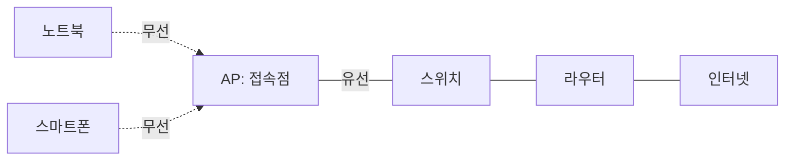
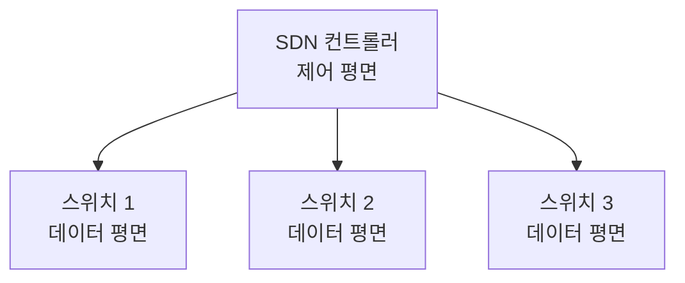

<Callout type="info">
  **이번 문서의 목표:** 이 문서를 다 읽으면 LAN과 WAN을 규모와 소유·관리 주체 기준으로 비교하고, 무선 LAN의 기본 동작 방식, SDN·IoT·클라우드 네트워킹이 각각 어떤 문제를 해결하려는 개념인지 시험에서 요구하는 수준으로 설명할 수 있게 됩니다.
</Callout>

## 왜 이 개념들을 한 편에 묶는가

01_학습방향에서 밝혔듯, 이번 편은 전통적인 네트워크 범위 구분(LAN·WAN)과, 독학사 3단계 출제기준에 명시된 최신 키워드(SDN, IoT, 클라우드 네트워킹)를 함께 다룹니다. 뒤쪽 키워드들은 **얕게, 시험에 나올 정의 수준까지만** 다룹니다. 실무 구성이나 벤더별 세부 사항은 범위 밖입니다(01_학습방향의 제외 범위 참고).

## 1. LAN과 WAN — 범위와 소유가 다르다

### 정의와 구분 기준

**LAN**(Local Area Network, 근거리 통신망)은 한 건물이나 캠퍼스처럼 **지리적으로 좁은 범위**를 하나의 조직이 직접 소유·관리하는 네트워크입니다. 10편·11편에서 다룬 Ethernet과 스위치가 LAN을 구성하는 대표적인 장비·기술입니다.

**WAN**(Wide Area Network, 광역 통신망)은 도시·국가를 넘나드는 **넓은 지리적 범위**를 연결하는 네트워크입니다. 회선을 직접 깔기 어렵기 때문에 대부분 **통신 사업자**(ISP, Internet Service Provider)의 회선을 임대해서 씁니다. 인터넷 자체가 전 세계의 WAN과 LAN을 연결한 "네트워크들의 네트워크"입니다.

> **쉽게 말하면:** LAN은 우리 집 안의 방들을 잇는 복도이고, WAN은 우리 집과 다른 도시의 집을 잇는 고속도로입니다. 복도는 내가 직접 관리하지만, 고속도로는 국가나 도로공사가 관리하고 나는 통행료를 내고 씁니다.

### 비교표

| 구분 | LAN | WAN |
|------|-----|-----|
| 범위 | 건물·캠퍼스 등 좁은 지역 | 도시·국가를 넘는 넓은 지역 |
| 소유·관리 | 하나의 조직이 직접 소유 | 통신 사업자 회선을 임대해 사용 |
| 속도 | 상대적으로 빠름 | 상대적으로 느림(거리·회선 비용 제약) |
| 대표 기술 | Ethernet, 스위칭(10, 11편) | 전용회선, MPLS, 공중 인터넷 회선 |
| 오류율 | 낮음(관리된 환경) | 상대적으로 높을 수 있음(다양한 구간 경유) |

<Callout type="warning">
  **자주 틀리는 점:** LAN과 WAN을 "케이블 종류"나 "속도"만으로 구분하려는 시도는 예외가 많아 위험합니다. 가장 확실한 구분 기준은 **누가 그 네트워크를 소유·관리하는가**와 **지리적 범위**입니다. 무선으로 구성된 LAN(무선 LAN)도 여전히 LAN입니다.
</Callout>

## 2. 무선 LAN — 케이블 없는 근거리 통신망

### 기본 동작

**무선 LAN**(Wireless LAN, WLAN)은 유선 케이블 대신 전파(라디오 주파수)를 매체로 사용하는 LAN입니다. 흔히 **Wi-Fi**라는 이름으로 불리며, IEEE 802.11 표준 계열을 따릅니다.

무선 LAN의 핵심 장비는 **AP**(Access Point, 접속점)입니다. AP는 무선으로 접속한 여러 단말(노트북, 스마트폰)을 하나로 묶어, 유선 네트워크(백본)로 연결해주는 다리 역할을 합니다.

### 유선 LAN과의 차이 — 충돌을 다루는 방식

10편에서 Ethernet의 충돌 감지 방식으로 **CSMA/CD**(Carrier Sense Multiple Access with Collision Detection, 반송파 감지 다중 접속/충돌 검출)를 다뤘습니다. 무선 LAN은 전파의 특성 때문에 같은 방식을 쓸 수 없습니다. 무선 신호를 보내는 도중에는 자신의 송신 신호가 너무 강해서 다른 신호와의 충돌을 스스로 감지하기 어렵기 때문입니다(이를 "숨겨진 단말 문제"라고도 부릅니다).

그래서 무선 LAN은 충돌을 **감지**하는 대신 **회피**하는 방식인 **CSMA/CA**(Carrier Sense Multiple Access with Collision Avoidance, 반송파 감지 다중 접속/충돌 회피)를 씁니다. 전송 전에 채널이 비어 있는지 확인하고, 임의의 대기 시간을 두어 다른 단말과 동시에 전송을 시작할 확률을 낮추는 방식입니다.

| 구분 | CSMA/CD | CSMA/CA |
|------|---------|---------|
| 사용 환경 | 유선 LAN(Ethernet) | 무선 LAN |
| 충돌 대응 | 충돌을 감지한 후 재전송 | 충돌을 사전에 회피 |
| 근거 | 송신 중에도 매체 상태 감시 가능 | 송신 중 자기 신호 때문에 충돌 감지 어려움 |

<Callout type="warning">
  **자주 틀리는 점:** CSMA/CD와 CSMA/CA를 이름이 비슷하다는 이유로 혼동하는 경우가 많습니다. **D는 Detection**(검출), **A는 Avoidance**(회피)로 마지막 글자만 다르지만 동작 철학이 정반대입니다. 유선은 "일단 보내고 부딪히면 대응", 무선은 "부딪히지 않게 미리 조심"이라고 구분하면 헷갈리지 않습니다.
</Callout>

## 3. SDN — 제어와 전달을 분리하는 발상

### 왜 필요한가

전통적인 네트워크 장비(라우터, 스위치)는 "어디로 보낼지 결정하는 두뇌 역할(제어 평면)"과 "실제로 데이터를 실어 나르는 몸통 역할(데이터 평면)"이 장비 하나 안에 함께 들어 있습니다. 장비마다 개별적으로 설정해야 하므로, 네트워크 전체의 정책을 한 번에 바꾸기가 번거롭습니다.

**SDN**(Software-Defined Networking, 소프트웨어 정의 네트워킹)은 이 두 역할을 **분리**하자는 발상입니다. 제어 평면(control plane, 경로를 결정하는 두뇌)을 별도의 소프트웨어 **컨트롤러**(controller)로 떼어내고, 개별 장비는 컨트롤러의 지시를 받아 데이터만 전달하는 데이터 평면(data plane) 역할만 맡습니다.

> **쉽게 말하면:** 기존 네트워크는 건물마다 자체 경비 책임자가 있는 구조이고, SDN은 본사 관제센터(컨트롤러) 하나가 모든 건물의 경비 방침을 원격으로 지시하는 구조입니다.

이렇게 분리하면 네트워크 정책을 컨트롤러 한 곳에서 소프트웨어적으로 관리할 수 있어 유연성이 높아집니다. 시험에서는 "SDN은 제어 평면과 데이터 평면을 분리한 개념"이라는 핵심 정의 수준까지만 요구됩니다.

## 4. IoT — 사물이 네트워크에 연결되다

**IoT**(Internet of Things, 사물 인터넷)는 센서·가전·차량 같은 다양한 **사물**(things)이 인터넷에 연결되어 데이터를 주고받는 환경을 가리킵니다.

IoT 기기는 배터리와 계산 능력이 제한적인 경우가 많아, 일반 컴퓨터 네트워크와는 다른 제약이 있습니다.

- **저전력**: 배터리로 오래 동작해야 하므로 통신에 소비하는 전력을 최소화해야 합니다.
- **저용량 데이터**: 센서 값처럼 작은 데이터를 자주 보내는 경우가 많아, 무겁고 복잡한 프로토콜보다 가볍고 단순한 프로토콜이 선호됩니다.
- **대량의 기기 수**: 한 네트워크 안에 연결되는 기기 수가 매우 많아질 수 있어, 주소 체계(16편의 IPv6가 특히 중요해지는 이유 중 하나입니다 — IPv4의 주소 부족 문제를 IPv6가 해결하기 때문입니다) 문제와도 연결됩니다.

## 5. 클라우드 네트워킹 — 네트워크 자원도 빌려 쓴다

**클라우드 네트워킹**(cloud networking)은 라우터·방화벽·로드밸런서 같은 네트워크 자원을 직접 사서 설치하는 대신, 클라우드 사업자가 제공하는 가상 네트워크 자원을 필요한 만큼 빌려 쓰는 방식입니다.

핵심 개념은 **가상화**(virtualization)입니다. 물리적으로는 클라우드 사업자의 대규모 데이터센터에 있는 장비를 공유하지만, 사용자에게는 마치 자신만의 독립된 네트워크(가상 사설 네트워크, VPC 등)를 가진 것처럼 보이게 만듭니다.

<Callout type="warning">
  **자주 틀리는 점:** SDN과 클라우드 네트워킹을 같은 개념으로 착각하기 쉽지만, SDN은 **제어와 전달을 분리하는 네트워크 설계 방식**이고, 클라우드 네트워킹은 **네트워크 자원을 소유하지 않고 빌려 쓰는 서비스 방식**입니다. 실제로 클라우드 사업자 내부에서는 SDN 기술이 자주 활용되지만, 개념 자체는 서로 다른 층위의 이야기입니다.
</Callout>

## 핵심 정리

- LAN은 좁은 범위를 한 조직이 직접 소유·관리하는 망이고, WAN은 넓은 범위를 통신 사업자 회선을 빌려 연결하는 망이다.
- 무선 LAN은 AP를 중심으로 동작하며, 충돌을 감지하는 유선의 CSMA/CD 대신 충돌을 회피하는 CSMA/CA를 사용한다.
- SDN은 네트워크 장비의 제어 평면(경로 결정)과 데이터 평면(실제 전달)을 분리해 컨트롤러가 중앙에서 정책을 관리하는 개념이다.
- IoT는 저전력·저용량 데이터·대량의 기기 수라는 제약을 가진 사물 연결 환경이며, 클라우드 네트워킹은 네트워크 자원을 가상화해 빌려 쓰는 방식이다.
- 최신 키워드(SDN, IoT, 클라우드 네트워킹)는 시험에서 정의와 핵심 발상 수준까지만 출제되며, 벤더별 구현 세부는 범위 밖이다.

## 마무리 복습

<Quiz
  questionNumber={1}
  question="LAN과 WAN을 구분하는 가장 근본적인 기준으로 옳은 것은?"
  options={['사용하는 케이블의 색깔', '지리적 범위와 소유·관리 주체', '전송하는 데이터의 종류', '사용하는 운영체제의 종류']}
  correctAnswer={2}
  explanation="LAN과 WAN은 지리적으로 얼마나 넓은 범위를 다루는지, 그리고 그 네트워크를 누가 직접 소유하고 관리하는지를 기준으로 구분한다. LAN은 좁은 범위를 한 조직이 직접 관리하고, WAN은 넓은 범위를 통신 사업자 회선을 빌려 연결한다."
  optionExplanations={['케이블 색깔은 네트워크 분류 기준이 아니다', '정답이다. 범위와 소유·관리 주체가 핵심 기준이다', '데이터 종류는 LAN과 WAN 구분과 무관하다', '운영체제 종류는 네트워크 범위 구분과 관련이 없다']}
/>

<Quiz
  questionNumber={2}
  question="무선 LAN이 CSMA/CD 대신 CSMA/CA를 사용하는 주된 이유는?"
  options={['무선 신호가 유선보다 항상 빠르기 때문에', '송신 중에는 자신의 신호 때문에 다른 신호와의 충돌을 감지하기 어렵기 때문에', 'CSMA/CA가 암호화 기능을 포함하기 때문에', '무선 LAN에는 충돌이 발생하지 않기 때문에']}
  correctAnswer={2}
  explanation="무선 매체에서는 단말이 신호를 보내는 동안 자신의 강한 송신 신호 때문에 다른 단말의 신호와의 충돌을 스스로 감지하기 어렵다. 그래서 충돌을 감지(Detection)하는 대신 사전에 회피(Avoidance)하는 CSMA/CA 방식을 사용한다."
  optionExplanations={['무선이 유선보다 항상 빠르다는 것은 사실이 아니며 CSMA 방식 선택의 이유도 아니다', '정답이다. 송신 중 자기 신호로 인한 충돌 감지의 어려움이 핵심 이유다', 'CSMA/CA는 충돌 회피 절차이며 암호화 기능과는 무관하다', '무선 LAN에서도 여러 단말이 동시에 전송하면 충돌이 발생할 수 있다']}
/>

<Quiz
  questionNumber={3}
  question="SDN(Software-Defined Networking)의 핵심 개념으로 가장 적절한 것은?"
  options={['모든 데이터를 클라우드에 저장하는 것', '제어 평면과 데이터 평면을 분리해 컨트롤러가 중앙에서 관리하는 것', '무선 신호의 세기를 소프트웨어로 조절하는 것', 'IP 주소를 자동으로 할당하는 것']}
  correctAnswer={2}
  explanation="SDN은 경로를 결정하는 제어 평면을 별도의 컨트롤러로 분리하여, 개별 네트워크 장비는 데이터 전달(데이터 평면)만 담당하게 하는 설계 방식이다. 이를 통해 네트워크 정책을 중앙에서 소프트웨어적으로 관리할 수 있다."
  optionExplanations={['클라우드 데이터 저장은 SDN의 정의와 직접 관련이 없다', '정답이다. 제어와 전달의 분리가 SDN의 핵심이다', '신호 세기 조절은 SDN의 정의와 무관하다', 'IP 주소 자동 할당은 DHCP의 역할이다(21편)']}
/>

<Quiz
  questionNumber={4}
  question="IoT 환경의 네트워크 기기가 일반적으로 가지는 제약으로 옳지 않은 것은?"
  options={['배터리 등 전력이 제한적인 경우가 많다', '전송하는 데이터의 크기가 작은 경우가 많다', '한 네트워크에 연결되는 기기 수가 매우 많아질 수 있다', '항상 대형 서버급 컴퓨팅 자원을 갖추고 있다']}
  correctAnswer={4}
  explanation="IoT 기기는 대체로 저전력·저용량 데이터 전송이 특징이며, 계산 능력과 자원이 제한적인 경우가 대부분이다. 대형 서버급 컴퓨팅 자원을 항상 갖춘다는 설명은 IoT 기기의 일반적인 특성과 반대된다."
  optionExplanations={['옳은 설명이다. 배터리 기반 저전력 동작이 IoT의 특징이다', '옳은 설명이다. 센서 값 등 작은 데이터를 주고받는 경우가 많다', '옳은 설명이다. 대량의 기기가 연결될 수 있어 주소 체계 문제와도 연결된다', '정답이다. IoT 기기는 대체로 자원이 제한적이며, 대형 서버급 자원을 갖춘다는 설명은 옳지 않다']}
/>

<Quiz
  questionNumber={5}
  question="SDN과 클라우드 네트워킹의 관계에 대한 설명으로 가장 적절한 것은?"
  options={['둘은 완전히 같은 개념으로 이름만 다르다', 'SDN은 제어·전달 분리라는 네트워크 설계 개념이고, 클라우드 네트워킹은 네트워크 자원을 빌려 쓰는 서비스 방식으로 서로 다른 층위의 개념이다', 'SDN은 무선 LAN 전용 기술이다', '클라우드 네트워킹은 반드시 IoT 기기에만 적용된다']}
  correctAnswer={2}
  explanation="SDN은 네트워크 장비의 제어 평면과 데이터 평면을 분리하는 설계 방식이고, 클라우드 네트워킹은 네트워크 자원을 소유하지 않고 가상화하여 빌려 쓰는 서비스 방식이다. 실제로는 함께 활용되는 경우가 많지만 개념 자체는 서로 다른 층위에 속한다."
  optionExplanations={['두 개념은 다루는 층위가 다르므로 동일한 개념이 아니다', '정답이다. 설계 방식과 서비스 방식이라는 서로 다른 층위의 개념이다', 'SDN은 유선·무선을 가리지 않는 일반적인 네트워크 설계 개념이다', '클라우드 네트워킹은 IoT에 국한되지 않고 일반적인 네트워크 자원 제공 방식이다']}
/>

## 참고 자료

- [IEEE 802.3 표준 개요 자료](https://standards.ieee.org/)
- [국가평생교육진흥원 독학학위제 - 과목별 평가영역](https://bdes.nile.or.kr/nile/study/nStudy2_1.do)
