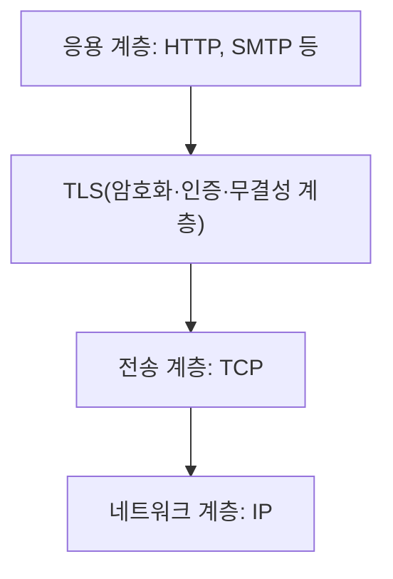

<Callout type="info">
  **이번 문서의 목표:** 이 문서를 다 읽으면 대칭키·공개키 암호와 해시 함수가 각각 어떤 문제를 해결하는지 구분하고, 방화벽의 종류를 비교하며, TLS가 왜 전송 계층과 응용 계층 사이에 위치한다고 설명되는지 말할 수 있게 됩니다.
</Callout>

## 왜 네트워크 보안을 마지막에 다루는가

지금까지 배운 프로토콜(IP, TCP, HTTP 등)은 원래 "어떻게 하면 데이터를 잘 전달할까"에 초점을 맞춰 설계되었고, "누가 몰래 엿보거나 위조하면 어떻게 막을까"는 나중에 덧붙여진 문제입니다. 그래서 보안 기능은 대부분 기존 계층 구조 위에 **추가로 얹히는 형태**로 존재합니다. 21편에서 본 HTTPS(HTTP + TLS)가 대표적인 예입니다.

이 편은 독학사 3단계 컴퓨터네트워크 시험이 요구하는 **네트워크 보안의 기초 개념**만 다룹니다. 암호 알고리즘의 수학적 원리나 공격 기법의 세부 사항은 정보보호 과목의 영역이며, 이 편에서는 다루지 않습니다(01_학습방향의 제외 범위 참고).

## 1. 암호와 인증의 기본 도구 세 가지

네트워크 보안에서 반복해서 등장하는 도구는 크게 세 가지입니다. 이 셋은 **서로 다른 문제**를 해결하기 때문에, 무엇이 무엇을 위한 것인지 구분하는 문제가 자주 출제됩니다.

> **쉽게 말하면:** 대칭키는 "같은 열쇠로 잠그고 여는 금고", 공개키는 "누구나 넣을 수 있지만 주인만 열 수 있는 우편함", 해시는 "내용이 조금이라도 바뀌면 완전히 달라지는 지문"입니다.

### 대칭키 암호

**대칭키**(symmetric key) 암호는 **암호화할 때와 복호화할 때 같은 키**를 사용하는 방식입니다. 송신자와 수신자가 미리 같은 비밀 키를 공유하고 있어야 합니다.

- **장점**: 연산이 비교적 가볍고 빨라서 대량의 데이터를 암호화하기에 적합합니다.
- **단점**: 그 키를 통신 상대와 어떻게 안전하게 나눠 가질지가 문제입니다(키 배송 문제, key distribution problem). 아무리 암호화가 강력해도, 키 자체가 도중에 노출되면 전부 무너집니다.

### 공개키 암호

**공개키**(public key) 암호(비대칭키 암호라고도 합니다)는 **암호화용 키와 복호화용 키가 서로 다른** 한 쌍(키 쌍, key pair)을 사용하는 방식입니다. 하나는 누구에게나 공개하는 **공개키**(public key), 다른 하나는 자신만 보관하는 **개인키**(private key)입니다.

공개키로 암호화한 데이터는 짝이 되는 개인키로만 복호화할 수 있습니다. 그래서 상대방의 공개키로 메시지를 암호화해서 보내면, 그 개인키를 가진 상대방만 열어볼 수 있습니다 — 사전에 비밀 키를 나눠 가질 필요가 없습니다.

- **장점**: 키를 미리 공유할 필요가 없어 키 배송 문제를 해결합니다. 또한 개인키로 서명하고 공개키로 검증하는 방식으로 **전자서명**(digital signature, "이 메시지는 진짜 이 사람이 보냈다"를 증명)에도 쓰입니다.
- **단점**: 대칭키보다 연산이 훨씬 무겁고 느립니다.

<Callout type="warning">
  **자주 틀리는 점:** "공개키가 대칭키보다 더 안전하니 항상 공개키만 쓰면 된다"는 생각은 틀렸습니다. 실제로는 무거운 공개키 암호로 대칭키(세션 키)를 안전하게 교환한 뒤, 그 이후의 실제 데이터는 가벼운 대칭키로 암호화하는 **혼합 방식**이 표준입니다(TLS가 바로 이 방식을 씁니다). "느리지만 키 교환에 유리한 공개키"와 "빠르지만 키 공유가 문제인 대칭키"를 상호 보완적으로 함께 쓴다고 이해해야 합니다.
</Callout>

### 해시 함수

**해시 함수**(hash function)는 암호화가 아니라, 임의 길이의 데이터를 **고정된 길이의 짧은 값**(해시값, hash value)으로 변환하는 함수입니다. 목적이 다릅니다 — 데이터를 숨기는 것이 아니라, **데이터가 변조되지 않았는지 확인**하는 데 씁니다.

핵심 성질은 원본 데이터가 단 한 비트만 바뀌어도 해시값이 완전히 달라진다는 것입니다. 그래서 송신자가 데이터와 함께 그 해시값을 보내면, 수신자는 받은 데이터로 해시값을 다시 계산해 비교함으로써 **무결성**(integrity, 데이터가 훼손되지 않고 온전함)을 확인할 수 있습니다.

또한 해시 함수는 **역방향으로 원본을 복원할 수 없다**는 성질(일방향성)도 가지고 있어, 비밀번호를 원본 그대로 저장하지 않고 해시값만 저장하는 데도 쓰입니다.

### 세 도구 비교

| 구분 | 대칭키 암호 | 공개키 암호 | 해시 함수 |
|------|-------------|-------------|-----------|
| 목적 | 기밀성(내용을 숨김) | 기밀성 + 전자서명 | 무결성 확인 |
| 키 개수 | 1개(공유) | 2개(공개키·개인키) | 키 없음(또는 별도 개념) |
| 되돌리기 | 같은 키로 복호화 가능 | 짝이 되는 키로 복호화 가능 | 원본 복원 불가(일방향) |
| 속도 | 빠름 | 느림 | 빠름 |
| 대표 용도 | 대량 데이터 암호화 | 키 교환, 전자서명 | 데이터 무결성 검증, 비밀번호 저장 |

<Callout type="warning">
  **자주 틀리는 점:** 해시 함수를 "암호화의 일종"으로 착각하는 경우가 많습니다. 암호화는 반드시 **복호화(되돌리기)가 전제**되지만, 해시는 애초에 되돌릴 수 없도록 설계됩니다. "암호화 vs 해시"를 묻는 문제에서는 되돌릴 수 있는지 여부가 핵심 판단 기준입니다.
</Callout>

## 2. 방화벽 — 통과시킬지 막을지 결정하는 문지기

**방화벽**(firewall)은 네트워크 경계에서 들어오고 나가는 트래픽을 감시하며, 미리 정한 규칙에 따라 통과시키거나 차단하는 장치(또는 소프트웨어)입니다.

> **쉽게 말하면:** 방화벽은 건물 입구의 경비원입니다. 출입증(규칙)을 확인해서 통과시킬지 막을지 결정합니다.

### 방화벽의 종류

| 종류 | 검사 기준 | 특징 |
|------|-----------|------|
| 패킷 필터링(packet filtering) 방화벽 | IP 주소, 포트 번호 등 패킷 헤더 정보 | 속도가 빠르지만 단순한 규칙만 적용 가능 |
| 상태 기반(stateful inspection) 방화벽 | 연결의 상태(예: TCP의 연결 여부, 18편) | 이전 패킷과의 연관성을 추적해 더 정교하게 판단 |
| 응용 계층(application-level) 방화벽 | HTTP 요청 내용 등 응용 계층 데이터까지 | 세밀한 검사가 가능하지만 처리 부담이 큼 |

- **패킷 필터링 방화벽**은 네트워크 계층·전송 계층 정보(출발지·목적지 IP, 포트 번호)만 보고 규칙에 맞는지 판단합니다. 예를 들어 "80번 포트로 들어오는 트래픽은 허용, 그 외 포트는 차단" 같은 규칙입니다. 각 패킷을 독립적으로 판단하므로 하나의 연결 안에서 이전 패킷과의 관계는 보지 못합니다.
- **상태 기반 방화벽**은 여기서 한 단계 더 나아가, 현재 오가는 패킷이 **이미 성립된 정상적인 연결의 일부인지**를 추적합니다. 예를 들어 내부에서 먼저 나간 요청에 대한 응답 패킷은 통과시키고, 요청한 적 없는 응답이 갑자기 들어오면 의심스러운 트래픽으로 처리할 수 있습니다.
- **응용 계층 방화벽**은 패킷의 헤더뿐 아니라 실제 내용(예: HTTP 요청의 URL, 본문)까지 들여다보고 판단합니다. 가장 세밀하지만, 내용을 해석해야 하므로 처리 속도는 가장 느립니다.

<Callout type="warning">
  **자주 틀리는 점:** 방화벽 종류를 "OSI 계층이 높을수록 무조건 좋다"로 단순화하면 안 됩니다. 응용 계층 방화벽이 가장 정교하지만, 그만큼 처리 부담이 커서 모든 트래픽에 적용하기는 부담스럽습니다. 시험에서는 "무엇을 기준으로 판단하는가"(헤더만 보는지, 연결 상태를 보는지, 내용까지 보는지)로 구분하는 것이 핵심입니다.
</Callout>

## 3. TLS — 프로토콜 스택 어디에 위치하는가

21편에서 HTTPS를 "HTTP + TLS"로 소개했습니다. **TLS**(Transport Layer Security, 전송 계층 보안)는 이름에 "전송 계층"이 들어가지만, 실제로는 전통적인 TCP/IP 4계층 어디에도 딱 들어맞지 않는 위치에 있습니다.

TLS는 **응용 계층과 전송 계층 사이**에 자리 잡아, 그 위(응용 계층)에서 내려오는 데이터를 암호화해서 그 아래(전송 계층, 주로 TCP)로 넘겨주는 역할을 합니다. 그래서 HTTP뿐 아니라 SMTP 같은 다른 응용 계층 프로토콜도 TLS를 씌워 보안을 강화할 수 있습니다.

TLS가 통신을 시작할 때 수행하는 **핸드셰이크**(handshake, 초기 교신 절차)에서는 앞서 배운 세 도구가 순서대로 동원됩니다.

1. 서버가 자신의 **공개키**가 담긴 인증서를 클라이언트에게 보냅니다.
2. 클라이언트는 그 공개키를 이용해 앞으로 쓸 **대칭키**(세션 키)를 안전하게 암호화해 서버에게 전달합니다.
3. 이후 실제 데이터는 이 대칭키로 암호화해서 빠르게 주고받고, 각 데이터에는 **해시** 기반의 값을 함께 붙여 변조 여부를 확인합니다.

이 순서가 바로 앞서 나온 "혼합 방식" 자주 틀리는 점의 실제 사례입니다 — 키 교환에는 느리지만 안전한 공개키를, 실제 데이터 전송에는 빠른 대칭키를, 무결성 확인에는 해시를 쓰는 조합입니다.

> **쉽게 말하면:** TLS는 우체국 소포에 포장(암호화)과 봉인 스티커(무결성 확인)를 함께 붙여주는 서비스입니다. 소포 안 내용물(HTTP 등 응용 데이터)은 그대로지만, 포장과 봉인 덕분에 중간에서 누가 열어보거나 바꿔치기하면 바로 티가 납니다.

## 핵심 정리

- 대칭키 암호는 같은 키로 암호화·복호화하며 빠르지만 키 공유가 어렵고, 공개키 암호는 서로 다른 키 쌍을 사용해 키 공유 문제를 해결하지만 느리다.
- 해시 함수는 암호화가 아니라 데이터 변조 여부(무결성)를 확인하는 도구이며, 원본으로 되돌릴 수 없다는 점이 암호화와의 결정적 차이다.
- 방화벽은 패킷 필터링(헤더만 검사) → 상태 기반(연결 상태 추적) → 응용 계층(내용까지 검사) 순으로 정교해지지만 처리 부담도 커진다.
- TLS는 응용 계층과 전송 계층(TCP) 사이에 위치하며, 핸드셰이크에서 공개키로 대칭키를 안전하게 교환한 뒤 실제 데이터는 대칭키와 해시로 보호하는 혼합 방식을 사용한다.

## 마무리 복습

<Quiz
  questionNumber={1}
  question="대칭키 암호와 공개키 암호의 차이에 대한 설명으로 옳은 것은?"
  options={['대칭키 암호는 암호화와 복호화에 서로 다른 키를 사용한다', '공개키 암호는 암호화와 복호화에 같은 키를 사용한다', '대칭키 암호는 연산이 빠르지만 키를 안전하게 공유하는 문제가 있다', '공개키 암호는 대칭키 암호보다 항상 연산 속도가 빠르다']}
  correctAnswer={3}
  explanation="대칭키 암호는 암호화와 복호화에 같은 키를 사용하여 연산이 빠르지만, 그 키를 통신 상대와 안전하게 공유하는 것이 문제(키 배송 문제)가 된다. 공개키 암호는 이 문제를 해결하지만 연산이 더 느리다."
  optionExplanations={['대칭키 암호는 암호화·복호화에 같은 키를 사용한다', '공개키 암호는 서로 다른 키 쌍(공개키·개인키)을 사용한다', '정답이다. 대칭키는 빠르지만 키 공유 문제가 있다', '공개키 암호는 일반적으로 대칭키 암호보다 연산이 느리다']}
/>

<Quiz
  questionNumber={2}
  question="해시 함수에 대한 설명으로 옳지 않은 것은?"
  options={['임의 길이의 데이터를 고정된 길이의 값으로 변환한다', '주로 데이터의 무결성을 확인하는 데 사용된다', '원본 데이터가 한 비트만 바뀌어도 해시값이 크게 달라진다', '해시값으로부터 원본 데이터를 항상 복원할 수 있다']}
  correctAnswer={4}
  explanation="해시 함수는 일방향성을 가지도록 설계되어 해시값으로부터 원본 데이터를 복원할 수 없다. 이 점이 복호화가 가능한 암호화와의 핵심적인 차이다."
  optionExplanations={['옳은 설명이다. 해시 함수의 기본 정의다', '옳은 설명이다. 해시는 무결성 확인에 주로 쓰인다', '옳은 설명이다. 작은 변화에도 해시값이 크게 달라지는 성질을 가진다', '정답이다. 해시 함수는 원본 복원이 불가능한 일방향 함수다']}
/>

<Quiz
  questionNumber={3}
  question="TLS 핸드셰이크 과정에서 공개키와 대칭키가 사용되는 방식으로 옳은 것은?"
  options={['처음부터 끝까지 대칭키만 사용한다', '처음부터 끝까지 공개키만 사용한다', '공개키로 대칭키(세션 키)를 안전하게 교환한 뒤, 실제 데이터는 대칭키로 암호화한다', '해시 함수로 세션 키를 생성하여 그것만으로 모든 통신을 암호화한다']}
  correctAnswer={3}
  explanation="TLS는 느리지만 키 공유 문제를 해결하는 공개키 암호로 대칭키(세션 키)를 안전하게 교환한 뒤, 실제 데이터 전송에는 빠른 대칭키 암호를 사용하는 혼합 방식을 쓴다."
  optionExplanations={['대칭키만으로는 최초의 키 공유 문제를 해결할 수 없다', '공개키만 계속 사용하면 대량 데이터 처리 속도가 너무 느려진다', '정답이다. 공개키로 대칭키를 교환한 뒤 대칭키로 데이터를 암호화하는 혼합 방식이다', '해시 함수는 무결성 확인용이며 그 자체로 암호화 키를 생성하는 용도가 아니다']}
/>

<Quiz
  questionNumber={4}
  question="상태 기반(stateful inspection) 방화벽에 대한 설명으로 가장 적절한 것은?"
  options={['패킷 헤더의 IP 주소와 포트 번호만 보고 각 패킷을 독립적으로 판단한다', '이미 성립된 연결의 상태를 추적하여 그 연결의 일부인 패킷인지 판단한다', 'HTTP 요청의 URL이나 본문 내용까지 분석해서 판단한다', '방화벽 중 가장 처리 속도가 느린 방식이다']}
  correctAnswer={2}
  explanation="상태 기반 방화벽은 개별 패킷만 보는 것이 아니라 연결의 상태(예: TCP 연결 성립 여부)를 추적해, 현재 패킷이 이미 성립된 정상 연결의 일부인지를 기준으로 판단한다."
  optionExplanations={['이는 패킷 필터링 방화벽에 대한 설명이다', '정답이다. 연결 상태 추적이 상태 기반 방화벽의 핵심이다', '이는 응용 계층 방화벽에 대한 설명이다', '가장 느린 방식은 내용까지 분석하는 응용 계층 방화벽이다']}
/>

<Quiz
  questionNumber={5}
  question="TLS가 프로토콜 스택에서 차지하는 위치에 대한 설명으로 옳은 것은?"
  options={['네트워크 계층과 데이터링크 계층 사이', '응용 계층과 전송 계층 사이', 'TCP 내부의 한 옵션 필드로만 존재한다', '물리 계층에서만 동작한다']}
  correctAnswer={2}
  explanation="TLS는 응용 계층에서 내려오는 데이터를 암호화하여 전송 계층(주로 TCP)으로 넘겨주는 역할을 하므로, 응용 계층과 전송 계층 사이에 위치한다고 설명된다."
  optionExplanations={['TLS는 네트워크 계층·데이터링크 계층과는 직접 관련이 없다', '정답이다. 응용 계층과 전송 계층 사이에서 암호화를 담당한다', 'TLS는 TCP 옵션 필드가 아니라 별도의 계층으로 취급된다', 'TLS는 물리 계층과 관련이 없다']}
/>

<Quiz
  questionNumber={6}
  question="공개키 암호가 전자서명(digital signature)에 활용될 수 있는 이유로 가장 적절한 것은?"
  options={['공개키 암호는 대칭키보다 항상 빠르기 때문에', '개인키로 서명하고 공개키로 검증함으로써 서명한 사람을 증명할 수 있기 때문에', '해시 함수를 전혀 사용하지 않기 때문에', '공개키는 절대 노출되지 않도록 설계되기 때문에']}
  correctAnswer={2}
  explanation="공개키 암호에서는 자신만 가진 개인키로 서명하고, 짝이 되는 공개키로 누구나 그 서명을 검증할 수 있다. 검증이 성공하면 그 개인키를 가진 사람만이 서명할 수 있었다는 것이 증명되므로 전자서명에 활용된다."
  optionExplanations={['공개키 암호는 오히려 대칭키보다 느리며, 속도는 전자서명 활용 이유가 아니다', '정답이다. 개인키 서명과 공개키 검증의 비대칭 구조가 서명 증명의 근거다', '실제 전자서명 구현에서는 해시 함수를 함께 사용하는 경우가 많다', '공개키는 이름 그대로 누구에게나 공개되는 키다']}
/>

## 참고 자료

- [IETF RFC 8446 - TLS 1.3](https://www.rfc-editor.org/rfc/rfc8446)
- [NIST](https://csrc.nist.gov)
