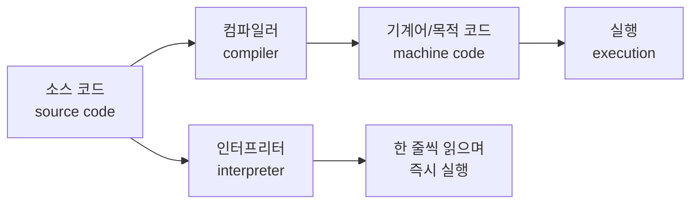
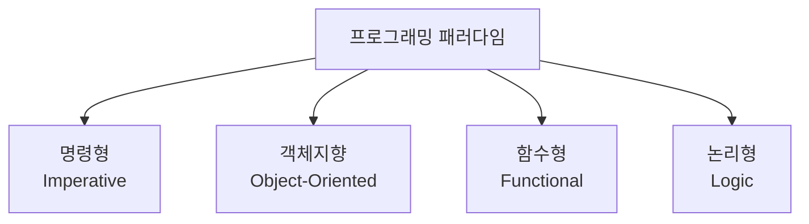

<Callout type="info">
  **이번 문서의 목표:** "프로그래밍 언어"와 "그 언어의 구현체(컴파일러·인터프리터)"를 구분해 설명할 수 있고, 명령형·객체지향·함수형·논리형 4대 패러다임을 예시로 구별하며, 이 과목이 시험에서 다루는 범위 전체를 한눈에 그릴 수 있다.
</Callout>

## 왜 "언어"와 "구현"을 나눠서 봐야 하는가

C 언어로 변수를 선언하고 반복문을 돌리고 함수를 호출해 본 사람은 많습니다. 하지만 "그 C 코드를 실제로 실행 가능한 기계어로 바꿔주는 도구가 무엇인가"라는 질문에는 선뜻 답하지 못하는 경우가 많습니다. 코드를 짜는 경험과 그 코드가 왜 그렇게 동작하는지 설계 원리를 아는 것은 전혀 다른 문제입니다. **독학사 프로그래밍언어론**은 후자, 즉 "언어가 어떻게 설계되고, 그 설계가 왜 그런 형태를 띠며, 실행 시점에는 무슨 일이 벌어지는가"를 다루는 과목입니다.

> **쉽게 말하면:** 이 과목은 "코드를 어떻게 짜는가"가 아니라 "언어 자체가 어떤 원리로 만들어지고 실행되는가"를 다룹니다.

이 구분이 첫 편의 핵심 이유입니다. 응시자는 이미 C나 Java 같은 언어로 코드를 짤 수 있지만, "언어(language)"라는 것 자체를 하나의 연구 대상으로 놓고 분석해 본 경험은 없는 경우가 많습니다. 그래서 이번 편에서는 본격적인 개념(구문·의미·바인딩·스코프 등)에 들어가기 전에, 언어라는 대상을 어떤 관점에서 바라볼 것인지 지도를 그립니다.

## 1. 프로그래밍 언어란 무엇인가 — 개념적 정의

프로그래밍 언어(programming language)는 **사람이 컴퓨터에게 수행할 작업을 정확하고 모호하지 않게 지시하기 위해 정해 놓은 표기 체계와 규칙의 집합**입니다. 여기서 핵심은 두 가지입니다.

- **표기 체계**: 어떤 기호와 단어를 어떤 순서로 나열할 수 있는지에 대한 규칙, 즉 **구문**(syntax)입니다.
- **의미 규칙**: 그렇게 나열된 기호가 실제로 무엇을 뜻하는지, 실행되면 어떤 결과를 내는지에 대한 규칙, 즉 **의미**(semantics)입니다.

예를 들어 `x = x + 1`이라는 문장을 봅시다. `=` 기호를 어디에 어떻게 쓸 수 있는지는 구문의 문제이고, 이 문장이 실행되면 "변수 `x`가 가리키는 메모리 위치에 기존 값보다 1 큰 값을 저장한다"는 것은 의미의 문제입니다. 프로그래밍 언어는 이 구문과 의미를 한 쌍으로 묶어 정의한 체계입니다. 구문과 의미를 형식적으로 기술하는 방법(BNF/EBNF, 정적·동적 의미)은 02편과 08편에서 본격적으로 다룹니다. 이번 편에서는 "언어란 구문과 의미의 규칙 집합이다"라는 큰 그림만 잡아 둡니다.

**자주 틀리는 점**: 프로그래밍 언어를 "특정 회사나 단체가 만든 도구 이름"(예: Python, Java)으로만 이해하면, 시험에서 "언어의 정의"를 묻는 개념형 문제에 취약해집니다. 언어는 도구의 브랜드가 아니라 **구문 규칙과 의미 규칙의 집합** 그 자체를 가리키는 추상적 개념이라는 점을 기억해야 합니다.

## 2. 언어(language)와 구현(implementation)의 구분

여기서 이번 편의 가장 중요한 개념이 등장합니다. "C 언어"와 "GCC(GNU Compiler Collection)"는 같은 것이 아닙니다.

> **쉽게 말하면:** 언어는 "규칙", 구현은 그 규칙대로 실제로 코드를 실행해 주는 "도구"입니다.

- **언어(language)**: 구문·의미 규칙의 집합 그 자체. C 언어라는 규격서(표준안)가 정의하는 문법과 의미가 여기 해당합니다.
- **구현(implementation)**: 그 규칙에 따라 작성된 코드를 실제로 실행 가능한 형태로 바꾸거나 직접 실행해 주는 소프트웨어. GCC, Clang, CPython, JVM(Java Virtual Machine) 등이 여기 해당합니다.

같은 언어라도 구현체는 여러 개가 있을 수 있습니다. C 언어라는 하나의 표준을 GCC도 구현하고 Clang도 구현합니다. 두 구현이 만들어 내는 실행 파일은 다를 수 있지만, "C 언어 표준을 따른다"는 점에서는 같은 언어를 구현한 것입니다.

### 구현 방식: 컴파일과 인터프리트

언어를 실제로 실행 가능하게 만드는 방식은 크게 두 가지로 나뉩니다.



| 구분 | 컴파일(compile) 방식 | 인터프리트(interpret) 방식 |
|------|------------------------|------------------------------|
| 동작 | 소스 코드 전체를 미리 기계어(또는 중간 코드)로 번역한 뒤 실행 | 소스 코드를 한 줄씩(또는 한 단위씩) 읽으면서 그 자리에서 바로 실행 |
| 실행 속도 | 번역이 끝난 뒤라 실행 자체는 빠른 편 | 매번 해석하며 실행하므로 상대적으로 느린 편 |
| 오류 발견 시점 | 번역(컴파일) 단계에서 문법·형 오류를 미리 잡을 수 있음 | 실제로 그 줄이 실행되어야 오류가 드러남 |
| 대표 언어·도구 | C(GCC), C++(Clang) | 초기 BASIC 인터프리터, 셸 스크립트 |
| 대표 예시 | C 코드를 GCC로 미리 기계어 실행 파일로 번역 | 셸 스크립트를 한 줄씩 읽어 즉시 실행하는 셸 |

실제로는 이 두 방식을 섞은 **하이브리드 구현**도 널리 쓰입니다. Java는 소스 코드를 바이트코드(bytecode)라는 중간 형태로 먼저 컴파일하고, 이 바이트코드를 JVM(Java Virtual Machine, 자바 가상 머신)이 다시 해석하거나 즉석에서 기계어로 변환(JIT 컴파일, Just-In-Time compilation)해 실행합니다. Python 역시 소스 코드를 `.pyc`라는 바이트코드로 컴파일한 뒤 CPython이라는 인터프리터가 이를 실행합니다. 이런 하이브리드 구현 방식의 세부 구조는 21편(언어 구현 방식과 런타임 환경)에서 더 깊게 다룹니다. 이번 편에서는 "구현 방식이 컴파일 하나만 있는 것이 아니다"라는 사실만 확실히 해 둡니다.

**자주 틀리는 점**: "이 언어는 컴파일 언어다" 또는 "이 언어는 인터프리터 언어다"라는 표현은 사실 정확하지 않습니다. **컴파일과 인터프리트는 언어 자체의 속성이 아니라 구현체의 속성**입니다. 예를 들어 C 언어도 이론적으로는 인터프리터로 구현할 수 있고, 실제로 교육용 C 인터프리터도 존재합니다. 시험에서 "어떤 언어는 반드시 컴파일 방식으로만 구현되어야 한다"는 식의 보기가 나오면 틀린 설명일 가능성이 높습니다.

## 3. 프로그래밍 패러다임 4대 분류

패러다임(paradigm)이란 "문제를 해결하는 사고방식의 틀"을 뜻하는 일반적인 용어입니다. 프로그래밍 언어에서는 **코드를 어떤 방식으로 조직하고, 계산을 어떻게 표현할 것인가에 대한 근본적인 접근 방식**을 가리킵니다. 독학사 프로그래밍언어론에서는 다음 4가지 패러다임을 기본 분류로 삼습니다.

> **쉽게 말하면:** 패러다임은 "같은 문제를 어떤 사고 틀로 풀 것인가"를 가르는 큰 분류입니다.



| 패러다임 | 핵심 사고방식 | 대표 언어 | 계산을 표현하는 방식 |
|----------|----------------|-----------|------------------------|
| 명령형(imperative) | "어떤 순서로 무엇을 하라"는 절차를 하나씩 지시 | C, Pascal | 변수의 상태(state)를 순차적인 대입문으로 바꿔 나감 |
| 객체지향(object-oriented) | 데이터와 그 데이터를 다루는 동작을 객체(object) 하나로 묶음 | Java, C++ | 객체끼리 메시지를 주고받으며 상태를 변경 |
| 함수형(functional) | 계산을 수학의 함수처럼 "입력을 받아 출력을 내는 것"으로 표현 | Haskell, ML(Meta Language, 함수형 언어 계열의 이름) | 함수를 조합해 결과를 계산, 상태 변경(부작용)을 최소화 |
| 논리형(logic) | 사실(fact)과 규칙(rule)을 나열하고 질의(query)로 답을 찾게 함 | Prolog | 목표를 만족하는 답을 시스템이 스스로 탐색 |

네 패러다임을 같은 문제, 즉 "**1부터 5까지의 합을 구한다**"로 비교해 보겠습니다.

```c
// 명령형(imperative) 방식 — C
int sum = 0;
for (int i = 1; i <= 5; i++) {
    sum = sum + i;
}
// sum에는 15가 남는다
```

명령형 방식은 "변수 `sum`을 0으로 두고, `i`를 1부터 5까지 하나씩 늘려 가며 `sum`에 더하라"는 **순서 있는 절차**를 그대로 코드로 옮깁니다. 상태(변수 `sum`, `i`의 값)가 문장이 실행될 때마다 바뀌는 것이 핵심입니다.

```text
의사코드(함수형 스타일):
sum([1, 2, 3, 4, 5]) = 1 + sum([2, 3, 4, 5])
                     = 1 + (2 + sum([3, 4, 5]))
                     = 1 + (2 + (3 + sum([4, 5])))
                     = ... = 15
```

함수형 방식에서는 "리스트의 합은 첫 원소에 나머지 리스트의 합을 더한 것"이라는 **수학적 정의**(재귀 함수)로 답을 구합니다. 중간에 변수의 상태를 바꾸는 대입문이 없고, 같은 입력에는 항상 같은 출력이 나오는 함수의 조합만 있습니다. 이런 함수형 언어의 핵심 개념(람다·순수 함수·고차 함수)은 22편에서 시험 수준까지 다룹니다.

```text
의사코드(논리형 스타일 — Prolog 느낌):
합계(빈리스트, 0).
합계([머리|꼬리], 합) :- 합계(꼬리, 나머지합), 합 is 머리 + 나머지합.
질의: ?- 합계([1,2,3,4,5], X).
결과: X = 15
```

논리형 방식에서는 "빈 리스트의 합은 0이다", "리스트의 합은 첫 원소와 나머지 리스트 합을 더한 것이다"라는 **사실과 규칙**만 선언해 놓고, "리스트 `[1,2,3,4,5]`의 합은 무엇인가"라는 **질의**를 던지면 시스템이 규칙을 따라가며 답을 찾아냅니다. "어떻게 계산할지"가 아니라 "무엇이 참인지"를 선언한다는 점이 명령형·함수형과 근본적으로 다릅니다. Horn 절과 Prolog의 구체적인 구조는 23편에서 다룹니다.

객체지향 방식은 "합을 구하는 로직"을 데이터(리스트)와 묶어 하나의 객체가 스스로 처리하게 만드는 방식이지만, 실제로는 내부적으로 명령형 반복문을 쓰는 경우가 많습니다. 즉 객체지향은 "계산을 어떻게 표현하는가"보다는 "**코드를 어떤 단위로 묶고 재사용하는가**"에 초점을 맞춘 패러다임이라는 점에서 나머지 셋과 결이 다릅니다. 클래스·상속·다형성 등 객체지향의 세부 개념은 18편에서 다룹니다.

**자주 틀리는 점**: 하나의 언어가 반드시 하나의 패러다임에만 속하는 것은 아닙니다. 예를 들어 파이썬은 명령형 문법을 기본으로 하면서도 함수형 스타일(람다, `map`/`filter`)과 객체지향(클래스)을 모두 지원하는 **다중 패러다임(multi-paradigm) 언어**입니다. "이 언어는 오직 이 패러다임만 지원한다"는 단정적인 보기는 의심해 봐야 합니다.

## 4. 독학사 프로그래밍언어론의 시험 범위 지도

이번 과목은 "언어를 어떤 순서로 뜯어보는가"라는 기준으로 아래와 같은 큰 흐름을 가집니다. 이 지도를 기억해 두면, 이후 편에서 다루는 개념이 전체 그림의 어느 위치에 있는지 헷갈리지 않습니다.

<Steps>

1. **언어의 배경**: 역사·평가 기준·패러다임 — "왜 이렇게 설계되었는가"(06~07편)
2. **구문과 의미**: BNF/EBNF, 구문 도표, 정적·동적 의미 — "규칙을 어떻게 기술하는가"(02, 08편)
3. **정적 의미론의 핵심**: 이름·바인딩·스코프·수명, 자료형·형 검사 — "이름과 값이 언제 어떻게 연결되는가"(03, 09~11편)
4. **식과 제어 구조**: 표현식·할당·단락 평가, 제어문 — "코드 한 줄 한 줄이 어떻게 계산되는가"(04, 12~13편)
5. **하위프로그램**: 매개변수 전달, 활성화 레코드, 오버로딩·제네릭 — "함수 호출이 내부에서 어떻게 처리되는가"(04, 14~16편)
6. **큰 단위의 설계**: 추상 자료형·캡슐화, 객체지향 지원 — "데이터와 동작을 어떻게 묶는가"(17~18편)
7. **동시성과 예외**: 병행성, 예외·이벤트 처리 — "여러 흐름이 동시에 돌거나 잘못될 때 어떻게 하는가"(05, 19~20편)
8. **구현과 다른 패러다임**: 언어 구현 방식, 함수형·논리형 개요 — "다르게 설계된 언어는 무엇이 다른가"(21~23편)
9. **기출·모의**: 개념·정의형, 코드·모델 추론형 문제 풀이(24~28편)

</Steps>

**비유로 정리하면**, 이 과목은 자동차를 배우는 것에 비유할 수 있습니다. 01~05편(선행)이 "자동차, 엔진, 바퀴, 운전대"라는 용어를 처음 정리하는 단계라면, 06~07편은 "자동차가 왜 이런 모습으로 발전해 왔는가"라는 역사와 설계 철학이고, 08~16편은 "엔진이 실제로 어떻게 동력을 만들어내는가"라는 내부 원리이며, 17~23편은 "다양한 종류의 차(세단·트럭·전기차)가 서로 어떻게 다른 설계 철학을 갖는가"에 해당합니다.

## 핵심 정리

- 프로그래밍 언어는 구문(syntax)과 의미(semantics) 규칙의 집합이며, 그 규칙을 실제로 실행 가능하게 만드는 소프트웨어(컴파일러·인터프리터)인 **구현**(implementation)과 구분해야 한다.
- 구현 방식은 컴파일(전체를 미리 번역)과 인터프리트(한 줄씩 즉시 실행)로 나뉘며, Java·Python처럼 바이트코드와 가상 머신을 함께 쓰는 하이브리드 구현도 널리 쓰인다. 컴파일·인터프리트는 언어의 속성이 아니라 구현체의 속성이다.
- 프로그래밍 패러다임은 명령형(절차 지시)·객체지향(데이터+동작 묶음)·함수형(수학적 함수 조합)·논리형(사실·규칙과 질의)의 4대 분류로 정리하며, 한 언어가 여러 패러다임을 함께 지원할 수 있다.
- 독학사 프로그래밍언어론은 언어의 배경 → 구문·의미 → 이름·바인딩·스코프·자료형 → 식·제어 구조 → 하위프로그램 → 추상 자료형·OOP → 병행성·예외 → 구현·다른 패러다임 → 기출 순으로 흐르는 큰 지도를 가진다.

## 마무리 복습

<Quiz
  questionNumber={1}
  question="프로그래밍 언어와 그 구현에 대한 설명으로 가장 적절한 것은?"
  options={['언어와 구현은 같은 개념이며 서로 바꿔 써도 무방하다', '언어는 구문과 의미 규칙의 집합이고, 구현은 그 규칙에 따라 코드를 실행 가능하게 만드는 소프트웨어다', '구현은 언어보다 상위 개념으로, 하나의 구현 아래 여러 언어가 속한다', '하나의 언어는 반드시 하나의 구현체만을 가질 수 있다']}
  correctAnswer={2}
  explanation="언어는 구문·의미 규칙의 집합이며, 구현은 GCC나 JVM처럼 그 규칙에 따라 코드를 실제로 실행 가능하게 만드는 소프트웨어다. 같은 언어라도 여러 구현체가 존재할 수 있다."
  optionExplanations={['언어(규칙)와 구현(도구)은 서로 다른 층위의 개념이므로 혼용할 수 없다.', '언어의 정의와 구현의 정의를 정확히 짝지은 설명이다.', '언어와 구현의 상하 관계가 반대로 설명되어 있다.', 'C 언어처럼 하나의 언어 표준을 GCC, Clang 등 여러 구현체가 각각 구현할 수 있다.']}
/>

<Quiz
  questionNumber={2}
  question="컴파일 방식과 인터프리트 방식을 비교한 설명으로 옳지 않은 것은?"
  options={['컴파일 방식은 소스 코드 전체를 미리 기계어나 중간 코드로 번역한 뒤 실행한다', '인터프리트 방식은 소스 코드를 한 줄씩 읽으며 그 자리에서 즉시 실행한다', '컴파일과 인터프리트는 언어 자체가 고정적으로 갖는 속성이라 구현체를 바꿔도 방식이 달라지지 않는다', 'Java는 바이트코드로 컴파일한 뒤 JVM이 이를 해석·실행하는 하이브리드 방식을 사용한다']}
  correctAnswer={3}
  explanation="컴파일·인터프리트는 언어 자체의 고정된 속성이 아니라 구현체의 속성이다. 같은 언어라도 구현체에 따라 컴파일 방식으로도, 인터프리트 방식으로도 만들 수 있다."
  optionExplanations={['컴파일 방식에 대한 옳은 설명이다.', '인터프리트 방식에 대한 옳은 설명이다.', '컴파일·인터프리트는 구현체의 속성이므로 언어의 고정 속성이라는 설명은 옳지 않다.', 'Java의 바이트코드+JVM 구조는 대표적인 하이브리드 구현 방식이다.']}
/>

<Quiz
  questionNumber={3}
  question="다음 중 프로그래밍 패러다임과 그 핵심 사고방식을 잘못 짝지은 것은?"
  options={['명령형 — 어떤 순서로 무엇을 할지 절차를 하나씩 지시한다', '객체지향 — 데이터와 그 데이터를 다루는 동작을 하나의 단위로 묶는다', '함수형 — 사실과 규칙을 나열하고 질의로 답을 찾게 한다', '논리형 — 목표를 만족하는 답을 시스템이 스스로 탐색하게 한다']}
  correctAnswer={3}
  explanation="사실과 규칙을 나열하고 질의로 답을 찾게 하는 것은 논리형 패러다임의 특징이다. 함수형은 계산을 수학의 함수처럼 입력과 출력의 조합으로 표현하는 패러다임이다."
  optionExplanations={['명령형 패러다임에 대한 옳은 설명이다.', '객체지향 패러다임에 대한 옳은 설명이다.', '이 설명은 함수형이 아니라 논리형 패러다임의 특징이다.', '논리형 패러다임에 대한 옳은 설명이다.']}
/>

<Quiz
  questionNumber={4}
  question="다음 중 다중 패러다임(multi-paradigm) 언어에 대한 설명으로 가장 적절한 것은?"
  options={['하나의 언어는 반드시 하나의 패러다임만 지원해야 컴파일이 가능하다', '파이썬처럼 명령형·객체지향·함수형 스타일을 함께 지원하는 언어를 다중 패러다임 언어라 한다', '다중 패러다임 언어는 논리형 언어를 제외한 나머지 패러다임만 섞을 수 있다', '다중 패러다임 언어는 실제로는 존재하지 않는 이론적 개념이다']}
  correctAnswer={2}
  explanation="파이썬은 명령형 문법을 기본으로 하면서 함수형 스타일과 객체지향을 모두 지원하는 대표적인 다중 패러다임 언어다. 한 언어가 여러 패러다임을 함께 지원하는 것은 실제로 널리 쓰이는 설계 방식이다."
  optionExplanations={['한 언어가 여러 패러다임을 함께 지원하는 것은 가능하며 컴파일 여부와 무관하다.', '파이썬 사례에 부합하는 정확한 설명이다.', '어떤 패러다임의 조합이 가능한지에 대한 근거 없는 제한이다.', '파이썬·C++ 등 실제로 널리 쓰이는 다중 패러다임 언어가 존재한다.']}
/>

<Quiz
  questionNumber={5}
  question="독학사 프로그래밍언어론의 학습 흐름 지도로 볼 때, 다음 중 순서상 가장 먼저 다루어지는 것은?"
  options={['병행성 지원(세마포어·모니터·메시지 전달)', '언어의 역사와 평가 기준', '함수형·논리형 언어 개요', '하위프로그램의 활성화 레코드 구현']}
  correctAnswer={2}
  explanation="이 과목은 언어의 배경(역사·평가 기준·패러다임)을 먼저 다루고, 이어서 구문·의미, 이름·바인딩·스코프, 식·제어 구조, 하위프로그램, 추상 자료형·OOP, 병행성·예외, 구현·다른 패러다임 순으로 흐른다."
  optionExplanations={['병행성은 하위프로그램·자료형 등을 다룬 뒤 이어지는 후반부 주제다.', '언어의 배경(역사·평가 기준)은 이 과목이 가장 먼저 다루는 큰 그림이다.', '함수형·논리형 개요는 병행성·예외 이후에 다루어지는 후반부 주제다.', '활성화 레코드는 하위프로그램 개념을 먼저 익힌 뒤 다루는 구현 단계 주제다.']}
/>

<Quiz
  questionNumber={6}
  question="언어와 구현의 구분에 근거할 때, 다음 설명 중 옳지 않은 것은?"
  options={['C 언어라는 하나의 표준을 GCC와 Clang이 각각 구현할 수 있다', '언어는 브랜드 이름이 아니라 구문·의미 규칙의 집합을 가리키는 추상적 개념이다', 'Python은 소스 코드를 바이트코드로 컴파일한 뒤 CPython이 이를 실행하는 방식을 쓴다', 'C 언어는 이론적으로도 실제로도 인터프리터로는 구현할 수 없는 언어다']}
  correctAnswer={4}
  explanation="컴파일·인터프리트는 언어의 고정 속성이 아니라 구현체의 속성이므로, C 언어도 이론적으로 인터프리터로 구현할 수 있고 실제로 교육용 C 인터프리터도 존재한다."
  optionExplanations={['같은 언어 표준을 여러 구현체가 각각 구현하는 것은 실제로 흔한 사례다.', '언어를 규칙의 집합으로 보는 정확한 정의다.', 'Python과 CPython의 관계에 대한 옳은 설명이다.', 'C 언어도 인터프리터로 구현할 수 있으므로 이 단정은 옳지 않다.']}
/>

## 참고 자료

- 국가평생교육진흥원 독학학위제: https://bdes.nile.or.kr
