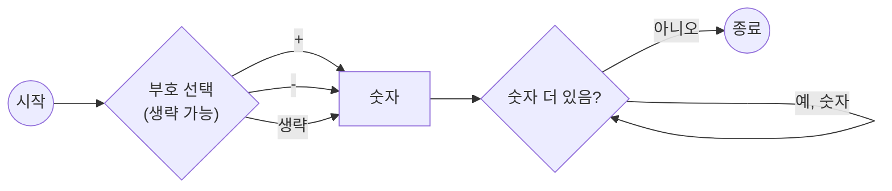

<Callout type="info">
  **이번 문서의 목표:** BNF와 EBNF로 쓰인 문법 규칙을 읽고 어떤 문장이 그 문법에 맞는지 직접 판정할 수 있고, 구문 도표를 보고 같은 판정을 할 수 있다.
</Callout>

## 왜 언어의 문법을 "형식적으로" 적어야 하는가

한국어 문법책은 "주어 다음에 목적어가 오고, 그다음 서술어가 온다" 같은 문장으로 규칙을 설명합니다. 하지만 프로그래밍 언어의 문법을 이런 자연어 문장으로만 적으면 애매함이 생깁니다. "괄호는 중첩해서 써도 되는가", "연산자를 몇 개까지 이어 쓸 수 있는가" 같은 질문에 자연어 설명은 종종 답을 주지 못합니다. 그래서 프로그래밍 언어의 구문(syntax)은 **수학적으로 엄밀하게 정의된 표기법**으로 기술합니다. 이번 편에서 다루는 BNF·EBNF·구문 도표가 바로 그 표기법입니다.

> **쉽게 말하면:** BNF·EBNF·구문 도표는 언어의 문법을 "애매함 없이" 적기 위한 세 가지 서로 다른 표기 방식입니다.

이 편은 **본론 08편**(구문과 의미)에서 BNF/EBNF로 실제 언어 구문을 기술하고 해석하는 문제를 풀기 전에, 표기법 자체의 규칙만 먼저 익히는 선행 편입니다. 여기서는 "문법이 왜 이런 모습으로 쓰이는가"와 "기호를 어떻게 읽는가"에만 집중합니다.

## 1. 문맥 자유 문법이라는 큰 틀

BNF와 EBNF는 모두 **문맥 자유 문법**(context-free grammar, CFG)이라는 수학적 틀 위에서 작동합니다. 문맥 자유 문법이란 "어떤 기호를 다른 기호(들)로 바꿔 쓸 수 있는가"를 정의한 **생성 규칙**(production rule)의 모음입니다. "문맥 자유(context-free)"라는 이름은 어떤 기호를 바꿀 수 있는지가 그 기호의 **주변 맥락과 무관하게** 정해진다는 뜻입니다. 즉 기호 하나를 바꾸는 규칙은 그 기호 앞뒤에 무엇이 있든 상관없이 항상 똑같이 적용됩니다.

문맥 자유 문법은 두 종류의 기호를 구분합니다.

- **단말 기호(terminal symbol)**: 더 이상 다른 기호로 바뀌지 않는, 실제 문장에 그대로 나타나는 기호입니다. 예를 들어 `if`, `+`, `(` 같은 키워드나 연산자, 숫자·식별자 자체가 단말 기호입니다.
- **비단말 기호(nonterminal symbol)**: 생성 규칙을 통해 다른 기호(단말 또는 비단말)의 나열로 바뀔 수 있는 기호입니다. 예를 들어 `<식>`, `<문장>` 처럼 "아직 구체화되지 않은 문법 범주"를 나타내는 이름입니다.

> **쉽게 말하면:** 단말 기호는 "최종적으로 코드에 남는 글자", 비단말 기호는 "아직 더 풀어써야 할 문법 범주의 이름"입니다.

## 2. BNF(Backus-Naur Form) 기초 표기

BNF는 Backus-Naur Form(배커스-나우어 표기법)의 줄임말로, 존 배커스(John Backus)와 피터 나우어(Peter Naur)가 ALGOL 60이라는 언어의 문법을 기술하기 위해 고안한 표기법입니다. BNF의 생성 규칙은 다음과 같은 형태를 가집니다.

```text
<비단말 기호> ::= 대체 가능한 기호열
```

여기서 `::=`는 "~로 정의된다" 또는 "~로 바뀔 수 있다"는 뜻으로 읽습니다. 왼쪽의 비단말 기호를 오른쪽의 기호열로 **대체할 수 있다**는 규칙입니다. 여러 개의 대체 가능한 기호열이 있으면 세로 막대 `|`(또는, or)로 나열합니다.

간단한 예로 "0 이상 9 이하의 한 자리 숫자"를 정의하는 BNF 규칙을 보겠습니다.

```text
<숫자> ::= 0 | 1 | 2 | 3 | 4 | 5 | 6 | 7 | 8 | 9
```

이 규칙은 "비단말 기호 `<숫자>`는 `0`, `1`, `2`, ... , `9` 중 하나로 바뀔 수 있다"는 뜻입니다. `0`부터 `9`까지는 더 이상 바뀌지 않는 단말 기호입니다.

이번에는 "덧셈식"을 정의해 보겠습니다.

```text
<덧셈식> ::= <숫자> | <숫자> + <덧셈식>
```

이 규칙은 재귀적(recursive)입니다. `<덧셈식>`을 정의하는 규칙의 오른쪽에 다시 `<덧셈식>` 자신이 등장하기 때문입니다. 이 재귀 규칙 덕분에 `5`, `5 + 3`, `5 + 3 + 2`처럼 숫자가 몇 개든 이어지는 덧셈식을 하나의 규칙으로 표현할 수 있습니다.

**어떻게 문장이 만들어지는지 유도(derivation) 과정으로 확인해 보겠습니다.** `5 + 3 + 2`가 이 문법에 맞는 문장인지 확인하려면, `<덧셈식>`에서 출발해 규칙을 하나씩 적용하며 원하는 문자열이 나오는지 따라가면 됩니다.

```text
<덧셈식>
  → <숫자> + <덧셈식>        (두 번째 대체 규칙 적용)
  → 5 + <덧셈식>              (<숫자>를 5로 대체)
  → 5 + <숫자> + <덧셈식>     (다시 두 번째 규칙 적용)
  → 5 + 3 + <덧셈식>          (<숫자>를 3으로 대체)
  → 5 + 3 + <숫자>            (첫 번째 대체 규칙 적용, 더 이상 재귀 안 함)
  → 5 + 3 + 2                 (<숫자>를 2로 대체)
```

각 화살표 `→`는 "생성 규칙을 한 번 적용했다"는 뜻입니다. 이렇게 시작 기호(여기서는 `<덧셈식>`)에서 출발해 단말 기호로만 이루어진 문자열에 도달하는 과정을 **유도**라 부르고, 유도로 만들어낼 수 있는 모든 문자열의 집합이 그 문법이 정의하는 **언어**(language)입니다. 이 편에서 사용하는 "언어"라는 말은 01편의 "프로그래밍 언어"와는 다른, "문법이 만들어내는 문자열의 집합"이라는 형식 언어 이론(formal language theory)의 좁은 의미임에 주의해야 합니다.

**자주 틀리는 점**: `::=`를 등호(`=`)와 똑같이 "같다"로 오해하면 안 됩니다. `::=`는 방향성이 있는 "정의·대체" 관계이며, 왼쪽은 반드시 비단말 기호 하나여야 합니다. 오른쪽에 왼쪽과 같은 기호가 다시 등장하는 **재귀 규칙**은 잘못된 것이 아니라, 반복되는 구조(리스트, 중첩된 식 등)를 표현하는 정상적이고 널리 쓰이는 방법입니다.

## 3. EBNF(Extended BNF) — 반복과 선택을 더 간결하게

BNF는 표현력은 충분하지만, "0번 이상 반복", "있어도 되고 없어도 됨" 같은 구조를 표현하려면 재귀 규칙을 여러 겹 써야 해서 문법이 길어지고 읽기 번거로워집니다. 이런 불편을 줄이기 위해 만든 것이 **EBNF**(Extended BNF, 확장 배커스-나우어 표기법)입니다. EBNF는 BNF와 표현할 수 있는 언어의 범위는 같지만, 몇 가지 **편의 기호**를 추가해 더 간결하게 씁니다.

> **쉽게 말하면:** EBNF는 BNF에 "반복", "선택", "생략 가능"을 짧게 쓰는 기호 몇 개를 추가한 표기법입니다.

| 기호 | 의미 | BNF로 풀어 쓴 표현 |
|------|------|----------------------|
| `[ ]`(대괄호) | 대괄호 안 내용이 있어도 되고 없어도 됨(0번 또는 1번) | 비단말 A가 B이거나 빈 문자열인, 재귀 없는 선택 규칙 |
| `{ }`(중괄호) | 중괄호 안 내용이 0번 이상 반복됨 | 비단말 A가 빈 문자열이거나 B 뒤에 A가 다시 오는 재귀 규칙 |
| `( )`(소괄호) | 괄호 안 여러 기호를 하나의 단위로 묶음(우선순위 지정) | 별도의 비단말 기호로 분리해 정의 |
| 세로 막대 기호(또는) | 여러 대안 중 하나 선택(BNF와 동일) | 동일 |

예를 들어 "부호가 있을 수도 없을 수도 있는 정수"를 BNF와 EBNF로 각각 표현해 비교하면 다음과 같습니다.

```text
BNF:
<정수> ::= <부호있는숫자열> | <숫자열>
<부호있는숫자열> ::= + <숫자열> | - <숫자열>
<숫자열> ::= <숫자> | <숫자> <숫자열>

EBNF:
<정수> ::= ['+' | '-'] <숫자> {<숫자>}
```

EBNF 한 줄이 BNF 세 줄을 대신합니다. `['+' | '-']`는 "`+`나 `-` 중 하나가 있어도 되고 없어도 된다"는 뜻이고, `<숫자> {<숫자>}`는 "숫자 하나가 반드시 있고, 그 뒤에 숫자가 0번 이상 더 올 수 있다"는 뜻입니다. 즉 "숫자가 최소 1개 이상"이라는 조건을 `<숫자> {<숫자>}`처럼 "하나 + 반복"의 조합으로 표현하는 것이 EBNF의 흔한 패턴입니다.

**표기 하나를 실제 문자열에 대입해 확인해 보겠습니다.** `-42`가 `['+' | '-'] <숫자> {<숫자>}` 규칙에 맞는지 판정해 보면, `-`는 `['+' | '-']` 자리에, 첫 `4`는 `<숫자>` 자리에, 마지막 `2`는 `{<숫자>}`가 한 번 반복된 자리에 대응하므로 규칙에 맞습니다. 반대로 `4-2`는 부호가 숫자 사이에 끼어 있어 이 규칙의 순서(부호 → 숫자들)에 맞지 않으므로 규칙 위반입니다.

**자주 틀리는 점**: `[ ]`(0번 또는 1번)와 `{ }`(0번 이상)를 뒤바꿔 외우는 실수가 잦습니다. 대괄호는 "괄호를 열고 닫는 모양이 한 번만 여닫히는 느낌"으로, 중괄호는 "여러 번 겹쳐 감쌀 수 있는 반복의 느낌"으로 구분해 기억하면 헷갈림을 줄일 수 있습니다. 또한 EBNF는 BNF보다 **더 강력한 문법**이 아니라, 같은 문맥 자유 문법을 **더 짧게 쓰는 표기 방식**일 뿐이라는 점도 시험에서 자주 확인하는 포인트입니다. 표현할 수 있는 언어의 범위(표현력)는 BNF와 EBNF가 동일합니다.

## 4. 구문 도표(syntax diagram) 읽는 법

구문 도표는 BNF/EBNF와 같은 문법 규칙을 **글자 대신 그림(순서도 형태)으로** 표현한 것입니다. 특히 Pascal 언어의 문법 설명서에서 널리 쓰인 방식입니다.

> **쉽게 말하면:** 구문 도표는 문법 규칙을 화살표를 따라가는 길찾기 그림으로 바꾼 것입니다.

구문 도표를 읽는 규칙은 다음과 같습니다.

- **타원(또는 둥근 상자)**: 단말 기호(그대로 등장하는 키워드·기호)를 나타냅니다.
- **사각형**: 비단말 기호(다른 도표로 더 풀어써야 하는 문법 범주)를 나타냅니다.
- **화살표를 따라가는 경로**: 왼쪽에서 오른쪽으로 화살표를 따라가면서 지나치는 기호들이 순서대로 나열된 것이 하나의 유효한 문장이 됩니다.
- **갈라지는 경로**: 여러 갈래로 길이 나뉘면 그중 하나의 경로만 선택해서 지나가면 됩니다(선택, BNF의 `|`에 대응).
- **되돌아가는 경로(고리)**: 화살표가 앞으로 돌아가는 고리 모양이면 그 구간을 여러 번 반복할 수 있다는 뜻입니다(EBNF의 `{ }`에 대응).

앞서 다룬 "부호가 있을 수도 없을 수도 있는 정수"(EBNF: `['+' | '-'] <숫자> {<숫자>}`)를 구문 도표로 그리면 다음과 같은 흐름이 됩니다.



이 그림을 왼쪽 시작점에서 오른쪽 종료점까지 따라가면서 지나친 단말 기호들을 순서대로 적으면, 그 문법이 허용하는 문장 하나가 만들어집니다. 예를 들어 시작 → 부호 생략 → 숫자(`4`) → 숫자 더 있음(`2`) → 숫자 더 있음 없음 → 종료 경로를 따라가면 `42`라는 문자열이 만들어지고, 시작 → 부호 `-` → 숫자(`4`) → 숫자 더 있음(`2`) → 종료 경로를 따라가면 `-42`가 만들어집니다.

**자주 틀리는 점**: 구문 도표에서 "고리(반복 경로)를 한 번도 지나가지 않는 것"이 허용되는지 아닌지는 도표마다 다릅니다. 위 예시처럼 `<숫자> {<숫자>}` 구조를 표현한 도표는 첫 숫자 하나는 반드시 지나가야 하고(최소 1개), 반복 고리는 0번 지나가도 됩니다. 도표를 읽을 때는 "어느 지점부터가 생략·반복 가능한 구간인가"를 정확히 구분해야 합니다.

## 5. BNF·EBNF·구문 도표 비교

세 표기법은 표현할 수 있는 문법의 범위(문맥 자유 문법)가 동일하며, 서로 변환이 가능합니다. 차이는 오직 **표기의 형태와 가독성**입니다.

| 구분 | BNF | EBNF | 구문 도표 |
|------|-----|------|-------------|
| 표현 형태 | 텍스트, 재귀 규칙으로 반복·선택 표현 | 텍스트, `[ ]` `{ }` `( )` 기호로 반복·선택을 간결하게 표현 | 그림(도형과 화살표) |
| 표현력(만들 수 있는 언어의 범위) | 문맥 자유 문법 | BNF와 동일 | BNF·EBNF와 동일 |
| 반복 표현 | 재귀 규칙 필요 | `{ }` 기호로 직접 표현 | 되돌아가는 고리로 표현 |
| 읽기 난이도 | 규칙이 많아지면 복잡해짐 | BNF보다 간결 | 시각적으로 직관적이나 규칙이 많으면 도표가 커짐 |
| 대표 사용 사례 | ALGOL 60 언어 정의 | 다수의 최신 언어 표준 문서 | Pascal 언어 문법 설명서 |

**자주 틀리는 점**: "구문 도표는 BNF/EBNF보다 더 많은 언어를 표현할 수 있다"거나 "EBNF는 BNF로 표현할 수 없는 문법도 표현할 수 있다"는 식의 보기는 옳지 않습니다. 셋 다 문맥 자유 문법이라는 **같은 표현력**을 가진 서로 다른 표기 방식일 뿐입니다.

## 핵심 정리

- 문맥 자유 문법은 단말 기호(최종적으로 남는 글자)와 비단말 기호(더 풀어써야 할 문법 범주), 그리고 이들 사이의 생성 규칙으로 구성된다.
- BNF는 `<비단말> ::= 대체 기호열`의 형태로 규칙을 적고, 재귀 규칙으로 반복·중첩 구조를 표현한다.
- EBNF는 `[ ]`(0 또는 1번), `{ }`(0번 이상 반복), `( )`(묶음) 기호를 추가해 BNF와 같은 표현력을 더 간결하게 쓴 것이다.
- 구문 도표는 같은 문법을 타원(단말)·사각형(비단말)·화살표(순서)·갈래(선택)·고리(반복)로 이루어진 그림으로 표현한 것이며, BNF·EBNF와 표현력이 동일하다.

## 마무리 복습

<Quiz
  questionNumber={1}
  question="문맥 자유 문법에서 단말 기호와 비단말 기호를 구분한 설명으로 가장 적절한 것은?"
  options={['단말 기호는 더 풀어써야 할 문법 범주이고, 비단말 기호는 실제 문장에 그대로 남는 글자다', '단말 기호는 실제 문장에 그대로 남는 글자이고, 비단말 기호는 생성 규칙을 통해 다른 기호열로 바뀔 수 있는 범주다', '단말 기호와 비단말 기호는 같은 대상을 부르는 서로 다른 이름일 뿐이다', '비단말 기호는 항상 숫자나 연산자와 같은 기호만을 가리킨다']}
  correctAnswer={2}
  explanation="단말 기호는 if, +, 숫자처럼 문장에 그대로 남는 최종 기호이고, 비단말 기호는 식, 문장처럼 생성 규칙을 통해 다른 기호열로 대체될 수 있는 문법 범주다."
  optionExplanations={['단말과 비단말의 정의가 서로 뒤바뀐 설명이다.', '단말·비단말의 정의를 정확히 짝지은 설명이다.', '두 기호는 역할이 명확히 다른 별개의 개념이다.', '비단말 기호는 식, 문장 등 범주 이름을 가리키며 숫자·연산자 자체가 아니다.']}
/>

<Quiz
  questionNumber={2}
  question="BNF 규칙 숫자열 ::= 숫자 | 숫자 숫자열 에 대한 설명으로 옳지 않은 것은?"
  options={['이 규칙은 재귀적으로 정의되어 있다', '이 규칙으로 한 자리 이상의 숫자 나열을 표현할 수 있다', '::= 기호는 왼쪽과 오른쪽이 완전히 대등한 등호 관계임을 뜻한다', '이 규칙은 숫자가 최소 1개 이상 있어야 함을 나타낸다']}
  correctAnswer={3}
  explanation="::= 는 왼쪽의 비단말 기호가 오른쪽 기호열로 대체될 수 있다는 정의·대체 관계를 나타내는 것이지, 좌우가 완전히 대등한 수학적 등호와 같은 의미가 아니다."
  optionExplanations={['오른쪽에 숫자열 자신이 다시 등장하므로 재귀적 정의가 맞다.', '재귀 규칙 덕분에 숫자가 몇 개든 이어지는 나열을 표현할 수 있다.', '::= 는 등호가 아니라 방향성 있는 정의·대체 관계이므로 이 설명은 옳지 않다.', '첫 대안이 숫자 하나이므로 최소 1개는 반드시 있어야 한다.']}
/>

<Quiz
  questionNumber={3}
  question="EBNF 표기 `[ ]`와 `{ }`의 의미를 바르게 짝지은 것은?"
  options={['[ ]는 0번 이상 반복, { }는 0번 또는 1번 등장', '[ ]는 0번 또는 1번 등장, { }는 0번 이상 반복', '[ ]와 { }는 모두 정확히 1번만 등장함을 뜻한다', '[ ]는 여러 대안 중 하나 선택, { }는 우선순위 묶음을 뜻한다']}
  correctAnswer={2}
  explanation="대괄호 [ ]는 그 안의 내용이 있어도 되고 없어도 됨(0번 또는 1번)을, 중괄호 { }는 그 안의 내용이 0번 이상 반복될 수 있음을 나타낸다."
  optionExplanations={['[ ]와 { }의 의미가 서로 뒤바뀐 설명이다.', '[ ]와 { }의 의미를 정확히 짝지은 설명이다.', '두 기호 모두 등장 횟수가 고정되어 있지 않다는 점에서 옳지 않다.', '선택은 |, 우선순위 묶음은 ( )가 담당하는 역할이다.']}
/>

<Quiz
  questionNumber={4}
  question="EBNF 규칙 정수 ::= 부호(생략 가능) 숫자 {숫자} 에 맞는 문자열이 아닌 것은?"
  options={['42', '-42', '+7', '4-2']}
  correctAnswer={4}
  explanation="이 규칙은 부호(있어도 없어도 됨) 다음에 숫자 하나 이상이 곧바로 이어지는 구조다. '4-2'는 부호가 숫자들 사이에 끼어 있어 정의된 순서(부호 → 숫자들)에 맞지 않으므로 이 문법에 맞지 않는다."
  optionExplanations={['부호를 생략하고 숫자만 이어진 경우로 규칙에 맞는다.', '부호 -와 숫자열이 순서대로 이어진 경우로 규칙에 맞는다.', '부호 +와 숫자 하나가 이어진 경우로 규칙에 맞는다.', '부호가 숫자 중간에 끼어 있어 정의된 순서를 위반한다.']}
/>

<Quiz
  questionNumber={5}
  question="BNF, EBNF, 구문 도표 세 표기법의 관계에 대한 설명으로 가장 적절한 것은?"
  options={['구문 도표는 BNF/EBNF로 표현할 수 없는 더 넓은 범위의 언어를 표현할 수 있다', 'EBNF는 BNF보다 표현력이 더 강력해서 BNF로는 정의할 수 없는 문법도 정의할 수 있다', '세 표기법은 표현력(문맥 자유 문법)이 동일하며 표기의 형태와 가독성에서만 차이가 있다', 'BNF는 그림 기반 표기법이고 구문 도표는 텍스트 기반 표기법이다']}
  correctAnswer={3}
  explanation="BNF, EBNF, 구문 도표는 모두 문맥 자유 문법을 기술하는 서로 다른 표기 방식일 뿐이며 표현할 수 있는 언어의 범위(표현력)는 동일하다. 차이는 표기의 형태와 가독성에 있다."
  optionExplanations={['구문 도표도 문맥 자유 문법의 범위를 벗어나지 못하므로 옳지 않다.', 'EBNF는 BNF와 표현력이 같고 표기만 더 간결할 뿐이다.', '세 표기법의 표현력이 동일하다는 정확한 설명이다.', 'BNF는 텍스트 기반, 구문 도표는 그림 기반이므로 설명이 뒤바뀌었다.']}
/>

<Quiz
  questionNumber={6}
  question="구문 도표를 읽는 방법에 대한 설명으로 옳지 않은 것은?"
  options={['타원(또는 둥근 상자)은 단말 기호를 나타낸다', '사각형은 비단말 기호를 나타낸다', '화살표가 앞으로 되돌아가는 고리는 그 구간이 반복될 수 있음을 나타낸다', '경로가 여러 갈래로 나뉘면 모든 갈래를 동시에 지나가야 한다']}
  correctAnswer={4}
  explanation="경로가 여러 갈래로 나뉘는 것은 BNF의 |(또는)에 대응하는 선택을 의미하며, 그중 하나의 경로만 선택해 지나가면 된다. 모든 갈래를 동시에 지나가야 한다는 설명은 옳지 않다."
  optionExplanations={['구문 도표에서 타원은 단말 기호를 나타내는 것이 맞다.', '구문 도표에서 사각형은 비단말 기호를 나타내는 것이 맞다.', '되돌아가는 고리는 반복 구조를 나타내는 것이 맞다.', '갈래는 선택지이며 그중 하나만 선택해 지나가면 된다.']}
/>

## 참고 자료

- 국가평생교육진흥원 독학학위제: https://bdes.nile.or.kr
