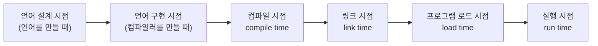

<Callout type="info">
  **이번 문서의 목표:** 이름·선언·정의·형·바인딩·스코프·수명이라는 용어들이 서로 어떤 관계에 있는지 구분해 말할 수 있고, 09~11편의 심화 내용을 읽을 때 용어 때문에 막히지 않게 된다.
</Callout>

## 왜 이 용어들을 먼저 지도로 정리해야 하는가

`int x = 3;`이라는 한 줄의 코드를 보면 "변수 `x`를 정수형으로 선언하고 3으로 초기화했다"라고 쉽게 말할 수 있습니다. 하지만 이 한 줄 안에는 사실 **이름(name)**, **선언(declaration)**, **형(type)**, **값(value)**, **바인딩**(binding), **스코프**(scope), **수명**(lifetime)이라는 최소 일곱 개의 개념이 동시에 얽혀 있습니다. 09편(이름·바인딩·스코프·수명 심화)과 10편(자료형과 형 시스템)에서는 이 개념들을 하나씩 깊게 파고들며 시험에 나오는 세부 쟁점(정적/동적 바인딩, 강형/약형 등)을 다룹니다. 이번 편은 그 심화 학습에 들어가기 전에, **일곱 개 용어가 서로 어떤 관계로 얽혀 있는지 큰 그림**을 먼저 그려 두는 선행 편입니다.

> **쉽게 말하면:** 이번 편은 "이름", "형", "바인딩", "스코프"라는 낱말들이 서로 뭐가 다르고 어떻게 연결되는지 지도부터 그리는 편입니다.

## 1. 이름(name)과 식별자(identifier)

**이름**(name)은 프로그램 안에서 어떤 대상(변수, 함수, 형 등)을 가리키기 위해 붙이는 문자열입니다. 이름 중에서도 프로그래밍 언어의 문법 규칙(영문자로 시작, 특수문자 제한 등)을 만족하는 이름을 특별히 **식별자**(identifier)라고 부릅니다.

> **쉽게 말하면:** 이름은 대상을 부르는 글자, 식별자는 그 이름이 문법 규칙에 맞게 지어졌는지를 가리키는 말입니다.

예를 들어 `total_sum`, `count`, `main` 같은 문자열은 식별자입니다. 반면 `+`, `if`처럼 언어가 미리 정해 놓은 연산자나 예약어(reserved word)는 프로그래머가 새로운 이름을 붙이는 대상이 아니므로 식별자와는 구분됩니다. 이름은 변수뿐 아니라 함수, 클래스, 형(type) 등 프로그램의 거의 모든 구성 요소에 붙을 수 있습니다.

**자주 틀리는 점**: "이름"과 "변수"를 같은 말로 혼동하기 쉽습니다. 변수는 값을 담는 저장 공간이라는 실체이고, 이름은 그 실체를 가리키기 위해 붙인 문자열입니다. 같은 저장 공간을 여러 이름으로 부를 수 있는 경우(별칭, alias)도 있으므로 "이름 하나 = 변수 하나"라는 등식이 항상 성립하는 것은 아닙니다.

## 2. 선언(declaration)과 정의(definition)

**선언**(declaration)은 "이런 이름의 대상이 존재하고, 어떤 형(type)을 갖는다"는 사실을 컴파일러나 인터프리터에게 알려 주는 문장입니다. **정의**(definition)는 그 대상이 실제로 사용할 **저장 공간을 할당**하는 것까지 포함하는 개념입니다.

> **쉽게 말하면:** 선언은 "이런 이름이 있다"는 알림이고, 정의는 그 이름을 위한 실제 자리를 마련하는 것입니다.

많은 언어(C 등)에서는 선언과 정의가 한 문장에서 동시에 이루어지는 경우가 대부분입니다. `int x;`는 `x`라는 이름의 정수형 변수가 있다는 선언이면서, 동시에 그 변수를 위한 메모리 공간을 실제로 마련하는 정의이기도 합니다. 하지만 두 개념이 항상 같은 문장에서 함께 일어나는 것은 아닙니다. C에서 함수 원형(prototype)만 적는 `int add(int a, int b);`는 "이런 이름과 형을 가진 함수가 존재한다"는 **선언**일 뿐, 실제 함수의 몸체(구현)를 갖는 **정의**는 다른 곳(또는 다른 파일)에 따로 있을 수 있습니다.

**자주 틀리는 점**: 선언과 정의를 같은 말로 여기면, "한 프로그램 안에서 같은 대상을 여러 번 선언할 수는 있지만 정의는 한 번만 가능하다"는 식의 언어 규칙을 이해하기 어려워집니다. 선언은 "존재를 알리는 약속"이라 여러 번 반복해도 되는 경우가 있지만, 정의는 "실제 자리를 마련하는 행위"이므로 같은 대상에 대해 중복되면 안 된다는 차이를 기억해야 합니다.

## 3. 형(type)·값(value)·표현식(expression)

- **형(type)**: 어떤 값들의 집합과, 그 값들에 적용할 수 있는 연산의 집합을 함께 정의한 것입니다. 예를 들어 정수형(int)은 "정수 값들의 집합"과 "덧셈·뺄셈 같은 산술 연산"을 함께 규정합니다.
- **값(value)**: 실제로 메모리에 저장되는 구체적인 데이터입니다. `3`, `'A'`, `true` 같은 것이 값입니다.
- **표현식(expression)**: 값을 계산해 내는 코드 조각입니다. `3 + 4`, `x * 2` 같은 것이 표현식이며, 계산된 결과로 하나의 값을 만들어 냅니다.

> **쉽게 말하면:** 형은 "어떤 종류의 값을 어떤 연산으로 다룰 수 있는가에 대한 규칙", 값은 "실제 데이터 하나", 표현식은 "값을 만들어내는 계산 조각"입니다.

세 개념의 관계를 코드로 확인해 보겠습니다.

```c
int result = 3 + 4;
```

이 문장에서 `3 + 4`는 표현식이고, 이 표현식이 계산되어 만들어내는 결과가 값 `7`입니다. `int`는 변수 `result`의 형이며, "정수 집합에 속하는 값만 담을 수 있고, 그 값에 산술 연산을 적용할 수 있다"는 규칙을 함께 규정합니다. 형 시스템의 세부 쟁점(강형/약형, 정적/동적 형 검사)은 10편에서 깊게 다룹니다.

**자주 틀리는 점**: "형은 값이다"라는 식으로 두 개념을 혼동하면 안 됩니다. 형은 값들의 **집합과 규칙**이고, 값은 그 집합에 속하는 **개별 원소**입니다. `int`라는 형 자체는 메모리에 저장되는 데이터가 아니라, `3`이나 `-5` 같은 실제 값들이 지켜야 할 규칙의 이름입니다.

## 4. 바인딩(binding)과 바인딩 시기(binding time)

**바인딩**(binding)은 프로그램의 어떤 속성(이름, 형, 저장 위치 등)과 그 속성의 구체적인 값 또는 성질 사이에 **연결 관계가 맺어지는 것**을 말합니다. 예를 들어 "이름 `x`가 특정 메모리 주소와 연결된다", "변수 `x`가 정수형이라는 성질과 연결된다" 같은 것이 모두 바인딩입니다.

> **쉽게 말하면:** 바인딩은 "무엇과 무엇이 서로 짝지어지는 사건"입니다. 이름과 값이 짝지어지고, 변수와 형이 짝지어지고, 변수와 메모리 주소가 짝지어지는 모든 사건이 바인딩입니다.

바인딩에서 특히 중요한 것은 **그 연결이 언제 일어나는가**, 즉 **바인딩 시기**(binding time)입니다. 바인딩 시기는 크게 두 단계로 나눌 수 있습니다.



| 바인딩 시기 | 언제 일어나는가 | 예시 |
|--------------|-------------------|------|
| 언어 설계 시점 | 언어 자체가 만들어질 때 | `+` 연산자가 덧셈을 의미한다는 규칙 |
| 언어 구현 시점 | 컴파일러·인터프리터가 만들어질 때 | `int`형이 몇 바이트를 차지하는지 |
| 컴파일 시점 | 소스 코드가 번역될 때 | 변수 `x`의 형이 정수형으로 정해지는 것(정적 형 언어의 경우) |
| 실행 시점 | 프로그램이 실제로 돌아갈 때 | 변수 `x`가 실제 메모리의 어느 주소에 놓이는지, 변수에 특정 값이 대입되는 것 |

바인딩이 **컴파일 시점 이전**(언어 설계·구현·컴파일 시점)에 정해지면 **정적 바인딩**(static binding)이라 부르고, **실행 시점**에 정해지면 **동적 바인딩**(dynamic binding)이라 부릅니다. 정적/동적 바인딩이 스코프·형 검사와 만나 만들어내는 세부 쟁점(정적 스코프 vs 동적 스코프, 정적 형 검사 vs 동적 형 검사)은 09~10편에서 본격적으로 다룹니다. 이번 편에서는 "바인딩은 시기에 따라 나뉘고, 그 시기가 이르냐 늦냐가 중요한 분류 기준이다"라는 큰 틀만 잡아 둡니다.

**자주 틀리는 점**: 바인딩을 "변수에 값을 대입하는 것"으로만 좁게 이해하면 안 됩니다. 바인딩은 값의 대입뿐 아니라 **이름과 형의 연결**, **이름과 메모리 주소의 연결** 등 훨씬 넓은 범위의 "연결 관계"를 가리키는 포괄적인 용어입니다.

## 5. 스코프(scope)와 수명(lifetime)

**스코프**(scope)는 어떤 이름이 프로그램의 어느 범위(코드 영역)에서 유효하게 참조될 수 있는지를 나타냅니다. **수명**(lifetime)은 그 이름이 가리키는 대상(변수의 저장 공간)이 실제로 메모리에 존재하는 시간 구간을 나타냅니다.

> **쉽게 말하면:** 스코프는 "이 이름을 코드의 어느 부분에서 부를 수 있는가"이고, 수명은 "그 대상이 메모리에 실제로 살아 있는 시간이 언제부터 언제까지인가"입니다.

```c
void 함수A() {
    int 지역변수 = 10;   // 지역변수의 스코프와 수명이 여기서 시작
    // ... 지역변수를 사용하는 코드 ...
}                          // 함수A가 끝나는 순간 지역변수의 스코프와 수명이 함께 끝남
```

이 예시에서 `지역변수`라는 이름은 `함수A`의 몸체 안에서만 참조할 수 있습니다(스코프). 그리고 `함수A`가 호출되어 실행되는 동안에만 `지역변수`를 위한 메모리 공간이 실제로 존재합니다(수명). 이 예시처럼 지역 변수는 스코프와 수명이 거의 같은 범위에서 시작하고 끝나는 경우가 많지만, 둘은 개념적으로 **독립적**입니다. 정적 변수(static variable)나 클로저(closure)가 참조하는 변수처럼, 스코프(참조 가능한 코드 범위)는 좁아도 수명(메모리에 살아 있는 기간)은 훨씬 길게 유지되는 경우도 있습니다. 이런 스코프·수명의 세부 규칙(정적 스코프 vs 동적 스코프, 저장 클래스에 따른 수명 차이)은 09편에서 심화해 다룹니다.

**자주 틀리는 점**: "스코프가 끝나면 수명도 반드시 함께 끝난다"고 일반화하면 안 됩니다. 대부분의 지역 변수는 그렇게 보이지만, 정적 변수처럼 함수 호출이 끝난 뒤에도(스코프를 벗어나 이름으로 더는 부를 수 없어도) 값이 메모리에 남아 다음 호출 때 이어서 쓰이는 경우가 있습니다. 이런 경우 스코프는 함수 안으로 한정되지만 수명은 프로그램 전체 실행 기간만큼 깁니다.

## 6. 일곱 용어의 관계를 하나로 묶어 보기

지금까지 다룬 일곱 개 용어가 코드 한 줄 안에서 어떻게 함께 작동하는지 정리해 보겠습니다.

```c
int 합계 = 0;
```

1. `합계`는 **이름**(식별자)입니다.
2. `int 합계 = 0;`은 `합계`라는 이름의 존재를 알리는 **선언**이면서, 동시에 실제 메모리 공간을 마련하는 **정의**이기도 합니다.
3. `int`는 `합계`의 **형**이고, `0`은 그 형에 속하는 구체적인 **값**입니다.
4. `합계`라는 이름이 `int`라는 형과 연결되는 것, 그리고 `합계`가 특정 메모리 주소와 연결되는 것이 모두 **바인딩**이며, 이 바인딩이 언제 일어나는지가 **바인딩 시기**입니다.
5. `합계`라는 이름을 코드의 어디에서 부를 수 있는지가 **스코프**이고, `합계`를 위한 메모리 공간이 실제로 존재하는 기간이 **수명**입니다.

| 용어 | 이 예시에서의 의미 |
|------|------------------------|
| 이름 | `합계` |
| 선언·정의 | `int 합계 = 0;` 문장 자체 |
| 형 | `int` |
| 값 | `0` |
| 바인딩 | `합계` ↔ `int`, `합계` ↔ 메모리 주소의 연결 |
| 스코프 | `합계`를 참조할 수 있는 코드 범위 |
| 수명 | `합계`의 저장 공간이 메모리에 존재하는 기간 |

**자주 틀리는 점**: 시험에서는 이 일곱 용어 중 두세 개를 뒤섞어 놓고 "다음 중 옳게 짝지어진 것은?" 형태로 묻는 경우가 많습니다. 예를 들어 "스코프는 메모리 공간이 존재하는 기간을 뜻한다"처럼 스코프와 수명의 정의를 바꿔치기하거나, "선언은 반드시 저장 공간을 할당하는 것을 포함한다"처럼 선언과 정의의 정의를 바꿔치기하는 함정이 대표적입니다. 각 용어를 다른 용어와 짝지어 "무엇과 무엇을 헷갈릴 수 있는가"까지 함께 기억해 두는 것이 중요합니다.

## 핵심 정리

- 이름(name)은 대상을 부르는 문자열이며, 문법 규칙에 맞는 이름을 식별자(identifier)라 한다.
- 선언(declaration)은 이름의 존재를 알리는 것이고, 정의(definition)는 그 이름을 위한 실제 저장 공간을 마련하는 것이다. 두 개념은 한 문장에서 함께 일어날 수도 있지만 항상 같지는 않다.
- 형(type)은 값들의 집합과 그에 적용되는 연산의 규칙이고, 값(value)은 그 집합의 개별 원소이며, 표현식(expression)은 값을 계산해 내는 코드 조각이다.
- 바인딩(binding)은 이름·형·저장 위치 등이 서로 연결되는 사건이며, 그 연결이 언제 일어나는가(바인딩 시기)에 따라 정적 바인딩과 동적 바인딩으로 나뉜다.
- 스코프(scope)는 이름을 참조할 수 있는 코드 범위이고, 수명(lifetime)은 대상이 메모리에 실제로 존재하는 시간 구간이다. 두 개념은 대개 함께 시작·종료하지만 정적 변수처럼 독립적으로 어긋날 수도 있다.

## 마무리 복습

<Quiz
  questionNumber={1}
  question="이름(name)과 식별자(identifier)의 관계에 대한 설명으로 가장 적절한 것은?"
  options={['이름과 식별자는 완전히 같은 개념으로 구분할 필요가 없다', '식별자는 언어의 문법 규칙을 만족하는 이름을 가리키는 말이다', '식별자는 변수에만 적용되고 함수나 형에는 적용되지 않는다', '이름은 항상 하나의 변수에만 대응하며 별칭은 존재할 수 없다']}
  correctAnswer={2}
  explanation="이름은 대상을 부르는 문자열이고, 식별자는 그 이름 중에서도 언어의 문법 규칙(영문자로 시작, 특수문자 제한 등)을 만족하는 것을 가리키는 말이다."
  optionExplanations={['이름은 더 포괄적인 개념이고 식별자는 문법 규칙을 만족하는 이름이라는 점에서 구분된다.', '식별자에 대한 정확한 정의다.', '식별자는 변수뿐 아니라 함수, 클래스, 형 등에도 붙을 수 있다.', '같은 저장 공간을 여러 이름(별칭)으로 부를 수 있는 경우도 존재한다.']}
/>

<Quiz
  questionNumber={2}
  question="선언(declaration)과 정의(definition)를 구분한 설명으로 옳지 않은 것은?"
  options={['선언은 이름과 형이 존재한다는 사실을 알리는 것이다', '정의는 그 대상이 사용할 실제 저장 공간을 마련하는 것을 포함한다', 'C에서 함수 원형만 적은 문장은 정의이며 반드시 저장 공간까지 할당한다', '많은 언어에서 선언과 정의가 한 문장에서 동시에 이루어지는 경우가 많다']}
  correctAnswer={3}
  explanation="C에서 함수 원형(프로토타입)만 적은 문장은 선언일 뿐이며, 실제 함수 몸체(구현)를 갖는 정의는 다른 곳에 따로 있을 수 있다. 원형 선언 자체가 저장 공간을 할당하지는 않는다."
  optionExplanations={['선언에 대한 옳은 설명이다.', '정의에 대한 옳은 설명이다.', '함수 원형만 적은 문장은 정의가 아니라 선언이므로 이 설명은 옳지 않다.', 'int x = 3; 처럼 선언과 정의가 한 문장에서 함께 일어나는 경우가 흔하다.']}
/>

<Quiz
  questionNumber={3}
  question="형(type)·값(value)·표현식(expression)에 대한 설명으로 가장 적절한 것은?"
  options={['형은 메모리에 저장되는 구체적인 데이터 자체를 가리킨다', '값은 값들의 집합과 그에 적용되는 연산의 규칙을 가리킨다', '표현식은 계산되어 하나의 값을 만들어 내는 코드 조각이다', '형과 값은 완전히 같은 개념으로 서로 바꿔 써도 무방하다']}
  correctAnswer={3}
  explanation="표현식은 3 + 4처럼 계산을 통해 하나의 값을 만들어 내는 코드 조각이다. 형은 값들의 집합과 연산 규칙을, 값은 그 집합의 개별 원소를 가리킨다."
  optionExplanations={['메모리에 저장되는 구체적인 데이터는 값이지 형이 아니다.', '값들의 집합과 연산 규칙을 가리키는 것은 형이지 값이 아니다.', '표현식에 대한 정확한 설명이다.', '형은 집합과 규칙, 값은 그 집합의 원소로 서로 다른 개념이다.']}
/>

<Quiz
  questionNumber={4}
  question="바인딩(binding)과 바인딩 시기(binding time)에 대한 설명으로 옳지 않은 것은?"
  options={['바인딩은 이름과 형, 이름과 메모리 주소 등 다양한 속성 사이의 연결 관계를 포괄하는 개념이다', '바인딩이 컴파일 시점 이전에 정해지면 정적 바인딩, 실행 시점에 정해지면 동적 바인딩이라 한다', '바인딩은 오직 변수에 값을 대입하는 행위만을 가리키는 좁은 개념이다', '바인딩 시기는 언어 설계 시점부터 실행 시점까지 여러 단계로 나눌 수 있다']}
  correctAnswer={3}
  explanation="바인딩은 값의 대입뿐 아니라 이름과 형의 연결, 이름과 메모리 주소의 연결 등을 포괄하는 넓은 개념이다. 변수에 값을 대입하는 행위만으로 좁게 정의하는 것은 옳지 않다."
  optionExplanations={['바인딩에 대한 정확하고 포괄적인 설명이다.', '정적 바인딩과 동적 바인딩의 구분 기준에 대한 옳은 설명이다.', '바인딩은 값의 대입뿐 아니라 형·주소 연결 등을 포함하는 더 넓은 개념이므로 이 설명은 옳지 않다.', '언어 설계·구현·컴파일·링크·로드·실행 시점 등 여러 단계로 나눌 수 있다.']}
/>

<Quiz
  questionNumber={5}
  question="스코프(scope)와 수명(lifetime)의 관계에 대한 설명으로 가장 적절한 것은?"
  options={['스코프와 수명은 항상 완전히 같은 범위에서 시작하고 끝난다', '스코프는 이름을 참조할 수 있는 코드 범위이고, 수명은 대상이 메모리에 존재하는 시간 구간으로 개념적으로 독립적이다', '수명은 이름을 참조할 수 있는 코드 범위를 뜻하고, 스코프는 메모리 존재 기간을 뜻한다', '정적 변수는 스코프와 수명이 항상 동시에 끝난다']}
  correctAnswer={2}
  explanation="스코프는 이름을 참조할 수 있는 코드 범위이고 수명은 대상이 메모리에 실제로 존재하는 시간 구간이다. 대부분의 지역 변수는 두 범위가 비슷하게 겹치지만, 정적 변수처럼 개념적으로 독립적으로 어긋나는 경우도 있다."
  optionExplanations={['정적 변수 사례처럼 스코프와 수명이 어긋날 수 있으므로 항상 같다는 설명은 옳지 않다.', '스코프와 수명의 정의와 독립성에 대한 정확한 설명이다.', '스코프와 수명의 정의가 서로 뒤바뀐 설명이다.', '정적 변수는 스코프는 함수 안으로 한정되지만 수명은 프로그램 전체 실행 기간만큼 길어 서로 어긋나는 대표 사례다.']}
/>

<Quiz
  questionNumber={6}
  question="`int 합계 = 0;` 이라는 코드에 이름·형·값·바인딩·스코프·수명 개념을 적용한 설명으로 옳지 않은 것은?"
  options={['`합계`는 이름(식별자)에 해당한다', '`int`는 `합계`의 형에 해당하고 `0`은 그 형에 속하는 값에 해당한다', '`합계`라는 이름이 `int`라는 형과 연결되는 것은 바인딩에 해당한다', '`합계`의 스코프와 수명은 어떤 경우에도 항상 정확히 일치해야 한다']}
  correctAnswer={4}
  explanation="지역 변수의 스코프와 수명은 대개 비슷하게 겹치지만, 정적 변수 등의 사례에서 보듯 스코프와 수명은 개념적으로 독립적이며 항상 정확히 일치해야 하는 것은 아니다."
  optionExplanations={['`합계`는 식별자 규칙을 만족하는 이름이 맞다.', 'int와 0의 관계는 형과 값의 관계로 정확히 짝지어졌다.', '이름과 형의 연결은 바인딩의 대표적인 예다.', '정적 변수 사례처럼 스코프와 수명이 어긋날 수 있으므로 항상 일치해야 한다는 설명은 옳지 않다.']}
/>

## 참고 자료

- 국가평생교육진흥원 독학학위제: https://bdes.nile.or.kr
