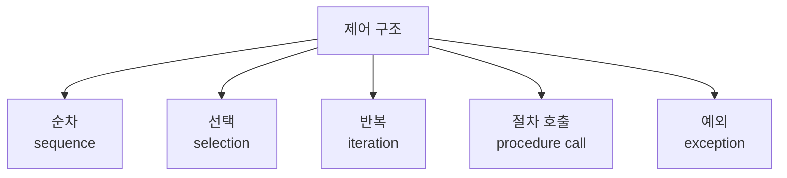
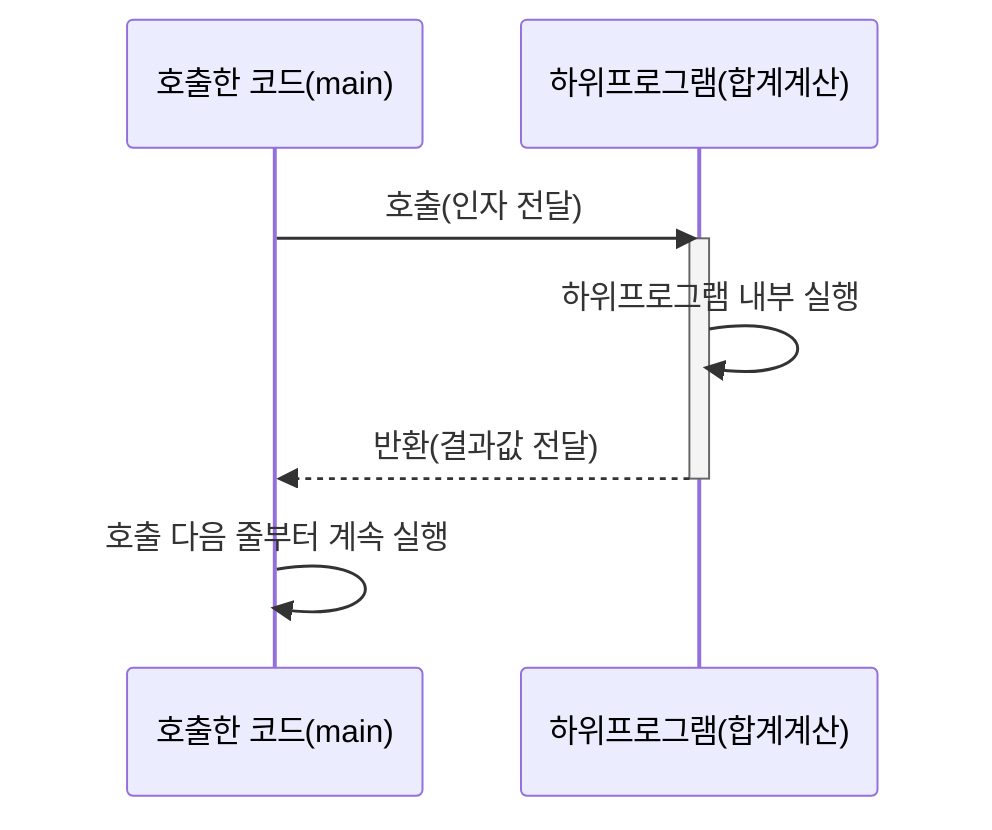

<Callout type="info">
  **이번 문서의 목표:** 제어 구조를 순차·선택·반복·절차 호출·예외 다섯 갈래로 분류해 설명할 수 있고, 하위프로그램·함수·프로시저·매개변수·인자라는 용어를 정확히 구분해 말할 수 있다.
</Callout>

## 왜 제어 구조와 하위프로그램을 한 편에서 함께 다루는가

코드 한 줄이 실행되고 나면 "그다음에는 어떤 줄이 실행되는가"를 결정하는 것이 **제어 구조**(control structure)입니다. 그리고 코드를 하나의 이름으로 묶어 여러 번 재사용하고, 실행 중 다른 곳으로 흐름을 옮겼다가 다시 돌아오게 하는 것이 **하위프로그램**(subprogram)입니다. 두 개념은 모두 "프로그램의 실행 흐름을 어떻게 통제하는가"라는 같은 질문에 대한 답이라는 점에서 한 편으로 묶었습니다. 이번 편에서는 시험에서 깊게 다루는 세부 쟁점(제어 구조별 설계 비교는 13편, 매개변수 전달 방식은 14편, 활성화 레코드는 15편)에 들어가기 전에, **분류와 용어**만 먼저 정리합니다.

> **쉽게 말하면:** 제어 구조는 "다음에 어느 줄로 갈 것인가"를 정하는 규칙이고, 하위프로그램은 "코드 뭉치를 이름 붙여 불러 쓰는 방법"입니다.

## 1. 제어 구조의 다섯 갈래 분류

프로그램의 실행 흐름은 근본적으로 다섯 가지 방식으로 통제됩니다.



| 분류 | 의미 | 대표 문법 |
|------|------|-------------|
| 순차(sequence) | 문장을 코드에 적힌 순서 그대로 하나씩 실행 | 문장을 세미콜론(`;`)으로 나열 |
| 선택(selection) | 조건에 따라 여러 갈래 중 하나의 실행 경로만 선택 | `if`, `switch` |
| 반복(iteration) | 조건을 만족하는 동안 같은 코드 블록을 여러 번 반복 실행 | `for`, `while`, `do-while` |
| 절차 호출(procedure call) | 실행 흐름을 다른 코드 블록(하위프로그램)으로 옮겼다가 되돌아옴 | 함수·프로시저 호출문 |
| 예외(exception) | 정상 흐름 중 예상치 못한 상황이 발생하면 흐름을 다른 처리 코드로 강제로 옮김 | `try`-`catch` |

**순차**는 가장 기본이 되는 흐름으로, 특별한 문법 없이 문장을 위에서 아래로 나열하는 것 자체가 순차 구조입니다. **선택**과 **반복**은 순차 구조만으로는 "조건에 따라 다르게 동작하기"나 "같은 일을 여러 번 하기"를 표현할 수 없기 때문에 추가된 구조입니다. 이 두 구조를 조합하면 어떤 계산도 표현할 수 있다는 것이 **구조적 프로그래밍**(structured programming)의 핵심 주장이며, 이 원칙과 언어별 설계 비교는 13편에서 자세히 다룹니다.

**절차 호출**은 순차·선택·반복과는 결이 다릅니다. 순차·선택·반복은 "같은 코드 블록 안에서" 흐름을 통제하는 반면, 절차 호출은 흐름을 **다른 이름 붙은 코드 블록(하위프로그램)으로 옮겼다가 다시 돌아오는** 것입니다. 이때 "돌아올 위치를 기억해 두어야 한다"는 특징 때문에 함수 호출은 내부적으로 별도의 저장 구조(활성화 레코드, 15편에서 심화)가 필요합니다.

**예외**는 선택과 비슷해 보이지만 근본적으로 다릅니다. 선택문(`if`)은 프로그래머가 미리 예상한 조건에 따라 흐름을 나누는 반면, 예외는 프로그래머가 **정상적인 흐름으로는 처리하지 않기로 한, 예상치 못하거나 드문 상황**(0으로 나누기, 배열 범위 초과 등)이 발생했을 때 흐름을 강제로 다른 곳으로 옮기는 구조입니다. 예외의 세부 설계(발생·전파·처리 모델)는 05편(개념 지도)과 20편(심화)에서 다룹니다.

**자주 틀리는 점**: 반복(iteration)과 재귀(recursion)를 같은 것으로 혼동하는 경우가 있습니다. 반복은 `for`, `while`처럼 같은 코드 블록을 조건이 유지되는 동안 되풀이하는 제어 구조인 반면, 재귀는 하위프로그램이 **자기 자신을 다시 호출**하는 절차 호출의 한 형태입니다. 반복은 제어 구조 분류상 "반복"에 속하고, 재귀는 "절차 호출"에 속한다는 점에서 서로 다른 갈래에 속합니다.

## 2. 하위프로그램(subprogram)이란 무엇인가

**하위프로그램**(subprogram)은 이름을 붙여 여러 번 호출해 사용할 수 있도록 만든, 독립적으로 실행 가능한 코드 블록입니다. "서브루틴(subroutine)"이라고도 부릅니다.

> **쉽게 말하면:** 하위프로그램은 "반복해서 쓸 코드를 한 곳에 모아 이름을 붙여 놓은 것"입니다.

하위프로그램을 쓰는 이유는 크게 두 가지입니다. 첫째, 같은 계산을 여러 곳에서 반복해 적지 않고 **한 번만 작성해 재사용**할 수 있습니다. 둘째, 복잡한 문제를 작은 단위로 나누어 **각 부분의 역할을 이름으로 드러냄으로써 코드를 이해하기 쉽게** 만듭니다(추상화, abstraction).

하위프로그램은 언어에 따라 **함수**(function)와 **프로시저**(procedure)로 구분되기도 합니다.

| 구분 | 함수(function) | 프로시저(procedure) |
|------|-------------------|------------------------|
| 반환값 | 반드시 하나의 값을 반환(return)함 | 반환값이 없거나(void), 언어에 따라 존재하지 않는 개념일 수 있음 |
| 호출 방식 | 값이 필요한 자리(표현식 안)에 쓰일 수 있음 | 하나의 독립된 문장으로만 쓰이는 경우가 많음 |
| 사용 목적 | "값을 계산해 돌려받기" 위해 사용 | "부작용(화면 출력, 상태 변경 등)을 일으키기" 위해 사용 |
| 언어 예시 | C의 `int` 반환 함수, 수학 함수 스타일 | C의 `void` 반환 함수(C는 문법적으로는 이것도 "함수"라 부름) |

**자주 틀리는 점**: C 언어는 문법적으로 반환값이 있든 없든 전부 "함수(function)"라고 부르기 때문에, "C에는 프로시저 개념이 없다"고 착각하기 쉽습니다. 정확히는 **C가 함수와 프로시저를 문법적으로 구분하지 않고 하나의 함수 문법으로 통합해 표현할 뿐**이며, "값을 반환하지 않는 함수"가 개념적으로는 프로시저의 역할을 합니다. Pascal처럼 `function`과 `procedure`를 문법적으로 별개의 키워드로 구분하는 언어도 있습니다.

## 3. 하위프로그램의 호출과 반환 흐름

하위프로그램이 호출되었다가 되돌아오는 흐름을 그림으로 정리하면 다음과 같습니다.



호출하는 쪽에서 하위프로그램을 부르면, 실행 흐름은 호출된 하위프로그램의 코드로 옮겨 갑니다. 하위프로그램의 실행이 끝나면(반환, return), 흐름은 **원래 호출했던 지점의 바로 다음 줄**로 되돌아옵니다. 이때 "어디로 돌아가야 하는지"를 기억하는 저장 구조가 필요한데, 이 저장 구조의 세부 내용(활성화 레코드, 반환 주소)은 15편에서 다룹니다.

```c
int 두배(int n) {
    return n * 2;   // 계산 후 호출한 곳으로 값을 돌려주며 흐름을 되돌림
}

int main() {
    int 결과 = 두배(5);   // 이 줄에서 흐름이 두배 함수로 옮겨감
    // 두배 함수가 끝나면 이 다음 줄로 흐름이 돌아옴
    return 0;
}
```

```text
실행 순서:
1. main 실행 중 두배(5) 호출 → 흐름이 두배 함수로 이동
2. 두배 함수 내부에서 n에 5가 전달되어 n * 2 = 10 계산
3. return 10 실행 → 흐름이 호출했던 지점(결과 = 두배(5); 문장)으로 복귀
4. 결과 변수에 10이 대입됨
5. main의 다음 줄(return 0;)로 계속 실행
```

**자주 틀리는 점**: 하위프로그램을 "호출하면 새로운 프로그램이 별도로 시작되는 것"으로 오해하면 안 됩니다. 호출은 **같은 프로그램 실행 흐름이 잠시 다른 코드로 옮겨 갔다가 정확히 되돌아오는 것**이며, 호출 전의 실행 상태(어떤 변수 값이 있었는지, 어디로 돌아가야 하는지)는 유지된 채로 이어집니다.

## 4. 매개변수(parameter)와 인자(argument)

하위프로그램을 호출할 때 값을 전달하는 데 쓰이는 두 용어를 구분해야 합니다.

> **쉽게 말하면:** 매개변수는 하위프로그램 쪽에서 "받을 자리"의 이름이고, 인자는 호출하는 쪽에서 "실제로 건네는 값"입니다.

- **매개변수(parameter)**: 하위프로그램을 **정의**할 때 선언하는, 전달받을 값을 담을 이름입니다. **형식 매개변수**(formal parameter)라고도 부릅니다.
- **인자(argument)**: 하위프로그램을 **호출**할 때 실제로 건네주는 값(또는 값을 계산하는 표현식)입니다. **실 매개변수**(actual parameter)라고도 부릅니다.

```c
int 더하기(int a, int b) {   // a, b는 매개변수(형식 매개변수)
    return a + b;
}

int main() {
    int 결과 = 더하기(3, 4);  // 3, 4는 인자(실 매개변수)
    return 0;
}
```

이 예시에서 `a`와 `b`는 함수를 **정의**할 때 등장하는 매개변수이고, `3`과 `4`는 함수를 **호출**할 때 실제로 전달되는 인자입니다. 호출이 이루어지면 인자 `3`이 매개변수 `a`에, 인자 `4`가 매개변수 `b`에 전달됩니다. 인자가 매개변수에 정확히 어떤 방식으로 "전달"되는지(값 전달, 참조 전달, 값-결과 전달, 이름 호출 전달 등)는 언어 설계에서 매우 중요한 쟁점이며, 그 세부 내용은 14편(하위프로그램 개념과 매개변수 전달 방식)에서 깊게 다룹니다. 이번 편에서는 "매개변수는 받는 쪽 이름, 인자는 주는 쪽 값"이라는 구분만 확실히 해 둡니다.

**자주 틀리는 점**: 매개변수와 인자를 같은 뜻으로 혼용해 부르는 경우가 일상적으로 많지만, 독학사 시험에서는 두 용어의 정확한 정의와 위치(정의 시점 vs 호출 시점)를 구분해 묻는 문제가 나올 수 있습니다. "매개변수 개수와 인자 개수가 다르면 어떻게 되는가"(기본값 매개변수, 가변 인자 등)와 같은 심화 쟁점은 14편에서 다룹니다.

## 핵심 정리

- 제어 구조는 순차(코드 순서대로 실행)·선택(조건에 따라 갈래 선택)·반복(조건이 유지되는 동안 되풀이)·절차 호출(다른 코드 블록으로 옮겼다 되돌아옴)·예외(예상치 못한 상황에서 흐름을 강제로 옮김)의 다섯 갈래로 분류된다.
- 반복(iteration)과 재귀(recursion)는 서로 다른 갈래에 속한다. 반복은 같은 블록의 되풀이이고, 재귀는 하위프로그램이 자기 자신을 호출하는 절차 호출의 한 형태다.
- 하위프로그램은 이름 붙여 재사용하는 코드 블록이며, 값을 반환하는 함수(function)와 반환값이 없거나 부작용을 위해 쓰이는 프로시저(procedure)로 구분되기도 한다.
- 하위프로그램 호출은 실행 흐름을 다른 코드로 옮겼다가 정확히 호출 지점으로 되돌리는 과정이며, 돌아올 위치를 기억하는 구조가 필요하다.
- 매개변수(parameter)는 하위프로그램을 정의할 때 선언하는 받을 자리의 이름이고, 인자(argument)는 호출할 때 실제로 건네는 값이다.

## 마무리 복습

<Quiz
  questionNumber={1}
  question="제어 구조의 다섯 갈래 분류에 대한 설명으로 옳지 않은 것은?"
  options={['순차는 문장을 코드에 적힌 순서 그대로 실행하는 것이다', '선택은 조건에 따라 여러 갈래 중 하나의 실행 경로만 선택하는 것이다', '절차 호출은 순차·선택·반복과 마찬가지로 같은 코드 블록 안에서만 흐름을 통제한다', '예외는 예상치 못한 상황이 발생하면 흐름을 다른 처리 코드로 강제로 옮기는 것이다']}
  correctAnswer={3}
  explanation="절차 호출은 순차·선택·반복과 달리 실행 흐름을 다른 이름 붙은 코드 블록(하위프로그램)으로 옮겼다가 다시 돌아오는 구조라는 점에서, 같은 코드 블록 안에서만 통제되는 나머지 구조와 다르다."
  optionExplanations={['순차에 대한 옳은 설명이다.', '선택에 대한 옳은 설명이다.', '절차 호출은 다른 코드 블록으로 흐름을 옮겼다가 되돌아오는 구조이므로 이 설명은 옳지 않다.', '예외에 대한 옳은 설명이다.']}
/>

<Quiz
  questionNumber={2}
  question="반복(iteration)과 재귀(recursion)의 관계에 대한 설명으로 가장 적절한 것은?"
  options={['반복과 재귀는 완전히 같은 개념으로 제어 구조 분류상 같은 갈래에 속한다', '반복은 반복 갈래에 속하고, 재귀는 하위프로그램이 자기 자신을 호출하는 절차 호출의 한 형태다', '재귀는 항상 for문으로 구현되며 별도의 하위프로그램 호출이 필요 없다', '반복은 예외 처리의 한 형태이고 재귀는 선택 구조의 한 형태다']}
  correctAnswer={2}
  explanation="반복은 for, while처럼 같은 코드 블록을 조건이 유지되는 동안 되풀이하는 반복 갈래에 속하고, 재귀는 하위프로그램이 자기 자신을 다시 호출하는 절차 호출의 한 형태로 서로 다른 갈래에 속한다."
  optionExplanations={['반복은 반복 갈래, 재귀는 절차 호출 갈래로 서로 다른 분류에 속한다.', '두 개념을 제어 구조 분류상 정확히 구분한 설명이다.', '재귀는 하위프로그램 호출로 구현되며 for문과는 다른 메커니즘이다.', '반복과 재귀는 각각 반복과 절차 호출 갈래에 속하며 예외·선택과는 다른 분류다.']}
/>

<Quiz
  questionNumber={3}
  question="함수(function)와 프로시저(procedure)를 비교한 설명으로 옳지 않은 것은?"
  options={['함수는 일반적으로 반드시 하나의 값을 반환한다', '프로시저는 반환값이 없거나 부작용을 일으키기 위해 사용되는 경우가 많다', 'C 언어는 함수와 프로시저를 서로 다른 문법(키워드)으로 명확히 구분한다', 'Pascal은 function과 procedure를 문법적으로 별개의 키워드로 구분하는 언어다']}
  correctAnswer={3}
  explanation="C 언어는 반환값이 있든 없든 모두 하나의 함수 문법으로 통합해 표현하며, 함수와 프로시저를 별개의 키워드로 구분하지 않는다. 이 둘을 문법적으로 구분하는 대표 언어는 Pascal이다."
  optionExplanations={['함수의 정의에 대한 옳은 설명이다.', '프로시저의 사용 목적에 대한 옳은 설명이다.', 'C는 함수와 프로시저를 하나의 함수 문법으로 통합해 표현하므로 이 설명은 옳지 않다.', 'Pascal이 function과 procedure를 구분하는 대표 언어라는 옳은 설명이다.']}
/>

<Quiz
  questionNumber={4}
  question="하위프로그램의 호출과 반환 흐름에 대한 설명으로 가장 적절한 것은?"
  options={['하위프로그램을 호출하면 원래 프로그램과 무관한 새로운 프로그램이 별도로 시작된다', '하위프로그램이 반환되면 실행 흐름은 항상 프로그램의 맨 처음으로 되돌아간다', '하위프로그램 호출은 같은 프로그램의 실행 흐름이 다른 코드로 옮겨갔다가 호출 지점으로 정확히 되돌아오는 과정이다', '하위프로그램은 한 번 호출되면 반환 없이 프로그램이 끝날 때까지 계속 실행된다']}
  correctAnswer={3}
  explanation="하위프로그램 호출은 같은 프로그램의 실행 흐름이 잠시 다른 코드 블록으로 옮겨 갔다가, 하위프로그램의 실행이 끝나면 정확히 호출했던 지점의 다음 줄로 되돌아오는 과정이다."
  optionExplanations={['호출은 같은 프로그램 실행 흐름 안에서 일어나며 새로운 프로그램이 시작되는 것이 아니다.', '반환은 프로그램의 맨 처음이 아니라 호출했던 지점의 다음 줄로 되돌아가는 것이다.', '호출과 반환 흐름에 대한 정확한 설명이다.', '하위프로그램은 반환문 등을 통해 실행을 마치고 호출 지점으로 되돌아간다.']}
/>

<Quiz
  questionNumber={5}
  question="매개변수(parameter)와 인자(argument)를 구분한 설명으로 옳지 않은 것은?"
  options={['매개변수는 하위프로그램을 정의할 때 선언하는, 전달받을 값을 담을 이름이다', '인자는 하위프로그램을 호출할 때 실제로 건네주는 값이나 표현식이다', '매개변수는 형식 매개변수, 인자는 실 매개변수라고도 부른다', '매개변수와 인자는 항상 하위프로그램의 호출 시점에만 등장하는 같은 개념이다']}
  correctAnswer={4}
  explanation="매개변수는 하위프로그램을 정의할 때 등장하는 개념이고, 인자는 하위프로그램을 호출할 때 등장하는 개념으로 등장 시점이 서로 다르다. 두 개념을 같은 것으로 보는 설명은 옳지 않다."
  optionExplanations={['매개변수에 대한 정확한 정의다.', '인자에 대한 정확한 정의다.', '형식 매개변수와 실 매개변수라는 별칭에 대한 옳은 설명이다.', '매개변수는 정의 시점, 인자는 호출 시점에 등장하는 서로 다른 개념이므로 이 설명은 옳지 않다.']}
/>

<Quiz
  questionNumber={6}
  question="다음 코드에서 매개변수와 인자를 바르게 짝지은 것은? (코드: int 더하기(int a, int b) { return a + b; } 를 int 결과 = 더하기(3, 4); 로 호출)"
  options={['a, b가 인자이고 3, 4가 매개변수다', 'a, b가 매개변수이고 3, 4가 인자다', 'a, b와 3, 4 모두 매개변수이며 인자라는 개념은 존재하지 않는다', '결과라는 변수 이름이 매개변수이고 a, b는 인자다']}
  correctAnswer={2}
  explanation="a, b는 함수를 정의할 때 선언된 매개변수(형식 매개변수)이고, 3, 4는 함수를 호출할 때 실제로 건네는 인자(실 매개변수)다."
  optionExplanations={['매개변수와 인자의 역할이 서로 뒤바뀐 설명이다.', 'a, b는 정의 시점의 매개변수, 3, 4는 호출 시점의 인자로 정확히 짝지어졌다.', '매개변수와 인자는 정의 시점과 호출 시점으로 명확히 구분되는 서로 다른 개념이다.', '결과는 반환값을 담는 변수이며 매개변수·인자와는 다른 개념이다.']}
/>

## 참고 자료

- 국가평생교육진흥원 독학학위제: https://bdes.nile.or.kr
