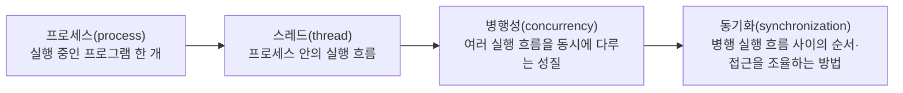
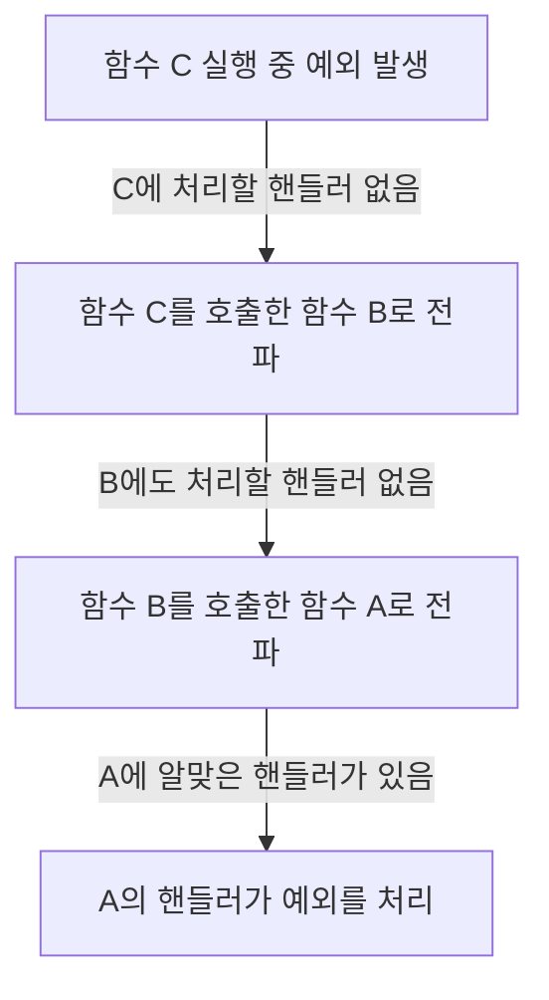

## 병행성 어휘 지도 — 프로세스에서 동기화까지

네 용어는 "실행 단위가 무엇인가"에서 "여러 실행 단위를 어떻게 다루는가"로 넘어가는 순서로 이해하면 된다.

```mermaid
flowchart LR
    A["프로세스(process)<br/>실행 중인 프로그램 한 개"] --> B["스레드(thread)<br/>프로세스 안의 실행 흐름"]
    B --> C["병행성(concurrency)<br/>여러 실행 흐름을 동시에 다루는 성질"]
    C --> D["동기화(synchronization)<br/>병행 실행 흐름 사이의 순서·접근을 조율하는 방법"]
```

### 프로세스란 무엇인가

**프로세스**(process)란 운영체제가 실행 중인 프로그램 하나에 배정하는 독립적인 실행 단위다. 프로세스는 자신만의 메모리 공간(코드·데이터·스택·힙)을 따로 가진다.

### 스레드란 무엇인가

**스레드**(thread)란 하나의 프로세스 안에서 실제로 명령어를 순서대로 실행해 나가는 흐름 하나를 말한다. 프로세스가 "방 하나"라면, 스레드는 그 방 안에서 움직이는 "일꾼 한 명"에 해당한다.

| 비교 항목 | 프로세스 | 스레드 |
|-----------|---------|--------|
| 메모리 공간 | 서로 독립(분리됨) | 같은 프로세스 안에서 서로 공유 |
| 생성 비용 | 상대적으로 큼(메모리 공간을 새로 마련) | 상대적으로 작음(실행 흐름만 추가) |
| 하나가 오류로 멈췄을 때 | 다른 프로세스에 원칙적으로 영향 없음 | 같은 프로세스의 다른 스레드에도 영향을 줄 수 있음 |
| 통신 방법 | 운영체제가 제공하는 별도의 통신 수단 필요 | 공유 메모리를 그대로 읽고 쓰면 됨 |

> **자주 틀리는 점:** "스레드는 프로세스보다 큰 개념이다"처럼 포함 관계를 거꾸로 쓰는 문장이 오답 보기로 자주 나온다. 스레드는 항상 어떤 프로세스에 속한 하위 실행 흐름이며, 프로세스 없이 스레드만 홀로 존재할 수 없다.

### 병행성이란 무엇인가

**병행성**(concurrency)이란 여러 개의 실행 흐름(프로세스 또는 스레드)이 동시에 진행되는 것처럼 다루어지는 성질을 말한다. CPU 코어가 여러 개여서 실제 물리적으로 동시에 여러 실행 흐름이 진행되는 경우는 별도로 **병렬성**(parallelism)이라고 구분해 부르기도 하는데, 프로그래밍언어론 시험에서는 이 둘을 엄밀히 구분하기보다 "여러 실행 흐름을 함께 다룬다"는 병행성의 큰 뜻을 정확히 아는 것이 우선이다.

병행성이 필요한 이유는 명확하다. 이렇게 실행 순서에 따라 결과가 달라져 버리는 상황을 **경쟁 상태**(race condition)라고 부른다.

### 동기화란 무엇인가

**동기화**(synchronization)란 여러 실행 흐름이 같은 자원에 접근하는 순서나 시점을 조율해서, 경쟁 상태 같은 문제가 생기지 않도록 만드는 방법을 통틀어 부르는 말이다. "은행 계좌 잔액을 고치는 동안에는 다른 스레드가 끼어들지 못하게 문을 잠근다"는 식의 규칙이 동기화의 한 예다.

## 예외·에러·이벤트 어휘 지도

병행성 어휘와 달리 이 세 용어는 위계 관계가 아니라 서로 **성격이 다른 이상 상황**을 가리키는 말들이다. 셋을 한 문장으로 미리 구분하면 이렇다: 에러는 프로그램이 감당할 수 없는 심각한 문제이고, 예외는 프로그램이 감지하고 대응할 수 있는 문제이며, 이벤트는 문제가 아니라 그저 "무언가 일어났다"는 알림이다.

| 구분 | 정의 | 정상 흐름으로 되돌릴 수 있는가 | 예시 |
|------|------|-------------------------------|------|
| 에러(error) | 프로그램이 계속 실행되기 어려운 심각한 문제 상황 | 대체로 어렵다(프로그램 종료로 이어지는 경우가 많음) | 메모리 부족, 스택 오버플로 |
| 예외(exception) | 정상적인 실행 흐름을 벗어난, 프로그램이 감지하고 처리 절차를 밟을 수 있는 상황 | 가능하다(처리 후 계속 실행할 수 있음) | 0으로 나누기, 배열의 범위를 벗어난 접근, 파일이 존재하지 않음 |
| 이벤트(event) | 문제 상황이 아니라 프로그램 실행 중에 발생하는 하나의 사건·신호 | 해당 없음(애초에 문제가 아님) | 사용자가 버튼을 클릭함, 타이머가 만료됨, 네트워크 응답이 도착함 |

세 용어의 차이를 조금 더 풀어 보면 다음과 같다.

**에러**(error)는 프로그램 스스로 회복하기 어려운, 실행 환경 차원의 심각한 문제다. 컴퓨터의 메모리가 부족해서 더 이상 새로운 데이터를 담을 공간이 없거나, 재귀 호출이 너무 깊어져서 실행 스택이 넘치는 상황(스택 오버플로, stack overflow)이 대표적이다.

**예외**(exception)는 정상적인 실행 흐름에서 벗어난 상황이지만, 프로그램이 미리 "이런 상황이 생길 수 있다"고 예상하고 그 상황을 감지해서 별도의 처리 절차를 실행할 수 있는 경우를 말한다. 정수를 0으로 나누려는 연산, 배열의 크기를 벗어난 인덱스로 접근하는 연산, 열려고 한 파일이 실제로는 존재하지 않는 상황이 여기 속한다.

**이벤트**(event)는 애초에 "문제"가 아니다. 그래서 20편에서는 예외 처리와 이벤트 처리를 함께 다룬다.

> **자주 틀리는 점:** "0으로 나누기는 에러다"처럼 예외를 에러로 잘못 부르는 문장이 오답으로 자주 나온다. 0으로 나누기는 프로그램이 감지하고 처리 절차를 밟을 수 있는 전형적인 예외 상황이지, 프로그램을 회복 불가능하게 만드는 에러가 아니다.

## 핸들러와 전파

예외나 이벤트가 발생했을 때 그것을 실제로 처리하는 코드 조각을 **핸들러**(handler, 처리기)라고 부른다. "0으로 나누기 예외가 발생하면 사용자에게 오류 메시지를 보여 주고 계산을 다시 시킨다"는 절차가 있다면, 그 절차를 담은 코드가 바로 이 예외의 핸들러다.

그런데 예외가 발생한 바로 그 자리에 항상 알맞은 핸들러가 있는 것은 아니다. 이렇게 예외가 발생한 지점에서 시작해 알맞은 핸들러를 찾을 때까지 호출 순서를 거슬러 올라가며 넘겨지는 과정을 **전파**(propagation)라고 부른다.

```mermaid
flowchart TD
    A["함수 C 실행 중 예외 발생"] -->|"C에 처리할 핸들러 없음"| B["함수 C를 호출한 함수 B로 전파"]
    B -->|"B에도 처리할 핸들러 없음"| C["함수 B를 호출한 함수 A로 전파"]
    C -->|"A에 알맞은 핸들러가 있음"| D["A의 핸들러가 예외를 처리"]
```

이 그림에서 함수 A가 함수 B를 부르고, 함수 B가 함수 C를 부른 상태에서 C 안에서 예외가 발생했다고 하자. 이 전파 과정을 언어가 구체적으로 어떤 문법(try-catch-finally 등)으로 표현하는지는 20편에서 다룬다.

## 자주 틀리는 점 정리

- **스레드와 프로세스의 포함 관계를 거꾸로 아는 실수**: 스레드는 프로세스 안에 속한 실행 흐름이다. 프로세스가 스레드에 속하는 것이 아니다.
- **병행성과 동기화를 같은 말로 쓰는 실수**: 병행성은 "여러 실행 흐름을 동시에 다룬다"는 성질이고, 동기화는 그 병행 실행 흐름들이 서로 부딪히지 않도록 조율하는 방법이다. 동기화는 병행성이 만드는 문제를 해결하기 위한 수단이다.
- **예외와 에러를 같은 말로 쓰는 실수**: 예외는 프로그램이 감지하고 처리한 뒤 계속 실행할 수 있는 상황이고, 에러는 대체로 회복이 어려운 심각한 문제다.
- **이벤트를 예외의 한 종류로 단정하는 실수**: 이벤트는 문제 상황이 아니라 단순한 사건 발생 신호다. 다만 처리 방식이 예외 처리 구조와 닮아 있을 뿐이다.

## 핵심 정리

- 프로세스는 독립된 메모리 공간을 갖는 실행 단위이고, 스레드는 그 프로세스 안에서 메모리를 공유하며 실행되는 흐름이다.
- 병행성은 여러 실행 흐름을 동시에 다루는 성질이며, 이때 생기는 경쟁 상태 같은 문제를 막기 위한 조율 방법이 동기화다.
- 에러는 회복이 어려운 심각한 문제, 예외는 감지하고 처리한 뒤 계속 실행할 수 있는 상황, 이벤트는 문제가 아닌 사건 발생 신호로 구분된다.
- 핸들러는 예외·이벤트를 실제로 처리하는 코드이고, 전파는 알맞은 핸들러를 찾을 때까지 호출 순서를 거슬러 넘겨지는 과정이다.

## 마무리 복습

<Quiz
  questionNumber={1}
  question={"프로세스와 스레드의 관계에 대한 설명으로 옳은 것은?"}
  options={["스레드는 여러 프로세스를 포함하는 더 큰 단위이다","같은 프로세스에 속한 스레드들은 그 프로세스의 메모리 공간을 서로 공유한다","프로세스는 항상 스레드를 하나도 가질 수 없다","서로 다른 프로세스는 항상 메모리 공간을 공유한다"]}
  correctAnswer={2}
  explanation={"스레드는 프로세스 안에서 실행되는 흐름이며, 같은 프로세스에 속한 스레드끼리는 전역 변수와 힙 같은 메모리 공간을 공유한다. 프로세스는 원칙적으로 서로 독립된 메모리 공간을 갖는다."}
/>

<Quiz
  questionNumber={2}
  question={"병행성(concurrency)에 대한 설명으로 옳지 않은 것은?"}
  options={["여러 실행 흐름을 동시에 진행하는 것처럼 다루는 성질이다","CPU 코어가 하나뿐인 컴퓨터에서는 병행성을 전혀 구현할 수 없다","병행 실행 중 같은 자원에 접근하는 순서가 꼬이면 경쟁 상태가 발생할 수 있다","병행성을 다루려면 실행 흐름 사이의 접근을 조율하는 동기화가 필요할 수 있다"]}
  correctAnswer={2}
  explanation={"CPU 코어가 하나뿐이어도 운영체제가 짧은 시간 단위로 여러 실행 흐름을 번갈아 실행하면 동시에 진행되는 것처럼 보이게 만들 수 있으므로, 병행성 구현이 불가능하지 않다."}
/>

<Quiz
  questionNumber={3}
  question={"다음 상황 중 예외(exception)로 분류하는 것이 가장 적절한 것은?"}
  options={["컴퓨터의 메모리가 완전히 소진되어 더 이상 데이터를 담을 공간이 없는 상황","정수를 0으로 나누려고 시도해 프로그램이 이를 감지한 상황","사용자가 화면의 버튼을 클릭한 상황","재귀 호출이 지나치게 깊어져 실행 스택이 넘친 상황"]}
  correctAnswer={2}
  explanation={"0으로 나누기는 프로그램이 감지하고 처리 절차를 실행한 뒤 계속 실행할 수 있는 전형적인 예외 상황이다. 메모리 소진과 스택 오버플로는 회복이 어려운 에러에 가깝고, 버튼 클릭은 문제 상황이 아닌 이벤트다."}
/>

## 참고 자료

- [국가평생교육진흥원 독학학위제](https://bdes.nile.or.kr) — 독학사 시험 체계와 과목별 평가영역 확인용 공식 사이트.
