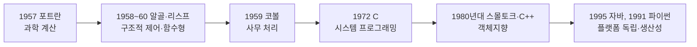

<Callout type="info">
  **이번 문서의 목표:** 이 문서를 다 읽으면 주요 프로그래밍언어가 등장한 역사적 순서와 그 배경을 설명할 수 있고, 같은 문제를 놓고 명령형·객체지향·함수형·논리형 언어가 "생각하는 방식" 자체가 어떻게 다른지 구체적인 예제로 비교할 수 있다.
</Callout>

## 왜 역사와 패러다임부터 보는가

프로그래밍언어론이라는 과목은 "이 언어는 왜 이런 문법을 갖게 되었는가"를 묻는 과목이다. 그런데 그 답은 대부분 언어가 만들어진 시대의 하드웨어 성능, 그 시절 소프트웨어 개발이 겪던 문제, 그리고 그 언어가 속한 패러다임(paradigm, 문제를 바라보고 코드를 조직하는 근본적인 사고방식)에서 나온다. 그래서 이후 편들(구문·의미, 이름·바인딩, 자료형, 제어 구조 등)에서 "이 언어는 이렇게 설계했다"는 사실을 배울 때마다 "왜 그렇게 설계했는가"를 스스로 되짚을 수 있으려면, 먼저 언어들이 어떤 순서로 왜 등장했는지, 그리고 패러다임이라는 큰 분류가 무엇을 기준으로 나뉘는지를 잡아 두어야 한다.

## 주요 프로그래밍언어 발전사

프로그래밍언어의 역사는 "무엇을 더 쉽게 만들 것인가"라는 질문이 바뀌어 온 역사이기도 하다. 초기에는 "기계어보다 사람이 읽기 쉬운 언어"가 목표였고, 이후에는 "큰 프로그램을 어떻게 구조적으로 관리할 것인가", 다시 그 이후에는 "객체 단위로 세상을 어떻게 모델링할 것인가"로 목표가 옮겨 갔다.

| 연대 | 언어 | 주도한 조직·인물 | 등장 배경과 의의 |
|------|------|-------------------|-------------------|
| 1957 | 포트란(FORTRAN, FORmula TRANslation) | IBM(존 배커스 팀) | 최초의 널리 쓰인 고급 언어. 과학·공학 계산(수식 번역)에 특화되어, 기계어로 직접 짜던 수치 계산 프로그램을 수식과 비슷한 표기로 작성할 수 있게 했다. |
| 1958–1960 | 알골(ALGOL, ALGOrithmic Language) | 국제 위원회(유럽·미국 학계) | 블록 구조(begin–end)와 구조적 제어문을 도입해 이후 거의 모든 명령형 언어의 문법적 조상이 되었다. 상업적으로 크게 성공하지는 못했지만 언어 설계 이론에 끼친 영향이 매우 크다. |
| 1959 | 코볼(COBOL, COmmon Business-Oriented Language) | 미국 국방부 주도 위원회 | 과학 계산이 아니라 사무·회계 처리(급여 계산, 재고 관리)를 목표로 설계되어, 영어 문장에 가까운 문법으로 비전문가도 읽을 수 있게 했다. |
| 1958(초안)–1960년대 정착 | 리스프(LISP, LISt Processing) | 존 매카시(MIT) | 함수와 리스트(list, 데이터를 순서대로 나열한 구조)를 중심으로 설계된 최초의 함수형 언어 계열. 인공지능 연구에서 기호(symbol)를 다루기 위해 만들어졌다. |
| 1972 | C | 데니스 리치(벨 연구소) | 운영체제(유닉스)를 이식 가능한 고급 언어로 다시 작성하려는 목적에서 설계되어, 하드웨어에 가까운 제어력(포인터, 낮은 수준의 메모리 접근)과 고급 언어의 편의성을 함께 제공했다. |
| 1980년대 초 | 스몰토크(Smalltalk) | 앨런 케이 등(제록스 PARC) | "모든 것이 객체다"라는 원칙을 처음으로 철저하게 구현한 언어로, 이후 객체지향 언어 설계의 원형이 되었다. |
| 1985 | C++ | 비야네 스트롭스트룹(벨 연구소) | C 언어의 성능과 하드웨어 제어력을 유지하면서 클래스와 상속 같은 객체지향 기능을 더해, 대규모 시스템 소프트웨어를 객체 단위로 구조화할 수 있게 했다. |
| 1995 | 자바(Java) | 제임스 고슬링 등(선 마이크로시스템즈) | "한 번 작성하면 어디서든 실행된다(Write Once, Run Anywhere)"는 목표로, 가상 머신(virtual machine) 위에서 실행되는 바이트코드 방식을 채택해 플랫폼 독립성을 확보했다. |
| 1991 | 파이썬(Python) | 귀도 반 로섬 | 간결한 문법과 동적 타입(자료형을 실행 중에 결정)을 앞세워, 읽기 쉬운 코드로 빠르게 개발하는 것을 목표로 설계되었다. |

> **쉽게 말하면:** 초기 언어(포트란·코볼)는 "특정 분야의 계산을 사람이 이해하기 쉬운 표기로 옮기는 것"이 목표였고, 알골 이후에는 "큰 프로그램을 구조적으로 관리하는 것", 스몰토크·C++·자바 이후에는 "객체 단위로 세상을 모델링하는 것"으로 언어 설계의 초점이 옮겨 왔다.



> **자주 틀리는 점:** "알골은 상업적으로 크게 성공한 언어다"라는 문장이 오답으로 자주 나온다. 알골은 상업적 성공보다 **문법적 영향력**(블록 구조, 구조적 제어문)으로 평가받는 언어라는 점을 정확히 기억해야 한다.

## 언어 설계에 영향을 준 요소

새로운 언어는 진공 상태에서 만들어지지 않는다. 그 시대의 하드웨어 성능과 소프트웨어 개발 방식이 언어 설계자의 선택을 강하게 제약하고 이끈다.

- **하드웨어의 발전**: 초기 컴퓨터는 메모리가 극도로 부족했기 때문에, 포트란 같은 초기 언어는 컴파일러가 최적화된 기계어를 만들어 내는 것을 최우선 목표로 삼았다. 하드웨어 성능이 좋아지면서 언어는 점점 "실행 속도"보다 "사람이 이해하기 쉬운가"에 더 신경 쓸 여유를 갖게 되었다.
- **소프트웨어 개발 방법론의 변화**: 1960년대 말~1970년대에 프로그램 규모가 커지면서 "관리하기 어려운 복잡한 코드"가 사회적 문제로 떠올랐다(이른바 소프트웨어 위기, software crisis). 이에 대한 대응으로 구조적 프로그래밍(structured programming, goto문 대신 순차·선택·반복만으로 흐름을 구성하는 원칙)이 등장했고, 이는 파스칼(Pascal)·C 같은 언어의 제어 구조 설계에 직접 반영되었다. 1980~1990년대에는 프로그램 규모가 더 커지면서 객체지향 방법론이 주류가 되었고, 이는 스몰토크·C++·자바의 설계로 이어졌다.
- **프로그래밍 환경과 목적의 다양화**: 웹, 인공지능, 임베디드 시스템처럼 프로그램이 실행되는 환경이 다양해지면서, 각 환경에 맞춘 언어(자바스크립트, 파이썬, C 등)가 별도로 발전했다. 이 내용은 아래 "도메인별 언어" 절에서 더 자세히 다룬다.

> **쉽게 말하면:** 언어 설계는 "그 시절 컴퓨터가 얼마나 빠르고 컸는가"와 "그 시절 개발자들이 어떤 문제로 골머리를 앓았는가"에 대한 답이다.

## 패러다임이란 무엇인가 — 네 가지 큰 갈래

**패러다임**(paradigm)이란 프로그램을 어떤 근본적인 사고방식으로 조직할 것인가에 대한 큰 틀을 말한다. 같은 문제를 풀더라도 패러다임이 다르면 코드가 "무엇을 어떻게 표현하는가"부터 완전히 달라진다. 독학사 시험에서는 아래 네 가지 큰 갈래를 정의와 함께 정확히 구분할 수 있는지를 자주 묻는다.

- **명령형(imperative) 패러다임**: 프로그램을 "상태(변수)를 어떤 순서로 바꿔 나갈 것인가"에 대한 명령들의 나열로 본다. 변수에 값을 대입하고, 그 값을 반복문·조건문으로 바꿔 가며 원하는 결과를 만든다. 폰 노이만 구조(메모리에 저장된 값을 읽고 쓰는 방식으로 동작하는 컴퓨터 구조)를 그대로 반영한 가장 오래되고 직관적인 패러다임이다. 포트란·C·파스칼이 대표적이다. 객체지향 언어도 내부적으로는 대입과 반복문을 쓴다는 점에서 넓게 보면 명령형 패러다임의 확장으로 분류되기도 한다.
- **객체지향(object-oriented) 패러다임**: 프로그램을 데이터와 그 데이터를 다루는 연산을 하나로 묶은 "객체(object)" 단위로 조직한다. 객체는 클래스(class)라는 설계도로부터 만들어지고, 상속(inheritance)·다형성(polymorphism) 같은 기법으로 객체 사이의 관계를 표현한다. 이 내용은 18편에서 깊게 다룬다. C++·자바·스몰토크가 대표적이다.
- **함수형(functional) 패러다임**: 프로그램을 "입력을 받아 출력을 내는 함수들의 조합"으로 본다. 변수에 값을 다시 대입해서 상태를 바꾸는 것을 최대한 피하고(불변성, immutability), 같은 입력에는 항상 같은 출력을 내는 순수 함수(pure function)를 기본 단위로 삼는다. 이 내용은 22편에서 더 다룬다. 리스프·하스켈(Haskell)·ML 계열이 대표적이다.
- **논리형(logic) 패러다임**: 프로그램을 "어떤 사실과 규칙이 참인가"를 선언하는 방식으로 짠다. "어떻게 계산할 것인가"를 프로그래머가 일일이 지시하지 않고, "무엇이 참인지"만 선언하면 언어의 실행 엔진이 그 사실과 규칙으로부터 답을 스스로 추론한다. 이 내용은 23편에서 더 다룬다. 프롤로그(Prolog)가 대표적이다.

> **쉽게 말하면:** 명령형은 "어떻게 할지"를 순서대로 지시하고, 객체지향은 "누가 무엇을 갖고 무엇을 할 수 있는지"로 나누고, 함수형은 "입력에서 출력을 뽑아내는 함수들의 연결"로 보고, 논리형은 "무엇이 참인가"만 선언하고 나머지는 실행 엔진에 맡긴다.

## 같은 문제, 다른 사고방식 — "1부터 5까지 합 구하기"

패러다임의 차이를 가장 확실하게 느끼는 방법은 **같은 문제를 서로 다른 패러다임으로 풀어 보고 그 결과 코드의 모양을 비교하는 것**이다. "1부터 5까지 정수의 합을 구한다"는 아주 단순한 문제를 네 패러다임으로 각각 풀어 보자.

### 명령형(imperative) — C

```c
#include <stdio.h>

int main() {
    int total = 0;
    for (int i = 1; i <= 5; i++) {
        total = total + i;
    }
    printf("%d\n", total);
    return 0;
}
```

```text
15
```

한 줄씩 실행을 추적하면 다음과 같다. `total`이라는 변수 하나가 반복될 때마다 값이 바뀌어 나가는 것이 명령형 패러다임의 핵심이다.

| 반복 단계 | `i`의 값 | 실행되는 문장 | `total`의 값(대입 후) |
|-----------|---------|---------------|------------------------|
| 시작 | (없음) | `int total = 0;` | 0 |
| 1회차 | 1 | `total = total + i;` | 0 + 1 = 1 |
| 2회차 | 2 | `total = total + i;` | 1 + 2 = 3 |
| 3회차 | 3 | `total = total + i;` | 3 + 3 = 6 |
| 4회차 | 4 | `total = total + i;` | 6 + 4 = 10 |
| 5회차 | 5 | `total = total + i;` | 10 + 5 = 15 |
| 종료(`i`가 6이 되어 조건 거짓) | 6 | 반복 종료 | 15 |

명령형 코드는 "`total`이라는 상자에 담긴 값을 다섯 번에 걸쳐 계속 고쳐 쓴다"는 절차를 그대로 코드로 옮긴 것이다. 문제를 "무엇"이 아니라 "어떤 순서로 상태를 바꿀 것인가"로 표현한다는 점이 명령형 패러다임의 정체성이다.

### 객체지향(object-oriented) — Java

```java
public class SumCalculator {
    private int total;

    public void addRange(int from, int to) {
        for (int i = from; i <= to; i++) {
            total = total + i;
        }
    }

    public int getTotal() {
        return total;
    }

    public static void main(String[] args) {
        SumCalculator calculator = new SumCalculator();
        calculator.addRange(1, 5);
        System.out.println(calculator.getTotal());
    }
}
```

```text
15
```

계산의 순서(반복하며 더한다)는 C 코드와 똑같지만, 그 계산 로직과 계산에 쓰이는 데이터(`total`)가 `SumCalculator`라는 하나의 객체 안에 묶여 있다는 점이 다르다. 객체지향은 명령형 계산 방식 자체를 바꾼다기보다, **"누가 이 상태를 갖고 있고, 누가 이 상태를 바꿀 자격이 있는가"를 객체 단위로 나누어 조직**한다. `total`이라는 변수는 `SumCalculator` 객체 바깥에서 직접 건드릴 수 없고, 반드시 `addRange`나 `getTotal` 같은 그 객체의 메서드(method)를 통해서만 접근할 수 있다. 이 캡슐화(encapsulation)에 대해서는 17편과 18편에서 더 깊이 다룬다.

> **쉽게 말하면:** 객체지향 코드도 내부적으로는 명령형처럼 반복문과 대입을 쓰지만, 그 상태와 로직을 "누구 소유인지" 객체 단위로 나누어 관리한다는 점이 다르다.

### 함수형(functional) — 의사코드

함수형 언어는 `total`처럼 반복해서 값을 고쳐 쓰는 변수를 쓰지 않는 것을 이상으로 삼는다. 대신 "1부터 n까지의 합은 n에 (1부터 n-1까지의 합)을 더한 것과 같다"는 재귀적인 관계를 그대로 함수로 표현한다. 다음은 특정 언어 문법이 아니라 함수형 사고방식을 보여 주는 의사코드다.

```text
함수 합(n):
    만약 n이 0이면 결과는 0
    아니면 결과는 n + 합(n - 1)

합(5)
= 5 + 합(4)
= 5 + (4 + 합(3))
= 5 + (4 + (3 + 합(2)))
= 5 + (4 + (3 + (2 + 합(1))))
= 5 + (4 + (3 + (2 + (1 + 합(0)))))
= 5 + (4 + (3 + (2 + (1 + 0))))
= 15
```

이 계산에는 값이 바뀌는 변수가 하나도 없다. `합(5)`라는 식은 `합(4)`라는 더 작은 식으로, 다시 `합(3)`이라는 더 작은 식으로 계속 풀어써질 뿐이고, 마지막에 `합(0) = 0`이라는 가장 작은 사실에 도달하면 그 결과를 그대로 거슬러 올라오며 더한다. 이렇게 "더 작은 같은 문제로 쪼개서 풀고 결과를 조합하는" 방식이 함수형 패러다임에서 반복을 표현하는 전형적인 방법이며, 이런 자기 자신을 다시 부르는 정의 방식을 재귀(recursion)라고 부른다.

> **쉽게 말하면:** 함수형은 "상자 속 값을 고쳐 쓰며 반복"하는 대신 "문제를 더 작은 같은 문제로 계속 쪼개고, 가장 작은 경우의 답에서부터 거슬러 올라와 조합"하는 방식으로 답을 만든다.

### 논리형(logic) — Prolog 스타일 의사코드

논리형 패러다임에서는 "어떻게 계산할지" 대신 "무엇이 참인가"라는 사실과 규칙만 선언한다.

```text
사실: 합(0, 0)이 참이다.
규칙: n이 0보다 크고, n에서 1을 뺀 값을 m이라 하고,
      합(m, 부분합)이 참이면,
      합(n, 부분합 + n)도 참이다.

질의: 합(5, 얼마)?
결과: 얼마 = 15
```

프로그래머는 "반복문을 돌면서 더하라"고 지시하지 않는다. 대신 "`합(0, 0)`은 참이다"라는 기본 사실과 "`합(n, ...)`이 참이려면 `합(n-1, ...)`이 참이어야 한다"는 규칙만 선언해 두면, 논리형 언어의 실행 엔진이 `합(5, 얼마)`라는 질의를 받았을 때 이 사실과 규칙들을 스스로 조합해서(추론, inference) `얼마`가 15가 되어야 참이 됨을 찾아낸다. 이 추론 과정(단일화·백트래킹)의 자세한 원리는 23편에서 Horn 절과 함께 다룬다.

> **쉽게 말하면:** 논리형은 "이렇게 계산해라"가 아니라 "이런 사실과 규칙이 참이다"라고만 말해 두고, 실제 계산 방법은 언어의 실행 엔진이 알아서 찾아내게 맡긴다.

### 네 패러다임 비교 정리

| 패러다임 | 문제를 표현하는 방식 | 상태(변수)를 다루는 태도 | 대표 언어 |
|----------|----------------------|--------------------------|-----------|
| 명령형 | 상태를 바꾸는 명령의 순서 나열 | 변수를 반복해서 고쳐 씀 | 포트란, C, 파스칼 |
| 객체지향 | 데이터와 연산을 객체 단위로 묶음 | 객체 내부에 상태를 캡슐화해 관리 | 스몰토크, C++, 자바 |
| 함수형 | 입력에서 출력을 뽑는 함수의 조합 | 변수 재대입을 피하고 불변값·재귀를 사용 | 리스프, 하스켈, ML |
| 논리형 | 참인 사실과 규칙의 선언 | 상태 개념보다 사실 사이의 관계를 중시 | 프롤로그 |

> **자주 틀리는 점:** "객체지향은 명령형과 완전히 다른, 상태를 전혀 쓰지 않는 패러다임이다"라는 문장은 옳지 않다. 객체지향은 상태를 없애는 것이 아니라, 그 상태를 객체 단위로 캡슐화해서 관리 범위를 좁히는 접근이며, 넓게 보면 명령형 패러다임의 연장선에 있다. 상태를 적극적으로 피하는 쪽은 오히려 함수형 패러다임이다.

## 도메인별 언어

같은 시대라도 프로그램이 실행되는 목적(도메인, domain)이 다르면 그 목적에 맞춘 언어가 따로 발전한다.

- **시스템 프로그래밍**: 운영체제·드라이버처럼 하드웨어에 가깝고 실행 속도가 중요한 영역에는 메모리를 직접 다룰 수 있는 C, C++가 주로 쓰인다.
- **웹 프로그래밍**: 브라우저에서 실행되는 클라이언트 쪽 코드는 자바스크립트(JavaScript)가 사실상 표준이고, 서버 쪽에는 자바·파이썬·자바스크립트(Node.js) 등 다양한 언어가 쓰인다.
- **인공지능·데이터 분석**: 빠른 실험과 방대한 라이브러리 생태계 덕분에 파이썬이 널리 쓰이며, 기호 처리 중심의 초기 인공지능 연구에서는 리스프 계열이 쓰였다.
- **임베디드 시스템**: 메모리와 처리 성능이 제한된 마이크로컨트롤러에서는 C가 여전히 주력 언어다.

> **쉽게 말하면:** "가장 좋은 언어"는 존재하지 않는다. 어떤 도메인에서 무엇을 최우선으로 삼는가(속도, 안전성, 생산성, 이식성)에 따라 알맞은 언어가 달라질 뿐이다.

## 자주 틀리는 점 정리

- **연대와 언어를 뒤바꿔 외우는 실수**: 포트란(1957)이 알골(1958~60)보다 먼저 등장했고, C(1972)는 스몰토크·C++보다 앞선다는 순서를 정확히 기억해야 한다.
- **알골의 의의를 상업적 성공으로 오해하는 실수**: 알골의 시험 출제 포인트는 "문법적 영향력(블록 구조, 구조적 제어문)"이지 시장 점유율이 아니다.
- **패러다임과 언어를 1:1로 못 박는 실수**: 자바는 객체지향 언어로 분류되지만 내부적으로 명령형 문법(반복문, 대입문)을 그대로 쓰고, 최신 자바에는 함수형 스타일(람다식) 요소도 들어 있다. 한 언어가 여러 패러다임 요소를 함께 가질 수 있다.
- **논리형 패러다임을 "규칙 기반 함수형"으로 혼동하는 실수**: 함수형은 함수의 입출력 조합으로 계산을 표현하지만, 논리형은 "무엇이 참인가"라는 사실·규칙의 선언과 그로부터의 추론이 핵심이라는 점에서 다르다.

## 핵심 정리

- 프로그래밍언어의 발전은 포트란(과학 계산) → 알골·코볼(구조적 제어·사무 처리) → C(시스템 프로그래밍) → 스몰토크·C++·자바(객체지향) 순서로, 하드웨어 성능과 소프트웨어 개발 방법론의 변화가 이 흐름을 이끌었다.
- 패러다임은 명령형·객체지향·함수형·논리형 네 갈래로 나뉘며, 같은 문제("1부터 5까지 합")를 풀어 보면 상태를 다루는 방식(반복적 대입 vs 캡슐화된 상태 vs 재귀와 불변값 vs 사실과 규칙의 선언)이 근본적으로 다름을 확인할 수 있다.
- 객체지향은 명령형의 상태 개념을 없애는 것이 아니라 객체 단위로 캡슐화하는 확장이고, 함수형은 반대로 상태 변경 자체를 최대한 피하는 패러다임이다.
- 도메인(시스템·웹·인공지능·임베디드)에 따라 그 목적에 맞춘 언어가 따로 발전해 왔다.

## 마무리 복습

<Quiz
  questionNumber={1}
  question="다음 중 프로그래밍언어의 등장 순서를 오래된 것부터 옳게 나열한 것은?"
  options={['C, 포트란, 자바, 알골', '포트란, 알골, C, 자바', '자바, C, 알골, 포트란', '알골, 포트란, 자바, C']}
  correctAnswer={2}
  explanation="포트란은 1957년, 알골은 1958~60년, C는 1972년, 자바는 1995년에 등장했다. 이 순서를 기억해야 한다."
  optionExplanations={['C가 포트란보다 먼저라고 되어 있어 순서가 틀렸다.', '정답. 포트란(1957) → 알골(1958~60) → C(1972) → 자바(1995) 순서다.', '자바가 가장 먼저로 되어 있어 순서가 완전히 뒤바뀌었다.', '알골이 포트란보다 먼저라고 되어 있어 순서가 틀렸다.']}
/>

<Quiz
  questionNumber={2}
  question="알골(ALGOL)에 대한 설명으로 옳은 것은?"
  options={['상업적으로 가장 크게 성공해 시장 점유율이 가장 높았던 언어이다', '블록 구조와 구조적 제어문을 도입해 이후 명령형 언어들의 문법적 조상이 되었다', '객체지향 개념을 최초로 철저히 구현한 언어이다', '기호 처리를 위한 최초의 함수형 언어이다']}
  correctAnswer={2}
  explanation="알골은 상업적 성공보다 블록 구조와 구조적 제어문 같은 문법적 영향력으로 평가받는 언어다. 객체지향의 원형은 스몰토크, 최초의 함수형 언어 계열은 리스프다."
  optionExplanations={['알골은 상업적으로 크게 성공한 언어가 아니다.', '정답. 알골의 핵심 의의는 문법적 영향력이다.', '객체지향의 원형은 스몰토크다.', '기호 처리 중심의 함수형 언어 계열은 리스프다.']}
/>

<Quiz
  questionNumber={3}
  question="'1부터 5까지의 합'을 구하는 방식에 대한 설명으로 옳지 않은 것은?"
  options={['명령형 방식은 total 같은 변수의 값을 반복문 안에서 계속 고쳐 쓴다', '함수형 방식은 문제를 더 작은 같은 문제로 쪼개는 재귀로 표현할 수 있다', '논리형 방식은 사실과 규칙을 선언하면 실행 엔진이 스스로 답을 추론한다', '객체지향 방식은 상태를 전혀 쓰지 않고 순수하게 함수의 조합으로만 답을 구한다']}
  correctAnswer={4}
  explanation="객체지향 방식도 내부적으로는 반복문과 변수 대입 같은 명령형 요소를 쓴다. 다만 그 상태를 객체 단위로 캡슐화해 관리할 뿐이며, 상태를 전혀 쓰지 않는 것은 함수형 패러다임의 지향점이다."
  optionExplanations={['명령형 방식에 대한 옳은 설명이다.', '함수형 방식에 대한 옳은 설명이다.', '논리형 방식에 대한 옳은 설명이다.', '정답(옳지 않은 설명). 객체지향은 상태를 없애는 것이 아니라 객체 단위로 캡슐화해 관리한다.']}
/>

<Quiz
  questionNumber={4}
  question="함수형 패러다임의 특징으로 가장 적절한 것은?"
  options={['변수의 값을 반복적으로 고쳐 쓰는 것을 기본 전략으로 삼는다', '데이터와 그 데이터를 다루는 연산을 하나의 객체로 묶어 캡슐화한다', '같은 입력에는 항상 같은 출력을 내는 순수 함수와 재귀를 중심으로 계산을 표현한다', '무엇이 참인지 사실과 규칙만 선언하고 계산 방법은 실행 엔진에 맡긴다']}
  correctAnswer={3}
  explanation="함수형 패러다임은 변수 재대입을 피하고, 순수 함수와 재귀를 통해 문제를 더 작은 같은 문제로 쪼개어 계산을 표현한다."
  optionExplanations={['변수를 반복적으로 고쳐 쓰는 것은 명령형 패러다임의 특징이다.', '데이터와 연산을 객체로 묶는 것은 객체지향 패러다임의 특징이다.', '정답. 순수 함수와 재귀 중심의 계산이 함수형 패러다임의 핵심이다.', '사실과 규칙의 선언은 논리형 패러다임의 특징이다.']}
/>

<Quiz
  questionNumber={5}
  question="언어 설계에 영향을 준 요소에 대한 설명으로 옳지 않은 것은?"
  options={['초기 컴퓨터의 부족한 메모리는 포트란 같은 초기 언어의 설계 목표에 영향을 주었다', '소프트웨어 위기(software crisis)에 대한 대응으로 구조적 프로그래밍이 등장했다', '1980~1990년대 프로그램 규모 확대는 객체지향 방법론이 주류가 되는 데 영향을 주었다', '언어 설계는 그 시대의 하드웨어나 개발 방법론과 무관하게 순수한 이론적 필요에서만 결정된다']}
  correctAnswer={4}
  explanation="언어 설계는 하드웨어 성능과 그 시대 소프트웨어 개발이 겪던 문제(소프트웨어 위기 등)에 강한 영향을 받는다. 이론적 필요만으로 결정된다는 설명은 옳지 않다."
  optionExplanations={['하드웨어 제약이 초기 언어 설계에 영향을 준 것은 옳은 설명이다.', '구조적 프로그래밍 등장 배경에 대한 옳은 설명이다.', '객체지향 방법론 확산 배경에 대한 옳은 설명이다.', '정답(옳지 않은 설명). 언어 설계는 하드웨어와 개발 방법론의 영향을 강하게 받는다.']}
/>

<Quiz
  questionNumber={6}
  question="도메인별 언어 선택에 대한 설명으로 가장 적절한 것은?"
  options={['모든 도메인에서 절대적으로 가장 좋은 언어 하나가 정해져 있다', '임베디드 시스템처럼 자원이 제한된 환경에서는 흔히 C 언어가 주력으로 쓰인다', '웹 브라우저에서 실행되는 클라이언트 코드에는 어떤 언어를 써도 차이가 없다', '인공지능·데이터 분석 분야는 항상 논리형 언어만을 사용해야 한다']}
  correctAnswer={2}
  explanation="임베디드 시스템처럼 메모리와 처리 성능이 제한된 환경에서는 하드웨어를 직접 제어할 수 있는 C 언어가 주력으로 쓰인다. 도메인마다 우선순위(속도·생산성·안전성)가 달라 언어 선택이 달라진다."
  optionExplanations={['도메인마다 우선순위가 달라 절대적으로 가장 좋은 언어는 존재하지 않는다.', '정답. 임베디드 환경에서는 C가 널리 쓰인다.', '브라우저 클라이언트 코드는 사실상 자바스크립트가 표준으로 쓰인다.', '인공지능·데이터 분석은 주로 파이썬이 널리 쓰이며 논리형 언어로 한정되지 않는다.']}
/>

## 참고 자료

- [국가평생교육진흥원 독학학위제](https://bdes.nile.or.kr) — 독학사 시험 체계와 과목별 평가영역 확인용 공식 사이트.
- [Pearson - Sebesta, Concepts of Programming Languages](https://www.pearson.com/en-us/subject-catalog/p/concepts-of-programming-languages/) — 언어 발전사와 패러다임 분류를 다루는 표준 교재의 소개 페이지.
