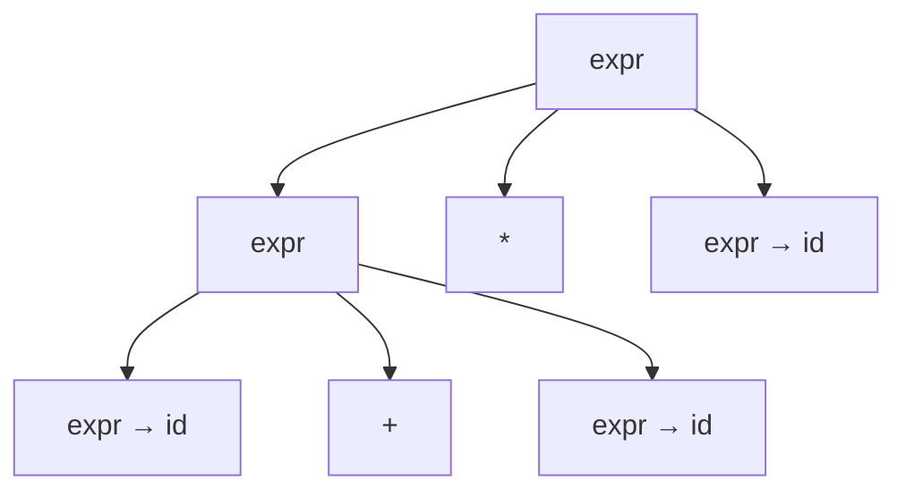
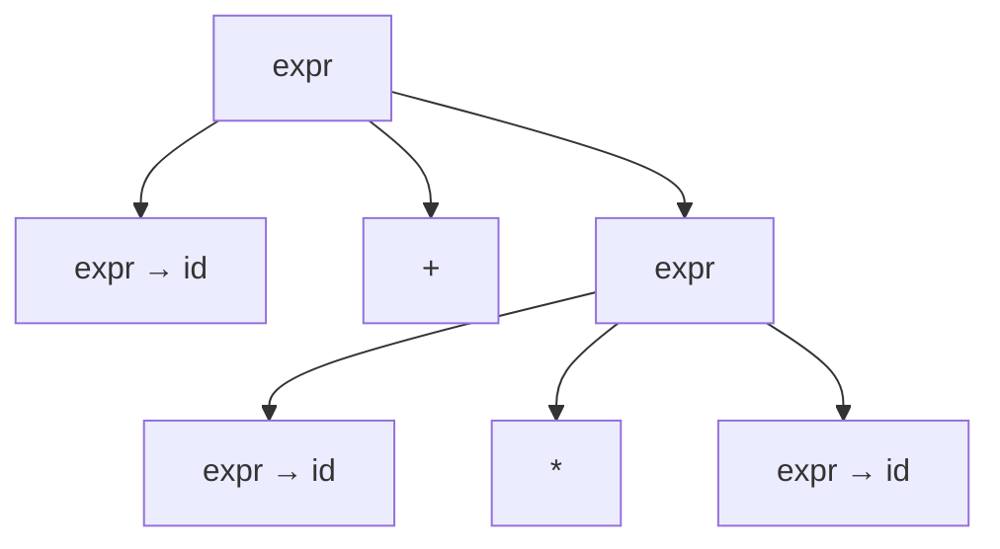
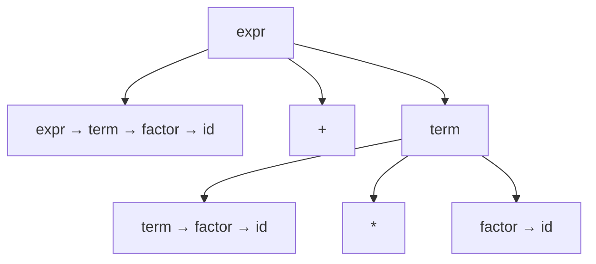

<Callout type="info">
  **이번 문서의 목표:** 이 문서를 다 읽으면 구문과 의미가 왜 다른 문제인지 설명할 수 있고, BNF/EBNF로 연산자 우선순위까지 반영한 문법을 직접 쓸 수 있으며, 파스 트리를 그려 모호한 문법과 모호하지 않은 문법을 구분하고, 속성 문법과 정적/동적 의미 개념을 시험 수준으로 설명할 수 있다.
</Callout>

## 구문과 의미는 왜 다른 문제인가

02편에서 BNF(Backus-Naur Form)와 구문 도표라는 표기법 자체를 소개했다면, 이 편에서는 그 표기법으로 실제 문법을 설계하는 방법과, 그 문법이 다루지 못하는 부분인 "의미"를 어떻게 기술하는지를 다룬다. 먼저 구문과 의미가 왜 별개의 문제인지부터 짚어야 한다.

**구문**(syntax)이란 프로그램을 이루는 기호들이 올바른 순서와 형태로 배열되어 있는가에 대한 규칙이다. `x = y + ;`처럼 `+` 뒤에 와야 할 값이 빠져 있으면 이것은 구문 오류(syntax error)다. 문법이 정해 놓은 모양 자체에 맞지 않기 때문에, 컴파일러는 이 문장이 무엇을 하려는지 알아보기도 전에 오류를 낸다.

**의미**(semantics)란 구문적으로 올바르게 배열된 기호들이 실제로 무엇을 뜻하는가에 대한 규칙이다. `x = y + z;`는 구문적으로 완벽하지만, `y`라는 이름이 이 프로그램 어디에서도 선언된 적이 없다면 "이 문장이 뜻하는 계산을 할 수 없다"는 문제가 생긴다. 이것은 구문의 문제가 아니라 의미의 문제다.

> **쉽게 말하면:** 구문은 "문장의 모양이 문법에 맞는가"이고, 의미는 "그 문장이 실제로 무엇을 뜻하는가"이다. 모양은 맞는데 뜻이 성립하지 않는 문장도 있을 수 있다.

이 구분이 왜 중요한지는 아래 두 문장을 비교해 보면 분명해진다.

| 예시 문장 | 구문 판정 | 의미 판정 |
|-----------|-----------|-----------|
| `x = y + ;` | 오류(`+` 뒤에 값이 없어 문법 규칙 위반) | 판정 불가(구문 오류라 의미를 따질 단계까지 가지 못함) |
| `x = y + z;` (`y`가 선언되지 않음) | 정상(문법 규칙에는 맞음) | 오류(선언되지 않은 이름을 사용 — 정적 의미 오류) |
| `result = 10 / count;` (`count`가 실행 중 0이 됨) | 정상 | 정상적으로 컴파일되지만 실행 중 0으로 나누기 발생(동적 의미 오류) |

두 번째 줄과 세 번째 줄의 차이, 즉 "컴파일하면서 알 수 있는 의미 오류"와 "실행해 봐야 알 수 있는 의미 오류"의 구분은 이 편 마지막에 나오는 정적 의미·동적 의미 개념과 바로 연결된다.

## BNF로 모호하지 않은 문법 설계하기

02편에서 BNF의 기본 표기(비단말·단말·생성 규칙)를 익혔으니, 이제 실제로 산술식(arithmetic expression)의 문법을 설계해 보자. 목표는 `id + id * id`(`id`는 식별자 하나를 뜻한다)처럼 덧셈과 곱셈이 섞인 식을 나타내는 문법을 만드는 것이다.

### 모호한 문법과 그 문제

가장 단순하게 생각하면 다음과 같은 문법을 떠올리기 쉽다.

```text
<expr> ::= <expr> + <expr>
         | <expr> * <expr>
         | id
```

이 문법은 `id + id * id`라는 문자열을 만들어 낼 수 있다는 점에서는 틀리지 않았다. 문제는 이 문자열을 만들어 내는 방법이 **두 가지**라는 점이다. 아래 두 파스 트리(parse tree, 문법 규칙이 어떻게 적용되어 문장이 만들어졌는지를 나무 모양으로 나타낸 그림)를 비교해 보자.





첫 번째 트리는 `+`가 가장 바깥쪽 연산이 되어 `(id + id) * id`로 묶이고, 두 번째 트리는 `*`가 가장 바깥쪽 연산이 되어 `id + (id * id)`로 묶인다. 같은 문자열 `id + id * id`에 대해 두 개의 서로 다른 파스 트리가 만들어질 수 있다는 것은, 이 문법이 **모호하다**(ambiguous)는 뜻이다. 모호한 문법은 컴파일러가 "이 식을 어떤 순서로 계산해야 하는가"를 스스로 정할 수 없게 만들기 때문에 프로그래밍언어 문법으로는 사용할 수 없다.

> **자주 틀리는 점:** "모호한 문법은 애초에 문자열을 만들어 내지 못한다"는 것은 틀린 생각이다. 모호한 문법도 문자열은 정상적으로 만들어 낸다. 문제는 **같은 문자열에 대해 파스 트리가 하나로 정해지지 않는다**는 점이다.

### 우선순위를 반영한 모호하지 않은 문법

모호성을 없애려면 연산자의 우선순위(수학에서 곱셈이 덧셈보다 먼저 계산되는 규칙)를 문법 규칙 자체의 **계층 구조**로 표현해야 한다. 우선순위가 낮은 연산(덧셈)을 다루는 규칙을 우선순위가 높은 연산(곱셈)을 다루는 규칙보다 상위에 두는 것이 핵심 요령이다.

```text
<expr>   ::= <expr> + <term>
           | <expr> - <term>
           | <term>
<term>   ::= <term> * <factor>
           | <term> / <factor>
           | <factor>
<factor> ::= ( <expr> )
           | id
```

이 문법으로 `id + id * id`를 유도(derivation, 시작 기호에서 생성 규칙을 차례로 적용해 문장을 만들어 가는 과정)하면 다음과 같은 단 하나의 파스 트리만 만들어진다.



이 트리에서 `*`는 항상 `<term>`이라는, `<expr>`보다 한 단계 더 안쪽(더 나중에 시작 기호로부터 멀어진) 규칙 안에서만 나타난다. 그 결과 `id * id` 부분이 먼저 하나의 `<term>`으로 묶이고, 그 `<term>`이 다시 앞의 `id`(역시 `<term>`으로 취급됨)와 `+`로 묶인다. 즉 `id + (id * id)`로 계산 순서가 유일하게 정해진다. 이렇게 **문법 규칙의 계층 구조 자체가 연산자 우선순위를 표현**한다는 것이 이 예제의 핵심이다.

> **쉽게 말하면:** 모호하지 않은 문법을 만드는 방법 하나는, 나중에 계산해야 할 연산(우선순위가 낮은 연산)을 문법의 더 바깥쪽 규칙에, 먼저 계산해야 할 연산(우선순위가 높은 연산)을 더 안쪽 규칙에 배치하는 것이다.

## EBNF로 같은 문법을 더 간결하게

02편에서 다룬 EBNF(Extended BNF)의 반복 기호(`{ }`)와 선택 기호(`|`)를 이용하면, 위 `<expr>`·`<term>` 규칙의 좌재귀(left recursion, 규칙 오른쪽에 자기 자신이 맨 앞에 다시 나타나는 형태)를 없애고 더 간결하게 쓸 수 있다.

```text
<expr>   ::= <term> { ( + | - ) <term> }
<term>   ::= <factor> { ( * | / ) <factor> }
<factor> ::= ( <expr> ) | id
```

`{ ( + | - ) <term> }`는 "`+` 또는 `-` 뒤에 `<term>`이 오는 덩어리가 0번 이상 반복될 수 있다"는 뜻이다. 이 EBNF 규칙은 앞서 본 BNF 규칙과 만들어 내는 문장의 집합이 완전히 같지만, `<expr> ::= <expr> + <term> | ...`처럼 규칙이 자기 자신을 다시 참조하는 재귀 대신 반복 기호로 "여러 번 반복되는 덧셈·뺄셈"을 직접 표현하므로 읽기가 더 쉽다.

> **자주 틀리는 점:** EBNF는 BNF보다 "더 강력한 문법"이 아니라, 같은 문맥 자유 문법(context-free grammar)을 **더 간결한 표기**로 쓴 것일 뿐이다. EBNF로 표현할 수 있는 문장의 집합은 원리적으로 BNF로도 항상 표현할 수 있다.

## 속성 문법 — 문법에 의미를 붙이는 방법

BNF/EBNF는 문장의 "모양"만 정의할 뿐, `id + id * id`라는 식이 실제로 어떤 값으로 계산되어야 하는지는 말해 주지 않는다. **속성 문법**(attribute grammar)은 각 문법 규칙에 "의미를 계산하는 규칙"(semantic rule, 의미 규칙)을 덧붙여서, 구문 구조로부터 실제 의미(여기서는 계산된 값)를 이끌어 내는 방법이다.

속성 문법에서 각 문법 기호(`<expr>`, `<term>`, `<factor>` 등)는 `val`처럼 값을 저장하는 **속성**(attribute)을 가진다. 속성은 계산되는 방향에 따라 두 종류로 나뉜다.

- **합성 속성**(synthesized attribute): 자식 노드들의 속성값으로부터 부모 노드의 속성값을 계산한다. 즉 파스 트리에서 아래에서 위로(상향식) 값이 전달된다.
- **상속 속성**(inherited attribute): 부모 노드나 형제 노드의 속성값으로부터 자식 노드의 속성값을 계산한다. 즉 위에서 아래로, 또는 옆에서 옆으로(하향식) 값이 전달된다.

`id + id * id`에서 각 `id`가 실제로 2, 3, 4라는 값을 가진다고 하고, 이 식의 값을 합성 속성만으로 계산하는 속성 문법을 만들어 보자.

| 문법 규칙 | 의미 규칙(합성 속성 계산) |
|-----------|----------------------------|
| `<expr> ::= <expr1> + <term>` | `<expr>.val = <expr1>.val + <term>.val` |
| `<expr> ::= <term>` | `<expr>.val = <term>.val` |
| `<term> ::= <term1> * <factor>` | `<term>.val = <term1>.val * <factor>.val` |
| `<term> ::= <factor>` | `<term>.val = <factor>.val` |
| `<factor> ::= id` | `<factor>.val` = 그 `id`가 나타내는 실제 숫자값 |

`2 + 3 * 4`라는 식에 이 규칙들을 파스 트리 맨 아래(잎, leaf)에서부터 위로 적용하면 다음과 같이 값이 합성되어 올라간다.

| 계산 단계 | 적용 규칙 | 계산 결과 |
|-----------|-----------|-----------|
| 1 | `<factor>.val = id(2)` | `factor.val = 2` |
| 2 | `<term> ::= <factor>` → `term.val = factor.val` | `term.val = 2` |
| 3 | `<factor>.val = id(3)` | `factor.val = 3` |
| 4 | `<factor>.val = id(4)` | `factor.val = 4` |
| 5 | `<term> ::= <term1> * <factor>` → `term.val = term1.val * factor.val` | `term.val = 3 * 4 = 12` |
| 6 | `<expr> ::= <expr1> + <term>` → `expr.val = expr1.val + term.val` | `expr.val = 2 + 12 = 14` |

가장 위에 있는 `<expr>`의 `val` 속성이 최종적으로 14가 되는데, 이는 `2 + 3 * 4`를 곱셈 우선으로 올바르게 계산한 결과와 정확히 일치한다. 이 예제처럼 값이 잎에서 뿌리 방향으로만 흘러가는 경우는 합성 속성만으로 충분하지만, "이 변수가 선언보다 먼저 쓰였는가" 같은 검사는 선언 정보를 아래쪽(사용되는 위치)으로 전달해야 하므로 상속 속성이 필요해지는 경우가 많다.

> **쉽게 말하면:** 속성 문법은 문법 규칙 하나하나에 "이 규칙이 적용될 때 값을 이렇게 계산해라"는 계산 규칙을 짝지어 붙인 것이다. 파스 트리를 다 그린 뒤, 그 계산 규칙들을 잎에서 뿌리 쪽으로(또는 필요하면 반대 방향으로도) 적용하면 문장의 실제 의미(값)가 나온다.

## 정적 의미와 동적 의미

이제 앞서 표에서 구분했던 "컴파일하면서 알 수 있는 의미"와 "실행해야 알 수 있는 의미"를 정식 용어로 정리한다.

**정적 의미**(static semantics)란 프로그램을 실제로 실행하지 않고도, 즉 컴파일 시점에 검사할 수 있는 의미 규칙을 말한다. "변수는 사용되기 전에 선언되어야 한다", "함수를 호출할 때 넘기는 인자의 개수와 형이 함수 선언과 일치해야 한다" 같은 규칙이 정적 의미에 해당한다. 이런 규칙은 문맥 자유 문법(BNF)만으로는 표현하기 어렵다. BNF는 "이 위치에 식별자가 와야 한다"는 것은 표현할 수 있어도, "그 식별자가 이전에 선언된 것과 같은 이름이어야 한다"는 조건(문맥에 따라 규칙이 달라지는 성질, 즉 문맥 의존적인 성질)까지는 표현하지 못하기 때문이다. 그래서 정적 의미는 앞서 본 속성 문법이나, 컴파일러 안의 별도 검사 절차(형 검사기 등)로 표현하고 검사한다.

**동적 의미**(dynamic semantics)란 프로그램이 실제로 실행될 때 각 문장이 무엇을 하는가에 대한 의미를 말한다. `x = y / z;`라는 문장이 구문적으로 옳고 `y`, `z`가 모두 제대로 선언되어 정적 의미 검사까지 통과했다고 해도, 실행 중에 `z`의 값이 0이 되면 이 나눗셈은 정의되지 않는다. 이런 문제는 프로그램을 실제로 실행해 보기 전에는 알 수 없으므로 동적 의미의 영역이다. 동적 의미를 엄밀하게 기술하는 방법으로는 다음 세 가지가 널리 알려져 있으며, 독학사 시험에서는 이름과 기본 아이디어를 구분할 수 있으면 충분하다.

- **조작적 의미론**(operational semantics): 프로그램의 각 문장이 실행될 때 가상의 기계(추상 기계)의 상태(변수값 등)가 어떻게 바뀌는지를 단계별로 서술해서 의미를 정의하는 방식이다.
- **지시적 의미론**(denotational semantics): 프로그램의 각 구문 요소를 수학적인 함수로 대응(사상, mapping)시켜서 의미를 정의하는 방식이다. 엄밀하지만 수학적 배경 지식이 많이 필요하다.
- **공리적 의미론**(axiomatic semantics): 프로그램 실행 전의 조건(전제조건, precondition)과 실행 후의 조건(후행조건, postcondition) 사이의 논리적 관계로 의미를 정의하는 방식이다. 프로그램이 올바르게 동작함을 수학적으로 증명하는 데 주로 쓰인다.

이 세 방식의 구체적인 수학적 전개는 이 과목의 시험 범위를 벗어나므로(01_학습방향의 범위 제외 항목 참고), 이름과 "무엇을 기준으로 의미를 정의하는가"라는 아이디어만 구분할 수 있으면 충분하다.

> **쉽게 말하면:** 정적 의미는 "실행해 보지 않고도 미리 걸러낼 수 있는 규칙 위반"이고, 동적 의미는 "실제로 실행해야만 드러나는, 각 문장이 실제로 하는 일"이다.

> **자주 틀리는 점:** "구문 오류와 정적 의미 오류는 같은 것이다"라는 문장이 오답으로 자주 나온다. 둘 다 컴파일 시점에 잡히는 오류라는 공통점은 있지만, 구문 오류는 문법 규칙(BNF)에 맞지 않는 것이고 정적 의미 오류는 문법 규칙에는 맞지만 선언·형 일치 같은 문맥 의존적 규칙을 어긴 것이다. `x = y +;`는 구문 오류이고, 선언되지 않은 `y`를 사용한 `x = y + z;`는 정적 의미 오류다.

## 자주 틀리는 점 정리

- **모호한 문법이 문자열을 만들지 못한다고 오해하는 실수**: 모호한 문법도 문자열은 정상적으로 만들어 낸다. 문제는 같은 문자열에 대해 파스 트리가 둘 이상 나온다는 점이다.
- **EBNF가 BNF보다 표현할 수 있는 언어의 범위가 더 넓다고 오해하는 실수**: EBNF는 표기법의 간결함만 다를 뿐, 표현 가능한 문맥 자유 언어의 범위는 BNF와 같다.
- **합성 속성과 상속 속성의 방향을 헷갈리는 실수**: 합성 속성은 자식에서 부모로(상향식), 상속 속성은 부모·형제에서 자식으로(하향식) 값이 전달된다.
- **정적 의미와 동적 의미를 "컴파일 오류/실행 오류"로만 단순화해 외우는 실수**: 정적 의미는 "실행 없이 검사 가능한가"가 기준이고, 동적 의미는 "프로그램이 실행되며 만들어 내는 실제 동작"을 뜻한다는 더 근본적인 정의를 함께 알아야 한다.

## 핵심 정리

- 구문은 기호 배열이 문법 규칙에 맞는가를, 의미는 그 배열이 실제로 무엇을 뜻하는가를 다루며 서로 독립된 문제다.
- 모호한 문법은 같은 문장에 대해 파스 트리가 둘 이상 나오는 문법이며, 연산자 우선순위를 문법 규칙의 계층 구조(더 낮은 우선순위 연산을 더 바깥쪽 규칙에 배치)로 표현하면 모호성을 없앨 수 있다.
- EBNF는 BNF와 표현력은 같고 표기만 간결한 확장 표기법이다.
- 속성 문법은 문법 규칙마다 의미 규칙(합성 속성·상속 속성 계산)을 붙여, 구문 구조로부터 실제 의미(값 등)를 계산해 낸다.
- 정적 의미는 실행 없이 컴파일 시점에 검사할 수 있는 규칙(선언, 형 일치 등)이고, 동적 의미는 프로그램이 실제로 실행되며 만들어 내는 동작(조작적·지시적·공리적 의미론으로 기술)이다.

## 마무리 복습

<Quiz
  questionNumber={1}
  question="구문(syntax)과 의미(semantics)의 차이에 대한 설명으로 옳은 것은?"
  options={['구문은 기호 배열이 문법에 맞는지, 의미는 그 배열이 실제로 무엇을 뜻하는지를 다룬다', '구문과 의미는 완전히 같은 개념이며 컴파일러에서 구분하지 않는다', '구문 오류는 프로그램을 실행해야만 발견할 수 있다', '의미가 올바르면 구문도 항상 자동으로 올바르다']}
  correctAnswer={1}
  explanation="구문은 기호 배열의 형태적 올바름을, 의미는 그 배열이 실제로 나타내는 뜻을 다루는 서로 다른 문제다. 구문 오류는 실행 전 컴파일 단계에서 발견되며, 구문이 옳다고 의미까지 항상 옳은 것은 아니다."
  optionExplanations={['정답. 구문과 의미의 정의를 정확히 설명하고 있다.', '구문과 의미는 서로 다른 문제로 구분해서 다룬다.', '구문 오류는 실행 전인 컴파일 단계에서 발견된다.', '구문이 옳아도 선언되지 않은 이름 사용 등 의미가 틀릴 수 있다.']}
/>

<Quiz
  questionNumber={2}
  question="어떤 문법에서 문자열 `id + id * id`에 대해 서로 다른 두 개의 파스 트리가 만들어졌다. 이 문법에 대한 설명으로 옳은 것은?"
  options={['이 문법은 해당 문자열을 아예 만들어 낼 수 없는 문법이다', '이 문법은 모호한(ambiguous) 문법이다', '이 문법은 EBNF로 작성되어야만 하는 문법이다', '이 문법은 속성 문법으로만 표현 가능한 문법이다']}
  correctAnswer={2}
  explanation="같은 문자열에 대해 두 개 이상의 서로 다른 파스 트리가 만들어지는 문법을 모호한 문법이라고 한다."
  optionExplanations={['파스 트리가 만들어졌다는 것은 문자열이 정상적으로 생성되었다는 뜻이다.', '정답. 하나의 문자열에 파스 트리가 둘 이상이면 모호한 문법이다.', 'BNF로도 모호한 문법을 얼마든지 만들 수 있다.', '속성 문법 여부와 모호성은 직접적인 관련이 없다.']}
/>

<Quiz
  questionNumber={3}
  question="연산자 우선순위를 BNF 문법 규칙으로 반영하는 일반적인 방법으로 가장 적절한 것은?"
  options={['모든 연산자를 하나의 규칙 안에 똑같은 층위로 나열한다', '우선순위가 낮은 연산을 다루는 규칙을 더 바깥쪽(상위)에, 우선순위가 높은 연산을 다루는 규칙을 더 안쪽(하위)에 둔다', '우선순위가 높은 연산을 다루는 규칙을 항상 가장 바깥쪽에 둔다', '연산자 우선순위는 BNF로는 표현할 수 없고 별도의 프로그램으로만 처리해야 한다']}
  correctAnswer={2}
  explanation="곱셈처럼 우선순위가 높은 연산을 term 같은 더 안쪽 규칙에, 덧셈처럼 우선순위가 낮은 연산을 expr 같은 더 바깥쪽 규칙에 배치하면 파스 트리 구조 자체가 계산 순서를 결정하게 되어 모호성이 사라진다."
  optionExplanations={['모든 연산자를 같은 층위에 두면 모호한 문법이 되기 쉽다.', '정답. 우선순위 낮은 연산을 바깥쪽, 높은 연산을 안쪽 규칙에 두는 것이 표준적인 방법이다.', '우선순위가 높은 연산을 가장 바깥쪽에 두면 오히려 우선순위가 거꾸로 반영된다.', 'BNF의 규칙 계층 구조로 연산자 우선순위를 표현할 수 있다.']}
/>

<Quiz
  questionNumber={4}
  question="합성 속성(synthesized attribute)에 대한 설명으로 가장 적절한 것은?"
  options={['부모 노드의 속성값으로부터 자식 노드의 속성값을 계산한다', '자식 노드들의 속성값으로부터 부모 노드의 속성값을 계산한다', '파스 트리와 무관하게 항상 고정된 값을 가진다', 'BNF 문법에서는 사용할 수 없고 EBNF에서만 사용할 수 있다']}
  correctAnswer={2}
  explanation="합성 속성은 자식 노드들의 속성값을 이용해 부모 노드의 속성값을 계산하는, 파스 트리에서 아래에서 위로(상향식) 전달되는 속성이다."
  optionExplanations={['이는 상속 속성(inherited attribute)에 대한 설명이다.', '정답. 합성 속성은 자식에서 부모 방향으로 계산된다.', '합성 속성은 실제로 파스 트리 구조에 따라 계산되는 값이다.', '합성 속성은 BNF든 EBNF든 문법 표기와 무관하게 사용할 수 있는 개념이다.']}
/>

<Quiz
  questionNumber={5}
  question="다음 중 정적 의미(static semantics) 오류에 해당하는 것은?"
  options={['프로그램 실행 중 정수를 0으로 나누어 오류가 발생하는 상황', '선언되지 않은 변수를 사용해 컴파일 시점에 오류가 발생하는 상황', '괄호가 짝이 맞지 않아 문법 규칙에 어긋나는 상황', '프로그램이 실행 중 사용자 입력을 잘못 받아 원치 않는 값이 저장되는 상황']}
  correctAnswer={2}
  explanation="선언되지 않은 변수를 사용하는 것은 문맥 의존적인 규칙 위반으로, 실행 없이 컴파일 시점에 검사할 수 있는 정적 의미 오류의 대표적인 예다."
  optionExplanations={['이는 실행 중에만 드러나는 동적 의미 오류다.', '정답. 선언 여부 검사는 정적 의미 오류의 대표적인 예다.', '이는 문법 규칙 위반이므로 구문 오류다.', '이는 실행 중 데이터 흐름의 문제로 동적 의미 영역에 가깝다.']}
/>

<Quiz
  questionNumber={6}
  question="동적 의미(dynamic semantics)를 기술하는 방식에 대한 설명으로 옳지 않은 것은?"
  options={['조작적 의미론은 추상 기계의 상태 변화를 단계별로 서술해 의미를 정의한다', '지시적 의미론은 구문 요소를 수학적 함수로 대응시켜 의미를 정의한다', '공리적 의미론은 전제조건과 후행조건 사이의 논리적 관계로 의미를 정의한다', '동적 의미는 BNF 문법 규칙 하나만으로 완전히 기술할 수 있다']}
  correctAnswer={4}
  explanation="동적 의미는 프로그램이 실행되며 만들어 내는 실제 동작을 다루므로, 구문 구조만 정의하는 BNF 문법 규칙만으로는 기술할 수 없다. 조작적·지시적·공리적 의미론 같은 별도의 방법이 필요하다."
  optionExplanations={['조작적 의미론에 대한 옳은 설명이다.', '지시적 의미론에 대한 옳은 설명이다.', '공리적 의미론에 대한 옳은 설명이다.', '정답(옳지 않은 설명). BNF만으로는 동적 의미를 기술할 수 없다.']}
/>

## 참고 자료

- [국가평생교육진흥원 독학학위제](https://bdes.nile.or.kr) — 독학사 시험 체계와 과목별 평가영역 확인용 공식 사이트.
- [Pearson - Sebesta, Concepts of Programming Languages](https://www.pearson.com/en-us/subject-catalog/p/concepts-of-programming-languages/) — BNF/EBNF, 속성 문법, 정적/동적 의미 구분을 다루는 표준 교재의 소개 페이지.
