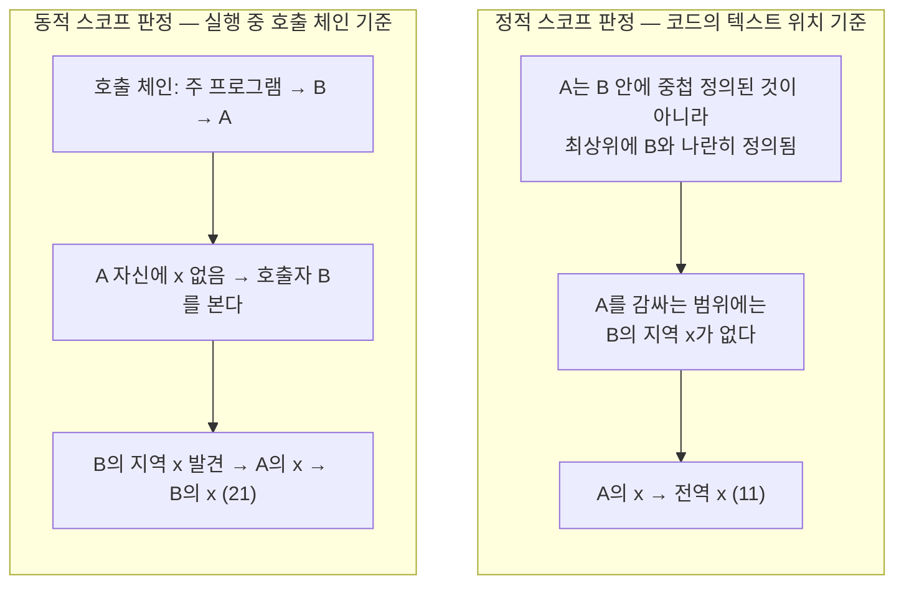

<Callout type="info">
  **이번 문서의 목표:** 바인딩·바인딩 시간·스코프·수명이라는 네 용어를 정확히 구분하고, 같은 코드를 정적 스코프 규칙과 동적 스코프 규칙으로 각각 실행 추적해 왜 서로 다른 결과가 나오는지 설명할 수 있으며, 저장 클래스별 수명 차이를 코드 실행 추적으로 판별할 수 있게 된다.
</Callout>

## 왜 "언제 결합되는가"가 중요한가

03편(선행)에서 이름(name)·바인딩(binding)·스코프(scope)·수명(lifetime)이라는 용어의 뜻만 가볍게 정리했습니다. 이번 편에서는 이 네 개념이 실제로 프로그램의 실행 결과를 어떻게 바꾸는지, 특히 **같은 소스 코드라도 언어가 채택한 스코프 규칙에 따라 완전히 다른 값이 출력될 수 있다**는 사실을 직접 실행 추적으로 확인합니다.

프로그램에는 `x`, `count`, `total` 같은 이름이 수없이 등장합니다. 그런데 이 이름 하나가 프로그램의 어느 지점에서 어떤 저장 공간·어떤 자료형과 연결되는지를 결정하는 규칙이 없다면, 같은 코드를 실행해도 결과를 예측할 수 없습니다. 프로그래밍언어론에서 이름·바인딩·스코프·수명을 깊게 다루는 이유가 바로 이것입니다 — 이 네 규칙이야말로 "코드가 무엇을 의미하는가"를 결정하는 언어 설계의 뼈대이기 때문입니다.

> **쉽게 말하면:** 바인딩은 "이름표를 실제 물건에 붙이는 행위"이고, 스코프는 "그 이름표가 어디까지 통하는지의 범위"이며, 수명은 "그 물건이 실제로 존재하는 기간"입니다.

## 1. 바인딩이란 무엇인가 — 속성과 개체의 결합

**바인딩**(binding, 바인딩)이란 프로그램을 구성하는 하나의 개체(이름, 변수, 연산자, 표현식 등)와 그 개체가 갖는 하나의 속성(형(type)·값(value)·저장 공간(storage location)·의미(meaning) 등) 사이에 **연관(association)을 맺는 행위**입니다. 예를 들어 `int x;`라는 선언은 이름 `x`와 형 `int` 사이의 바인딩을 만들고, `x = 5;`라는 대입은 그 저장 공간과 값 `5` 사이의 바인딩을 만듭니다.

바인딩이 **언제 일어나는가**를 **바인딩 시간**(binding time, 바인딩 시간)이라 부릅니다. 바인딩 시간은 이르게는 언어 자체를 설계하는 시점부터, 늦게는 프로그램이 실제로 실행되는 도중까지 다양한 단계에 걸쳐 있습니다.

| 바인딩 시간 | 언제 일어나는가 | 예시 |
|---|---|---|
| 언어 설계 시(language design time) | 그 언어의 문법·기능을 설계하는 단계 | `+` 연산자가 덧셈을 의미하도록 정하는 것 |
| 언어 구현 시(language implementation time) | 컴파일러·인터프리터를 만드는 단계 | `int`가 몇 바이트인지 결정(C 표준은 구현체에 맡김) |
| 컴파일 시(compile time) | 소스 코드를 목적 코드로 번역하는 단계 | 변수의 자료형을 선언에서 결정(정적 형 언어) |
| 링크 시(link time) | 여러 목적 파일을 하나의 실행 파일로 묶는 단계 | 다른 파일에 정의된 함수의 호출 주소 결정 |
| 로드 시(load time) | 실행 파일을 메모리에 적재하는 단계 | 전역 변수가 놓일 실제 메모리 주소 결정 |
| 실행 시(run time, 런타임) | 프로그램이 실제로 동작하는 도중 | 지역 변수가 함수 호출마다 새 저장 공간을 받는 것 |

이 표에서 **왼쪽에 있을수록 이른 바인딩**입니다. 일반적으로 바인딩이 이를수록(정적일수록) 컴파일러가 더 많은 것을 미리 검사해 오류를 빨리 잡을 수 있어 신뢰성이 높아지지만, 유연성은 떨어집니다. 반대로 바인딩이 늦을수록(동적일수록) 실행 중에 유연하게 동작을 바꿀 수 있지만, 오류가 실행 시점에야 드러나고 실행 속도도 느려지는 경향이 있습니다. 이것이 07편에서 다룬 "정적 검사 vs 동적 검사"라는 설계 trade-off의 근본 원인입니다.

## 2. 바인딩의 종류 — 형 바인딩·저장 바인딩·매개변수 바인딩

바인딩은 **무엇과 무엇을 연관짓는가**에 따라 여러 종류로 나뉩니다. 이 가운데 시험에 자주 나오는 세 가지를 살펴봅니다.

### 형 바인딩(type binding)

변수가 어떤 자료형과 연결되는지를 결정하는 바인딩입니다. 형 바인딩이 **언제** 일어나는가로 정적 형 바인딩과 동적 형 바인딩을 나눕니다.

- **정적 형 바인딩**: 변수를 선언하는 순간(컴파일 시) 자료형이 고정되고, 프로그램이 실행되는 동안 절대 바뀌지 않습니다. C, Java, Rust 등 대부분의 정적 형 언어가 여기 해당합니다.
- **동적 형 바인딩**: 변수가 선언될 때가 아니라 **실제 값이 대입되는 순간** 그 값의 형을 기준으로 바인딩되며, 다른 형의 값을 다시 대입하면 형 바인딩도 함께 바뀝니다. Python, JavaScript가 대표적입니다.

```python
x = 10        # 이 순간 x는 정수형과 바인딩된다
x = "hello"   # 이 순간 x는 문자열형과 다시 바인딩된다 (재선언 없이)
```

```text
정수형 바인딩 → 문자열형 바인딩으로 교체됨 (같은 이름 x, 다른 형)
```

**자주 틀리는 점:** "동적 형 언어는 형이 없다"가 아닙니다. 값 `10`은 여전히 정수형이라는 형을 갖습니다. 다만 그 형이 **이름(변수)에 고정되어 있지 않고, 실행 중 대입되는 값을 따라 이동**한다는 점이 정적 형 언어와 다릅니다. 형 시스템 전반(강/약 형·정적/동적 형 검사)은 10편에서 이어서 깊이 다룹니다.

### 저장 바인딩(storage binding)

변수가 실제 메모리 공간과 연결되는 바인딩입니다. 이 바인딩이 유지되는 기간이 바로 이 편 뒤에서 다룰 **수명**(lifetime)입니다. 저장 바인딩의 시점(정적으로 고정될지, 함수 호출마다 새로 생길지, 프로그래머가 명시적으로 요청할 때 생길지)에 따라 **저장 클래스**(storage class)가 나뉘며, 6절에서 표와 실행 추적으로 다룹니다.

### 매개변수 바인딩(parameter binding)

함수·프로시저를 호출할 때 **형식 매개변수**(formal parameter, 함수 정의에 적힌 매개변수 이름)와 **실 매개변수**(actual parameter, 호출할 때 넘기는 인자 값)를 연결하는 바인딩입니다. 이 바인딩이 정확히 무엇을 공유하는가(값의 복사인가, 저장 공간 자체인가)에 따라 값 전달·참조 전달 등 매개변수 전달 방식이 갈리며, 이는 04편(선행)에서 용어만 훑었고 14편에서 언어별 비교와 함께 깊게 다룹니다. 이번 편에서는 "언제 바인딩되는가"만 짚고 넘어갑니다 — 대부분의 언어에서 매개변수 바인딩은 **호출 시점(실행 시)** 에 이루어집니다.

## 3. 정적 바인딩 vs 동적 바인딩 — 큰 분류

지금까지 본 형 바인딩·저장 바인딩처럼, 바인딩은 크게 두 부류로 묶을 수 있습니다.

- **정적 바인딩**(static binding): 프로그램이 실행되기 전(대개 컴파일 시)에 결정되고, 실행되는 동안 절대 바뀌지 않는 바인딩. 예: C의 변수 형, 정적 스코프 규칙 자체(어떤 이름이 어떤 선언을 가리키는지는 코드를 컴파일하는 시점에 이미 결정됨).
- **동적 바인딩**(dynamic binding): 실행 중에 결정되며, 같은 코드라도 실행 상황에 따라 다르게 연결될 수 있는 바인딩. 예: 동적 형 언어의 형 바인딩, 그리고 18편에서 다룰 객체지향 언어의 **동적 메서드 바인딩**(dynamic binding, 부모 클래스 참조 변수가 실행 시점의 실제 객체 형에 따라 다른 메서드를 호출하는 것).

이 정적/동적이라는 큰 축은 이제부터 다룰 스코프에도 똑같이 적용됩니다 — 스코프 규칙 자체가 정적일 수도, 동적일 수도 있습니다.

## 4. 스코프란 무엇인가 — 이름이 통용되는 범위

**스코프**(scope, 영역)란 어떤 변수 선언이 **어느 코드 범위 안에서 그 이름으로 참조 가능한가**를 정하는 규칙입니다. 프로그램 안의 한 지점에서 이름 `x`를 사용했을 때, 그 `x`가 정확히 어떤 선언을 가리키는지를 찾는 과정을 **이름 해석**(name resolution)이라 하며, 이 해석 규칙이 바로 스코프 규칙입니다.

거의 모든 현대 언어는 **정적 스코프**(static scope, 렉시컬 스코프lexical scope라고도 함) 규칙을 사용하지만, 프로그래밍언어론에서는 비교 대상으로 **동적 스코프**(dynamic scope)도 함께 배웁니다. 두 규칙이 **완전히 같은 코드에 대해 다른 답을 낼 수 있다**는 것이 이번 절의 핵심입니다.

## 5. 정적 스코프 vs 동적 스코프 — 같은 코드, 다른 결과

다음의 의사코드 한 벌을 정적 스코프 규칙과 동적 스코프 규칙 **양쪽으로** 실행 추적해 비교합니다. (이 예제는 Sebesta류 프로그래밍언어론 교재에서 정적/동적 스코프 차이를 보일 때 표준적으로 쓰는 형태입니다.)

```text
전역 변수 x = 10

절차 A:
    x = x + 1
    출력(x)

절차 B:
    지역 변수 x = 20
    A를 호출한다

주 프로그램:
    B를 호출한다
    출력(x)          # 이 x는 전역 변수 x를 가리킨다
```

여기서 핵심은 **절차 A 안에는 `x`의 지역 선언이 없다**는 점입니다. `A` 안의 `x = x + 1`이 참조하는 `x`가 전역 변수인지, `B`의 지역 변수인지는 순전히 스코프 규칙이 결정합니다.

### 정적 스코프 규칙으로 추적하기

정적 스코프의 판정 기준은 **코드가 텍스트(소스 코드)상 어디에 위치하는가**입니다. 이를 **최근접 중첩 규칙**(most closely nested rule, 최근접 중첩 규칙)이라 부릅니다 — 어떤 이름을 참조하는 지점을 감싸고 있는 코드 블록을 안쪽부터 바깥쪽으로 거슬러 올라가며, 그 이름이 처음 선언된 블록을 찾습니다. 절차 `A`는 `B` 안에 **텍스트상 중첩되어 정의된 것이 아니라** `B`와 나란히 최상위에 정의되어 있으므로, `A`를 감싸는 범위에는 `B`의 지역 변수가 전혀 포함되지 않습니다. 따라서 `A` 안의 `x`는 곧바로 **전역 `x`** 로 해석됩니다. **누가 `A`를 호출했는지는 전혀 상관이 없습니다.**

| 단계 | 실행 내용 | x 해석 결과(정적 스코프) | 값 변화 |
|---|---|---|---|
| 1 | 주 프로그램이 B 호출 | - | 전역 x = 10 |
| 2 | B의 지역 x = 20 선언 | B의 지역 x (새 바인딩) | 지역 x = 20, 전역 x = 10 (그대로) |
| 3 | B가 A 호출 | - | - |
| 4 | A 안의 `x = x + 1` 실행 | A를 감싸는 텍스트상 범위에 지역 x가 없으므로 **전역 x** | 전역 x = 10 + 1 = 11 |
| 5 | A가 출력(x) 실행 | 전역 x | **11 출력** |
| 6 | A 종료, B 종료 | - | B의 지역 x(20)는 소멸 |
| 7 | 주 프로그램이 출력(x) 실행 | 전역 x | **11 출력** |

### 동적 스코프 규칙으로 추적하기

동적 스코프의 판정 기준은 **실행 중인 호출 체인(call chain)** 입니다. 어떤 이름을 참조하는 순간, 지금까지 호출되어 아직 반환하지 않은 절차들을 **가장 최근에 호출된 것부터 거꾸로** 훑으며 그 이름의 선언을 찾습니다. `A`가 실행되는 시점의 호출 체인은 `주 프로그램 → B → A`이므로, `A`는 먼저 자기 자신에 지역 `x`가 있는지 보고(없음), 다음으로 **자신을 호출한 `B`** 를 보아 지역 `x`(값 20)를 찾아냅니다. **`A`와 `B`가 코드에서 나란히 정의되어 있다는 사실은 전혀 상관이 없고, "누가 누구를 호출했는가"만 중요합니다.**

| 단계 | 실행 내용 | x 해석 결과(동적 스코프) | 값 변화 |
|---|---|---|---|
| 1 | 주 프로그램이 B 호출 | - | 전역 x = 10 |
| 2 | B의 지역 x = 20 선언 | B의 지역 x (새 바인딩) | 지역 x = 20, 전역 x = 10 (그대로) |
| 3 | B가 A 호출 | - | 호출 체인: 주 프로그램 → B → A |
| 4 | A 안의 `x = x + 1` 실행 | 호출 체인을 거슬러 올라가 처음 만나는 지역 x는 **B의 지역 x** | B의 지역 x = 20 + 1 = 21 |
| 5 | A가 출력(x) 실행 | B의 지역 x | **21 출력** |
| 6 | A 종료, B 종료 | - | B의 지역 x(21)는 소멸 — 전역 x는 한 번도 바뀌지 않음 |
| 7 | 주 프로그램이 출력(x) 실행 | 전역 x(B·A의 지역 변수는 이미 소멸해 참조 대상이 아님) | **10 출력**(변화 없음) |

### 결과 대조

| 구분 | A가 참조하는 x | A 안에서 x = x + 1 후 값 | A의 출력 | 주 프로그램의 최종 출력 |
|---|---|---|---|---|
| 정적 스코프 | 전역 x | 11 | 11 | 11 (전역 x가 바뀜) |
| 동적 스코프 | B의 지역 x | 21 | 21 | 10 (전역 x는 그대로) |



**결과 해석:** 완전히 같은 코드 한 벌인데도, 언어가 정적 스코프를 택했는지 동적 스코프를 택했는지에 따라 `A`가 출력하는 값이 11과 21로 갈리고, 주 프로그램이 마지막에 출력하는 전역 `x`의 값도 11과 10으로 갈립니다. 이것이 스코프 규칙이 단순한 문법 규칙이 아니라 **프로그램의 실행 의미(semantics) 자체를 바꾸는 규칙**이라고 말하는 이유입니다.

**자주 틀리는 점:** "동적 스코프는 최근 만들어진 이름 없는 언어"라고 생각하기 쉽지만 실제로는 반대에 가깝습니다. 초기 LISP, APL, 그리고 오늘날에도 Perl의 `local` 선언이나 Emacs Lisp의 변수처럼 **정적 스코프가 표준이 된 이후에도 동적 스코프가 특수 기능으로 남아 있는 경우**가 있습니다. 대부분의 현대 언어(C, Java, Python, JavaScript 등)는 기본적으로 정적(렉시컬) 스코프를 사용합니다. 시험에서는 "왜 정적 스코프가 더 우세한가"를 묻기도 하는데, 정적 스코프는 **코드만 보고 어떤 x인지 컴파일 시점에 결정**할 수 있어 프로그램의 동작을 예측하기 쉽고, 컴파일러가 오류를 미리 잡기도 유리하기 때문입니다.

## 6. 수명(lifetime)과 저장 클래스

**수명**(lifetime, 수명)이란 한 변수가 **실제 메모리 공간에 저장 바인딩된 순간부터, 그 공간이 회수되어 저장 바인딩이 풀리는 순간까지**의 기간입니다. 수명이 언제 시작하고 끝나는가는 그 변수가 어떤 **저장 클래스**(storage class, 저장 클래스)에 속하는지로 결정됩니다.

| 저장 클래스 | 저장 공간이 생기는 시점 | 저장 공간이 사라지는 시점 | 대표 예 |
|---|---|---|---|
| 정적(static) | 프로그램 실행 전(로드 시)에 한 번 확보 | 프로그램 종료 시 | C·Java의 전역 변수, C의 `static` 지역 변수 |
| 스택 동적(stack-dynamic, 자동) | 그 변수를 포함한 함수·블록이 호출되어 활성화될 때 | 그 함수·블록이 반환될 때 | C·Java의 일반 지역 변수 |
| 명시적 힙 동적(explicit heap-dynamic) | 프로그래머가 명시적으로 할당 명령을 실행할 때 | 프로그래머가 명시적으로 해제하거나, 가비지 컬렉터가 회수할 때 | C의 `malloc`, C++의 `new`로 만든 객체 |
| 암묵적 힙 동적(implicit heap-dynamic) | 값이 대입되는 순간 언어가 알아서 저장 공간을 (재)할당 | 더 이상 참조되지 않을 때 가비지 컬렉터가 회수 | Python의 리스트·딕셔너리, JavaScript의 배열·객체 |

**자주 틀리는 점:** 정적 바인딩·동적 바인딩(3절)과 정적 저장 클래스·동적 저장 클래스(이 절)를 같은 개념으로 혼동하기 쉽습니다. 여기서 "정적"과 "동적"은 **저장 공간이 생기고 없어지는 시점**을 가리키는 말일 뿐, 형 바인딩이 정적인지 동적인지와는 별개의 축입니다. 예를 들어 C의 지역 변수는 형 바인딩은 정적(선언 시 고정)이지만, 저장 클래스는 스택 동적(함수 호출마다 새로 생김)입니다.

### 같은 코드로 저장 클래스별 수명 차이 확인하기

다음 C 함수를 세 번 연속 호출하며, 정적 지역 변수 `s`와 자동(스택 동적) 지역 변수 `a`의 값이 호출을 거듭할수록 어떻게 달라지는지 추적합니다.

```c
void counter(void) {
    static int s = 0;   /* 정적: 프로그램 시작 시 단 한 번만 초기화 */
    int a = 0;           /* 자동(스택 동적): 호출될 때마다 새로 생성·초기화 */
    s = s + 1;
    a = a + 1;
    printf("s=%d, a=%d\n", s, a);
}

int main(void) {
    counter();
    counter();
    counter();
    return 0;
}
```

```text
s=1, a=1
s=2, a=1
s=3, a=1
```

| 호출 순서 | s의 저장 공간 | s 값 | a의 저장 공간 | a 값 |
|---|---|---|---|---|
| 1번째 호출 | 프로그램 시작 시 확보된 공간(계속 유지) | 0 → 1 | 이번 호출에서 새로 확보 | 0 → 1 |
| 2번째 호출 | **1번째 호출 때와 같은 공간** | 1 → 2 | **새로 확보(1번째와 다른 공간)** | 0 → 1 |
| 3번째 호출 | **여전히 같은 공간** | 2 → 3 | **또 새로 확보** | 0 → 1 |

**결과 해석:** `s`는 정적 저장 클래스이므로 `counter` 함수가 몇 번 호출되든 **단 하나의 저장 공간**을 계속 재사용합니다 — 그래서 `= 0`이라는 초기화 문장은 프로그램이 시작될 때 딱 한 번만 실행되고, 이후 호출에서는 이전 호출이 남긴 값(1, 2)이 그대로 이어져 3까지 누적됩니다. 반면 `a`는 스택 동적 저장 클래스이므로 `counter`가 호출될 때마다 **완전히 새로운 저장 공간**이 스택에 생기고 `= 0`으로 매번 다시 초기화됩니다 — 그래서 이전 호출에서 `a`가 몇이었든 상관없이 항상 1로 끝납니다. **자주 틀리는 점:** "정적 변수는 값이 안 바뀐다"가 아니라 "정적 변수는 저장 공간과 초기화가 재사용된다"는 뜻입니다. 값은 얼마든지 바뀌며, 오히려 그 바뀐 값이 다음 호출까지 그대로 남아있다는 점이 자동 변수와의 결정적 차이입니다.

## 핵심 정리

- **바인딩**은 개체와 속성의 연관이고, 그 연관이 언제 이루어지는지가 **바인딩 시간**(언어 설계 시 → 컴파일 시 → 로드 시 → 실행 시 순으로 늦어짐)이다.
- 형 바인딩은 선언 시 고정되는 **정적 형 바인딩**(C·Java)과 값이 대입될 때마다 갱신되는 **동적 형 바인딩**(Python·JavaScript)으로 나뉜다.
- **정적 스코프**는 코드의 텍스트 위치(최근접 중첩 규칙)로, **동적 스코프**는 실행 중 호출 체인으로 이름을 해석하며, 같은 코드도 두 규칙에 따라 다른 값을 낸다.
- 대부분의 현대 언어는 정적 스코프를 쓴다 — 코드만 보고 어떤 변수인지 예측할 수 있어 신뢰성이 높기 때문이다.
- **수명**은 변수의 저장 공간이 존재하는 기간이며, 저장 클래스(정적·스택 동적·명시적 힙 동적·암묵적 힙 동적)에 따라 언제 생기고 사라지는지가 결정된다.
- C의 `static` 지역 변수는 저장 공간을 재사용해 값이 호출 간에 유지되지만, 일반 지역 변수는 호출마다 새로 생성·초기화된다.

## 마무리 복습

<Quiz
  questionNumber={1}
  question="프로그램의 한 개체(이름·변수 등)와 그 속성(형·값·저장 공간 등) 사이에 연관을 맺는 것을 가리키는 용어는?"
  options={['스코프(scope)', '바인딩(binding)', '수명(lifetime)', '캡슐화(encapsulation)']}
  correctAnswer={2}
  explanation="바인딩은 프로그램의 개체와 그 속성(형, 값, 저장 공간 등) 사이의 연관을 맺는 행위를 가리킨다. 스코프는 이름이 통용되는 범위, 수명은 저장 공간이 존재하는 기간, 캡슐화는 자료와 연산을 하나로 묶는 것으로 각각 다른 개념이다."
  optionExplanations={['스코프는 이름이 통용되는 범위를 뜻하며 바인딩 그 자체와는 다른 개념이다', '정답. 개체와 속성 사이의 연관을 맺는 것이 바인딩이다', '수명은 저장 공간이 존재하는 기간을 뜻하는 별개의 개념이다', '캡슐화는 17편에서 다루는 자료 추상화 개념으로 바인딩과 직접 관련이 없다']}
/>

<Quiz
  questionNumber={2}
  question="언어 설계 시, 컴파일 시, 실행 시, 로드 시라는 네 가지 바인딩 시간 중 가장 이르게(가장 먼저) 일어나는 것은?"
  options={['컴파일 시', '언어 설계 시', '실행 시', '로드 시']}
  correctAnswer={2}
  explanation="바인딩 시간은 언어 설계 시 → 언어 구현 시 → 컴파일 시 → 링크 시 → 로드 시 → 실행 시 순서로 점점 늦어진다. 언어 설계 시는 그 언어의 문법과 기능 자체를 정하는 단계이므로 네 선택지 중 가장 이르다."
  optionExplanations={['컴파일 시는 언어 설계 시보다 뒤에 일어나는 바인딩이다', '정답. 언어 자체를 설계하는 단계가 네 선택지 중 가장 이르다', '실행 시는 네 선택지 중 가장 늦게 일어나는 바인딩이다', '로드 시는 컴파일과 링크를 거친 뒤, 실행 직전에 일어나는 바인딩이다']}
/>

<Quiz
  questionNumber={3}
  question="변수의 자료형이 선언 시점(컴파일 시)에 고정되어 프로그램 실행 내내 바뀌지 않는 바인딩 방식은?"
  options={['동적 형 바인딩', '정적 형 바인딩', '매개변수 바인딩', '저장 바인딩']}
  correctAnswer={2}
  explanation="정적 형 바인딩은 변수를 선언하는 순간 자료형이 고정되고 실행 중 절대 바뀌지 않는 방식이다. C, Java처럼 선언에 형을 명시하는 언어가 이에 해당한다."
  optionExplanations={['동적 형 바인딩은 값이 대입되는 순간마다 형이 갱신되는 Python·JavaScript류의 방식이다', '정답. 선언 시 고정되어 바뀌지 않는 것이 정적 형 바인딩이다', '매개변수 바인딩은 형식 매개변수와 실 매개변수를 연결하는 것으로 형 고정과는 다른 개념이다', '저장 바인딩은 변수와 메모리 공간의 연관을 뜻하며 형과는 다른 속성이다']}
/>

<Quiz
  questionNumber={4}
  question="전역 변수 x=10이 있고, 절차 A(지역 변수 x 없음)는 x=x+1 후 출력하며, 절차 B는 지역 변수 x=20을 선언한 뒤 A를 호출하고, 주 프로그램은 B를 호출한다. 이 언어가 정적(렉시컬) 스코프를 사용하고 A와 B가 최상위에 나란히 정의되어 있다면, A가 출력하는 값은?"
  options={['10', '11', '20', '21']}
  correctAnswer={2}
  explanation="정적 스코프는 코드의 텍스트 위치(최근접 중첩 규칙)로 이름을 해석한다. A는 B 안에 중첩 정의된 것이 아니라 B와 나란히 최상위에 정의되어 있으므로, A의 x는 누가 호출했든 상관없이 전역 x(10)를 가리킨다. 따라서 x=x+1 실행 후 11이 출력된다."
  optionExplanations={['x=x+1이 실행되므로 원래 값 10이 아니라 1 증가한 값이 출력된다', '정답. 정적 스코프에서 A의 x는 전역 x이므로 10+1=11이 출력된다', '20은 B의 지역 x 값으로, 정적 스코프에서 A는 이 값을 참조하지 않는다', '21은 동적 스코프를 사용했을 때 B의 지역 x가 21이 되며 나오는 값이다']}
/>

<Quiz
  questionNumber={5}
  question="문제 4와 완전히 같은 코드에서, 이 언어가 대신 동적 스코프를 사용한다면 A가 출력하는 값은?"
  options={['10', '11', '20', '21']}
  correctAnswer={4}
  explanation="동적 스코프는 실행 중인 호출 체인을 거슬러 올라가며 이름을 해석한다. A가 실행되는 시점의 호출 체인은 주 프로그램 → B → A이므로, A 자신에는 지역 x가 없어 호출자인 B의 지역 x(20)를 참조한다. x=x+1 실행 후 B의 지역 x는 21이 되고, A는 21을 출력한다."
  optionExplanations={['10은 전역 x의 원래 값으로, 동적 스코프에서는 이 지점에서 참조되지 않는다', '11은 정적 스코프를 사용했을 때 전역 x가 1 증가해 나오는 값이다', '20은 B의 지역 x의 증가 전 값이며, A 실행 후에는 1이 증가한다', '정답. 동적 스코프에서 A의 x는 호출자 B의 지역 x이므로 20+1=21이 출력된다']}
/>

<Quiz
  questionNumber={6}
  question="함수가 호출될 때마다 새로 저장 공간이 생성되고, 함수가 반환되면 그 저장 공간이 즉시 소멸하는 저장 클래스는?"
  options={['정적(static)', '스택 동적(stack-dynamic)', '명시적 힙 동적(explicit heap-dynamic)', '암묵적 힙 동적(implicit heap-dynamic)']}
  correctAnswer={2}
  explanation="스택 동적 저장 클래스는 그 변수를 포함한 함수나 블록이 활성화될 때 저장 공간이 생기고, 반환될 때 소멸한다. C나 Java의 일반 지역 변수가 대표적인 예다."
  optionExplanations={['정적 저장 클래스는 프로그램 시작 시 한 번 확보되어 종료 시까지 유지되는 방식이다', '정답. 함수 호출마다 생성·소멸을 반복하는 것이 스택 동적이다', '명시적 힙 동적은 malloc·new처럼 프로그래머가 직접 할당·해제를 명령하는 방식이다', '암묵적 힙 동적은 언어가 값 대입 시점에 알아서 저장 공간을 재할당하는 방식이다']}
/>

<Quiz
  questionNumber={7}
  question="C 함수 안에서 static int s = 0;으로 선언한 변수가 함수를 여러 번 호출해도 이전 호출에서 남긴 값을 그대로 이어받는 이유는?"
  options={['함수가 호출될 때마다 s의 저장 공간이 새로 생성되기 때문이다', 's의 저장 공간이 프로그램 시작 시 한 번만 확보되어 호출과 무관하게 계속 유지되기 때문이다', 's가 매개변수로 함수에 전달되기 때문이다', 's가 힙 영역에 명시적으로 할당되기 때문이다']}
  correctAnswer={2}
  explanation="static으로 선언한 지역 변수는 저장 클래스가 정적이므로, 저장 공간이 프로그램이 시작될 때 딱 한 번 확보되고 초기화도 그때 한 번만 일어난다. 이후 함수가 몇 번 호출되든 같은 저장 공간을 재사용하므로 이전 호출이 남긴 값이 그대로 이어진다."
  optionExplanations={['저장 공간이 매번 새로 생성된다면 static이 아닌 자동(스택 동적) 변수처럼 매번 초기값으로 되돌아갈 것이다', '정답. 저장 공간이 재사용되기 때문에 값이 호출 간에 유지된다', 's는 이 함수의 지역 변수로 선언된 것이지 매개변수로 전달되는 것이 아니다', 'static 지역 변수는 힙이 아니라 프로그램 전역 데이터 영역에 저장되며 명시적 할당·해제 명령과 무관하다']}
/>

## 참고 자료

- 국가평생교육진흥원 독학학위제: https://bdes.nile.or.kr
- Python 공식 문서 — Execution model(이름 바인딩과 스코프 규칙): https://docs.python.org/3/reference/executionmodel.html
