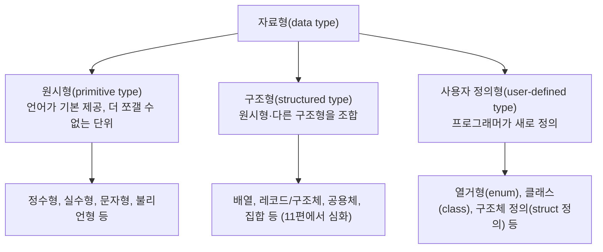
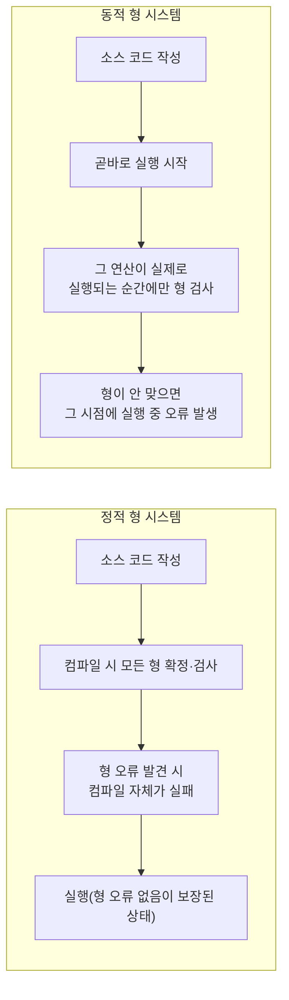

<Callout type="info">
  **이번 문서의 목표:** 자료형을 원시형·구조형·사용자 정의형으로 분류하고, 강형/약형과 정적/동적 형 시스템의 차이를 같은 연산의 실행 결과로 직접 구분하며, 형 검사·형 추론·형 변환(암묵적/명시적)의 개념과 흔한 함정을 설명할 수 있게 된다.
</Callout>

## 왜 형 시스템을 따로 배우는가

09편에서 형 바인딩이 정적인지 동적인지(선언 시 고정되는지, 값이 바뀔 때마다 갱신되는지)를 다뤘습니다. 그런데 "형이 언제 바인딩되는가"와 "형이 얼마나 엄격하게 지켜지는가"는 서로 다른 질문입니다. 예를 들어 두 언어 모두 동적으로 형이 바인딩되더라도, 한 언어는 문자열과 숫자를 섞으면 즉시 오류를 내고 다른 언어는 알아서 변환해 계산을 진행할 수 있습니다. 이 "얼마나 엄격한가"를 다루는 것이 **형 시스템**(type system, 형 시스템)이며, 독학사 시험에서 "다음 중 형 시스템에 대한 설명으로 옳은 것은"류의 문항이 자주 나오는 만큼 이번 편에서 개념 사이의 경계를 정확히 그립니다.

> **쉽게 말하면:** 형 바인딩이 "이 변수가 어떤 종류의 값을 담는가를 언제 정하는가"라면, 형 시스템은 "서로 다른 종류의 값을 섞으려 할 때 얼마나 깐깐하게 검사하는가"입니다.

## 1. 자료형의 분류 — 원시형·구조형·사용자 정의형

프로그래밍 언어가 다루는 자료형(data type)은 크게 세 층으로 나눌 수 있습니다.



- **원시형**(primitive type, 원시형): 언어가 기본으로 제공하는, 더 이상 다른 자료형의 조합으로 쪼갤 수 없는 최소 단위입니다. 정수형(`int`), 부동소수점형(`float`, `double`), 문자형(`char`), 불리언형(`bool`) 등이 해당합니다. 하드웨어가 직접 지원하는 표현 방식과 가까운 경우가 많습니다.
- **구조형**(structured type, 구조형): 원시형이나 다른 구조형을 여러 개 조합해 만드는 자료형입니다. 배열·리스트·레코드(구조체)·공용체·집합 등이 여기 속하며, 각각의 설계·위험·언어별 차이는 11편에서 깊이 다룹니다. 이번 편에서는 "형 시스템" 관점에서 이 구조형들이 강형/약형·정적/동적 검사와 어떻게 얽히는지만 짚습니다.
- **사용자 정의형**(user-defined type, 사용자 정의형): 언어가 미리 준비해 둔 것이 아니라 프로그래머가 직접 새 이름과 구조를 정의하는 자료형입니다. 열거형(enum, 이름 붙은 상수들의 집합), 클래스(class, 객체지향 언어에서 데이터와 동작을 함께 정의), 구조체 정의(예: C의 `struct` 선언 자체) 등이 해당합니다. 사용자 정의형을 이용해 프로그래머가 문제 영역의 개념을 코드로 직접 표현할 수 있게 되며, 이는 17편(추상 자료형)·18편(OOP 지원)에서 캡슐화·클래스와 함께 더 깊이 다룰 주제입니다.

## 2. 강형(strong typing)과 약형(weak typing) — 같은 연산, 다른 결과

**강형 언어**(strongly typed language)는 서로 다른 자료형의 값을 연산에 함께 쓰려 할 때 **컴파일러나 인터프리터가 암묵적인 변환을 허용하지 않고 오류로 처리**하는 경향이 강한 언어입니다. **약형 언어**(weakly typed language)는 반대로 **서로 다른 자료형을 알아서 변환해 연산을 계속 진행**시키는 경향이 강한 언어입니다.

> **쉽게 말하면:** 강형은 "형이 다르면 안 섞어줘, 네가 직접 맞춰"라고 말하는 깐깐한 규칙이고, 약형은 "일단 어떻게든 맞춰서 계산해 줄게"라고 말하는 느슨한 규칙입니다.

이 차이를 **같은 의도의 연산**(문자열 `"5"`와 숫자 `3`을 `+`로 결합하려는 시도)을 서로 다른 두 언어로 실행해 대조합니다.

```javascript
// JavaScript — 약형에 가까운 언어
let 결과 = "5" + 3;
console.log(결과);
console.log(typeof 결과);
```

```text
53
string
```

```python
# Python — 강형에 가까운 언어
결과 = "5" + 3
print(결과)
```

```text
TypeError: can only concatenate str (not "int") to str
```

| 구분 | JavaScript(약형에 가까움) | Python(강형에 가까움) |
|---|---|---|
| `"5" + 3`의 처리 | 숫자 3을 암묵적으로 문자열 `"3"`으로 변환한 뒤 이어붙여 `"53"`을 만든다 | 문자열과 정수를 섞을 수 없다고 판단해 즉시 `TypeError`(형 오류)를 발생시킨다 |
| 프로그래머의 부담 | 편리하지만, 의도치 않은 자동 변환으로 버그가 생기기 쉽다 | 번거롭지만, 형이 안 맞는 실수를 실행 즉시 알려준다 |

**결과 해석:** 두 언어 모두 `"5"`가 문자열이고 `3`이 정수라는 사실은 똑같이 알고 있습니다. 차이는 **형이 다른 값끼리 연산을 시도했을 때 언어가 취하는 태도**입니다. JavaScript는 "어떻게든 계산을 진행시켜 주는 것"을 우선해 정수를 문자열로 바꿔 이어붙이지만, Python은 "형이 다르면 프로그래머의 실수일 가능성이 크다"고 보고 계산을 멈춥니다. **자주 틀리는 점:** 강형/약형과 정적/동적 형 시스템(다음 절)을 같은 축이라고 착각하기 쉽습니다. Python은 **동적**(변수 선언에 형을 명시하지 않고, 실행 중 값에 따라 형이 결정됨) 이면서 동시에 **강형**(형이 다르면 암묵적 변환 없이 오류)입니다. 이 둘은 서로 독립된 축입니다.

## 3. 정적 형 시스템 vs 동적 형 시스템 — 언제 검사하는가

**형 검사**(type checking, 형 검사)란 프로그램에서 어떤 연산에 사용된 값들의 형이 그 연산에 허용되는 형과 맞는지 확인하는 작업입니다. 이 검사가 **언제** 이루어지는가로 정적 형 시스템과 동적 형 시스템을 나눕니다.

- **정적 형 시스템**(static type system): 프로그램을 실행하기 전, **컴파일 시점**에 모든 변수·표현식의 형을 확정하고 형 오류를 미리 찾아냅니다. C, Java, TypeScript, Rust가 해당합니다.
- **동적 형 시스템**(dynamic type system): 형 검사를 **프로그램이 실제로 그 연산을 실행하는 순간**에야 수행합니다. Python, JavaScript, Ruby가 해당합니다.



```java
// Java — 정적 형 시스템: 컴파일 시점에 오류가 잡힌다
int 개수 = 5;
String 이름 = "홍길동";
int 합계 = 개수 + 이름; // 컴파일 오류: int와 String을 더할 수 없음 (프로그램 실행 자체가 되지 않음)
```

```python
# Python — 동적 형 시스템: 이 코드가 실제로 실행되는 줄까지 가야 오류를 안다
def 함수1():
    print("함수1 시작")

def 함수2(x):
    return x + "문자열"  # 이 줄이 호출되지 않으면 오류가 드러나지 않는다

함수1()
# 함수2(5)를 호출하지 않으면 프로그램은 오류 없이 끝까지 실행된다
```

```text
함수1 시작
```

| 구분 | 정적 형 시스템 | 동적 형 시스템 |
|---|---|---|
| 형 검사 시점 | 컴파일 시(실행 전) | 실행 시(그 코드 줄이 실제로 실행될 때) |
| 오류 발견 시점 | 코드를 실행하기도 전에 전부 발견 | 실행 경로가 그 코드를 지나가야만 발견(위 예시처럼 호출하지 않으면 끝까지 안 드러남) |
| 대표 언어 | C, Java, TypeScript, Rust | Python, JavaScript, Ruby |
| 장점 | 배포 전 형 오류를 대부분 걸러내 신뢰성이 높다 | 형을 매번 선언하지 않아도 되어 코드 작성이 빠르고 유연하다 |
| 단점 | 형을 매번 선언해야 해 코드가 다소 장황해진다 | 흔치 않은 실행 경로에 숨은 형 오류가 배포 후에야 드러날 수 있다 |

**자주 틀리는 점:** "정적 형 시스템은 형 오류가 전혀 안 난다"가 아닙니다. 컴파일 시점에 **잡을 수 있는** 형 오류를 미리 잡아줄 뿐이며, 형변환을 잘못 강제하거나(다음 절) 배열 경계를 벗어나는 등 컴파일러가 판단할 수 없는 오류는 정적 형 언어에서도 실행 시점에 발생합니다.

## 4. 형 검사와 형 추론

정적 형 시스템에서 컴파일러가 형을 검사하려면 우선 모든 변수의 형을 알아야 합니다. 전통적으로는 프로그래머가 `int x;`처럼 형을 **직접 명시**해야 했지만, 최근 언어는 **형 추론**(type inference, 형 추론)을 지원해 초기화 값을 보고 컴파일러가 형을 스스로 알아내게 합니다.

```java
// Java 10 이상 — var는 형 추론을 쓰지만 여전히 정적 형이다
var 개수 = 5;        // 컴파일러가 초기값 5를 보고 int로 추론
개수 = "문자열";       // 컴파일 오류! 개수의 형은 이미 int로 확정되었다
```

```text
오류: incompatible types: String cannot be converted to int
```

**자주 틀리는 점:** "형 추론을 쓰면 동적 형 언어다"라고 착각하기 쉽지만, 위 예시처럼 `var`로 선언해도 형은 **초기화되는 순간 정적으로 한 번 확정**되고 이후 다른 형의 값을 대입하면 컴파일 오류가 납니다. 형 추론은 "형을 누가(프로그래머 vs 컴파일러) 적어 넣는가"의 문제이지, "형이 언제까지 고정되는가"의 문제(정적/동적 형 바인딩)와는 다른 축입니다. C++의 `auto`, TypeScript의 타입 추론도 같은 성격입니다.

## 5. 형 변환 — 암묵적 변환(coercion)과 명시적 변환(casting)

**형 변환**은 한 자료형의 값을 다른 자료형의 값으로 바꾸는 것입니다. 누가 그 변환을 지시했는지에 따라 두 가지로 나뉩니다.

- **암묵적 변환**(coercion, 암묵적 변환): 프로그래머가 요청하지 않았는데도 언어가 문맥에 맞춰 **자동으로** 수행하는 변환. 2절의 `"5" + 3` 예시에서 JavaScript가 `3`을 `"3"`으로 바꾼 것이 대표적입니다.
- **명시적 변환**(casting, 명시적 변환): 프로그래머가 `(int)`, `(double)`처럼 **직접 지시**해 수행하는 변환.

형 변환은 크게 정보를 잃지 않는 **넓힘 변환**(widening conversion)과 정보를 잃을 수 있는 **좁힘 변환**(narrowing conversion)으로도 나뉩니다.

```c
int 정수값 = 300;
char 문자값 = (char)정수값;  /* 명시적(강제) 좁힘 변환: char는 보통 1바이트(-128~127 또는 0~255) */
printf("%d\n", 문자값);
```

```text
44
```

| 단계 | 값 | 설명 |
|---|---|---|
| 원래 정수값 | 300 | `int`는 보통 4바이트라 300을 그대로 표현 가능 |
| char로 좁힘 변환 | 300을 8비트(256으로 나눈 나머지)로 자름 → 300 mod 256 = 44 | `char`는 1바이트(8비트)라 300을 표현할 자리가 없어 상위 비트가 잘려나감 |
| 출력 | 44 | 원래 의도한 300이 아니라 잘려나간 44가 출력됨 |

**결과 해석:** 명시적으로 `(char)`를 써서 "이 변환을 원한다"고 컴파일러에게 알렸기 때문에 컴파일은 정상적으로 되지만, `char`가 담을 수 있는 범위(1바이트)보다 `300`이라는 값이 크기 때문에 상위 비트가 잘려나가 전혀 다른 값(44)이 됩니다. **자주 틀리는 점:** "명시적으로 캐스팅했으니 안전하다"가 아닙니다. 캐스팅은 "이 변환을 허락해 달라"는 프로그래머의 지시일 뿐, 그 변환이 데이터 손실 없이 이루어짐을 보장해 주지는 않습니다. 좁힘 변환은 컴파일러가 문법적으로는 통과시켜도 값이 깨질 위험을 항상 프로그래머가 직접 검토해야 합니다.

## 6. 언어별 형 시스템 정리

지금까지 배운 두 축(강형/약형, 정적/동적)을 겹쳐 실제 언어들을 분류하면 다음과 같습니다.

| 언어 | 정적/동적 | 강형/약형 | 비고 |
|---|---|---|---|
| C | 정적 | 약형에 가까움 | 포인터·형변환을 상당히 자유롭게 허용해 형 안전성이 느슨하다 |
| Java | 정적 | 강형 | 형 추론(`var`)을 지원해도 여전히 정적·강형 |
| Python | 동적 | 강형 | 형 선언은 없지만 형이 다르면 암묵적 변환 없이 오류를 낸다(2절 참고) |
| JavaScript | 동적 | 약형에 가까움 | 형이 다른 값끼리도 상당 부분 암묵적으로 변환해 연산을 진행한다 |
| Haskell | 정적 | 강형 | 형 추론이 매우 강력해 형 선언을 거의 생략할 수 있으면서도 정적·강형을 유지한다 |

이 표에서 보듯 **정적/동적**과 **강형/약형**은 서로 독립된 두 축입니다. 시험에서 "동적 형 언어는 모두 약형이다"처럼 두 축을 하나로 묶어 단정하는 보기가 자주 오답으로 등장하므로, Python(동적이면서 강형)이라는 반례를 기억해 두면 함정을 피할 수 있습니다.

## 핵심 정리

- 자료형은 **원시형**(더 쪼갤 수 없는 기본 단위)·**구조형**(조합으로 만든 자료형, 11편에서 심화)·**사용자 정의형**(프로그래머가 새로 정의)으로 분류한다.
- **강형**은 형이 다른 값의 연산을 오류로 막고, **약형**은 암묵적으로 변환해 계산을 진행시킨다 — `"5" + 3`이 JavaScript에서는 `"53"`, Python에서는 오류가 되는 것이 그 예다.
- **정적 형 시스템**은 컴파일 시 형 오류를 미리 찾고, **동적 형 시스템**은 그 코드가 실제로 실행되는 순간에야 형 오류를 발견한다.
- **형 추론**은 프로그래머 대신 컴파일러가 형을 알아내는 것일 뿐, 형이 정적으로 고정된다는 사실 자체는 바뀌지 않는다.
- 형 변환은 언어가 자동으로 하는 **암묵적 변환**과 프로그래머가 지시하는 **명시적 변환(캐스팅)** 으로 나뉘며, 좁힘 변환은 캐스팅해도 값이 잘려나가는 함정이 있다.
- 정적/동적과 강형/약형은 서로 독립된 축이다 — Python은 동적이면서 강형인 대표적 반례다.

## 마무리 복습

<Quiz
  questionNumber={1}
  question="서로 다른 자료형의 값을 연산에 함께 쓰려 할 때, 암묵적인 변환 없이 오류로 처리하는 경향이 강한 언어를 가리키는 용어는?"
  options={['약형(weakly typed) 언어', '강형(strongly typed) 언어', '동적 형(dynamically typed) 언어', '무형(untyped) 언어']}
  correctAnswer={2}
  explanation="강형 언어는 서로 다른 자료형을 섞어 연산하려 할 때 암묵적 변환을 허용하지 않고 오류로 처리하는 경향이 강한 언어다. 약형 언어는 반대로 알아서 변환해 계산을 진행시킨다."
  optionExplanations={['약형 언어는 암묵적으로 변환해 계산을 진행시키는 쪽이다', '정답. 암묵적 변환 없이 오류로 처리하는 것이 강형 언어의 특징이다', '동적 형 언어는 형 검사 시점(실행 시)에 대한 분류로, 강형·약형과는 독립된 축이다', '실용적으로 쓰이는 대부분의 언어는 어떤 형태로든 형 개념을 가지고 있어 완전한 무형 언어는 일반적이지 않다']}
/>

<Quiz
  questionNumber={2}
  question="JavaScript에서 '5' + 3을 실행하면 '53'이라는 문자열이 나오고, Python에서 같은 의도의 연산 '5' + 3을 실행하면 오류가 나는 이유로 가장 적절한 것은?"
  options={['두 언어의 문자열 표현 방식이 근본적으로 다르기 때문이다', 'JavaScript는 형이 다른 값을 암묵적으로 변환해 연산을 진행시키는 경향이 강하고, Python은 그런 암묵적 변환을 허용하지 않기 때문이다', 'Python은 덧셈 연산자를 지원하지 않기 때문이다', 'JavaScript는 정적 형 언어이고 Python은 동적 형 언어이기 때문이다']}
  correctAnswer={2}
  explanation="이는 강형·약형의 차이다. JavaScript는 약형에 가까워 정수를 문자열로 암묵적으로 변환해 이어붙이지만, Python은 강형이라 형이 다른 값끼리의 연산을 암묵적 변환 없이 오류로 처리한다."
  optionExplanations={['문자열 표현 방식 자체의 차이가 아니라 형이 다른 값을 섞을 때의 태도(강형/약형) 차이다', '정답. 약형은 암묵적 변환을 허용하고 강형은 허용하지 않는다는 차이 때문이다', 'Python도 덧셈 연산자를 지원하지만, 형이 다른 값끼리는 덧셈을 허용하지 않을 뿐이다', '두 언어 모두 동적 형 언어다. 정적/동적은 이 차이의 원인이 아니다']}
/>

<Quiz
  questionNumber={3}
  question="정적 형 시스템과 동적 형 시스템의 차이를 옳게 설명한 것은?"
  options={['정적 형 시스템은 형 오류가 절대 발생하지 않는다', '정적 형 시스템은 컴파일 시점에 형을 검사하고, 동적 형 시스템은 그 코드가 실제로 실행되는 순간에 형을 검사한다', '동적 형 시스템은 변수에 형이라는 개념 자체가 없다', '정적 형 시스템은 강형이고 동적 형 시스템은 항상 약형이다']}
  correctAnswer={2}
  explanation="정적 형 시스템은 프로그램 실행 전 컴파일 시점에 모든 형을 확정하고 검사하며, 동적 형 시스템은 그 연산이 실제로 실행되는 순간에야 형을 검사한다."
  optionExplanations={['정적 형 시스템도 컴파일러가 판단할 수 없는 오류(좁힘 변환에 의한 값 손실 등)는 실행 시점에 발생할 수 있다', '정답. 형 검사가 이루어지는 시점의 차이가 핵심이다', '동적 형 시스템에서도 값은 여전히 자신의 형을 가지고 있으며, 다만 변수에 형이 고정되지 않을 뿐이다', 'Python은 동적이면서 강형인 대표적 반례로, 이 둘은 서로 독립된 축이다']}
/>

<Quiz
  questionNumber={4}
  question="Java에서 var 개수 = 5;처럼 형 추론 문법을 쓴 뒤, 다시 개수 = 문자열값;을 대입하면 컴파일 오류가 나는 이유는?"
  options={['var로 선언한 변수는 형 검사 자체를 하지 않기 때문이다', 'var는 형을 프로그래머 대신 컴파일러가 알아낼 뿐이며, 초기화 시점에 형이 정적으로 확정되기 때문이다', 'Java는 동적 형 언어라 실행 중에만 오류가 나기 때문이다', 'var로 선언한 변수는 항상 String형으로 고정되기 때문이다']}
  correctAnswer={2}
  explanation="var는 초기값을 보고 컴파일러가 형을 추론해 대입해 줄 뿐, 그 형은 여전히 정적으로(컴파일 시) 확정된다. 이후 다른 형의 값을 대입하면 정적 형 시스템의 규칙에 따라 컴파일 오류가 발생한다."
  optionExplanations={['var로 선언해도 형 검사는 정상적으로 이루어진다. 오히려 그 검사 결과로 오류가 나는 것이다', '정답. 형 추론은 형이 언제 확정되는지와는 다른 문제이며, Java의 var는 여전히 정적 형이다', 'Java는 대표적인 정적 형 언어이며, var를 쓴다고 동적 형 언어가 되지 않는다', 'var의 형은 초기값(예시에서는 5, 즉 int)에 따라 추론되며 String으로 고정되지 않는다']}
/>

<Quiz
  questionNumber={5}
  question="int 정수값 = 300;에서 (char)정수값으로 명시적으로 형 변환했더니 원래 의도와 다른 값(예: 44)이 나왔다. 이 상황이 보여주는 것으로 가장 적절한 것은?"
  options={['명시적 형 변환(캐스팅)은 값 손실이 없음을 항상 보장한다', '명시적 형 변환은 컴파일러에게 그 변환을 허락해 달라는 지시일 뿐, 좁힘 변환에서 값 손실이 없다는 것을 보장하지는 않는다', '이 코드는 캐스팅 문법을 잘못 써서 컴파일조차 되지 않는다', 'char형은 int형보다 표현 범위가 넓기 때문에 발생한 문제다']}
  correctAnswer={2}
  explanation="캐스팅은 '이 변환을 허용해 달라'는 프로그래머의 지시일 뿐이다. char(1바이트)가 담을 수 있는 범위보다 300이 크기 때문에 상위 비트가 잘려나가는 좁힘 변환이 일어나 값이 깨진다."
  optionExplanations={['이 예시 자체가 명시적 변환에서도 값 손실이 일어날 수 있음을 보여준다', '정답. 캐스팅은 변환을 허락하는 지시일 뿐 값 손실을 막아주지 않는다', '캐스팅 문법 자체는 올바르며 컴파일은 정상적으로 성공한다', 'char형은 보통 1바이트로 int형(보통 4바이트)보다 표현 범위가 좁기 때문에 값이 잘려나간다']}
/>

<Quiz
  questionNumber={6}
  question="Python과 JavaScript의 형 시스템에 대한 설명으로 옳은 것은?"
  options={['둘 다 정적 형 언어이며 강형이다', '둘 다 동적 형 언어이지만, Python은 강형에 가깝고 JavaScript는 약형에 가깝다', '둘 다 동적 형 언어이며 둘 다 약형이다', 'Python은 정적 형 언어이고 JavaScript는 동적 형 언어다']}
  correctAnswer={2}
  explanation="Python과 JavaScript는 둘 다 형이 실행 중 값을 따라 결정되는 동적 형 언어다. 다만 강형/약형이라는 별개의 축에서는 Python이 암묵적 변환을 거의 허용하지 않는 강형에 가깝고, JavaScript는 암묵적 변환을 폭넓게 허용하는 약형에 가깝다."
  optionExplanations={['두 언어 모두 변수 선언에 형을 명시하지 않는 동적 형 언어다', '정답. 동적/정적과 강형/약형은 독립된 축이며, 이 조합이 두 언어의 차이를 정확히 설명한다', 'Python은 강형에 가까워 암묵적 변환을 거의 허용하지 않는다', '둘 다 동적 형 언어다. Python이 정적이라는 설명은 틀렸다']}
/>

## 참고 자료

- 국가평생교육진흥원 독학학위제: https://bdes.nile.or.kr
- TypeScript 공식 핸드북 — 형 추론과 정적 형 검사: https://www.typescriptlang.org/docs/handbook/type-inference.html
