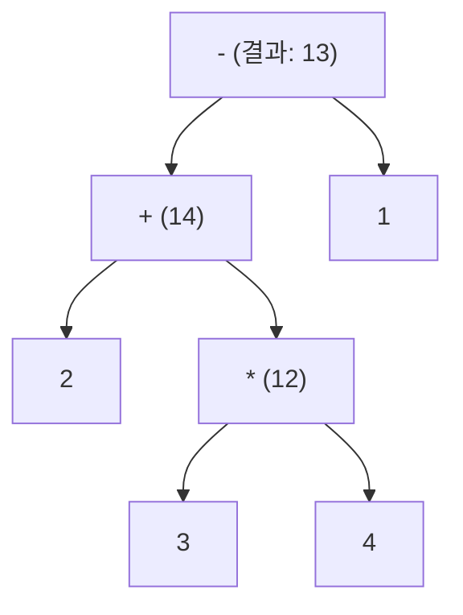

<Callout type="info">
  **이번 문서의 목표:** 연산자 우선순위·결합법칙에 따라 복잡한 식이 어떤 순서로 계산되는지 식 트리로 추적하고, l-value와 r-value로 할당이 성립하는 조건을 설명하며, 단락 평가와 부작용이 왜 프로그램의 결과를 예측하기 어렵게 만드는지 코드 실행 순서로 확인할 수 있게 된다.
</Callout>

## 왜 식(expression)의 평가 규칙을 정확히 알아야 하는가

`2 + 3 * 4`라는 식은 누구나 `14`라고 답할 수 있습니다. 그런데 `a > b && c > d || e`처럼 관계 연산자와 논리 연산자가 뒤섞이거나, `i = i++ + ++i`처럼 같은 변수가 한 식 안에서 여러 번 바뀌는 경우에는 언어가 정한 **우선순위·결합법칙·평가 순서 규칙**을 정확히 모르면 결과를 예측할 수 없습니다. 프로그래밍언어론에서 식과 할당을 다루는 이유는, 겉보기에 사소해 보이는 이 규칙들이 실제로는 **언어 설계자가 신중하게 정해야 하는 의미론(semantics)의 일부**이고, 언어마다 규칙이 다를 수 있기 때문입니다.

> **쉽게 말하면:** 식은 "계산할 순서가 정해진 계산 지시서"이고, 그 순서를 정하는 규칙(우선순위·결합법칙·단락 평가)이 언어마다 조금씩 다릅니다.

## 1. 연산자 우선순위(precedence)와 결합법칙(associativity)

**우선순위**(precedence, 우선순위)는 **서로 다른 종류의 연산자**가 한 식에 섞여 있을 때 어느 것을 먼저 계산할지 정하는 규칙입니다. **결합법칙**(associativity, 결합법칙)은 **같은 우선순위의 연산자**가 연달아 나올 때 왼쪽부터 계산할지(좌결합, left-to-right) 오른쪽부터 계산할지(우결합, right-to-left)를 정하는 규칙입니다.

### 우선순위 추적 — 2 + 3 * 4 - 1

곱셈(`*`)은 덧셈·뺄셈(`+`, `-`)보다 우선순위가 높으므로 먼저 계산됩니다.



| 단계 | 계산 | 남은 식 |
|---|---|---|
| 1 | `3 * 4` 먼저 계산(우선순위가 가장 높음) | `2 + 12 - 1` |
| 2 | 왼쪽의 `+`부터 계산(좌결합) | `14 - 1` |
| 3 | `-` 계산 | `13` |

### 결합법칙 추적 — 10 - 3 - 2

뺄셈은 좌결합 연산자이므로 왼쪽부터 계산합니다. 만약 이 규칙이 반대(우결합)였다면 전혀 다른 결과가 나옵니다.

| 결합법칙 | 계산 순서 | 결과 |
|---|---|---|
| 좌결합(대부분 언어의 실제 규칙) | `(10 - 3) - 2` → `7 - 2` | **5** |
| (대조용) 만약 우결합이었다면 | `10 - (3 - 2)` → `10 - 1` | **9** |

**결과 해석:** 같은 식 `10 - 3 - 2`라도 결합법칙이 좌결합이냐 우결합이냐에 따라 5와 9로 결과가 완전히 달라집니다. 대부분의 언어에서 `+`, `-`, `*`, `/`는 좌결합이지만, **거듭제곱 연산자는 예외적으로 우결합**인 경우가 많습니다.

### 우결합의 실제 예 — 거듭제곱 연산자

```python
결과 = 2 ** 3 ** 2
print(결과)
```

```text
512
```

| 결합법칙 | 계산 순서 | 결과 |
|---|---|---|
| 우결합(Python의 실제 규칙) | `2 ** (3 ** 2)` → `2 ** 9` | **512** |
| (대조용) 만약 좌결합이었다면 | `(2 ** 3) ** 2` → `8 ** 2` | **64** |

**자주 틀리는 점:** "연산자는 무조건 왼쪽부터 계산한다"고 단정하기 쉽지만, 위처럼 거듭제곱은 수학적 관례(오른쪽 지수부터 적용하는 것이 자연스러움)를 반영해 우결합으로 설계된 경우가 많습니다. 시험에서 결합법칙을 묻는 문제는 대개 이런 예외(거듭제곱, 할당 연산자)를 소재로 삼습니다.

## 2. 연산자의 분류

| 분류 | 연산자 예 | 피연산자·결과의 성격 |
|---|---|---|
| 산술(arithmetic) 연산자 | `+`, `-`, `*`, `/`, `%`(나머지) | 숫자를 받아 숫자를 반환 |
| 관계(relational) 연산자 | `==`, `!=`, `>`, `<`, `>=`, `<=` | 두 값을 비교해 참/거짓(불리언)을 반환 |
| 논리(logical) 연산자 | `&&`(그리고), `\|\|`(또는), `!`(부정) | 불리언 값을 받아 불리언 값을 반환 |
| 비트(bitwise) 연산자 | `&`(비트 AND), `\|`(비트 OR), `^`(비트 XOR), `~`(비트 NOT), `<<`(왼쪽 시프트), `>>`(오른쪽 시프트) | 정수를 이진수 자릿수 단위로 직접 조작 |

관계 연산자는 논리 연산자보다 우선순위가 높습니다. 그래서 `a > b && c > d`는 사람이 자연스럽게 읽는 것과 같이 "(`a`가 `b`보다 크다) 그리고 (`c`가 `d`보다 크다)"로 해석되며, `a > (b && c) > d`처럼 엉뚱하게 묶이지 않습니다.

**자주 틀리는 점:** 논리 연산자와 비트 연산자를 문법 기호가 비슷해(`&&` vs `&`, `\|\|` vs `\|`) 혼동하기 쉽습니다. 논리 연산자는 **피연산자 전체를 하나의 참/거짓 값으로만 취급**하지만, 비트 연산자는 **피연산자를 이진수의 각 자릿수(비트) 단위로** 계산합니다. 예를 들어 정수 `6`(이진수 `0110`)과 `3`(이진수 `0011`)에 대해 `6 & 3`은 자릿수별 AND를 계산해 `0010`, 즉 `2`가 되지만, `6 && 3`은 두 값 모두 0이 아니므로(참으로 취급) 참(`1` 또는 `true`)이 됩니다.

## 3. 할당(assignment)과 l-value·r-value

**할당**(assignment, 대입)은 한 저장 공간에 값을 쓰는 연산입니다. 할당식 `x = 5`가 성립하려면 왼쪽에는 **실제로 값을 저장할 수 있는 대상**이 와야 하고, 오른쪽에는 **값 자체**만 있으면 됩니다. 이를 구분하는 용어가 **l-value**(l-값, 할당의 왼쪽left에 올 수 있는 것 — 식별 가능한 저장 공간을 가리킴)와 **r-value**(r-값, 할당의 오른쪽right에만 올 수 있는 것 — 단순한 값)입니다.

```c
int x = 5;
int y = 3;

x = y + 1;   /* 정상: x는 l-value(저장 공간을 가짐), y + 1은 r-value(계산 결과값일 뿐) */
5 = x;       /* 컴파일 오류: 5는 저장 공간이 없는 순수한 값(r-value)이라 왼쪽에 올 수 없다 */
```

```text
오류: lvalue required as left operand of assignment
```

| 식 | l-value인가 | 이유 |
|---|---|---|
| `x` | 예 | 이름 있는 변수는 실제 메모리 저장 공간을 가리킨다 |
| `*p` (p는 포인터) | 예 | 포인터가 가리키는 곳도 식별 가능한 저장 공간이다(11편) |
| `5` | 아니오 | 리터럴 상수는 저장 공간이 아니라 값 그 자체다 |
| `y + 1` | 아니오 | 연산의 결과는 임시로 계산된 값일 뿐, 그 값을 담을 이름 붙은 저장 공간이 없다 |

**결과 해석:** `x = y + 1`에서 오른쪽 `y + 1`은 먼저 계산되어 `4`라는 r-value가 되고, 이 값이 왼쪽의 l-value인 `x`가 가리키는 저장 공간에 쓰입니다. `5 = x;`가 오류인 이유는 `5`라는 값 자체에는 "여기에 다른 값을 써 넣을 수 있는 자리"가 없기 때문입니다. 이 구분은 04편(선행)에서 다룬 "할당은 값을 저장 공간에 복사하는 것"이라는 직관을 정확한 용어로 표현한 것입니다.

### 연쇄 할당과 결합법칙

```c
int a, b, c;
a = b = c = 5;
```

할당 연산자(`=`)는 **우결합**입니다. 따라서 `a = (b = (c = 5))` 순서로 계산됩니다 — 먼저 `c`에 `5`를 대입하고, 그 대입식 전체의 결과값(`5`)을 다시 `b`에 대입하며, 그 결과값을 다시 `a`에 대입합니다. 결과적으로 `a`, `b`, `c` 모두 `5`가 됩니다. **자주 틀리는 점:** 만약 할당이 좌결합이었다면 `(a = b) = c = 5`처럼 `a = b`가 먼저 계산되어야 하는데, `a = b`의 결과값(l-value가 아닌 경우가 많음)에 다시 값을 대입한다는 것은 대부분의 언어에서 말이 되지 않습니다. 할당이 우결합인 이유가 바로 이 연쇄 할당 관용구를 자연스럽게 만들기 위해서입니다.

## 4. 단락 평가(short-circuit evaluation)

**단락 평가**(short-circuit evaluation, 단락 평가)란 논리 연산자 `&&`, `\|\|`에서 **왼쪽 피연산자만으로 전체 결과가 이미 확정되면, 오른쪽 피연산자를 아예 평가하지 않고 건너뛰는** 규칙입니다. `A && B`는 `A`가 거짓이면 `B`가 무엇이든 전체가 거짓이므로 `B`를 평가하지 않고, `A \|\| B`는 `A`가 참이면 `B`를 평가하지 않습니다.

```c
int 증가횟수 = 0;

int 증가함수(void) {
    증가횟수 = 증가횟수 + 1;
    return 0;   /* 거짓을 나타내는 값 */
}

int main(void) {
    int a = 1;
    if (a == 1 || 증가함수()) {
        printf("참\n");
    }
    printf("증가횟수 = %d\n", 증가횟수);
    return 0;
}
```

```text
참
증가횟수 = 0
```

| 단계 | 실행 내용 | 결과 |
|---|---|---|
| 1 | `a == 1` 평가 | 참 |
| 2 | `\|\|`의 왼쪽이 이미 참이므로 단락 평가 규칙에 따라 오른쪽 `증가함수()`는 **평가되지 않고 건너뜀** | `증가함수`는 한 번도 호출되지 않음 |
| 3 | `if` 조건 전체 | 참 → "참" 출력 |
| 4 | `증가횟수` 최종 값 | **0**(증가함수가 호출되지 않았으므로 한 번도 증가하지 않음) |

**결과 해석:** `증가함수()`는 호출되기만 하면 `증가횟수`를 반드시 1 늘리는 **부작용**(side effect, 부작용 — 값을 계산하는 것 외에 프로그램의 다른 상태를 바꾸는 효과)을 가진 함수입니다. 그런데 단락 평가 때문에 `증가함수()`는 아예 호출조차 되지 않아 `증가횟수`는 0으로 남습니다. 만약 이 언어가 단락 평가를 하지 않는다면 `증가함수()`가 항상 호출되어 `증가횟수`는 1이 되었을 것입니다.

### 언어별 단락 평가 보장 여부 — 같은 논리 연산이라도 규격이 다를 수 있다

C·Java·Python 등 오늘날의 주요 언어는 `&&`, `\|\|`(Python은 `and`, `or`)에 대해 단락 평가를 **언어 규격상 보장**합니다. 그런데 프로그래밍언어론 역사에서 자주 인용되는 대조 사례가 있습니다 — **표준 파스칼(Standard Pascal)의 원래 언어 규격은 `and`·`or` 연산자의 단락 평가를 보장하지 않았습니다.** 즉 구현체(컴파일러)에 따라 왼쪽 값만으로 결과가 정해지더라도 오른쪽 피연산자를 항상 평가할 수도, 평가하지 않을 수도 있었습니다.

| 언어 | `and`/`or`(또는 `&&`/`\|\|`)의 단락 평가 | 위 코드에서 증가함수 호출 여부 |
|---|---|---|
| C, Java, Python(오늘날 주요 언어) | 언어 규격상 항상 보장됨 | 호출되지 않음(증가횟수 = 0으로 확정) |
| 표준 파스칼(원 규격) | 규격상 보장되지 않음(구현체 재량) | 구현체에 따라 호출될 수도, 안 될 수도 있음 |

**자주 틀리는 점:** "모든 언어의 논리 연산자는 항상 단락 평가된다"는 오답 함정입니다. 단락 평가는 매우 널리 퍼진 설계이지만 **언어가 명시적으로 그렇게 정의해야만** 보장되는 의미론이며, 왼쪽·오른쪽 피연산자에 부작용이 있는 함수 호출을 넣는 습관은 단락 평가가 보장되지 않는 언어에서는 위험할 수 있습니다.

## 5. 부작용과 평가 순서 — 정의되지 않은 동작의 함정

**부작용**(side effect)이 있는 연산(대입, 증감 연산자 `++`/`--`, 함수 호출 등)을 **한 식 안에 여러 번** 넣으면, 언어가 그 식의 하위 부분들을 **어떤 순서로 평가할지 규정하지 않는 경우** 결과를 예측할 수 없게 됩니다.

```c
int i = 1;
int 결과 = i++ + ++i;
printf("%d\n", 결과);
```

```text
정의되지 않은 동작(컴파일러·플랫폼에 따라 다른 값이 나올 수 있다 — 예측할 수 없다)
```

**결과 해석:** `i++`(후위 증가: 현재 값을 결과로 쓰고 나중에 `i`를 늘림)와 `++i`(전위 증가: 먼저 `i`를 늘리고 그 값을 결과로 씀)가 **같은 변수 `i`를 같은 식 안에서 동시에 수정**하고 있습니다. C 표준은 이런 식에서 두 부분식을 왼쪽부터 계산할지 오른쪽부터 계산할지를 규정하지 않으므로(정의되지 않은 동작, undefined behavior), 이 코드는 컴파일러나 최적화 옵션에 따라 다른 값을 낼 수 있는 **잘못된 코드**입니다. **자주 틀리는 점:** "C는 항상 왼쪽에서 오른쪽으로 계산한다"는 착각입니다. 산술 연산자 자체의 좌결합·우결합은 "어느 연산을 먼저 묶어서 계산하는가"를 정하는 규칙일 뿐, "부작용이 있는 하위 식들을 어떤 순서로 평가하는가"까지 보장하지는 않습니다. 이 둘을 구분하지 못하면 시험에서 "다음 코드의 출력은?" 유형에 함정으로 등장하는 이런 식을 오답으로 확신하게 됩니다 — 정답은 "결과를 예측할 수 없다(정의되지 않은 동작)"입니다.

## 핵심 정리

- **우선순위**는 서로 다른 연산자 중 무엇을 먼저 계산할지, **결합법칙**은 같은 우선순위의 연산자를 왼쪽·오른쪽 중 어느 방향으로 묶어 계산할지를 정한다 — 거듭제곱 연산자처럼 우결합인 예외가 있다.
- 연산자는 산술·관계·논리·비트로 분류되며, 논리 연산자(`&&`)와 비트 연산자(`&`)는 기호가 비슷해도 전체를 하나의 참/거짓으로 보는지 자릿수 단위로 보는지가 다르다.
- **l-value**는 값을 저장할 수 있는 대상(할당의 왼쪽에 올 수 있음), **r-value**는 값 자체(오른쪽에만 올 수 있음)이며, 할당 연산자는 우결합이라 연쇄 할당이 자연스럽게 성립한다.
- **단락 평가**는 왼쪽 피연산자만으로 결과가 확정되면 오른쪽을 평가하지 않는 규칙으로, 오른쪽에 부작용이 있는 호출이 있으면 그 호출 자체가 아예 일어나지 않을 수 있다.
- 단락 평가는 언어가 명시적으로 보장해야 하는 의미론이다 — 표준 파스칼의 `and`/`or`처럼 보장되지 않는 사례도 있었다.
- 한 식 안에 부작용이 있는 연산을 여러 번 넣으면, 하위 식의 평가 순서가 언어 규격에 정의되어 있지 않은 경우 결과를 예측할 수 없는 정의되지 않은 동작이 된다.

## 마무리 복습

<Quiz
  questionNumber={1}
  question="식 2 + 3 * 4 - 1을 일반적인 연산자 우선순위 규칙에 따라 계산한 결과는?"
  options={['19', '13', '9', '23']}
  correctAnswer={2}
  explanation="곱셈이 덧셈·뺄셈보다 우선순위가 높으므로 3 * 4 = 12를 먼저 계산한다. 이후 2 + 12 - 1을 좌결합 규칙으로 왼쪽부터 계산하면 14 - 1 = 13이다."
  optionExplanations={['덧셈·뺄셈을 곱셈보다 먼저 계산한 경우 나올 수 있는 잘못된 값이다', '정답. 3×4=12를 먼저 계산한 뒤 2+12-1=13이다', '곱셈 계산이나 결합 순서를 다르게 처리했을 때 나올 수 있는 값이다', '우선순위를 완전히 무시하고 다른 순서로 계산했을 때 나올 수 있는 값이다']}
/>

<Quiz
  questionNumber={2}
  question="뺄셈 연산자가 좌결합이라고 할 때, 10 - 3 - 2의 계산 결과는?"
  options={['5', '9', '15', '-9']}
  correctAnswer={1}
  explanation="좌결합 규칙에 따라 왼쪽부터 계산한다. (10 - 3) - 2 = 7 - 2 = 5이다."
  optionExplanations={['정답. 왼쪽부터 (10-3)-2=5로 계산된다', '9는 만약 뺄셈이 우결합이었다면(10-(3-2)) 나오는 값이다', '세 수를 순서와 무관하게 단순히 더한 값이다', '부호 처리를 잘못했을 때 나올 수 있는 값이다']}
/>

<Quiz
  questionNumber={3}
  question="Python에서 거듭제곱 연산자 **는 우결합이다. 2 ** 3 ** 2의 계산 결과는?"
  options={['64', '512', '36', '18']}
  correctAnswer={2}
  explanation="우결합이므로 2 ** (3 ** 2) 순서로 계산한다. 3 ** 2 = 9이고, 2 ** 9 = 512이다."
  optionExplanations={['64는 만약 좌결합이었다면 왼쪽의 2를 3제곱한 값 8을 다시 2제곱해 나오는 값이다', '정답. 오른쪽의 3을 2제곱한 값 9를 먼저 계산한 뒤 2를 9제곱한 값이다', '지수를 곱셈으로 잘못 계산했을 때 나올 수 있는 값이다', '밑과 지수를 혼동해 계산했을 때 나올 수 있는 값이다']}
/>

<Quiz
  questionNumber={4}
  question="다음 중 l-value가 될 수 없는 것은?"
  options={['변수 x', '포인터 p에 대한 *p (역참조 결과)', '두 변수의 합인 y + 1', '배열 원소 arr[3]']}
  correctAnswer={3}
  explanation="y + 1은 계산 결과로 만들어진 임시 값일 뿐, 그 값을 다시 저장할 수 있는 이름 붙은 저장 공간이 없으므로 l-value가 될 수 없다. 반면 변수, 역참조 결과, 배열 원소는 모두 식별 가능한 저장 공간을 가리키므로 l-value가 될 수 있다."
  optionExplanations={['변수는 이름 붙은 저장 공간을 가리키므로 l-value가 될 수 있다', '포인터가 가리키는 곳도 식별 가능한 저장 공간이므로 l-value가 될 수 있다', '정답. 연산 결과값은 저장 공간이 없는 r-value일 뿐이다', '배열 원소도 인덱스로 식별되는 저장 공간을 가리키므로 l-value가 될 수 있다']}
/>

<Quiz
  questionNumber={5}
  question="int a = 1; if (a == 1 || 증가함수()) { ... } 에서 증가함수는 호출될 때마다 어떤 변수를 1씩 늘린다. 이 언어가 단락 평가를 보장한다면, 증가함수는 몇 번 호출되는가?"
  options={['0번(호출되지 않는다)', '1번', '2번', 'a의 값에 관계없이 항상 여러 번']}
  correctAnswer={1}
  explanation="a == 1이 참이므로 || 연산자의 단락 평가 규칙에 따라 오른쪽 피연산자인 증가함수()는 평가(호출)되지 않는다."
  optionExplanations={['정답. 왼쪽이 이미 참이므로 오른쪽은 평가되지 않아 증가함수는 호출되지 않는다', '단락 평가가 적용되면 오른쪽 피연산자 자체가 평가되지 않으므로 1번도 호출되지 않는다', '식 안에서 || 연산은 한 번만 등장하며, 그마저도 단락 평가로 오른쪽이 평가되지 않는다', '단락 평가는 왼쪽 값만으로 결과가 확정되면 오른쪽을 건너뛰는 규칙이므로 이 설명은 틀렸다']}
/>

<Quiz
  questionNumber={6}
  question="프로그래밍언어론에서 표준 파스칼(Standard Pascal)의 and·or 연산자에 대해 자주 언급되는 특징은?"
  options={['C의 &&, ||와 마찬가지로 단락 평가가 언어 규격상 항상 보장되었다', '단락 평가가 언어 규격상 보장되지 않아, 구현체에 따라 오른쪽 피연산자가 항상 평가될 수도 있었다', 'and·or 연산자 자체가 존재하지 않아 비트 연산자로 대신해야 했다', '단락 평가 대신 항상 두 피연산자를 병렬로 평가했다']}
  correctAnswer={2}
  explanation="표준 파스칼의 원래 언어 규격은 and·or의 단락 평가를 보장하지 않아, 구현체(컴파일러)에 따라 왼쪽 값만으로 결과가 확정되어도 오른쪽 피연산자를 항상 평가할 수 있었다. 이는 단락 평가가 모든 언어에서 당연히 보장되는 것이 아니라는 점을 보여주는 대표 사례로 자주 인용된다."
  optionExplanations={['이 설명은 C에 해당하며, 표준 파스칼의 원 규격과는 반대되는 내용이다', '정답. 단락 평가가 규격상 보장되지 않았다는 점이 대조 사례로 자주 언급된다', '표준 파스칼에도 and·or 연산자는 존재했다. 다만 단락 평가 보장 여부가 문제였다', '병렬 평가는 실제 구현 방식과 무관한 설명이다']}
/>

<Quiz
  questionNumber={7}
  question="int i = 1; int 결과 = i++ + ++i; 라는 C 코드에 대한 설명으로 옳은 것은?"
  options={['항상 결과 = 4가 되도록 C 표준이 평가 순서를 명확히 정의하고 있다', '이 식은 같은 변수 i를 한 식 안에서 여러 번 수정하면서 평가 순서가 규정되어 있지 않아 정의되지 않은 동작이다', 'i++는 항상 ++i보다 먼저 평가되도록 C 표준이 보장한다', '이 코드는 문법 오류로 컴파일 자체가 되지 않는다']}
  correctAnswer={2}
  explanation="i++와 ++i가 같은 변수 i를 동시에 수정하는데, C 표준은 이런 하위 식들의 평가 순서를 규정하지 않는다. 따라서 이 식은 컴파일러나 환경에 따라 다른 결과가 나올 수 있는 정의되지 않은 동작이다."
  optionExplanations={['C 표준은 이런 경우의 평가 순서를 규정하지 않으므로 특정 값이 보장되지 않는다', '정답. 부작용이 있는 하위 식의 평가 순서가 정의되어 있지 않은 대표적인 위험한 코드다', 'C 표준은 좌항·우항 중 어느 쪽을 먼저 평가할지 규정하지 않는다', '문법적으로는 유효한 식이라 컴파일은 되지만, 그 의미(결과값)가 정의되지 않았다는 것이 문제다']}
/>

## 참고 자료

- 국가평생교육진흥원 독학학위제: https://bdes.nile.or.kr
- MDN Web Docs — 논리 연산자와 단락 평가(Short-circuit evaluation): https://developer.mozilla.org/ko/docs/Web/JavaScript/Reference/Operators/Logical_AND
