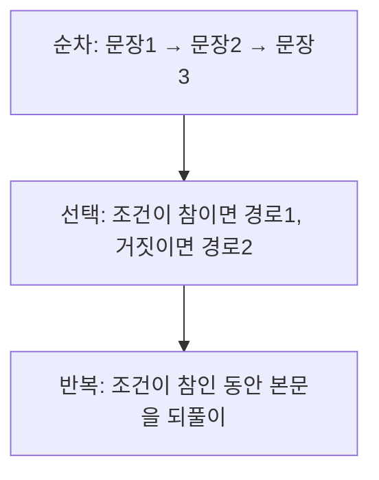

<Callout type="info">
  **이번 문서의 목표:** 이 문서를 다 읽으면 선택문·반복문을 "설계 관점"에서 비교·평가할 수 있고, break/continue·다중 루프·case fall-through가 만드는 함정을 코드를 한 줄씩 추적해 정확히 예측할 수 있다.
</Callout>

## 왜 제어 구조를 "설계 관점"에서 다시 봐야 하는가

지금까지 여러분은 `if`, `for`, `while`, `switch` 같은 제어문(control structure, 프로그램의 실행 순서를 바꾸는 문장)을 셀 수 없이 써봤을 것이다. 하지만 프로그래밍언어론(programming language concepts)에서 제어 구조를 다루는 이유는 문법을 다시 가르치기 위해서가 아니다. **같은 기능을 언어마다 왜 다르게 설계했는가**, 그리고 **그 설계 차이가 어떤 실수를 유발하는가**를 묻기 위해서다.

> **쉽게 말하면:** 제어 구조는 "프로그램이 다음에 어떤 문장을 실행할지 결정하는 규칙"이고, 이 문서는 그 규칙을 언어마다 비교해 시험에 나오는 "옳지 않은 것 고르기" 유형에 대비하는 문서다.

04편(제어 구조와 하위프로그램 개념 지도)에서 제어 구조를 순차(sequence)·선택(selection)·반복(iteration)·절차 호출·예외로 분류했던 것을 기억하자. 이 문서는 그중 **선택문과 반복문**만 깊게 파고든다. 절차 호출은 14~15편(하위프로그램), 예외는 20편에서 별도로 다룬다.

## 구조적 프로그래밍 원칙 — 왜 goto를 버렸는가

### 문제 상황

1960년대까지 많은 언어(초기 FORTRAN, BASIC 등)는 `goto` 문(정해진 줄 번호나 레이블로 실행 흐름을 무조건 이동시키는 명령어)에 크게 의존했다. 프로그램이 조금만 길어져도 실행 흐름이 이 줄에서 저 줄로 제멋대로 튀어 다니는 코드, 흔히 "스파게티 코드(spaghetti code, 실이 얽힌 스파게티 면발처럼 흐름을 눈으로 따라가기 힘든 코드)"가 됐다.

1968년 에츠허르 데이크스트라(Edsger Dijkstra)는 "Go To Statement Considered Harmful(goto 문은 해롭다고 여겨진다)"이라는 논문에서, 프로그램의 정적 구조(코드를 눈으로 읽을 때 보이는 순서)와 동적 실행 순서(실제로 실행되는 순서)가 일치해야 사람이 프로그램을 이해하고 검증할 수 있다고 주장했다. 이 주장이 **구조적 프로그래밍(structured programming)** 운동의 출발점이다.

> **쉽게 말하면:** 구조적 프로그래밍은 "코드를 위에서 아래로 읽는 순서와 실제로 실행되는 순서를 최대한 일치시키자"는 설계 철학이다.

### 핵심 정리 — 세 가지 제어 구조로 충분하다

뵘-야코피니 정리(Böhm–Jacopini theorem, 이탈리아 학자 코라도 뵘과 주세페 야코피니가 1966년에 증명한 정리)는 **모든 계산 가능한 알고리즘은 순차·선택·반복 이 세 가지 제어 구조만으로 표현할 수 있다**는 것을 수학적으로 증명했다. 즉 `goto` 없이도 이론적으로 못 만드는 프로그램은 없다.

| 제어 구조 | 정의 | 대표 문법 |
|---|---|---|
| 순차(sequence) | 문장을 코드에 적힌 순서대로 하나씩 실행 | 문장을 세미콜론·줄바꿈으로 나열 |
| 선택(selection) | 조건에 따라 여러 실행 경로 중 하나를 고름 | `if`, `if-else`, `switch`/`case` |
| 반복(iteration) | 조건이 유지되는 동안 같은 코드를 되풀이 실행 | `while`, `for`, `do-while` |

구조적 프로그래밍이 요구하는 것은 각 제어 구조가 **단일 진입점**(single entry)과 **단일 종료점**(single exit)을 가져야 한다는 것이다. 즉 블록의 중간으로 뛰어들거나(goto로 블록 안 특정 줄로 점프) 블록 중간에서 밖으로 튀어나가는(goto로 블록을 건너뛰는) 흐름을 금지한다. `if`, `while` 같은 문장은 이 조건을 자연스럽게 만족한다 — 블록에 들어가는 문도 하나, 블록을 빠져나가는 문도 하나다.



**자주 틀리는 점**: "구조적 프로그래밍은 goto를 무조건 금지한다"라고 외우면 함정에 빠진다. 정확히는 "goto **없이도** 표현력을 잃지 않는다는 것을 증명했다"는 것이고, 실제 언어들은 제한된 형태의 탈출문(break, continue, return)을 예외적으로 허용한다. 이 탈출문들은 뒤에서 다시 다룬다.

## 선택문(selection statement) 설계 비교

### 단순 선택 — if와 if-else

가장 기본적인 선택문은 조건 하나로 두 갈래 중 하나를 고르는 `if`-`else`다. 설계 쟁점은 두 가지다.

1. **선택 가능한 경로가 몇 개인가**: `if`만 있으면 "참일 때만 실행", `if-else`가 있으면 "참/거짓 두 경로 중 하나".
2. **중첩된 if를 어떻게 짝짓는가**: `else`가 어느 `if`에 붙는지가 모호해질 수 있다. 이를 **댕글링 else 문제**(dangling else problem, 매달린 else 문제)라 한다.

```c
if (a > 0)
    if (b > 0)
        printf("둘 다 양수\n");
else
    printf("a가 양수가 아님\n");
```

들여쓰기만 보면 `else`가 바깥쪽 `if (a > 0)`에 붙는 것처럼 보이지만, C·Java 등 대부분의 언어는 "**else는 가장 가까운, 아직 짝지어지지 않은 if에 붙는다**"는 규칙(most closely nested rule, 가장 가깝게 중첩된 if에 짝짓는 규칙)을 채택한다. 따라서 실제로는 안쪽 `if (b > 0)`에 붙는다.

**한 줄씩 실행 추적** — `a = -1`, `b = 5`로 대입해 보자.

| 단계 | 실행되는 문장 | 판단 | 결과 |
|---|---|---|---|
| 1 | `if (a > 0)` | `a > 0`은 `-1 > 0`이므로 거짓 | 바깥 if 블록 전체를 건너뜀 |
| 2 | (아무것도 출력 안 됨) | 안쪽 if도 실행되지 않았으므로 else도 실행 안 됨 | 출력 없음 |

즉 들여쓰기와 달리 아무것도 출력되지 않는다. 이것이 **댕글링 else 함정**의 전형적인 시험 문항 형태다 — 사람 눈에는 바깥쪽 else처럼 보이지만 컴파일러는 안쪽 else로 해석한다.

**언어별 회피 방법**: Python은 들여쓰기 자체가 블록 구분자이므로 이 문제가 원천적으로 없다. Algol 계열 언어와 Pascal은 `begin`-`end`(또는 중괄호)로 블록을 명시하도록 강제해 모호성을 없앤다.

```c
if (a > 0) {
    if (b > 0)
        printf("둘 다 양수\n");
}
else
    printf("a가 양수가 아님\n");
```

이렇게 중괄호로 안쪽 `if`를 블록으로 감싸면 `else`가 확실히 바깥쪽 `if`에 붙는다. 실제로 `a = -1`일 때 이번에는 "a가 양수가 아님"이 출력된다.

### 다중 선택 — switch/case와 case fall-through

경로가 세 개 이상이면 `if-else if-else` 사슬을 쓸 수도 있지만, 비교 대상이 하나의 변수 값(정수·문자·열거형 등 이산적인 값)일 때는 `switch`(다중 분기문)가 더 읽기 쉽다.

```java
int day = 3;
switch (day) {
    case 1:
        System.out.println("월요일");
        break;
    case 2:
        System.out.println("화요일");
        break;
    case 3:
        System.out.println("수요일");
        break;
    default:
        System.out.println("알 수 없음");
}
```

```text
수요일
```

**case fall-through(케이스 통과, 다음 case로 흘러 들어감)**: C·Java의 `switch`는 일치하는 `case`부터 실행을 시작한 뒤, 명시적으로 `break`를 만나기 전까지는 **아래에 있는 다음 case의 코드도 계속 실행**한다. `break`를 빠뜨리면 이렇게 된다.

```java
int day = 3;
switch (day) {
    case 1:
        System.out.println("월요일");
    case 2:
        System.out.println("화요일");
    case 3:
        System.out.println("수요일");
    case 4:
        System.out.println("목요일");
        break;
    default:
        System.out.println("알 수 없음");
}
```

```text
수요일
목요일
```

**한 줄씩 실행 추적**

| 단계 | 검사하는 case | break 유무 | 진행 |
|---|---|---|---|
| 1 | `case 3:`이 `day == 3`과 일치 → 진입 | 없음 | "수요일" 출력 후 다음 줄로 계속 진행(fall through) |
| 2 | `case 4:` (검사 없이 그냥 다음 코드 실행) | 있음 | "목요일" 출력 후 break로 switch 탈출 |

즉 일단 어느 case든 매치되면 그 아래는 **조건을 다시 검사하지 않고** break를 만날 때까지 순서대로 흘러내려간다. 이것이 case fall-through이며, 독학사 시험에서 "다음 코드의 출력은?" 유형으로 자주 나온다.

> **쉽게 말하면:** switch의 case는 "여기부터 시작하라"는 표지판일 뿐, break가 없으면 표지판을 지나쳐 계속 달린다.

**설계 비교**: fall-through를 기본 동작으로 두는 것은 C 계열 언어의 설계 선택이며, 의도적으로 여러 case를 묶어 같은 코드를 실행하게 할 때(예: `case 1: case 2:` 두 줄을 연달아 써서 같은 처리를 공유) 유용하지만, break를 실수로 빠뜨리는 대표적 버그 원인이기도 하다. 이런 문제의식 때문에 이후 등장한 언어들은 설계를 바꿨다.

| 언어 | case 간 fall-through 기본 동작 | 여러 case 묶는 방법 |
|---|---|---|
| C, C++, Java(전통 switch) | 기본적으로 흘러내림(break 없으면 계속 진행) | `case 1: case 2:`처럼 라벨을 연달아 씀 |
| C# | 기본적으로 금지(각 case 끝에 break·return·goto 필수) | `case 1: case 2:` 라벨 연달아 쓰기는 허용(빈 case일 때) |
| Java 14 이후(`switch` 식) | `->` 화살표 문법을 쓰면 흘러내리지 않음 | `case 1, 2 ->` 처럼 콤마로 묶음 |
| Python | switch 문 자체가 없었고(3.10부터 `match` 문 도입), `match`는 fall-through 없음 | `case 1 | 2:`처럼 `|`로 묶음 |

**자주 틀리는 점**: "switch는 항상 fall-through가 일어난다"고 일반화하면 틀린다. fall-through 여부는 **언어와 문법 형태(전통 switch문 vs switch식)에 따라 다르다.** 시험에서 언어를 명시했다면 그 언어의 규칙을 따라야 한다.

## 반복문(iteration statement) 설계 비교

### 판단 시점에 따른 분류 — 전위 검사 vs 후위 검사

반복문의 핵심 설계 쟁점은 "**조건을 언제 검사하는가**"다.

- **전위 검사(pretest) 반복**: 본문을 실행하기 **전에** 조건을 검사한다. 조건이 처음부터 거짓이면 본문이 **한 번도 실행되지 않을 수 있다.** `while`, 대부분의 `for`가 여기 속한다.
- **후위 검사(posttest) 반복**: 본문을 먼저 실행한 **뒤에** 조건을 검사한다. 조건과 무관하게 **최소 한 번은 실행된다.** `do-while`이 대표적이다.

```c
int i = 5;
while (i < 3) {
    printf("%d\n", i);
    i++;
}
printf("while 종료 후 i = %d\n", i);
```

```text
while 종료 후 i = 5
```

**한 줄씩 실행 추적**: `i`는 5로 시작한다. `while (i < 3)`을 평가하면 `5 < 3`은 거짓이므로 본문에 진입조차 하지 않는다. 따라서 아무것도 출력되지 않고 `i`는 5 그대로 남는다.

```c
int i = 5;
do {
    printf("%d\n", i);
    i++;
} while (i < 3);
printf("do-while 종료 후 i = %d\n", i);
```

```text
5
do-while 종료 후 i = 6
```

**한 줄씩 실행 추적**: `do-while`은 조건 검사보다 본문 실행이 먼저다. `i = 5`인 상태로 본문을 실행해 "5"를 출력하고 `i`를 6으로 증가시킨 **다음에야** `i < 3`을 검사한다. `6 < 3`은 거짓이므로 반복을 종료한다. 조건이 처음부터 거짓이었음에도 본문이 한 번 실행된 것이 while과의 결정적 차이다.

> **쉽게 말하면:** while은 "문 앞에서 신분증부터 확인"하고, do-while은 "일단 들여보낸 뒤 나가려 할 때 신분증을 확인"한다.

### 계수 제어 반복 — for문의 세 부분과 설계 변형

`for`문은 초기화·조건·증감을 한 줄에 모아 쓰는 **계수 제어(counter-controlled) 반복**의 대표 문법이다.

```c
for (int i = 0; i < 3; i++) {
    printf("i = %d\n", i);
}
```

```text
i = 0
i = 1
i = 2
```

**한 줄씩 실행 추적**

| 단계 | 실행 위치 | i 값 | 조건 `i < 3` | 동작 |
|---|---|---|---|---|
| 1 | 초기화 `int i = 0` (최초 1회만) | 0 | - | i를 0으로 초기화 |
| 2 | 조건 검사 | 0 | 참 | 본문 실행 → "i = 0" 출력 |
| 3 | 증감 `i++` | 1 | - | i를 1로 증가 |
| 4 | 조건 검사 | 1 | 참 | 본문 실행 → "i = 1" 출력 |
| 5 | 증감 `i++` | 2 | - | i를 2로 증가 |
| 6 | 조건 검사 | 2 | 참 | 본문 실행 → "i = 2" 출력 |
| 7 | 증감 `i++` | 3 | - | i를 3으로 증가 |
| 8 | 조건 검사 | 3 | 거짓 | 반복 종료 |

C 계열 `for`는 **초기화 → (조건 → 본문 → 증감)을 반복 → 조건이 거짓이면 종료** 순서로 동작하는 전위 검사 반복문일 뿐이며, 실제로는 `while`로 완전히 풀어 쓸 수 있다. 이는 "for는 while의 문법 설탕(syntactic sugar, 같은 의미를 더 편하게 쓰도록 포장한 문법)"이라는 설계 관점을 보여준다.

**언어별 for문 설계 비교**: 모든 언어의 `for`가 이렇게 세 부분으로 되어 있지는 않다.

| 언어 | for문 형태 | 특징 |
|---|---|---|
| C, C++, Java, C# | `for (초기화; 조건; 증감)` | 계수 제어형. 세 부분 모두 생략 가능(`for(;;)`는 무한 루프) |
| Java(향상된 for), C#(foreach), Python | `for 요소 in 컬렉션` | 컬렉션 순회 전용. 인덱스 변수를 직접 다루지 않는 컬렉션 제어(collection-controlled) 반복 |
| Ada, Pascal | 증감이 항상 1(또는 지정한 step)로 고정, 반복 변수 값을 반복문 안에서 재대입 금지 | 반복 변수를 실수로 바꿔 무한 루프에 빠지는 사고를 언어 차원에서 방지 |

**자주 틀리는 점**: C의 `for (int i = 0; i < 3; i++)`에서 초기화는 **딱 한 번만** 실행된다고 착각하지 않는 것이 중요하지만, 반대로 "조건 검사도 매 반복 처음에 이루어진다"를 "증감 다음에 이루어진다"와 헷갈리는 것도 흔한 실수다. 표에서 보듯 순서는 정확히 **초기화(1회) → 조건 → 본문 → 증감 → 조건 → 본문 → 증감 → …** 이다.

## break·continue와 다중 루프 함정

`break`와 `continue`는 구조적 프로그래밍의 "단일 종료점" 원칙에서 벗어나는 **제한된 탈출문**이다. 완전한 `goto`보다 흐름을 예측하기 쉬워 대부분의 현대 언어가 허용한다.

- **break**: 현재 반복문(또는 switch)을 **즉시 종료**하고 그 다음 문장으로 건너뛴다.
- **continue**: 현재 반복의 **남은 본문을 건너뛰고** 다음 반복의 조건 검사로 넘어간다(for문이면 증감식부터 실행한 뒤 조건 검사).

```c
for (int i = 0; i < 5; i++) {
    if (i == 2) continue;
    if (i == 4) break;
    printf("i = %d\n", i);
}
```

```text
i = 0
i = 1
i = 3
```

**한 줄씩 실행 추적**

| i | `i == 2`? | `i == 4`? | 동작 |
|---|---|---|---|
| 0 | 거짓 | 거짓 | "i = 0" 출력 |
| 1 | 거짓 | 거짓 | "i = 1" 출력 |
| 2 | 참 | (검사 안 함) | continue → 출력 건너뛰고 i++로 |
| 3 | 거짓 | 거짓 | "i = 3" 출력 |
| 4 | 거짓 | 참 | break → 반복문 전체 종료 |

`i = 2`일 때는 출력문까지 가지 못하고 바로 증감식(`i++`)으로 건너뛰었고, `i = 4`일 때는 아예 반복문 자체를 빠져나왔으므로 "i = 4"는 출력되지 않는다.

### 다중 루프에서 break·continue의 함정

중첩된(nested, 반복문 안에 또 다른 반복문이 있는) 루프에서 `break`나 `continue`는 **자신을 감싸고 있는 가장 안쪽 반복문에만** 적용된다. 이것이 다중 루프 관련 시험 문제의 핵심 함정이다.

```java
for (int i = 0; i < 3; i++) {
    for (int j = 0; j < 3; j++) {
        if (j == 1) break;
        System.out.println("i=" + i + ", j=" + j);
    }
}
```

```text
i=0, j=0
i=1, j=0
i=2, j=0
```

**한 줄씩 실행 추적**: 바깥 루프 `i`가 0, 1, 2로 세 번 도는 동안, 안쪽 루프는 매번 `j = 0`일 때 한 번 출력한 뒤 `j = 1`이 되는 순간 `break`를 만난다. 이 `break`는 **안쪽 for(j)만** 종료시킬 뿐 바깥 for(i)는 계속 진행한다. 그래서 "i=0"에서 완전히 멈추는 게 아니라 세 번의 바깥 반복 모두 `j=0`만 출력하고 넘어간다.

바깥 루프까지 한 번에 탈출하고 싶다면 언어별로 다른 수단이 필요하다.

| 언어 | 바깥 루프까지 한 번에 탈출하는 방법 |
|---|---|
| Java | 레이블(label)을 반복문 앞에 붙이고 `break 레이블이름;` |
| C, C++ | 레이블 break 문법이 없어 `goto`를 쓰거나, 플래그 변수를 두어 바깥 루프에서도 검사 |
| Python | 레이블이 없어 함수로 분리한 뒤 `return`을 쓰거나 예외를 이용 |

```java
outer:
for (int i = 0; i < 3; i++) {
    for (int j = 0; j < 3; j++) {
        if (j == 1) break outer;
        System.out.println("i=" + i + ", j=" + j);
    }
}
```

```text
i=0, j=0
```

`break outer;`는 안쪽 루프뿐 아니라 `outer` 레이블이 붙은 바깥 루프까지 즉시 종료시킨다. 그 결과 "i=0, j=0" 단 한 줄만 출력되고 전체 이중 루프가 끝난다.

> **자주 틀리는 점**: "break는 모든 반복문을 다 빠져나간다"고 착각하는 것이 가장 흔한 오답 유형이다. 레이블이 없는 `break`는 **자신을 둘러싼 가장 가까운 반복문(또는 switch) 하나만** 종료시킨다.

## 언어별 제어 구조 설계 비교 총정리

| 비교 축 | C / Java 계열 | Python | Pascal / Ada 계열 |
|---|---|---|---|
| 블록 구분 | 중괄호 `{}` | 들여쓰기(고정 폭) | `begin`–`end` 키워드 |
| 댕글링 else | most closely nested rule로 해결(모호성 존재) | 들여쓰기가 블록을 명확히 하므로 모호성 없음 | `begin`–`end`로 명시하면 모호성 없음 |
| 다중 분기 | switch(기본 fall-through) | match(3.10+, fall-through 없음) | case(언어별 상이, 대개 fall-through 없음) |
| for문 성격 | 계수 제어형(초기화·조건·증감 명시) | 컬렉션 제어형(`range()`와 결합해 계수 제어처럼도 사용) | 계수 제어형이나 반복 변수 재대입을 제한 |
| 후위 검사 반복 | do-while 지원 | 별도 문법 없음(while True + break로 흉내) | repeat–until(Pascal, 조건이 참이 될 때까지 반복 — while과 반대 의미이므로 주의) |
| 다중 루프 탈출 | Java는 레이블 break, C/C++는 미지원(goto·플래그로 대체) | 레이블 없음(함수 분리·예외로 대체) | 언어별 상이 |

**자주 틀리는 점 — repeat-until vs do-while**: Pascal의 `repeat ... until 조건`은 **조건이 참이 될 때까지** 반복한다(do-while과 조건의 참/거짓 의미가 반대). "후위 검사 반복이니까 do-while과 완전히 같다"고 넘겨짚으면 조건 방향을 반대로 읽는 실수를 한다. 두 문법 모두 "본문을 최소 한 번 실행한다"는 후위 검사 특성은 같지만, 반복을 계속하는 조건의 참/거짓 방향이 서로 반대라는 점을 구분해야 한다.

## 핵심 정리

- 뵘-야코피니 정리에 따라 순차·선택·반복 세 구조만으로 모든 알고리즘을 표현할 수 있으며, 구조적 프로그래밍은 goto 대신 단일 진입·단일 종료 블록을 쓰자는 설계 철학이다.
- 댕글링 else는 "else가 가장 가까운 매칭되지 않은 if에 붙는다"는 규칙으로 해결하며, Python·Pascal류는 블록 구분 문법 자체로 모호성을 없앤다.
- C/Java의 switch는 break가 없으면 다음 case로 흘러내리는 fall-through가 기본 동작이며, C#·Java의 switch식·Python match는 이를 금지하거나 다른 문법을 쓴다.
- while(전위 검사)은 조건이 처음부터 거짓이면 0번, do-while(후위 검사)은 최소 1번 실행된다는 차이가 시험의 핵심 포인트다.
- break·continue는 레이블이 없으면 가장 가까운 반복문 하나에만 적용되며, 다중 루프를 한 번에 탈출하려면 언어별 별도 수단(Java 레이블, C 플래그 변수)이 필요하다.

## 마무리 복습

<Quiz
  questionNumber={1}
  question="뵘-야코피니 정리(Böhm–Jacopini theorem)의 내용으로 옳은 것은?"
  options={['모든 알고리즘은 순차, 선택, 반복 세 가지 제어 구조만으로 표현할 수 있다', '모든 알고리즘은 goto 문 없이는 절대 표현할 수 없다', '반복문은 항상 재귀 함수로 바꿀 수 있다', '선택문은 반드시 두 개 이상의 분기를 가져야 한다']}
  correctAnswer={1}
  explanation="뵘-야코피니 정리는 계산 가능한 모든 알고리즘이 순차, 선택, 반복이라는 세 가지 제어 구조만으로 표현될 수 있음을 수학적으로 증명했다. 이는 구조적 프로그래밍이 goto 없이도 표현력을 잃지 않는다는 이론적 근거가 되었다."
  optionExplanations={['정답. 세 가지 제어 구조로 표현력이 충분함을 증명한 정리다.', '정반대의 설명이다. 이 정리는 goto가 필요 없음을 보이는 근거다.', '재귀와 반복의 상호 변환 가능성은 이 정리의 내용이 아니다.', '선택문은 if처럼 한 개의 분기(조건이 참일 때만 실행)만 있어도 성립한다.']}
/>

<Quiz
  questionNumber={2}
  question="다음 C 코드의 실행 결과로 옳은 것은? 코드: a가 0보다 크면(if a 0보다 크면) b가 0보다 크면(if b 0보다 크면) A를 출력, 그렇지 않으면(else) B를 출력. (단 a = -1, b = 5)"
  options={['A가 출력된다', 'B가 출력된다', 'A와 B가 모두 출력된다', '아무것도 출력되지 않는다']}
  correctAnswer={4}
  explanation="C의 댕글링 else 규칙에 따라 else는 가장 가까운, 아직 매칭되지 않은 if인 안쪽 if(b가 0보다 큼)에 짝지어진다. a = -1이므로 바깥쪽 if(a가 0보다 큼)가 거짓이 되어 그 안의 블록 전체(안쪽 if-else 포함)가 실행되지 않는다. 따라서 아무것도 출력되지 않는다."
  optionExplanations={['안쪽 if(b > 0)가 참이 되려면 먼저 바깥 if(a > 0)를 통과해야 하는데 a가 음수라 통과하지 못한다.', 'else가 안쪽 if에 매칭되지만, 그 else를 포함한 블록 자체가 바깥 if(a > 0) 조건이 거짓이라 실행되지 않는다.', '두 print 문 모두 바깥 if 블록 안에 있으므로 바깥 조건이 거짓이면 둘 다 실행되지 않는다.', '정답. 바깥 if(a > 0)가 거짓이므로 그 하위 문장(중첩 if-else 전체)이 통째로 건너뛰어진다.']}
/>

<Quiz
  questionNumber={3}
  question="C/Java의 switch-case 문에서 각 case 블록 끝에 break를 생략했을 때 나타나는 현상을 가장 정확히 설명한 것은?"
  options={['해당 case만 실행되고 switch 문을 즉시 벗어난다', '일치하는 case부터 실행을 시작해 break를 만나거나 switch가 끝날 때까지 아래 case들도 조건 검사 없이 순서대로 실행된다', 'default 절만 대신 실행된다', '컴파일 오류가 발생해 프로그램이 실행되지 않는다']}
  correctAnswer={2}
  explanation="break가 없으면 case fall-through가 발생한다. 일치하는 case에서 실행이 시작된 뒤에는 아래에 있는 case 라벨의 조건을 다시 검사하지 않고 순서대로 계속 흘러 내려가며 실행하다가, break를 만나거나 switch 블록이 끝나면 멈춘다."
  optionExplanations={['이는 break가 있을 때의 동작이다. break가 없으면 이렇게 되지 않는다.', '정답. fall-through의 정확한 동작 설명이다.', 'default는 어떤 case와도 일치하지 않을 때 실행되는 절이며 fall-through와는 무관하다.', 'break 생략은 문법 오류가 아니라 정상적으로 컴파일되는 C/Java의 정의된 동작이다.']}
/>

<Quiz
  questionNumber={4}
  question="다음 코드를 실행했을 때 출력되는 줄 수는? 코드: i를 10으로 초기화, i가 5보다 작은 동안(while i 5보다 작음) i를 출력하고 i를 1 증가시킴."
  options={['0줄(아무것도 출력되지 않는다)', '1줄', '5줄', '무한히 출력된다']}
  correctAnswer={1}
  explanation="while은 전위 검사(pretest) 반복문이므로 본문을 실행하기 전에 조건을 먼저 검사한다. i = 10일 때 i가 5보다 작다는 조건은 처음부터 거짓이므로 본문에 단 한 번도 진입하지 못하고 반복문이 즉시 종료된다."
  optionExplanations={['정답. 전위 검사이므로 조건이 처음부터 거짓이면 본문이 0번 실행된다.', 'do-while이었다면 최소 1번은 실행되지만, 이 문제는 while이므로 0번이 맞다.', '조건이 거짓인 상태로 시작했으므로 5번 실행될 근거가 없다.', 'i가 증가하는 방향(10에서 더 커짐)과 조건(5보다 작아야 함)이 애초에 만족될 수 없어 무한 루프가 아니라 즉시 종료된다.']}
/>

<Quiz
  questionNumber={5}
  question="do-while 문과 while 문의 근본적인 차이를 가장 정확히 설명한 것은?"
  options={['do-while은 조건을 아예 검사하지 않는다', 'do-while은 본문을 먼저 실행한 뒤 조건을 검사하므로 조건이 처음부터 거짓이어도 본문이 최소 한 번 실행되지만, while은 조건이 처음부터 거짓이면 본문이 한 번도 실행되지 않는다', 'while은 정수형 변수에만 사용할 수 있다', 'do-while은 반복 횟수를 미리 알아야만 사용할 수 있다']}
  correctAnswer={2}
  explanation="while은 전위 검사(pretest)로 조건을 본문 실행 전에 검사하고, do-while은 후위 검사(posttest)로 본문 실행 후에 조건을 검사한다. 이 차이 때문에 do-while은 조건과 무관하게 최소 1회 실행이 보장된다."
  optionExplanations={['do-while도 조건을 검사한다. 다만 검사 시점이 본문 실행 이후일 뿐이다.', '정답. 전위 검사와 후위 검사의 차이를 정확히 설명했다.', '두 반복문 모두 조건식이 참·거짓으로 평가되기만 하면 되며 자료형에 제한이 없다.', '반복 횟수를 미리 알아야 하는 것은 계수 제어 for문의 특징에 가까우며, do-while과는 무관하다.']}
/>

<Quiz
  questionNumber={6}
  question="레이블(label) 없이 작성된 다음 이중 for 루프에서 break가 종료시키는 범위로 옳은 것은? 코드: i를 0부터 3 미만까지 반복하는 바깥 for문 안에, j를 0부터 3 미만까지 반복하는 안쪽 for문이 있고, j가 1이면 break를 실행한다."
  options={['바깥쪽 for(i) 루프와 안쪽 for(j) 루프를 모두 즉시 종료시킨다', '안쪽 for(j) 루프만 종료시키고, 바깥쪽 for(i) 루프는 다음 반복을 계속 진행한다', '프로그램 전체를 종료시킨다', 'break는 반복문이 아니라 조건문에서만 사용할 수 있으므로 컴파일 오류가 발생한다']}
  correctAnswer={2}
  explanation="레이블이 없는 break는 자신을 직접 감싸고 있는 가장 안쪽 반복문(또는 switch) 하나만 종료시킨다. 따라서 안쪽 for(j) 루프만 끝나고, 바깥쪽 for(i)는 i를 증가시키며 계속 반복한다. 바깥 루프까지 함께 끝내려면 Java에서는 레이블 break를 별도로 써야 한다."
  optionExplanations={['이는 레이블이 붙은 break(예: break outer;)의 동작이다. 레이블이 없으면 이렇게 동작하지 않는다.', '정답. break는 자신을 감싼 가장 가까운 반복문 하나에만 적용된다.', 'break는 프로그램 종료와 무관하며 System.exit 등 별도의 수단이 필요하다.', 'break는 반복문과 switch 문 모두에서 사용할 수 있는 정상 문법이다.']}
/>

## 참고 자료

- [Pearson - Sebesta, Concepts of Programming Languages (Global Edition) 소개 페이지](https://www.pearson.com/en-us/subject-catalog/p/concepts-of-programming-languages-global-edition/P200000003438)
- [국가평생교육진흥원 독학학위제](https://bdes.nile.or.kr)
