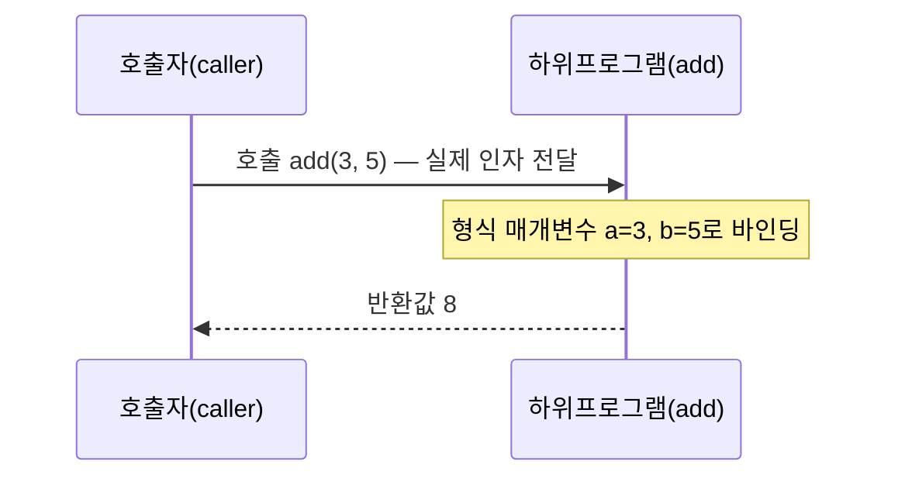
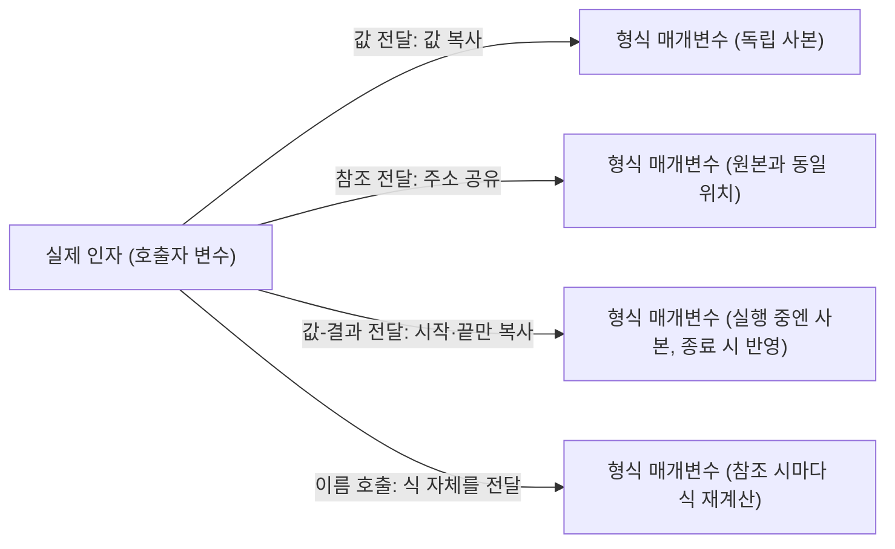

<Callout type="info">
  **이번 문서의 목표:** 이 문서를 다 읽으면 하위프로그램의 선언·정의·호출을 구분하고, 값 전달·참조 전달·값-결과 전달·이름 호출 방식이 같은 코드에서 왜 서로 다른 결과를 내는지 변수 값을 직접 추적해 설명할 수 있다.
</Callout>

## 왜 매개변수 전달 방식을 언어론에서 따로 다루는가

C나 Java만 배웠다면 "함수에 값을 넘기는 방법"은 하나뿐이라고 느꼈을 수 있다. 하지만 프로그래밍언어론(programming language concepts)에서는 **하위프로그램(subprogram, 함수·프로시저를 통칭하는 용어)에 인자를 넘기는 방식 자체가 언어 설계자가 선택하는 요소**라는 점이 핵심이다. 값 전달, 참조 전달, 값-결과 전달, 이름 호출은 저마다 "호출자의 변수가 하위프로그램 안에서 바뀔 수 있는가"에 대해 다른 답을 준다.

> **쉽게 말하면:** 매개변수 전달 방식은 "함수를 부를 때 원본 데이터를 넘길지, 데이터의 사본만 넘길지, 아니면 데이터가 있는 위치(주소)를 넘길지"를 정하는 규칙이다.

04편(제어 구조와 하위프로그램 개념 지도)에서 하위프로그램·매개변수·인자라는 용어를 처음 소개했다. 이 문서는 그 용어를 발판 삼아 **전달 방식의 구현 원리와 결과 차이**를 깊게 파고든다. 하위프로그램이 실제로 스택에서 어떻게 구현되는지(활성화 레코드)는 15편에서 다룬다.

## 하위프로그램의 선언·정의·호출 구조

### 용어 정리 — 선언과 정의는 다르다

| 용어 | 정의 |
|---|---|
| 선언(declaration) | 하위프로그램의 이름·매개변수 형·반환형만 컴파일러에 알리는 것(본문 없음 가능) |
| 정의(definition) | 하위프로그램의 실제 실행 코드(본문)를 작성하는 것 |
| 호출(call/invocation) | 정의된 하위프로그램을 실제로 실행시키는 문장 |
| 형식 매개변수(formal parameter, 가인자) | 하위프로그램을 정의할 때 괄호 안에 적는, 값을 받을 자리를 나타내는 변수 이름 |
| 실제 인자(actual argument, 실인자) | 하위프로그램을 호출할 때 실제로 넘기는 값·변수·식 |

```c
int add(int a, int b);              /* 선언: 이름, 매개변수 형, 반환형만 알림 */

int add(int a, int b) {             /* 정의: 실행 코드(본문) 포함 */
    return a + b;
}

int result = add(3, 5);             /* 호출: a에는 3, b에는 5가 대입되어 실행 */
```

여기서 `a`, `b`는 형식 매개변수이고, 호출 시 넘긴 `3`, `5`는 실제 인자다. C처럼 선언(프로토타입, prototype)과 정의를 분리하는 언어도 있고, Python처럼 정의가 곧 선언을 겸하는 언어도 있다.



**자주 틀리는 점**: "선언과 정의가 항상 별개의 문장"이라고 착각하지 않는 것이 중요하다. C에서도 `int add(int a, int b) { return a + b; }`처럼 선언 없이 바로 정의만 쓰면, 그 정의가 선언의 역할까지 겸한다. 다만 다른 함수보다 아래에 정의된 함수를 미리 호출하려면 별도의 선언(프로토타입)이 필요하다.

## 매개변수 전달 방식 — 값이 오가는 방향으로 분류

매개변수 전달 방식을 이해하는 가장 좋은 틀은 "**데이터가 호출자에서 하위프로그램으로만 흐르는가, 하위프로그램에서 호출자로도 흐르는가**"다.

| 분류 | 전달 방식 | 데이터 흐름 방향 |
|---|---|---|
| 입력 모드(in mode) | 값 전달(pass-by-value) | 호출자 → 하위프로그램 (한쪽 방향만) |
| 출력 모드(out mode) | 결과 전달(pass-by-result) | 하위프로그램 → 호출자 (한쪽 방향만) |
| 입출력 모드(inout mode) | 참조 전달(pass-by-reference), 값-결과 전달(pass-by-value-result) | 양방향 |
| 특수 방식 | 이름 호출(pass-by-name) | 호출될 때마다 다시 계산(지연 평가) |

### 값 전달(pass-by-value) — 사본만 넘긴다

값 전달은 실제 인자의 **값을 복사**해서 형식 매개변수에 대입한다. 하위프로그램 안에서 형식 매개변수를 바꿔도 **호출자의 원본 변수는 전혀 영향을 받지 않는다.**

```c
void increment(int x) {
    x = x + 1;
    printf("함수 안 x = %d\n", x);
}

int main() {
    int num = 10;
    increment(num);
    printf("함수 밖 num = %d\n", num);
    return 0;
}
```

```text
함수 안 x = 11
함수 밖 num = 10
```

**한 줄씩 실행 추적**

| 단계 | 위치 | num(호출자) | x(형식 매개변수) |
|---|---|---|---|
| 1 | `int num = 10;` | 10 | (아직 없음) |
| 2 | `increment(num)` 호출 — num의 값 10을 복사해 x에 대입 | 10 | 10 |
| 3 | `x = x + 1;` 실행 | 10 | 11 |
| 4 | 함수 종료, num은 원래 그대로 | 10 | (소멸) |

x는 num과 **완전히 별개의 저장 공간**이므로 x를 아무리 바꿔도 num은 10 그대로다. C의 기본 매개변수 전달 방식이 바로 이 값 전달이며, Java의 원시형(int, double 등) 매개변수도 마찬가지다.

> **자주 틀리는 점**: Java에서 "객체(object)를 매개변수로 넘기면 참조 전달이다"라고 잘못 아는 경우가 매우 많다. Java는 **항상 값 전달**이며, 다만 객체 변수에 들어 있는 값이 "객체를 가리키는 참조값(reference)"이기 때문에 그 참조값의 사본이 넘어가 **같은 객체를 함께 가리키게 되는 것**이다. 참조값 자체(어떤 객체를 가리킬지)를 함수 안에서 다른 객체로 바꿔치기해도 호출자의 변수는 원래 객체를 계속 가리킨다.

```java
static void reassign(int[] arr) {
    arr = new int[]{99, 99, 99};   // 참조값 자체를 새 배열로 바꿔치기
}
static void modify(int[] arr) {
    arr[0] = 99;                    // 참조가 가리키는 객체의 내용을 변경
}
public static void main(String[] args) {
    int[] data = {1, 2, 3};
    reassign(data);
    System.out.println(data[0]);    // 1
    modify(data);
    System.out.println(data[0]);    // 99
}
```

```text
1
99
```

`reassign`은 형식 매개변수 `arr`이 가리키는 대상 자체를 새 배열로 바꿨을 뿐이므로, 이는 **arr이라는 참조값 사본**에만 영향을 주고 `data`가 가리키는 원본 배열에는 아무 영향이 없다(그래서 첫 출력이 여전히 1). 반면 `modify`는 참조값은 그대로 두고 그 참조가 가리키는 **배열 내용물**을 바꿨으므로, `data`와 `arr`이 같은 배열을 가리키고 있어 원본에도 변화가 반영된다(그래서 두 번째 출력이 99).

### 참조 전달(pass-by-reference) — 원본 저장 위치를 공유한다

참조 전달은 실제 인자의 **값을 복사하는 대신, 그 값이 저장된 메모리 위치(주소) 자체를 형식 매개변수와 공유**한다. 따라서 형식 매개변수를 바꾸는 것이 곧 호출자의 원본 변수를 바꾸는 것과 같다.

```cpp
void increment(int &x) {   // C++의 참조 매개변수 문법: & 기호
    x = x + 1;
}

int main() {
    int num = 10;
    increment(num);
    std::cout << num << std::endl;
    return 0;
}
```

```text
11
```

**한 줄씩 실행 추적**: `increment(num)`을 호출하면 C++은 `num`의 값을 복사하지 않고, `num`이라는 저장 공간 자체를 `x`라는 별명(alias)으로 하나 더 만든다. `x`와 `num`은 **완전히 같은 메모리 위치**를 가리키므로 `x = x + 1;`은 곧 `num = num + 1;`과 동일한 효과를 낸다. 그래서 함수가 끝난 뒤 `num`은 11이 된다.

**언어별 참조 전달 지원**: Pascal은 `var` 키워드(`procedure increment(var x: integer)`)로, C++은 `&` 기호로 참조 전달을 지원한다. C와 Java는 참조 전달을 언어 차원에서 직접 지원하지 않으며, C는 포인터(pointer, 메모리 주소를 담는 변수)를 매개변수로 넘겨 비슷한 효과를 흉내 낸다.

```c
void increment(int *x) {   /* 포인터를 값으로 전달(값 전달) */
    *x = *x + 1;             /* 역참조(dereference)로 원본 위치의 값을 변경 */
}

int main() {
    int num = 10;
    increment(&num);         /* num의 주소를 값으로 넘김 */
    printf("%d\n", num);
    return 0;
}
```

```text
11
```

**자주 틀리는 점**: "C의 포인터 매개변수는 참조 전달이다"라고 단정하면 개념적으로 부정확하다. 정확히는 "**주소값을 값 전달로 넘긴 것**"이다. 포인터 변수 `x` 자체는 `num`의 주소를 담은 값의 사본이며, `x`를 다른 주소로 재대입해도 `num`이 가리키는 원본 변수의 주소는 바뀌지 않는다(단지 그 주소를 통해 값을 바꾸는 `*x = ...`는 원본 값을 바꾼다). 진짜 참조 전달(C++의 `&`)에서는 매개변수 자체가 원본과 완전히 같은 저장 공간의 별명이 되어 이런 구분이 아예 필요 없다.

### 값-결과 전달(pass-by-value-result) — 복사해서 넣고, 복사해서 되가져온다

값-결과 전달(copy-in copy-out이라고도 부른다)은 값 전달과 참조 전달을 절충한 방식이다. **호출 시점**에는 실제 인자의 값을 형식 매개변수로 복사해 넣고(copy-in), 하위프로그램이 끝나는 **시점**에는 형식 매개변수의 최종값을 다시 실제 인자 위치로 복사해 되돌린다(copy-out). 실행 도중에는 형식 매개변수와 실제 인자가 서로 다른 별개의 저장 공간이라는 점이 참조 전달과 다르다.

```text
값-결과 전달 의사코드 예시:

procedure swap_add(inout a, inout b)
    a = a + 10
    b = a
end procedure

x = 1
y = 2
swap_add(x, y)
```

이 예시를 한 줄씩 추적해 보자.

| 단계 | 실행 위치 | x(실제 인자) | y(실제 인자) | a(형식 매개변수) | b(형식 매개변수) |
|---|---|---|---|---|---|
| 1 | 호출 직전 | 1 | 2 | (없음) | (없음) |
| 2 | copy-in: x→a, y→b | 1 | 2 | 1 | 2 |
| 3 | `a = a + 10` 실행 | 1(아직 미반영) | 2(아직 미반영) | 11 | 2 |
| 4 | `b = a` 실행 | 1(아직 미반영) | 2(아직 미반영) | 11 | 11 |
| 5 | copy-out: a→x, b→y | 11 | 11 | (소멸) | (소멸) |

최종적으로 `x = 11`, `y = 11`이 된다. 만약 이 코드가 **참조 전달**이었다면 `a`와 `x`, `b`와 `y`가 실행 도중에도 계속 같은 저장 공간을 공유하므로 결과가 달라질 수 있다(예: 별칭 문제가 있는 경우). 값-결과 전달은 실행 도중에는 독립적인 사본으로 작동하다가 **끝날 때만** 결과를 반영한다는 점이 핵심 차이다.

> **자주 틀리는 점**: 값-결과 전달과 참조 전달은 별칭(aliasing, 서로 다른 이름이 같은 저장 공간을 가리키는 상황)이 없는 대부분의 경우 **같은 최종 결과**를 낸다. 두 방식의 차이가 드러나는 것은 **같은 변수를 두 개의 형식 매개변수 자리에 동시에 넘기거나, 전역 변수를 매개변수와 함께 건드리는 등 별칭이 생기는 상황**에서다. "항상 결과가 다르다"고 단정하면 틀린다.

### 이름 호출(pass-by-name) — 인자를 코드 조각처럼 넘긴다

이름 호출은 앞의 세 방식과 근본적으로 다르다. 실제 인자를 값이나 주소로 미리 계산해 넘기는 것이 아니라, **하위프로그램 안에서 형식 매개변수가 실제로 쓰일 때마다 실제 인자의 식(expression) 자체를 그 자리에 다시 대입해 계산**한다. 이는 Algol 60이 채택했던 방식으로, 현대 언어에서는 거의 쓰이지 않지만 시험에서 개념 문제로 자주 등장한다.

```text
이름 호출 의사코드 예시(Algol 60 스타일):

procedure p(name x)
    x = x + 1
end procedure

integer array a[1..10]
integer i
i = 1
p(a[i])
```

`p(a[i])`를 호출하면 형식 매개변수 `x`는 `a[i]`라는 **식 자체로 치환**된다. 즉 `x = x + 1`은 실행될 때마다 `a[i] = a[i] + 1`로 텍스트가 다시 치환되어 계산된다. 만약 `p`의 본문 안에서 `i`의 값 자체가 바뀐다면, `x`가 가리키는 배열 원소도 매번 달라진다 — 이것이 이름 호출의 악명 높은 부작용이다.

```text
procedure p(name x)
    i = i + 1
    x = 0
end procedure

i = 1
a[1] = 10
a[2] = 20
p(a[i])
```

이 코드를 한 줄씩 추적하면, `p` 안에서 먼저 `i = i + 1`이 실행되어 `i`가 2로 바뀐다. 그 다음 `x = 0`이 실행될 때 `x`는 **호출 시점의 `a[1]`이 아니라, 지금 이 순간 다시 계산한 `a[i]`, 즉 `a[2]`로 치환**된다. 결과적으로 `a[1]`은 그대로 10이고 `a[2]`가 0으로 바뀐다. 값 전달이나 참조 전달이었다면 `x`는 호출 시점에 `a[1]`로 고정되어 `a[1]`이 0이 되었을 것이다.

> **쉽게 말하면:** 이름 호출은 매개변수 자리에 "값"이 아니라 "그 값을 구하는 방법(식)"을 통째로 넘겨서, 필요할 때마다 그 방법을 다시 실행하는 방식이다.

**자주 틀리는 점**: 이름 호출을 "지연 평가(lazy evaluation)와 완전히 같다"고 오해하기 쉽지만, 지연 평가는 값이 필요한 시점까지 계산을 미루되 **한 번 계산하면 그 값을 재사용**(캐싱)하는 경우가 많은 반면(Haskell 등), 순수한 이름 호출은 형식 매개변수를 **참조할 때마다 매번 다시 식을 계산**한다는 점에서 차이가 있다.

## 매개변수 전달 방식 종합 비교

| 방식 | 데이터 흐름 | 실행 중 별개 저장공간? | 대표 언어 | 별칭 문제 | 성능 특성 |
|---|---|---|---|---|---|
| 값 전달(by-value) | 호출자→하위프로그램만 | 예(사본) | C, Java(모든 형), Pascal 기본값 | 없음(원본과 무관) | 큰 자료구조 복사 시 비용 증가 |
| 참조 전달(by-reference) | 양방향(실시간 공유) | 아니오(같은 위치 공유) | C++(&), Pascal(var), Fortran | 있음(별칭으로 예기치 못한 값 변경 가능) | 복사 비용 없음(주소만 전달) |
| 값-결과 전달(by-value-result) | 양방향(끝에만 반영) | 예(호출 중엔 사본) | Ada(in out 모드의 구현 방식 중 하나) | 별칭 상황에서만 참조 전달과 결과가 달라짐 | 복사 비용 있으나 지역성 확보 가능 |
| 이름 호출(by-name) | 호출마다 재계산 | 해당 없음(식 자체를 치환) | Algol 60 | 매우 심각(i가 바뀌면 대상 자체가 바뀜) | 매번 재계산이라 비용 큼, 현대 언어는 거의 미사용 |



**설계 관점의 정리**: 값 전달은 "안전하지만(원본 보호) 큰 데이터는 비효율적"이고, 참조 전달은 "효율적이지만(복사 없음) 별칭 문제로 코드를 읽기 어렵게 만들 위험"이 있다. 값-결과 전달은 이 둘을 절충하려 했지만 별칭 상황에서 참조 전달과 다른 결과를 낼 수 있어 오히려 예측을 어렵게 만든다는 비판을 받는다. 이런 trade-off(상충 관계) 판단이 07편에서 다룬 "언어 평가 기준(신뢰성 vs 효율성)"과 직접 연결된다.

## 핵심 정리

- 하위프로그램은 선언(이름·형만 알림)·정의(실행 코드 작성)·호출(실행)로 구분되며, 형식 매개변수는 정의에, 실제 인자는 호출에 등장한다.
- 값 전달은 사본만 넘기므로 원본이 보호되고, Java의 객체 매개변수도 "참조값 자체"가 값 전달되는 것이지 참조 전달이 아니다.
- 참조 전달(C++ `&`, Pascal `var`)은 실행 중 형식 매개변수와 실제 인자가 완전히 같은 저장 공간을 공유해 하위프로그램 안의 변경이 즉시 원본에 반영된다.
- 값-결과 전달은 호출 시점과 종료 시점에만 값을 복사하며, 별칭이 있을 때만 참조 전달과 다른 결과를 낼 수 있다.
- 이름 호출은 값이 아니라 식 자체를 넘겨 참조될 때마다 다시 계산하며, 참조하는 인덱스 변수가 하위프로그램 안에서 바뀌면 가리키는 대상 자체가 바뀌는 심각한 부작용이 있다.

## 마무리 복습

<Quiz
  questionNumber={1}
  question="하위프로그램의 '선언(declaration)'과 '정의(definition)'의 차이를 가장 정확히 설명한 것은?"
  options={['선언은 실제 인자를 넘기는 것이고 정의는 형식 매개변수를 만드는 것이다', '선언은 이름·매개변수 형·반환형만 컴파일러에 알리는 것이고, 정의는 실행 코드(본문)까지 작성하는 것이다', '선언과 정의는 완전히 같은 의미이며 언어마다 부르는 이름만 다르다', '정의는 호출 시에만 만들어지고 선언은 컴파일 이후에 사라진다']}
  correctAnswer={2}
  explanation="선언은 하위프로그램의 존재와 인터페이스(이름, 매개변수 형, 반환형)만 컴파일러에 알리는 것으로 본문이 없어도 되며, 정의는 실제로 실행될 코드(본문)를 포함한다. C의 함수 프로토타입이 선언의 대표적인 예다."
  optionExplanations={['실제 인자와 형식 매개변수는 호출과 정의에 등장하는 개념으로, 선언·정의의 구분과는 다른 축이다.', '정답. 인터페이스만 알리는 것이 선언, 실행 코드까지 있는 것이 정의다.', '같은 함수에 대해 선언과 정의가 별도로 존재할 수 있다는 점에서 완전히 같은 의미는 아니다.', '선언은 프로그램 실행 전, 즉 컴파일 시점에 존재하며 정의보다 먼저 등장하는 경우가 많다.']}
/>

<Quiz
  questionNumber={2}
  question={"다음 C 함수를 값 전달로 호출했을 때, 함수 실행 후 호출자의 원본 변수 num의 값은?\n\n```c\nvoid f(int x) {\n  x = x * 2;\n}\n\nint num = 5;\nf(num);\n```"}
  options={['10', '5', '0', '컴파일 오류']}
  correctAnswer={2}
  explanation="값 전달은 실제 인자의 값을 복사해 형식 매개변수에 대입하므로, 함수 안에서 형식 매개변수 x를 바꿔도 호출자의 원본 변수 num에는 전혀 영향을 주지 않는다. 따라서 num은 그대로 5다."
  optionExplanations={['x가 10이 되는 것은 맞지만, x와 num은 값 전달에서 서로 독립된 저장 공간이므로 num까지 10이 되지는 않는다.', '정답. 값 전달에서는 형식 매개변수의 변경이 실제 인자에 영향을 주지 않는다.', 'x에 어떤 값이 대입되든 원본 num은 초기화된 5에서 변하지 않는다.', 'C에서 정상적으로 컴파일되는 값 전달 코드이며 오류가 발생하지 않는다.']}
/>

<Quiz
  questionNumber={3}
  question="Java에서 배열(객체)을 매개변수로 넘겼을 때의 동작에 대한 설명으로 옳은 것은?"
  options={['Java는 객체를 항상 참조 전달로 넘기므로 형식 매개변수를 다른 객체로 재대입하면 호출자의 원본 참조도 그 객체를 가리키게 바뀐다', 'Java는 항상 값 전달이며, 다만 넘어가는 값이 객체를 가리키는 참조값이므로 그 참조가 가리키는 객체의 내용을 바꾸면 원본에도 반영된다', 'Java는 기본형과 객체 모두 참조 전달만 지원한다', 'Java에서 배열을 매개변수로 넘기면 항상 새로운 배열이 자동으로 복사되어 원본과 완전히 분리된다']}
  correctAnswer={2}
  explanation="Java는 예외 없이 값 전달이다. 객체 변수에는 객체를 가리키는 참조값이 들어 있고, 그 참조값의 사본이 매개변수로 넘어간다. 따라서 참조가 가리키는 객체의 내용을 바꾸면(예: 배열 원소 대입) 원본 객체에도 반영되지만, 형식 매개변수 자체를 다른 객체로 재대입해도 호출자의 참조는 원래 객체를 계속 가리킨다."
  optionExplanations={['이는 참조 전달의 정의다. Java에서 형식 매개변수를 새 객체로 재대입해도 호출자의 원본 참조는 바뀌지 않으므로 참조 전달이 아니다.', '정답. Java는 참조값을 값 전달하는 방식으로, 객체 내용 변경은 반영되지만 참조 자체의 재대입은 반영되지 않는다.', 'Java의 int, double 같은 원시형은 값 자체가 값 전달되며 참조 개념이 없다.', '배열이 자동으로 복사되지 않으며, 같은 배열 객체를 참조값으로 공유하기 때문에 배열 내용 변경이 원본에 반영되는 것이다.']}
/>

<Quiz
  questionNumber={4}
  question="C++의 참조 매개변수(&)를 사용한 다음 함수의 실행 결과는? 코드: inc(참조 매개변수 x)는 x에 5를 더한다. num을 3으로 초기화한 뒤 inc(num)을 호출하고 num을 출력한다."
  options={['3', '5', '8', '컴파일 오류가 발생한다']}
  correctAnswer={3}
  explanation="C++의 & 기호는 참조 전달을 의미하며, 형식 매개변수 x는 실제 인자 num과 완전히 같은 메모리 위치를 가리키는 별명이 된다. 따라서 x = x + 5는 곧 num = num + 5와 동일하므로, 3에서 8이 된다."
  optionExplanations={['이는 값 전달이었다면 원본이 보호되어 나올 값이지만, 이 코드는 참조 전달이므로 원본이 함께 변경된다.', '변경되는 양(5)만 반영하고 원래 값(3)을 더하지 않은 값으로, 계산 자체가 누락된 결과다.', '정답. 참조 전달이므로 x와 num이 같은 저장 공간을 공유해 3 + 5 = 8이 num에 그대로 반영된다.', '참조 매개변수 문법(&)은 C++에서 정상적으로 컴파일되는 문법이다.']}
/>

<Quiz
  questionNumber={5}
  question="값-결과 전달(pass-by-value-result)이 참조 전달(pass-by-reference)과 다른 결과를 낼 수 있는 상황으로 가장 적절한 것은?"
  options={['하위프로그램 안에서 형식 매개변수를 전혀 사용하지 않을 때', '실제 인자로 리터럴 상수(예: 5)만 넘길 때', '같은 변수(또는 그 변수를 참조하는 전역 변수 등 별칭 관계)를 두 개 이상의 매개변수 자리에 동시에 넘기는 등 별칭이 발생할 때', '하위프로그램의 반환형이 void일 때']}
  correctAnswer={3}
  explanation="값-결과 전달은 실행 도중 형식 매개변수와 실제 인자가 별개의 저장 공간이었다가 종료 시점에만 결과를 복사해 반영하는 반면, 참조 전달은 실행 내내 같은 저장 공간을 공유한다. 이 차이는 별칭(같은 저장 공간을 가리키는 서로 다른 이름)이 없는 평범한 경우에는 드러나지 않고, 별칭이 발생하는 상황에서만 두 방식의 최종 결과가 달라질 수 있다."
  optionExplanations={['형식 매개변수를 사용하지 않으면 애초에 값의 변경이 없으므로 두 방식의 차이가 드러날 수 없다.', '리터럴 상수는 애초에 매개변수로 값을 되돌려 받을 원본 변수가 없으므로 두 방식의 차이를 논할 상황이 아니다.', '정답. 별칭이 발생하는 상황에서만 값-결과 전달과 참조 전달의 결과가 달라질 수 있다.', '반환형은 함수의 결과값 반환과 관련된 것으로 매개변수 전달 방식과는 별개의 개념이다.']}
/>

<Quiz
  questionNumber={6}
  question="이름 호출(pass-by-name)에 대한 설명으로 옳은 것은?"
  options={['호출 시점에 실제 인자의 값을 미리 계산해 복사한 뒤 넘긴다', '형식 매개변수가 참조될 때마다 실제 인자의 식(expression) 자체를 그 자리에 대입해 다시 계산한다', '현대 주요 언어(C, Java, Python)에서 매개변수 전달의 기본 방식으로 널리 쓰인다', '값이 아니라 항상 상수만 전달할 수 있는 방식이다']}
  correctAnswer={2}
  explanation="이름 호출은 실제 인자를 값이나 주소로 미리 계산해 고정하는 것이 아니라, 형식 매개변수가 하위프로그램 본문 안에서 실제로 쓰일 때마다 그 자리에 실제 인자의 식 자체를 다시 대입해 매번 새로 계산한다. Algol 60이 채택했던 방식으로, 참조하는 인덱스 변수가 중간에 바뀌면 가리키는 대상 자체가 달라지는 부작용이 있다."
  optionExplanations={['이는 값 전달의 동작 방식이다. 이름 호출은 값을 미리 계산해 고정하지 않는다.', '정답. 참조 시점마다 식을 다시 계산해 대입하는 것이 이름 호출의 핵심 동작이다.', '이름 호출은 Algol 60에서 채택되었던 방식이며, 예측하기 어려운 부작용 때문에 현대 주요 언어는 거의 사용하지 않는다.', '이름 호출은 배열 원소(a[i])처럼 변수를 포함한 식도 전달할 수 있으며 상수로 제한되지 않는다.']}
/>

## 참고 자료

- [Pearson - Sebesta, Concepts of Programming Languages (Global Edition) 소개 페이지](https://www.pearson.com/en-us/subject-catalog/p/concepts-of-programming-languages-global-edition/P200000003438)
- [국가평생교육진흥원 독학학위제](https://bdes.nile.or.kr)
