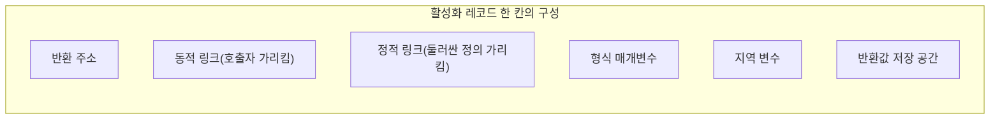
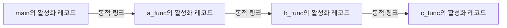
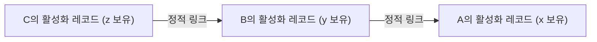

<Callout type="info">
  **이번 문서의 목표:** 이 문서를 다 읽으면 하위프로그램이 호출될 때마다 실행 스택에 활성화 레코드가 어떻게 쌓이고 사라지는지 단계별로 그릴 수 있고, 정적 체인과 동적 체인의 차이로 중첩 하위프로그램의 비지역 변수 접근을 정확히 추적할 수 있다.
</Callout>

## 왜 하위프로그램의 "구현"까지 알아야 하는가

14편에서 매개변수 전달 방식이 데이터의 흐름 방향을 정하는 규칙이라는 것을 배웠다. 이 문서는 한 단계 더 들어가 **하위프로그램이 호출되고 반환될 때 컴퓨터 메모리 안에서 실제로 무슨 일이 일어나는가**를 다룬다. 함수가 호출될 때마다 지역 변수는 어디에 저장되는가? 재귀 호출이 수천 번 일어나도 각 호출의 변수가 서로 섞이지 않는 이유는 무엇인가? 중첩된 함수 안에서 바깥 함수의 변수를 어떻게 찾아가는가? 이 질문들에 답하는 것이 **활성화 레코드(activation record)** 개념이다.

> **쉽게 말하면:** 활성화 레코드는 "하위프로그램이 한 번 호출될 때마다 그 실행에 필요한 정보를 담아 만드는 메모리상의 작업 카드"다.

## 실행 스택과 활성화 레코드의 구조

### 왜 스택(stack)을 쓰는가

하위프로그램 호출은 **가장 최근에 호출된 것이 가장 먼저 끝난다**는 성질을 가진다. `main`이 `f`를 부르고, `f`가 `g`를 부르면, `g`가 끝나야 `f`로 돌아오고, `f`가 끝나야 `main`으로 돌아온다. 이 "나중에 들어온 것이 먼저 나간다(LIFO, Last In First Out)"는 성질은 스택(stack, 한쪽 끝에서만 넣고 빼는 자료구조) 자료구조의 동작 방식과 정확히 일치한다. 그래서 대부분의 언어 구현은 하위프로그램 호출 정보를 **실행 스택(runtime stack, 호출 스택이라고도 함)** 위에 쌓는다.

### 활성화 레코드에 담기는 것

활성화 레코드(활성 레코드, 활성화 기록이라고도 부른다. 하위프로그램이 한 번 호출되어 실행 중인 상태를 나타내는 단위이므로 "활성화(activation)"라는 이름이 붙었다)는 하위프로그램이 호출될 때마다 스택 위에 새로 만들어지는 메모리 블록이다. 언어와 구현에 따라 세부 구성은 다르지만, 전형적으로 다음 항목을 포함한다.

| 구성 요소 | 역할 |
|---|---|
| 반환 주소(return address) | 하위프로그램이 끝난 뒤 실행을 이어갈 호출자 코드의 위치 |
| 형식 매개변수(formal parameters) | 호출 시 전달받은 인자를 저장하는 공간 |
| 지역 변수(local variables) | 하위프로그램 안에서 선언한 변수들 |
| 동적 링크(dynamic link, 제어 링크control link라고도 함) | 자신을 호출한 쪽(호출자)의 활성화 레코드를 가리키는 포인터 |
| 정적 링크(static link, 접근 링크access link라고도 함) | 자신을 소스 코드상에서 감싸고 있는(중첩 정의한) 하위프로그램의 활성화 레코드를 가리키는 포인터 |
| 반환값 저장 공간 | 함수라면 계산 결과를 담아 호출자에게 돌려줄 공간 |

동적 링크와 정적 링크가 이 문서의 핵심 주제이며, 뒤에서 각각 자세히 다룬다.



## 재귀 호출과 실행 스택 — 단계별 추적

재귀 함수는 활성화 레코드가 왜 스택 방식으로 관리되어야 하는지를 가장 잘 보여준다. 팩토리얼(계승, factorial: n부터 1까지 모든 정수를 곱한 값)을 재귀로 계산하는 함수를 보자.

```c
int factorial(int n) {
    if (n <= 1)
        return 1;
    else
        return n * factorial(n - 1);
}

int result = factorial(3);
```

**한 줄씩 실행 추적 — 호출이 깊어지는 과정**

| 단계 | 호출 | n | 실행 스택 상태(아래가 먼저 쌓인 것) |
|---|---|---|---|
| 1 | `factorial(3)` 호출 | 3 | [factorial(3): n=3] |
| 2 | `n <= 1`이 거짓 → `factorial(2)` 호출 | 2 | [factorial(3): n=3] → [factorial(2): n=2] |
| 3 | `n <= 1`이 거짓 → `factorial(1)` 호출 | 1 | [factorial(3)] → [factorial(2)] → [factorial(1): n=1] |
| 4 | `n <= 1`이 참 → `1` 반환, factorial(1)의 활성화 레코드 제거 | - | [factorial(3)] → [factorial(2)] |
| 5 | factorial(2)가 `2 * 1 = 2` 계산 후 반환, 활성화 레코드 제거 | - | [factorial(3)] |
| 6 | factorial(3)이 `3 * 2 = 6` 계산 후 반환, 활성화 레코드 제거 | - | (비어 있음) |

각 호출은 **자신만의 독립된 활성화 레코드**를 가지므로 n=3인 호출의 n과 n=1인 호출의 n은 이름은 같아도 서로 다른 메모리 위치에 저장된 별개의 변수다. 스택의 맨 위(가장 최근에 쌓인 것)부터 하나씩 제거(pop)되며 반환되는 이 순서가 바로 LIFO다. 만약 활성화 레코드가 스택이 아니라 하나만 존재했다면, `factorial(1)`의 n=1이 `factorial(3)`의 n=3을 덮어써서 재귀가 아예 불가능했을 것이다.

> **자주 틀리는 점**: "재귀 함수는 특별한 메모리 구조가 필요하다"고 생각하기 쉽지만, 사실 재귀 호출도 **일반 함수 호출과 완전히 같은 방식**으로 활성화 레코드를 스택에 쌓을 뿐이다. 재귀가 특별해 보이는 이유는 단지 같은 이름의 함수가 스스로를 호출해 여러 개의 활성화 레코드가 동시에 스택에 쌓인다는 점뿐이다.

## 동적 링크(dynamic link) — "누가 나를 불렀는가"

동적 링크는 현재 활성화 레코드가 **호출자(caller)의 활성화 레코드**를 가리키는 포인터다. 하위프로그램이 끝나 반환할 때, 실행 흐름과 반환 주소는 이 동적 링크를 따라 되돌아간다. 동적 링크가 만드는 연결의 사슬을 **동적 체인(dynamic chain)** 이라 부른다.

동적 체인은 프로그램이 **실제로 호출된 순서**를 나타낸다. 소스 코드에서 어디에 정의되어 있는지와 무관하게, "지금 이 순간 실행 중인 함수를 누가 불렀는가"만을 따라간다.

```c
void c_func() { /* ... */ }
void b_func() { c_func(); }
void a_func() { b_func(); }
int main() { a_func(); return 0; }
```

`main`이 `a_func`을, `a_func`이 `b_func`을, `b_func`이 `c_func`을 호출한 순간의 동적 체인은 다음과 같다.



화살표는 "동적 링크가 가리키는 방향"이며, `c_func`의 활성화 레코드에 있는 동적 링크를 따라가면 `b_func`으로, 거기서 다시 따라가면 `a_func`으로, `main`까지 거슬러 올라갈 수 있다. `c_func`이 끝나면 이 동적 링크가 가리키는 `b_func`의 반환 주소로 돌아간다.

## 정적 링크(static link) — "나는 소스 코드에서 누구 안에 있는가"

정적 링크는 동적 링크와 전혀 다른 질문에 답한다: **"이 하위프로그램은 소스 코드상 어떤 하위프로그램 안에 중첩 정의되어 있는가?"** 이 질문은 Pascal, Ada처럼 **중첩 하위프로그램**(nested subprogram, 하위프로그램 안에 또 다른 하위프로그램을 정의할 수 있는 언어)을 지원하는 언어에서 특히 중요하다. C, Java는 중첩 하위프로그램(지역 함수)을 기본적으로 지원하지 않으므로 정적 링크 개념이 상대적으로 덜 중요하지만, 시험에서는 Pascal류 의사코드로 자주 출제된다.

정적 링크가 만드는 연결의 사슬을 **정적 체인(static chain)** 이라 하며, 이는 소스 코드에 적힌 **렉시컬(lexical, 어휘적) 중첩 구조**를 그대로 반영한다. 정적 스코프(static scope, 소스 코드의 중첩 위치로 변수의 유효 범위가 정해지는 규칙 — 9편 참고)를 쓰는 언어에서, 하위프로그램이 자신을 둘러싼 바깥 하위프로그램의 **비지역 변수**(non-local variable, 지역 변수도 전역 변수도 아닌, 자신을 둘러싼 중간 단계 하위프로그램에 속한 변수)를 찾아갈 때 이 정적 체인을 따라간다.

```text
procedure A
    x : integer

    procedure B
        y : integer

        procedure C
            z : integer
        begin
            z := x + y     { x는 A의 지역변수, y는 B의 지역변수 — 둘 다 C 입장에서 비지역 변수 }
        end C

    begin
        C()
    end B

begin
    B()
end A
```

이 의사코드에서 `C`는 소스 코드상 `B` 안에 중첩되어 있고, `B`는 `A` 안에 중첩되어 있다. `C`가 실행되어 `z := x + y`를 계산할 때, `x`와 `y`는 `C`의 지역 변수가 아니므로 정적 체인을 따라 바깥으로 찾아 나가야 한다.



**비지역 변수 접근 절차**: `C`가 `y`를 찾을 때는 정적 링크를 **한 칸** 따라가 `B`의 활성화 레코드에서 찾고, `x`를 찾을 때는 정적 링크를 **두 칸** 따라가 `A`의 활성화 레코드에서 찾는다. 몇 칸을 따라가야 하는지(중첩 깊이의 차이)는 컴파일 시점에 이미 정해져 있으므로, 이 정보는 컴파일러가 계산해 코드에 미리 심어 둔다.

> **쉽게 말하면:** 정적 링크는 "내가 태어난 곳(정의된 위치)"을 가리키고, 동적 링크는 "누가 나를 불렀는가(호출한 곳)"를 가리킨다. 이 둘은 대부분 다른 곳을 가리킨다.

## 정적 체인과 동적 체인이 달라지는 상황 — 핵심 함정

정적 체인과 동적 체인이 항상 일치한다면 굳이 두 개로 나눌 이유가 없다. 이 둘이 **달라지는 상황**이 독학사 시험의 핵심 함정이다. 다음 의사코드를 보자.

```text
procedure A
    x : integer

    procedure B
    begin
        write(x)     { B는 A 안에 정의되어 있으므로 A의 x에 접근 }
    end B

    procedure D
        x : integer
    begin
        x := 100
        B()          { D가 B를 호출 }
    end D

begin
    x := 1
    D()
end A
```

`B`는 소스 코드상 `A` 바로 안에 정의되어 있다. 그런데 `B`를 실제로 **호출한 것**은 `D`다. `D`도 `A` 안에 정의되어 있지만(형제 관계), `D`가 `B`를 호출했다고 해서 `B`가 `D`의 지역 변수 `x`(값 100)에 접근하게 되는 것은 아니다.

**한 줄씩 실행 추적**

| 단계 | 실행 위치 | 동적 체인(방금 누가 호출?) | 정적 체인(소스 코드상 누구 안에?) |
|---|---|---|---|
| 1 | `A`에서 `x := 1` | - | - |
| 2 | `A`가 `D()` 호출 | D의 동적 링크 → A | D는 A 안에 정의됨 → D의 정적 링크 → A |
| 3 | `D`에서 `x := 100`(D의 지역 변수 x) | - | - |
| 4 | `D`가 `B()` 호출 | B의 동적 링크 → D(방금 호출한 게 D이므로) | B는 A 안에 정의됨(D 안이 아님!) → B의 정적 링크 → A |
| 5 | `B`가 `write(x)` 실행 — 정적 링크를 따라 A의 x를 찾음 | (참고용) | A의 x = 1을 찾아 출력 |

```text
1
```

`B`의 동적 링크는 방금 자신을 호출한 `D`를 가리키지만, `B`의 **정적 링크는 D가 아니라 A**를 가리킨다. 왜냐하면 `B`는 소스 코드에서 `D` 안이 아니라 `A` 안에 정의되었기 때문이다. 그래서 `write(x)`는 `D`의 `x`(값 100)가 아니라 `A`의 `x`(값 1)를 출력한다.

> **자주 틀리는 점**: "방금 누가 이 함수를 호출했으니 그 함수의 지역 변수에 접근할 것"이라고 생각하면 틀린다. **비지역 변수 접근은 언제나 정적 체인(소스 코드의 중첩 구조)을 따르지, 동적 체인(실제 호출 순서)을 따르지 않는다.** 이것이 정적 스코프 언어의 정의이기도 하다(9편에서 정적 스코프 vs 동적 스코프를 다룬 것과 정확히 연결된다). 만약 언어가 **동적 스코프**를 쓴다면 정반대로, 이 예시에서 `B`는 실제로 자신을 호출한 `D`의 `x`(값 100)를 찾게 되어 출력이 `100`으로 바뀐다.

## 정적 체인과 동적 체인 비교 정리

| 구분 | 정적 링크(static link) | 동적 링크(dynamic link) |
|---|---|---|
| 가리키는 대상 | 소스 코드상 자신을 감싸고 있는(중첩 정의한) 하위프로그램의 활성화 레코드 | 자신을 실제로 호출한 하위프로그램의 활성화 레코드 |
| 결정 시점 | 컴파일 시점(소스 코드 구조로 정해짐) | 실행 시점(호출 순서로 정해짐) |
| 사슬의 이름 | 정적 체인(static chain) | 동적 체인(dynamic chain) |
| 쓰이는 목적 | 비지역 변수 접근(정적 스코프 규칙 구현) | 하위프로그램 반환(어디로 돌아갈지 결정) |
| 두 체인이 다른 경우 | 어떤 하위프로그램을 자신의 형제(sibling) 하위프로그램이나 그 하위프로그램이 호출할 때 | 위와 동일한 상황에서 대비되어 나타남 |

## 핵심 정리

- 하위프로그램 호출은 LIFO 성질을 가지므로 실행 스택 위에 호출마다 활성화 레코드를 쌓아 관리하며, 반환 주소·매개변수·지역 변수·동적 링크·정적 링크를 담는다.
- 재귀 호출도 특별한 구조가 필요한 게 아니라, 같은 함수가 스스로를 부를 때마다 독립적인 활성화 레코드가 스택에 새로 쌓이는 것일 뿐이다.
- 동적 링크는 "누가 나를 호출했는가"(실행 순서), 정적 링크는 "나는 소스 코드에서 누구 안에 정의되었는가"(중첩 구조)를 가리키며 이 둘은 자주 일치하지 않는다.
- 정적 스코프 언어에서 비지역 변수 접근은 언제나 정적 체인을 따르며, 실제로 누가 호출했는지(동적 체인)와는 무관하다.
- 정적 체인과 동적 체인이 달라지는 전형적 상황은 어떤 하위프로그램을 그 하위프로그램의 형제 하위프로그램이 호출하는 경우다.

## 마무리 복습

<Quiz
  questionNumber={1}
  question="하위프로그램 호출 시 활성화 레코드(activation record)를 실행 스택(runtime stack)에 관리하는 근본적인 이유로 가장 적절한 것은?"
  options={['활성화 레코드는 크기가 항상 고정되어 있어서 배열로만 관리할 수 있기 때문이다', '하위프로그램 호출은 가장 최근에 호출된 것이 가장 먼저 반환된다는 LIFO 성질을 가지기 때문이다', '스택은 임의 위치 접근이 배열보다 빠르기 때문이다', '전역 변수를 저장할 공간이 부족하기 때문이다']}
  correctAnswer={2}
  explanation="하위프로그램 호출은 나중에 호출된 것이 먼저 끝나고 반환되는 LIFO(Last In First Out) 성질을 가진다. 이 성질이 스택 자료구조의 삽입·삭제 동작과 정확히 일치하므로 실행 스택 위에 활성화 레코드를 쌓아 관리한다."
  optionExplanations={['활성화 레코드의 크기는 지역 변수의 개수 등에 따라 하위프로그램마다 다를 수 있으며, 고정 크기가 스택을 쓰는 이유는 아니다.', '정답. LIFO 성질이 스택 구조를 쓰는 근본적인 이유다.', '임의 위치 접근 성능은 활성화 레코드 관리와 직접 관련이 없으며, 스택은 오히려 양 끝(top)에서의 접근만 지원한다.', '전역 변수는 활성화 레코드가 아닌 별도의 정적 메모리 영역에 저장되는 것이 일반적이다.']}
/>

<Quiz
  questionNumber={2}
  question="재귀 함수 factorial(3)이 factorial(2), factorial(1)을 차례로 호출할 때, 각 호출의 지역 변수 n이 서로 값을 덮어쓰지 않고 독립적으로 유지되는 이유는?"
  options={['컴파일러가 n이라는 이름을 호출마다 자동으로 다른 이름으로 바꿔주기 때문이다', '각 호출마다 독립된 활성화 레코드가 스택에 새로 만들어져 그 안에 각자의 n을 저장하기 때문이다', 'n은 전역 변수이므로 애초에 하나의 값만 존재하기 때문이다', '재귀 함수는 내부적으로 배열을 사용해 모든 n 값을 한 번에 저장하기 때문이다']}
  correctAnswer={2}
  explanation="factorial이 재귀 호출될 때마다 새로운 활성화 레코드가 실행 스택에 쌓이고, 그 활성화 레코드 안에 그 호출만의 형식 매개변수 n이 독립적으로 저장된다. 따라서 n=3인 호출의 n과 n=1인 호출의 n은 이름은 같아도 서로 다른 메모리 위치에 존재한다."
  optionExplanations={['이름을 바꾸는 것이 아니라, 같은 이름의 변수가 서로 다른 메모리 위치(활성화 레코드)에 저장되는 것이다.', '정답. 호출마다 독립된 활성화 레코드가 만들어지는 것이 핵심 원리다.', 'n은 factorial 함수의 지역 변수(형식 매개변수)이지 전역 변수가 아니다.', '배열을 명시적으로 사용하는 것이 아니라 실행 스택이라는 구조 자체가 이 역할을 담당한다.']}
/>

<Quiz
  questionNumber={3}
  question="활성화 레코드 안의 동적 링크(dynamic link)가 가리키는 대상은?"
  options={['소스 코드상 자신을 중첩해서 감싸고 있는 하위프로그램의 활성화 레코드', '자신을 실제로 호출한 하위프로그램(호출자)의 활성화 레코드', '자신이 앞으로 호출할 하위프로그램의 활성화 레코드', '프로그램에서 가장 먼저 실행된 main의 활성화 레코드']}
  correctAnswer={2}
  explanation="동적 링크는 현재 활성화 레코드를 만든 호출, 즉 자신을 실제로 호출한 호출자의 활성화 레코드를 가리킨다. 하위프로그램이 반환할 때 이 동적 링크를 따라 실행 흐름이 호출자에게 되돌아간다."
  optionExplanations={['이는 정적 링크에 대한 설명이다. 정적 링크가 소스 코드상 중첩 구조를 가리킨다.', '정답. 동적 링크는 실제로 자신을 호출한 호출자를 가리킨다.', '동적 링크는 이미 일어난 호출(과거)을 가리키는 것이지, 앞으로 일어날 호출(미래)을 가리키지 않는다.', 'main의 활성화 레코드를 직접 가리키는 것이 아니라, 동적 체인을 여러 번 따라가야 최종적으로 main에 도달할 수 있다.']}
/>

<Quiz
  questionNumber={4}
  question="정적 스코프(static scope)를 사용하는 언어에서, 하위프로그램이 자신의 비지역 변수(non-local variable)를 찾을 때 따라가는 것은?"
  options={['동적 체인 — 자신을 실제로 호출한 하위프로그램들의 사슬', '정적 체인 — 소스 코드상 자신을 중첩해서 감싸고 있는 하위프로그램들의 사슬', '반환 주소가 가리키는 코드 위치', '해당 시점의 실행 스택 최상단(top)']}
  correctAnswer={2}
  explanation="정적 스코프 언어에서는 비지역 변수의 유효 범위가 소스 코드의 중첩 구조로 결정되므로, 이를 실행 시점에 찾아가려면 정적 체인(소스 코드상 자신을 감싸고 있는 하위프로그램들의 사슬)을 따라가야 한다. 실제 호출 순서(동적 체인)와는 무관하다."
  optionExplanations={['동적 체인은 실제 호출 순서를 나타내며, 정적 스코프 언어의 비지역 변수 접근과는 무관하다.', '정답. 정적 스코프는 정적 체인을 따라 비지역 변수를 찾는다.', '반환 주소는 하위프로그램이 끝난 뒤 돌아갈 코드 위치이며 변수 탐색과는 무관하다.', '실행 스택의 최상단은 현재 실행 중인 하위프로그램 자신의 활성화 레코드일 뿐, 비지역 변수를 찾는 경로가 아니다.']}
/>

<Quiz
  questionNumber={5}
  question="본문의 A-B-D 예시(B는 A 안에 정의, D도 A 안에 정의, D가 B를 호출)에서, 정적 스코프 언어일 때 B의 write(x)가 출력하는 값은? (A의 x=1, D의 x=100)"
  options={['1 — B의 정적 링크가 D가 아니라 A를 가리키므로 A의 x를 찾는다', '100 — B를 호출한 것이 D이므로 D의 x를 찾는다', 'B와 D의 x를 더한 101이 출력된다', '컴파일 오류가 발생해 출력되지 않는다']}
  correctAnswer={1}
  explanation="B는 소스 코드상 D 안이 아니라 A 안에 정의되어 있으므로, B의 정적 링크는 D가 아니라 A를 가리킨다. 정적 스코프 언어는 비지역 변수를 정적 체인으로 찾으므로, D가 실제로 B를 호출했다는 사실(동적 체인)과 무관하게 A의 x(값 1)를 찾아 출력한다."
  optionExplanations={['정답. B의 정적 링크는 자신이 정의된 위치인 A를 가리키므로 A의 x=1을 찾는다.', '이는 동적 스코프였을 때의 결과다. 정적 스코프에서는 실제 호출자(D)가 아니라 정의 위치(A)를 따라간다.', '변수를 더하는 동작은 이 코드에 존재하지 않으며, 정적 스코프는 두 값을 합치지 않고 하나의 위치만 선택해 찾는다.', 'B, D 모두 A 안에 올바르게 중첩 정의되어 있으므로 정상적으로 컴파일되고 실행된다.']}
/>

<Quiz
  questionNumber={6}
  question="정적 체인(static chain)과 동적 체인(dynamic chain)이 서로 다른 하위프로그램을 가리키게 되는 전형적인 상황은?"
  options={['하위프로그램이 자기 자신을 재귀적으로 호출할 때', '어떤 하위프로그램을 소스 코드상 형제 관계인 다른 하위프로그램이 호출할 때', '프로그램이 시작되어 main이 처음 실행될 때', '하위프로그램이 매개변수를 전혀 받지 않을 때']}
  correctAnswer={2}
  explanation="정적 체인은 소스 코드의 중첩 구조를, 동적 체인은 실제 호출 순서를 따른다. 두 체인이 갈라지는 대표적 상황은 어떤 하위프로그램(예: B)을 그와 형제 관계인 다른 하위프로그램(예: D, 둘 다 A 안에 정의됨)이 호출하는 경우로, 이때 B의 동적 링크는 D를 가리키지만 정적 링크는 D가 아닌 A를 가리킨다."
  optionExplanations={['재귀 호출에서는 호출자와 정의 위치가 사실상 자기 자신으로 같은 함수이므로 정적 체인과 동적 체인이 갈라지는 대표적 상황이 아니다.', '정답. 형제 하위프로그램 간의 호출에서 정적 체인과 동적 체인이 서로 다른 대상을 가리키게 된다.', 'main이 처음 실행될 때는 아직 다른 하위프로그램 호출이 얽혀 있지 않아 두 체인의 차이가 드러나지 않는다.', '매개변수의 유무는 정적·동적 체인이 가리키는 대상과는 무관한 조건이다.']}
/>

## 참고 자료

- [Pearson - Sebesta, Concepts of Programming Languages (Global Edition) 소개 페이지](https://www.pearson.com/en-us/subject-catalog/p/concepts-of-programming-languages-global-edition/P200000003438)
- [국가평생교육진흥원 독학학위제](https://bdes.nile.or.kr)
