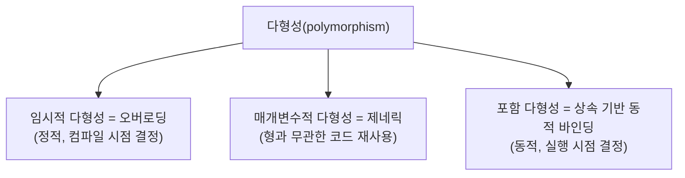

<Callout type="info">
  **이번 문서의 목표:** 이 문서를 다 읽으면 오버로딩과 다형성을 시그니처 기준으로 명확히 구분하고, 제네릭 하위프로그램이 형 안전성을 어떻게 확보하는지 설명하며, 컴파일러가 오버로딩된 함수 중 하나를 고르는 이름 해석 절차를 코드로 추적할 수 있다.
</Callout>

## 왜 오버로딩과 다형성을 같이, 그러나 구분해서 다루는가

"같은 이름의 함수를 여러 개 만들 수 있다"는 것과 "같은 코드로 여러 형(type)을 처리할 수 있다"는 것은 언뜻 비슷해 보이지만 프로그래밍언어론(programming language concepts)에서는 **전혀 다른 메커니즘**이다. 전자는 오버로딩(overloading), 후자의 상당 부분은 다형성(polymorphism)과 제네릭(generic)이 담당한다. 두 개념을 섞어서 외우면 "무엇이 무엇과 다른가"를 묻는 독학사 시험의 전형적 함정에 걸린다.

> **쉽게 말하면:** 오버로딩은 "이름은 같지만 서로 다른, 완전히 별개의 코드 여러 개를 준비해 두고 상황에 맞게 골라 쓰는 것"이고, 제네릭은 "형만 다를 뿐 로직이 완전히 같은 코드를 딱 한 번만 작성해 여러 형에 재사용하는 것"이다.

07편(언어 평가 기준과 설계 원칙)에서 다룬 orthogonality(직교성, 언어의 기능들이 서로 예외 없이 자유롭게 조합되는 성질)와 10편(자료형과 형 시스템)에서 다룬 정적/동적 형 검사 개념이 이 문서의 바탕이 된다.

## 오버로딩(overloading) — 이름은 하나, 코드는 여러 개

### 정의와 핵심 조건 — 시그니처가 달라야 한다

오버로딩된 하위프로그램(overloaded subprogram)은 **같은 이름을 가지지만 시그니처(signature, 매개변수의 개수·형·순서로 구성되는 하위프로그램의 "지문")가 서로 다른 여러 개의 독립된 하위프로그램**이다. 컴파일러(또는 인터프리터)는 호출 시 넘어온 실제 인자의 개수와 형을 보고 **어떤 정의를 실행할지 컴파일 시점에 결정**한다.

```java
int add(int a, int b) {
    return a + b;
}
double add(double a, double b) {
    return a + b;
}
String add(String a, String b) {
    return a + b;
}
```

세 `add`는 **완전히 별개의 함수**이며 서로 코드를 공유하지 않는다. 단지 이름만 같을 뿐이다.

```java
System.out.println(add(3, 4));
System.out.println(add(3.5, 2.1));
System.out.println(add("Hello, ", "World"));
```

```text
7
5.6
Hello, World
```

**한 줄씩 실행 추적 — 오버로딩 해결(overload resolution)**

| 호출 | 실제 인자의 형 | 일치하는 시그니처 | 선택된 정의 |
|---|---|---|---|
| `add(3, 4)` | (int, int) | `add(int, int)`와 정확히 일치 | 첫 번째 add(정수 덧셈) |
| `add(3.5, 2.1)` | (double, double) | `add(double, double)`와 정확히 일치 | 두 번째 add(실수 덧셈) |
| `add("Hello, ", "World")` | (String, String) | `add(String, String)`와 정확히 일치 | 세 번째 add(문자열 이어붙이기) |

이 선택 과정은 **컴파일 시점**에 끝난다. 실행 중에 "어떤 add를 부를지 다시 판단"하는 일은 없다 — 컴파일러가 이미 소스 코드의 각 호출 지점에 "이 add를 실행하라"는 정보를 확정해 넣어둔다.

### 이름 해석(name resolution)과 모호성

인자 형이 시그니처와 정확히 일치하지 않으면, 컴파일러는 **암시적 형 변환**(implicit type conversion, 강제형변환 coercion)까지 고려해 가장 적절한 시그니처를 고르려 시도한다. 이 과정에서 **모호성**(ambiguity)이 발생하면 컴파일 오류가 난다.

```java
void print(long x) { System.out.println("long: " + x); }
void print(double x) { System.out.println("double: " + x); }

print(5);   // int 리터럴 5
```

`int`는 `long`으로도, `double`로도 암시적 변환이 가능하다. 이 경우 자바의 오버로딩 해결 규칙은 **"가장 덜 확장(widening)된 변환"을 우선**한다 — `int → long`이 `int → double`보다 "덜 손실이 있는" 변환으로 취급되어(정수 범위 안에서 값이 그대로 유지) `print(long)`이 선택된다.

```text
long: 5
```

**자주 틀리는 점**: "인자 형이 정확히 일치하는 시그니처가 없으면 무조건 컴파일 오류"라고 단정하면 틀린다. 암시적 변환으로 유일하게 적합한 후보를 찾을 수 있으면 그 후보가 선택되며, 오류는 **적합한 후보가 없거나 두 개 이상이 동등하게 적합해 우선순위를 가릴 수 없을 때**만 발생한다.

### 오버로딩과 매개변수 개수 — 기본 인자와의 관계

일부 언어(C++, Python 등)는 **기본 인자**(default argument, 호출 시 생략하면 미리 정해둔 값을 쓰는 매개변수)를 지원해 오버로딩과 비슷한 효과를 하나의 정의로 흉내 낼 수 있다.

```cpp
void greet(std::string name, std::string greeting = "안녕하세요") {
    std::cout << greeting << ", " << name << std::endl;
}

greet("철수");                 // greeting 생략 → 기본값 사용
greet("영희", "반갑습니다");    // greeting 명시
```

```text
안녕하세요, 철수
반갑습니다, 영희
```

**자주 틀리는 점**: 기본 인자는 **하나의 정의**만 존재하는 것이고, 오버로딩은 **여러 개의 독립된 정의**가 존재하는 것이다. 겉보기 호출 형태(인자 개수를 다르게 호출 가능)가 비슷해서 같은 개념으로 착각하기 쉽지만, 시그니처가 여러 개냐 하나냐가 근본적인 차이다.

## 다형성(polymorphism)과 오버로딩의 경계

다형성은 "여러(poly) 형태(morph)"라는 어원 그대로, **하나의 인터페이스(같은 이름의 연산)로 서로 다른 형의 데이터를 처리할 수 있는 능력**을 폭넓게 가리키는 용어다. 오버로딩은 다형성의 한 형태로 분류되기도 하지만, 프로그래밍언어론에서는 보통 다음과 같이 세분화해 구분한다.

| 다형성의 종류 | 정의 | 코드 형태 | 결정 시점 |
|---|---|---|---|
| 임시적 다형성(ad hoc polymorphism) | 오버로딩처럼, 형마다 별도의 구현 코드가 존재 | 이름이 같은 여러 개의 독립된 함수 | 컴파일 시점(정적) |
| 매개변수적 다형성(parametric polymorphism) | 제네릭처럼, 형과 무관한 하나의 코드가 여러 형에 그대로 적용 | 형 매개변수를 가진 하나의 함수 | 대개 컴파일 시점(정적), 언어에 따라 다름 |
| 포함 다형성(inclusion polymorphism, 부분형 다형성subtype polymorphism) | 상속 관계에 있는 여러 하위형이 상위형 인터페이스를 통해 다르게 동작(오버라이딩 + 동적 바인딩) | 상위 클래스 참조로 하위 클래스 메서드 호출 | 실행 시점(동적) |

이 표가 오버로딩과 (18편에서 자세히 다룰) OOP의 다형성이 왜 다른 것인지 보여준다. **오버로딩(임시적 다형성)은 컴파일 시점에 정적으로 결정**되지만, **상속을 이용한 다형성(포함 다형성)은 실행 시점에 실제 객체의 형에 따라 동적으로 결정**된다. 이 차이는 18편(객체지향 언어 지원)에서 동적 바인딩과 함께 다시 자세히 다룬다.



> **자주 틀리는 점**: "오버로딩이 곧 다형성이다"라고 뭉뚱그리면, 오버로딩(정적으로 코드가 여러 개)과 상속에 의한 다형성(동적으로 실행될 코드가 결정)이 시험 문항에서 헷갈린다. **오버로딩은 다형성의 한 종류(임시적 다형성)일 뿐, 다형성 전체와 같은 말이 아니다.**

## 제네릭(generic) — 형을 매개변수로 만든다

### 문제 상황 — 오버로딩의 한계

앞서 본 `add(int, int)`, `add(double, double)`, `add(String, String)`은 로직(단순히 `a + b`를 계산)이 완전히 똑같은데도 형마다 코드를 따로 작성해야 했다. 형이 10개면 함수도 10개, 코드 수정이 필요하면 10곳을 고쳐야 한다. **제네릭**(generic, 매개변수화된 형parameterized type을 이용하는 기법)은 이 중복을 없애기 위해 등장했다 — **형 자체를 매개변수로 받는 하나의 코드**를 작성한다.

```java
class Box<T> {                 // T는 형 매개변수(type parameter)
    private T content;
    public void set(T value) { content = value; }
    public T get() { return content; }
}

Box<Integer> intBox = new Box<Integer>();
intBox.set(10);
Box<String> strBox = new Box<String>();
strBox.set("안녕");

System.out.println(intBox.get());
System.out.println(strBox.get());
```

```text
10
안녕
```

`Box` 클래스는 **딱 한 번만 작성**되었지만, `T`라는 형 매개변수 자리에 `Integer`(정수)를 넣으면 정수를 담는 상자로, `String`을 넣으면 문자열을 담는 상자로 동작한다.

### 제네릭과 형 검사 시점

제네릭의 핵심 이점은 **형 안전성(type safety)을 잃지 않으면서 코드 중복을 없앤다**는 것이다. 제네릭이 없던 시절에는 모든 형을 담을 수 있는 범용 컨테이너(예: Java의 raw `Object` 형 컬렉션)를 쓰고 꺼낼 때마다 형 변환(casting)을 했는데, 이는 **실행 시점에야 형 오류가 드러나는 위험**을 안고 있었다.

```java
List rawList = new ArrayList();      // 제네릭 없이 사용(레거시 방식)
rawList.add("문자열");
rawList.add(100);
String s = (String) rawList.get(1);  // 컴파일은 통과하지만...
```

```text
런타임 오류: ClassCastException — Integer를 String으로 변환할 수 없음
```

**한 줄씩 실행 추적**: `rawList`는 형을 지정하지 않았으므로 문자열과 정수를 구분 없이 담을 수 있다. `rawList.get(1)`은 실제로 `Integer` 객체(100)를 꺼내지만, 프로그래머가 실수로 `(String)`으로 형 변환을 시도했다. 컴파일러는 raw 컬렉션의 내용물 형을 알 수 없으므로 이 형 변환 자체는 **컴파일 시점에 통과시켜 준다.** 문제는 프로그램이 실제로 그 줄을 **실행하는 순간**에야 `ClassCastException`(형 변환 예외)이 발생한다는 것이다.

```java
List<String> genericList = new ArrayList<String>();
genericList.add("문자열");
genericList.add(100);   // 컴파일 오류!
```

```text
컴파일 오류: incompatible types — int를 String으로 변환할 수 없음
```

`List<String>`으로 선언하면 컴파일러가 **컴파일 시점**에 이미 "이 리스트에는 String만 들어갈 수 있다"는 것을 알기 때문에, 정수 100을 넣으려는 순간 바로 오류를 잡아낸다. 이것이 제네릭이 raw 형보다 안전한 이유다.

> **쉽게 말하면:** 제네릭이 없으면 형 실수는 "프로그램을 실행하다가 터지는 사고"가 되지만, 제네릭이 있으면 그 실수를 "컴파일할 때 미리 잡아내는 경고"로 바꿀 수 있다.

### 오버로딩 vs 제네릭 — 정면 비교

| 비교 축 | 오버로딩(overloading) | 제네릭(generic) |
|---|---|---|
| 코드 개수 | 형마다 별도로 작성(N개 형이면 N개 코드) | 하나의 코드로 모든 형 처리 |
| 로직 | 형마다 다른 로직을 담을 수 있음(자유도 높음) | 모든 형에 완전히 동일한 로직만 가능 |
| 다형성 분류 | 임시적 다형성 | 매개변수적 다형성 |
| 결정 시점 | 컴파일 시점(호출마다 어떤 정의를 쓸지 결정) | 컴파일 시점(형 매개변수 자리에 구체적인 형을 대입) |
| 대표 문법 | 같은 이름의 함수 여러 개 | `<T>` 같은 형 매개변수 문법(Java, C#), 템플릿(C++) |
| 코드 중복 | 있음(로직이 같아도 코드를 반복 작성) | 없음(한 번만 작성) |

**자주 틀리는 점**: "제네릭은 오버로딩을 완전히 대체한다"고 단정하면 틀린다. 형마다 **로직 자체가 달라야 하는 경우**(예: 정수 덧셈과 문자열 이어붙이기처럼 `+` 연산의 의미 자체가 다른 경우)에는 제네릭으로 표현할 수 없고 오버로딩(또는 연산자 오버로딩)이 필요하다. 제네릭은 **로직이 형과 무관하게 완전히 같을 때만** 적합한 도구다.

## 모듈·패키지 단위의 하위프로그램 조직

### 왜 모듈화가 필요한가

프로그램이 커지면 수백, 수천 개의 하위프로그램이 생긴다. 이들을 이름 하나의 공간(하나의 파일, 하나의 전역 스코프)에 모두 몰아넣으면 **이름 충돌**(name collision, 서로 다른 목적의 코드가 우연히 같은 이름을 써서 부딪히는 문제)이 발생하고, 관련된 하위프로그램·자료형을 논리적으로 묶어 볼 수도 없다. 이를 해결하기 위해 언어들은 **모듈(module)** 또는 **패키지(package)** 라는 상위 조직 단위를 제공한다.

| 언어 | 조직 단위 이름 | 이름 충돌 회피 방법 |
|---|---|---|
| Java | 패키지(package) | `패키지이름.클래스이름`(정규화된 이름, fully qualified name) |
| C++ | 이름공간(namespace) | `이름공간::식별자` |
| Python | 모듈(module) | `모듈이름.함수이름`, `import as`로 별칭 부여 |
| Ada | 패키지(package) | `패키지이름.식별자` |

```java
package math.basic;

public class Calculator {
    public static int add(int a, int b) { return a + b; }
}
```

```java
package shopping.calculator;

public class Calculator {
    public static int add(int a, int b) { return a * 2 + b; }  // 다른 목적의 add
}
```

두 `Calculator` 클래스는 이름이 같지만 **서로 다른 패키지**에 속해 있으므로 완전히 구분된다. 사용할 때는 `math.basic.Calculator.add(1, 2)`처럼 **정규화된 이름**(fully qualified name, 패키지 경로까지 포함한 완전한 이름)을 쓰거나, `import math.basic.Calculator;` 문으로 짧은 이름만 쓸 수 있게 미리 선언해 둔다.

### 모듈화가 오버로딩·제네릭과 만나는 지점

모듈(패키지, 이름공간)은 **오버로딩이 해결하지 못하는 규모의 이름 충돌 문제**를 해결한다. 오버로딩은 "같은 스코프 안에서 시그니처가 다른 동명 함수"를 허용하지만, 모듈은 "**시그니처까지 완전히 같아도** 서로 다른 조직 단위에 속하면 별개로 취급"한다는 점에서 더 큰 범위의 이름 관리 수단이다. 또한 제네릭 클래스나 함수도 모듈·패키지 단위로 묶여 배포되는 것이 일반적이다(예: Java의 `java.util.List<T>`는 `java.util` 패키지에 속한 제네릭 인터페이스).

> **자주 틀리는 점**: "모듈은 오버로딩과 경쟁하는 기능"이라고 오해하기 쉽지만, 둘은 **서로 다른 층위의 문제를 해결하는 상호 보완적 수단**이다. 오버로딩은 같은 스코프 안에서 시그니처로 구분하고, 모듈은 스코프 자체를 나누어 이름 충돌을 원천적으로 막는다.

## 핵심 정리

- 오버로딩은 이름은 같지만 시그니처(매개변수 개수·형·순서)가 다른 여러 개의 독립된 하위프로그램이며, 어떤 정의를 실행할지는 컴파일 시점에 결정된다(임시적 다형성).
- 제네릭은 형 자체를 매개변수로 받는 하나의 코드로 여러 형을 처리하며(매개변수적 다형성), raw 형보다 컴파일 시점에 형 오류를 더 일찍 잡아내 형 안전성을 높인다.
- 다형성은 오버로딩보다 넓은 개념으로, 임시적 다형성(오버로딩)·매개변수적 다형성(제네릭)·포함 다형성(상속 기반 동적 바인딩)으로 나뉜다.
- 오버로딩은 로직이 형마다 달라야 할 때, 제네릭은 로직이 형과 무관하게 완전히 같을 때 적합한 도구다.
- 모듈·패키지·이름공간은 시그니처가 완전히 같아도 조직 단위를 나누어 이름 충돌을 해결하는, 오버로딩과는 다른 층위의 수단이다.

## 마무리 복습

<Quiz
  questionNumber={1}
  question="오버로딩된 하위프로그램(overloaded subprogram)에 대한 설명으로 옳은 것은?"
  options={['이름과 시그니처가 모두 같은 여러 개의 하위프로그램을 의미한다', '이름은 같지만 매개변수의 개수·형·순서로 구성되는 시그니처가 서로 다른, 완전히 독립된 여러 개의 하위프로그램을 의미한다', '형 매개변수를 이용해 하나의 코드로 여러 형을 처리하는 하위프로그램을 의미한다', '상속 관계에 있는 클래스들이 같은 이름의 메서드를 재정의한 것을 의미한다']}
  correctAnswer={2}
  explanation="오버로딩은 이름은 같지만 매개변수 개수, 형, 순서 등 시그니처가 서로 다른 완전히 독립된 여러 하위프로그램을 정의하는 것이다. 컴파일러는 호출 시 인자의 형을 보고 어떤 정의를 실행할지 컴파일 시점에 결정한다."
  optionExplanations={['이름과 시그니처가 모두 같으면 같은 하위프로그램을 중복 정의한 것으로 오류가 되며, 오버로딩이 성립하려면 시그니처가 달라야 한다.', '정답. 이름은 같고 시그니처가 다른 독립된 정의들의 집합이 오버로딩이다.', '이는 제네릭(매개변수적 다형성)에 대한 설명이다.', '이는 상속과 오버라이딩(포함 다형성, 동적 바인딩)에 대한 설명으로 18편에서 다루는 주제다.']}
/>

<Quiz
  questionNumber={2}
  question="오버로딩된 함수 중 실제로 호출될 함수가 결정되는 시점과 그 기준으로 옳은 것은?"
  options={['실행 시점에, 그 시점의 변수 값을 기준으로 결정된다', '컴파일 시점에, 호출 시 넘어온 실제 인자의 개수와 형을 기준으로 결정된다', '프로그램 종료 시점에 일괄적으로 결정된다', '개발자가 명시적으로 함수 번호를 지정해야만 결정된다']}
  correctAnswer={2}
  explanation="오버로딩 해결(overload resolution)은 컴파일 시점에 이루어지며, 각 호출 지점에서 넘어온 실제 인자의 개수와 형을 시그니처와 대조해 가장 적합한 정의를 선택한다. 실행 중에 다시 판단하는 과정은 없다."
  optionExplanations={['오버로딩 해결은 정적으로, 즉 컴파일 시점에 끝난다. 실행 시점의 값과는 무관하다.', '정답. 컴파일 시점에 인자의 형을 기준으로 정적으로 결정된다.', '프로그램 종료 시점이 아니라 각 호출 지점을 컴파일하는 시점에 결정된다.', '함수 번호를 개발자가 지정하는 문법은 일반적인 오버로딩 메커니즘에 존재하지 않는다.']}
/>

<Quiz
  questionNumber={3}
  question="다형성(polymorphism)의 세 가지 분류 중, 상속 관계의 하위 클래스가 상위 클래스의 메서드를 오버라이딩하고 실행 시점에 실제 객체의 형에 따라 호출될 메서드가 결정되는 것을 가리키는 용어는?"
  options={['임시적 다형성(ad hoc polymorphism)', '매개변수적 다형성(parametric polymorphism)', '포함 다형성(inclusion polymorphism)', '단항 다형성(unary polymorphism)']}
  correctAnswer={3}
  explanation="포함 다형성(부분형 다형성)은 상속 관계에 있는 여러 하위형이 상위형의 인터페이스를 통해 서로 다르게 동작하는 것으로, 오버라이딩과 동적 바인딩을 통해 실행 시점에 실제 호출될 코드가 결정된다."
  optionExplanations={['임시적 다형성은 오버로딩을 가리키며, 실행할 코드가 컴파일 시점에 정적으로 결정된다는 점에서 다르다.', '매개변수적 다형성은 제네릭을 가리키며, 형과 무관하게 동일한 로직을 재사용하는 것이다.', '정답. 포함 다형성이 상속 기반의 동적 바인딩을 가리키는 정확한 용어다.', '단항 다형성은 이 분류 체계에서 사용되는 표준 용어가 아니다.']}
/>

<Quiz
  questionNumber={4}
  question="다음 중 오버로딩과 제네릭을 올바르게 비교한 것은?"
  options={['오버로딩은 형마다 다른 로직을 담을 수 있지만 코드를 형 개수만큼 반복 작성해야 하고, 제네릭은 로직이 형과 무관하게 완전히 같을 때 하나의 코드로 재사용할 수 있다', '오버로딩과 제네릭은 완전히 동일한 개념이며 문법만 다르다', '제네릭은 항상 오버로딩보다 느리게 실행되므로 성능이 중요한 곳에서는 쓰지 않는다', '오버로딩은 실행 시점에, 제네릭은 컴파일 시점에 결정된다는 점이 유일한 차이다']}
  correctAnswer={1}
  explanation="오버로딩은 시그니처마다 별도의 코드를 작성해야 하므로 로직이 달라도 되지만 코드 중복이 발생하고, 제네릭은 형 매개변수를 이용해 로직이 완전히 같은 코드를 한 번만 작성해 여러 형에 재사용한다. 이것이 두 기법의 근본적인 목적 차이다."
  optionExplanations={['정답. 코드 개수와 로직의 자유도 측면에서 두 기법의 목적과 특성이 정확히 대비된다.', '오버로딩은 여러 개의 독립된 정의, 제네릭은 하나의 정의라는 점에서 근본적으로 다른 개념이다.', '실행 성능은 언어와 구현 방식에 따라 다르며, 제네릭이 항상 느리다고 일반화할 수 없다.', '오버로딩도 컴파일 시점에 결정되므로 이 설명은 사실과 다르다.']}
/>

<Quiz
  questionNumber={5}
  question="제네릭을 사용하지 않고 형을 구분하지 않는 raw 컬렉션(예: Java의 List)을 사용했을 때 발생할 수 있는 대표적인 문제는?"
  options={['컴파일 시점에 형 오류를 절대 잡아낼 수 없어 오류가 실행 시점에야 드러날 수 있다', '메모리를 전혀 사용하지 않게 되어 프로그램이 실행되지 않는다', '컬렉션에 원소를 아예 추가할 수 없게 된다', '오버로딩된 함수를 더 이상 호출할 수 없게 된다']}
  correctAnswer={1}
  explanation="raw 컬렉션은 내용물의 형 정보를 컴파일러가 알 수 없으므로, 잘못된 형으로의 형 변환(casting) 같은 실수를 컴파일 시점에 잡아내지 못하고 실제로 그 코드가 실행되는 순간 ClassCastException 같은 런타임 오류로 드러난다."
  optionExplanations={['정답. 형 검사가 컴파일 시점이 아니라 실행 시점으로 미뤄져 오류 발견이 늦어지는 것이 raw 형의 대표적 위험이다.', '메모리 사용 여부와는 무관한 문제이며, raw 컬렉션도 정상적으로 메모리를 사용해 동작한다.', 'raw 컬렉션도 원소 추가 자체는 정상적으로 가능하며, 문제는 꺼낼 때의 형 변환에서 발생한다.', '오버로딩은 제네릭 여부와 무관하게 독립적으로 동작하는 별개의 메커니즘이다.']}
/>

<Quiz
  questionNumber={6}
  question="Java에서 서로 다른 패키지(package)에 속한 두 클래스가 완전히 같은 이름과 같은 메서드 시그니처를 가질 수 있는 이유로 가장 적절한 것은?"
  options={['오버로딩 규칙이 자동으로 적용되어 시그니처가 서로 다르게 처리되기 때문이다', '패키지가 이름 공간을 나누어, 정규화된 이름(패키지 경로 포함)으로 구분하면 완전히 같은 이름도 서로 다른 개체로 취급되기 때문이다', 'Java 컴파일러가 두 클래스 중 하나를 자동으로 삭제하기 때문이다', '제네릭 형 매개변수가 두 클래스를 자동으로 구분해 주기 때문이다']}
  correctAnswer={2}
  explanation="패키지(모듈, 이름공간)는 스코프 자체를 나누는 조직 단위로, 시그니처까지 완전히 같은 이름이라도 서로 다른 패키지에 속하면 정규화된 이름(패키지이름.클래스이름)으로 명확히 구분된다. 이는 같은 스코프 안에서 시그니처로 구분하는 오버로딩과는 다른 층위의 이름 충돌 해결 수단이다."
  optionExplanations={['오버로딩은 같은 스코프 안에서 시그니처가 다른 동명 함수를 구분하는 규칙이며, 서로 다른 패키지 간의 이름 충돌 해결과는 별개의 메커니즘이다.', '정답. 패키지가 이름 공간을 나누어 정규화된 이름으로 완전히 같은 이름도 구분해 준다.', '두 클래스 모두 정상적으로 컴파일되어 각자의 패키지 안에 존재하며, 자동으로 삭제되지 않는다.', '제네릭 형 매개변수는 클래스 자체의 이름 충돌 문제와는 무관한 별개의 기능이다.']}
/>

## 참고 자료

- [Pearson - Sebesta, Concepts of Programming Languages (Global Edition) 소개 페이지](https://www.pearson.com/en-us/subject-catalog/p/concepts-of-programming-languages-global-edition/P200000003438)
- [국가평생교육진흥원 독학학위제](https://bdes.nile.or.kr)
