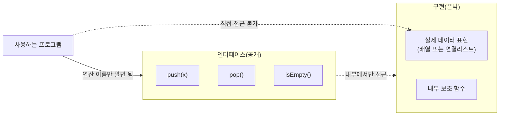

<Callout type="info">
  **이번 문서의 목표:** 이 문서를 다 읽으면 추상 자료형(ADT)이 왜 프로그래밍 언어의 설계 문제인지 설명할 수 있고, 캡슐화·정보 은닉·인터페이스와 구현의 분리를 언어별 문법(Ada 패키지, Modula-2 모듈, C++/Java 클래스)으로 비교해 시험에서 "어느 언어가 이 성질을 지원/미지원한다"는 판단형 문항에 답할 수 있다.
</Callout>

## 왜 이 개념이 프로그래밍언어론의 문제인가

04편(제어 구조와 하위프로그램 개념 지도)과 10편(자료형과 형 시스템)에서 프로그램이 커질수록 이름 충돌, 잘못된 자료 접근, 구현 세부사항에 대한 과도한 의존이 문제가 된다는 것을 이미 살펴봤다. 자료구조 과목(2단계)에서는 추상 자료형(Abstract Data Type, ADT)을 "데이터 객체 + 연산의 명세"로 정의하고 스택·큐 같은 구체적인 ADT를 설계하는 법을 배운다. 이 편은 같은 용어를 쓰지만 초점이 다르다. **자료구조 과목이 "어떤 ADT를 어떻게 설계하는가"를 묻는다면, 프로그래밍언어론은 "언어가 ADT라는 개념을 문법적으로 어떻게 지원하는가"를 묻는다.** 즉 프로그래밍 언어 설계자가 캡슐화·정보 은닉·인터페이스와 구현의 분리를 언어 차원에서 강제할 수 있는 문법 장치를 만들었는가, 만들었다면 어떤 형태인가가 이 편의 주제다.

> **쉽게 말하면:** 17편은 "스택을 어떻게 설계하나"가 아니라 "언어가 '이 부분은 감추고 이 부분만 공개한다'는 약속을 문법으로 어떻게 표현하게 해 주는가"를 다룬다.

이 구분이 왜 시험에서 중요한가? 독학사 프로그래밍언어론은 "다음 중 캡슐화를 지원하지 않는 언어는?" 이나 "인터페이스와 구현의 분리를 문법적으로 강제하는 언어 요소는?" 같은 **언어 비교·판단형 문항**을 즐겨 낸다. 자료구조 관점의 정의만 외우면 이런 문항에서 언어별 차이를 짚어내지 못한다.

## 추상 자료형(ADT)을 언어 설계 관점에서 다시 정의하기

추상 자료형은 두 부분으로 구성된다.

1. **인터페이스(interface)**: 이 자료형에 대해 무엇을 할 수 있는지(연산의 이름·매개변수·반환형)를 외부에 알리는 부분. "무엇을(what)"에 해당한다.
2. **구현(implementation)**: 그 연산이 실제로 어떻게 동작하는지, 데이터가 메모리에 어떻게 표현되는지를 담은 부분. "어떻게(how)"에 해당한다.

언어가 ADT를 제대로 지원한다는 것은 다음 두 가지를 **문법으로 강제**할 수 있다는 뜻이다.

- **캡슐화(encapsulation)**: 데이터 표현과 그 데이터를 다루는 연산을 하나의 프로그램 단위(패키지·모듈·클래스)로 묶는 것.
- **정보 은닉(information hiding)**: 그 단위 안에서 구현 세부사항(자료구조의 실제 표현, 보조 함수)을 외부에서 접근하지 못하게 감추는 것. 소프트웨어 공학자 David Parnas가 1972년에 제안한 원칙으로, "변경될 가능성이 높은 설계 결정을 모듈 경계 뒤에 숨겨야 한다"는 것이 핵심이다.

> **쉽게 말하면:** 캡슐화는 "한 상자에 담는다"이고, 정보 은닉은 "상자 뚜껑을 닫아 안이 안 보이게 한다"이다. 캡슐화가 됐다고 정보 은닉이 자동으로 되는 것은 아니다 — 상자에 담아도 뚜껑을 열어 두면 안이 다 보인다.

이 둘을 구분하는 것이 시험에서 자주 나오는 함정이다. 예를 들어 C언어의 구조체(struct)는 데이터를 묶을 수 있지만(느슨한 캡슐화), 구조체의 모든 필드가 기본적으로 공개(public)이므로 정보 은닉은 문법적으로 강제되지 않는다. 헤더 파일에 구조체 정의를 두고 관례적으로 "이 필드는 건드리지 마시오"라고 주석을 다는 것은 **프로그래머의 약속이지 언어의 강제가 아니다.**

## 언어별 지원 메커니즘 비교

역사적으로 언어들은 ADT와 정보 은닉을 지원하기 위해 서로 다른 문법 장치를 도입했다.

| 언어 | 캡슐화 단위 | 정보 은닉 문법 | 인터페이스/구현 분리 |
|------|-------------|----------------|----------------------|
| C | 구조체(struct) + 파일 | 없음(관례적 분리만 가능, `static`으로 파일 범위 제한 가능) | 헤더(`.h`)와 소스(`.c`)로 관례적 분리, 강제 아님 |
| Ada | 패키지(package) | `private` 절로 표현 세부사항 은닉 | package 명세(spec)와 본체(body)를 문법으로 분리 |
| Modula-2 | 모듈(module) | 정의 모듈(definition module)에서 export한 것만 공개 | 정의 모듈과 실행 모듈(implementation module) 분리 |
| C++ | 클래스(class) | `private`·`protected`·`public` 접근 지정자 | 클래스 선언과 멤버 함수 정의 분리 가능(관례), 헤더에 구현 노출 문제 있음 |
| Java | 클래스(class) | `private`·`protected`·`public`(package-private 포함) | interface와 class 분리, 단 클래스 자체는 필드·메서드를 한 파일에 작성 |

이 표에서 주목할 점은 **C++과 Java는 접근 지정자로 정보 은닉을 지원하지만, 완전한 인터페이스/구현 분리는 Ada나 Modula-2만큼 엄격하지 않다**는 것이다. C++ 클래스는 `private` 멤버를 헤더 파일에 그대로 적어야 하므로(컴파일러가 객체 크기를 알아야 하기 때문), 정보 은닉이 "접근을 막는" 수준이지 "존재 자체를 감추는" 수준은 아니다. 반면 Ada 패키지는 `private` 절 뒤의 표현을 명세(spec) 파일에서는 감추고 본체(body) 파일에만 둘 수 있어(구현 방식에 따라), 더 엄격한 분리가 가능하다.

이 그림에서 사용자 코드는 `push`·`pop`·`isEmpty`라는 연산 이름만 알면 스택을 쓸 수 있고, 실제로 배열로 구현했는지 연결리스트로 구현했는지는 알 필요도 없고 알 수도 없어야 한다. 이것이 정보 은닉이 완성됐을 때의 이상적인 모습이다.

## 캡슐화가 주는 이득을 설계 관점에서 정리하기

정보 은닉을 강제하면 다음과 같은 이득이 생긴다.

1. **구현 교체의 자유**: 인터페이스가 그대로면 내부 구현(배열 → 연결리스트)을 바꿔도 그 ADT를 사용하는 다른 코드는 전혀 수정할 필요가 없다.
2. **불변식(invariant) 보호**: 예를 들어 "스택의 top은 항상 배열 범위 안에 있다"는 불변식을, 외부에서 배열 인덱스를 직접 조작하지 못하게 막음으로써 지킬 수 있다.
3. **변경 파급 범위 축소**: 07편(언어 평가 기준)에서 다룬 신뢰성(reliability)과 직결된다. 구현이 캡슐화 경계 안에 갇혀 있으면, 그 부분을 수정했을 때 영향을 받는 범위가 그 모듈 안으로 제한된다.

> **자주 틀리는 점:** "캡슐화는 코드를 짧게 만든다"거나 "캡슐화는 실행 속도를 높인다"고 오해하는 보기가 나온다. 캡슐화의 본질적 이득은 **유지보수성과 변경 격리**이지, 코드 길이나 실행 속도와는 직접 관련이 없다. 오히려 접근 지정자 검사나 간접 호출 때문에 아주 미세한 오버헤드가 생길 수도 있다.

## getter/setter를 남발해도 정보 은닉이 깨질 수 있다

시험에서 자주 나오는 또 다른 함정은 "private 필드에 getter/setter를 다 만들어 두면 캡슐화가 완성된다"는 착각이다. 예를 들어 Java 클래스에서 모든 필드에 대해 `getX()`와 `setX()`를 기계적으로 만들어 두면, 필드가 `private`이라는 문법적 형식은 지켰지만 **외부에서 내부 표현을 자유롭게 읽고 쓸 수 있다는 실질**은 그대로 남는다. 이것은 "정보 은닉의 형식만 갖추고 목적은 달성하지 못한" 대표적인 사례로, 독학사 문항에서 "다음 클래스 설계는 캡슐화 원칙을 제대로 지켰다고 볼 수 있는가"를 묻는 서술형·정오 판단형으로 자주 나온다.

> **쉽게 말하면:** 뚜껑에 작은 구멍을 뚫고 "이건 뚜껑을 닫은 것이다"라고 우기는 것과 비슷하다. private 키워드 자체가 목적이 아니라, **외부가 내부 표현에 의존하지 못하게 만드는 것**이 목적이다.

## 자료구조 과목과의 경계

이 과목(프로그래밍언어론)은 다음 질문에 답한다: "언어가 캡슐화·정보 은닉·인터페이스 분리를 어떤 문법으로 지원하는가, 그 지원의 강도는 언어마다 어떻게 다른가." 반면 2단계 자료구조 과목은 "특정 ADT(스택·큐·트리 등)를 어떻게 설계하고 구현하는가, 그 연산의 복잡도는 얼마인가"를 다룬다. 같은 스택 ADT 예제가 두 과목에 모두 등장할 수 있지만, 프로그래밍언어론 시험에서는 "이 예제가 어떤 언어 문법으로 캡슐화되어 있는가"에 초점을 맞춰 답해야 한다.

## 핵심 정리

- ADT는 인터페이스(무엇을)와 구현(어떻게)으로 나뉘며, 언어가 이 분리를 문법으로 지원하는 방식이 프로그래밍언어론의 관심사다.
- 캡슐화(한 단위로 묶기)와 정보 은닉(구현 세부사항을 감추기)은 서로 다른 개념이며, 캡슐화됐다고 정보 은닉이 자동으로 보장되지 않는다.
- C는 정보 은닉을 문법으로 강제하지 않고, Ada·Modula-2는 패키지/모듈 명세와 본체를 분리해 엄격하게 지원하며, C++·Java는 접근 지정자(`private`/`protected`/`public`)로 지원하되 C++은 헤더에 구현이 노출되는 한계가 있다.
- 정보 은닉의 이득은 구현 교체의 자유, 불변식 보호, 변경 파급 범위 축소이며 코드 길이·실행 속도와는 직접 관련이 없다.
- getter/setter를 기계적으로 다 만드는 것은 캡슐화의 형식만 지키고 목적(내부 표현 의존 차단)은 달성하지 못하는 흔한 함정이다.

## 마무리 복습

<Quiz
  questionNumber={1}
  question="추상 자료형(ADT)을 언어 설계 관점에서 설명할 때 가장 정확한 것은?"
  options={['ADT는 특정 자료구조의 이름일 뿐 언어와는 무관하다', 'ADT는 인터페이스(무엇을 할 수 있는가)와 구현(어떻게 동작하는가)을 분리하는 개념이며, 언어는 이 분리를 문법으로 지원할 수도 안 할 수도 있다', 'ADT는 반드시 클래스 문법으로만 표현할 수 있다', 'ADT는 컴파일러가 자동으로 생성해 주는 것이다']}
  correctAnswer={2}
  explanation="ADT는 인터페이스와 구현의 분리라는 개념이며, 언어마다 이를 문법으로 강제하는 정도가 다르다(C는 강제 없음, Ada/Modula-2는 엄격, C++/Java는 접근 지정자로 부분 지원)."
  optionExplanations={['ADT는 언어가 그 개념을 어떻게 지원하는지가 프로그래밍언어론의 핵심 질문이므로 언어와 무관하지 않다.', '정답. 인터페이스/구현 분리와 언어의 문법적 지원 정도가 핵심이다.', 'Ada 패키지, Modula-2 모듈 등 클래스가 아닌 문법으로도 ADT를 표현할 수 있다.', 'ADT는 프로그래머가 설계하는 것이며 컴파일러가 자동 생성하지 않는다.']}
/>

<Quiz
  questionNumber={2}
  question="캡슐화(encapsulation)와 정보 은닉(information hiding)의 관계를 가장 정확히 설명한 것은?"
  options={['둘은 완전히 같은 개념이며 구분할 필요가 없다', '캡슐화는 데이터와 연산을 한 단위로 묶는 것이고, 정보 은닉은 그 단위 안의 구현 세부사항을 외부에서 접근하지 못하게 감추는 것으로, 캡슐화됐다고 정보 은닉이 자동 보장되지는 않는다', '정보 은닉이 캡슐화보다 상위 개념이라서 정보 은닉만 되면 캡슐화는 필요 없다', '캡슐화는 함수형 언어에서만 쓰이는 개념이다']}
  correctAnswer={2}
  explanation="캡슐화는 데이터와 연산의 묶음이고, 정보 은닉은 그 묶음 내부의 구현을 감추는 것이다. C의 구조체처럼 캡슐화는 되어 있지만 정보 은닉은 안 되는 경우가 있다."
  optionExplanations={['C 구조체 사례처럼 캡슐화되어 있어도 정보 은닉이 안 되는 경우가 있으므로 같은 개념이 아니다.', '정답. 캡슐화와 정보 은닉은 별개 개념이고 캡슐화가 정보 은닉을 자동 보장하지 않는다.', '정보 은닉이 캡슐화의 상위 개념이라는 서술은 근거가 없으며 둘은 상호 보완적 개념이다.', '캡슐화는 명령형·객체지향 언어 전반에서 쓰이는 개념이며 함수형 언어에 국한되지 않는다.']}
/>

<Quiz
  questionNumber={3}
  question="C언어의 구조체(struct)에 대한 설명으로 옳은 것은?"
  options={['모든 필드가 기본적으로 은닉되어 외부에서 접근할 수 없다', '데이터를 하나로 묶을 수는 있지만(캡슐화) 모든 필드가 공개(public)이므로 정보 은닉을 문법으로 강제하지 않는다', '구조체는 인터페이스와 구현을 명세(spec) 파일과 본체(body) 파일로 엄격히 분리한다', '구조체는 private 접근 지정자를 지원한다']}
  correctAnswer={2}
  explanation="C 구조체는 필드를 묶어 캡슐화는 가능하지만, 모든 필드가 기본적으로 공개이며 언어 자체에 접근 지정자가 없어 정보 은닉을 문법으로 강제하지 못한다."
  optionExplanations={['C 구조체 필드는 기본적으로 공개(public)이며 은닉되지 않는다.', '정답. 캡슐화는 가능하나 정보 은닉은 관례에 의존할 뿐 문법으로 강제되지 않는다.', 'Ada 패키지에 대한 설명이며 C 구조체는 그런 엄격한 분리를 제공하지 않는다.', 'C에는 private 같은 접근 지정자 문법이 없다.']}
/>

<Quiz
  questionNumber={4}
  question="Ada 패키지(package)와 C++ 클래스(class)의 정보 은닉 지원을 비교한 설명으로 가장 적절한 것은?"
  options={['Ada 패키지는 명세(spec)와 본체(body)를 문법으로 분리해 구현을 감출 수 있는 반면, C++ 클래스는 private 멤버라도 헤더 파일에 선언을 노출해야 하므로 완전한 은닉에는 한계가 있다', 'C++ 클래스가 Ada 패키지보다 정보 은닉을 더 엄격하게 지원한다', '두 언어 모두 정보 은닉을 전혀 지원하지 않는다', 'Ada 패키지는 접근 지정자를 전혀 제공하지 않는다']}
  correctAnswer={1}
  explanation="Ada는 package spec/body 분리로 구현 세부사항을 본체에 감출 수 있지만, C++은 컴파일러가 객체 크기를 알아야 하므로 private 멤버도 헤더에 선언해야 해 은닉에 한계가 있다."
  optionExplanations={['정답. Ada의 spec/body 분리와 C++의 헤더 노출 한계를 정확히 비교했다.', 'C++은 private 멤버를 헤더에 노출해야 하므로 Ada보다 은닉 강도가 약하다.', 'Ada의 private 절, C++의 접근 지정자 모두 정보 은닉을 지원하는 문법 장치다.', 'Ada는 package 내부에서 private 절로 표현을 제한하는 문법을 제공한다.']}
/>

<Quiz
  questionNumber={5}
  question="정보 은닉이 잘 된 ADT가 주는 이득으로 가장 거리가 먼 것은?"
  options={['내부 구현(예: 배열에서 연결리스트로)을 바꿔도 사용하는 코드를 수정할 필요가 없다', '데이터의 불변식(invariant)을 외부의 무분별한 접근으로부터 보호할 수 있다', '실행 속도가 캡슐화하지 않은 코드보다 항상 더 빨라진다', '수정했을 때 영향을 받는 범위가 모듈 경계 안으로 제한된다']}
  correctAnswer={3}
  explanation="정보 은닉의 본질적 이득은 유지보수성(구현 교체 자유, 불변식 보호, 변경 파급 범위 축소)이며, 실행 속도 향상과는 직접 관련이 없다. 오히려 접근 검사나 간접 호출로 미세한 오버헤드가 생길 수도 있다."
  optionExplanations={['구현 교체의 자유는 정보 은닉의 대표적인 이득이다.', '불변식 보호도 정보 은닉의 핵심 이득이다.', '정답. 실행 속도 향상은 정보 은닉의 목적이 아니며, 오히려 약간의 오버헤드가 생길 수 있다.', '변경 파급 범위 축소는 정보 은닉의 핵심 이득이다.']}
/>

<Quiz
  questionNumber={6}
  question="Java 클래스에서 모든 필드를 private으로 선언하고 모든 필드에 대해 기계적으로 getX()·setX()를 만들었다면 이에 대한 평가로 가장 타당한 것은?"
  options={['접근 지정자 문법을 지켰으므로 정보 은닉이 완벽하게 달성되었다', 'private이라는 형식은 지켰지만 getter/setter가 내부 표현을 그대로 읽고 쓰게 해 준다면 정보 은닉의 실질적 목적(내부 표현 의존 차단)은 달성하지 못한 것일 수 있다', '이 방식은 캡슐화 자체를 하지 않은 것과 같다', 'getter/setter를 만들면 클래스의 실행 속도가 빨라진다']}
  correctAnswer={2}
  explanation="private 필드에 대해 필드값을 그대로 노출하는 getter/setter를 기계적으로 만들면, 문법적 형식은 지켰지만 외부가 내부 표현에 의존하지 못하게 한다는 정보 은닉의 실질적 목적은 달성하지 못할 수 있다."
  optionExplanations={['형식은 지켰지만 실질적인 목적(내부 표현 의존 차단)은 달성하지 못했을 수 있다.', '정답. 형식과 목적을 구분해야 하며, 이 사례는 형식만 갖춘 대표적인 함정이다.', 'private 필드로 묶는 것 자체는 캡슐화의 한 형태이다.', 'getter/setter 추가는 실행 속도와 직접 관련이 없다.']}
/>

## 참고 자료

- [국가평생교육진흥원 독학학위제](https://bdes.nile.or.kr) — 프로그래밍언어론 과목의 최신 출제기준과 평가영역을 확인할 수 있는 공식 사이트.
- [Oracle Java Tutorials - Classes and Objects](https://docs.oracle.com/javase/tutorial/java/javaOO/classes.html) — 클래스를 통한 캡슐화, 접근 지정자(private/protected/public)의 실제 문법과 동작을 확인할 수 있는 공식 문서.
