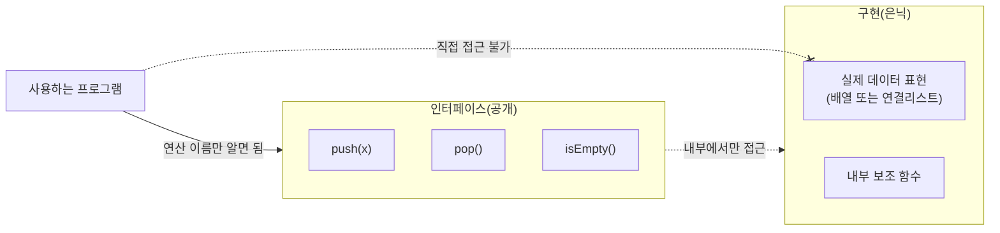

## 왜 이 개념이 프로그래밍언어론의 문제인가

04편(제어 구조와 하위프로그램 개념 지도)과 10편(자료형과 형 시스템)에서 프로그램이 커질수록 이름 충돌, 잘못된 자료 접근, 구현 세부사항에 대한 과도한 의존이 문제가 된다는 것을 이미 살펴봤다. 자료구조 과목(2단계)에서는 추상 자료형(Abstract Data Type, ADT)을 "데이터 객체 + 연산의 명세"로 정의하고 스택·큐 같은 구체적인 ADT를 설계하는 법을 배운다.

이 구분이 왜 시험에서 중요한가? 독학사 프로그래밍언어론은 "다음 중 캡슐화를 지원하지 않는 언어는?" 이나 "인터페이스와 구현의 분리를 문법적으로 강제하는 언어 요소는?" 같은 **언어 비교·판단형 문항**을 즐겨 낸다. 자료구조 관점의 정의만 외우면 이런 문항에서 언어별 차이를 짚어내지 못한다.

## 추상 자료형(ADT)을 언어 설계 관점에서 다시 정의하기

추상 자료형은 두 부분으로 구성된다.

1. **인터페이스(interface)**: 이 자료형에 대해 무엇을 할 수 있는지(연산의 이름·매개변수·반환형)를 외부에 알리는 부분. "무엇을(what)"에 해당한다.
2. **구현(implementation)**: 그 연산이 실제로 어떻게 동작하는지, 데이터가 메모리에 어떻게 표현되는지를 담은 부분. "어떻게(how)"에 해당한다.

언어가 ADT를 제대로 지원한다는 것은 다음 두 가지를 **문법으로 강제**할 수 있다는 뜻이다.

- **캡슐화(encapsulation)**: 데이터 표현과 그 데이터를 다루는 연산을 하나의 프로그램 단위(패키지·모듈·클래스)로 묶는 것.
- **정보 은닉(information hiding)**: 그 단위 안에서 구현 세부사항(자료구조의 실제 표현, 보조 함수)을 외부에서 접근하지 못하게 감추는 것. 소프트웨어 공학자 David Parnas가 1972년에 제안한 원칙으로, "변경될 가능성이 높은 설계 결정을 모듈 경계 뒤에 숨겨야 한다"는 것이 핵심이다.

이 둘을 구분하는 것이 시험에서 자주 나오는 함정이다. 헤더 파일에 구조체 정의를 두고 관례적으로 "이 필드는 건드리지 마시오"라고 주석을 다는 것은 **프로그래머의 약속이지 언어의 강제가 아니다.**

## 언어별 지원 메커니즘 비교

역사적으로 언어들은 ADT와 정보 은닉을 지원하기 위해 서로 다른 문법 장치를 도입했다.

| 언어 | 캡슐화 단위 | 정보 은닉 문법 | 인터페이스/구현 분리 |
|------|-------------|----------------|----------------------|
| C | 구조체(struct) + 파일 | 없음(관례적 분리만 가능, `static`으로 파일 범위 제한 가능) | 헤더(`.h`)와 소스(`.c`)로 관례적 분리, 강제 아님 |
| Ada | 패키지(package) | `private` 절로 표현 세부사항 은닉 | package 명세(spec)와 본체(body)를 문법으로 분리 |
| Modula-2 | 모듈(module) | 정의 모듈(definition module)에서 export한 것만 공개 | 정의 모듈과 실행 모듈(implementation module) 분리 |
| C++ | 클래스(class) | `private`·`protected`·`public` 접근 지정자 | 클래스 선언과 멤버 함수 정의 분리 가능(관례), 헤더에 구현 노출 문제 있음 |
| Java | 클래스(class) | `private`·`protected`·`public`(package-private 포함) | interface와 class 분리, 단 클래스 자체는 필드·메서드를 한 파일에 작성 |

이 표에서 주목할 점은 **C++과 Java는 접근 지정자로 정보 은닉을 지원하지만, 완전한 인터페이스/구현 분리는 Ada나 Modula-2만큼 엄격하지 않다**는 것이다. C++ 클래스는 `private` 멤버를 헤더 파일에 그대로 적어야 하므로(컴파일러가 객체 크기를 알아야 하기 때문), 정보 은닉이 "접근을 막는" 수준이지 "존재 자체를 감추는" 수준은 아니다.

```mermaid
flowchart LR
    subgraph 인터페이스["인터페이스(공개)"]
        OP1["push(x)"]
        OP2["pop()"]
        OP3["isEmpty()"]
    end
    subgraph 구현["구현(은닉)"]
        DATA["실제 데이터 표현<br/>(배열 또는 연결리스트)"]
        HELP["내부 보조 함수"]
    end
    사용자코드["사용하는 프로그램"] -->|"연산 이름만 알면 됨"| 인터페이스
    인터페이스 -.->|"내부에서만 접근"| 구현
    사용자코드 -. "직접 접근 불가" .-x DATA
```

이 그림에서 사용자 코드는 `push`·`pop`·`isEmpty`라는 연산 이름만 알면 스택을 쓸 수 있고, 실제로 배열로 구현했는지 연결리스트로 구현했는지는 알 필요도 없고 알 수도 없어야 한다. 이것이 정보 은닉이 완성됐을 때의 이상적인 모습이다.

## 캡슐화가 주는 이득을 설계 관점에서 정리하기

정보 은닉을 강제하면 다음과 같은 이득이 생긴다.

1. **구현 교체의 자유**: 인터페이스가 그대로면 내부 구현(배열 → 연결리스트)을 바꿔도 그 ADT를 사용하는 다른 코드는 전혀 수정할 필요가 없다.
2. **불변식(invariant) 보호**: 예를 들어 "스택의 top은 항상 배열 범위 안에 있다"는 불변식을, 외부에서 배열 인덱스를 직접 조작하지 못하게 막음으로써 지킬 수 있다.
3. **변경 파급 범위 축소**: 07편(언어 평가 기준)에서 다룬 신뢰성(reliability)과 직결된다. 구현이 캡슐화 경계 안에 갇혀 있으면, 그 부분을 수정했을 때 영향을 받는 범위가 그 모듈 안으로 제한된다.

> **자주 틀리는 점:** "캡슐화는 코드를 짧게 만든다"거나 "캡슐화는 실행 속도를 높인다"고 오해하는 보기가 나온다. 캡슐화의 본질적 이득은 **유지보수성과 변경 격리**이지, 코드 길이나 실행 속도와는 직접 관련이 없다. 오히려 접근 지정자 검사나 간접 호출 때문에 아주 미세한 오버헤드가 생길 수도 있다.

## getter/setter를 남발해도 정보 은닉이 깨질 수 있다

시험에서 자주 나오는 또 다른 함정은 "private 필드에 getter/setter를 다 만들어 두면 캡슐화가 완성된다"는 착각이다. 예를 들어 Java 클래스에서 모든 필드에 대해 `getX()`와 `setX()`를 기계적으로 만들어 두면, 필드가 `private`이라는 문법적 형식은 지켰지만 **외부에서 내부 표현을 자유롭게 읽고 쓸 수 있다는 실질**은 그대로 남는다.

## 자료구조 과목과의 경계

이 과목(프로그래밍언어론)은 다음 질문에 답한다: "언어가 캡슐화·정보 은닉·인터페이스 분리를 어떤 문법으로 지원하는가, 그 지원의 강도는 언어마다 어떻게 다른가." 반면 2단계 자료구조 과목은 "특정 ADT(스택·큐·트리 등)를 어떻게 설계하고 구현하는가, 그 연산의 복잡도는 얼마인가"를 다룬다. 같은 스택 ADT 예제가 두 과목에 모두 등장할 수 있지만, 프로그래밍언어론 시험에서는 "이 예제가 어떤 언어 문법으로 캡슐화되어 있는가"에 초점을 맞춰 답해야 한다.

## 핵심 정리

- ADT는 인터페이스(무엇을)와 구현(어떻게)으로 나뉘며, 언어가 이 분리를 문법으로 지원하는 방식이 프로그래밍언어론의 관심사다.
- 캡슐화(한 단위로 묶기)와 정보 은닉(구현 세부사항을 감추기)은 서로 다른 개념이며, 캡슐화됐다고 정보 은닉이 자동으로 보장되지 않는다.
- C는 정보 은닉을 문법으로 강제하지 않고, Ada·Modula-2는 패키지/모듈 명세와 본체를 분리해 엄격하게 지원하며, C++·Java는 접근 지정자(`private`/`protected`/`public`)로 지원하되 C++은 헤더에 구현이 노출되는 한계가 있다.
- 정보 은닉의 이득은 구현 교체의 자유, 불변식 보호, 변경 파급 범위 축소이며 코드 길이·실행 속도와는 직접 관련이 없다.
- getter/setter를 기계적으로 다 만드는 것은 캡슐화의 형식만 지키고 목적(내부 표현 의존 차단)은 달성하지 못하는 흔한 함정이다.

## 마무리 복습

<Quiz
  questionNumber={1}
  question={"추상 자료형(ADT)을 언어 설계 관점에서 설명할 때 가장 정확한 것은?"}
  options={["ADT는 특정 자료구조의 이름일 뿐 언어와는 무관하다","ADT는 인터페이스(무엇을 할 수 있는가)와 구현(어떻게 동작하는가)을 분리하는 개념이며, 언어는 이 분리를 문법으로 지원할 수도 안 할 수도 있다","ADT는 반드시 클래스 문법으로만 표현할 수 있다","ADT는 컴파일러가 자동으로 생성해 주는 것이다"]}
  correctAnswer={2}
  explanation={"ADT는 인터페이스와 구현의 분리라는 개념이며, 언어마다 이를 문법으로 강제하는 정도가 다르다(C는 강제 없음, Ada/Modula-2는 엄격, C++/Java는 접근 지정자로 부분 지원)."}
/>

<Quiz
  questionNumber={2}
  question={"캡슐화(encapsulation)와 정보 은닉(information hiding)의 관계를 가장 정확히 설명한 것은?"}
  options={["둘은 완전히 같은 개념이며 구분할 필요가 없다","캡슐화는 데이터와 연산을 한 단위로 묶는 것이고, 정보 은닉은 그 단위 안의 구현 세부사항을 외부에서 접근하지 못하게 감추는 것으로, 캡슐화됐다고 정보 은닉이 자동 보장되지는 않는다","정보 은닉이 캡슐화보다 상위 개념이라서 정보 은닉만 되면 캡슐화는 필요 없다","캡슐화는 함수형 언어에서만 쓰이는 개념이다"]}
  correctAnswer={2}
  explanation={"캡슐화는 데이터와 연산의 묶음이고, 정보 은닉은 그 묶음 내부의 구현을 감추는 것이다. C의 구조체처럼 캡슐화는 되어 있지만 정보 은닉은 안 되는 경우가 있다."}
/>

<Quiz
  questionNumber={3}
  question={"C언어의 구조체(struct)에 대한 설명으로 옳은 것은?"}
  options={["모든 필드가 기본적으로 은닉되어 외부에서 접근할 수 없다","데이터를 하나로 묶을 수는 있지만(캡슐화) 모든 필드가 공개(public)이므로 정보 은닉을 문법으로 강제하지 않는다","구조체는 인터페이스와 구현을 명세(spec) 파일과 본체(body) 파일로 엄격히 분리한다","구조체는 private 접근 지정자를 지원한다"]}
  correctAnswer={2}
  explanation={"C 구조체는 필드를 묶어 캡슐화는 가능하지만, 모든 필드가 기본적으로 공개이며 언어 자체에 접근 지정자가 없어 정보 은닉을 문법으로 강제하지 못한다."}
/>

## 참고 자료

- [국가평생교육진흥원 독학학위제](https://bdes.nile.or.kr) — 프로그래밍언어론 과목의 최신 출제기준과 평가영역을 확인할 수 있는 공식 사이트.
- [Oracle Java Tutorials - Classes and Objects](https://docs.oracle.com/javase/tutorial/java/javaOO/classes.html) — 클래스를 통한 캡슐화, 접근 지정자(private/protected/public)의 실제 문법과 동작을 확인할 수 있는 공식 문서.
