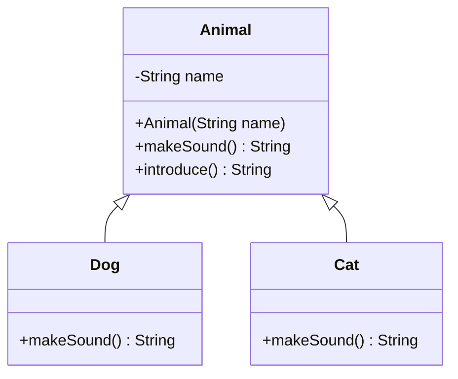

<Callout type="info">
  **이번 문서의 목표:** 이 문서를 다 읽으면 클래스·객체·상속·다형성·동적 바인딩을 Java 코드의 실행 결과로 추적할 수 있고, "정적 바인딩과 동적 바인딩 중 어느 것이 적용되는가"를 코드만 보고 판단할 수 있으며, C++과 Java의 OOP 지원 차이를 설명할 수 있다.
</Callout>

## 왜 이 개념이 필요한가

17편에서 캡슐화와 정보 은닉을 언어가 어떻게 지원하는지 봤다. 이 편은 그 위에 세 가지를 더 얹는다. **상속**(inheritance)으로 기존 클래스를 재사용·확장하고, **다형성**(polymorphism)으로 같은 이름의 연산이 객체의 실제 타입에 따라 다르게 동작하게 하고, 그 다형성을 실제로 실현하는 메커니즘인 **동적 바인딩**(dynamic binding)을 이해하는 것이다. 이 세 가지는 09편(이름·바인딩·스코프·수명 심화)에서 다룬 "바인딩 시기"라는 개념이 객체지향 언어에서 어떻게 구체화되는지 보여 주는 대표 사례다.

> **쉽게 말하면:** 상속은 "이미 있는 것을 물려받아 다르게 만든다"이고, 다형성은 "같은 명령을 내려도 받는 대상에 따라 다르게 반응한다"이며, 동적 바인딩은 "그 반응을 결정하는 시점을 실행 중(런타임)으로 미루는 기술"이다.

## 클래스와 객체, 그리고 상속

클래스(class)는 객체(object)를 찍어내는 틀이다. 객체는 클래스가 정의한 필드(상태)와 메서드(행동)를 실제로 가진 메모리상의 실체다. 상속(inheritance)은 기존 클래스(부모 클래스, superclass)의 필드와 메서드를 새 클래스(자식 클래스, subclass)가 물려받고, 필요하면 **오버라이딩**(overriding, 재정의)으로 동작을 바꾸는 메커니즘이다.



이 클래스 다이어그램에서 `Dog`와 `Cat`은 `Animal`을 상속받아 `name` 필드와 `introduce()` 메서드를 그대로 물려받지만, `makeSound()`는 각자 다르게 **오버라이딩**한다. 이제 이 구조를 Java 코드로 확인해 보자.

```java
class Animal {
    private String name;

    public Animal(String name) {
        this.name = name;
    }

    public String makeSound() {
        return "...";
    }

    public String introduce() {
        return name + "이(가) 소리를 낸다: " + makeSound();
    }
}

class Dog extends Animal {
    public Dog(String name) {
        super(name);
    }

    @Override
    public String makeSound() {
        return "멍멍";
    }
}

class Cat extends Animal {
    public Cat(String name) {
        super(name);
    }

    @Override
    public String makeSound() {
        return "야옹";
    }
}

public class Main {
    public static void main(String[] args) {
        Animal[] animals = { new Dog("바둑이"), new Cat("나비") };
        for (Animal a : animals) {
            System.out.println(a.introduce());
        }
    }
}
```

```text
바둑이이(가) 소리를 낸다: 멍멍
나비이(가) 소리를 낸다: 야옹
```

여기서 눈여겨볼 점은 `Animal` 타입의 배열에 `Dog`와 `Cat` 객체를 담아도, `introduce()` 안에서 호출한 `makeSound()`가 **실제 객체의 타입(Dog인지 Cat인지)에 따라 다른 메서드로 실행됐다**는 것이다. `introduce()`는 `Animal` 클래스에 정의되어 있고 `makeSound()`를 호출할 뿐인데, 실행 결과는 객체마다 다르다. 이것이 다형성이 눈에 보이는 방식이다.

## 다형성과 동적 바인딩의 관계

**다형성**(polymorphism)은 그리스어로 "여러(poly) 형태(morph)"라는 뜻으로, 같은 이름의 연산이 호출되는 객체의 실제 타입에 따라 서로 다르게 동작하는 성질을 말한다. 이 성질이 실제로 가능하려면 언어가 **어느 `makeSound()`를 실행할지 결정하는 시점**을 미뤄야 한다. 이 결정을 컴파일 시점에 하면 **정적 바인딩**(static binding), 실행 시점에 객체의 실제 타입을 보고 하면 **동적 바인딩**(dynamic binding)이라 한다.

위 코드에서 `a.makeSound()`를 호출할 때, 컴파일러는 `a`의 선언된 타입이 `Animal`이라는 것만 안다. 만약 정적 바인딩이었다면 `Animal.makeSound()`(즉 `"..."`을 반환하는 버전)가 항상 호출됐을 것이다. 하지만 실행 결과는 `"멍멍"`, `"야옹"`이었다 — 이것은 Java의 인스턴스 메서드 호출이 **동적 바인딩**되기 때문이다. 자바 가상 머신(JVM)은 실행 중에 `a`가 가리키는 객체가 실제로 `Dog`인지 `Cat`인지 확인하고, 그 클래스에 오버라이딩된 메서드를 호출한다.

> **쉽게 말하면:** 정적 바인딩은 "설계도(선언 타입)만 보고 미리 정해 버리는 것"이고, 동적 바인딩은 "실제 물건(객체)을 보고 그때 가서 정하는 것"이다.

이 관계를 표로 정리하면 다음과 같다.

| 구분 | 정적 바인딩 | 동적 바인딩 |
|------|-------------|-------------|
| 결정 시점 | 컴파일 시점 | 실행(런타임) 시점 |
| 기준 | 변수의 선언된 타입 | 객체의 실제 타입 |
| 대표 사례 | Java의 오버로딩(overloading) 해결, 정적 메서드 호출, C의 함수 호출 | Java·C++의 오버라이딩된 인스턴스 메서드 호출(가상 함수) |
| 실행 속도 | 빠름(호출 위치가 고정됨) | 상대적으로 느림(가상 함수 테이블 조회 필요) |
| 다형성 지원 | 지원하지 않음(오버로딩은 다형성과 다른 개념) | 다형성을 실질적으로 실현하는 메커니즘 |

> **자주 틀리는 점:** **오버로딩**(overloading)과 **오버라이딩**(overriding)을 혼동하는 문항이 자주 나온다. 오버로딩은 같은 이름의 메서드를 매개변수 목록(개수·타입)을 다르게 여러 개 정의하는 것으로, **정적 바인딩**(컴파일 시점에 어떤 메서드인지 결정)으로 해결된다. 오버라이딩은 부모 클래스의 메서드를 자식 클래스가 같은 시그니처로 재정의하는 것으로, **동적 바인딩**으로 해결된다. "다형성을 구현하는 것은 오버로딩이다"라는 보기는 오답이다.

## C++의 동적 바인딩: virtual 키워드가 필요한 이유

Java는 인스턴스 메서드가 기본적으로 동적 바인딩되지만, C++은 다르다. C++에서 메서드(멤버 함수)가 동적 바인딩되려면 `virtual` 키워드를 명시적으로 붙여야 한다. 붙이지 않으면 정적 바인딩된다.

```cpp
#include <iostream>
using namespace std;

class Animal {
public:
    virtual string makeSound() { return "..."; }
    string introduce() { return "소리: " + makeSound(); }
};

class Dog : public Animal {
public:
    string makeSound() override { return "멍멍"; }
};

int main() {
    Animal* a = new Dog();
    cout << a->introduce() << endl;
    delete a;
    return 0;
}
```

```text
소리: 멍멍
```

이 코드에서 `makeSound()`가 `virtual`로 선언되어 있기 때문에 `Animal*` 포인터가 가리키는 실제 객체(`Dog`)의 메서드가 호출된다. 만약 `virtual`을 빼면 어떻게 될까?

```cpp
class Animal {
public:
    string makeSound() { return "..."; }  // virtual 없음
    string introduce() { return "소리: " + makeSound(); }
};
```

```text
소리: ...
```

`virtual`이 없으면 컴파일러는 포인터의 **선언된 타입**(`Animal*`)만 보고 `Animal::makeSound()`를 정적으로 호출해 버린다. 실제 객체가 `Dog`여도 소용없다. **이 차이가 C++과 Java의 대표적인 OOP 설계 차이**로, "C++은 기본이 정적 바인딩이고 virtual로 동적 바인딩을 선택하는 언어, Java는 기본이 동적 바인딩인 언어"라고 정리할 수 있다.

## 상속·다형성을 지원하기 위한 접근 제어와 생성자 호출 순서

상속 관계에서 객체를 생성할 때, 생성자(constructor)는 **부모 클래스부터 먼저 호출**된다. 앞의 Java 예제에서 `Dog` 생성자의 `super(name)` 호출이 바로 이것이다. 생성자 호출 순서를 코드로 다시 확인해 보자.

```java
class A {
    A() { System.out.println("A 생성자"); }
}

class B extends A {
    B() { System.out.println("B 생성자"); }
}

class C extends B {
    C() { System.out.println("C 생성자"); }
}

public class Main {
    public static void main(String[] args) {
        new C();
    }
}
```

```text
A 생성자
B 생성자
C 생성자
```

| 단계 | 호출되는 생성자 | 설명 |
|------|------------------|------|
| 1 | `A()` | `C` 객체를 만들려면 `C`가 상속받는 `B`가 필요하고, `B`는 `A`가 필요하므로 최상위 부모부터 초기화 |
| 2 | `B()` | `A` 초기화가 끝난 뒤 `B`의 필드·초기화 코드 실행 |
| 3 | `C()` | 마지막으로 `C` 자신의 초기화 실행 |

> **자주 틀리는 점:** "자식 클래스 생성자가 먼저 실행되고 나중에 부모 클래스 생성자가 호출된다"고 순서를 거꾸로 아는 오류가 흔하다. 객체는 **부모의 상태가 먼저 갖춰져야** 자식이 그 위에 자신의 상태를 얹을 수 있으므로, 생성자는 항상 **최상위 부모 → 자식** 순서로 호출된다.

접근 제어(access control)는 상속과 맞물려 세 단계로 나뉜다.

| 접근 지정자 | 같은 클래스 | 자식 클래스 | 다른 클래스(같은 패키지 밖) |
|-------------|-------------|-------------|------------------------------|
| `private` | 가능 | 불가능 | 불가능 |
| `protected` | 가능 | 가능 | 불가능(단, Java는 같은 패키지도 허용) |
| `public` | 가능 | 가능 | 가능 |

## 추상 클래스와 인터페이스: 다형성의 두 가지 뼈대

객체지향 언어는 "구현 없이 규격만 정의"하는 두 가지 문법을 제공한다.

- **추상 클래스(abstract class)**: 일부 메서드는 구현하고 일부(추상 메서드)는 자식 클래스가 반드시 구현하도록 강제한다. 필드와 일반 메서드를 가질 수 있다.
- **인터페이스(interface)**: (전통적으로) 메서드 시그니처만 정의하고 구현체를 갖지 않는다. 한 클래스가 여러 인터페이스를 동시에 구현할 수 있어, 단일 상속만 지원하는 Java에서 다중 상속과 비슷한 유연성을 준다.

```java
interface Flyable {
    String fly();
}

abstract class Bird {
    abstract String makeSound();
    String describe() {
        return "새가 운다: " + makeSound();
    }
}

class Sparrow extends Bird implements Flyable {
    String makeSound() { return "짹짹"; }
    public String fly() { return "포르르 난다"; }
}
```

`Sparrow`는 `Bird`를 상속(단일 상속)하면서 동시에 `Flyable`을 구현(다중 구현 가능)한다. 이것이 "Java는 클래스의 다중 상속은 금지하지만 인터페이스의 다중 구현은 허용한다"는 설계의 실제 모습이다.

## 핵심 정리

- 상속은 부모 클래스의 필드·메서드를 자식 클래스가 물려받고 오버라이딩으로 동작을 바꿀 수 있게 하는 메커니즘이다.
- 다형성은 같은 연산 호출이 객체의 실제 타입에 따라 다르게 동작하는 성질이며, 이를 실현하는 메커니즘이 동적 바인딩이다.
- 오버로딩(매개변수 목록으로 구분, 정적 바인딩)과 오버라이딩(같은 시그니처 재정의, 동적 바인딩)은 다른 개념이다.
- Java는 인스턴스 메서드가 기본적으로 동적 바인딩되지만, C++은 `virtual` 키워드를 붙여야 동적 바인딩되고 그렇지 않으면 정적 바인딩된다.
- 생성자는 항상 최상위 부모 클래스부터 자식 클래스 순서로 호출된다.
- 추상 클래스는 일부 구현을 포함할 수 있고 단일 상속만 가능하지만, 인터페이스는 (전통적으로) 구현이 없고 한 클래스가 여러 개를 동시에 구현할 수 있다.

## 마무리 복습

<Quiz
  questionNumber={1}
  question="다형성(polymorphism)과 동적 바인딩(dynamic binding)의 관계를 가장 정확히 설명한 것은?"
  options={['다형성과 동적 바인딩은 서로 무관한 별개의 개념이다', '동적 바인딩은 다형성을 실현하는 메커니즘으로, 어느 메서드를 실행할지의 결정을 실행 시점 객체의 실제 타입으로 미루는 방식이다', '다형성은 오버로딩만으로 완전히 구현된다', '동적 바인딩은 컴파일 시점에 모든 것이 결정되는 방식이다']}
  correctAnswer={2}
  explanation="다형성은 같은 호출이 객체의 실제 타입에 따라 다르게 동작하는 성질이며, 이를 실제로 가능하게 하는 언어 메커니즘이 동적 바인딩이다."
  optionExplanations={['동적 바인딩은 다형성을 실현하는 구체적 메커니즘이므로 무관하지 않다.', '정답. 동적 바인딩은 실행 시점에 객체의 실제 타입을 보고 메서드를 결정하는 다형성의 실현 메커니즘이다.', '오버로딩은 정적 바인딩으로 해결되며 다형성의 핵심 메커니즘이 아니다.', '동적 바인딩은 이름 그대로 실행(런타임) 시점에 결정된다.']}
/>

<Quiz
  questionNumber={2}
  question="다음 Java 코드의 실행 결과로 옳은 것은? (Animal 클래스의 makeSound()는 오버라이딩되어 있고, Dog·Cat이 각각 재정의한다고 가정)"
  options={['Animal 타입 배열에 담긴 객체는 항상 Animal의 makeSound()만 실행된다', 'Animal 타입 배열에 Dog·Cat 객체를 담아도 각 객체의 실제 타입에 맞는 makeSound()가 실행된다', '컴파일 오류가 발생한다', 'Dog와 Cat의 makeSound()가 항상 같은 문자열을 반환한다']}
  correctAnswer={2}
  explanation="Java의 인스턴스 메서드는 기본적으로 동적 바인딩되므로, 선언된 타입(Animal)과 무관하게 실제 객체(Dog 또는 Cat)의 오버라이딩된 메서드가 실행된다."
  optionExplanations={['이는 정적 바인딩을 가정한 오답으로, Java의 인스턴스 메서드는 동적 바인딩된다.', '정답. Java 인스턴스 메서드는 동적 바인딩되어 실제 객체 타입의 메서드가 실행된다.', '오버라이딩된 메서드를 배열에 담아 호출하는 것은 문법적으로 문제가 없다.', 'Dog와 Cat이 makeSound()를 각각 다르게 오버라이딩했다면 반환값도 다르다.']}
/>

<Quiz
  questionNumber={3}
  question="오버로딩(overloading)과 오버라이딩(overriding)의 차이로 옳은 것은?"
  options={['오버로딩은 매개변수 목록을 다르게 하는 같은 이름의 메서드 정의이며 정적 바인딩으로 해결되고, 오버라이딩은 부모의 메서드를 같은 시그니처로 재정의하며 동적 바인딩으로 해결된다', '오버로딩과 오버라이딩은 완전히 같은 개념이다', '오버라이딩은 매개변수 목록을 다르게 해야 하고, 오버로딩은 시그니처가 같아야 한다', '오버로딩은 항상 동적 바인딩되고 오버라이딩은 항상 정적 바인딩된다']}
  correctAnswer={1}
  explanation="오버로딩은 매개변수 목록으로 구분되는 같은 이름의 메서드로 컴파일 시점(정적 바인딩)에 해결되고, 오버라이딩은 부모-자식 간 같은 시그니처의 재정의로 실행 시점(동적 바인딩)에 해결된다."
  optionExplanations={['정답. 오버로딩=정적 바인딩, 오버라이딩=동적 바인딩이라는 대응 관계를 정확히 설명했다.', '두 개념은 매개변수 목록과 바인딩 시점이 달라 같은 개념이 아니다.', '설명이 서로 뒤바뀌었다. 오버라이딩은 시그니처가 같아야 하고 오버로딩은 매개변수 목록이 달라야 한다.', '오버로딩은 정적 바인딩, 오버라이딩은 동적 바인딩이며 이 서술은 반대로 되어 있다.']}
/>

<Quiz
  questionNumber={4}
  question="C++에서 makeSound()라는 멤버 함수를 virtual로 선언하지 않았을 때 Animal* 포인터가 Dog 객체를 가리키는 상태로 makeSound()를 호출하면 어떤 일이 일어나는가?"
  options={['항상 Dog의 makeSound()가 실행된다', '컴파일 오류가 발생한다', 'virtual이 없으면 정적 바인딩되어, 포인터의 선언된 타입인 Animal의 makeSound()가 실행된다', '실행할 때마다 무작위로 결정된다']}
  correctAnswer={3}
  explanation="C++에서 virtual 키워드가 없으면 멤버 함수 호출은 정적 바인딩되어 포인터의 선언된 타입(Animal)을 기준으로 메서드가 결정되므로, 실제 객체가 Dog여도 Animal의 makeSound()가 실행된다."
  optionExplanations={['virtual이 없으면 실제 객체 타입과 무관하게 선언된 타입의 메서드가 호출된다.', '문법적으로는 오류가 아니라 정적 바인딩으로 처리되어 컴파일된다.', '정답. virtual이 없으면 C++은 정적 바인딩을 적용해 선언된 타입 기준으로 호출한다.', '바인딩 결과는 컴파일 시점에 고정되며 무작위가 아니다.']}
/>

<Quiz
  questionNumber={5}
  question="클래스 C가 B를, B가 A를 상속하는 구조에서 new C()를 실행했을 때 생성자 호출 순서로 옳은 것은?"
  options={['C 생성자 → B 생성자 → A 생성자', 'A 생성자 → B 생성자 → C 생성자', 'B 생성자 → A 생성자 → C 생성자', '세 생성자가 동시에 호출된다']}
  correctAnswer={2}
  explanation="상속 관계에서 생성자는 최상위 부모 클래스부터 순서대로 호출된다. 자식은 부모의 상태가 먼저 갖춰져야 그 위에 자신의 초기화를 진행할 수 있기 때문이다."
  optionExplanations={['자식 생성자가 먼저 실행된다는 설명은 순서가 거꾸로 되어 있다.', '정답. 최상위 부모(A)부터 순서대로 초기화되어야 자식이 그 위에 상태를 쌓을 수 있다.', 'A가 B보다 먼저 초기화되어야 하므로 이 순서는 틀렸다.', '생성자는 순차적으로 호출되며 동시에 실행되지 않는다.']}
/>

<Quiz
  questionNumber={6}
  question="추상 클래스(abstract class)와 인터페이스(interface)의 전통적인 차이로 가장 적절한 것은?"
  options={['추상 클래스는 일부 메서드를 구현할 수 있고 단일 상속만 가능하지만, 인터페이스는 (전통적으로) 구현이 없고 한 클래스가 여러 개를 동시에 구현할 수 있다', '인터페이스는 필드와 일반 메서드를 자유롭게 가질 수 있고 다중 상속을 지원하지 않는다', '추상 클래스는 여러 개를 동시에 상속할 수 있다', '둘은 완전히 동일한 문법 요소이며 이름만 다르다']}
  correctAnswer={1}
  explanation="추상 클래스는 일부 구현을 포함할 수 있지만 단일 상속만 가능하고, 인터페이스는 전통적으로 구현 없이 시그니처만 정의하며 한 클래스가 여러 인터페이스를 동시에 구현할 수 있어 다중 상속의 유연성을 대체한다."
  optionExplanations={['정답. 추상 클래스=단일 상속+부분 구현, 인터페이스=다중 구현 가능이라는 대비를 정확히 설명했다.', '전통적인 인터페이스는 구현이 없는 시그니처 모음이며 이 설명은 반대로 되어 있다.', 'Java의 클래스 상속은 단일 상속만 가능하다.', '단일 상속·다중 상속 지원 여부와 구현 포함 여부가 서로 다르므로 동일한 요소가 아니다.']}
/>

<Quiz
  questionNumber={7}
  question="다음 중 접근 지정자에 대한 설명으로 옳지 않은 것은?"
  options={['private으로 선언된 멤버는 같은 클래스 내부에서만 접근할 수 있다', 'protected로 선언된 멤버는 자식 클래스에서 접근할 수 있다', 'public으로 선언된 멤버는 어디서든 접근할 수 있다', 'private으로 선언된 멤버는 자식 클래스에서도 항상 자유롭게 접근할 수 있다']}
  correctAnswer={4}
  explanation="private 멤버는 선언된 클래스 내부에서만 접근 가능하며, 자식 클래스라 하더라도 직접 접근할 수 없다. 자식 클래스에서 접근을 허용하려면 protected 이상으로 선언해야 한다."
  optionExplanations={['private 멤버는 선언된 클래스 내부에서만 접근 가능하다는 설명은 옳다.', 'protected 멤버는 자식 클래스에서 접근 가능하다는 설명은 옳다.', 'public 멤버는 어디서든 접근 가능하다는 설명은 옳다.', '정답. private 멤버는 자식 클래스에서도 접근할 수 없다는 것이 정확한 설명이며, 이 보기는 반대로 되어 있다.']}
/>

## 참고 자료

- [Oracle Java Tutorials - Inheritance](https://docs.oracle.com/javase/tutorial/java/IandI/subclasses.html) — 상속, 오버라이딩, 생성자 호출 순서에 대한 공식 설명과 예제.
- [Oracle Java Tutorials - Polymorphism](https://docs.oracle.com/javase/tutorial/java/IandI/polymorphism.html) — 다형성과 동적 메서드 디스패치(dynamic method dispatch)에 대한 공식 문서.
- [국가평생교육진흥원 독학학위제](https://bdes.nile.or.kr) — 프로그래밍언어론 과목의 최신 출제기준과 평가영역을 확인할 수 있는 공식 사이트.
