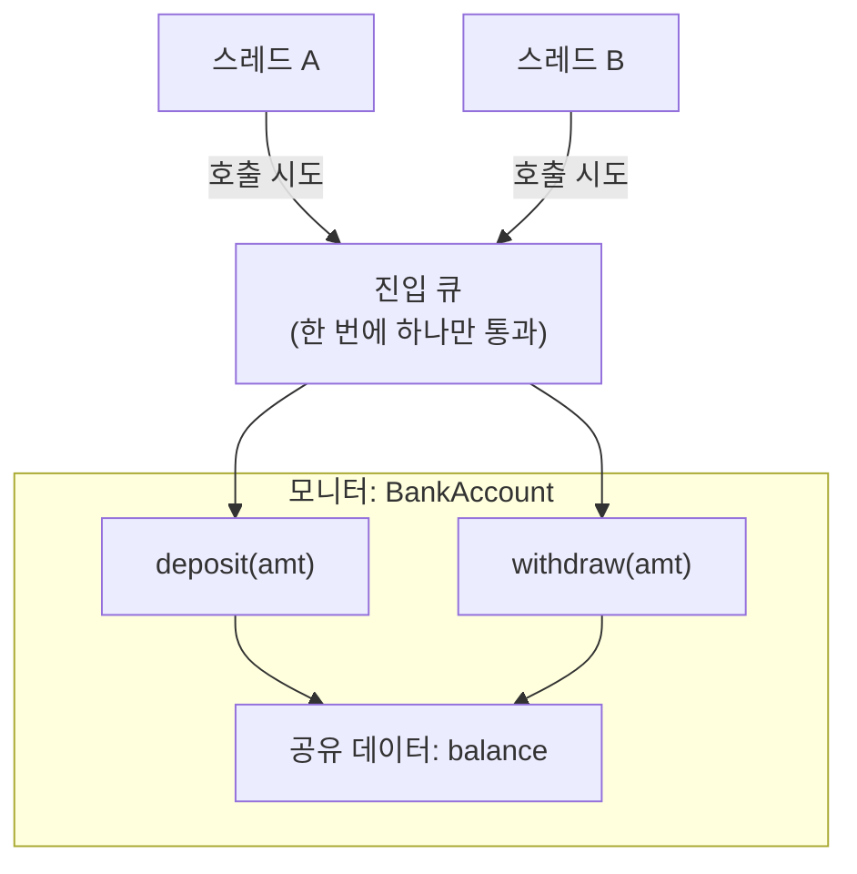
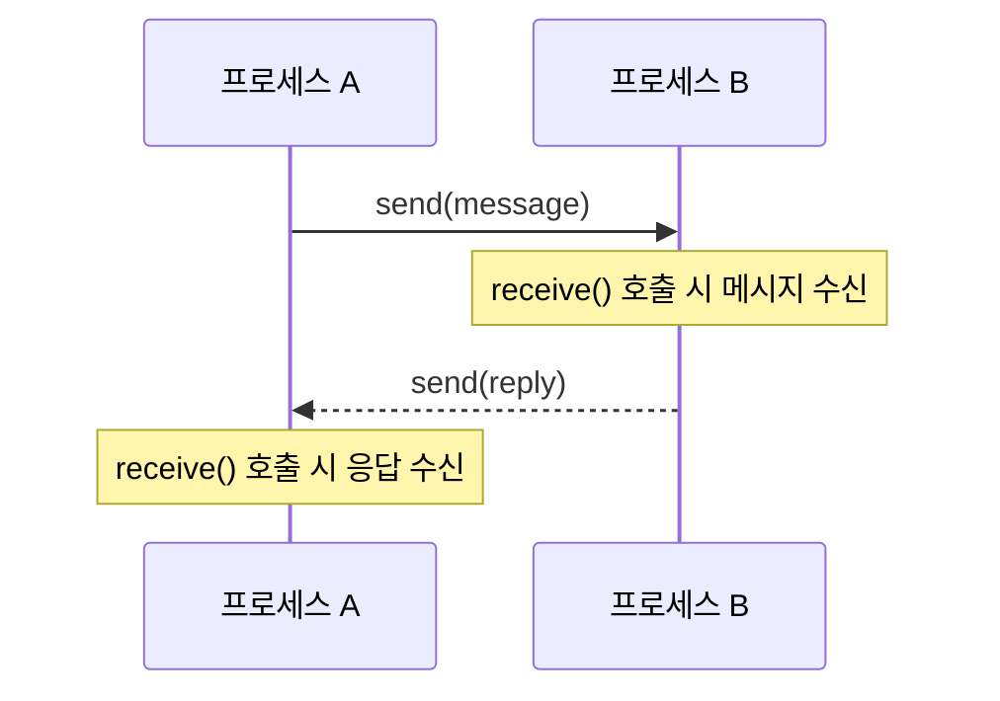

<Callout type="info">
  **이번 문서의 목표:** 이 문서를 다 읽으면 경쟁 상태(race condition)가 왜 생기는지 실행 순서 표로 설명할 수 있고, 세마포어·모니터·메시지 전달이 이 문제를 각각 어떻게 해결하는지, 그리고 언어가 이 기법을 문법 요소로 지원할 때와 라이브러리로만 제공할 때의 차이를 비교할 수 있다.
</Callout>

## 왜 병행성이 프로그래밍언어론의 문제인가

05편(병행성·예외 처리 개념 지도)에서 프로세스(process)·스레드(thread)·병행성(concurrency)의 기본 용어를 정리했다. 이 편은 "여러 실행 흐름이 동시에 공유 자원에 접근할 때 생기는 문제를 언어가 어떤 문법·라이브러리 장치로 막아 주는가"를 다룬다. 병행성 자체는 운영체제 과목의 핵심 주제이기도 하지만, **프로그래밍언어론에서는 그 동기화 기법이 언어의 문법 요소(키워드·구문)로 통합되어 있는지, 아니면 라이브러리 호출로만 제공되는지**를 구분하는 것이 시험 포인트다.

> **쉽게 말하면:** 운영체제 과목이 "커널이 스레드를 어떻게 스케줄링하는가"를 본다면, 프로그래밍언어론은 "언어가 개발자에게 '여기서부터 여기까지는 한 스레드만 들어오시오'라고 말할 수 있는 문법을 주는가"를 본다.

## 경쟁 상태(race condition)와 임계 구역(critical section) 문제

두 스레드가 공유 변수 `balance`(잔액)를 동시에 수정하는 상황을 생각해 보자. `balance += 100`이라는 한 줄의 코드도 실제로는 세 단계(읽기 → 더하기 → 쓰기)로 나뉘어 실행된다. 두 스레드가 이 단계를 겹쳐서 실행하면 어떤 문제가 생기는지 표로 추적해 보자. 초기 `balance = 1000`이고, 스레드 A와 B가 각각 `balance += 100`을 동시에 실행한다고 하자.

| 시각 | 스레드 A | 스레드 B | balance 값 |
|------|----------|----------|-------------|
| t1 | `balance` 읽기(1000) | - | 1000 |
| t2 | - | `balance` 읽기(1000) | 1000 |
| t3 | 1000 + 100 = 1100 계산 | - | 1000 |
| t4 | - | 1000 + 100 = 1100 계산 | 1000 |
| t5 | `balance`에 1100 쓰기 | - | 1100 |
| t6 | - | `balance`에 1100 쓰기 | 1100 |

두 스레드가 각각 100씩 더했으므로 정상적으로는 `1000 + 100 + 100 = 1200`이 되어야 하지만, 결과는 **1100**이다. B가 A의 쓰기 이전 값(1000)을 읽어서 계산했기 때문에 A의 갱신이 사라져 버렸다. 이렇게 **여러 실행 흐름이 공유 자원에 대해 겹쳐서 접근한 순서에 따라 결과가 달라지는 현상**을 경쟁 상태(race condition)라 하고, 이 문제가 발생할 수 있는 코드 구간(여기서는 `balance` 읽기·계산·쓰기 세 줄)을 **임계 구역**(critical section)이라 한다.

> **자주 틀리는 점:** "경쟁 상태는 스레드가 많을 때만 생긴다"고 오해하기 쉽지만, 스레드가 두 개만 있어도 실행 순서가 겹치면 언제든 발생한다. 문제의 원인은 스레드 개수가 아니라 **공유 자원에 대한 접근이 원자적(atomic, 중간에 끼어들 수 없는 단위)이지 않다**는 데 있다.

임계 구역 문제를 해결하려면 다음 세 조건을 만족해야 한다.

1. **상호 배제(mutual exclusion)**: 한 순간에 하나의 실행 흐름만 임계 구역에 들어갈 수 있다.
2. **진행(progress)**: 임계 구역이 비어 있으면, 들어가려는 실행 흐름 중 하나가 무한정 기다리지 않고 들어갈 수 있어야 한다.
3. **한정 대기(bounded waiting)**: 한 실행 흐름이 임계 구역에 들어가기 위해 기다리는 횟수에 상한이 있어야 한다(굶주림 방지).

## 세마포어(semaphore): 카운터 기반의 저수준 동기화

세마포어는 1965년 에츠허르 데이크스트라(Edsger Dijkstra)가 제안한 동기화 도구로, **정수 카운터**와 그 카운터에 대한 두 개의 원자적 연산으로 구성된다.

- `wait(S)` (또는 `P(S)`): 카운터 `S`를 확인해 0보다 크면 1 감소시키고 통과, 0이면 0보다 커질 때까지 대기.
- `signal(S)` (또는 `V(S)`): 카운터 `S`를 1 증가시키고, 대기 중인 스레드가 있으면 하나를 깨운다.

상호 배제를 위해 세마포어를 카운터 값 1로 초기화한 **이진 세마포어**(binary semaphore)를 쓰면 다음과 같이 임계 구역을 감쌀 수 있다.

```text
S = 1  (초기값)

스레드 A                     스레드 B
wait(S)   // S: 1 → 0, 통과
  임계 구역 실행 중...
                              wait(S)   // S가 0이므로 대기
signal(S) // S: 0 → 1, B를 깨움
                              wait(S)에서 깨어남, S: 1 → 0, 통과
                                임계 구역 실행 중...
                              signal(S) // S: 0 → 1
```

| 단계 | 스레드 A | 스레드 B | S 값 |
|------|----------|----------|------|
| 초기 | - | - | 1 |
| 1 | `wait(S)` 성공, 임계 구역 진입 | - | 0 |
| 2 | - | `wait(S)` 시도 → S=0이므로 대기 | 0 |
| 3 | 임계 구역 종료, `signal(S)` | - | 1 |
| 4 | - | 대기 해제, `wait(S)` 성공, 임계 구역 진입 | 0 |
| 5 | - | 임계 구역 종료, `signal(S)` | 1 |

이 표에서 B는 A가 `signal(S)`를 호출하기 전까지 임계 구역에 들어가지 못하고 대기했다. 이렇게 카운터 하나로 상호 배제를 강제하는 것이 세마포어의 핵심이다. 세마포어는 카운터를 여러 개의 자원(예: 프린터 3대)에도 쓸 수 있어, 초기값을 3으로 두면 **동시에 최대 3개까지 접근을 허용하는 계수 세마포어**(counting semaphore)로도 쓸 수 있다.

> **자주 틀리는 점(치명적 함정)**: 세마포어는 `wait`와 `signal`을 **프로그래머가 직접, 올바른 위치에 짝을 맞춰** 호출해야 한다. 언어나 컴파일러가 강제하지 않는다. `wait(S)`를 호출한 뒤 `signal(S)`를 빠뜨리면(예: 예외가 발생해 그 줄을 건너뛰면) 다른 스레드가 영원히 대기하는 교착 상태(deadlock)가 된다. 이것이 세마포어가 "저수준(low-level)" 도구로 분류되는 이유이며, 다음에 볼 모니터가 이 문제를 언어 차원에서 해결하려 한 시도다.

## 모니터(monitor): 언어가 상호 배제를 자동으로 보장

모니터는 1970년대에 C. A. R. 호어(Hoare)와 한센(Brinch Hansen)이 제안한 개념으로, **공유 데이터와 그 데이터를 다루는 프로시저(procedure)를 하나의 프로그램 단위(모듈·클래스)로 묶고, 그 단위 안의 프로시저는 한 번에 하나의 스레드만 실행하도록 언어(또는 런타임)가 자동으로 보장**하는 구조다. 17편에서 다룬 캡슐화 개념이 병행성 문제에 적용된 것이라 볼 수 있다.



이 그림에서 스레드 A와 B가 동시에 `deposit`이나 `withdraw`를 호출해도, 모니터는 **진입 큐**(entry queue)에서 한 번에 하나만 통과시킨다. 세마포어와 달리 프로그래머가 `wait`/`signal`을 직접 호출할 필요가 없다 — 모니터의 프로시저를 호출하는 것 자체가 자동으로 상호 배제를 보장한다.

모니터 안에서 "조건이 맞을 때까지 기다려야 하는" 상황(예: 잔액이 부족해 출금을 기다려야 함)을 처리하려면 **조건 변수**(condition variable)를 쓴다. 조건 변수의 `wait`는 그 스레드를 재우면서 **모니터의 잠금을 잠시 풀어 주고**(다른 스레드가 들어올 수 있게), `signal`은 대기 중인 스레드를 깨운다. 이 지점이 세마포어의 `wait`/`signal`과 이름은 같지만 역할이 다르다는 것에 주의해야 한다 — 세마포어의 `wait`는 카운터를 감소시키는 연산이고, 모니터 조건 변수의 `wait`는 "조건이 만족될 때까지 재우는" 연산이다.

| 구분 | 세마포어 | 모니터 |
|------|----------|--------|
| 상호 배제 보장 주체 | 프로그래머(wait/signal을 올바르게 짝지어야 함) | 언어/런타임(모니터 진입 자체가 자동으로 배제됨) |
| 문법적 위치 | 함수 호출(라이브러리) | 클래스/모듈 문법 요소(언어 통합, 예: Java의 synchronized) |
| 실수 위험 | signal 누락 시 교착 상태 위험이 큼 | 언어가 잠금 해제를 자동으로 보장해 실수 위험이 낮음 |
| 유연성 | 임의의 동기화 패턴을 자유롭게 구성 가능 | 모니터 구조 안에서만 동기화(구조가 정해져 있어 유연성은 낮지만 안전) |

> **쉽게 말하면:** 세마포어는 "문에 자물쇠를 채워 두고 열쇠를 직접 관리하라"는 방식이고, 모니터는 "건물 자체가 한 번에 한 사람만 들여보내는 회전문 구조로 지어져 있다"는 방식이다.

Java의 `synchronized` 키워드가 모니터 개념을 언어에 통합한 대표 사례다.

```java
class BankAccount {
    private int balance = 1000;

    public synchronized void deposit(int amt) {
        balance += amt;
    }

    public synchronized void withdraw(int amt) {
        balance -= amt;
    }
}
```

`synchronized` 키워드가 붙은 메서드는 한 번에 한 스레드만 실행할 수 있다. 이것이 모니터가 **언어 차원의 문법 요소**로 지원된 예다.

## 메시지 전달(message passing): 공유 메모리 없이 통신하기

세마포어와 모니터는 모두 여러 스레드가 **같은 메모리**(공유 변수)에 접근한다는 전제를 깐다. 메시지 전달은 다른 접근을 취한다 — 실행 흐름들이 **공유 메모리를 아예 두지 않고**, `send`와 `receive`라는 두 연산으로 데이터를 주고받는다.



메시지 전달은 두 가지 방식으로 나뉜다.

- **동기(synchronous, 랑데부 rendezvous 방식)**: `send`를 호출한 쪽이 상대방이 `receive`를 호출해 메시지를 받을 때까지 대기한다.
- **비동기(asynchronous)**: `send`를 호출하면 메시지가 큐에 쌓이고, 보낸 쪽은 즉시 다음 작업을 계속한다.

메시지 전달의 장점은 **공유 변수가 없으므로 경쟁 상태 자체가 원천적으로 생기지 않는다**는 것이다(메시지 큐 자체의 동기화는 언어/런타임이 책임진다). 대신 프로세스 간 통신 비용(메시지 복사·전달)이 공유 메모리 접근보다 더 크다는 단점이 있다. Ada의 `rendezvous`(엔트리 호출), Erlang·Go(고루틴+채널)가 메시지 전달을 언어 차원에서 지원하는 대표 사례다.

| 기법 | 공유 자원 전제 | 대표 언어/문법 | 핵심 위험 |
|------|----------------|----------------|-----------|
| 세마포어 | 공유 변수 + 카운터 | 대부분의 언어에서 라이브러리(POSIX, java.util.concurrent.Semaphore)로 제공 | wait/signal 짝 실수로 인한 교착 상태 |
| 모니터 | 공유 변수 + 자동 잠금 | Java `synchronized`, Ada 보호된 객체(protected object) | 조건 변수 오남용 시 성능 저하 |
| 메시지 전달 | 공유 자원 없음(메시지로만 통신) | Ada rendezvous, Erlang, Go 채널 | 통신 비용, 메시지 순서·유실 관리 |

## 세 기법이 공통으로 해결하려는 것과 언어 설계의 관점

세 기법 모두 궁극적으로는 **상호 배제·진행·한정 대기**라는 임계 구역 문제의 조건을 만족시키려는 시도다. 프로그래밍언어론에서 이 세 기법을 비교할 때 핵심 질문은 "언어가 이 안전성을 프로그래머의 규율(discipline)에 맡기는가, 아니면 문법으로 강제하는가"다. 세마포어는 규율에 맡기는 저수준 도구이고, 모니터와 메시지 전달은 언어(또는 런타임) 차원에서 안전성을 더 많이 보장하려는 고수준 설계다. 이 관점은 07편(언어 평가 기준)에서 다룬 신뢰성(reliability)과 직결된다 — 언어가 안전성을 더 많이 보장할수록 프로그래머의 실수 여지가 줄어든다.

## 핵심 정리

- 경쟁 상태는 공유 자원에 대한 접근이 원자적이지 않을 때 실행 순서에 따라 결과가 달라지는 현상이며, 이를 막아야 하는 코드 구간이 임계 구역이다.
- 임계 구역 문제의 해결 조건은 상호 배제, 진행, 한정 대기 세 가지다.
- 세마포어는 카운터와 `wait`/`signal` 연산으로 동기화하는 저수준 도구로, 프로그래머가 직접 짝을 맞춰야 하며 실수 시 교착 상태 위험이 크다.
- 모니터는 공유 데이터와 프로시저를 한 단위로 묶고 언어(런타임)가 상호 배제를 자동으로 보장하는 고수준 구조이며, Java의 `synchronized`가 대표 사례다.
- 메시지 전달은 공유 메모리 없이 `send`/`receive`로 통신해 경쟁 상태를 원천적으로 없애며, 동기(랑데부)와 비동기 방식이 있다.
- 세 기법의 차이는 안전성 보장 주체가 프로그래머인지 언어(런타임)인지에 있으며, 이는 언어의 신뢰성 설계와 직결된다.

## 마무리 복습

<Quiz
  questionNumber={1}
  question="경쟁 상태(race condition)에 대한 설명으로 가장 정확한 것은?"
  options={['스레드 개수가 3개 이상일 때만 발생하는 현상이다', '공유 자원에 대한 접근이 원자적이지 않을 때, 여러 실행 흐름의 접근 순서에 따라 결과가 달라지는 현상이다', '항상 프로그램을 강제 종료시키는 오류이다', '컴파일 시점에 항상 발견되는 오류이다']}
  correctAnswer={2}
  explanation="경쟁 상태는 공유 자원에 대한 읽기·수정·쓰기 같은 연산이 원자적으로 처리되지 않을 때, 실행 흐름이 겹치는 순서에 따라 결과가 달라지는 현상이다. 스레드 두 개만으로도 발생할 수 있다."
  optionExplanations={['스레드 두 개만으로도 실행 순서가 겹치면 경쟁 상태가 발생할 수 있다.', '정답. 원자적이지 않은 공유 자원 접근과 실행 순서 의존성이 경쟁 상태의 본질이다.', '경쟁 상태는 논리적으로 잘못된 결과를 낳을 뿐 항상 강제 종료를 일으키지는 않는다.', '경쟁 상태는 실행 시점의 스케줄링에 의존하므로 컴파일 시점에 항상 발견되지 않는다.']}
/>

<Quiz
  questionNumber={2}
  question="임계 구역 문제의 해결 조건으로 옳지 않은 것은?"
  options={['상호 배제(mutual exclusion)', '진행(progress)', '한정 대기(bounded waiting)', '최대 성능(maximum performance)']}
  correctAnswer={4}
  explanation="임계 구역 문제의 해결 조건은 상호 배제, 진행, 한정 대기 세 가지다. 성능 최적화는 이 문제의 필수 해결 조건이 아니다."
  optionExplanations={['상호 배제는 임계 구역 문제의 핵심 해결 조건이다.', '진행 조건도 임계 구역 문제의 해결 조건에 포함된다.', '한정 대기(굶주림 방지)도 해결 조건에 포함된다.', '정답. 최대 성능은 임계 구역 문제 해결의 필수 조건이 아니다.']}
/>

<Quiz
  questionNumber={3}
  question="이진 세마포어(binary semaphore)를 이용한 상호 배제에서 wait(S)와 signal(S)에 대한 설명으로 옳은 것은?"
  options={['wait(S)는 카운터를 증가시키고, signal(S)는 카운터를 감소시킨다', 'wait(S)는 카운터가 0보다 크면 감소시키고 통과하며 0이면 대기하고, signal(S)는 카운터를 증가시키며 대기 중인 스레드를 깨운다', 'signal(S)를 호출하지 않아도 다른 스레드는 항상 임계 구역에 들어갈 수 있다', 'wait(S)와 signal(S)는 언어가 자동으로 짝을 맞춰 호출해 준다']}
  correctAnswer={2}
  explanation="wait(S)는 카운터가 0보다 크면 1 감소시키고 통과, 0이면 대기하는 연산이며, signal(S)는 카운터를 1 증가시키고 대기 중인 스레드를 깨우는 연산이다."
  optionExplanations={['wait과 signal의 증가/감소 방향이 반대로 서술되어 있다.', '정답. wait/signal의 동작을 정확히 설명했다.', 'signal이 호출되지 않으면 카운터가 0인 채로 남아 다른 스레드는 계속 대기한다.', 'wait/signal은 프로그래머가 직접 호출해야 하며 언어가 자동으로 짝을 맞춰 주지 않는다.']}
/>

<Quiz
  questionNumber={4}
  question="세마포어가 '저수준(low-level)' 동기화 도구로 분류되는 가장 핵심적인 이유는?"
  options={['세마포어는 카운터를 하나만 가질 수 있기 때문이다', 'wait와 signal을 프로그래머가 직접, 올바른 위치에 짝을 맞춰 호출해야 하며 이를 어기면(예: signal 누락) 교착 상태가 발생할 수 있기 때문이다', '세마포어는 실행 속도가 가장 느리기 때문이다', '세마포어는 커널 모드에서만 동작하기 때문이다']}
  correctAnswer={2}
  explanation="세마포어는 상호 배제의 안전성을 언어나 런타임이 자동으로 보장해 주지 않고 프로그래머의 올바른 wait/signal 호출에 의존하므로 저수준 도구로 분류된다."
  optionExplanations={['세마포어는 계수 세마포어처럼 1보다 큰 초기값도 가질 수 있다.', '정답. 안전성을 프로그래머의 규율에 의존한다는 점이 저수준으로 분류되는 이유다.', '속도만으로 저수준/고수준을 구분하지 않는다.', '세마포어는 사용자 모드 라이브러리로도 널리 제공된다.']}
/>

<Quiz
  questionNumber={5}
  question="모니터(monitor)와 세마포어의 차이로 가장 적절한 것은?"
  options={['모니터는 공유 데이터와 프로시저를 한 단위로 묶고 언어(런타임)가 상호 배제를 자동으로 보장하지만, 세마포어는 프로그래머가 wait/signal을 직접 호출해 관리해야 한다', '모니터와 세마포어는 완전히 동일한 방식으로 동작한다', '세마포어가 모니터보다 항상 더 안전하다', '모니터는 공유 메모리를 전혀 사용하지 않는다']}
  correctAnswer={1}
  explanation="모니터는 언어/런타임이 상호 배제를 자동으로 보장하는 고수준 구조이며, 세마포어는 프로그래머가 직접 wait/signal을 호출해 관리해야 하는 저수준 도구다."
  optionExplanations={['정답. 안전성 보장 주체(언어/런타임 vs 프로그래머)가 두 기법의 핵심 차이다.', '모니터는 자동 잠금, 세마포어는 수동 호출이라는 점에서 동작 방식이 다르다.', '모니터가 실수 위험을 줄여 주므로 일반적으로 세마포어보다 더 안전하다고 평가된다.', '모니터도 공유 데이터를 전제로 하며 그 접근을 자동으로 배제하는 구조다.']}
/>

<Quiz
  questionNumber={6}
  question="메시지 전달(message passing) 방식이 세마포어·모니터 방식과 근본적으로 다른 점은?"
  options={['메시지 전달은 공유 메모리를 전제하지 않고 send/receive로 통신해 경쟁 상태를 원천적으로 없앤다', '메시지 전달도 공유 변수를 반드시 사용해야 한다', '메시지 전달은 세마포어보다 항상 통신 비용이 적다', '메시지 전달은 한 프로세스 안에서만 사용할 수 있다']}
  correctAnswer={1}
  explanation="메시지 전달은 실행 흐름들이 공유 메모리를 두지 않고 send/receive 연산만으로 데이터를 주고받으므로, 공유 자원 접근으로 인한 경쟁 상태 자체가 발생하지 않는다."
  optionExplanations={['정답. 공유 메모리 없이 통신한다는 점이 세마포어·모니터와의 근본적 차이다.', '메시지 전달의 핵심은 공유 변수를 두지 않는다는 데 있다.', '메시지 복사·전달 비용 때문에 공유 메모리 접근보다 오히려 비용이 더 클 수 있다.', '메시지 전달은 서로 다른 프로세스(또는 노드) 간 통신에도 널리 쓰인다.']}
/>

<Quiz
  questionNumber={7}
  question="Java의 synchronized 키워드가 붙은 메서드에 대한 설명으로 가장 적절한 것은?"
  options={['모니터 개념을 언어 문법에 통합한 것으로, 한 번에 한 스레드만 그 메서드를 실행하도록 자동으로 보장한다', '여러 스레드가 동시에 자유롭게 실행할 수 있게 해 준다', 'synchronized는 세마포어의 wait/signal을 프로그래머가 직접 호출하는 것과 동일한 문법이다', 'synchronized는 메시지 전달 방식의 한 종류다']}
  correctAnswer={1}
  explanation="synchronized 키워드는 모니터 개념을 Java 문법에 통합한 것으로, 해당 메서드를 한 번에 한 스레드만 실행하도록 언어 차원에서 자동으로 상호 배제를 보장한다."
  optionExplanations={['정답. synchronized는 모니터의 자동 상호 배제를 언어 문법으로 지원하는 대표 사례다.', 'synchronized는 오히려 동시 실행을 제한해 한 번에 하나의 스레드만 실행하게 한다.', 'synchronized는 프로그래머가 wait/signal을 직접 호출하지 않아도 되므로 세마포어의 수동 호출 방식과 다르다.', 'synchronized는 공유 메모리 기반의 모니터 방식이며 메시지 전달과는 다른 범주다.']}
/>

## 참고 자료

- [국가평생교육진흥원 독학학위제](https://bdes.nile.or.kr) — 프로그래밍언어론 과목의 최신 출제기준과 평가영역을 확인할 수 있는 공식 사이트.
- [Oracle Java Tutorials - Synchronized Methods](https://docs.oracle.com/javase/tutorial/essential/concurrency/syncmeth.html) — Java의 synchronized 키워드가 모니터 방식의 상호 배제를 어떻게 제공하는지 설명하는 공식 문서.
