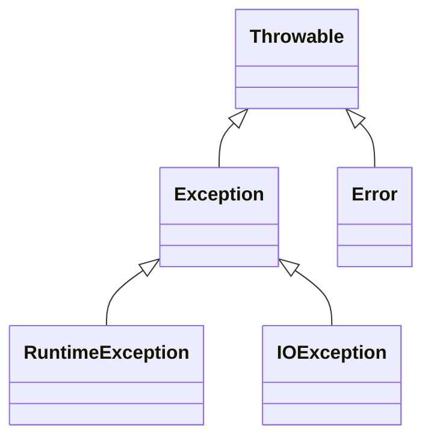
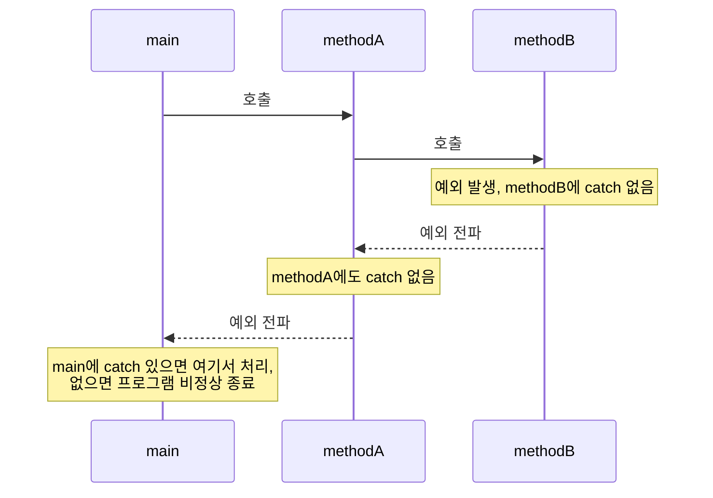
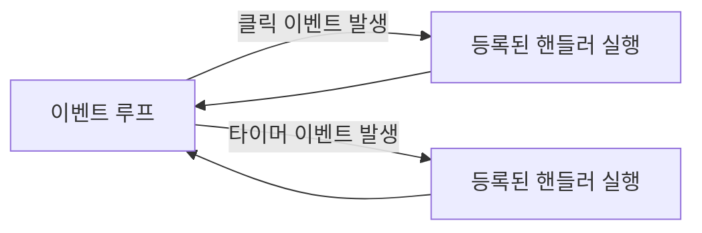

<Callout type="info">
  **이번 문서의 목표:** 이 문서를 다 읽으면 예외(exception)와 에러(error)를 구분할 수 있고, try-catch-finally 코드의 실행 순서를 한 줄씩 추적해 출력을 예측할 수 있으며, 언어별 예외 처리 설계(검사 예외 유무, 자원 해제 방식)와 이벤트 처리 모델의 차이를 설명할 수 있다.
</Callout>

## 왜 예외 처리가 언어 설계의 문제인가

05편(병행성·예외 처리 개념 지도)에서 예외(exception)를 "정상적인 실행 흐름을 벗어나는 예기치 않은 상황"이라고 정의했다. 만약 언어에 예외 처리 문법이 없다면, 프로그래머는 함수마다 반환값으로 오류 코드를 전달하고 호출부마다 매번 그 코드를 검사해야 한다(C언어의 전통적인 방식). 이 방식은 오류 검사를 빠뜨리기 쉽고, 정상 로직과 오류 처리 로직이 코드에서 뒤섞여 가독성이 떨어진다. 예외 처리는 **정상 흐름과 오류 처리 흐름을 문법적으로 분리**하는 언어 차원의 해결책이다.

> **쉽게 말하면:** 반환값으로 오류를 전달하는 방식은 "모든 문마다 경보기가 울렸는지 일일이 확인하고 다니는 것"이고, 예외 처리는 "경보기가 울리면 자동으로 지정된 대응반(핸들러)에게 신호가 전달되는 것"이다.

## 예외(exception)와 에러(error)의 구분

시험에서 자주 혼동을 유도하는 두 용어를 먼저 정리한다.

- **예외(exception)**: 프로그램 실행 중 발생하는, **처리하면 프로그램이 계속 실행될 수 있는** 비정상 상황. 예를 들어 배열 인덱스 범위 초과, 0으로 나누기, 파일을 찾을 수 없음 등이다.
- **에러(error)**: 일반적으로 **프로그램 코드로는 복구하기 어려운** 심각한 문제. 예를 들어 메모리 부족(OutOfMemoryError), 스택 오버플로 등 시스템 자원 고갈이나 가상 머신 자체의 문제다.

Java는 이 구분을 언어의 클래스 계층으로 명시한다.



`Throwable`(던질 수 있는 것)을 최상위로 두고, `Exception`(복구 가능한 예외)과 `Error`(복구가 어려운 심각한 문제)로 나눈다. `Exception`은 다시 **검사 예외**(checked exception)와 **비검사 예외**(unchecked exception, `RuntimeException`의 자손)로 나뉜다.

## 검사 예외 vs 비검사 예외 — Java 특유의 설계

Java는 다른 주류 언어(C++, C#, Python 등)와 달리 **검사 예외**라는 독특한 개념을 문법으로 강제한다.

- **검사 예외(checked exception)**: 메서드가 발생시킬 수 있는 예외를 `throws` 절에 명시해야 하며, 그 메서드를 호출하는 쪽은 반드시 `try-catch`로 처리하거나 다시 `throws`로 전파해야 한다. **컴파일러가 처리 여부를 검사한다.** 예: `IOException`.
- **비검사 예외(unchecked exception)**: `RuntimeException`을 상속한 예외로, 처리를 강제하지 않는다. 컴파일러가 검사하지 않는다. 예: `NullPointerException`, `ArrayIndexOutOfBoundsException`.

```java
import java.io.IOException;

class FileReaderExample {
    // 검사 예외: throws를 명시하지 않으면 컴파일 오류
    void readFile() throws IOException {
        throw new IOException("파일을 찾을 수 없음");
    }

    // 비검사 예외: throws 명시 없이도 컴파일 가능
    void divide(int a, int b) {
        int result = a / b;  // b가 0이면 ArithmeticException(비검사 예외) 발생
    }
}
```

> **자주 틀리는 점:** "Java의 모든 예외는 반드시 catch해야 한다"는 오답이 자주 나온다. **검사 예외만** 컴파일러가 처리를 강제하며, 비검사 예외(`RuntimeException` 계열)는 처리하지 않아도 컴파일은 통과한다(다만 실행 중 그 예외가 발생하면 프로그램이 비정상 종료될 수 있다). 이 구분은 Java의 설계 선택이며, C++·Python·JavaScript는 검사 예외 개념 자체가 없어 어떤 예외든 처리 여부를 컴파일러가 강제하지 않는다.

## try-catch-finally 실행 흐름을 한 줄씩 추적하기

예외 처리 코드를 읽을 때 가장 많이 틀리는 부분이 `finally` 블록의 실행 시점이다. 다음 코드를 한 줄씩 추적해 보자.

```java
public class Main {
    static int test() {
        try {
            System.out.println("1. try 진입");
            int[] arr = new int[3];
            System.out.println(arr[5]);  // 예외 발생 지점
            System.out.println("2. 이 줄은 실행되지 않음");
            return 100;
        } catch (ArrayIndexOutOfBoundsException e) {
            System.out.println("3. catch 실행: " + e.getMessage());
            return 200;
        } finally {
            System.out.println("4. finally는 항상 실행");
        }
    }

    public static void main(String[] args) {
        int result = test();
        System.out.println("5. 반환값: " + result);
    }
}
```

```text
1. try 진입
3. catch 실행: Index 5 out of bounds for length 3
4. finally는 항상 실행
5. 반환값: 200
```

| 단계 | 실행 위치 | 설명 |
|------|-----------|------|
| 1 | try 블록 시작 | "1. try 진입" 출력 |
| 2 | `arr[5]` 접근 | 배열 길이는 3인데 인덱스 5에 접근 → `ArrayIndexOutOfBoundsException` 발생, 이 시점에서 try 블록의 나머지 코드(주석의 "2번 줄", `return 100`)는 건너뛴다 |
| 3 | catch 블록 | 예외 타입이 일치하므로 catch 실행, "3. catch 실행" 출력, `return 200`으로 반환값 예약 |
| 4 | finally 블록 | **catch에서 return이 예약되어 있어도 finally는 반드시 실행된다.** "4. finally는 항상 실행" 출력 |
| 5 | 실제 반환 | finally 실행이 끝난 뒤에야 catch에서 예약한 200이 실제로 반환됨 |

> **자주 틀리는 점:** "catch 블록에서 return을 만나면 그 즉시 메서드가 종료된다"고 착각해 finally가 생략될 것이라 예측하는 오류가 흔하다. **`finally` 블록은 try/catch 안에 `return`이 있어도, 심지어 처리되지 않은 예외가 다시 던져지는 상황이라도 반드시 실행된다.** 이것이 finally의 존재 이유(자원 해제 등 반드시 수행해야 할 정리 작업 보장)다.

`finally` 안에서 또 `return`을 쓰면 어떻게 될까?

```java
static int trap() {
    try {
        return 1;
    } finally {
        return 2;  // 이 return이 try의 return을 덮어씀
    }
}
```

```text
trap()의 반환값: 2
```

이 경우 `finally`의 `return 2`가 `try`의 `return 1`을 **덮어써 버린다.** 이것이 "finally 안에서 return을 쓰지 말라"는 코딩 규칙이 존재하는 이유이며, 독학사 코드 추론 문제에서 반환값을 묻는 함정으로 자주 나온다.

## 예외 전파(propagation)와 처리되지 않은 예외

예외가 발생한 메서드에 그 예외를 처리할 `catch`가 없으면, 예외는 **호출 스택을 따라 위(호출한 쪽)로 전파**된다. 15편(활성화 레코드)에서 다룬 호출 스택 구조를 떠올리면, 예외 전파는 스택에 쌓인 활성화 레코드를 아래에서 위로 하나씩 "되감으며(unwinding)" 각 단계에 처리할 `catch`가 있는지 확인하는 과정이다.



최상위(`main`)까지 전파됐는데도 처리하는 `catch`가 없으면, 대부분의 언어는 프로그램을 비정상 종료시키고 예외 정보(스택 트레이스)를 출력한다.

## 언어별 예외 처리 설계 비교

| 언어 | 검사 예외 개념 | 자원 해제 관용구 | 특이사항 |
|------|----------------|-------------------|----------|
| Java | 있음(`throws` 명시 강제) | `try-with-resources`(자동으로 `close()` 호출) | 검사/비검사 예외 구분이 언어 설계의 핵심 특징 |
| C++ | 없음(모든 예외가 사실상 비검사) | RAII(Resource Acquisition Is Initialization, 객체 소멸자에서 자원 해제) | `throw` 명세(`noexcept` 등)는 있으나 컴파일러가 처리를 강제하지 않음 |
| C# | 없음(Java의 검사 예외 개념을 의도적으로 채택하지 않음) | `using` 문(자동으로 `Dispose()` 호출) | 설계자들이 검사 예외가 실무에서 오히려 형식적인 처리(빈 catch)를 유발한다고 판단해 제외 |
| Python | 없음 | `with` 문(컨텍스트 매니저) | 모든 예외가 객체이며 `except`로 다양한 타입을 잡을 수 있음 |

> **쉽게 말하면:** Java는 "위험한 메서드를 쓰려면 반드시 대비하라"고 컴파일러가 강제하는 방식을 선택했고, C++·C#·Python은 "처리는 프로그래머의 판단에 맡긴다"는 방식을 선택했다. 이것은 07편(언어 평가 기준)의 신뢰성 vs 유연성 트레이드오프가 예외 처리 설계에도 그대로 나타난 사례다.

## 이벤트 처리(event handling)와 예외 처리의 관계와 차이

이벤트(event)는 "사용자 클릭, 타이머 만료, 네트워크 응답 도착"처럼 **프로그램 외부(또는 비동기적으로)에서 발생하는 사건**을 말한다. 예외 처리와 이벤트 처리는 둘 다 "정상적인 순차 흐름과 별도로 특정 상황에 반응하는 코드를 등록해 둔다"는 점에서 비슷하지만, 근본적인 차이가 있다.

| 구분 | 예외 처리 | 이벤트 처리 |
|------|-----------|-------------|
| 발생 원인 | 프로그램 실행 중 내부에서 발생(오류·예외 상황) | 외부 입력이나 비동기 신호로 발생(클릭, 타이머 등) |
| 흐름 관계 | 발생 지점과 처리 지점이 같은 호출 스택 안에서 연결(전파) | 발생 지점과 처리 지점이 호출 스택과 무관하게 이벤트 루프로 연결 |
| 처리 후 복귀 | 보통 예외가 발생한 지점으로 되돌아가지 않음(스택이 되감김) | 이벤트 핸들러 실행 후 이벤트 루프로 복귀해 다음 이벤트를 대기 |
| 대표 문법 | `try`/`catch`/`finally` | 이벤트 리스너 등록(예: `addEventListener`, `onClick`) |



이벤트 처리는 이벤트 루프(event loop)가 이벤트 큐를 계속 확인하다가, 이벤트가 발생하면 그에 등록된 핸들러를 호출하고 다시 대기 상태로 돌아가는 구조다. 이 구조는 GUI 프로그래밍이나 JavaScript의 비동기 처리에서 핵심이 되며, 예외 처리처럼 "호출 스택을 따라 전파"되는 구조가 아니라는 점이 시험에서 자주 대조되는 포인트다.

## 핵심 정리

- 예외는 복구 가능한 비정상 상황, 에러는 복구가 어려운 심각한 문제이며 Java는 이를 `Exception`/`Error` 클래스 계층으로 구분한다.
- 검사 예외는 컴파일러가 처리를 강제하고(`throws` 명시), 비검사 예외(`RuntimeException` 계열)는 강제하지 않는다. 이 구분은 Java 특유의 설계다.
- `finally` 블록은 try/catch에 `return`이 있어도 반드시 실행되며, `finally` 안의 `return`은 try/catch의 `return` 값을 덮어쓴다.
- 처리하는 `catch`가 없는 예외는 호출 스택을 따라 위로 전파되며, 최상위까지 처리되지 않으면 프로그램이 비정상 종료된다.
- C++·C#·Python은 검사 예외 개념을 채택하지 않았고, 자원 해제는 각각 RAII·`using`·`with`라는 언어별 관용구로 자동화한다.
- 이벤트 처리는 외부/비동기 신호에 반응하며 이벤트 루프를 통해 처리 후 대기 상태로 복귀한다는 점에서, 호출 스택을 따라 전파되는 예외 처리와 구조적으로 다르다.

## 마무리 복습

<Quiz
  questionNumber={1}
  question="예외(exception)와 에러(error)의 구분으로 가장 적절한 것은?"
  options={['예외는 프로그램 코드로 처리하면 실행을 계속할 수 있는 상황이고, 에러는 메모리 부족처럼 코드로 복구하기 어려운 심각한 문제다', '예외와 에러는 완전히 같은 의미로 시험에서도 구분하지 않는다', '에러는 항상 예외보다 가벼운 문제다', '예외는 컴파일 시점에만 발생하고 에러는 실행 시점에만 발생한다']}
  correctAnswer={1}
  explanation="예외는 처리하면 프로그램이 계속 실행될 수 있는 비정상 상황이고, 에러는 메모리 부족이나 스택 오버플로처럼 일반적으로 코드로 복구하기 어려운 심각한 문제다."
  optionExplanations={['정답. 복구 가능성 여부가 예외와 에러를 구분하는 핵심 기준이다.', 'Java는 Throwable 아래 Exception과 Error를 별도 클래스로 구분한다.', '에러가 오히려 더 심각하고 복구가 어려운 문제로 분류된다.', '둘 다 실행 시점에 발생할 수 있으며 발생 시점으로 구분되지 않는다.']}
/>

<Quiz
  questionNumber={2}
  question="Java의 검사 예외(checked exception)에 대한 설명으로 옳은 것은?"
  options={['RuntimeException을 상속한 예외로 처리를 강제하지 않는다', '메서드가 발생시킬 수 있는 예외를 throws 절에 명시해야 하며, 호출부는 반드시 처리하거나 다시 전파해야 한다는 것을 컴파일러가 검사한다', 'C++과 Python에도 동일한 개념이 있다', '검사 예외는 실행 중에만 발생하고 컴파일러와는 무관하다']}
  correctAnswer={2}
  explanation="검사 예외는 컴파일러가 처리 여부를 검사하는 Java 특유의 개념으로, 메서드는 throws 절에 명시하고 호출부는 try-catch로 처리하거나 다시 throws로 전파해야 한다."
  optionExplanations={['이는 비검사 예외(unchecked exception)에 대한 설명이다.', '정답. 검사 예외는 컴파일러가 처리 여부를 검사하는 Java 특유의 문법 강제 방식이다.', 'C++과 Python은 검사 예외 개념 자체가 없다.', '검사 예외는 컴파일 시점에 처리 여부가 검사된다는 것이 핵심 특징이다.']}
/>

<Quiz
  questionNumber={3}
  question="다음 Java 코드의 실행 결과 마지막에 출력되는 반환값은 무엇인가? (try에서 예외가 발생해 catch에서 return 200을 실행하고, finally 블록이 있는 상황)"
  options={['catch의 return이 실행되기 전에 finally가 먼저 실행되고, finally에 별도 return이 없다면 catch가 예약한 200이 최종 반환값이 된다', 'catch에서 return을 만나는 즉시 메서드가 종료되어 finally는 실행되지 않는다', '항상 finally가 실행되지 않고 무시된다', '컴파일 오류가 발생한다']}
  correctAnswer={1}
  explanation="catch 블록에서 return이 예약되어도 finally 블록은 반드시 실행된 뒤에 실제 반환이 이뤄진다. finally에 별도의 return이 없다면 catch가 예약한 값이 최종 반환값이 된다."
  optionExplanations={['정답. finally는 return이 예약된 상태에서도 반드시 실행되며, 별도 return이 없으면 catch의 반환값이 그대로 쓰인다.', 'finally는 return이 있어도 반드시 실행된다는 것이 예외 처리의 핵심 규칙이다.', 'finally는 반드시 실행되는 블록으로, 무시되는 경우는 예외적 상황을 제외하면 없다.', '이 코드는 문법적으로 정상이며 컴파일 오류가 발생하지 않는다.']}
/>

<Quiz
  questionNumber={4}
  question="try 블록에서 return 1을, finally 블록에서 return 2를 실행하는 메서드가 있다면 최종 반환값은?"
  options={['1', '2', '1과 2 모두 반환된다', '컴파일 오류가 발생한다']}
  correctAnswer={2}
  explanation="finally 블록의 return은 try 블록에서 예약된 return 값을 덮어쓴다. 따라서 이 메서드의 최종 반환값은 2이며, 이는 finally 안에서 return을 쓰지 말아야 하는 대표적인 이유다."
  optionExplanations={['finally의 return이 try의 return을 덮어쓰므로 1은 최종 반환값이 되지 못한다.', '정답. finally의 return이 try의 return을 덮어써 최종 반환값은 2가 된다.', '메서드는 하나의 값만 반환할 수 있으므로 둘 다 반환되는 것은 불가능하다.', '문법적으로 허용되는 코드이며 컴파일은 정상적으로 이뤄진다.']}
/>

<Quiz
  questionNumber={5}
  question="한 메서드에서 발생한 예외를 처리할 catch가 그 메서드 안에 없을 때 일어나는 일로 옳은 것은?"
  options={['예외가 그 자리에서 소멸되어 아무 일도 일어나지 않는다', '예외는 호출 스택을 따라 호출한 쪽(위)으로 전파되며, 최상위까지 처리하는 catch가 없으면 프로그램이 비정상 종료된다', '예외는 자동으로 무시되고 다음 줄부터 실행이 계속된다', '예외는 이벤트 루프에 등록되어 나중에 처리된다']}
  correctAnswer={2}
  explanation="처리할 catch가 없는 예외는 호출 스택을 따라 위로 전파되며, 최상위(main 등)까지 전파됐는데도 처리하는 catch가 없으면 프로그램이 비정상 종료되고 스택 트레이스가 출력된다."
  optionExplanations={['예외는 소멸되지 않고 호출 스택을 따라 전파된다.', '정답. 예외 전파와 최상위에서 처리되지 않았을 때의 비정상 종료를 정확히 설명했다.', '예외가 발생한 지점 이후의 코드는 건너뛰며 자동으로 계속 실행되지 않는다.', '예외 전파는 호출 스택을 따르는 메커니즘으로, 이벤트 루프와는 다른 구조다.']}
/>

<Quiz
  questionNumber={6}
  question="예외 처리와 이벤트 처리의 구조적 차이로 가장 적절한 것은?"
  options={['둘은 완전히 동일한 메커니즘이며 이름만 다르다', '예외 처리는 발생 지점에서 호출 스택을 따라 전파되어 처리되지만, 이벤트 처리는 이벤트 루프가 핸들러를 호출한 뒤 다시 대기 상태로 복귀하는 구조다', '이벤트 처리는 항상 프로그램 내부 오류에서만 발생한다', '예외 처리는 항상 이벤트 루프를 통해서만 이뤄진다']}
  correctAnswer={2}
  explanation="예외는 호출 스택을 따라 전파되어 처리되는 반면, 이벤트는 외부/비동기 신호로 발생해 이벤트 루프가 등록된 핸들러를 호출하고 처리 후 다시 이벤트 대기 상태로 돌아가는 구조를 가진다."
  optionExplanations={['발생 원인과 처리 흐름의 구조가 서로 다르므로 동일한 메커니즘이 아니다.', '정답. 호출 스택 전파(예외)와 이벤트 루프(이벤트)라는 구조적 차이를 정확히 설명했다.', '이벤트는 클릭·타이머처럼 외부 또는 비동기적으로 발생하는 사건을 다룬다.', '예외 처리는 호출 스택을 통해 전파되는 메커니즘이며 이벤트 루프와는 별개의 구조다.']}
/>

<Quiz
  questionNumber={7}
  question="C++·C#·Python이 Java의 검사 예외 개념을 채택하지 않은 이유에 대한 설명으로 가장 타당한 것은?"
  options={['이 언어들은 예외 처리 자체를 지원하지 않기 때문이다', '검사 예외가 실무에서 형식적인 처리(빈 catch 블록 등)를 유발할 수 있다는 판단 등 설계 철학의 차이 때문이다', '이 언어들은 컴파일 단계가 없기 때문이다', '검사 예외는 Java에서도 이미 폐지되었기 때문이다']}
  correctAnswer={2}
  explanation="C#의 설계자들은 검사 예외가 오히려 프로그래머로 하여금 형식적으로 빈 catch 블록을 작성하게 만드는 부작용을 낳는다고 판단해 이 개념을 채택하지 않았으며, 이는 언어 설계 철학의 차이를 보여 주는 대표 사례다."
  optionExplanations={['C++·C#·Python 모두 try-catch 형태의 예외 처리를 지원한다.', '정답. 형식적 처리 유발 등 설계 철학상의 이유로 검사 예외를 의도적으로 채택하지 않았다.', 'C++·C#은 컴파일 언어이며 컴파일 단계가 존재한다.', '검사 예외는 Java에서 현재도 유지되고 있는 언어 특징이다.']}
/>

## 참고 자료

- [국가평생교육진흥원 독학학위제](https://bdes.nile.or.kr) — 프로그래밍언어론 과목의 최신 출제기준과 평가영역을 확인할 수 있는 공식 사이트.
- [Oracle Java Tutorials - Exceptions](https://docs.oracle.com/javase/tutorial/essential/exceptions/index.html) — 검사/비검사 예외, try-catch-finally 실행 순서에 대한 공식 문서.
