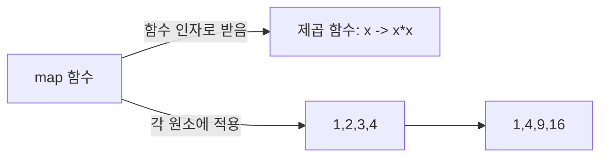

<Callout type="info">
  **이번 문서의 목표:** 이 파일을 다 읽으면 함수형 프로그래밍이 명령형 프로그래밍과 근본적으로 무엇이 다른지 설명할 수 있고, 순수 함수·부작용·고차 함수·불변성이라는 핵심 용어를 정의와 예시로 구분할 수 있으며, 대표 함수형 언어의 특징을 시험 수준에서 답할 수 있다.
</Callout>

## 함수형 프로그래밍은 왜 다르게 생각하라고 하는가

06편에서 패러다임을 명령형·객체지향·함수형·논리형으로 나눴다. 지금까지 이 과목에서 다룬 예제 대부분은 명령형(imperative) 관점이었다. 명령형 프로그래밍은 "변수 `x`에 5를 대입하고, 그다음 `x`를 1 증가시키고, 그다음..." 처럼 **컴퓨터에게 수행할 명령을 순서대로 지시**하는 방식이다. 이때 변수는 시간이 지나면서 값이 바뀌는 상자이고, 프로그램의 상태(state)는 그 상자들의 값이 계속 변해 가는 과정이다.

함수형 프로그래밍(functional programming)은 이 발상 자체를 바꾼다. 프로그램을 "무엇을 계산할 것인가"라는 **수학 함수의 조합**으로 표현하고, 원칙적으로 변수의 값을 나중에 바꾸는 대입(assignment) 자체를 피한다. 수학에서 `f(x) = x + 1`이라는 함수는 `x`가 3이면 항상 4를 내놓고, 이 관계 자체가 절대 변하지 않는다. 함수형 프로그래밍은 프로그램도 이런 수학 함수처럼 "입력이 같으면 출력도 항상 같다"는 성질을 최대한 지키려 한다.

> **쉽게 말하면:** 명령형이 "이렇게 저렇게 하라"고 순서를 지시하는 요리 레시피라면, 함수형은 "완성된 요리는 재료들을 이런 함수에 통과시킨 결과"라고 재료와 함수의 관계로 요리를 정의하는 것과 같다.

## 람다 표현식과 람다 계산의 직관

함수형 프로그래밍의 뿌리는 수학자 알론조 처치(Alonzo Church)가 만든 **람다 계산**(lambda calculus)이라는 수학 이론이다. 독학사 시험은 람다 계산의 수학적 증명까지 요구하지 않고, 그 핵심 아이디어인 **람다 표현식**(lambda expression)의 의미를 이해했는지만 확인한다.

람다 표현식은 이름을 붙이지 않고 그 자리에서 바로 정의하는 함수를 뜻한다. "입력값 `x`를 받아 `x + 1`을 돌려주는 함수"를 수학 표기법으로는 다음과 같이 쓴다.

$$
\lambda x . \, x + 1
$$

- $\lambda$ (람다, 그리스 문자): "지금부터 함수를 정의하겠다"는 표시다.
- $x$: 이 함수가 받는 매개변수(입력값) 이름이다.
- 점(`.`) 뒤: 이 함수의 본체, 즉 입력을 받아 실제로 계산하는 식이다.

이 함수에 실제 값 3을 넣는 것을 **적용**(application)이라 하고, $(\lambda x . \, x + 1)\,3$처럼 쓰며 결과는 4다. 프로그래밍 언어에서는 이를 이름 없는 함수(익명 함수, anonymous function)라 부르고, 예를 들어 파이썬의 `lambda x: x + 1`, 자바스크립트의 `(x) => x + 1`이 이 개념을 그대로 문법으로 구현한 것이다. 핵심은 "함수를 마치 값처럼 그 자리에서 만들어 바로 쓸 수 있다"는 아이디어이며, 이것이 다음 절의 고차 함수를 가능하게 하는 토대다.

> **자주 틀리는 점:** "람다 표현식은 함수형 언어에만 있는 특수 문법"이라고 오해하기 쉽지만, 최근에는 자바·C++ 같은 명령형·객체지향 언어도 람다 표현식 문법을 빌려 왔다. 시험에서 중요한 것은 문법이 아니라 "이름 없이 함수를 값처럼 정의해 즉시 쓴다"는 개념이다.

## 순수 함수와 부작용

함수형 프로그래밍에서 가장 중요한 성질은 **순수 함수**(pure function)다. 순수 함수는 다음 두 조건을 모두 만족하는 함수다.

1. 같은 입력을 넣으면 언제 호출하든 항상 같은 출력을 내놓는다(참조 투명성, referential transparency).
2. 함수를 실행하는 동안 자신이 받은 입력 외의 어떤 것도 바꾸지 않는다. 즉 전역 변수를 바꾸거나, 화면에 출력하거나, 파일에 쓰거나, 매개변수로 받은 자료구조의 내용을 직접 변경하는 일이 없다.

이 두 조건 중 하나라도 깨는 동작을 **부작용**(side effect)이라 부른다. 예를 들어 아래 의사코드를 보자.

```text
전역변수 총합 = 0

함수 더하기(값):
    총합 = 총합 + 값     // 함수 밖의 전역변수를 바꾼다 -> 부작용
    반환 총합
```

`더하기(값)`은 같은 값을 두 번 넣어도 그때마다 `총합`이 누적되어 있어 반환값이 달라진다. 이는 순수 함수가 아니다. 반면 다음처럼 바꾸면 순수 함수가 된다.

```text
함수 더하기순수(현재총합, 값):
    반환 현재총합 + 값
```

`더하기순수(10, 5)`는 언제 호출하든 항상 15를 돌려주고, 함수 밖의 어떤 것도 건드리지 않는다.

> **쉽게 말하면:** 순수 함수는 "재료(입력)만 보고 결과를 내놓을 뿐, 부엌 밖으로 나가 다른 것을 건드리지 않는 요리사"와 같다.

순수 함수만 쓰면 얻는 이점은 실전적이다. 함수 하나의 동작을 이해하려고 프로그램 전체 상태를 신경 쓸 필요가 없어 **코드를 읽고 테스트하기 쉬워지고**, 실행 순서를 바꾸거나 여러 계산을 동시에 실행해도(병행성, 05·19편) 서로 간섭할 부작용이 없어 **병렬 처리가 안전해진다**.

## 불변성과 고차 함수

### 불변성

함수형 프로그래밍은 변수의 값을 나중에 바꾸는 대입을 피하고, 한 번 값이 정해지면 그 값을 다시는 바꾸지 않는다는 원칙을 지키려 한다. 이 성질을 **불변성**(immutability)이라 부른다. 명령형 언어의 배열처럼 "이 칸의 값을 바꿔라"는 연산 대신, 함수형에서는 "기존 자료구조는 그대로 두고, 원하는 부분만 바뀐 **새 자료구조**를 만들어 낸다."

예를 들어 리스트 `[1, 2, 3]`에서 앞에 0을 붙인 리스트를 만들 때, 명령형이라면 기존 리스트에 원소를 끼워 넣는 연산(원본 변경)을 떠올리기 쉽지만, 함수형 방식은 원본 `[1, 2, 3]`은 그대로 둔 채 `[0, 1, 2, 3]`이라는 **새로운 리스트**를 만든다. 원본을 아무도 몰래 바꾸지 않는다는 보장이 있으므로, 같은 리스트를 여러 함수가 동시에 참조해도 안전하다.

### 고차 함수

**고차 함수**(higher-order function)는 다음 둘 중 하나 이상을 만족하는 함수다.

- 다른 함수를 매개변수로 받는다.
- 함수를 결과값으로 반환한다.

앞서 본 람다 표현식이 "함수를 값처럼 다루는" 토대를 마련해 주었기 때문에, 함수를 다른 함수의 입력이나 출력으로 자유롭게 주고받는 고차 함수가 가능해진다. 흔한 예로 리스트의 모든 원소에 같은 함수를 적용하는 `map`이 있다.

```text
map(제곱, [1, 2, 3, 4])   // 제곱이라는 함수를 map에 인자로 넘긴다
결과: [1, 4, 9, 16]
```

`map`은 "무엇을 계산할지"(제곱 함수)를 매개변수로 받아, "각 원소에 그 계산을 적용한다"는 반복 처리 자체를 대신 해 준다. 이렇게 하면 프로그래머가 반복문의 인덱스를 직접 관리하는 명령형 코드 없이도, "이 리스트의 각 원소에 이 함수를 적용하라"는 의도만 표현하면 된다.



> **자주 틀리는 점:** "고차 함수는 함수형 언어에만 있다"고 생각하기 쉽지만, 자바스크립트의 배열 메서드(`map`, `filter`)나 자바의 스트림(Stream) API처럼 명령형·객체지향 언어도 함수형 아이디어인 고차 함수를 문법으로 흡수했다. 독학사 시험은 "고차 함수의 정의(함수를 인자로 받거나 반환하는 함수)"를 정확히 아는지를 묻지, 특정 언어 문법을 묻지 않는다.

## 대표 함수형 언어 개요

| 언어 | 특징 |
|------|------|
| 리스프(Lisp) | 가장 오래된 함수형 계열 언어 중 하나. 함수와 데이터를 같은 형태(리스트)로 표현하는 것이 특징 |
| ML(Meta Language) | 정적 타입 검사와 형 추론(type inference, 10편)을 함수형 스타일과 결합한 언어. 이후 여러 함수형 언어에 영향을 줌 |
| 하스켈(Haskell) | 순수 함수형(pure functional) 언어의 대표 격. 부작용이 있는 연산(입출력 등)을 모나드(monad)라는 구조로 분리해 다루며, 계산을 실제로 필요할 때까지 미루는 지연 평가(lazy evaluation)를 기본으로 한다 |

독학사 출제기준은 이 언어들의 문법을 세세히 요구하지 않는다. "순수 함수형 언어의 대표 예로 하스켈이 있다", "ML 계열은 정적 타입과 형 추론을 함수형 스타일에 결합했다"처럼 **패러다임과 언어를 올바르게 짝짓는 수준**의 개념 문제로 출제된다.

## 핵심 정리

- 함수형 프로그래밍은 대입으로 상태를 바꾸는 명령형 방식과 달리, 프로그램을 수학 함수의 조합으로 표현하고 값의 변경을 피한다.
- 람다 표현식은 이름 없이 그 자리에서 정의하는 함수이며, 함수를 값처럼 다루는 토대가 되어 고차 함수를 가능하게 한다.
- 순수 함수는 같은 입력에 항상 같은 출력을 내놓고 함수 밖의 어떤 것도 바꾸지 않는 함수이고, 이 조건을 깨는 동작이 부작용이다.
- 불변성은 기존 값을 바꾸지 않고 필요한 부분만 바뀐 새 값을 만드는 원칙이며, 고차 함수는 함수를 인자로 받거나 결과로 반환하는 함수다.
- 리스프·ML·하스켈이 대표적인 함수형 언어이며, 하스켈은 순수 함수형과 지연 평가를 특징으로 한다.

## 마무리 복습

<Quiz
  questionNumber={1}
  question="함수형 프로그래밍의 순수 함수(pure function)가 만족해야 하는 조건으로 옳은 것은?"
  options={['호출할 때마다 전역 변수의 값을 갱신해 상태를 기록해야 한다', '같은 입력에 대해 항상 같은 출력을 내놓고 함수 밖의 것을 바꾸지 않아야 한다', '함수 내부에서 반드시 화면에 결과를 출력해야 한다', '매개변수로 받은 자료구조의 내용을 직접 변경해 반환해야 한다']}
  correctAnswer={2}
  explanation="순수 함수는 참조 투명성을 만족해 같은 입력이면 언제나 같은 출력을 내놓아야 하고, 전역 변수 변경이나 화면 출력, 매개변수 자료구조 변경 같은 부작용을 일으키지 않아야 한다."
  optionExplanations={['전역 변수를 갱신하는 것은 부작용이며, 순수 함수의 정의에 어긋난다.', '정답이다. 참조 투명성과 부작용 없음이 순수 함수의 두 조건이다.', '화면 출력도 함수 밖의 것을 바꾸는 부작용에 해당하므로 순수 함수의 조건이 아니다.', '매개변수로 받은 자료구조를 직접 변경하는 것은 부작용이며 불변성 원칙에도 어긋난다.']}
/>

<Quiz
  questionNumber={2}
  question="고차 함수(higher-order function)의 정의로 옳은 것은?"
  options={['반드시 재귀 호출을 사용하는 함수', '다른 함수를 매개변수로 받거나 함수를 결과값으로 반환하는 함수', '항상 여러 개의 값을 동시에 반환하는 함수', '반드시 전역 변수만 사용하는 함수']}
  correctAnswer={2}
  explanation="고차 함수는 함수를 값처럼 다루어, 다른 함수를 인자로 받거나 함수 자체를 결과값으로 반환하는 함수를 말한다. map처럼 적용할 함수를 인자로 받는 경우가 대표적이다."
  optionExplanations={['재귀 호출 여부는 고차 함수의 정의와 무관하다.', '정답이다. 함수를 인자로 받거나 반환하는 것이 고차 함수의 정의다.', '여러 값을 동시에 반환하는 것은 고차 함수와 직접 관련이 없다.', '전역 변수 사용 여부는 고차 함수의 정의와 무관하며, 오히려 함수형 프로그래밍은 전역 상태 의존을 피하려 한다.']}
/>

<Quiz
  questionNumber={3}
  question="람다 표현식 $\lambda x . \, x + 1$에 대한 설명으로 옳지 않은 것은?"
  options={['이름을 붙이지 않고 그 자리에서 정의하는 익명 함수를 나타낸다', 'x는 이 함수가 받는 매개변수 이름이다', '이 표현식에 3을 적용하면 결과는 4이다', '이 표현식은 반드시 함수형 언어의 문법으로만 작성할 수 있다']}
  correctAnswer={4}
  explanation="람다 표현식이 나타내는 것은 이름 없는 함수를 값처럼 정의하는 개념이며, 이 개념 자체는 함수형 언어 전용이 아니다. 자바, C++, 파이썬처럼 명령형·객체지향 성격이 강한 언어도 람다 표현식 문법을 도입해 쓰고 있다."
  optionExplanations={['옳은 설명이다. 람다 표현식은 이름 없이 즉석에서 정의하는 함수를 뜻한다.', '옳은 설명이다. 점 앞의 x가 매개변수 이름이다.', '옳은 설명이다. x에 3을 대입하면 3+1=4이다.', '정답이다. 람다 표현식 개념은 여러 명령형·객체지향 언어에도 문법으로 채택되어 있으므로 함수형 언어 전용이라는 설명은 옳지 않다.']}
/>

<Quiz
  questionNumber={4}
  question="함수형 프로그래밍에서 강조하는 불변성(immutability)에 대한 설명으로 가장 적절한 것은?"
  options={['기존 자료구조의 특정 값을 직접 찾아가 덮어쓰는 방식을 기본으로 삼는다', '한 번 정해진 값은 다시 바꾸지 않고, 변경이 필요하면 바뀐 내용을 반영한 새 자료구조를 만든다', '모든 변수를 전역 변수로 선언해 어디서나 접근할 수 있게 한다', '프로그램 실행 중 자료구조의 크기가 절대 커지지 않도록 제한한다']}
  correctAnswer={2}
  explanation="불변성은 기존 값을 그대로 두고, 변경이 필요할 때는 원본을 건드리지 않은 채 필요한 부분만 반영한 새로운 값이나 자료구조를 만들어 내는 원칙이다."
  optionExplanations={['기존 값을 직접 덮어쓰는 것은 명령형 방식의 전형적인 대입 연산이며 불변성 원칙과 반대된다.', '정답이다. 원본을 유지하고 새 값을 만드는 것이 불변성의 핵심이다.', '전역 변수 사용 여부는 불변성의 정의와 무관하다.', '자료구조 크기 제한은 불변성과 관련이 없다.']}
/>

<Quiz
  questionNumber={5}
  question="다음 중 순수 함수형(pure functional) 언어의 대표적인 예로 가장 적절한 것은?"
  options={['C', '하스켈(Haskell)', '어셈블리어', '포트란(Fortran)']}
  correctAnswer={2}
  explanation="하스켈은 부작용을 모나드로 분리해 다루고 지연 평가를 기본으로 하는 순수 함수형 언어의 대표적인 예다. C, 어셈블리어, 포트란은 명령형 패러다임에 속하는 언어다."
  optionExplanations={['C는 대입과 순차 실행을 중심으로 하는 명령형 언어다.', '정답이다. 하스켈은 순수 함수형 언어의 대표 예로 꼽힌다.', '어셈블리어는 하드웨어 명령을 직접 다루는 저수준 명령형 표현이다.', '포트란은 과학 계산용으로 설계된 초기 명령형 언어다.']}
/>

<Quiz
  questionNumber={6}
  question="다음 의사코드에서 함수 더하기가 순수 함수가 아닌 이유로 가장 적절한 것은? (코드: 전역변수 총합은 0으로 시작하고, 함수 더하기(값)은 총합을 총합과 값을 더한 값으로 갱신한 뒤 총합을 반환한다)"
  options={['매개변수를 받지 않기 때문이다', '반환값의 자료형이 명확하지 않기 때문이다', '함수 밖의 전역 변수를 변경해 같은 입력에도 호출 시점마다 다른 결과를 낼 수 있기 때문이다', '재귀 호출을 사용하지 않기 때문이다']}
  correctAnswer={3}
  explanation="이 함수는 호출될 때마다 함수 밖에 있는 전역 변수 총합의 값을 바꾼다. 이 때문에 같은 값을 인자로 두 번 넣어도 총합이 누적되어 있어 반환값이 달라지며, 이는 부작용이 있는 함수이므로 순수 함수가 아니다."
  optionExplanations={['이 함수는 값이라는 매개변수를 받으므로 이 설명은 사실과 다르다.', '반환값의 자료형 명확성은 순수 함수 여부와 관련이 없다.', '정답이다. 전역 변수 변경이라는 부작용이 순수 함수 조건을 깨는 이유다.', '재귀 호출 사용 여부는 순수 함수 여부와 무관하다.']}
/>

## 참고 자료

- [국가평생교육진흥원 독학학위제](https://bdes.nile.or.kr)
- [Haskell 공식 문서](https://www.haskell.org/documentation/)
