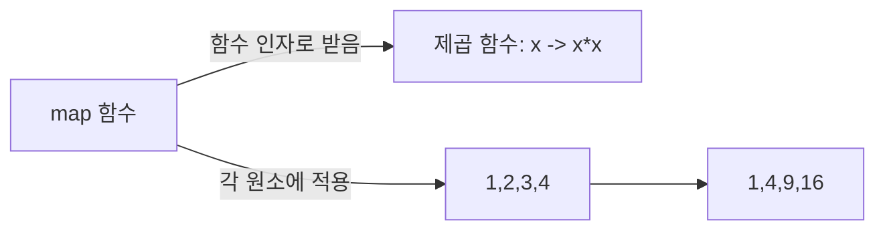

## 함수형 프로그래밍은 왜 다르게 생각하라고 하는가

06편에서 패러다임을 명령형·객체지향·함수형·논리형으로 나눴다. 명령형 프로그래밍은 "변수 `x`에 5를 대입하고, 그다음 `x`를 1 증가시키고, 그다음..." 처럼 **컴퓨터에게 수행할 명령을 순서대로 지시**하는 방식이다.

함수형 프로그래밍(functional programming)은 이 발상 자체를 바꾼다. 프로그램을 "무엇을 계산할 것인가"라는 **수학 함수의 조합**으로 표현하고, 원칙적으로 변수의 값을 나중에 바꾸는 대입(assignment) 자체를 피한다.

## 람다 표현식과 람다 계산의 직관

함수형 프로그래밍의 뿌리는 수학자 알론조 처치(Alonzo Church)가 만든 **람다 계산**(lambda calculus)이라는 수학 이론이다. 독학사 시험은 람다 계산의 수학적 증명까지 요구하지 않고, 그 핵심 아이디어인 **람다 표현식**(lambda expression)의 의미를 이해했는지만 확인한다.

람다 표현식은 이름을 붙이지 않고 그 자리에서 바로 정의하는 함수를 뜻한다. "입력값 `x`를 받아 `x + 1`을 돌려주는 함수"를 수학 표기법으로는 다음과 같이 쓴다.

$$
\lambda x . \, x + 1
$$

- $\lambda$ (람다, 그리스 문자): "지금부터 함수를 정의하겠다"는 표시다.
- $x$: 이 함수가 받는 매개변수(입력값) 이름이다.
- 점(`.`) 뒤: 이 함수의 본체, 즉 입력을 받아 실제로 계산하는 식이다.

이 함수에 실제 값 3을 넣는 것을 **적용**(application)이라 하고, $(\lambda x . 프로그래밍 언어에서는 이를 이름 없는 함수(익명 함수, anonymous function)라 부르고, 예를 들어 파이썬의 `lambda x: x + 1`, 자바스크립트의 `(x) => x + 1`이 이 개념을 그대로 문법으로 구현한 것이다.

> **자주 틀리는 점:** "람다 표현식은 함수형 언어에만 있는 특수 문법"이라고 오해하기 쉽지만, 최근에는 자바·C++ 같은 명령형·객체지향 언어도 람다 표현식 문법을 빌려 왔다. 시험에서 중요한 것은 문법이 아니라 "이름 없이 함수를 값처럼 정의해 즉시 쓴다"는 개념이다.

## 순수 함수와 부작용

함수형 프로그래밍에서 가장 중요한 성질은 **순수 함수**(pure function)다. 순수 함수는 다음 두 조건을 모두 만족하는 함수다.

1. 같은 입력을 넣으면 언제 호출하든 항상 같은 출력을 내놓는다(참조 투명성, referential transparency).
2. 함수를 실행하는 동안 자신이 받은 입력 외의 어떤 것도 바꾸지 않는다. 즉 전역 변수를 바꾸거나, 화면에 출력하거나, 파일에 쓰거나, 매개변수로 받은 자료구조의 내용을 직접 변경하는 일이 없다.

이 두 조건 중 하나라도 깨는 동작을 **부작용**(side effect)이라 부른다. 예를 들어 아래 의사코드를 보자.

```text
전역변수 총합 = 0

함수 더하기(값):
    총합 = 총합 + 값     // 함수 밖의 전역변수를 바꾼다 -> 부작용
    반환 총합
```

`더하기(값)`은 같은 값을 두 번 넣어도 그때마다 `총합`이 누적되어 있어 반환값이 달라진다. 이는 순수 함수가 아니다. 반면 다음처럼 바꾸면 순수 함수가 된다.

```text
함수 더하기순수(현재총합, 값):
    반환 현재총합 + 값
```

`더하기순수(10, 5)`는 언제 호출하든 항상 15를 돌려주고, 함수 밖의 어떤 것도 건드리지 않는다.

순수 함수만 쓰면 얻는 이점은 실전적이다. 함수 하나의 동작을 이해하려고 프로그램 전체 상태를 신경 쓸 필요가 없어 **코드를 읽고 테스트하기 쉬워지고**, 실행 순서를 바꾸거나 여러 계산을 동시에 실행해도(병행성, 05·19편) 서로 간섭할 부작용이 없어 **병렬 처리가 안전해진다**.

## 불변성과 고차 함수

### 불변성

함수형 프로그래밍은 변수의 값을 나중에 바꾸는 대입을 피하고, 한 번 값이 정해지면 그 값을 다시는 바꾸지 않는다는 원칙을 지키려 한다. 이 성질을 **불변성**(immutability)이라 부른다.

예를 들어 리스트 `[1, 2, 3]`에서 앞에 0을 붙인 리스트를 만들 때, 명령형이라면 기존 리스트에 원소를 끼워 넣는 연산(원본 변경)을 떠올리기 쉽지만, 함수형 방식은 원본 `[1, 2, 3]`은 그대로 둔 채 `[0, 1, 2, 3]`이라는 **새로운 리스트**를 만든다. 원본을 아무도 몰래 바꾸지 않는다는 보장이 있으므로, 같은 리스트를 여러 함수가 동시에 참조해도 안전하다.

### 고차 함수

**고차 함수**(higher-order function)는 다음 둘 중 하나 이상을 만족하는 함수다.

- 다른 함수를 매개변수로 받는다.
- 함수를 결과값으로 반환한다.

앞서 본 람다 표현식이 "함수를 값처럼 다루는" 토대를 마련해 주었기 때문에, 함수를 다른 함수의 입력이나 출력으로 자유롭게 주고받는 고차 함수가 가능해진다. 흔한 예로 리스트의 모든 원소에 같은 함수를 적용하는 `map`이 있다.

```text
map(제곱, [1, 2, 3, 4])   // 제곱이라는 함수를 map에 인자로 넘긴다
결과: [1, 4, 9, 16]
```

`map`은 "무엇을 계산할지"(제곱 함수)를 매개변수로 받아, "각 원소에 그 계산을 적용한다"는 반복 처리 자체를 대신 해 준다. 이렇게 하면 프로그래머가 반복문의 인덱스를 직접 관리하는 명령형 코드 없이도, "이 리스트의 각 원소에 이 함수를 적용하라"는 의도만 표현하면 된다.


```mermaid
graph LR
    A["map 함수"] -->|"함수 인자로 받음"| B["제곱 함수: x -> x*x"]
    A -->|"각 원소에 적용"| C["1,2,3,4"]
    C --> D["1,4,9,16"]
```

> **자주 틀리는 점:** "고차 함수는 함수형 언어에만 있다"고 생각하기 쉽지만, 자바스크립트의 배열 메서드(`map`, `filter`)나 자바의 스트림(Stream) API처럼 명령형·객체지향 언어도 함수형 아이디어인 고차 함수를 문법으로 흡수했다. 독학사 시험은 "고차 함수의 정의(함수를 인자로 받거나 반환하는 함수)"를 정확히 아는지를 묻지, 특정 언어 문법을 묻지 않는다.

## 대표 함수형 언어 개요

| 언어 | 특징 |
|------|------|
| 리스프(Lisp) | 가장 오래된 함수형 계열 언어 중 하나. 함수와 데이터를 같은 형태(리스트)로 표현하는 것이 특징 |
| ML(Meta Language) | 정적 타입 검사와 형 추론(type inference, 10편)을 함수형 스타일과 결합한 언어. 이후 여러 함수형 언어에 영향을 줌 |
| 하스켈(Haskell) | 순수 함수형(pure functional) 언어의 대표 격. 부작용이 있는 연산(입출력 등)을 모나드(monad)라는 구조로 분리해 다루며, 계산을 실제로 필요할 때까지 미루는 지연 평가(lazy evaluation)를 기본으로 한다 |

독학사 출제기준은 이 언어들의 문법을 세세히 요구하지 않는다. "순수 함수형 언어의 대표 예로 하스켈이 있다", "ML 계열은 정적 타입과 형 추론을 함수형 스타일에 결합했다"처럼 **패러다임과 언어를 올바르게 짝짓는 수준**의 개념 문제로 출제된다.

## 핵심 정리

- 함수형 프로그래밍은 대입으로 상태를 바꾸는 명령형 방식과 달리, 프로그램을 수학 함수의 조합으로 표현하고 값의 변경을 피한다.
- 람다 표현식은 이름 없이 그 자리에서 정의하는 함수이며, 함수를 값처럼 다루는 토대가 되어 고차 함수를 가능하게 한다.
- 순수 함수는 같은 입력에 항상 같은 출력을 내놓고 함수 밖의 어떤 것도 바꾸지 않는 함수이고, 이 조건을 깨는 동작이 부작용이다.
- 불변성은 기존 값을 바꾸지 않고 필요한 부분만 바뀐 새 값을 만드는 원칙이며, 고차 함수는 함수를 인자로 받거나 결과로 반환하는 함수다.
- 리스프·ML·하스켈이 대표적인 함수형 언어이며, 하스켈은 순수 함수형과 지연 평가를 특징으로 한다.

## 마무리 복습

<Quiz
  questionNumber={1}
  question={"함수형 프로그래밍의 순수 함수(pure function)가 만족해야 하는 조건으로 옳은 것은?"}
  options={["호출할 때마다 전역 변수의 값을 갱신해 상태를 기록해야 한다","같은 입력에 대해 항상 같은 출력을 내놓고 함수 밖의 것을 바꾸지 않아야 한다","함수 내부에서 반드시 화면에 결과를 출력해야 한다","매개변수로 받은 자료구조의 내용을 직접 변경해 반환해야 한다"]}
  correctAnswer={2}
  explanation={"순수 함수는 참조 투명성을 만족해 같은 입력이면 언제나 같은 출력을 내놓아야 하고, 전역 변수 변경이나 화면 출력, 매개변수 자료구조 변경 같은 부작용을 일으키지 않아야 한다."}
/>

<Quiz
  questionNumber={2}
  question={"고차 함수(higher-order function)의 정의로 옳은 것은?"}
  options={["반드시 재귀 호출을 사용하는 함수","다른 함수를 매개변수로 받거나 함수를 결과값으로 반환하는 함수","항상 여러 개의 값을 동시에 반환하는 함수","반드시 전역 변수만 사용하는 함수"]}
  correctAnswer={2}
  explanation={"고차 함수는 함수를 값처럼 다루어, 다른 함수를 인자로 받거나 함수 자체를 결과값으로 반환하는 함수를 말한다. map처럼 적용할 함수를 인자로 받는 경우가 대표적이다."}
/>

<Quiz
  questionNumber={3}
  question={"람다 표현식 $\\lambda x . \\, x + 1$에 대한 설명으로 옳지 않은 것은?"}
  options={["이름을 붙이지 않고 그 자리에서 정의하는 익명 함수를 나타낸다","x는 이 함수가 받는 매개변수 이름이다","이 표현식에 3을 적용하면 결과는 4이다","이 표현식은 반드시 함수형 언어의 문법으로만 작성할 수 있다"]}
  correctAnswer={4}
  explanation={"람다 표현식이 나타내는 것은 이름 없는 함수를 값처럼 정의하는 개념이며, 이 개념 자체는 함수형 언어 전용이 아니다."}
/>

## 참고 자료

- [국가평생교육진흥원 독학학위제](https://bdes.nile.or.kr)
- [Haskell 공식 문서](https://www.haskell.org/documentation/)
