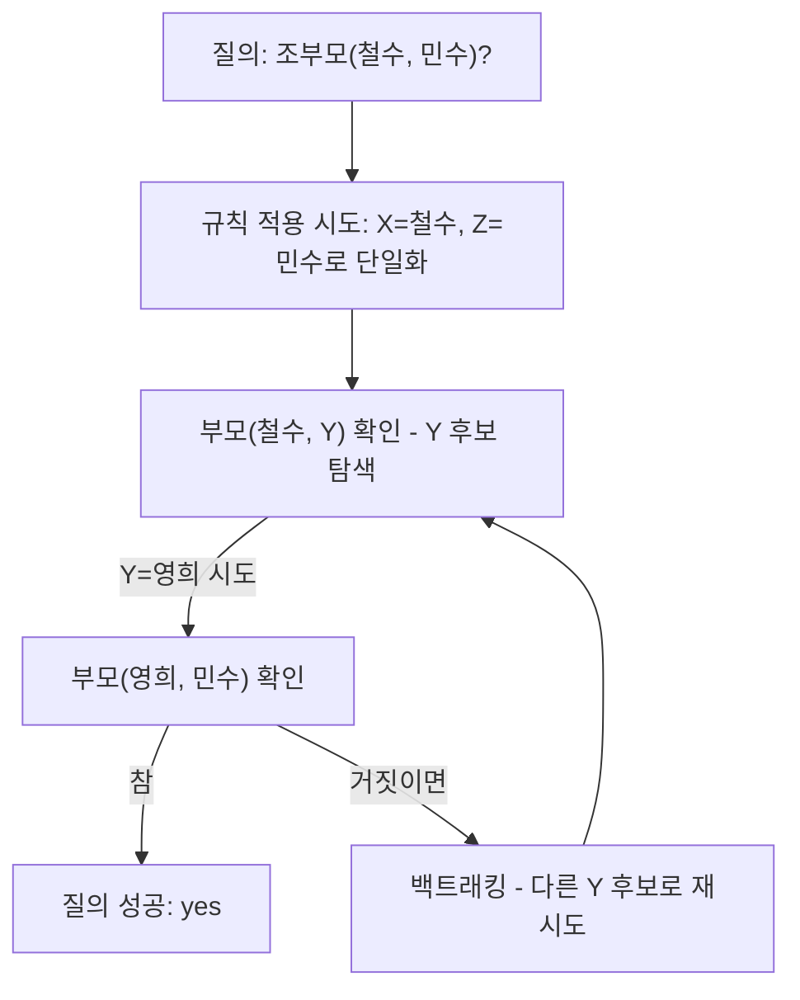

<Callout type="info">
  **이번 문서의 목표:** 이 파일을 다 읽으면 논리형 프로그래밍이 명령형·함수형과 어떻게 다른 방식으로 문제를 표현하는지 설명할 수 있고, Horn 절·사실·규칙·질의라는 Prolog의 기본 구성 요소를 구분하며, 단일화와 백트래킹이 왜 필요한지 개념 수준에서 답할 수 있다.
</Callout>

## 논리형 프로그래밍은 "어떻게"가 아니라 "무엇"을 적는다

지금까지 살펴본 명령형 프로그래밍은 "이렇게 하고, 그다음 저렇게 하라"는 절차를 순서대로 적었고, 22편의 함수형 프로그래밍은 "입력을 이 함수들에 통과시키면 결과가 나온다"는 함수의 조합을 적었다. **논리형 프로그래밍**(logic programming)은 이 둘과도 다르게, 문제 해결 절차를 전혀 적지 않고 대신 **사실**(fact)과 **규칙**(rule)이라는 형태로 "무엇이 참인가"만 선언해 둔다. 그런 다음 특정 조건을 만족하는 답이 있는지 **질의**(query)를 던지면, 논리형 언어의 실행 엔진이 스스로 사실과 규칙을 뒤져 참이 되는 경우를 찾아낸다.

이런 방식을 **선언형 프로그래밍**(declarative programming)이라 부르는데, 함수형도 넓게 보면 선언형에 속하지만 그 안에서 다시 "함수의 조합으로 계산을 선언하는" 함수형과 "논리 규칙으로 사실 관계를 선언하는" 논리형으로 나뉜다.

> **쉽게 말하면:** 명령형이 "역까지 가려면 왼쪽으로 돌고 두 블록 가서 오른쪽으로 돌아라"처럼 길을 알려주는 것이라면, 논리형은 "역은 이 도시 안에 있다", "도시 안에 있는 곳은 걸어서 갈 수 있다"는 사실만 적어 두고 "역까지 갈 수 있는가?"라고 물으면 스스로 답을 찾아내라고 맡기는 것과 같다.

## Horn 절: 논리형 언어가 다루는 문장의 형식

논리형 프로그래밍의 이론적 기반은 **1차 술어 논리**(first-order predicate logic)다. 그런데 일반적인 1차 술어 논리 문장을 모두 자동으로 계산하는 것은 매우 어렵다. 그래서 논리형 언어는 계산하기 쉬운 특별한 형태의 논리식만 다루기로 제한하는데, 이 형태를 **Horn 절**(Horn clause)이라 부른다.

Horn 절은 다음과 같은 모양을 갖는 논리식이다.

$$
A \leftarrow B_1 \land B_2 \land \cdots \land B_n
$$

- $A$: 이 규칙의 머리(head)다. "$B_1$부터 $B_n$까지가 모두 참이면 $A$도 참이다"라고 할 때, 결론에 해당하는 부분이다.
- $\leftarrow$ (역방향 화살표): "왼쪽은 오른쪽으로부터 참임이 유도된다"는 뜻이다. `B이면 A이다`를 논리학에서는 흔히 `A는 B로부터 나온다(A ← B)`라는 방향으로 적는다.
- $B_1, B_2, \ldots, B_n$: 이 규칙의 몸(body)이다. $\land$ (그리고, 논리곱)로 연결된 조건들이며, 이 조건이 모두 참이어야 $A$가 참이 된다.
- $n$이 0이면(몸이 없으면) 이 Horn 절은 조건 없이 항상 참인 **사실**이 된다.

Horn 절의 핵심은 "머리가 하나뿐"이라는 제한이다. 일반적인 논리식은 결론 여러 개를 동시에 담을 수 있지만, Horn 절은 결론을 정확히 하나로 제한함으로써 컴퓨터가 "이 사실이 참인지 아닌지"를 효율적으로 따져 볼 수 있게 만든다. Prolog(Programming in Logic)는 이 Horn 절을 프로그램의 기본 단위로 삼는 대표적인 논리형 언어다.

## 사실·규칙·질의: Prolog 프로그램의 세 요소

Prolog 프로그램은 Horn 절을 크게 두 종류로 나눠 저장해 두고, 사용자가 질의를 던지면 답을 찾는다.

### 사실 (fact)

몸이 없는 Horn 절, 즉 조건 없이 항상 참이라고 선언하는 문장이다. 예를 들어 "철수는 영희의 부모다", "영희는 민수의 부모다"라는 관계를 다음처럼 적는다.

```prolog
부모(철수, 영희).
부모(영희, 민수).
```

`부모(철수, 영희)`는 "철수와 영희 사이에 부모라는 관계가 성립한다(철수가 영희의 부모다)"는 사실을 그대로 선언한 것이다. 이것을 계산하는 절차는 전혀 적혀 있지 않다.

### 규칙 (rule)

몸이 있는 Horn 절이다. "어떤 조건들이 참이면 이것도 참이다"라는 형태로 새로운 관계를 유도한다. 예를 들어 "X가 Y의 부모이고 Y가 Z의 부모이면, X는 Z의 조부모다"를 다음처럼 적는다.

```prolog
조부모(X, Z) :- 부모(X, Y), 부모(Y, Z).
```

- `:-`는 Horn 절의 $\leftarrow$를 문자로 옮긴 것으로, "왼쪽은 오른쪽으로부터 유도된다"는 뜻이다.
- `X`, `Y`, `Z`는 특정 값이 아니라 상황에 따라 어떤 값이든 대입될 수 있는 **변수**다(Prolog에서는 대문자로 시작하는 이름을 변수로 취급한다).
- 콤마(`,`)는 논리곱($\land$, 그리고)을 나타낸다. "부모(X, Y)가 참이고 그리고 부모(Y, Z)가 참이면"이라는 뜻이다.

### 질의 (query)

사용자가 "이것이 참인가?" 또는 "이 조건을 만족하는 값이 무엇인가?"라고 던지는 물음이다. 앞의 사실·규칙이 저장되어 있는 상태에서 다음 질의를 던지면,

```prolog
?- 조부모(철수, 민수).
```

Prolog 실행 엔진은 규칙 `조부모(X, Z) :- 부모(X, Y), 부모(Y, Z).`의 `X`에 철수, `Z`에 민수를 대입해 보고, 그 조건을 만족하는 `Y`(영희)가 사실 목록 안에 있는지 스스로 찾아본 뒤 참(yes)이라고 답한다. 프로그래머는 "조부모 관계를 어떻게 계산하라"는 절차를 한 줄도 적지 않았다는 점이 핵심이다.

## 단일화와 백트래킹: Prolog가 답을 찾는 방법

앞의 질의에서 Prolog가 "어떻게" 답을 찾아내는지, 그 내부 동작을 개념 수준으로 이해해 두어야 한다.

### 단일화 (unification)

**단일화**는 두 논리식(또는 항)을 서로 같아지도록 변수에 값을 맞춰 끼워 넣는 과정이다. 질의 `조부모(철수, 민수)`를 규칙의 머리 `조부모(X, Z)`와 맞춰 보면, `X`는 철수, `Z`는 민수로 값이 정해져야 두 식이 같아진다. 이렇게 변수에 구체적인 값을 대응시켜 두 식을 일치시키는 것이 단일화다.

- 단일화가 성공하면 그 변수는 해당 값으로 정해진 채 다음 단계로 넘어간다(예: `X`=철수, `Z`=민수가 정해진 채로 `부모(X, Y), 부모(Y, Z)`, 즉 `부모(철수, Y), 부모(Y, 민수)`를 확인하는 단계로 진행).
- 단일화가 실패하면(예를 들어 이미 다른 값으로 정해진 변수에 모순되는 값을 맞춰야 하는 경우) 그 시도는 막다른 길이 된다.

### 백트래킹 (backtracking)

여러 사실·규칙 중 어떤 것을 시도했다가 막다른 길에 다다르면, Prolog는 그 시도를 취소하고 **되돌아가 다른 가능성을 다시 시도**한다. 이 되돌아가기 과정을 백트래킹이라 부른다.

예를 들어 `부모(X, Y), 부모(Y, 민수)`에서 `Y`에 영희를 대입해 `부모(철수, 영희)`(참)와 `부모(영희, 민수)`(참)를 모두 만족시키면 성공이다. 만약 첫 번째 시도에서 `Y`에 다른 값을 넣어 `부모(Y, 민수)`가 사실 목록 어디에서도 참이 되지 않는다면, Prolog는 그 `Y` 값 선택을 포기하고 되돌아가 사실 목록에서 다음 후보를 다시 꺼내 시도한다.



> **쉽게 말하면:** 단일화는 "이 조건에 맞으려면 빈칸에 무엇이 들어가야 하는지 맞춰 보는 것"이고, 백트래킹은 "맞춰 봤는데 막히면 방금 선택을 취소하고 다른 후보로 다시 맞춰 보는 것"이다. 미로에서 막다른 길을 만나면 갈림길로 되돌아가 다른 길을 시도하는 것과 같은 원리다.

> **자주 틀리는 점:** "Prolog는 저장된 사실 중 하나라도 맞으면 곧바로 실행을 멈춘다"고 오해하기 쉽지만, 실제로는 하나의 답을 찾은 뒤에도 사용자가 더 많은 답을 요구하면(다른 조부모-손주 관계가 더 있는지) 백트래킹을 계속 진행해 추가 답을 찾을 수 있다. 백트래킹은 실패했을 때만이 아니라 "다른 답도 더 있는가"를 확인할 때도 쓰인다.

## 논리형 언어의 특징과 한계

| 항목 | 내용 |
|------|------|
| 프로그램의 형태 | 사실과 규칙(Horn 절)의 모음, 절차 서술 없음 |
| 실행 방식 | 질의에 대해 단일화와 백트래킹으로 참인 경우를 자동 탐색 |
| 강점 | 관계·규칙이 복잡하게 얽힌 문제(가계도, 규칙 기반 전문가 시스템, 자연어의 문법 규칙 등)를 사실·규칙만으로 간결하게 표현 |
| 한계 | 탐색 대상이 커지면 백트래킹 경로가 급격히 늘어나 비효율적일 수 있고, 수치 계산이나 반복적인 절차 중심 작업은 명령형 언어보다 표현이 부자연스러움 |
| 대표 언어 | Prolog |

독학사 출제기준은 Prolog의 완전한 문법이나 실제 인터프리터 동작을 요구하지 않는다. Horn 절의 형식, 사실·규칙·질의의 구분, 단일화·백트래킹이라는 두 핵심 동작 원리를 개념 수준에서 설명할 수 있으면 충분하다.

## 핵심 정리

- 논리형 프로그래밍은 절차를 적지 않고 사실과 규칙으로 참인 관계를 선언한 뒤, 질의에 답을 실행 엔진이 스스로 찾게 하는 선언형 패러다임이다.
- Horn 절은 머리 하나와 논리곱으로 연결된 몸으로 이루어진 논리식이며, 몸이 없으면 사실, 몸이 있으면 규칙이 된다.
- Prolog 프로그램은 사실과 규칙을 저장해 두고, 질의를 받으면 규칙의 머리와 질의를 맞추는 단일화로 변수 값을 정한다.
- 단일화가 막히면 이전 선택으로 되돌아가 다른 후보를 시도하는 백트래킹으로 답을 탐색하며, 첫 답을 찾은 뒤에도 백트래킹으로 추가 답을 계속 탐색할 수 있다.
- 논리형 언어는 규칙 기반 문제 표현에 강하지만, 탐색 공간이 커지면 비효율적일 수 있고 수치·절차 중심 작업에는 부자연스럽다.

## 마무리 복습

<Quiz
  questionNumber={1}
  question="논리형 프로그래밍의 기본 성격에 대한 설명으로 옳은 것은?"
  options={['문제를 해결하는 절차를 순서대로 명령형 문장으로 적어 나간다', '사실과 규칙으로 참인 관계를 선언하고, 질의에 대한 답은 실행 엔진이 스스로 탐색한다', '값의 변경을 피하고 함수의 조합으로 계산을 표현하는 것을 최우선으로 한다', '클래스와 객체를 이용해 상태와 동작을 하나로 묶어 표현한다']}
  correctAnswer={2}
  explanation="논리형 프로그래밍은 사실과 규칙(Horn 절)의 형태로 참인 관계만 선언해 두고, 특정 질의에 대한 답을 찾는 절차는 프로그래머가 적지 않고 실행 엔진이 단일화와 백트래킹으로 스스로 탐색한다."
  optionExplanations={['이는 명령형 프로그래밍에 대한 설명이다.', '정답이다. 선언된 사실·규칙을 바탕으로 실행 엔진이 답을 탐색하는 것이 논리형 프로그래밍의 핵심이다.', '이는 함수형 프로그래밍에 대한 설명이다.', '이는 객체지향 프로그래밍에 대한 설명이다.']}
/>

<Quiz
  questionNumber={2}
  question="Horn 절의 형식에 대한 설명으로 옳지 않은 것은?"
  options={['머리(head) 부분은 정확히 하나만 가질 수 있다', '몸(body)이 없는 Horn 절은 조건 없이 항상 참인 사실을 나타낸다', '몸에 있는 여러 조건은 논리곱(그리고)으로 연결된다', '하나의 Horn 절은 여러 개의 결론을 동시에 나타낼 수 있다']}
  correctAnswer={4}
  explanation="Horn 절은 결론에 해당하는 머리를 정확히 하나만 갖도록 제한한 논리식이다. 여러 결론을 동시에 나타내는 것은 일반적인 논리식에서는 가능하지만 Horn 절의 정의에는 어긋난다."
  optionExplanations={['옳은 설명이다. 머리가 하나로 제한되는 것이 Horn 절의 정의적 특징이다.', '옳은 설명이다. 몸이 없으면 조건 없이 참인 사실이 된다.', '옳은 설명이다. 몸의 조건들은 논리곱으로 연결된다.', '정답이다. Horn 절은 머리를 하나로 제한하므로 여러 결론을 동시에 나타낼 수 없다.']}
/>

<Quiz
  questionNumber={3}
  question="다음 Prolog 규칙에서 콤마(쉼표)의 의미로 옳은 것은? (규칙: 조부모(X, Z)는 부모(X, Y)와 부모(Y, Z)로부터 유도된다고 정의되어 있고, 두 조건은 쉼표로 연결되어 있다)"
  options={['논리합(또는)을 나타낸다', '논리곱(그리고)을 나타낸다', '단일화의 실패를 나타낸다', '백트래킹의 시작을 나타낸다']}
  correctAnswer={2}
  explanation="Prolog 규칙의 몸에서 콤마는 논리곱을 나타낸다. 부모(X, Y), 부모(Y, Z)는 부모(X, Y)가 참이고 그리고 부모(Y, Z)도 참이어야 한다는 뜻이다."
  optionExplanations={['논리합은 세미콜론 등 다른 표기로 나타내며 콤마의 의미가 아니다.', '정답이다. 콤마는 논리곱, 즉 그리고를 나타낸다.', '콤마 자체는 단일화의 성공이나 실패를 나타내는 표기가 아니다.', '콤마는 조건 연결 기호일 뿐 백트래킹의 시작을 표시하는 것이 아니다.']}
/>

<Quiz
  questionNumber={4}
  question="단일화(unification)에 대한 설명으로 가장 적절한 것은?"
  options={['프로그램 실행 중 발생한 오류를 강제로 무시하고 다음 단계로 넘어가는 과정이다', '두 논리식이 서로 같아지도록 변수에 구체적인 값을 대응시켜 맞추는 과정이다', '여러 프로세스가 자원을 하나씩 순서대로 사용하도록 강제하는 과정이다', '컴파일 시점에 변수의 형을 미리 결정하는 과정이다']}
  correctAnswer={2}
  explanation="단일화는 질의나 규칙의 머리에 있는 항과 다른 항을 비교해, 두 식이 서로 같아지도록 변수에 값을 맞춰 끼워 넣는 과정이다."
  optionExplanations={['오류를 무시하는 것과 단일화는 관련이 없다.', '정답이다. 두 식을 같게 만들도록 변수 값을 맞추는 것이 단일화다.', '자원 사용 순서를 강제하는 것은 병행성 제어와 관련된 내용으로 단일화와 무관하다.', '형을 컴파일 시점에 결정하는 것은 정적 타입 검사와 관련된 내용으로 단일화와 무관하다.']}
/>

<Quiz
  questionNumber={5}
  question="백트래킹(backtracking)에 대한 설명으로 옳지 않은 것은?"
  options={['이전에 선택했던 후보를 취소하고 다른 후보를 다시 시도하는 과정이다', '단일화가 막다른 길에 이르렀을 때 되돌아가는 데 쓰인다', '이미 하나의 답을 찾으면 그 이후로는 절대 다시 실행되지 않는다', '탐색 대상이 매우 크면 비효율적으로 동작할 수 있다']}
  correctAnswer={3}
  explanation="백트래킹은 실패했을 때뿐 아니라, 이미 답을 하나 찾은 뒤에도 사용자가 더 많은 답을 요구하면 다시 진행되어 추가 답을 탐색할 수 있다. 답을 하나 찾으면 절대 다시 실행되지 않는다는 설명은 옳지 않다."
  optionExplanations={['옳은 설명이다. 이전 선택을 취소하고 다른 후보를 시도하는 것이 백트래킹의 정의다.', '옳은 설명이다. 단일화 실패 시 되돌아가는 것이 백트래킹의 대표적인 쓰임이다.', '정답이다. 답을 하나 찾은 뒤에도 추가 답을 요구하면 백트래킹이 다시 진행될 수 있다.', '옳은 설명이다. 탐색 공간이 커지면 백트래킹 경로가 늘어나 비효율적일 수 있다.']}
/>

<Quiz
  questionNumber={6}
  question="논리형 언어의 한계로 가장 적절한 것은?"
  options={['클래스와 상속을 전혀 표현할 수 없다는 점이 유일한 한계다', '탐색 대상이 커지면 백트래킹 경로가 늘어나 비효율적일 수 있고, 절차 중심 작업 표현이 부자연스럽다', '변수를 전혀 사용할 수 없다는 점이 유일한 한계다', '사실과 규칙을 함께 저장할 수 없다는 점이 유일한 한계다']}
  correctAnswer={2}
  explanation="논리형 언어는 관계·규칙 기반 문제 표현에는 강점이 있지만, 탐색해야 할 경우의 수가 많아지면 백트래킹 경로가 급격히 늘어나 비효율적일 수 있고, 수치 계산이나 반복 절차 중심의 작업은 명령형 언어보다 표현하기 부자연스럽다는 한계가 있다."
  optionExplanations={['클래스·상속 표현 가능 여부는 논리형 언어의 핵심 한계로 다뤄지는 부분이 아니다.', '정답이다. 탐색 공간 증가에 따른 비효율과 절차 중심 작업의 부자연스러움이 대표적인 한계다.', 'Prolog는 X, Y, Z 같은 변수를 규칙과 질의에서 자유롭게 사용한다.', 'Prolog 프로그램은 사실과 규칙을 함께 저장해 두는 것이 기본 구조다.']}
/>

## 참고 자료

- [국가평생교육진흥원 독학학위제](https://bdes.nile.or.kr)
- [SWI-Prolog 공식 문서](https://www.swi-prolog.org/pldoc/doc_for?object=manual)
