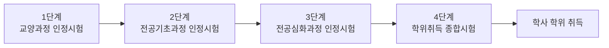
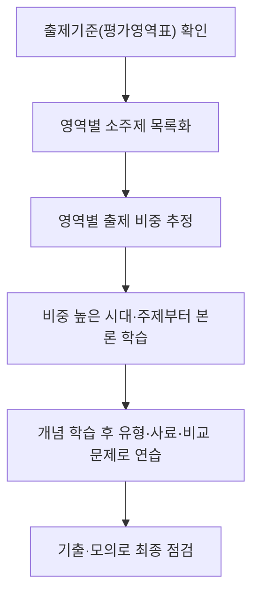

<Callout type="info">
  **이번 문서의 목표:** 독학사 4단계 학위취득 종합시험 안에서 국사 과목이 어떤 위치에 있는지, 합격 기준이 무엇인지, 공식 출제기준(평가영역표)을 어떻게 읽고 학습 계획에 반영하는지 설명할 수 있다.
</Callout>

## 독학사 학위취득 종합시험 체계 다시 보기

> **쉽게 말하면:** 4단계는 1~3단계의 내용을 다시 묻는 시험이 아니라, 학사 학위를 줄 만한 종합적인 역량이 있는지 마지막으로 확인하는 관문이다.

독학사(독학에 의한 학위취득시험)는 정식 명칭이 **독학학위제**다. 국가평생교육진흥원(National Institute for Lifelong Education, 줄여서 **NILE**, 나일)이 주관하며, 대학에 다니지 않아도 단계별 시험을 통과하면 학사 학위를 취득할 수 있는 제도다. 이 시리즈의 독자는 이미 1~3단계를 통과했거나 학점은행제·자격 취득 등으로 면제받고 4단계만 남겨 둔 학습자를 전제로 하므로, 여기서는 전체 체계를 짧게 환기만 하고 곧바로 4단계로 들어간다.

| 단계 | 정식 명칭 | 성격 | 통과 시 인정되는 것 |
|------|-----------|------|----------------------|
| 1단계 | 교양과정 인정시험 | 대학 1–2학년 교양 수준 | 교양과정 이수 |
| 2단계 | 전공기초과정 인정시험 | 전공 기초 수준 | 전공기초과정 이수 |
| 3단계 | 전공심화과정 인정시험 | 전공 심화 수준 | 전공심화과정 이수 |
| 4단계 | 학위취득 종합시험 | 학사 학위 종합 역량 | 학사 학위 취득 |

4단계에 "종합"이라는 말이 붙는 이유는 이 시험이 특정 전공의 세부 지식만 확인하는 것이 아니라, 전공 계열별로 정해진 여러 과목(전공 필수·선택 + 교양 공통)을 함께 응시해 그 전공으로 학위를 받을 사람이 갖추어야 할 폭넓은 이해도를 종합적으로 확인하기 때문이다. 국사는 여러 전공 계열에서 **교양필수 또는 교양선택** 과목으로 지정되는 경우가 많다. "교양"이라는 말은 특정 전공 이론이 아니라 전공에 관계없이 대학 졸업자에게 공통으로 기대되는 인문 소양을 확인한다는 뜻이며, 그래서 국사는 특정 학과의 전공 이론이 아니라 한국사 전 범위에 대한 균형 잡힌 이해를 평가한다.

합격 기준은 독학사 전반에 공통으로 적용되어 온 원칙을 따른다.

- 각 과목을 **100점 만점 60점 이상** 받아야 해당 과목이 합격 처리된다.
- 4단계는 과목별로 개별 채점하므로, 국사만 60점 미만이라면 국사만 불합격 처리되고 다음 회차에 국사만 다시 응시하면 된다(전 과목 재응시가 아니다).
- 국사는 객관식(4지선다) 위주로 구성되며, 회차에 따라 주관식·서술형 문항이 포함될 수 있다. 정의만 외워서는 풀리지 않는, 개념 간 차이를 정확히 아는지 묻는 문항 비중이 높다.

<Callout type="warning">
  회차별 정확한 문항 수, 배점, 시험 시간, 주관식 포함 여부·비중은 **매년(회차별) 공고마다 달라질 수 있다.** 이 문서와 이 시리즈 전체에서 제시하는 수치·형태는 학습 전략을 세우기 위한 일반적인 기준이며, 실제 응시 전에 반드시 국가평생교육진흥원 홈페이지의 최신 시행계획 공고와 응시요강을 확인해야 한다(공고 확인 필요).
</Callout>

## 국사 과목의 시험 형태와 문항 구성

> **쉽게 말하면:** 국사는 객관식으로 개념·사료·비교를 묻고, 주관식이 있다면 서술형으로 개념을 논리적으로 풀어 쓰는 능력까지 확인한다.

국사 시험은 크게 두 유형의 문항으로 구성된다고 보면 된다.

1. **객관식 문항**: 4지선다형이 기본이며, 하나의 정답을 고르는 형태와 "옳지 않은 것", "옳게 짝지어진 것", "시대순으로 바르게 나열한 것"처럼 여러 진술을 동시에 판단해야 하는 형태가 섞여 나온다. 뒤의 03편에서 이 유형들을 자세히 지도로 그린다.
2. **주관식·서술형 문항**: 4단계는 학위취득 종합시험이라는 성격상 단답형·서술형이 포함될 수 있다. 서술형은 특정 사건이나 제도의 배경-전개-결과를 논리적으로 설명하거나, 두 시대·두 제도를 비교해 서술하는 형태로 나올 가능성이 높다. 다만 서술형의 실제 포함 여부와 배점은 회차 공고에 따라 달라지므로, 이 시리즈의 기출·모의 편(22~24편)에서도 서술형 답안 예시를 제시하되 "공고 확인 필요"를 함께 표기한다.

<Callout type="warning">
  국사 과목의 객관식·주관식 문항 비율, 전체 문항 수, 시험 시간은 회차 공고에 명시된다. 이 시리즈는 두 유형 모두에 대비할 수 있도록 개념 설명과 문제 풀이를 함께 구성하지만, 실제 시험의 정확한 구성비는 공고를 통해 확인해야 한다.
</Callout>

## 평가영역·출제기준표 읽는 법

> **쉽게 말하면:** 출제기준표는 "이 과목에서 어떤 주제를, 어느 비중으로 낼지"를 미리 공개한 설계도이므로, 표의 각 칸이 뜻하는 바를 알면 공부할 우선순위가 보인다.

국가평생교육진흥원은 과목마다 **평가영역**을 공개한다. 평가영역표는 보통 다음과 같은 구조로 되어 있다.

| 열 이름 | 의미 |
|---------|------|
| 평가영역 | 큰 주제 단위(예: 고대 사회의 정치와 사회, 근대 국가 수립 운동 등) |
| 평가내용 | 해당 영역에서 구체적으로 다루는 소주제·개념 목록 |
| 출제 방향·수준 | 단순 암기가 아니라 이해·적용·비교·분석 중 어떤 능력을 요구하는지에 대한 설명 |

이 표를 읽을 때 확인해야 할 두 가지가 있다. 첫째, **영역별 비중**이다. 특정 시대(예: 근현대사)의 영역이 여러 줄로 나뉘어 있다면 그만큼 출제 비중이 높다고 해석할 수 있다. 둘째, **평가수준 문구**다. 국가평생교육진흥원이 공식적으로 밝히는 학위취득 종합시험의 평가수준은 "학위를 취득한 사람이 일반적으로 갖추어야 할 소양과 전문지식 및 기술을 종합적으로 평가"하는 것을 목표로 한다. 즉 연표를 그대로 옮겨 적는 수준이 아니라, 사건과 사건, 제도와 제도 사이의 관계를 설명할 수 있는 수준을 요구한다는 뜻이다.

<Callout type="warning">
  평가영역표는 국가평생교육진흥원 자료실 또는 매년의 시행계획 공고문에서 최신본을 직접 확인해야 한다. 표의 세부 항목명·소주제 구성은 개정될 수 있으므로, 이 시리즈의 본론 편 순서(05~17편)는 표준적인 한국사 시대·영역 구성을 따르되, 실제 학습 시에는 최신 출제기준과 대조해 소단원을 보정하는 것을 전제로 한다.
</Callout>

## 핵심 정리

- 4단계 학위취득 종합시험은 전공 계열별 필수·선택 과목을 함께 응시하며, 국사는 여러 전공에서 교양 과목으로 지정된다. 합격 기준은 과목별 100점 만점 60점 이상이며, 과목별 개별 채점·재응시가 원칙이다.
- 국사는 객관식(4지선다) 위주이며 회차에 따라 주관식·서술형이 포함될 수 있다. 정확한 문항 구성·시간은 회차 공고 확인이 필요하다.
- 평가영역표는 "무엇을, 어느 비중으로, 어떤 수준까지" 출제할지 보여주는 설계도다. 영역별 비중과 평가수준 문구를 함께 읽으면 학습 우선순위를 정할 수 있다.
- 이 시리즈는 표준적인 시대·영역 구성을 기준으로 작성되었으며, 실제 응시 전에는 반드시 최신 출제기준과 대조해야 한다.

## 마무리 복습

<Quiz
  questionNumber={1}
  question="독학사 4단계 학위취득 종합시험에 대한 설명으로 옳지 않은 것은?"
  options={['전공 계열별로 정해진 필수·선택 과목을 함께 응시하는 구조다', '각 과목을 100점 만점 60점 이상 받아야 해당 과목이 합격 처리된다', '한 과목이 60점 미만이면 4단계 전체 과목을 처음부터 다시 응시해야 한다', '국사는 여러 전공 계열에서 교양 과목으로 지정되는 경우가 많다']}
  correctAnswer={3}
  explanation="독학사 4단계는 과목별로 개별 채점되어, 불합격한 과목만 다음 회차에 재응시하면 된다. 전 과목을 처음부터 다시 보는 것이 아니다."
  optionExplanations={['옳은 설명이다. 4단계는 전공 계열별 필수·선택 과목을 함께 응시한다.', '옳은 설명이다. 과목별 60점 이상이 합격 기준의 기본 원칙이다.', '틀린 설명이다. 불합격 과목만 재응시하면 되며 전 과목 재응시가 아니다.', '옳은 설명이다. 국사는 여러 전공에서 교양 과목으로 지정된다.']}
/>

<Quiz
  questionNumber={2}
  question="독학사 4단계 국사 시험 형태에 대한 설명으로 가장 적절한 것은?"
  options={['국사는 항상 서술형으로만 출제되며 객관식은 없다', '국사는 객관식 4지선다형이 기본이며 회차에 따라 주관식·서술형이 포함될 수 있다', '국사는 다른 4단계 과목과 달리 합격 기준이 80점 이상이다', '국사는 실기시험만으로 평가된다']}
  correctAnswer={2}
  explanation="국사는 객관식(4지선다) 위주로 구성되며, 회차에 따라 주관식·서술형 문항이 포함될 수 있다."
  optionExplanations={['국사는 객관식이 기본이며 서술형만으로 출제되지 않는다.', '정답이다. 객관식 위주에 회차별로 주관식이 포함될 수 있다.', '4단계 합격 기준은 과목 공통으로 100점 만점 60점 이상이다.', '국사는 필기시험이며 실기시험이 아니다.']}
/>

<Quiz
  questionNumber={3}
  question="독학사 평가영역표(출제기준표)를 읽는 방법으로 가장 적절하지 않은 것은?"
  options={['영역별로 소주제가 여러 줄로 나뉘어 있다면 그만큼 출제 비중이 높다고 볼 수 있다', '평가수준 문구를 통해 단순 암기 이상의 능력을 요구하는지 확인할 수 있다', '한 번 확인한 평가영역표는 향후 모든 회차에 그대로 적용되므로 다시 확인할 필요가 없다', '평가영역표는 최신 시행계획 공고문이나 자료실에서 확인해야 한다']}
  correctAnswer={3}
  explanation="평가영역표의 세부 항목은 개정될 수 있으므로 회차마다 최신본을 다시 확인해야 하며, 한 번 확인했다고 계속 유효하다고 단정할 수 없다."
  optionExplanations={['옳은 해석 방법이다. 소주제 수가 많은 영역은 출제 비중이 높을 가능성이 크다.', '옳은 해석 방법이다. 평가수준 문구는 요구되는 사고 수준을 알려준다.', '틀린 설명이다. 출제기준은 개정될 수 있어 회차마다 최신본을 확인해야 한다.', '옳은 방법이다. 최신 공고문·자료실 확인이 필요하다.']}
/>

<Quiz
  questionNumber={4}
  question="다음 중 독학사 4단계 국사 과목의 성격에 대한 설명으로 가장 적절한 것은?"
  options={['특정 대학의 한국사 전공 세부 이론만을 다룬다', '1~3단계 국사에서 다루지 않은 완전히 새로운 과목이다', '한국사 전 시대·전 영역에 대한 종합적 이해와 개념 간 관계 파악 능력을 확인한다', '연표를 정확히 암기했는지만 확인하는 단순 지식 시험이다']}
  correctAnswer={3}
  explanation="4단계 학위취득 종합시험은 단순 암기가 아니라 개념·제도·사상 사이의 관계를 이해하고 비교·설명할 수 있는 종합적 능력을 평가한다."
  optionExplanations={['특정 대학 전공 세부 이론이 아니라 국가 공식 출제기준에 따른 전 범위를 다룬다.', '4단계는 1~3단계 학습을 전제로 그 위에서 전 범위를 종합·재구성하는 시험이다.', '정답이다. 개념 간 관계와 종합적 이해를 확인하는 시험이다.', '단순 연표 암기만으로는 옳지 않은 것 고르기 유형 등에서 오답을 고르기 쉽다.']}
/>

<Quiz
  questionNumber={5}
  question="독학사 4단계에서 국사 과목만 60점 미만으로 불합격했을 때의 대응으로 옳은 것은?"
  options={['다음 회차에 4단계 전체 과목을 처음부터 다시 응시해야 한다', '국사 과목만 다음 회차에 재응시하면 된다', '국사는 재응시가 불가능하므로 학위 취득이 영구히 불가능해진다', '국사 대신 다른 과목으로 대체해 응시해야 한다']}
  correctAnswer={2}
  explanation="4단계는 과목별로 개별 채점되므로 불합격한 과목만 다음 회차에 재응시하면 된다."
  optionExplanations={['4단계는 과목별 개별 채점이므로 전 과목 재응시가 필요하지 않다.', '정답이다. 불합격 과목만 재응시하는 것이 원칙이다.', '재응시 자체가 불가능한 것은 아니다.', '과목 대체는 임의로 할 수 없으며 해당 과목을 재응시하는 것이 원칙이다.']}
/>

<Quiz
  questionNumber={6}
  question="국가평생교육진흥원이 밝히는 학위취득 종합시험의 평가수준 취지로 가장 적절한 것은?"
  options={['특정 시중 참고서의 목차와 동일한 내용만 출제한다', '학위를 취득한 사람이 갖추어야 할 소양과 지식을 종합적으로 평가한다', '해당 단계 이전 단계에서 출제된 문제를 그대로 반복 출제한다', '암기량이 많을수록 무조건 유리하도록 단순 지식만 나열해 평가한다']}
  correctAnswer={2}
  explanation="공식 평가수준은 학위 취득자가 일반적으로 갖추어야 할 소양과 전문지식·기술을 종합적으로 평가하는 것을 목표로 한다."
  optionExplanations={['출제기준은 특정 시중 참고서가 아니라 국가 공식 출제기준에 근거한다.', '정답이다. 종합적 소양과 전문지식을 평가하는 것이 공식 취지다.', '4단계는 이전 단계 문제를 그대로 반복하지 않는 종합시험이다.', '단순 암기량보다 개념 간 관계·비교·적용 능력을 함께 평가한다.']}
/>

## 참고 자료

- [국가평생교육진흥원 독학학위제](https://bdes.nile.or.kr)
