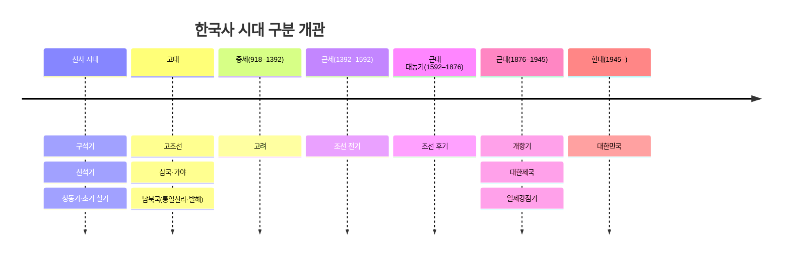
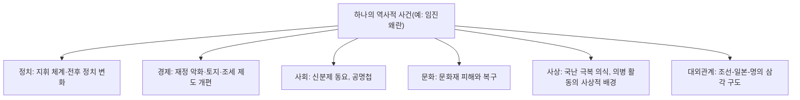

<Callout type="info">
  **이번 문서의 목표:** 선사~현대 한국사 전체를 시대 구분 기준과 여섯 개 축(정치·경제·사회·문화·사상·대외관계)으로 재배열해, 이후 본론 편들이 어느 위치에 놓이는지 지도로 그릴 수 있다.
</Callout>

## 왜 큰 지도를 다시 그려야 하는가

> **쉽게 말하면:** 개별 사건은 알아도 전체 순서와 축이 흐릿하면, 4단계에서 자주 나오는 "시대 횡단 비교" 문제에서 헷갈린다.

독학사 1~3단계 국사(또는 이에 상응하는 학습)를 거친 학습자는 삼국시대, 고려, 조선 같은 왕조 이름과 대표 사건은 이미 알고 있다. 그런데 4단계에서 자주 나오는 문제는 "고구려의 정치 제도는 무엇인가"처럼 한 시대 안에서 끝나지 않고, "고대와 고려의 토지 제도를 비교하라", "조선 전기와 후기의 신분 구조 변화를 설명하라"처럼 **여러 시대를 가로질러 비교**하도록 요구한다. 이런 문제에 답하려면 각 시대가 전체 흐름에서 어디에 위치하는지, 그리고 그 시대를 정치·경제·사회·문화·사상·대외관계 중 어느 축으로 바라보고 있는지를 먼저 정리해야 한다. 이번 편은 개별 사건의 세부 내용(이는 05편부터 다룬다)이 아니라, 그 사건들을 담을 **틀**을 먼저 만드는 편이다.

## 한국사의 여섯 시대 구분

> **쉽게 말하면:** 한국사는 보통 선사·고대·중세·근세·근대 태동기·근대·현대의 흐름으로 나누어 정리한다.

이 시리즈에서는 한국사 교재에서 널리 쓰이는 시대 구분 방식을 따른다. 이 구분은 왕조 교체를 기본 축으로 하되, 정치체제·사회구조의 성격 변화도 함께 반영한 것이다.

| 시대 구분 | 대략적 시기 | 대표 국가·왕조 | 이 시리즈에서 다루는 편 |
|-----------|-------------|----------------|--------------------------|
| 선사 시대 | 문헌 기록 이전 | 구석기·신석기·청동기·초기 철기 사회 | 05 |
| 고대 | 국가 형성 – 936년 | 고조선, 삼국(고구려·백제·신라)·가야, 남북국(통일신라·발해) | 05, 06, 07 |
| 중세 | 918–1392년 | 고려 | 08, 09 |
| 근세 | 1392–1592년 | 조선 전기 | 10, 12 |
| 근대 태동기 | 1592–1876년 | 조선 후기 | 11, 13 |
| 근대 | 1876–1945년 | 개항기·대한제국·일제강점기 | 14, 15, 16 |
| 현대 | 1945년 이후 | 대한민국(분단·전쟁·산업화·민주화) | 17 |

이 표의 연대 구분점은 모두 한국사 서술에서 널리 쓰이는 대표적인 분기점이다. 고려 건국(918년)과 후삼국 통일(936년)을 고대와 중세의 경계로, 조선 건국(1392년)을 중세와 근세의 경계로, 임진왜란 발발(1592년)을 조선 전기와 후기(근세와 근대 태동기)의 경계로, 강화도 조약 체결(1876년)을 근대 태동기와 근대의 경계로, 8·15 광복(1945년)을 근대와 현대의 경계로 삼는 방식이다. 다만 이 구분은 편의상의 큰 지도이며, 실제 정치·사회 변화는 특정 연도에 딱 맞춰 일어나지 않고 점진적으로 진행되었다는 점도 함께 기억해 두어야 한다.

## 큰 흐름 속 대표 사건 연표

> **쉽게 말하면:** 시대 구분 사이의 경계마다 그 경계를 만든 대표 사건이 하나씩 있다.

아래 표는 위 시대 구분의 경계에 해당하는 대표 사건만 추려 정리한 것이다. 개별 시대 안의 세부 사건(정치 제도 개편, 전쟁, 개혁 등)은 05편부터 각 본론 편에서 다룬다.

| 연도 | 사건 | 의미 |
|------|------|------|
| 기원전 108년 | 고조선 멸망, 한 군현 설치 | 고조선 중심의 초기 국가 단계가 끝나고 여러 소국·연맹체 단계로 이어짐 |
| 676년 | 신라의 삼국 통일(나당 전쟁 종결) | 한반도 중남부가 신라 중심으로 통합되는 계기 |
| 698년 | 발해 건국 | 고구려 유민과 말갈 세력이 세운 국가로, 이후 통일신라와 함께 남북국 시대를 이룸 |
| 918년 | 왕건의 고려 건국 | 후삼국 시대의 한 축이 성립 |
| 936년 | 고려의 후삼국 통일 | 고대에서 중세로의 전환이 완성되는 시점으로 다룸 |
| 1392년 | 조선 건국 | 중세(고려)에서 근세(조선 전기)로의 전환 |
| 1592년 | 임진왜란 발발 | 조선 전기와 후기(근대 태동기)를 가르는 대표 사건 |
| 1876년 | 강화도 조약 체결 | 조선의 개항, 근대 태동기에서 근대로의 전환 |
| 1897년 | 대한제국 선포 | 근대 국가 체제를 세우려는 자주적 시도 |
| 1910년 | 국권 피탈(경술국치) | 대한제국의 국권 상실과 일제강점기의 시작 |
| 1919년 | 3·1 운동, 대한민국 임시정부 수립 | 민족운동의 전환점이자 근대 독립운동의 상징적 출발점 |
| 1945년 | 8·15 광복 | 근대에서 현대로의 전환 |
| 1950–1953년 | 6·25 전쟁 | 분단 체제가 굳어지는 계기 |

<Callout type="warning">
  위 연표는 시대 구분의 큰 경계만 보여 주는 개관용 표다. 각 사건의 배경·전개·결과에 대한 상세 설명, 그리고 이 표에 없는 세부 사건·인물·제도의 연도는 해당 사건을 본격적으로 다루는 본론 편(05~17편)에서 확인해야 한다. 확실하지 않은 세부 연도나 인물 관계를 이 개관 편에서 단정하지 않도록, 여기서는 널리 합의된 대표 사건만 담았다.
</Callout>

## 여섯 개 축: 정치·경제·사회·문화·사상·대외관계

> **쉽게 말하면:** 같은 시대라도 "누가 다스렸는가(정치)"와 "무엇을 먹고 살았는가(경제)"는 서로 다른 질문이므로, 따로 정리해야 헷갈리지 않는다.

출제기준이 요구하는 각 시대의 이해는 하나의 서술로 뭉뚱그려지지 않고, 다음 여섯 개 축으로 나뉘어 다뤄지는 경우가 많다. 이 축은 이후 모든 본론 편에서 반복해서 등장하는 분류 기준이므로 여기서 뜻을 명확히 잡아 둔다.

| 축 | 무엇을 보는가 | 예시 |
|----|----------------|------|
| 정치 | 통치 조직, 권력 구조, 지배층의 성격 | 삼국의 관등제, 고려의 중앙·지방 제도, 조선의 의정부·6조 체제 |
| 경제 | 토지 제도, 조세 제도, 산업·상업 구조 | 통일신라의 관료전, 고려의 전시과, 조선의 과전법·대동법 |
| 사회 | 신분 구조, 계층 이동, 촌락·공동체 조직 | 골품제, 양천제, 향·소·부곡 |
| 문화 | 학문, 예술, 건축, 문화재 | 불교 예술, 금속활자, 조선백자 |
| 사상 | 종교·철학·이념 체계와 그 정치적 영향 | 불교, 성리학, 실학, 동학 |
| 대외관계 | 주변국·열강과의 외교·전쟁·교류 | 나당 동맹과 전쟁, 조공-책봉 관계, 강화도 조약 |

같은 사건도 이 여섯 축 중 어느 관점에서 보느냐에 따라 강조점이 달라진다. 예를 들어 임진왜란은 대외관계 축에서는 "일본의 침입과 조명 연합군의 대응"이라는 전쟁사로, 경제 축에서는 "전후 국가 재정 파탄과 토지·조세 제도 개편의 계기"로, 사회 축에서는 "공명첩 발급 등으로 인한 신분제 동요"로 각각 다시 조명된다. 이렇게 하나의 사건을 여러 축으로 다시 읽는 습관이 4단계에서 요구하는 종합적 이해에 가깝다.

## 1~3단계와 4단계 국사의 난이도 차이

> **쉽게 말하면:** 1~3단계가 시대별로 나누어 배우는 과정이라면, 4단계는 그 시대들을 다시 섞어서 통째로 이해했는지 확인하는 과정이다.

1~3단계 국사(또는 이에 상응하는 과정)는 대체로 시대 순서를 따라 각 시대의 정치·경제·사회·문화를 개별적으로 학습하는 구조다. 반면 4단계 학위취득 종합시험은 다음과 같은 지점에서 난이도가 올라간다.

1. **시대 횡단 비교**: "고대·고려·조선의 토지 제도를 시대순으로 비교하라"처럼 여러 시대를 한 문제 안에서 동시에 묻는다. 18편에서 이 유형을 집중적으로 다룬다.
2. **제도·사상의 연결성**: 특정 제도(예: 붕당 정치)가 등장한 배경이 되는 사상(성리학)까지 함께 물을 수 있다. 12편과 19편에서 이 연결을 다룬다.
3. **사료·자료 해석 비중 증가**: 단순 설명형 문항보다 사료 제시문을 읽고 시대·인물·사건을 추론하는 문항 비중이 높아진다. 20편에서 사료 읽는 법을 별도로 다룬다.
4. **보기 선지의 정교한 함정**: 비슷한 명칭의 제도(예: 과전법과 직전법), 비슷한 시기의 인물을 혼동하도록 설계된 선지가 늘어난다. 21편에서 함정 패턴을 정리한다.

<Callout type="warning">
  이 편에서 제시한 시대 구분·연표·축 구분은 이후 본론 편에서 세부 내용을 채워 넣기 위한 뼈대다. 각 시대의 구체적인 제도명·인물명·세부 연도는 해당 본론 편(05~17편)에서 다시 정확하게 확인하고, 이 편의 표를 암기의 최종 근거로 삼지 않도록 한다.
</Callout>

## 핵심 정리

- 한국사는 선사–고대–중세(고려)–근세(조선 전기)–근대 태동기(조선 후기)–근대(개항기~일제강점기)–현대(광복 이후)의 흐름으로 크게 나뉜다.
- 시대 구분의 경계에는 고려 건국·통일(918, 936), 조선 건국(1392), 임진왜란(1592), 강화도 조약(1876), 광복(1945) 같은 대표 사건이 있다.
- 각 시대는 정치·경제·사회·문화·사상·대외관계라는 여섯 축으로 나누어 이해하며, 같은 사건도 축에 따라 강조점이 달라진다.
- 4단계는 1~3단계와 달리 시대 횡단 비교, 제도-사상 연결, 사료 해석, 정교한 보기 함정을 다루는 종합적 난이도를 요구한다.

## 마무리 복습

<Quiz
  questionNumber={1}
  question="이 시리즈에서 따르는 한국사 시대 구분 순서로 옳은 것은?"
  options={['고대 – 중세 – 선사 – 근세 – 근대 – 현대', '선사 – 고대 – 중세 – 근세 – 근대 태동기 – 근대 – 현대', '근세 – 근대 – 고대 – 중세 – 현대 – 선사', '현대 – 근대 – 근세 – 중세 – 고대 – 선사']}
  correctAnswer={2}
  explanation="한국사는 선사, 고대, 중세(고려), 근세(조선 전기), 근대 태동기(조선 후기), 근대(개항기~일제강점기), 현대(광복 이후) 순으로 구분한다."
  optionExplanations={['시대 순서가 뒤바뀌어 있다.', '정답이다. 제시된 순서가 이 시리즈가 따르는 표준적인 시대 구분이다.', '시대 순서가 뒤섞여 있다.', '시대 순서가 완전히 역순으로 제시되어 있다.']}
/>

<Quiz
  questionNumber={2}
  question="고대에서 중세로의 전환을 대표하는 사건으로 옳은 것은?"
  options={['강화도 조약 체결(1876년)', '임진왜란 발발(1592년)', '고려의 후삼국 통일(936년)', '8·15 광복(1945년)']}
  correctAnswer={3}
  explanation="이 시리즈의 시대 구분에서 고대와 중세의 경계는 고려가 후삼국을 통일한 936년을 기준으로 삼는다."
  optionExplanations={['강화도 조약은 근대 태동기와 근대의 경계로 다룬다.', '임진왜란은 근세와 근대 태동기의 경계로 다룬다.', '정답이다. 936년 후삼국 통일이 고대에서 중세로의 전환점이다.', '8·15 광복은 근대와 현대의 경계로 다룬다.']}
/>

<Quiz
  questionNumber={3}
  question="조선 전기(근세)와 조선 후기(근대 태동기)를 가르는 대표 사건으로 옳은 것은?"
  options={['위화도 회군', '병자호란', '임진왜란 발발(1592년)', '갑오개혁(1894년)']}
  correctAnswer={3}
  explanation="이 시리즈의 시대 구분에서 조선 전기와 후기는 1592년 임진왜란 발발을 경계로 나눈다."
  optionExplanations={['위화도 회군은 고려 말 조선 건국 이전의 사건이다.', '병자호란은 조선 후기 초반의 사건으로, 시대 구분 경계 자체는 아니다.', '정답이다. 임진왜란 발발이 조선 전기와 후기를 가르는 경계로 다뤄진다.', '갑오개혁은 근대 태동기와 근대의 경계인 강화도 조약보다 훨씬 뒤의 사건이다.']}
/>

<Quiz
  questionNumber={4}
  question="한국사를 이해하는 여섯 개 축에 대한 설명으로 옳지 않은 것은?"
  options={['정치 축은 통치 조직과 권력 구조, 지배층의 성격을 다룬다', '경제 축은 토지·조세 제도와 산업·상업 구조를 다룬다', '사상 축은 종교·철학·이념 체계와 그 정치적 영향을 다룬다', '대외관계 축은 국내 신분 구조와 계층 이동만을 다룬다']}
  correctAnswer={4}
  explanation="국내 신분 구조와 계층 이동은 사회 축에서 다루는 내용이며, 대외관계 축은 주변국·열강과의 외교·전쟁·교류를 다룬다."
  optionExplanations={['옳은 설명이다. 정치 축의 정의와 일치한다.', '옳은 설명이다. 경제 축의 정의와 일치한다.', '옳은 설명이다. 사상 축의 정의와 일치한다.', '틀린 설명이다. 이는 사회 축에 대한 설명이며 대외관계 축의 정의가 아니다.']}
/>

<Quiz
  questionNumber={5}
  question="독학사 4단계 국사가 1~3단계 국사에 비해 요구하는 능력으로 가장 적절하지 않은 것은?"
  options={['여러 시대를 가로지르는 제도·구조 비교', '사료·자료를 읽고 시대나 인물을 추론하는 능력', '한 시대만 떼어 놓고 세부 사실을 나열하는 능력', '비슷한 명칭의 제도나 인물을 정확히 구분하는 능력']}
  correctAnswer={3}
  explanation="4단계는 한 시대만 떼어 놓고 사실을 나열하는 수준이 아니라, 시대 횡단 비교와 사료 해석, 정교한 구분 능력을 종합적으로 요구한다."
  optionExplanations={['4단계에서 강조되는 시대 횡단 비교 능력이다.', '4단계에서 비중이 높아지는 사료 해석 능력이다.', '정답이다. 이는 1~3단계에 더 가까운 단편적 나열 방식이며 4단계가 요구하는 종합적 능력과 거리가 있다.', '4단계에서 정교해지는 보기 함정에 대응하기 위해 필요한 능력이다.']}
/>

<Quiz
  questionNumber={6}
  question="다음 중 이 시리즈가 대표 사건 연표에서 광복 이전 근대 시기의 사건으로 제시한 것은?"
  options={['6·25 전쟁(1950–1953년)', '대한제국 선포(1897년)', '후삼국 통일(936년)', '고조선 멸망(기원전 108년)']}
  correctAnswer={2}
  explanation="대한제국 선포(1897년)는 근대(1876–1945년) 시기의 사건으로 제시되어 있다."
  optionExplanations={['6·25 전쟁은 현대(1945년 이후) 시기의 사건이다.', '정답이다. 대한제국 선포는 근대 시기에 해당하는 사건이다.', '후삼국 통일은 고대에서 중세로의 전환점이다.', '고조선 멸망은 고대 초기의 사건이다.']}
/>

## 참고 자료

- [국사편찬위원회 우리역사넷](https://contents.history.go.kr)
- [국사편찬위원회 한국사데이터베이스](https://db.history.go.kr)
- [국가평생교육진흥원 독학학위제](https://bdes.nile.or.kr)
