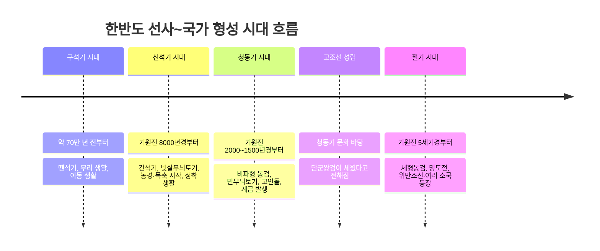
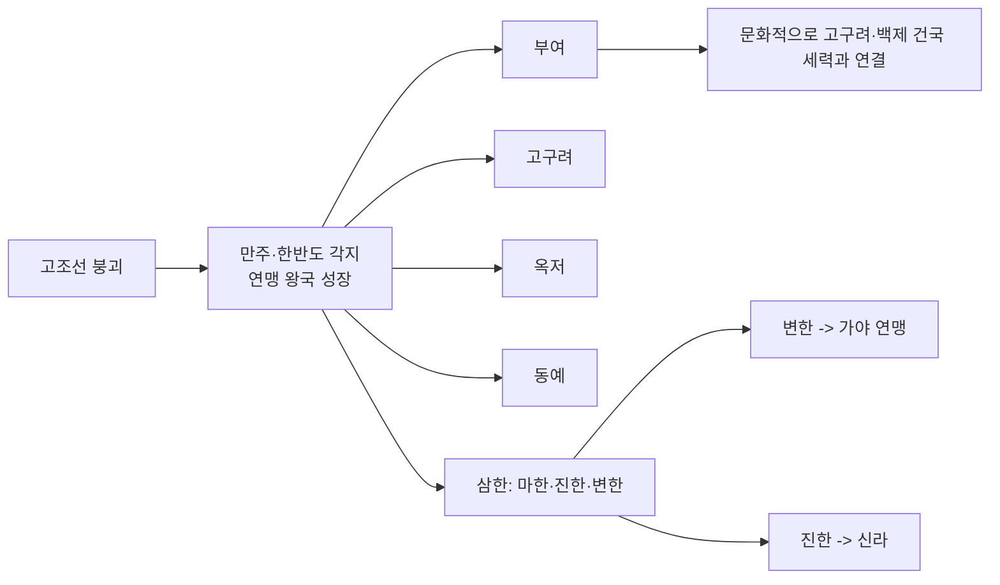

## 왜 선사 시대부터 다시 보는가

독학사 4단계 국사는 단순 연표 암기가 아니라 "왜 그 시대에 그런 사회가 나타났는가"를 묻는 시험이다. 01편에서 이미 큰 흐름(선사→고대→중세→근세→근대→현대)을 정리했으니, 이 편부터는 각 시대의 구체 내용을 채워 넣는다.

## 선사 시대 구분: 도구 재질이 곧 사회 구조의 단서

고고학에서는 인류가 사용한 도구의 재질을 기준으로 **구석기 시대**, **신석기 시대**, **청동기 시대**, **철기 시대**로 시대를 구분한다. 이 구분이 중요한 이유는, 도구 재질이 바뀔 때마다 생산 방식과 사회 구조가 함께 바뀌었기 때문이다.

### 구석기 시대: 뗀석기와 무리 생활

**구석기 시대**(Old Stone Age)는 약 70만 년 전부터 시작된 것으로 보는 시기로, 돌을 깨뜨려 만든 **뗀석기**(打製石器, 타제석기)를 사용했다. 무리 안에서는 경험 많은 사람을 지도자로 세웠지만, 아직 재산이나 신분의 차이는 없는 **평등 사회**였다.

대표 유적으로는 경기 연천 전곡리(아슐리안형 주먹도끼 출토로 동아시아 구석기 연구에 큰 영향을 준 유적), 충남 공주 석장리(남한 최초로 발굴된 구석기 유적), 평남 상원 검은모루동굴 등이 있다. 독학사 시험에서는 유적 이름과 그 유적의 학술적 의의(예: 전곡리 주먹도끼가 모비우스 학설을 재검토하게 만든 계기라는 점)를 연결하는 문제가 나올 수 있으므로, 유적 이름만이 아니라 그 유적이 왜 중요한지도 함께 기억해야 한다.

### 신석기 시대: 간석기와 농경의 시작

**신석기 시대**(New Stone Age)는 기원전 8000년경부터 시작된 것으로 보며, 돌을 갈아 만든 **간석기**(磨製石器, 마제석기)를 사용했다. 이 시기 가장 큰 변화는 **농경과 목축의 시작**이다.

토기도 이 시기에 처음 등장한다. 대표적인 것이 **빗살무늬토기**로, 표면에 빗살 같은 무늬를 새긴 뾰족밑 또는 둥근밑 토기다.

대표 유적은 서울 암사동(빗살무늬토기와 움집터가 다수 발굴), 부산 동삼동(조개더미 유적, 패총), 제주 고산리(이른 시기 신석기 유적으로 주목) 등이다.

### 청동기 시대: 계급 사회의 등장

**청동기 시대**는 한반도에서 대체로 기원전 2000년~기원전 1500년경 사이에 시작된 것으로 본다(지역에 따라 편차가 있다). 그래서 청동기 시대부터 본격적으로 **계급 사회**가 나타난다.

토기는 무늬가 없거나 단순한 **민무늬토기**(무문토기)가 대표적이며, 지역에 따라 미송리식 토기(고조선 문화권과 관련) 등 다양한 형태가 나타난다. 계급 사회의 가장 뚜렷한 증거는 **고인돌**(지석묘)이다.

### 철기 시대: 국가 간 경쟁의 심화

**철기 시대**는 기원전 5세기경부터 시작된 것으로 본다. 청동기는 이 시기에도 계속 만들어지지만 성격이 바뀌어, 날렵하고 실용적인 **세형동검**과 잔무늬 거울처럼 의례용 성격이 강한 유물로 정교화된다.

아래 표로 시대별 특징을 한눈에 비교한다.

| 시대 | 대표 도구 | 대표 유물 | 대표 유적 | 사회 성격 |
|------|-----------|-----------|-----------|-----------|
| 구석기 | 뗀석기 | 주먹도끼, 찍개 | 연천 전곡리, 공주 석장리 | 이동 생활, 평등 사회 |
| 신석기 | 간석기 | 빗살무늬토기, 돌보습 | 서울 암사동, 부산 동삼동 | 농경·정착 시작, 평등 사회 |
| 청동기 | 청동기+간석기 병용 | 비파형 동검, 고인돌, 반달돌칼 | 부여 송국리 | 계급 사회, 국가 형성(고조선) |
| 철기 | 철기 | 세형동검, 명도전 | 서북부 여러 유적 | 정복 전쟁 심화, 여러 소국 성장 |

## 고조선: 한반도 최초의 국가

### 건국과 발전

『삼국유사』등의 기록에 따르면 **고조선**은 단군왕검이 세웠다고 전해진다. 실제 건국 연대를 현재의 역법으로 정확히 확정하기는 어렵고, 흔히 기원전 2333년으로 전해지는 연대는 후대 문헌에 기록된 전승 연대라는 점에 유의해야 한다.

고조선은 요령 지방을 중심으로 성장하다가 점차 대동강 유역까지 세력을 넓힌 것으로 추정한다. 기원전 4세기~3세기 무렵에는 중국 전국시대 연나라와 대립할 정도로 성장했다는 기록이 남아 있다.

위만조선은 철기 문화를 본격적으로 수용해 국력을 키웠고, 중국의 한나라와 한반도 남쪽의 진(辰) 사이에서 중계 무역의 이익을 독점했다. 결국 한 무제의 침공을 받아 왕검성이 함락되면서 기원전 108년 고조선은 멸망했고, 한은 옛 고조선 땅에 낙랑·진번·임둔·현도 4개의 군현(한 군현)을 설치했다.

### 8조법으로 보는 고조선 사회

고조선의 사회상을 보여주는 대표 사료가 **8조법**(범금 8조)이다. 현재 전문이 모두 전해지지는 않고, 중국 역사서 『한서』 지리지에 다음 3개 조항이 남아 전해진다.

| 조항 | 내용 | 반영하는 사회상 |
|------|------|------------------|
| 1조 | 사람을 죽인 자는 즉시 사형에 처한다 | 생명 중시, 형법의 존재 |
| 2조 | 남에게 상해를 입힌 자는 곡물로 배상한다 | 농경 사회, 사유 재산 인정 |
| 3조 | 남의 물건을 훔친 자는 노비로 삼되, 죄를 면하려면 50만 전을 내야 한다 | 사유 재산 보호, 신분제(노비) 존재, 화폐(교환) 사용 정황 |

이 세 조항만으로도 고조선이 **사유 재산을 인정하고 보호하는 사회**, **신분 차이(노비)가 존재하는 사회**, **농경을 바탕으로 한 사회**였음을 추론할 수 있다. 독학사 시험에서는 "8조법의 내용을 통해 알 수 있는 고조선 사회의 모습으로 옳지 않은 것은?"과 같은 형태로 자주 출제되므로, 각 조항이 어떤 사회상을 보여주는지 연결해서 암기해야 한다.

## 철기 시대의 여러 소국: 연맹 왕국들의 개성

고조선 멸망을 전후해 만주와 한반도 각지에서 **부여·고구려·옥저·동예·삼한**과 같은 여러 소국이 성장했다. 이들은 아직 강력한 왕권 아래 완전히 통합되지 않고, 여러 부족(집단)이 연맹을 이룬 **연맹 왕국** 단계에 머물러 있었다는 공통점이 있다.

### 부여: 5부족 연맹과 엄격한 법

**부여**는 만주 쑹화강(송화강) 유역의 평야 지대를 중심으로 성장한 연맹 왕국이다. 왕 아래에 **마가·우가·저가·구가**라 불리는 여러 가(加, 부족장)들이 있었고, 이들이 각자 별도의 영역인 **사출도**를 다스렸다.

### 고구려: 5부족 연맹과 서옥제

압록강 유역의 졸본 지역을 중심으로 성장한 **고구려**(초기 소국 단계) 역시 5부족 연맹체였다. 매년 10월에 **동맹**이라는 제천 행사를 열었으며, 이는 추수를 마친 뒤 감사의 의미로 여는 행사라는 점에서 부여의 영고(12월)와 시기가 다르다.

### 옥저와 동예: 왕이 없는 군장 사회

**옥저**와 **동예**는 함경도·강원도 북부 동해안 지역에 위치했는데, 지리적으로 한반도 중심부에서 떨어져 있고 고구려의 압박을 받아 왕을 중심으로 한 강력한 국가로 성장하지 못하고 읍군·삼로 같은 군장이 각 지역을 다스리는 단계에 머물렀다.

옥저에는 어린 여자아이를 미리 신랑 집에서 데려다 키운 뒤 성인이 되면 다시 여자 집에 예물을 치르고 정식으로 혼인하는 **민며느리제**가 있었다. 또 가족이 죽으면 시신을 임시로 묻었다가 나중에 뼈를 추려 가족 공동의 큰 목곽에 함께 안치하는 **가족 공동 무덤**(골장제) 풍습이 있었다.

동예에는 매년 10월에 여는 제천 행사 **무천**이 있었고(고구려의 동맹과 마찬가지로 10월), 다른 부족의 영역을 침범하면 소나 말, 노비로 배상하게 하는 **책화** 제도가 있었다. 동예는 또한 같은 부족(씨족) 안에서는 결혼하지 않는 **족외혼** 풍습을 지켰다.

### 삼한: 제정 분리 사회

한반도 남부에는 **마한·진한·변한**으로 이루어진 **삼한**이 자리 잡고 있었다. 삼한에서 특히 주목할 점은 정치 지도자와 별도로 **천군**이라는 제사장이 있었고, 천군이 다스리는 **소도**라는 신성 지역이 따로 존재했다는 사실이다.

삼한은 매년 5월(씨뿌리기 이후)과 10월(추수 이후) 두 차례 계절제를 열어 하늘에 제사를 지냈다. 이 가운데 **변한**은 철이 많이 생산되어, 낙랑과 왜(일본) 등에 철을 수출했고 철 자체를 화폐처럼 사용하기도 했다고 전해진다. 변한은 이후 가야 연맹으로, 진한은 신라로 발전해 나간다.

아래 표로 각 소국의 특징을 정리한다.

| 소국 | 위치 | 정치 형태 | 제천 행사 | 대표 풍습 |
|------|------|-----------|-----------|-----------|
| 부여 | 쑹화강 유역 | 5부족 연맹(사출도) | 영고(12월) | 순장, 1책 12법 |
| 고구려 | 압록강 졸본 | 5부족 연맹 | 동맹(10월) | 서옥제 |
| 옥저 | 함경도 해안 | 군장 사회(읍군·삼로) | – | 민며느리제, 가족 공동 무덤 |
| 동예 | 강원도 북부 해안 | 군장 사회(읍군·삼로) | 무천(10월) | 책화, 족외혼 |
| 삼한 | 한반도 남부 | 군장 사회(신지·읍차) + 제사장(천군·소도) | 5월·10월 계절제 | 제정 분리, 변한의 철 생산 |

## 출제 포인트와 사료 읽기 요령

이 편의 내용은 독학사 4단계에서 크게 두 유형으로 출제된다. 첫째는 **유물·유적 제시형**으로, 특정 유물 사진이나 명칭을 주고 그 시대의 사회상을 고르게 하는 문제다.

사료를 읽을 때 주의할 점은, 사료 속 표현이 **당시 사람의 기록**이라는 것과 오늘날 우리가 그것을 **해석한 결과**를 구분하는 것이다. 예를 들어 8조법 3조는 "노비로 삼고, 자속하려면 50만 전을 내야 한다"는 사실(史實) 자체를 전하고, 여기서 "사유 재산을 보호하는 사회"라는 결론은 후대 역사학의 **해석**이다.

## 핵심 정리

- 선사 시대는 도구 재질(뗀석기·간석기·청동기·철기)로 구분하며, 청동기 시대부터 계급 사회(고인돌)가 나타난다.
- 고조선은 청동기 문화를 바탕으로 성립했고, 위만조선 시기 철기 문화를 수용해 중계 무역으로 번성하다가 기원전 108년 한 무제에 의해 멸망했다.
- 8조법 3개 조항은 생명 중시, 사유 재산 보호, 신분제(노비) 존재를 보여주는 대표 사료다.
- 부여(영고, 사출도, 1책 12법)·고구려(동맹, 서옥제)·옥저(민며느리제)·동예(무천, 책화)·삼한(천군·소도, 제정 분리)은 제천 행사와 풍습으로 서로 구분해서 암기해야 한다.
- 삼한 중 변한은 철 생산지로 가야 연맹의 모태가 되고, 진한은 신라로 발전한다.

## 마무리 복습

<Quiz
  questionNumber={1}
  question={"다음 중 청동기 시대의 사회 모습으로 가장 적절한 것은?"}
  options={["이동 생활을 하며 무리를 지어 평등하게 살았다","거대한 고인돌 축조를 지시할 수 있는 지배층이 등장했다","중국 화폐인 명도전을 활발히 사용했다","철제 무기로 정복 전쟁을 벌였다"]}
  correctAnswer={2}
  explanation={"고인돌은 많은 인력을 동원해야 만들 수 있는 거대한 무덤으로, 청동기 시대에 계급 사회와 지배층이 등장했음을 보여주는 대표 증거다."}
/>

<Quiz
  questionNumber={2}
  question={"고조선의 8조법 중 남의 물건을 훔친 자를 노비로 삼되 죄를 면하려면 50만 전을 내게 한 조항을 통해 알 수 있는 사회상으로 가장 적절한 것은?"}
  options={["제정일치 사회였다","사유 재산을 인정하고 보호했다","노비 제도가 없는 평등 사회였다","화폐 경제가 전혀 없었다"]}
  correctAnswer={2}
  explanation={"훔친 물건에 대한 배상과 노비화, 속죄금 제도는 개인의 재산을 침해한 행위를 엄격히 처벌한 것으로, 사유 재산을 인정하고 보호하는 사회였음을 보여준다."}
/>

<Quiz
  questionNumber={3}
  question={"다음 설명에 해당하는 나라는 어디인가? 5부족이 연맹을 이루었고, 매년 12월에 영고라는 제천 행사를 열었으며, 왕이 죽으면 사람을 함께 묻는 순장 풍습이 있었다."}
  options={["고구려","옥저","부여","동예"]}
  correctAnswer={3}
  explanation={"12월 제천 행사인 영고와 순장 풍습은 부여의 대표적인 특징이다."}
/>

## 참고 자료

- [국사편찬위원회 한국사데이터베이스](https://db.history.go.kr) — 선사 시대 유적 발굴 자료와 『삼국지』 위서 동이전 등 원문 사료 확인
- [우리역사넷](https://contents.history.go.kr) — 선사~초기 국가 시대 개관 및 유물·유적 해설 자료
- [국가유산청](https://www.khs.go.kr) — 연천 전곡리, 서울 암사동 등 국가지정문화유산 현황 확인
