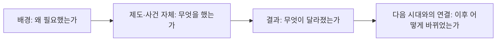
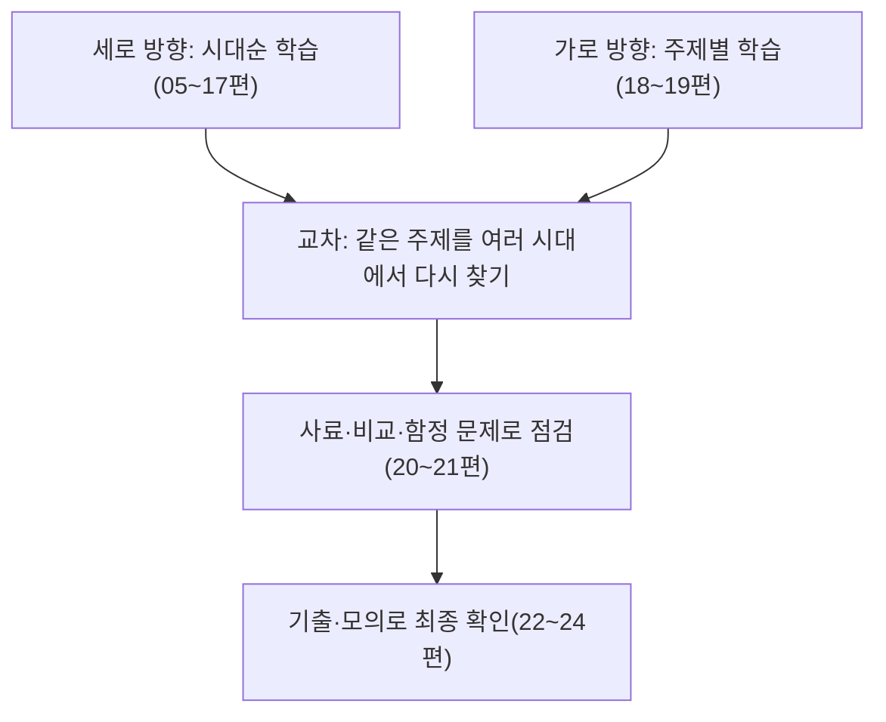

<Callout type="info">
  **이번 문서의 목표:** 4단계 국사에 맞는 학습 방식(맥락·비교·추론 중심 사고)과 기출·오답노트 활용법, 시대·주제를 통합해 암기하는 전략을 세울 수 있다.
</Callout>

## 왜 단순 암기 전략으로는 부족한가

> **쉽게 말하면:** 사건 하나하나를 따로 외우기보다, 사건과 사건을 잇는 이유를 함께 외워야 오래가고 응용도 된다.

01편에서 확인했듯 국가평생교육진흥원이 밝히는 학위취득 종합시험의 평가수준은 단순 지식 나열이 아니라 종합적인 소양과 전문지식을 평가하는 데 있다. 국사에서 이 말은 구체적으로, 사건의 이름과 연도를 아는 것을 넘어 "왜 이 시기에 이 제도가 필요했는가", "이 제도가 다음 시대에 어떤 제도로 이어지거나 바뀌었는가"까지 설명할 수 있어야 한다는 뜻이다. 연표만 외운 상태로 시험장에 가면, 사료형·비교형 문항이나 "옳지 않은 것 고르기" 유형에서 그럴듯한 오답에 흔들리기 쉽다. 이번 편은 이런 문제를 줄이기 위한 세 가지 사고 방식과 두 가지 학습 전략을 정리한다.

## 사고 방식 1: 맥락 이해

> **쉽게 말하면:** 제도나 사건을 배울 때 "그래서 왜?"를 항상 붙여서 읽는다.

맥락 이해란 하나의 제도나 사건을 그 자체로 외우지 않고, 그것이 등장하게 된 **배경**과 그것이 만들어 낸 **결과**까지 하나의 인과 관계로 이해하는 것을 말한다. 예를 들어 "대동법이 시행되었다"는 사실만 아는 것과, "임진왜란 이후 국가 재정이 어려워지고 공납의 폐단(방납의 폐해)이 심해지자 이를 해결하기 위해 토지 결수를 기준으로 쌀·베·동전 등을 거두는 대동법이 시행되었다"까지 아는 것은 전혀 다른 수준의 이해다. 후자는 "대동법이 시행된 배경으로 옳은 것은?" 같은 문항에도, "대동법 시행이 가져온 사회 변화는?" 같은 문항에도 모두 대응할 수 있다.

## 사고 방식 2: 비교

> **쉽게 말하면:** 새로운 제도를 배우면 곧바로 "이전 제도와 무엇이 다른가"를 표로 정리해 본다.

02편과 03편에서 다룬 것처럼, 4단계는 시대를 가로지르는 비교 문항 비중이 높다. 비교 사고를 습관으로 만들려면, 새로운 개념을 배울 때마다 바로 앞서 배운 비슷한 성격의 개념과 짝을 지어 표로 정리하는 방법이 효과적이다. 이때 중요한 것은 "무엇이 같고 무엇이 다른가"를 함께 적는 것이다. 같은 점만 적으면 두 개념을 혼동하게 되고, 다른 점만 적으면 왜 비교 대상으로 묶였는지 맥락을 놓치게 된다.

| 비교 항목 예시 | 확인할 질문 |
|-----------------|-------------|
| 공통점 | 두 제도·사건이 같은 목적(예: 국가 재정 확보)을 가지는가 |
| 차이점 | 시행 시기, 대상, 방식이 구체적으로 어떻게 다른가 |
| 전환 계기 | 앞선 제도에서 뒤 제도로 바뀌게 된 결정적 사건이나 문제점은 무엇인가 |

## 사고 방식 3: 추론

> **쉽게 말하면:** 자료나 문제에 직접 나오지 않은 정보도, 아는 지식을 근거로 스스로 채워 넣을 수 있어야 한다.

추론은 사료형 문항에서 특히 중요하다. 제시된 자료가 어느 시대의 것인지 명시적으로 알려주지 않아도, 자료 안의 관직명·제도명·용어를 근거로 시대를 특정해 낼 수 있어야 한다. 이는 03편에서 정리한 "핵심 키워드 표시" 절차와 이어지며, 결국 배경 지식이 튼튼해야 추론도 가능해진다는 점에서 맥락 이해와 맞닿아 있다.

## 기출 활용법: 회독과 오답노트

> **쉽게 말하면:** 기출은 한 번 풀고 끝내는 것이 아니라, 같은 문제를 여러 번 다른 목적으로 다시 본다.

기출·모의 문제를 효율적으로 쓰려면 회독마다 목적을 다르게 두는 방법이 도움이 된다.

<Steps>

### 1회독. 실력 확인

시간을 재고 실제 시험처럼 풀어, 현재 어느 시대·영역에서 오답이 많은지 확인한다. 이 단계에서는 정답률 자체보다 **어느 영역에서 틀렸는가**를 기록하는 것이 더 중요하다.

### 2회독. 오답 원인 분석

틀린 문항을 다시 펴서 왜 틀렸는지 유형을 분류한다. 몰라서 틀렸는지, 알고 있었는데 함정 선지에 걸렸는지, 시간이 부족해 찍었는지를 구분해 오답노트에 적는다.

### 3회독. 개념 보완 후 재풀이

오답노트에서 확인한 부족한 개념을 본론 편에서 다시 찾아 읽고, 일정 기간 뒤 같은 문제를 다시 풀어 본다. 이때 답을 외워서 맞히는 것이 아니라 근거를 다시 설명할 수 있는지를 확인한다.

### 4회독 이후. 유형·시대 교차 점검

여러 회차의 기출을 시대별·유형별로 묶어, 반복해서 틀리는 패턴이 있는지 확인한다. 23편(회차별 기출 분석)에서 이 교차 점검 방식을 더 자세히 다룬다.

</Steps>

오답노트는 "틀린 문제와 정답"만 적기보다, 다음 세 칸을 채우는 방식이 더 유용하다.

| 오답노트 항목 | 기록 내용 |
|----------------|-----------|
| 무엇을 착각했는가 | 헷갈린 두 개념·인물·연도를 구체적으로 적는다 |
| 왜 착각했는가 | 이름이 비슷해서, 시대를 혼동해서 등 원인을 적는다 |
| 어떻게 구분할 것인가 | 다음에 같은 함정을 만났을 때 확인할 기준을 한 줄로 적는다 |

## 시대·주제 통합 암기 전략

> **쉽게 말하면:** 시대순으로 한 번, 주제(제도·사상)별로 한 번, 최소 두 방향으로 정리해야 비교형 문제에도 강해진다.

02편에서 정리한 시대 구분과 여섯 축을 활용해, 학습을 두 방향으로 교차시키는 전략을 권장한다.

1. **세로 방향(시대순) 정리**: 선사부터 현대까지 순서대로 읽으며 각 시대의 정치·경제·사회·문화·사상·대외관계를 정리한다. 05~17편의 기본 순서가 이 방향이다.
2. **가로 방향(주제별) 정리**: 토지 제도, 신분 제도, 통치 체제, 사상처럼 하나의 주제를 선택해 여러 시대를 관통하며 다시 정리한다. 18편(시대 횡단 비교)과 19편(사상사 흐름)이 이 방향을 미리 보여 준다.

세로 방향만 반복하면 각 시대는 잘 알지만 시대를 넘나드는 비교 문항에서 시간이 오래 걸리고, 가로 방향만 학습하면 개별 시대의 흐름이 흐릿해져 사료형 문항에서 시대를 잘못 짚을 수 있다. 두 방향을 교차해서 학습해야 4단계가 요구하는 종합적 이해에 가까워진다.

<Callout type="warning">
  이 편에서 제시한 회독 횟수·오답노트 양식·학습 순서는 하나의 권장 방법이며, 회차별 시험 범위나 개인의 학습 속도에 따라 조정할 수 있다. 정확한 시험 범위와 문항 구성은 반드시 최신 공고를 통해 확인해야 한다.
</Callout>

## 핵심 정리

- 맥락 이해(배경-전개-결과-연결), 비교(공통점-차이점-전환 계기), 추론(자료 속 단서로 시대·인물 특정)은 4단계 국사에서 요구되는 세 가지 사고 방식이다.
- 기출은 실력 확인, 오답 원인 분석, 개념 보완 후 재풀이, 유형·시대 교차 점검의 순서로 여러 번 회독하며 오답노트에 착각 원인과 구분 기준을 함께 기록한다.
- 학습은 시대순(세로 방향)과 주제별(가로 방향)을 교차해서 진행해야 시대 횡단 비교 문항과 사료형 문항 모두에 대응할 수 있다.
- 구체적인 회독 횟수나 학습 순서는 권장 방법이며, 실제 시험 범위·구성은 최신 공고로 확인해야 한다.

## 마무리 복습

<Quiz
  questionNumber={1}
  question="이 편에서 강조하는 4단계 국사 학습에 필요한 사고 방식으로 옳지 않은 것은?"
  options={['맥락 이해: 제도나 사건의 배경과 결과를 함께 파악한다', '비교: 새로운 개념을 앞서 배운 개념과 짝지어 공통점·차이점을 정리한다', '추론: 자료에 직접 나오지 않은 정보도 배경지식을 근거로 채워 넣는다', '단편 암기: 연도와 명칭만 정확히 외우면 다른 사고 과정은 필요 없다']}
  correctAnswer={4}
  explanation="이 편은 단편적인 연도·명칭 암기만으로는 부족하며 맥락 이해, 비교, 추론이 함께 필요하다고 강조한다."
  optionExplanations={['옳은 설명이다. 맥락 이해의 정의와 일치한다.', '옳은 설명이다. 비교 사고의 정의와 일치한다.', '옳은 설명이다. 추론 사고의 정의와 일치한다.', '정답이다. 이는 이 편이 지양하는 단편 암기 방식이다.']}
/>

<Quiz
  questionNumber={2}
  question="이 편에서 제시한 기출 회독 순서로 가장 적절한 것은?"
  options={['오답 원인 분석 – 실력 확인 – 재풀이 – 교차 점검', '실력 확인 – 오답 원인 분석 – 개념 보완 후 재풀이 – 유형·시대 교차 점검', '재풀이 – 교차 점검 – 실력 확인 – 오답 원인 분석', '교차 점검 – 재풀이 – 실력 확인 – 오답 원인 분석']}
  correctAnswer={2}
  explanation="이 편은 실력 확인, 오답 원인 분석, 개념 보완 후 재풀이, 유형·시대 교차 점검 순서로 기출을 회독할 것을 제안한다."
  optionExplanations={['순서가 뒤바뀌어 있다.', '정답이다. 제시된 순서가 이 편이 제안하는 회독 순서다.', '순서가 뒤섞여 있다.', '순서가 완전히 역순으로 제시되어 있다.']}
/>

<Quiz
  questionNumber={3}
  question="이 편에서 제안하는 오답노트 기록 항목으로 가장 적절하지 않은 것은?"
  options={['무엇을 착각했는가(헷갈린 개념·인물·연도)', '왜 착각했는가(착각의 원인)', '어떻게 구분할 것인가(다음에 확인할 기준)', '틀린 문제 번호만 나열하고 다른 내용은 적지 않는다']}
  correctAnswer={4}
  explanation="이 편은 착각 내용, 원인, 구분 기준을 함께 기록하는 방식을 제안하며, 문제 번호만 나열하는 방식은 권장하지 않는다."
  optionExplanations={['옳은 항목이다. 착각한 구체적 개념을 기록하는 것이 중요하다.', '옳은 항목이다. 착각 원인을 기록해야 재발을 막을 수 있다.', '옳은 항목이다. 다음번 구분 기준을 적어 두는 것이 유용하다.', '정답이다. 문제 번호만 나열하는 방식은 이 편이 권장하는 오답노트 방식이 아니다.']}
/>

<Quiz
  questionNumber={4}
  question="세로 방향(시대순) 학습과 가로 방향(주제별) 학습에 대한 설명으로 옳은 것은?"
  options={['세로 방향만 학습해도 시대 횡단 비교 문항에 충분히 대응할 수 있다', '가로 방향만 학습해도 개별 시대의 흐름을 놓치지 않는다', '두 방향을 교차해서 학습해야 비교 문항과 사료형 문항 모두에 대응할 수 있다', '세로 방향과 가로 방향은 서로 완전히 무관하므로 하나만 선택해야 한다']}
  correctAnswer={3}
  explanation="세로 방향과 가로 방향을 교차해서 학습해야 시대 횡단 비교 문항과 사료형 문항 모두에 균형 있게 대응할 수 있다."
  optionExplanations={['세로 방향만으로는 시대를 넘나드는 비교 문항에서 시간이 오래 걸릴 수 있다.', '가로 방향만으로는 개별 시대의 흐름이 흐릿해질 수 있다.', '정답이다. 두 방향을 교차하는 것이 이 편이 제안하는 전략이다.', '두 방향은 서로 보완적이며 함께 사용하는 것이 권장된다.']}
/>

<Quiz
  questionNumber={5}
  question="맥락 이해 사고 방식을 적용한 예시로 가장 적절한 것은?"
  options={['대동법이 시행되었다는 사실만 외운다', '대동법 시행의 배경(방납의 폐해 등)과 결과를 함께 이해한다', '대동법이라는 명칭만 기억하고 다른 제도와 연결하지 않는다', '대동법의 시행 연도만 외우고 배경은 생략한다']}
  correctAnswer={2}
  explanation="맥락 이해는 제도의 배경과 결과를 함께 파악하는 사고 방식이며, 대동법 시행의 배경과 결과를 함께 이해하는 것이 그 예시다."
  optionExplanations={['명칭만 외우는 것은 맥락 이해가 아니라 단편 암기에 해당한다.', '정답이다. 배경과 결과를 함께 이해하는 것이 맥락 이해의 예시다.', '다른 제도와의 연결 없이 명칭만 기억하는 것은 맥락 이해에 해당하지 않는다.', '연도만 외우고 배경을 생략하는 것은 맥락 이해와 거리가 멀다.']}
/>

<Quiz
  questionNumber={6}
  question="이 편에서 밝힌, 회독 횟수·오답노트 양식·학습 순서에 대한 태도로 가장 적절한 것은?"
  options={['모든 학습자가 예외 없이 동일한 횟수·양식을 지켜야 하는 절대 규칙이다', '하나의 권장 방법이며 회차별 시험 범위나 개인 학습 속도에 따라 조정할 수 있다', '국가평생교육진흥원이 공식적으로 지정한 유일한 학습법이다', '한 번이라도 어기면 시험에 응시할 수 없는 필수 요건이다']}
  correctAnswer={2}
  explanation="이 편은 제시한 회독 횟수·오답노트 양식·학습 순서가 권장 방법일 뿐이며, 회차별 범위나 개인 학습 속도에 따라 조정할 수 있다고 명시한다."
  optionExplanations={['절대 규칙이 아니라 조정 가능한 권장 방법으로 제시되었다.', '정답이다. 권장 방법이며 조정 가능하다고 명시되어 있다.', '국가가 공식 지정한 학습법이 아니라 이 시리즈가 제안하는 방법이다.', '학습법 준수 여부와 시험 응시 자격은 무관하다.']}
/>

## 참고 자료

- [국가평생교육진흥원 독학학위제](https://bdes.nile.or.kr)
- [국사편찬위원회 우리역사넷](https://contents.history.go.kr)
