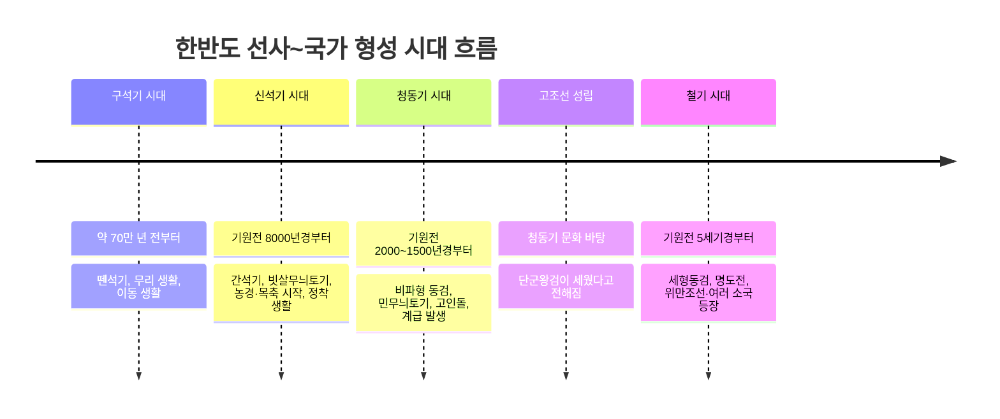
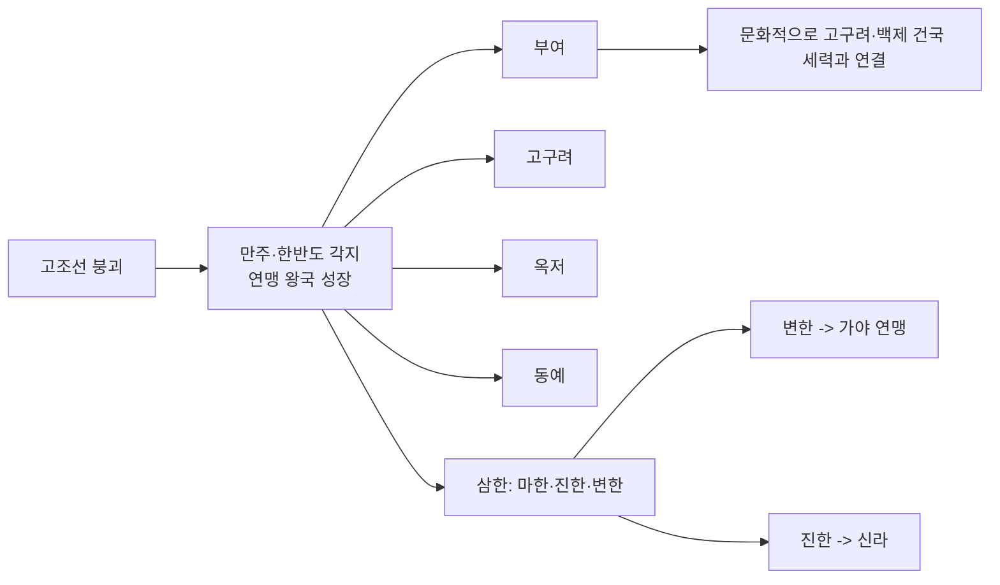

<Callout type="info">
  **이번 문서의 목표:** 이 파일을 다 읽으면 도구 재질에 따른 선사 시대 구분과 대표 유적을 말할 수 있고, 고조선의 성립·발전·멸망 과정과 8조법의 의미를 설명할 수 있으며, 부여·고구려·옥저·동예·삼한 각 소국의 정치·사회 특징을 서로 구분해 낼 수 있다.
</Callout>

## 왜 선사 시대부터 다시 보는가

독학사 4단계 국사는 단순 연표 암기가 아니라 "왜 그 시대에 그런 사회가 나타났는가"를 묻는 시험이다. 02편에서 이미 큰 흐름(선사→고대→중세→근세→근대→현대)을 정리했으니, 이 편부터는 각 시대의 구체 내용을 채워 넣는다. 먼저 국가가 없던 선사 시대에서 국가가 처음 등장하는 고조선·초기 소국까지를 다룬다. 이 구간은 유물·유적을 근거로 사회 구조를 추론하는 문제, 그리고 문헌 사료(『삼국지』 위서 동이전 등)에 나오는 소국별 풍습을 구분하는 문제가 반복 출제되는 영역이다.

## 선사 시대 구분: 도구 재질이 곧 사회 구조의 단서

> **쉽게 말하면:** 어떤 재질의 도구를 쓰느냐에 따라 시대를 나누고, 그 도구가 바꾼 생활 방식(이동 생활, 정착, 농경, 계급 발생)을 함께 본다.

고고학에서는 인류가 사용한 도구의 재질을 기준으로 **구석기 시대**, **신석기 시대**, **청동기 시대**, **철기 시대**로 시대를 구분한다. 이 구분이 중요한 이유는, 도구 재질이 바뀔 때마다 생산 방식과 사회 구조가 함께 바뀌었기 때문이다. 뗀석기만 쓰던 시절에는 계급이 없었지만, 청동기가 등장하면서 잉여 생산물과 사유재산이 생기고 계급이 나타난다. 독학사 시험에서는 "이 유물이 나온 시대의 사회상으로 옳은 것은?"처럼, 유물 하나로 시대와 사회상을 동시에 추론하게 하는 문항이 많다.

### 구석기 시대: 뗀석기와 무리 생활

**구석기 시대**(Old Stone Age)는 약 70만 년 전부터 시작된 것으로 보는 시기로, 돌을 깨뜨려 만든 **뗀석기**(打製石器, 타제석기)를 사용했다. 주먹도끼·찍개·긁개·밀개 등이 대표적인 뗀석기다. 이 시기 사람들은 사냥과 채집으로 먹을거리를 구했기 때문에 먹을거리를 찾아 계속 이동해야 했고, 정착지 없이 동굴이나 막집(임시 거처)에서 무리를 지어 살았다. 무리 안에서는 경험 많은 사람을 지도자로 세웠지만, 아직 재산이나 신분의 차이는 없는 **평등 사회**였다.

대표 유적으로는 경기 연천 전곡리(아슐리안형 주먹도끼 출토로 동아시아 구석기 연구에 큰 영향을 준 유적), 충남 공주 석장리(남한 최초로 발굴된 구석기 유적), 평남 상원 검은모루동굴 등이 있다. 독학사 시험에서는 유적 이름과 그 유적의 학술적 의의(예: 전곡리 주먹도끼가 모비우스 학설을 재검토하게 만든 계기라는 점)를 연결하는 문제가 나올 수 있으므로, 유적 이름만이 아니라 그 유적이 왜 중요한지도 함께 기억해야 한다.

### 신석기 시대: 간석기와 농경의 시작

> **쉽게 말하면:** 돌을 갈아서 정교하게 다듬은 도구를 쓰기 시작하면서, 사냥·채집에 의존하던 생활에서 벗어나 농사를 짓고 한곳에 머무르는 생활이 시작되었다.

**신석기 시대**(New Stone Age)는 기원전 8000년경부터 시작된 것으로 보며, 돌을 갈아 만든 **간석기**(磨製石器, 마제석기)를 사용했다. 이 시기 가장 큰 변화는 **농경과 목축의 시작**이다. 조·피·수수 등 잡곡류를 재배하기 시작했고(간석기인 돌괭이·돌보습이 이를 뒷받침), 이는 인류사에서 식량을 직접 생산하기 시작했다는 뜻에서 **신석기 혁명**이라고 부른다. 농경이 시작되면서 사람들은 강가나 해안가에 **움집**을 짓고 정착 생활을 시작했다. 움집은 반지하 형태로 땅을 파고 그 위에 지붕을 얹은 구조이며, 중앙에 화덕 자리가 남아 있는 경우가 많다.

토기도 이 시기에 처음 등장한다. 대표적인 것이 **빗살무늬토기**로, 표면에 빗살 같은 무늬를 새긴 뾰족밑 또는 둥근밑 토기다. 토기는 곡식이나 음식을 저장·조리하는 데 쓰였는데, 이는 정착 생활과 잉여 식량 저장이 결합된 결과다. 원시적인 신앙 형태도 이 시기에 나타난다. 자연물에 영혼이 있다고 믿는 **애니미즘**, 특정 동식물을 부족의 기원과 연결 짓는 **토테미즘**, 무당과 그 주술을 믿는 **샤머니즘**이 대표적이다.

대표 유적은 서울 암사동(빗살무늬토기와 움집터가 다수 발굴), 부산 동삼동(조개더미 유적, 패총), 제주 고산리(이른 시기 신석기 유적으로 주목) 등이다.

### 청동기 시대: 계급 사회의 등장

> **쉽게 말하면:** 청동은 귀하고 다루기 까다로운 금속이라 아무나 가질 수 없었고, 그래서 청동기를 가진 사람과 못 가진 사람 사이에 힘의 차이, 곧 계급이 생겨났다.

**청동기 시대**는 한반도에서 대체로 기원전 2000년~기원전 1500년경 사이에 시작된 것으로 본다(지역에 따라 편차가 있다). 청동은 구리에 주석 등을 섞어 만든 합금으로, 제작에 고도의 기술과 자원이 필요해 소수 지배층만 소유할 수 있었다. 그래서 청동기 시대부터 본격적으로 **계급 사회**가 나타난다. 청동기는 주로 지배자의 권위를 상징하는 무기·의기(儀器)로 쓰였고(대표 유물: 비파형 동검, 거친무늬 거울), 실제 농사에는 여전히 돌이나 나무로 만든 도구가 쓰였다. 대표적인 간석기로 곡식의 이삭을 자르는 **반달돌칼**이 있는데, 이는 벼농사를 포함한 농경이 이 시기에 본격화되었음을 보여준다.

토기는 무늬가 없거나 단순한 **민무늬토기**(무문토기)가 대표적이며, 지역에 따라 미송리식 토기(고조선 문화권과 관련) 등 다양한 형태가 나타난다. 계급 사회의 가장 뚜렷한 증거는 **고인돌**(지석묘)이다. 고인돌은 거대한 돌을 옮기고 세우는 데 많은 인력을 동원해야 하므로, 그만한 인력을 동원할 수 있는 지배자(족장)의 무덤으로 해석한다. 고인돌의 규모와 부장품 차이는 곧 피장자의 신분 차이를 보여주는 자료가 된다. 청동기 문화를 바탕으로 한반도 최초의 국가인 **고조선**이 성립한다.

### 철기 시대: 국가 간 경쟁의 심화

**철기 시대**는 기원전 5세기경부터 시작된 것으로 본다. 철은 청동보다 단단하고 구하기 쉬워, 철제 농기구(철제 괭이·낫 등)가 보급되면서 농업 생산력이 크게 늘었고, 철제 무기가 보급되면서 정복 전쟁이 활발해졌다. 청동기는 이 시기에도 계속 만들어지지만 성격이 바뀌어, 날렵하고 실용적인 **세형동검**과 잔무늬 거울처럼 의례용 성격이 강한 유물로 정교화된다. 중국 화폐인 **명도전**과 반량전 등이 한반도 서북부에서 출토되는데, 이는 중국과의 교역이 활발했음을 보여주는 증거로 자주 인용된다. 무덤 양식도 널무덤(토광묘)·독무덤(옹관묘) 등으로 다양해진다. 이 철기 문화를 바탕으로 고조선이 더 발전하고, 만주와 한반도 곳곳에서 부여·고구려·옥저·동예·삼한 같은 여러 소국(연맹 왕국)이 성장한다.

아래 표로 시대별 특징을 한눈에 비교한다.

| 시대 | 대표 도구 | 대표 유물 | 대표 유적 | 사회 성격 |
|------|-----------|-----------|-----------|-----------|
| 구석기 | 뗀석기 | 주먹도끼, 찍개 | 연천 전곡리, 공주 석장리 | 이동 생활, 평등 사회 |
| 신석기 | 간석기 | 빗살무늬토기, 돌보습 | 서울 암사동, 부산 동삼동 | 농경·정착 시작, 평등 사회 |
| 청동기 | 청동기+간석기 병용 | 비파형 동검, 고인돌, 반달돌칼 | 부여 송국리 | 계급 사회, 국가 형성(고조선) |
| 철기 | 철기 | 세형동검, 명도전 | 서북부 여러 유적 | 정복 전쟁 심화, 여러 소국 성장 |

## 고조선: 한반도 최초의 국가

> **쉽게 말하면:** 청동기 문화를 바탕으로 단군왕검이 세웠다고 전해지는 나라이며, 이후 위만이 집권한 뒤 철기 문화를 받아들여 한 군현에게 멸망당할 때까지 발전했다.

### 건국과 발전

『삼국유사』등의 기록에 따르면 **고조선**은 단군왕검이 세웠다고 전해진다. 실제 건국 연대를 현재의 역법으로 정확히 확정하기는 어렵고, 흔히 기원전 2333년으로 전해지는 연대는 후대 문헌에 기록된 전승 연대라는 점에 유의해야 한다. 시험에서는 "고조선은 청동기 문화를 바탕으로 성립한 우리 역사상 최초의 국가"라는 점, 그리고 단군 이야기(곰과 호랑이, 환웅과 웅녀 등)가 **건국 신화**로서 당시 사회상(농경 사회, 토테미즘, 제정일치 사회 등)을 반영한다는 해석이 중요하다.

고조선은 요령 지방을 중심으로 성장하다가 점차 대동강 유역까지 세력을 넓힌 것으로 추정한다. 기원전 4세기~3세기 무렵에는 중국 전국시대 연나라와 대립할 정도로 성장했다는 기록이 남아 있다. 이후 중국이 혼란해지면서 그 유이민이 고조선으로 유입되었는데, 그 가운데 **위만**이 세력을 키워 기원전 194년 무렵 당시 왕이던 준왕을 몰아내고 스스로 왕이 되었다. 이를 **위만조선**이라 부르며, 준왕이 남쪽으로 내려가 한(韓) 지역의 왕이 되었다는 기록도 함께 전해진다.

위만조선은 철기 문화를 본격적으로 수용해 국력을 키웠고, 중국의 한나라와 한반도 남쪽의 진(辰) 사이에서 중계 무역의 이익을 독점했다. 이 중계 무역 독점이 한 무제와의 갈등 원인 중 하나로 꼽힌다. 결국 한 무제의 침공을 받아 왕검성이 함락되면서 기원전 108년 고조선은 멸망했고, 한은 옛 고조선 땅에 낙랑·진번·임둔·현도 4개의 군현(한 군현)을 설치했다.

### 8조법으로 보는 고조선 사회

고조선의 사회상을 보여주는 대표 사료가 **8조법**(범금 8조)이다. 현재 전문이 모두 전해지지는 않고, 중국 역사서 『한서』 지리지에 다음 3개 조항이 남아 전해진다.

| 조항 | 내용 | 반영하는 사회상 |
|------|------|------------------|
| 1조 | 사람을 죽인 자는 즉시 사형에 처한다 | 생명 중시, 형법의 존재 |
| 2조 | 남에게 상해를 입힌 자는 곡물로 배상한다 | 농경 사회, 사유 재산 인정 |
| 3조 | 남의 물건을 훔친 자는 노비로 삼되, 죄를 면하려면 50만 전을 내야 한다 | 사유 재산 보호, 신분제(노비) 존재, 화폐(교환) 사용 정황 |

이 세 조항만으로도 고조선이 **사유 재산을 인정하고 보호하는 사회**, **신분 차이(노비)가 존재하는 사회**, **농경을 바탕으로 한 사회**였음을 추론할 수 있다. 독학사 시험에서는 "8조법의 내용을 통해 알 수 있는 고조선 사회의 모습으로 옳지 않은 것은?"과 같은 형태로 자주 출제되므로, 각 조항이 어떤 사회상을 보여주는지 연결해서 암기해야 한다.

## 철기 시대의 여러 소국: 연맹 왕국들의 개성

> **쉽게 말하면:** 고조선이 무너진 뒤 만주와 한반도 곳곳에서 여러 부족이 연합한 초기 국가(연맹 왕국)들이 성장했는데, 나라마다 제천 행사·혼인 풍습·법률이 서로 다르다.

고조선 멸망을 전후해 만주와 한반도 각지에서 **부여·고구려·옥저·동예·삼한**과 같은 여러 소국이 성장했다. 이들은 아직 강력한 왕권 아래 완전히 통합되지 않고, 여러 부족(집단)이 연맹을 이룬 **연맹 왕국** 단계에 머물러 있었다는 공통점이 있다. 이 소국들의 정치·사회 모습은 중국 역사서인 『삼국지』 위서 동이전에 비교적 자세히 기록되어 있어, 독학사 시험의 대표적인 **사료형 문항** 소재로 반복 출제된다. 각 소국을 구분하는 핵심은 제천 행사 이름, 혼인 풍습, 특이한 법률이나 풍습이다.

### 부여: 5부족 연맹과 엄격한 법

**부여**는 만주 쑹화강(송화강) 유역의 평야 지대를 중심으로 성장한 연맹 왕국이다. 왕 아래에 **마가·우가·저가·구가**라 불리는 여러 가(加, 부족장)들이 있었고, 이들이 각자 별도의 영역인 **사출도**를 다스렸다. 왕의 권력이 아직 부족장들을 완전히 압도하지 못한 연맹 왕국의 전형적인 모습이다. 매년 12월에는 **영고**라는 제천 행사를 열었는데, 이는 수렵 사회의 전통이 남아 있는 시기(추수 이후가 아니라 한겨울)에 열렸다는 점에서 다른 나라의 제천 행사와 구분된다. 풍습으로는 왕이 죽으면 많은 사람과 물건을 함께 묻는 **순장**, 도둑질한 자에게 훔친 물건의 12배를 배상하게 하는 **1책 12법**(형벌이 매우 엄격했음을 보여준다) 등이 있다.

### 고구려: 5부족 연맹과 서옥제

압록강 유역의 졸본 지역을 중심으로 성장한 **고구려**(초기 소국 단계) 역시 5부족 연맹체였다. 매년 10월에 **동맹**이라는 제천 행사를 열었으며, 이는 추수를 마친 뒤 감사의 의미로 여는 행사라는 점에서 부여의 영고(12월)와 시기가 다르다. 혼인 풍습으로는 남자가 결혼 후 신부 집 뒤편에 지은 작은 집(서옥)에서 살다가 자녀가 장성한 뒤에야 본가로 돌아가는 **서옥제**(데릴사위제의 일종)가 있었다.

### 옥저와 동예: 왕이 없는 군장 사회

**옥저**와 **동예**는 함경도·강원도 북부 동해안 지역에 위치했는데, 지리적으로 한반도 중심부에서 떨어져 있고 고구려의 압박을 받아 왕을 중심으로 한 강력한 국가로 성장하지 못하고 읍군·삼로 같은 군장이 각 지역을 다스리는 단계에 머물렀다.

옥저에는 어린 여자아이를 미리 신랑 집에서 데려다 키운 뒤 성인이 되면 다시 여자 집에 예물을 치르고 정식으로 혼인하는 **민며느리제**가 있었다. 또 가족이 죽으면 시신을 임시로 묻었다가 나중에 뼈를 추려 가족 공동의 큰 목곽에 함께 안치하는 **가족 공동 무덤**(골장제) 풍습이 있었다.

동예에는 매년 10월에 여는 제천 행사 **무천**이 있었고(고구려의 동맹과 마찬가지로 10월), 다른 부족의 영역을 침범하면 소나 말, 노비로 배상하게 하는 **책화** 제도가 있었다. 이는 부족 간 경계를 뚜렷이 구분하고 존중했던 사회임을 보여준다. 동예는 또한 같은 부족(씨족) 안에서는 결혼하지 않는 **족외혼** 풍습을 지켰다.

### 삼한: 제정 분리 사회

한반도 남부에는 **마한·진한·변한**으로 이루어진 **삼한**이 자리 잡고 있었다. 삼한의 정치 지도자는 신지·읍차 등으로 불렸는데, 이들의 권력은 아직 제한적이었다. 삼한에서 특히 주목할 점은 정치 지도자와 별도로 **천군**이라는 제사장이 있었고, 천군이 다스리는 **소도**라는 신성 지역이 따로 존재했다는 사실이다. 소도는 군장의 권력이 미치지 못하는 곳이어서, 죄를 지은 사람이 도망쳐 숨어도 함부로 잡아갈 수 없었다. 이처럼 정치적 지배자와 제사장이 분리되어 있던 사회를 **제정 분리 사회**라고 부르며, 이는 단군이 제사와 정치를 함께 주관했다고 여겨지는 고조선의 **제정일치** 단계와 대비되는 특징으로 자주 출제된다.

삼한은 매년 5월(씨뿌리기 이후)과 10월(추수 이후) 두 차례 계절제를 열어 하늘에 제사를 지냈다. 이 가운데 **변한**은 철이 많이 생산되어, 낙랑과 왜(일본) 등에 철을 수출했고 철 자체를 화폐처럼 사용하기도 했다고 전해진다. 변한은 이후 가야 연맹으로, 진한은 신라로 발전해 나간다.

아래 표로 각 소국의 특징을 정리한다.

| 소국 | 위치 | 정치 형태 | 제천 행사 | 대표 풍습 |
|------|------|-----------|-----------|-----------|
| 부여 | 쑹화강 유역 | 5부족 연맹(사출도) | 영고(12월) | 순장, 1책 12법 |
| 고구려 | 압록강 졸본 | 5부족 연맹 | 동맹(10월) | 서옥제 |
| 옥저 | 함경도 해안 | 군장 사회(읍군·삼로) | – | 민며느리제, 가족 공동 무덤 |
| 동예 | 강원도 북부 해안 | 군장 사회(읍군·삼로) | 무천(10월) | 책화, 족외혼 |
| 삼한 | 한반도 남부 | 군장 사회(신지·읍차) + 제사장(천군·소도) | 5월·10월 계절제 | 제정 분리, 변한의 철 생산 |

## 출제 포인트와 사료 읽기 요령

이 편의 내용은 독학사 4단계에서 크게 두 유형으로 출제된다. 첫째는 **유물·유적 제시형**으로, 특정 유물 사진이나 명칭을 주고 그 시대의 사회상을 고르게 하는 문제다. 이때는 도구 재질(뗀석기·간석기·청동기·철기)을 먼저 확인하고, 그 재질이 만들어내는 사회 변화(이동→정착→계급 발생→정복 전쟁)를 연결해서 풀어야 한다. 둘째는 **사료 제시형**으로, 8조법 조항이나 『삼국지』 위서 동이전의 소국별 풍습 기록을 인용문으로 제시하고 어느 나라에 대한 설명인지 묻는다. 이때는 제천 행사 이름(영고·동맹·무천·계절제)과 혼인·장례 풍습(서옥제·민며느리제·가족 공동 무덤)이 결정적 단서가 되므로, 나라별로 짝을 지어 정확히 암기해야 한다.

사료를 읽을 때 주의할 점은, 사료 속 표현이 **당시 사람의 기록**이라는 것과 오늘날 우리가 그것을 **해석한 결과**를 구분하는 것이다. 예를 들어 8조법 3조는 "노비로 삼고, 자속하려면 50만 전을 내야 한다"는 사실(史實) 자체를 전하고, 여기서 "사유 재산을 보호하는 사회"라는 결론은 후대 역사학의 **해석**이다. 독학사 시험의 함정 선지는 종종 사료에 없는 내용을 해석인 것처럼 끼워 넣으므로, 사료 원문에 실제로 나온 표현인지 항상 확인하는 습관이 필요하다.

## 핵심 정리

- 선사 시대는 도구 재질(뗀석기·간석기·청동기·철기)로 구분하며, 청동기 시대부터 계급 사회(고인돌)가 나타난다.
- 고조선은 청동기 문화를 바탕으로 성립했고, 위만조선 시기 철기 문화를 수용해 중계 무역으로 번성하다가 기원전 108년 한 무제에 의해 멸망했다.
- 8조법 3개 조항은 생명 중시, 사유 재산 보호, 신분제(노비) 존재를 보여주는 대표 사료다.
- 부여(영고, 사출도, 1책 12법)·고구려(동맹, 서옥제)·옥저(민며느리제)·동예(무천, 책화)·삼한(천군·소도, 제정 분리)은 제천 행사와 풍습으로 서로 구분해서 암기해야 한다.
- 삼한 중 변한은 철 생산지로 가야 연맹의 모태가 되고, 진한은 신라로 발전한다.

## 마무리 복습

<Quiz
  questionNumber={1}
  question="다음 중 청동기 시대의 사회 모습으로 가장 적절한 것은?"
  options={['이동 생활을 하며 무리를 지어 평등하게 살았다', '거대한 고인돌 축조를 지시할 수 있는 지배층이 등장했다', '중국 화폐인 명도전을 활발히 사용했다', '철제 무기로 정복 전쟁을 벌였다']}
  correctAnswer={2}
  explanation="고인돌은 많은 인력을 동원해야 만들 수 있는 거대한 무덤으로, 청동기 시대에 계급 사회와 지배층이 등장했음을 보여주는 대표 증거다."
  optionExplanations={['이동 생활과 평등 사회는 구석기 시대의 특징이다', '고인돌 축조는 청동기 시대 계급 사회의 대표 증거로 정답이다', '명도전 등 중국 화폐 사용은 철기 시대의 특징이다', '철제 무기를 이용한 정복 전쟁 심화는 철기 시대의 특징이다']}
/>

<Quiz
  questionNumber={2}
  question="고조선의 8조법 중 남의 물건을 훔친 자를 노비로 삼되 죄를 면하려면 50만 전을 내게 한 조항을 통해 알 수 있는 사회상으로 가장 적절한 것은?"
  options={['제정일치 사회였다', '사유 재산을 인정하고 보호했다', '노비 제도가 없는 평등 사회였다', '화폐 경제가 전혀 없었다']}
  correctAnswer={2}
  explanation="훔친 물건에 대한 배상과 노비화, 속죄금 제도는 개인의 재산을 침해한 행위를 엄격히 처벌한 것으로, 사유 재산을 인정하고 보호하는 사회였음을 보여준다."
  optionExplanations={['제정일치는 단군 이야기 등 다른 자료로 추론하는 내용이지 이 조항의 핵심이 아니다', '재산 침해를 엄격히 처벌한 것이 사유 재산 보호를 보여주므로 정답이다', '노비로 삼는다는 표현 자체가 신분 차이(노비)가 있었음을 보여준다', '50만 전이라는 표현은 화폐(교환 수단)의 존재를 시사한다']}
/>

<Quiz
  questionNumber={3}
  question="다음 설명에 해당하는 나라는 어디인가? 5부족이 연맹을 이루었고, 매년 12월에 영고라는 제천 행사를 열었으며, 왕이 죽으면 사람을 함께 묻는 순장 풍습이 있었다."
  options={['고구려', '옥저', '부여', '동예']}
  correctAnswer={3}
  explanation="12월 제천 행사인 영고와 순장 풍습은 부여의 대표적인 특징이다."
  optionExplanations={['고구려의 제천 행사는 10월 동맹이며 서옥제가 특징이다', '옥저는 왕이 없는 군장 사회로 민며느리제가 특징이다', '영고와 순장은 부여의 특징이므로 정답이다', '동예의 제천 행사는 10월 무천이며 책화가 특징이다']}
/>

<Quiz
  questionNumber={4}
  question="다른 부족의 영역을 침범하면 소나 말, 노비로 배상하게 한 책화 제도와 매년 10월 무천이라는 제천 행사를 가졌던 나라는?"
  options={['동예', '삼한', '부여', '고구려']}
  correctAnswer={1}
  explanation="책화와 무천(10월)은 동예의 대표적인 풍습이다."
  optionExplanations={['책화와 무천은 동예의 특징이므로 정답이다', '삼한은 천군과 소도로 대표되는 제정 분리 사회다', '부여의 제천 행사는 12월 영고다', '고구려의 제천 행사는 10월 동맹이며 책화 제도는 없다']}
/>

<Quiz
  questionNumber={5}
  question="삼한에서 군장의 권력이 미치지 못하는 신성 지역으로, 죄인이 숨어도 함부로 잡아가지 못했던 곳의 이름은?"
  options={['서옥', '소도', '사출도', '골장제']}
  correctAnswer={2}
  explanation="소도는 천군이 다스리는 삼한의 신성 지역으로, 정치적 지배자(신지·읍차)의 권력이 미치지 못했다. 이는 삼한이 제정 분리 사회였음을 보여주는 핵심 근거다."
  optionExplanations={['서옥은 고구려 서옥제에서 사위가 머무는 집을 가리킨다', '천군이 다스리는 신성 지역이 소도이므로 정답이다', '사출도는 부여에서 마가·우가·저가·구가가 다스리던 구역이다', '골장제는 옥저의 가족 공동 무덤 풍습을 가리키는 표현이다']}
/>

<Quiz
  questionNumber={6}
  question="고조선에 대한 설명으로 옳지 않은 것은?"
  options={['청동기 문화를 바탕으로 성립한 우리 역사상 최초의 국가다', '위만이 집권한 이후 철기 문화를 본격적으로 수용했다', '한 무제의 침공으로 기원전 108년에 멸망했다', '멸망 이후 한반도 남부에 낙랑·진번·임둔·현도 4개 군현이 설치되었다']}
  correctAnswer={4}
  explanation="한 군현은 고조선의 옛 땅, 즉 한반도 서북부와 그 주변에 설치되었다. 한반도 남부에 설치되었다는 서술은 옳지 않다."
  optionExplanations={['고조선은 청동기 문화를 바탕으로 성립한 최초의 국가라는 서술은 옳다', '위만조선이 철기 문화를 수용해 국력을 키웠다는 서술은 옳다', '기원전 108년 한 무제의 침공으로 멸망했다는 서술은 옳다', '한 군현은 옛 고조선 땅(한반도 서북부 일대)에 설치되어 옳지 않은 서술이며, 이것이 정답이다']}
/>

<Quiz
  questionNumber={7}
  question="옥저의 풍습으로 옳은 것은?"
  options={['남자가 신부 집 뒤에 지은 서옥에서 살다가 본가로 돌아갔다', '어린 여자아이를 미리 신랑 집에서 데려다 키운 뒤 성장하면 혼인시켰다', '매년 10월 무천이라는 제천 행사를 열었다', '천군이 소도라는 신성 지역을 다스렸다']}
  correctAnswer={2}
  explanation="어린 여자아이를 미리 신랑 집에서 데려다 키운 뒤 성인이 되면 혼인시키는 민며느리제는 옥저의 대표 풍습이다."
  optionExplanations={['서옥제는 고구려의 풍습이다', '민며느리제는 옥저의 풍습이므로 정답이다', '무천은 동예의 제천 행사다', '천군과 소도는 삼한의 제정 분리 사회를 보여주는 요소다']}
/>

## 참고 자료

- [국사편찬위원회 한국사데이터베이스](https://db.history.go.kr) — 선사 시대 유적 발굴 자료와 『삼국지』 위서 동이전 등 원문 사료 확인
- [우리역사넷](https://contents.history.go.kr) — 선사~초기 국가 시대 개관 및 유물·유적 해설 자료
- [국가유산청](https://www.khs.go.kr) — 연천 전곡리, 서울 암사동 등 국가지정문화유산 현황 확인
