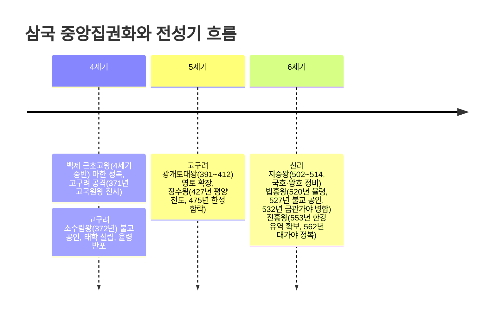
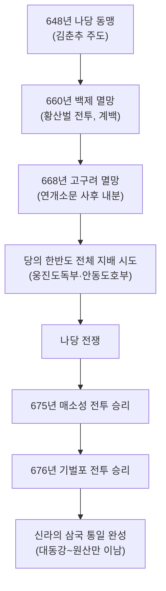

## 왜 삼국을 하나로 묶어서 보는가

03편에서 본 여러 소국(연맹 왕국) 가운데 고구려·백제·신라는 왕권을 강화하며 중앙집권 국가로 성장했고, 변한 지역의 소국들은 가야 연맹으로 발전했다. 독학사 4단계에서는 각국 왕의 업적을 단순 암기하는 데 그치지 않고, "중앙집권화의 공통 단계"(율령 반포, 불교 공인, 왕위 부자 상속 확립)를 뽑아 비교하는 문제와, 삼국 통일과 남북국 성립을 하나의 흐름으로 잇는 문제가 자주 나온다.

## 삼국과 가야의 성립

『삼국사기』등 후대에 정리된 문헌에는 삼국의 건국 연대가 다음과 같이 전해진다. 다만 이 연대는 각국의 왕실 계보를 소급해 기록한 **전승 연대**이며, 실제 국가 체제를 갖춘 시점은 이보다 후대(2~4세기경)로 보는 것이 일반적인 역사학의 해석이라는 점에 유의해야 한다.

| 국가 | 전승 건국 연대 | 건국 시조 | 건국 지역 |
|------|----------------|-----------|-----------|
| 고구려 | 기원전 37년 | 주몽 | 졸본(압록강 유역) |
| 백제 | 기원전 18년 | 온조 | 하남 위례성(한강 유역) |
| 신라 | 기원전 57년 | 박혁거세 | 사로국(경주 지역) |
| 금관가야 | 42년경 | 김수로 | 김해 지역(낙동강 하류) |

백제의 건국 세력은 고구려 계통의 유이민이 남하해 한강 유역의 토착 세력과 결합한 것으로 보는데, 이는 백제 왕족의 성씨가 부여씨였다는 점, 백제 초기 무덤 양식(계단식 돌무지무덤)이 고구려의 것과 유사하다는 점 등 여러 근거로 뒷받침된다. 가야는 낙동강 하류 변한 지역의 소국들이 연합한 **가야 연맹체**로, 하나로 통합된 중앙집권 국가로 발전하지는 못했다.

## 삼국의 중앙집권화: 같은 패턴, 다른 시기

삼국이 강력한 중앙집권 국가로 성장하는 데는 공통된 단계가 있다. 둘째, 나라 전체에 적용되는 통일된 법률인 **율령**을 반포해 지배 체제를 정비한다.

### 고구려의 중앙집권화와 전성기

고구려는 4세기 후반 **소수림왕**(재위 371~384) 때 372년 중국 전진으로부터 불교를 받아들여 공인하고, 국립 교육기관인 **태학**을 세웠으며, 통치 체제를 정비하는 **율령**을 반포했다. 이 시기의 정비를 바탕으로 5세기에 고구려는 최전성기를 맞는다.

### 백제의 중앙집권화와 전성기

백제는 삼국 중 가장 먼저 전성기를 맞았다. **근초고왕**(재위 346~375) 때인 4세기 중반, 백제는 남쪽으로 마한의 남은 세력을 정복해 한반도 서남부를 완전히 장악했고, 북쪽으로는 고구려를 공격해 371년 평양성 전투에서 고구려 고국원왕을 전사시켰다.

### 신라의 중앙집권화와 전성기

신라는 삼국 중 중앙집권화가 가장 늦었지만, 6세기에 접어들며 빠르게 체제를 정비했다. **지증왕**(재위 500~514)은 나라 이름을 '신라'로, 임금의 칭호를 '왕'으로 정했고, 이사부를 보내 우산국(울릉도 일대)을 복속시켰다.

아래 표로 삼국 중앙집권화의 핵심 지표를 비교한다.

| 국가 | 불교 공인 | 율령 반포 | 최대 전성기 | 전성기 군주 |
|------|-----------|-----------|-------------|-------------|
| 고구려 | 372년(소수림왕) | 소수림왕 대 | 5세기 | 광개토대왕·장수왕 |
| 백제 | 384년(침류왕, 동진에서 전래) | 3세기 후반 고이왕 대로 보는 견해가 일반적 | 4세기 중반 | 근초고왕 |
| 신라 | 527년(법흥왕, 이차돈 순교) | 520년(법흥왕) | 6세기 | 진흥왕 |

## 삼국 통일 과정: 나당 동맹에서 나당 전쟁까지

6세기 후반 이후 고구려·백제·신라는 서로 경쟁하며 국제전으로 얽혀 들어갔다. 신라는 한강 유역을 독차지한 이후 백제·고구려 양쪽으로부터 압박을 받았고, 이를 타개하기 위해 **김춘추**(훗날 태종무열왕)가 당과의 동맹을 추진했다. 648년 신라와 당은 백제와 고구려를 함께 멸망시키기로 하는 **나당 동맹**을 맺었다.

660년, 신라와 당의 연합군은 백제를 공격했다. 이어 668년에는 고구려가 멸망했다.

백제와 고구려가 차례로 무너진 뒤, 당은 애초 약속과 달리 옛 백제·고구려 땅은 물론 신라 지역까지 지배하려는 의도를 드러냈다(웅진도독부·안동도호부 등의 설치). 이에 신라는 당과의 전면전인 **나당 전쟁**을 벌였다.

신라의 삼국 통일은 외세인 당의 힘을 빌렸다는 점, 그리고 대동강 이북의 옛 고구려 영토 대부분을 확보하지 못했다는 점에서 그 한계를 지적하는 견해가 있다. 반면 처음으로 한반도 중남부의 여러 나라를 하나의 정치 체제 아래 통합하고, 이후 고구려 유민이 세운 발해와 함께 이른바 **남북국**의 형세를 이루었다는 점에서 역사적 의의를 부여하기도 한다.

## 통일신라의 통치 체제

### 중대의 왕권 강화

삼국 통일을 전후한 시기부터 혜공왕 대(8세기 후반)까지를 흔히 신라의 **중대**라 부르며, 이 시기는 무열왕 김춘추의 직계 자손이 왕위를 이었다는 특징과 함께 왕권이 진골 귀족 세력을 누르고 상대적으로 강했던 시기로 평가된다. 특히 **신문왕**(재위 681~692)은 즉위 직후 장인이던 김흠돌이 반란을 꾀하다 발각된 **김흠돌의 난**(681년)을 진압하는 과정에서 반발하는 진골 귀족 세력을 크게 숙청하고 왕권을 한층 강화했다.

### 중앙과 지방 통치 체제

통일신라의 중앙 정치는 왕명을 받들어 나랏일을 총괄하는 **집사부**와 그 장관인 **시중**(중시)을 중심으로 운영되었다. 이는 화백 회의를 주도하며 귀족의 이해를 대변하던 상대등의 권한이 상대적으로 약화되고, 왕의 명령을 직접 집행하는 관청의 권한이 강해졌음을 보여준다.

지방은 전국을 9개의 주로 나누고(9주), 수도 경주가 지리적으로 국토의 동남쪽에 치우쳐 있는 것을 보완하기 위해 정치·문화적 요지 다섯 곳에 **5소경**을 설치했다. 군사 조직으로는 중앙에 9서당, 지방에 10정을 두었는데, 9서당에는 신라인뿐 아니라 고구려·백제 유민과 말갈인까지 포함시켜, 통일 이후 다양한 출신의 주민을 하나의 국가 체제로 포섭하려 한 의도를 엿볼 수 있다.

### 하대의 혼란

혜공왕 이후를 **하대**라 부르는데, 이 시기에는 무열왕계가 아닌 여러 진골 귀족 가문이 서로 왕위를 다투면서 정치적 혼란이 심해졌다. 822년에는 웅천주(지금의 공주 일대) 도독이던 **김헌창**이 반란을 일으켰고, 9세기 말에는 지방에서 가혹한 세금 수취에 반발한 농민 봉기(대표적으로 889년 **원종·애노의 난**)가 잇따랐다.

## 발해의 성립과 성격, 대외관계

고구려가 멸망한 뒤 그 유민 중 일부는 당에 의해 강제로 이주당했다. 이 가운데 고구려 장수 출신으로 알려진 **대조영**이 고구려 유민과 말갈족 세력을 이끌고 당의 통제를 벗어나, 698년 만주 동모산 부근에서 나라를 세웠다. 처음 국호는 '진(震)'이었으나 이후 '발해'로 바뀌었다.

발해는 스스로 **고구려를 계승한 나라**라는 의식을 뚜렷이 가지고 있었다. 발해는 이후 영토를 크게 넓혀, 9세기 초 **선왕** 대에는 만주 대부분과 연해주 일대, 한반도 북부에 이르는 최대 영역을 확보했고, 이 시기 발해는 중국으로부터 '바다 동쪽의 융성한 나라'라는 뜻의 **해동성국**이라 불릴 만큼 번영했다.

발해의 통치 체제는 당의 3성 6부제를 본떴지만, 그 운영 방식은 발해 독자적이었다. 3성 가운데 정당성이 나머지 두 성(선조성·중대성)보다 우위에 서서 국정을 총괄했고, 정당성 아래 6부의 명칭도 유교 덕목(충·인·의·지·예·신)을 딴 독자적인 이름을 사용했다.

발해는 신라와는 대체로 견제하는 관계였지만 사신이 오가는 교통로(신라도)가 있었고, 당과는 초기 대립하다가 점차 사신을 교류하며 문물을 받아들이는 관계로 바뀌었으며, 일본과도 활발히 교류했다. 발해는 926년 거란(요)의 침입을 받아 멸망했다.

아래 표로 통일신라와 발해를 비교한다.

| 구분 | 통일신라 | 발해 |
|------|----------|------|
| 건국(성립) | 676년 삼국 통일 완성 | 698년 대조영 건국 |
| 중앙 정치 | 집사부(시중) 중심 | 3성 6부(정당성 중심) |
| 지방 행정 | 9주 5소경 | 5경 15부 62주(체제 정비, 지방 편) |
| 교육 기관 | 국학 | 주자감 |
| 대외 성격 | 당 문물 수용, 일본과 교류 | 고구려 계승 의식, 해동성국(선왕 대) |

## 핵심 정리

- 삼국은 왕위 부자 상속 확립 → 율령 반포 → 불교 공인 순서로 중앙집권화를 이루었으며, 고구려(4세기 소수림왕)가 가장 빠르고 신라(6세기 법흥왕)가 가장 늦었다.
- 전성기는 백제(4세기 근초고왕) → 고구려(5세기 광개토대왕·장수왕) → 신라(6세기 진흥왕) 순으로 이어졌다.
- 신라는 648년 나당 동맹, 660년 백제 멸망, 668년 고구려 멸망을 거쳐 675년 매소성·676년 기벌포 전투에서 당을 물리치고 676년 삼국 통일을 완성했다.
- 통일신라는 9주 5소경·9서당 10정 체제를 갖췄고, 신문왕 대(681~692) 김흠돌의 난 진압을 계기로 왕권을 강화했으나, 하대에는 왕위 다툼과 농민 봉기로 혼란해졌다.
- 발해는 698년 고구려 유민과 말갈족이 세운 나라로, 고구려 계승 의식을 가지고 있었으며 선왕 대에 해동성국이라 불렸으나 926년 거란에 멸망했다.

## 마무리 복습

<Quiz
  questionNumber={1}
  question={"다음 중 삼국의 중앙집권화 과정에서 가장 먼저 불교를 공인하고 율령을 반포한 나라는?"}
  options={["백제","신라","고구려","가야"]}
  correctAnswer={3}
  explanation={"고구려는 4세기 후반 소수림왕 때인 372년 불교를 공인하고 율령을 반포해, 삼국 중 가장 먼저 중앙집권 체제를 정비했다."}
/>

<Quiz
  questionNumber={2}
  question={"475년 백제의 수도 한성을 함락시키고 한강 유역 전체를 차지한 고구려의 왕은?"}
  options={["광개토대왕","장수왕","소수림왕","고국원왕"]}
  correctAnswer={2}
  explanation={"장수왕은 427년 평양 천도 이후 남진 정책을 펼쳐, 475년 백제 한성을 함락하고 개로왕을 전사시켜 한강 유역을 차지했다."}
/>

<Quiz
  questionNumber={3}
  question={"신라의 삼국 통일 과정을 순서대로 바르게 나열한 것은?"}
  options={["백제 멸망 – 나당 동맹 – 고구려 멸망 – 기벌포 전투","나당 동맹 – 백제 멸망 – 고구려 멸망 – 기벌포 전투","고구려 멸망 – 백제 멸망 – 나당 동맹 – 매소성 전투","나당 동맹 – 고구려 멸망 – 백제 멸망 – 매소성 전투"]}
  correctAnswer={2}
  explanation={"648년 나당 동맹 체결 이후 660년 백제가 멸망했고, 668년 고구려가 멸망했으며, 이후 나당 전쟁에서 675년 매소성, 676년 기벌포 전투를 거쳐 통일이 완성되었다."}
/>

## 참고 자료

- [국사편찬위원회 한국사데이터베이스](https://db.history.go.kr) — 삼국시대·남북국시대 연표 및 『삼국사기』·『삼국유사』 원문 확인
- [우리역사넷](https://contents.history.go.kr) — 삼국의 중앙집권화 과정과 통일신라·발해 통치 체제 개관
- [국가유산청](https://www.khs.go.kr) — 광개토대왕릉비, 진흥왕 순수비 등 관련 문화유산 정보
