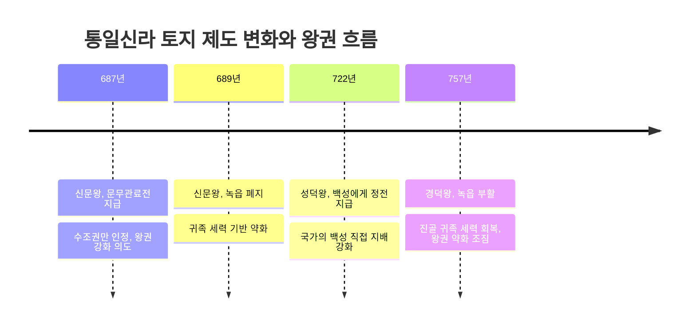
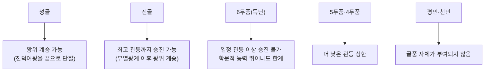

## 왜 토지·조세·신분을 따로 묶어서 보는가

04편에서는 삼국과 남북국의 정치사·대외관계를 시간 순서로 살펴보았다. 이 편에서는 같은 시기를 **제도사**의 눈으로 다시 본다.

## 고대의 토지 제도: 국가와 귀족의 힘겨루기

고대 사회에서 토지 제도를 이해하는 핵심 개념은 **수조권**(收租權)이다. 수조권과 함께 그 토지에 딸린 백성의 노동력까지 징발할 수 있는 권리가 함께 주어지느냐 아니냐가, 국가(왕)와 귀족 사이의 힘의 균형을 가늠하는 핵심 잣대가 된다.

### 삼국 시대: 식읍과 녹읍

삼국 시대에는 국가에 큰 공을 세운 왕족이나 공신에게 특정 지역을 통째로 지급하는 **식읍**(食邑)이 있었다. 관료들에게는 관직 복무의 대가로 **녹읍**(祿邑)이 지급되었는데, 녹읍 역시 식읍과 마찬가지로 조세 수취권과 함께 그 지역 노동력을 동원할 권한까지 포함하고 있었다.

### 통일신라: 관료전 지급과 녹읍 폐지, 그리고 부활

삼국을 통일한 뒤 왕권을 강화하려던 **신문왕**은 687년 관료들에게 **문무관료전**(관료전)을 지급했다. 이어 신문왕은 689년 기존의 녹읍을 아예 폐지했다.

같은 흐름에서 **성덕왕**은 722년 일반 백성에게도 토지(정전)를 지급하는 조치를 시행했다는 기록이 전해지는데, 이는 국가가 백성을 직접 파악하고 그로부터 조세를 안정적으로 거두려는 목적과 연결 지어 이해한다.

그러나 8세기 중반 **경덕왕** 대인 757년, 폐지되었던 녹읍이 다시 부활한다. 이는 통일신라 중대 후반부터 진골 귀족의 세력이 다시 강해지고 왕권이 상대적으로 약해졌음을 보여주는 대표적인 증거로 해석된다.

이 흐름을 표로 정리하면 다음과 같다.

| 제도 | 시행·개편 시점 | 지급 대상 | 노동력 동원권 | 정치적 의미 |
|------|----------------|-----------|----------------|-------------|
| 식읍 | 삼국 시대 이래 | 왕족·공신 | 인정 | 공신 우대, 왕권과 무관하게 넓게 인정 |
| 녹읍(1차) | 삼국–통일 초 | 관료 | 인정 | 귀족의 독자적 경제·군사 기반 |
| 문무관료전 | 687년(신문왕) | 관료 | 불인정(수조권만) | 왕권 강화, 귀족 견제 |
| 녹읍 폐지 | 689년(신문왕) | – | – | 귀족 세력 기반 축소 |
| 정전 | 722년(성덕왕) | 일반 백성 | 해당 없음 | 국가의 백성 직접 파악·지배 |
| 녹읍(부활) | 757년(경덕왕) | 관료 | 인정 | 진골 귀족 세력 회복, 왕권 약화 |

## 고대의 조세 구조: 조·용·조

고대 국가의 조세 제도는 크게 세 가지 항목으로 구성되었으며, 이를 흔히 **조·용·조** 체제라 부른다. 이 세 글자는 한자가 서로 달라 혼동하기 쉬우므로 뜻을 정확히 구분해야 한다.

- **조**(租, 토지세): 토지에서 거둔 곡식을 세금으로 내는 것. 대체로 수확량의 일정 비율을 거두었다.
- **용**(庸, 역): 국가가 필요로 하는 노동력을 백성에게 직접 징발하는 것. 성이나 도로를 쌓는 요역, 군대에 복무하는 군역이 대표적이다.
- **조**(調, 공납): 그 지역에서 나는 특산물(옷감, 수공업품 등)을 현물로 바치는 것.

이 세 항목은 국가 재정의 근간이었을 뿐 아니라, 백성의 삶에 직접적인 부담으로 작용했다. 조세 부담이 지나치게 무거워지면 백성이 토지를 버리고 도망치거나 봉기하는 사태로 이어졌는데, 04편에서 다룬 통일신라 하대의 원종·애노의 난(889년) 역시 가혹한 조세 수취가 배경으로 꼽힌다.

### 민정문서로 보는 촌락 파악 방식

통일신라의 조세·노동력 수취가 얼마나 정교하게 이루어졌는지를 보여주는 대표 사료가 **신라 촌락 문서**(민정문서)다. 이 문서는 일본 나라 도다이사 쇼소인(정창원)에서 발견되었으며, 서원경(지금의 청주 인근) 부근 4개 촌락을 대상으로 인구 수(연령·성별별 구분), 토지 면적(토지 종류별), 소와 말의 수, 뽕나무·잣나무·호두나무 같은 유실수의 수까지 매우 상세하게 기록하고 있다.

## 고대의 신분·계층 구조

### 삼국의 기본 신분 구조

삼국 시대의 신분은 크게 **귀족·평민·천민**으로 나뉘었다. 천민은 대부분 **노비**로 구성되었는데, 전쟁 포로가 노비가 되거나, 큰 죄를 지어 형벌로 노비가 되거나(03편에서 다룬 고조선 8조법의 절도죄 처벌이 대표 사례), 빚을 갚지 못해 노비로 전락하는 등 여러 경로로 신분이 정해졌다.

### 신라의 골품제

신라는 이러한 기본 구조 위에 **골품제**라는 매우 정교하고 폐쇄적인 신분 제도를 운영했다. 골품제는 크게 '골'(성골·진골)과 '두품'(6두품~1두품)으로 나뉘며, 성골은 오직 왕이 될 수 있는 최고 신분이었으나 진덕여왕을 끝으로 성골 남녀가 소진되면서 이후로는 진골 출신(김춘추 등)이 왕위에 올랐다.

특히 **6두품**은 진골 다음가는 신분으로 학문적 능력이 뛰어난 인물이 많았지만, 골품제의 벽에 막혀 중앙 최고 관직에는 오를 수 없었다. 이 때문에 6두품을 '얻기 어렵다'는 뜻에서 **득난**(得難)이라 부르기도 했다.

## 제도사 비교 문제 풀이 요령

독학사 4단계에서는 이 편의 내용을 단순 암기형이 아니라 **비교형** 문제로 자주 출제한다. 대표적인 유형은 다음과 같다.

1. **시점 비교형**: "687년과 689년, 722년, 757년에 각각 어떤 토지 제도 조치가 있었는지" 순서와 시점을 섞어 제시하고 올바른 조합을 고르게 한다. 이때는 "관료전 지급(687)→녹읍 폐지(689)→정전 지급(722)→녹읍 부활(757)"이라는 순서와, 각 조치가 왕권 강화(687·689·722)인지 약화 신호(757)인지를 함께 기억해야 한다.
2. **인과 추론형**: "녹읍이 폐지되었다는 사실을 통해 알 수 있는 정치 상황은?"처럼, 제도 변화의 원인이나 결과를 추론하게 한다.
3. **사료 연결형**: 신라 촌락 문서 같은 사료를 제시하고 그 사료가 보여주는 국가 운영 방식을 고르게 한다.
4. **신분제 함정형**: "6두품은 진골보다 낮지만 평민보다 낮은 신분이다"처럼 얼핏 맞아 보이지만 골품제의 핵심(관등 상한 제한)을 비켜 간 서술을 넣어 오답을 유도한다.

이런 유형에 대비하려면 표(위의 토지 제도 비교표)를 기준으로 **연도 → 왕 → 조치 내용 → 정치적 의미**를 한 줄로 연결해 암기하는 것이 효과적이다.

## 핵심 정리

- 삼국 시대에는 식읍·녹읍처럼 노동력 동원권까지 포함한 토지 제도가 귀족의 독자적 기반이 되었다.
- 신문왕은 687년 관료전을 지급하고 689년 녹읍을 폐지해 귀족을 견제하고 왕권을 강화했으며, 성덕왕은 722년 백성에게 정전을 지급했다.
- 경덕왕 대인 757년 녹읍이 부활한 것은 진골 귀족 세력이 다시 강해지고 왕권이 약화되던 통일신라 중대 후반의 정치 상황을 보여준다.
- 고대 조세는 조(토지세)·용(역)·조(공납)로 구성되었으며, 신라 촌락 문서는 국가가 촌락 단위 자원을 상세히 파악했음을 보여주는 대표 사료다.
- 신라 골품제는 성골·진골·6~1두품으로 구성되며, 두품에 따라 관등 상한선이 정해져 있어 6두품(득난)조차 최고 관직에 오르지 못했다.

## 마무리 복습

<Quiz
  questionNumber={1}
  question={"통일신라 신문왕이 687년 관료전을 지급하고 689년 녹읍을 폐지한 목적으로 가장 적절한 것은?"}
  options={["진골 귀족의 경제 기반을 강화하기 위해","귀족의 노동력 동원 권한을 없애 왕권을 강화하기 위해","백성에게 토지를 나누어 주기 위해","지방 호족 세력을 포섭하기 위해"]}
  correctAnswer={2}
  explanation={"관료전은 수조권만 인정하고 노동력 동원권은 인정하지 않았으며, 이어진 녹읍 폐지는 노동력 동원권까지 갖고 있던 귀족의 경제·군사 기반을 약화시켜 왕권을 강화하려는 조치였다."}
/>

<Quiz
  questionNumber={2}
  question={"757년 경덕왕 대에 부활한 제도와 그것이 보여주는 정치 상황으로 옳은 것은?"}
  options={["정전 지급 – 왕권 강화","녹읍 부활 – 진골 귀족 세력 회복","문무관료전 지급 – 귀족 견제","식읍 폐지 – 왕권 약화"]}
  correctAnswer={2}
  explanation={"757년 경덕왕 대에 녹읍이 부활한 것은 진골 귀족의 세력이 다시 강해지고 왕권이 상대적으로 약화된 통일신라 중대 후반의 상황을 보여준다."}
/>

<Quiz
  questionNumber={3}
  question={"고대 조세 구조인 조·용·조 중 노동력을 직접 징발하는 항목은?"}
  options={["조(租)","용(庸)","조(調)","식읍"]}
  correctAnswer={2}
  explanation={"용(庸)은 요역·군역처럼 국가가 필요로 하는 노동력을 백성에게 직접 징발하는 항목이다."}
/>

## 참고 자료

- [국사편찬위원회 한국사데이터베이스](https://db.history.go.kr) — 신라 촌락 문서(민정문서) 원문 및 해제, 관등제·골품제 관련 사료 확인
- [우리역사넷](https://contents.history.go.kr) — 통일신라 토지 제도 변천과 골품제 개관 자료
