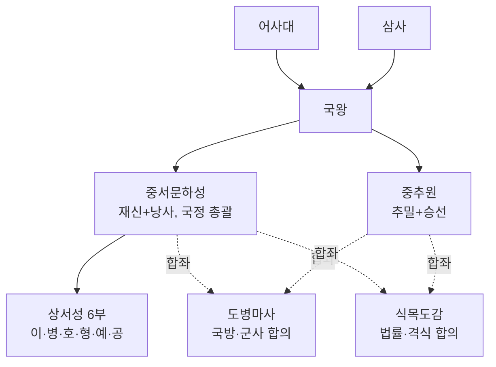
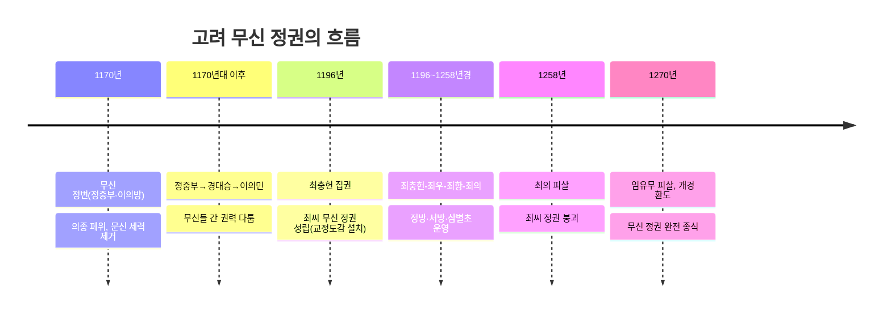

## 왜 고려의 정치·사회 구조를 별도로 보는가

04편에서 다룬 신라 하대의 혼란은 지방 호족 세력의 성장으로 이어졌고, 이 호족들 사이의 경쟁 속에서 후삼국이 성립했다가 결국 왕건이 세운 고려로 통합되었다. 918년 왕건이 고려를 건국했고, 935년 신라 경순왕이 스스로 항복했으며, 936년 후백제를 무너뜨리면서 고려는 후삼국을 통일했다.

## 고려의 중앙 통치 체제

고려의 중앙 관제는 당의 3성 6부제와 송의 중추원·삼사 제도를 받아들이되, 고려 실정에 맞게 재구성한 것이 특징이다. 당의 3성(중서성·문하성·상서성) 가운데 중서성과 문하성을 하나로 합쳐 **중서문하성**을 만든 것이 대표적인 예다.

송의 제도를 받아들여 만든 **중추원**은 군사 기밀을 다루는 **추밀**과 왕명 출납을 담당하는 **승선**으로 구성되었다. 관리의 비리를 감찰하는 **어사대**, 화폐와 곡식의 출납 회계를 담당하는 **삼사**도 함께 설치되었다.

고려 관제에서 가장 독자적인 특징은 **도병마사**와 **식목도감**이다. 두 기구 모두 중서문하성의 재신과 중추원의 추밀이 함께 모여 국가 중대사를 합의로 결정하는 **회의 기구**였다.

## 고려의 지방 행정 제도

고려의 지방 제도는 크게 일반 행정 구역인 **5도**와 국경 지대의 군사 행정 구역인 **양계**(북계·동계)로 나뉘었다. 5도에는 안찰사가 파견되어 지역을 순찰하며 지방을 감독했고, 양계에는 병마사가 파견되어 국방을 총괄했다.

고려 지방 제도에서 독학사 시험이 특히 주목하는 특징은, 지방관이 실제로 파견된 **주현**보다 지방관이 파견되지 않은 **속현**의 수가 더 많았다는 점이다. 속현에서는 중앙에서 내려온 지방관이 없었기 때문에, 그 지역 토착 세력인 **향리**가 실질적인 행정 업무를 담당했다.

## 향·소·부곡: 차별받는 특수 행정 구역

고려에는 일반 군현과 별도로 **향**·**소**·**부곡**이라는 특수 행정 구역이 있었다. 향과 부곡은 주로 국가 소유의 토지를 경작하는 농업 중심 지역이었고, **소**는 자기(도자기)·종이·먹·금·은 같은 특정 수공업품이나 광산물을 생산해 국가에 공급하는 지역이었다.

| 구역 | 주요 산업 | 처지 |
|------|-----------|------|
| 향 | 농업(국가 소유 토지 경작) | 일반 군현민보다 차별(과거 제한 등) |
| 부곡 | 농업(국가 소유 토지 경작) | 향과 유사한 차별 대우 |
| 소 | 수공업품·광산물 생산(자기·종이·먹 등) | 생산물 공납 부담이 무거움 |

## 지배층의 교체: 문벌귀족 → 무신 정권 → 권문세족

### 문벌귀족과 그 동요

고려 전기(대체로 11~12세기 초)의 지배층은 **문벌귀족**이라 불린다. 이들은 **과거**를 통해 관직에 진출하는 것은 물론, 조상의 공로로 후손이 시험 없이 관직에 등용되는 **음서** 제도를 적극 활용해 관직을 대물림했다.

이 경원 이씨 가문 출신의 **이자겸**은 왕실 외척으로서 막강한 권력을 휘두르다가 1126년 반란(이자겸의 난)을 일으켰으나 실패했다. 이 사건으로 문벌귀족 사회의 모순이 드러난 데 이어, 1135년에는 승려 묘청을 중심으로 한 서경 세력이 수도를 서경(평양)으로 옮기고 자주적인 태도를 강화하자고 주장하며 **묘청의 서경 천도 운동**을 일으켰다.

### 무신 정변과 무신 정권

문신 위주의 정치 운영과 무신에 대한 차별 대우에 대한 불만이 쌓인 끝에, 1170년 **정중부**·이의방 등 무신들이 정변을 일으켜 문신들을 대거 제거하고 의종을 폐위시켰다. 이를 **무신 정변**이라 하며, 이후 약 100년간 무신들이 실권을 장악하는 **무신 정권** 시기가 이어진다.

무신 정권 초기에는 정중부, 경대승, 이의민 등이 잇달아 최고 권력을 차지하며 서로 경쟁했다. 1196년 **최충헌**이 정권을 잡으면서 이후 최씨 무신 정권이 최우-최항-최의로 4대에 걸쳐 이어지며 비교적 안정적으로 권력을 유지했다(1196~1258년경).

1258년 최씨 정권 마지막 집권자인 최의가 제거되면서 최씨 정권은 무너졌지만, 이후에도 무신 세력이 완전히 물러나지는 않았고 몽골(원)과의 강화 및 개경 환도를 둘러싼 갈등 속에서 무신 정권의 잔여 세력이 이어지다, 1270년 임유무가 제거되면서 무신 정권은 완전히 종식되고 고려 왕실은 개경으로 환도했다.

### 원 간섭기의 권문세족

13세기 후반 고려가 원(몽골)의 간섭을 받게 된 이후, 원과의 관계를 배경으로 새롭게 성장한 지배층이 **권문세족**이다. 이들은 원의 세력을 등에 업고 성장한 부원 세력을 포함하며, 앞서 다룬 **도평의사사**(도병마사가 확대·개편된 기구)를 장악해 국정을 좌우했다.

아래 표로 세 지배층을 비교한다.

| 구분 | 문벌귀족 | 무신 정권 | 권문세족 |
|------|----------|-----------|----------|
| 시기 | 고려 전기(11–12세기 초) | 1170–1270년 | 13세기 후반–14세기(원 간섭기) |
| 권력 기반 | 과거·음서, 공음전, 폐쇄적 혼인 | 무력(삼별초 등 사병), 교정도감·정방 | 원과의 관계, 도평의사사 장악 |
| 대표 사건·인물 | 이자겸의 난(1126), 묘청의 서경 천도 운동(1135) | 무신 정변(1170), 최씨 정권(1196–1258) | 부원 세력, 대농장 소유 |
| 쇠퇴 계기 | 무신 정변으로 몰락 | 몽골과의 강화, 개경 환도(1270) | 신진 사대부 성장, 고려 말 개혁 |

## 고려의 신분 구조: 양천제와 그 실제

고려의 신분 제도는 법제상 **양천제**, 즉 자유민인 **양인**과 그렇지 못한 **천인**으로 크게 구분되었다. 그 아래에는 **중류층**이라 불리는 실무 담당 계층이 있었는데, 지방 행정 실무를 담당한 **향리**, 중앙 관청의 말단 실무를 맡은 **서리**, 궁궐에서 왕을 가까이서 보좌한 **남반**, 군인 신분을 세습한 **군반**, 하급 기술관인 **잡류** 등이 여기에 해당한다.

천인은 대부분 **노비**로 구성되었다. 노비는 관청에 속한 **공노비**와 개인(귀족·사원 등)이 소유한 **사노비**로 나뉘었으며, 재산으로 취급되어 매매·상속·증여의 대상이 되었다는 점이 고려 신분제의 가장 낮은 위치를 상징적으로 보여준다.

## 핵심 정리

- 고려 중앙 관제는 중서문하성(재신·낭사)과 상서성 6부를 중심으로 하며, 도병마사·식목도감처럼 재신과 추밀이 합의로 국정을 결정하는 독자적 회의 기구를 두어 귀족 정치의 성격을 보였다.
- 지방은 5도(안찰사)와 양계(병마사)로 나뉘었고, 지방관이 파견되지 않은 속현이 더 많아 향리가 실질적인 지방 행정을 담당했다.
- 향·소·부곡민은 법적으로 양인이었지만 과거 응시 제한 등 일반 군현민과 다른 차별 대우를 받았다.
- 지배층은 고려 전기 문벌귀족(과거·음서·공음전) → 1170년 무신 정변 이후 무신 정권(1196~1258년경 최씨 정권) → 원 간섭기 권문세족(도평의사사 장악) 순으로 교체되었다.
- 고려의 신분 제도는 법제상 양천제였지만, 실제로는 귀족-중류층(향리·서리·남반 등)-양민-천민(공노비·사노비)으로 세분화되어 있었다.

## 마무리 복습

<Quiz
  questionNumber={1}
  question={"고려 중앙 관제 중 재신과 추밀이 함께 모여 국방·군사 문제를 논의한 회의 기구는?"}
  options={["중서문하성","중추원","도병마사","어사대"]}
  correctAnswer={3}
  explanation={"도병마사는 중서문하성의 재신과 중추원의 추밀이 합좌해 국방·군사 문제를 논의한 고려의 독자적인 회의 기구다."}
/>

<Quiz
  questionNumber={2}
  question={"고려의 지방 제도에 대한 설명으로 옳지 않은 것은?"}
  options={["5도에는 안찰사가 파견되어 지역을 순찰했다","양계는 국경 지대에 설치된 군사 행정 구역이다","지방관이 파견된 주현보다 파견되지 않은 속현이 더 많았다","속현에서는 향리 없이 중앙 관리만 행정을 담당했다"]}
  correctAnswer={4}
  explanation={"속현은 지방관이 파견되지 않은 지역이었으므로, 실질적인 행정 업무는 토착 세력인 향리가 담당했다. 향리 없이 중앙 관리만 행정을 담당했다는 서술은 옳지 않다."}
/>

<Quiz
  questionNumber={3}
  question={"1170년 무신 정변을 일으켜 문신 세력을 제거하고 의종을 폐위시킨 주도 세력으로 옳은 것은?"}
  options={["이자겸","정중부·이의방","최충헌","묘청"]}
  correctAnswer={2}
  explanation={"1170년 정중부·이의방 등 무신들이 정변을 일으켜 문신들을 제거하고 의종을 폐위시키면서 무신 정권 시대가 시작되었다."}
/>

## 참고 자료

- [국사편찬위원회 한국사데이터베이스](https://db.history.go.kr) — 고려시대 관제·지방 제도 및 무신 정권 관련 사료 확인
- [우리역사넷](https://contents.history.go.kr) — 고려의 중앙·지방 통치 체제, 향·소·부곡, 지배층 변천 개관 자료
- [국가유산청](https://www.khs.go.kr) — 고려시대 관련 문화유산 및 유적 정보
