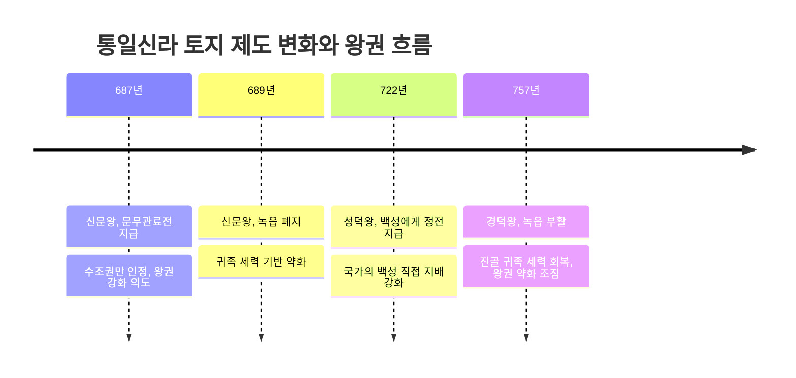
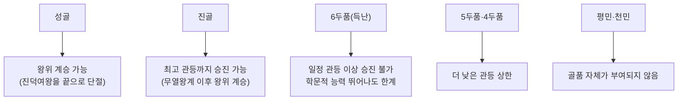

<Callout type="info">
  **이번 문서의 목표:** 이 파일을 다 읽으면 식읍·녹읍·관료전·정전의 차이와 통일신라에서 녹읍이 폐지되었다가 부활한 이유를 설명할 수 있고, 조·용·조로 구성된 고대 조세 구조와 골품제를 비롯한 신분 구조를 왕권 강약의 흐름과 연결해 이해할 수 있다.
</Callout>

## 왜 토지·조세·신분을 따로 묶어서 보는가

06편에서는 삼국과 남북국의 정치사·대외관계를 시간 순서로 살펴보았다. 이 편에서는 같은 시기를 **제도사**의 눈으로 다시 본다. 독학사 4단계 국사는 정치사 흐름만 아는 것으로는 풀 수 없는, "이 제도가 왜 도입되었고 왜 바뀌었는가"를 묻는 문항의 비중이 크다. 특히 토지 제도는 왕권과 귀족 세력의 힘겨루기를 그대로 반영하는 지표이기 때문에, 토지 제도 하나의 변화만 따라가도 그 시기 정치 상황을 거꾸로 추론할 수 있다. 이 편의 내용은 뒤의 18편(시대 횡단 비교)에서 고려·조선 시기 토지·신분 제도와 다시 이어지므로, 여기서 다지는 개념이 이후 편들의 기초가 된다.

## 고대의 토지 제도: 국가와 귀족의 힘겨루기

> **쉽게 말하면:** 토지 제도의 핵심은 "누가 그 땅에서 세금을 걷을 권리(수조권)를 갖는가"이며, 그 권리를 귀족에게 얼마나 넓게 주느냐가 왕권과 귀족 세력 사이의 힘의 크기를 보여준다.

고대 사회에서 토지 제도를 이해하는 핵심 개념은 **수조권**(收租權)이다. 이는 토지 자체의 소유권이 아니라, 그 토지에서 나는 곡식이나 생산물 중 일부를 세금으로 거둘 수 있는 권리를 말한다. 국왕은 관료나 공신에게 토지를 나눠 줄 때 대개 토지 자체를 넘기는 것이 아니라 이 수조권을 준 것으로 이해한다. 수조권과 함께 그 토지에 딸린 백성의 노동력까지 징발할 수 있는 권리가 함께 주어지느냐 아니냐가, 국가(왕)와 귀족 사이의 힘의 균형을 가늠하는 핵심 잣대가 된다.

### 삼국 시대: 식읍과 녹읍

삼국 시대에는 국가에 큰 공을 세운 왕족이나 공신에게 특정 지역을 통째로 지급하는 **식읍**(食邑)이 있었다. 식읍을 받은 사람은 그 지역에서 조세를 거둘 뿐 아니라 노동력까지 동원할 수 있어, 사실상 그 지역에 대한 지배권을 인정받는 셈이었다. 관료들에게는 관직 복무의 대가로 **녹읍**(祿邑)이 지급되었는데, 녹읍 역시 식읍과 마찬가지로 조세 수취권과 함께 그 지역 노동력을 동원할 권한까지 포함하고 있었다. 이 때문에 녹읍을 많이 가진 귀족은 자신의 경제적·군사적 기반을 독자적으로 키울 수 있었고, 이는 곧 왕권을 견제하는 힘으로 이어질 수 있었다.

### 통일신라: 관료전 지급과 녹읍 폐지, 그리고 부활

삼국을 통일한 뒤 왕권을 강화하려던 **신문왕**은 687년 관료들에게 **문무관료전**(관료전)을 지급했다. 관료전은 녹읍과 달리 토지에서 나는 곡식에 대한 수조권만 인정하고, 그 토지에 딸린 노동력을 동원할 권한은 인정하지 않았다. 이어 신문왕은 689년 기존의 녹읍을 아예 폐지했다. 관료전 지급과 녹읍 폐지를 함께 놓고 보면, 그 의도가 분명해진다. 귀족이 노동력까지 동원할 수 있는 녹읍이라는 강력한 경제적 기반을 없애고, 수조권만 인정되는 관료전으로 바꿈으로써 귀족의 세력 기반을 약화시키고 왕에게 권력을 집중시키려 한 것이다.

같은 흐름에서 **성덕왕**은 722년 일반 백성에게도 토지(정전)를 지급하는 조치를 시행했다는 기록이 전해지는데, 이는 국가가 백성을 직접 파악하고 그로부터 조세를 안정적으로 거두려는 목적과 연결 지어 이해한다.

그러나 8세기 중반 **경덕왕** 대인 757년, 폐지되었던 녹읍이 다시 부활한다. 이는 통일신라 중대 후반부터 진골 귀족의 세력이 다시 강해지고 왕권이 상대적으로 약해졌음을 보여주는 대표적인 증거로 해석된다. 실제로 경덕왕 이후 신라는 혜공왕 대의 혼란을 거쳐 왕위 쟁탈전이 빈번한 하대로 접어드는데, 녹읍 부활은 이러한 하대 혼란의 전조로 다뤄진다.

이 흐름을 표로 정리하면 다음과 같다.

| 제도 | 시행·개편 시점 | 지급 대상 | 노동력 동원권 | 정치적 의미 |
|------|----------------|-----------|----------------|-------------|
| 식읍 | 삼국 시대 이래 | 왕족·공신 | 인정 | 공신 우대, 왕권과 무관하게 넓게 인정 |
| 녹읍(1차) | 삼국–통일 초 | 관료 | 인정 | 귀족의 독자적 경제·군사 기반 |
| 문무관료전 | 687년(신문왕) | 관료 | 불인정(수조권만) | 왕권 강화, 귀족 견제 |
| 녹읍 폐지 | 689년(신문왕) | – | – | 귀족 세력 기반 축소 |
| 정전 | 722년(성덕왕) | 일반 백성 | 해당 없음 | 국가의 백성 직접 파악·지배 |
| 녹읍(부활) | 757년(경덕왕) | 관료 | 인정 | 진골 귀족 세력 회복, 왕권 약화 |

## 고대의 조세 구조: 조·용·조

> **쉽게 말하면:** 백성은 국가에 곡식(조), 노동력(용), 특산물(조)이라는 세 가지 형태로 세금을 냈다.

고대 국가의 조세 제도는 크게 세 가지 항목으로 구성되었으며, 이를 흔히 **조·용·조** 체제라 부른다. 이 세 글자는 한자가 서로 달라 혼동하기 쉬우므로 뜻을 정확히 구분해야 한다.

- **조**(租, 토지세): 토지에서 거둔 곡식을 세금으로 내는 것. 대체로 수확량의 일정 비율을 거두었다.
- **용**(庸, 역): 국가가 필요로 하는 노동력을 백성에게 직접 징발하는 것. 성이나 도로를 쌓는 요역, 군대에 복무하는 군역이 대표적이다.
- **조**(調, 공납): 그 지역에서 나는 특산물(옷감, 수공업품 등)을 현물로 바치는 것.

이 세 항목은 국가 재정의 근간이었을 뿐 아니라, 백성의 삶에 직접적인 부담으로 작용했다. 조세 부담이 지나치게 무거워지면 백성이 토지를 버리고 도망치거나 봉기하는 사태로 이어졌는데, 06편에서 다룬 통일신라 하대의 원종·애노의 난(889년) 역시 가혹한 조세 수취가 배경으로 꼽힌다.

### 민정문서로 보는 촌락 파악 방식

통일신라의 조세·노동력 수취가 얼마나 정교하게 이루어졌는지를 보여주는 대표 사료가 **신라 촌락 문서**(민정문서)다. 이 문서는 일본 나라 도다이사 쇼소인(정창원)에서 발견되었으며, 서원경(지금의 청주 인근) 부근 4개 촌락을 대상으로 인구 수(연령·성별별 구분), 토지 면적(토지 종류별), 소와 말의 수, 뽕나무·잣나무·호두나무 같은 유실수의 수까지 매우 상세하게 기록하고 있다. 이는 국가가 조세와 노동력을 효율적으로 거두기 위해 촌락 단위의 자원을 정기적으로 조사·파악하고 있었음을 보여주는 실증 자료로, 독학사 시험에서 "다음 사료가 보여주는 통일신라 국가 운영의 특징으로 옳은 것은?"과 같은 사료형 문항의 단골 소재다.

## 고대의 신분·계층 구조

> **쉽게 말하면:** 고대 사회의 신분은 태어날 때부터 정해져 있었고, 특히 신라의 골품제는 능력과 무관하게 오를 수 있는 관직의 상한선까지 정해 놓았다.

### 삼국의 기본 신분 구조

삼국 시대의 신분은 크게 **귀족·평민·천민**으로 나뉘었다. 귀족은 왕족이나 옛 부족장 출신으로 정치·군사 권력과 넓은 토지를 독점했다. 평민은 대다수를 이루는 농민층으로, 조·용·조의 조세 부담을 실제로 짊어지는 계층이었다. 천민은 대부분 **노비**로 구성되었는데, 전쟁 포로가 노비가 되거나, 큰 죄를 지어 형벌로 노비가 되거나(05편에서 다룬 고조선 8조법의 절도죄 처벌이 대표 사례), 빚을 갚지 못해 노비로 전락하는 등 여러 경로로 신분이 정해졌다.

### 신라의 골품제

신라는 이러한 기본 구조 위에 **골품제**라는 매우 정교하고 폐쇄적인 신분 제도를 운영했다. 골품제는 크게 '골'(성골·진골)과 '두품'(6두품~1두품)으로 나뉘며, 성골은 오직 왕이 될 수 있는 최고 신분이었으나 진덕여왕을 끝으로 성골 남녀가 소진되면서 이후로는 진골 출신(김춘추 등)이 왕위에 올랐다. 골품제의 가장 큰 특징은 신분에 따라 오를 수 있는 **관등의 상한선**이 정해져 있었다는 점이다. 아무리 능력이 뛰어나도 두품이 낮으면 일정 관등 이상으로는 승진할 수 없었고, 이 제한은 관직뿐 아니라 집의 규모, 수레의 장식, 옷의 색깔 같은 일상생활 전반까지 규제했다.

특히 **6두품**은 진골 다음가는 신분으로 학문적 능력이 뛰어난 인물이 많았지만, 골품제의 벽에 막혀 중앙 최고 관직에는 오를 수 없었다. 이 때문에 6두품을 '얻기 어렵다'는 뜻에서 **득난**(得難)이라 부르기도 했다. 통일신라 하대에 이르면 골품제의 한계에 불만을 품은 일부 6두품 지식인들이 당에 유학해 빈공과(당에서 외국인에게 실시한 과거)에 합격하는 등(대표적으로 최치원) 국제적인 학문 경험을 쌓았지만, 귀국 후에도 신라 사회의 골품제 벽을 넘지 못했다. 이러한 6두품의 좌절은 이후 신라 하대 사회 동요, 나아가 새로운 정치 세력(호족) 및 사상(선종·풍수지리설 등)과 결합하는 배경으로 다뤄지며, 뒤의 08편(고려의 정치 체제)에서 고려 건국 세력과의 연결로 다시 이어진다.

## 제도사 비교 문제 풀이 요령

독학사 4단계에서는 이 편의 내용을 단순 암기형이 아니라 **비교형** 문제로 자주 출제한다. 대표적인 유형은 다음과 같다.

1. **시점 비교형**: "687년과 689년, 722년, 757년에 각각 어떤 토지 제도 조치가 있었는지" 순서와 시점을 섞어 제시하고 올바른 조합을 고르게 한다. 이때는 "관료전 지급(687)→녹읍 폐지(689)→정전 지급(722)→녹읍 부활(757)"이라는 순서와, 각 조치가 왕권 강화(687·689·722)인지 약화 신호(757)인지를 함께 기억해야 한다.
2. **인과 추론형**: "녹읍이 폐지되었다는 사실을 통해 알 수 있는 정치 상황은?"처럼, 제도 변화의 원인이나 결과를 추론하게 한다.
3. **사료 연결형**: 신라 촌락 문서 같은 사료를 제시하고 그 사료가 보여주는 국가 운영 방식을 고르게 한다.
4. **신분제 함정형**: "6두품은 진골보다 낮지만 평민보다 낮은 신분이다"처럼 얼핏 맞아 보이지만 골품제의 핵심(관등 상한 제한)을 비켜 간 서술을 넣어 오답을 유도한다.

이런 유형에 대비하려면 표(위의 토지 제도 비교표)를 기준으로 **연도 → 왕 → 조치 내용 → 정치적 의미**를 한 줄로 연결해 암기하는 것이 효과적이다.

## 핵심 정리

- 삼국 시대에는 식읍·녹읍처럼 노동력 동원권까지 포함한 토지 제도가 귀족의 독자적 기반이 되었다.
- 신문왕은 687년 관료전을 지급하고 689년 녹읍을 폐지해 귀족을 견제하고 왕권을 강화했으며, 성덕왕은 722년 백성에게 정전을 지급했다.
- 경덕왕 대인 757년 녹읍이 부활한 것은 진골 귀족 세력이 다시 강해지고 왕권이 약화되던 통일신라 중대 후반의 정치 상황을 보여준다.
- 고대 조세는 조(토지세)·용(역)·조(공납)로 구성되었으며, 신라 촌락 문서는 국가가 촌락 단위 자원을 상세히 파악했음을 보여주는 대표 사료다.
- 신라 골품제는 성골·진골·6~1두품으로 구성되며, 두품에 따라 관등 상한선이 정해져 있어 6두품(득난)조차 최고 관직에 오르지 못했다.

## 마무리 복습

<Quiz
  questionNumber={1}
  question="통일신라 신문왕이 687년 관료전을 지급하고 689년 녹읍을 폐지한 목적으로 가장 적절한 것은?"
  options={['진골 귀족의 경제 기반을 강화하기 위해', '귀족의 노동력 동원 권한을 없애 왕권을 강화하기 위해', '백성에게 토지를 나누어 주기 위해', '지방 호족 세력을 포섭하기 위해']}
  correctAnswer={2}
  explanation="관료전은 수조권만 인정하고 노동력 동원권은 인정하지 않았으며, 이어진 녹읍 폐지는 노동력 동원권까지 갖고 있던 귀족의 경제·군사 기반을 약화시켜 왕권을 강화하려는 조치였다."
  optionExplanations={['귀족의 경제 기반 강화는 오히려 녹읍 부활(757년)의 효과에 가깝다', '노동력 동원권을 없애 왕권을 강화한 것이 정답이다', '백성에게 토지를 지급한 조치는 722년 성덕왕의 정전 지급이다', '지방 호족 세력 포섭은 통일신라 하대 이후의 상황과 관련이 깊다']}
/>

<Quiz
  questionNumber={2}
  question="757년 경덕왕 대에 부활한 제도와 그것이 보여주는 정치 상황으로 옳은 것은?"
  options={['정전 지급 – 왕권 강화', '녹읍 부활 – 진골 귀족 세력 회복', '문무관료전 지급 – 귀족 견제', '식읍 폐지 – 왕권 약화']}
  correctAnswer={2}
  explanation="757년 경덕왕 대에 녹읍이 부활한 것은 진골 귀족의 세력이 다시 강해지고 왕권이 상대적으로 약화된 통일신라 중대 후반의 상황을 보여준다."
  optionExplanations={['정전 지급은 722년 성덕왕 대의 조치다', '녹읍 부활과 진골 귀족 세력 회복의 연결이 옳으므로 정답이다', '문무관료전 지급은 687년 신문왕 대의 조치다', '식읍 폐지에 대한 기록은 이 편에서 다루지 않았다']}
/>

<Quiz
  questionNumber={3}
  question="고대 조세 구조인 조·용·조 중 노동력을 직접 징발하는 항목은?"
  options={['조(租)', '용(庸)', '조(調)', '식읍']}
  correctAnswer={2}
  explanation="용(庸)은 요역·군역처럼 국가가 필요로 하는 노동력을 백성에게 직접 징발하는 항목이다."
  optionExplanations={['조(租)는 토지에서 거두는 곡식 세금이다', '용(庸)이 노동력 징발이므로 정답이다', '조(調)는 그 지역 특산물을 현물로 바치는 공납이다', '식읍은 토지 제도이지 조세 항목이 아니다']}
/>

<Quiz
  questionNumber={4}
  question="신라 촌락 문서(민정문서)에 대한 설명으로 옳지 않은 것은?"
  options={['일본 정창원(쇼소인)에서 발견되었다', '서원경 부근 촌락의 인구·토지·가축 등을 기록했다', '국가가 조세와 노동력을 효율적으로 거두기 위한 자료로 해석된다', '신라 하대 농민 봉기 이후 작성이 중단된 것으로 확실히 밝혀졌다']}
  correctAnswer={4}
  explanation="촌락 문서의 정확한 작성 중단 시점이나 그 원인이 농민 봉기와 직접 연결된다는 사실은 명확히 밝혀져 있지 않으므로, 이를 단정하는 서술은 옳지 않다."
  optionExplanations={['일본 정창원에서 발견되었다는 설명은 옳다', '서원경 부근 촌락의 여러 자원을 기록했다는 설명은 옳다', '국가의 조세·노동력 수취를 위한 자료라는 해석은 옳다', '작성 중단 시점과 원인을 단정할 근거가 없으므로 옳지 않은 서술이며 정답이다']}
/>

<Quiz
  questionNumber={5}
  question="신라 골품제에서 진골 다음가는 신분으로, 학문적 능력이 뛰어나도 관등 상한에 막혀 최고 관직에 오르지 못해 얻기 어렵다는 뜻의 별칭으로 불린 신분은?"
  options={['성골', '6두품', '4두품', '평민']}
  correctAnswer={2}
  explanation="6두품은 진골 다음가는 신분이었지만 관등 상한선에 막혀 있었고, 이 한계를 가리켜 얻기 어렵다는 뜻의 득난이라 불렀다."
  optionExplanations={['성골은 왕이 될 수 있는 최고 신분이며 진덕여왕을 끝으로 단절되었다', '6두품(득난)이 정답이다', '4두품은 6두품보다 낮은 두품으로 관등 상한이 더 낮았다', '평민은 골품 자체가 부여되지 않는 신분이다']}
/>

<Quiz
  questionNumber={6}
  question="다음 중 토지 제도와 그 시행 시점을 옳게 짝지은 것은?"
  options={['문무관료전 지급 – 689년', '녹읍 폐지 – 687년', '정전 지급 – 722년', '녹읍 부활 – 722년']}
  correctAnswer={3}
  explanation="정전 지급은 722년 성덕왕 대에 이루어졌다. 문무관료전 지급은 687년, 녹읍 폐지는 689년, 녹읍 부활은 757년이다."
  optionExplanations={['문무관료전 지급은 687년이므로 이 조합은 틀렸다', '녹읍 폐지는 689년이므로 이 조합은 틀렸다', '정전 지급과 722년의 짝이 옳으므로 정답이다', '녹읍 부활은 757년이므로 이 조합은 틀렸다']}
/>

<Quiz
  questionNumber={7}
  question="삼국 시대 신분 구조에 대한 설명으로 가장 적절한 것은?"
  options={['모든 신분 구조는 신라의 골품제와 동일했다', '평민은 조·용·조의 조세 부담을 실제로 짊어지는 계층이었다', '천민은 모두 전쟁 포로 출신으로만 구성되었다', '귀족은 조세 부담에서 평민과 동일한 대우를 받았다']}
  correctAnswer={2}
  explanation="삼국 시대 평민은 대다수를 차지하는 농민층으로, 조(토지세)·용(역)·조(공납)의 조세와 역 부담을 실제로 짊어지는 계층이었다."
  optionExplanations={['골품제는 신라 고유의 신분 제도로 고구려·백제에 동일하게 적용되었다고 볼 근거는 없다', '평민이 조세 부담을 실제로 짊어졌다는 설명이 옳으므로 정답이다', '천민은 전쟁 포로 외에도 형벌 노비, 부채 노비 등 여러 경로로 발생했다', '귀족은 정치·군사 권력과 넓은 토지를 독점해 평민과 다른 대우를 받았다']}
/>

## 참고 자료

- [국사편찬위원회 한국사데이터베이스](https://db.history.go.kr) — 신라 촌락 문서(민정문서) 원문 및 해제, 관등제·골품제 관련 사료 확인
- [우리역사넷](https://contents.history.go.kr) — 통일신라 토지 제도 변천과 골품제 개관 자료
