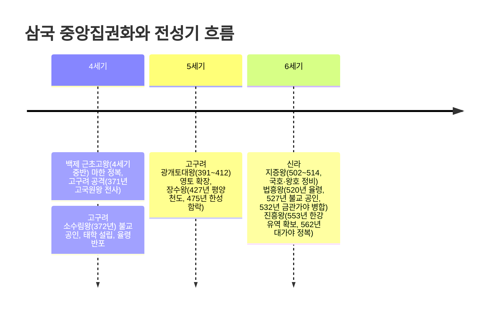
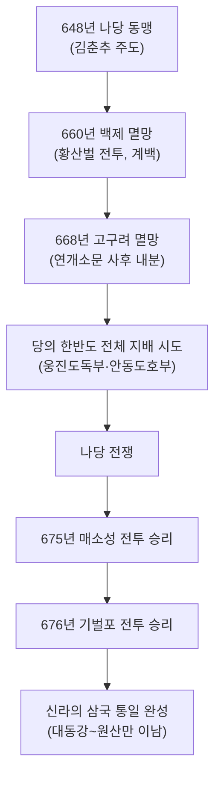

<Callout type="info">
  **이번 문서의 목표:** 이 파일을 다 읽으면 삼국과 가야가 각각 언제·어떻게 성립하고 전성기를 맞았는지 말할 수 있고, 나당 동맹부터 나당 전쟁까지 삼국 통일 과정을 순서대로 설명할 수 있으며, 통일신라의 중앙·지방 통치 체제와 발해의 성립·성격을 구분해 설명할 수 있다.
</Callout>

## 왜 삼국을 하나로 묶어서 보는가

05편에서 본 여러 소국(연맹 왕국) 가운데 고구려·백제·신라는 왕권을 강화하며 중앙집권 국가로 성장했고, 변한 지역의 소국들은 가야 연맹으로 발전했다. 이 편에서는 삼국과 가야의 성립·발전 과정을 살펴본 뒤, 신라의 삼국 통일 과정과 통일신라·발해의 통치 체제까지 이어서 다룬다. 독학사 4단계에서는 각국 왕의 업적을 단순 암기하는 데 그치지 않고, "중앙집권화의 공통 단계"(율령 반포, 불교 공인, 왕위 부자 상속 확립)를 뽑아 비교하는 문제와, 삼국 통일과 남북국 성립을 하나의 흐름으로 잇는 문제가 자주 나온다.

## 삼국과 가야의 성립

> **쉽게 말하면:** 고구려·백제·신라·가야는 모두 철기 문화를 바탕으로 한 작은 소국에서 출발해, 주변 소국을 정복하거나 통합하며 점차 큰 나라로 성장했다.

『삼국사기』등 후대에 정리된 문헌에는 삼국의 건국 연대가 다음과 같이 전해진다. 다만 이 연대는 각국의 왕실 계보를 소급해 기록한 **전승 연대**이며, 실제 국가 체제를 갖춘 시점은 이보다 후대(2~4세기경)로 보는 것이 일반적인 역사학의 해석이라는 점에 유의해야 한다.

| 국가 | 전승 건국 연대 | 건국 시조 | 건국 지역 |
|------|----------------|-----------|-----------|
| 고구려 | 기원전 37년 | 주몽 | 졸본(압록강 유역) |
| 백제 | 기원전 18년 | 온조 | 하남 위례성(한강 유역) |
| 신라 | 기원전 57년 | 박혁거세 | 사로국(경주 지역) |
| 금관가야 | 42년경 | 김수로 | 김해 지역(낙동강 하류) |

백제의 건국 세력은 고구려 계통의 유이민이 남하해 한강 유역의 토착 세력과 결합한 것으로 보는데, 이는 백제 왕족의 성씨가 부여씨였다는 점, 백제 초기 무덤 양식(계단식 돌무지무덤)이 고구려의 것과 유사하다는 점 등 여러 근거로 뒷받침된다. 가야는 낙동강 하류 변한 지역의 소국들이 연합한 **가야 연맹체**로, 하나로 통합된 중앙집권 국가로 발전하지는 못했다. 전기에는 김해의 금관가야가, 후기(5세기 이후)에는 고령의 대가야가 연맹을 주도했다. 가야는 철 생산지로서 우수한 철기 문화를 자랑했지만, 백제와 신라 사이에 끼여 있어 독자적 발전에 한계가 있었고, 금관가야는 532년, 대가야는 562년 신라에 병합되며 역사에서 사라졌다.

## 삼국의 중앙집권화: 같은 패턴, 다른 시기

> **쉽게 말하면:** 삼국은 모두 "왕위 부자 상속 확립 → 율령 반포 → 불교 공인"이라는 비슷한 순서를 밟으며 왕권을 강화했지만, 그 시기는 고구려·백제·신라 순으로 차이가 난다.

삼국이 강력한 중앙집권 국가로 성장하는 데는 공통된 단계가 있다. 첫째, 왕위를 특정 가문이 부자 상속으로 이어받아 왕권의 안정성을 높인다. 둘째, 나라 전체에 적용되는 통일된 법률인 **율령**을 반포해 지배 체제를 정비한다. 셋째, 각 지역의 부족 신앙 대신 왕을 중심으로 한 통일된 사상을 제공할 수 있는 **불교**를 공인해 왕권 강화의 사상적 기반으로 삼는다. 이 세 가지가 갖춰진 순서는 고구려가 가장 빠르고, 백제, 신라 순으로 늦다.

### 고구려의 중앙집권화와 전성기

고구려는 4세기 후반 **소수림왕**(재위 371~384) 때 372년 중국 전진으로부터 불교를 받아들여 공인하고, 국립 교육기관인 **태학**을 세웠으며, 통치 체제를 정비하는 **율령**을 반포했다. 이 시기의 정비를 바탕으로 5세기에 고구려는 최전성기를 맞는다. **광개토대왕**(재위 391~412)은 만주와 한반도 북부로 영토를 크게 넓혔고, 신라에 침입한 왜를 격퇴해 신라에 대한 영향력을 강화했다. 그 아들 **장수왕**(재위 412~491)은 427년 수도를 국내성에서 평양으로 옮기며 **남진 정책**을 본격화했고, 475년에는 백제의 수도 한성을 함락하고 백제 개로왕을 전사시켜 한강 유역 전체를 차지했다. 이로써 고구려는 5세기에 만주와 한반도 중북부를 아우르는 최대 영역을 확보한다.

### 백제의 중앙집권화와 전성기

백제는 삼국 중 가장 먼저 전성기를 맞았다. **근초고왕**(재위 346~375) 때인 4세기 중반, 백제는 남쪽으로 마한의 남은 세력을 정복해 한반도 서남부를 완전히 장악했고, 북쪽으로는 고구려를 공격해 371년 평양성 전투에서 고구려 고국원왕을 전사시켰다. 또한 이 시기 왕위 부자 상속이 확립되어 왕권이 안정되었고, 중국 동진·왜와 활발히 교류하며 국제적 위상을 높였다(왜에 칠지도를 전한 것으로 알려진 것도 이 무렵의 교류를 보여주는 자료로 다뤄진다). 다만 5세기 후반 장수왕의 남진으로 한성을 빼앗기며 큰 위기를 맞았고, 이후 도읍을 웅진(공주)으로, 다시 사비(부여)로 옮기며 국력 회복을 꾀했다.

### 신라의 중앙집권화와 전성기

신라는 삼국 중 중앙집권화가 가장 늦었지만, 6세기에 접어들며 빠르게 체제를 정비했다. **지증왕**(재위 500~514)은 나라 이름을 '신라'로, 임금의 칭호를 '왕'으로 정했고, 이사부를 보내 우산국(울릉도 일대)을 복속시켰다. 뒤이은 **법흥왕**(재위 514~540)은 520년 율령을 반포하고 관리의 등급(관등)과 공복(관리 복색)을 정비했으며, 527년에는 이차돈의 순교를 계기로 불교를 공인했고, 532년에는 금관가야를 병합했다. 이러한 정비를 바탕으로 **진흥왕**(재위 540~576)은 화랑도를 국가적인 조직으로 정비해 인재를 길렀고, 553년에는 백제와 연합해 차지했던 한강 유역을 백제로부터 빼앗아 독차지했으며, 562년에는 대가야를 정복해 가야 연맹을 완전히 흡수했다. 진흥왕은 새로 넓힌 영토 곳곳(단양·북한산·창녕·황초령·마운령 등)에 자신의 업적을 새긴 순수비를 세워, 확장된 영토를 과시했다.

아래 표로 삼국 중앙집권화의 핵심 지표를 비교한다.

| 국가 | 불교 공인 | 율령 반포 | 최대 전성기 | 전성기 군주 |
|------|-----------|-----------|-------------|-------------|
| 고구려 | 372년(소수림왕) | 소수림왕 대 | 5세기 | 광개토대왕·장수왕 |
| 백제 | 384년(침류왕, 동진에서 전래) | 3세기 후반 고이왕 대로 보는 견해가 일반적 | 4세기 중반 | 근초고왕 |
| 신라 | 527년(법흥왕, 이차돈 순교) | 520년(법흥왕) | 6세기 | 진흥왕 |

## 삼국 통일 과정: 나당 동맹에서 나당 전쟁까지

> **쉽게 말하면:** 신라는 위기 속에서 당과 손잡고 백제와 고구려를 차례로 무너뜨린 뒤, 이번에는 당을 한반도에서 몰아내는 전쟁을 벌여 마침내 통일을 완성했다.

6세기 후반 이후 고구려·백제·신라는 서로 경쟁하며 국제전으로 얽혀 들어갔다. 신라는 한강 유역을 독차지한 이후 백제·고구려 양쪽으로부터 압박을 받았고, 이를 타개하기 위해 **김춘추**(훗날 태종무열왕)가 당과의 동맹을 추진했다. 648년 신라와 당은 백제와 고구려를 함께 멸망시키기로 하는 **나당 동맹**을 맺었다.

660년, 신라와 당의 연합군은 백제를 공격했다. 백제의 계백이 이끄는 결사대가 황산벌에서 김유신의 신라군에 맞서 싸웠으나 패배했고, 결국 백제는 수도 사비성이 함락되며 멸망했다. 이어 668년에는 고구려가 멸망했다. 고구려는 연개소문이 살아있는 동안에는 강력한 지도력으로 나당 연합군의 침공을 막아냈지만, 연개소문 사후 그 아들들 사이에 권력 다툼이 벌어지며 내부 분열이 심해졌고, 이 틈을 타 나당 연합군이 평양성을 함락시켰다.

백제와 고구려가 차례로 무너진 뒤, 당은 애초 약속과 달리 옛 백제·고구려 땅은 물론 신라 지역까지 지배하려는 의도를 드러냈다(웅진도독부·안동도호부 등의 설치). 이에 신라는 당과의 전면전인 **나당 전쟁**을 벌였다. 675년 매소성 전투에서 신라가 당의 대군을 격파했고, 676년에는 금강 하구의 기벌포 전투에서 당의 수군마저 물리쳤다. 이로써 신라는 당의 세력을 대동강 이북으로 몰아내고, 대동강에서 원산만에 이르는 이남 지역의 삼국 통일을 사실상 완성했다.

신라의 삼국 통일은 외세인 당의 힘을 빌렸다는 점, 그리고 대동강 이북의 옛 고구려 영토 대부분을 확보하지 못했다는 점에서 그 한계를 지적하는 견해가 있다. 반면 처음으로 한반도 중남부의 여러 나라를 하나의 정치 체제 아래 통합하고, 이후 고구려 유민이 세운 발해와 함께 이른바 **남북국**의 형세를 이루었다는 점에서 역사적 의의를 부여하기도 한다. 독학사 시험에서는 이 통일의 의의와 한계를 균형 있게 서술하는 문제, 그리고 사건의 순서(나당 동맹→백제 멸망→고구려 멸망→나당 전쟁)를 뒤섞어 제시하고 순서를 맞추게 하는 문제가 자주 나온다.

## 통일신라의 통치 체제

> **쉽게 말하면:** 통일 이후 신라 왕은 넓어진 영토와 늘어난 인구를 다스리기 위해 지방 행정 조직을 정비하고, 귀족 세력을 누르며 왕권을 강화했다.

### 중대의 왕권 강화

삼국 통일을 전후한 시기부터 혜공왕 대(8세기 후반)까지를 흔히 신라의 **중대**라 부르며, 이 시기는 무열왕 김춘추의 직계 자손이 왕위를 이었다는 특징과 함께 왕권이 진골 귀족 세력을 누르고 상대적으로 강했던 시기로 평가된다. 특히 **신문왕**(재위 681~692)은 즉위 직후 장인이던 김흠돌이 반란을 꾀하다 발각된 **김흠돌의 난**(681년)을 진압하는 과정에서 반발하는 진골 귀족 세력을 크게 숙청하고 왕권을 한층 강화했다. 신문왕은 유교 이념에 따른 인재 양성을 위해 국립 교육기관인 **국학**을 설립했고, 지방 행정 조직을 9주 5소경 체제로 정비했다.

### 중앙과 지방 통치 체제

통일신라의 중앙 정치는 왕명을 받들어 나랏일을 총괄하는 **집사부**와 그 장관인 **시중**(중시)을 중심으로 운영되었다. 이는 화백 회의를 주도하며 귀족의 이해를 대변하던 상대등의 권한이 상대적으로 약화되고, 왕의 명령을 직접 집행하는 관청의 권한이 강해졌음을 보여준다.

지방은 전국을 9개의 주로 나누고(9주), 수도 경주가 지리적으로 국토의 동남쪽에 치우쳐 있는 것을 보완하기 위해 정치·문화적 요지 다섯 곳에 **5소경**을 설치했다. 군사 조직으로는 중앙에 9서당, 지방에 10정을 두었는데, 9서당에는 신라인뿐 아니라 고구려·백제 유민과 말갈인까지 포함시켜, 통일 이후 다양한 출신의 주민을 하나의 국가 체제로 포섭하려 한 의도를 엿볼 수 있다.

### 하대의 혼란

혜공왕 이후를 **하대**라 부르는데, 이 시기에는 무열왕계가 아닌 여러 진골 귀족 가문이 서로 왕위를 다투면서 정치적 혼란이 심해졌다. 822년에는 웅천주(지금의 공주 일대) 도독이던 **김헌창**이 반란을 일으켰고, 9세기 말에는 지방에서 가혹한 세금 수취에 반발한 농민 봉기(대표적으로 889년 **원종·애노의 난**)가 잇따랐다. 이러한 중앙 정치의 혼란과 지방 세력(호족)의 성장은 신라 하대 사회 동요의 핵심 배경으로, 이후 후삼국 시대로 이어지는 흐름의 출발점이 된다(이 흐름은 뒤의 고려 관련 편에서 다시 다룬다).

## 발해의 성립과 성격, 대외관계

> **쉽게 말하면:** 발해는 옛 고구려 유민과 말갈족이 힘을 합쳐 세운 나라로, 스스로 고구려를 계승했다는 의식을 뚜렷이 드러냈고, 통일신라와 함께 한반도와 만주에 걸친 남북국의 형세를 이루었다.

고구려가 멸망한 뒤 그 유민 중 일부는 당에 의해 강제로 이주당했다. 이 가운데 고구려 장수 출신으로 알려진 **대조영**이 고구려 유민과 말갈족 세력을 이끌고 당의 통제를 벗어나, 698년 만주 동모산 부근에서 나라를 세웠다. 처음 국호는 '진(震)'이었으나 이후 '발해'로 바뀌었다.

발해는 스스로 **고구려를 계승한 나라**라는 의식을 뚜렷이 가지고 있었다. 일본에 보낸 국서에서 발해의 왕이 자신을 '고려 국왕'으로 칭한 사례가 전해지는 것이 대표적인 근거로 제시된다. 발해는 이후 영토를 크게 넓혀, 9세기 초 **선왕** 대에는 만주 대부분과 연해주 일대, 한반도 북부에 이르는 최대 영역을 확보했고, 이 시기 발해는 중국으로부터 '바다 동쪽의 융성한 나라'라는 뜻의 **해동성국**이라 불릴 만큼 번영했다.

발해의 통치 체제는 당의 3성 6부제를 본떴지만, 그 운영 방식은 발해 독자적이었다. 3성 가운데 정당성이 나머지 두 성(선조성·중대성)보다 우위에 서서 국정을 총괄했고, 정당성 아래 6부의 명칭도 유교 덕목(충·인·의·지·예·신)을 딴 독자적인 이름을 사용했다. 교육 기관으로는 신라의 국학에 해당하는 **주자감**을 두었다.

발해는 신라와는 대체로 견제하는 관계였지만 사신이 오가는 교통로(신라도)가 있었고, 당과는 초기 대립하다가 점차 사신을 교류하며 문물을 받아들이는 관계로 바뀌었으며, 일본과도 활발히 교류했다. 발해는 926년 거란(요)의 침입을 받아 멸망했다.

아래 표로 통일신라와 발해를 비교한다.

| 구분 | 통일신라 | 발해 |
|------|----------|------|
| 건국(성립) | 676년 삼국 통일 완성 | 698년 대조영 건국 |
| 중앙 정치 | 집사부(시중) 중심 | 3성 6부(정당성 중심) |
| 지방 행정 | 9주 5소경 | 5경 15부 62주(체제 정비, 지방 편) |
| 교육 기관 | 국학 | 주자감 |
| 대외 성격 | 당 문물 수용, 일본과 교류 | 고구려 계승 의식, 해동성국(선왕 대) |

## 핵심 정리

- 삼국은 왕위 부자 상속 확립 → 율령 반포 → 불교 공인 순서로 중앙집권화를 이루었으며, 고구려(4세기 소수림왕)가 가장 빠르고 신라(6세기 법흥왕)가 가장 늦었다.
- 전성기는 백제(4세기 근초고왕) → 고구려(5세기 광개토대왕·장수왕) → 신라(6세기 진흥왕) 순으로 이어졌다.
- 신라는 648년 나당 동맹, 660년 백제 멸망, 668년 고구려 멸망을 거쳐 675년 매소성·676년 기벌포 전투에서 당을 물리치고 676년 삼국 통일을 완성했다.
- 통일신라는 9주 5소경·9서당 10정 체제를 갖췄고, 신문왕 대(681~692) 김흠돌의 난 진압을 계기로 왕권을 강화했으나, 하대에는 왕위 다툼과 농민 봉기로 혼란해졌다.
- 발해는 698년 고구려 유민과 말갈족이 세운 나라로, 고구려 계승 의식을 가지고 있었으며 선왕 대에 해동성국이라 불렸으나 926년 거란에 멸망했다.

## 마무리 복습

<Quiz
  questionNumber={1}
  question="다음 중 삼국의 중앙집권화 과정에서 가장 먼저 불교를 공인하고 율령을 반포한 나라는?"
  options={['백제', '신라', '고구려', '가야']}
  correctAnswer={3}
  explanation="고구려는 4세기 후반 소수림왕 때인 372년 불교를 공인하고 율령을 반포해, 삼국 중 가장 먼저 중앙집권 체제를 정비했다."
  optionExplanations={['백제의 불교 공인은 4세기 후반(침류왕 대)으로 고구려보다 늦다', '신라의 불교 공인은 6세기(법흥왕 527년)로 가장 늦다', '고구려 소수림왕 대(372년)가 가장 이르므로 정답이다', '가야는 중앙집권 국가로 완전히 성장하지 못한 연맹체였다']}
/>

<Quiz
  questionNumber={2}
  question="475년 백제의 수도 한성을 함락시키고 한강 유역 전체를 차지한 고구려의 왕은?"
  options={['광개토대왕', '장수왕', '소수림왕', '고국원왕']}
  correctAnswer={2}
  explanation="장수왕은 427년 평양 천도 이후 남진 정책을 펼쳐, 475년 백제 한성을 함락하고 개로왕을 전사시켜 한강 유역을 차지했다."
  optionExplanations={['광개토대왕은 만주와 한반도 북부로 영토를 넓힌 왕으로, 한성 함락은 그 아들 대의 일이다', '장수왕이 한성을 함락시켰으므로 정답이다', '소수림왕은 4세기 후반 불교 공인·율령 반포로 체제를 정비한 왕이다', '고국원왕은 371년 백제 근초고왕의 공격으로 전사한 고구려 왕이다']}
/>

<Quiz
  questionNumber={3}
  question="신라의 삼국 통일 과정을 순서대로 바르게 나열한 것은?"
  options={['백제 멸망 – 나당 동맹 – 고구려 멸망 – 기벌포 전투', '나당 동맹 – 백제 멸망 – 고구려 멸망 – 기벌포 전투', '고구려 멸망 – 백제 멸망 – 나당 동맹 – 매소성 전투', '나당 동맹 – 고구려 멸망 – 백제 멸망 – 매소성 전투']}
  correctAnswer={2}
  explanation="648년 나당 동맹 체결 이후 660년 백제가 멸망했고, 668년 고구려가 멸망했으며, 이후 나당 전쟁에서 675년 매소성, 676년 기벌포 전투를 거쳐 통일이 완성되었다."
  optionExplanations={['나당 동맹이 백제 멸망보다 먼저 이루어져야 하므로 순서가 틀렸다', '나당 동맹 이후 백제, 고구려 순으로 멸망했으므로 정답이다', '고구려는 백제보다 나중인 668년에 멸망했으므로 순서가 틀렸다', '고구려 멸망(668년)이 백제 멸망(660년)보다 먼저 나열되어 순서가 틀렸다']}
/>

<Quiz
  questionNumber={4}
  question="681년 김흠돌의 난을 진압하고 진골 귀족 세력을 숙청하며 왕권을 강화한 통일신라의 왕은?"
  options={['무열왕', '문무왕', '신문왕', '경덕왕']}
  correctAnswer={3}
  explanation="신문왕은 즉위 직후인 681년 장인 김흠돌의 반란을 진압하며 왕권을 강화했고, 이후 9주 5소경 체제 정비와 국학 설립을 추진했다."
  optionExplanations={['무열왕(김춘추)은 나당 동맹을 주도한 왕이다', '문무왕은 삼국 통일을 완성한 왕(재위 중 676년 통일 완성)이다', '신문왕이 김흠돌의 난을 진압했으므로 정답이다', '경덕왕은 8세기 중반 녹읍을 부활시킨 왕이다']}
/>

<Quiz
  questionNumber={5}
  question="발해에 대한 설명으로 옳지 않은 것은?"
  options={['대조영이 고구려 유민과 말갈족을 이끌고 698년에 건국했다', '일본에 보낸 국서에서 스스로 고려 국왕이라 칭한 사례가 전해진다', '통치 체제로 당의 3성 6부제를 그대로 수용해 독자성이 없었다', '9세기 선왕 대에 해동성국이라 불릴 정도로 번영했다']}
  correctAnswer={3}
  explanation="발해는 3성 6부라는 명칭과 큰 틀은 당의 제도를 본떴지만, 정당성이 국정을 총괄하는 독자적 운영 방식과 유교 덕목을 딴 6부 명칭 등 독자성을 뚜렷이 유지했다."
  optionExplanations={['대조영의 698년 건국은 옳은 설명이다', '고려 국왕 칭호 사용은 고구려 계승 의식을 보여주는 옳은 설명이다', '당 제도를 본뜨되 독자적으로 운영했으므로 이 서술은 옳지 않으며 정답이다', '선왕 대 해동성국이라 불린 것은 옳은 설명이다']}
/>

<Quiz
  questionNumber={6}
  question="통일신라 하대의 정치적 혼란을 보여주는 사건으로 옳은 것은?"
  options={['이차돈의 순교', '김흠돌의 난', '822년 김헌창의 난', '나당 전쟁']}
  correctAnswer={3}
  explanation="822년 웅천주 도독 김헌창이 일으킨 반란은 신라 하대에 진골 귀족 간 왕위 다툼과 지방 세력 동요가 심해졌음을 보여주는 대표 사건이다."
  optionExplanations={['이차돈의 순교(527년)는 법흥왕 대 불교 공인과 관련된 사건이다', '김흠돌의 난(681년)은 중대 신문왕 대의 사건이다', '822년 김헌창의 난이 하대의 혼란을 보여주므로 정답이다', '나당 전쟁(675~676년)은 삼국 통일 과정의 사건이다']}
/>

<Quiz
  questionNumber={7}
  question="가야 연맹에 대한 설명으로 옳은 것은?"
  options={['금관가야는 신라보다 늦게 멸망했다', '전기에는 김해의 금관가야가, 후기에는 고령의 대가야가 연맹을 주도했다', '삼국과 같은 수준의 중앙집권 국가로 완전히 성장했다', '철 생산과 무관한 농업 중심 국가였다']}
  correctAnswer={2}
  explanation="가야 연맹은 전기 금관가야 중심에서 후기(5세기 이후) 대가야 중심으로 주도권이 옮겨갔으며, 끝내 하나의 중앙집권 국가로 통합되지 못했다."
  optionExplanations={['금관가야는 532년, 대가야는 562년 각각 신라에 병합되어 멸망했으므로 신라보다 늦게 멸망했다는 서술은 틀렸다', '전기 금관가야, 후기 대가야로 주도권이 옮겨갔다는 서술이 옳으므로 정답이다', '가야는 백제·신라 사이에서 독자적 중앙집권 국가로 완전히 성장하지 못했다', '가야는 우수한 철 생산지로 유명했으므로 이 서술은 틀렸다']}
/>

## 참고 자료

- [국사편찬위원회 한국사데이터베이스](https://db.history.go.kr) — 삼국시대·남북국시대 연표 및 『삼국사기』·『삼국유사』 원문 확인
- [우리역사넷](https://contents.history.go.kr) — 삼국의 중앙집권화 과정과 통일신라·발해 통치 체제 개관
- [국가유산청](https://www.khs.go.kr) — 광개토대왕릉비, 진흥왕 순수비 등 관련 문화유산 정보
