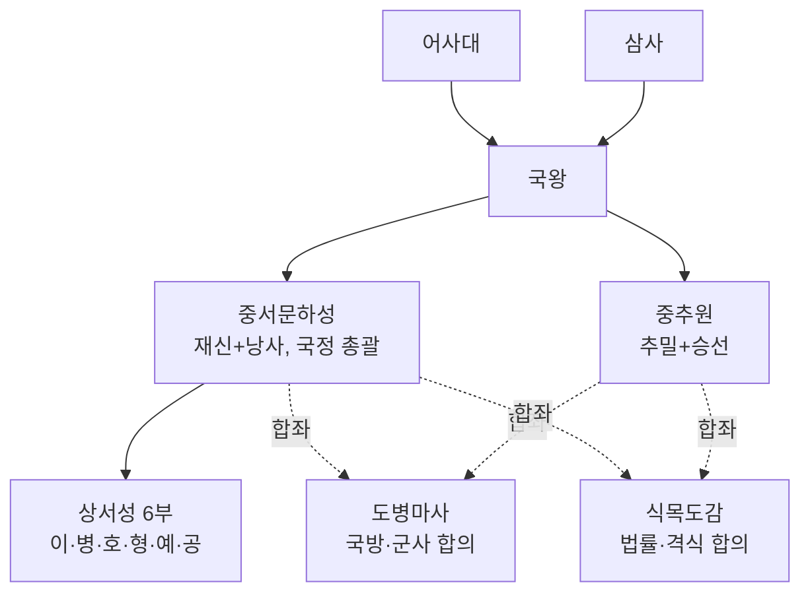
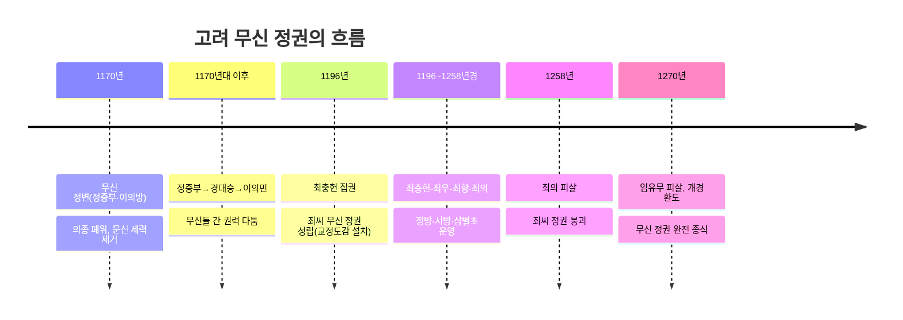

<Callout type="info">
  **이번 문서의 목표:** 이 파일을 다 읽으면 고려의 2성 6부·중추원·도병마사 등 중앙 관제와 5도 양계 지방 제도를 설명할 수 있고, 문벌귀족→무신 정권→권문세족으로 이어지는 지배층 교체 과정을 연도와 함께 말할 수 있으며, 향·소·부곡과 양천제로 대표되는 고려 사회 구조를 이해할 수 있다.
</Callout>

## 왜 고려의 정치·사회 구조를 별도로 보는가

06편에서 다룬 신라 하대의 혼란은 지방 호족 세력의 성장으로 이어졌고, 이 호족들 사이의 경쟁 속에서 후삼국이 성립했다가 결국 왕건이 세운 고려로 통합되었다. 918년 왕건이 고려를 건국했고, 935년 신라 경순왕이 스스로 항복했으며, 936년 후백제를 무너뜨리면서 고려는 후삼국을 통일했다. 이 편에서는 이렇게 성립한 고려가 어떤 중앙·지방 통치 체제를 갖추었는지, 그리고 건국 초기의 문벌귀족부터 무신 정권, 원 간섭기의 권문세족까지 지배층이 어떻게 교체되어 갔는지, 마지막으로 향·소·부곡 같은 특수 지역과 신분 구조를 정리한다.

## 고려의 중앙 통치 체제

> **쉽게 말하면:** 고려는 당·송의 제도를 받아들이면서도, 국가 중대사를 고위 관료들이 합의로 결정하는 독자적인 회의 기구(도병마사·식목도감)를 따로 두었다.

고려의 중앙 관제는 당의 3성 6부제와 송의 중추원·삼사 제도를 받아들이되, 고려 실정에 맞게 재구성한 것이 특징이다. 당의 3성(중서성·문하성·상서성) 가운데 중서성과 문하성을 하나로 합쳐 **중서문하성**을 만든 것이 대표적인 예다. 중서문하성은 국정을 총괄하는 최고 관서로, 재상급 고위 관료인 **재신**과 정책을 심의하고 잘못을 간언하는 **낭사**로 구성되었다. 실무 집행은 **상서성**이 맡았고, 그 아래 이부·병부·호부·형부·예부·공부의 **6부**가 실제 행정 업무를 나누어 처리했다.

송의 제도를 받아들여 만든 **중추원**은 군사 기밀을 다루는 **추밀**과 왕명 출납을 담당하는 **승선**으로 구성되었다. 관리의 비리를 감찰하는 **어사대**, 화폐와 곡식의 출납 회계를 담당하는 **삼사**도 함께 설치되었다.

고려 관제에서 가장 독자적인 특징은 **도병마사**와 **식목도감**이다. 두 기구 모두 중서문하성의 재신과 중추원의 추밀이 함께 모여 국가 중대사를 합의로 결정하는 **회의 기구**였다. 도병마사는 국방과 군사 문제를, 식목도감은 법률과 각종 제도·격식을 결정했다. 이렇게 고위 관료들이 합좌해 국정을 논의하는 방식은 신라의 화백 회의와도 통하는 귀족 연합적 성격을 보여주며, 이 때문에 고려의 정치를 흔히 **귀족 정치**라 부른다. 특히 도병마사는 고려 후기(원 간섭기 이후)에 이르러 **도평의사사**로 개편되면서 국정 전반을 관장하는 최고 정무 기구로 그 권한이 크게 확대되는데, 이는 뒤에서 다룰 권문세족의 권력 기반과도 직결된다.

## 고려의 지방 행정 제도

> **쉽게 말하면:** 일반 행정 지역인 5도와 국경 방어를 위한 군사 지역인 양계로 나누었고, 지방관이 파견된 고을보다 파견되지 않은 고을이 더 많아 향리의 역할이 컸다.

고려의 지방 제도는 크게 일반 행정 구역인 **5도**와 국경 지대의 군사 행정 구역인 **양계**(북계·동계)로 나뉘었다. 5도에는 안찰사가 파견되어 지역을 순찰하며 지방을 감독했고, 양계에는 병마사가 파견되어 국방을 총괄했다. 이 밖에 수도 개경, 옛 고구려 수도였던 서경(평양), 옛 신라 수도였던 동경(경주) 등을 중심으로 한 **3경**, 그리고 군사·행정의 요지에 설치한 4도호부와 8목이 있었다.

고려 지방 제도에서 독학사 시험이 특히 주목하는 특징은, 지방관이 실제로 파견된 **주현**보다 지방관이 파견되지 않은 **속현**의 수가 더 많았다는 점이다. 속현에서는 중앙에서 내려온 지방관이 없었기 때문에, 그 지역 토착 세력인 **향리**가 실질적인 행정 업무를 담당했다. 향리는 고려 초 지방 호족의 후예인 경우가 많았고, 조세 징수와 노동력 동원 등 지방 행정의 실무를 도맡았다는 점에서 고려 사회에서 무시할 수 없는 영향력을 지닌 계층이었다.

## 향·소·부곡: 차별받는 특수 행정 구역

> **쉽게 말하면:** 같은 고려 백성이라도 향·소·부곡이라는 특정 지역에 사는 사람은 일반 군현민보다 여러 면에서 차별을 받았다.

고려에는 일반 군현과 별도로 **향**·**소**·**부곡**이라는 특수 행정 구역이 있었다. 향과 부곡은 주로 국가 소유의 토지를 경작하는 농업 중심 지역이었고, **소**는 자기(도자기)·종이·먹·금·은 같은 특정 수공업품이나 광산물을 생산해 국가에 공급하는 지역이었다. 이 지역의 주민은 법적으로는 양인 신분이었지만, 일반 군현민과 비교해 여러 불이익을 받았다. 대표적으로 과거 응시가 제한되었고, 거주 이전의 자유가 없었으며, 일반 군현보다 무거운 세금과 역을 부담하는 경우가 많았다. 이 때문에 향·소·부곡민은 흔히 신분상으로는 양인이지만 실질적으로는 양인과 천민 사이의 차별적인 위치에 있었던 계층으로 설명된다.

| 구역 | 주요 산업 | 처지 |
|------|-----------|------|
| 향 | 농업(국가 소유 토지 경작) | 일반 군현민보다 차별(과거 제한 등) |
| 부곡 | 농업(국가 소유 토지 경작) | 향과 유사한 차별 대우 |
| 소 | 수공업품·광산물 생산(자기·종이·먹 등) | 생산물 공납 부담이 무거움 |

## 지배층의 교체: 문벌귀족 → 무신 정권 → 권문세족

> **쉽게 말하면:** 고려 전기에는 과거와 음서로 관직을 독점한 문벌귀족이, 12세기 후반부터는 무력으로 권력을 잡은 무신들이, 원 간섭기에는 원과 가까운 권문세족이 차례로 지배층의 중심에 섰다.

### 문벌귀족과 그 동요

고려 전기(대체로 11~12세기 초)의 지배층은 **문벌귀족**이라 불린다. 이들은 **과거**를 통해 관직에 진출하는 것은 물론, 조상의 공로로 후손이 시험 없이 관직에 등용되는 **음서** 제도를 적극 활용해 관직을 대물림했다. 또한 공을 세운 대가로 세습이 가능한 토지인 **공음전**을 지급받아 경제적 기반도 대를 이어 유지했다. 문벌귀족들은 왕실이나 유력 가문끼리 폐쇄적으로 혼인 관계를 맺으며 권력을 공고히 했는데, 대표적인 가문이 여러 대에 걸쳐 왕실과 혼인 관계를 맺은 경원(인주) 이씨 가문이다.

이 경원 이씨 가문 출신의 **이자겸**은 왕실 외척으로서 막강한 권력을 휘두르다가 1126년 반란(이자겸의 난)을 일으켰으나 실패했다. 이 사건으로 문벌귀족 사회의 모순이 드러난 데 이어, 1135년에는 승려 묘청을 중심으로 한 서경 세력이 수도를 서경(평양)으로 옮기고 자주적인 태도를 강화하자고 주장하며 **묘청의 서경 천도 운동**을 일으켰다. 이 운동은 개경의 문벌귀족 세력(대표적으로 김부식)에 의해 진압되었다. 이 두 사건은 고려 전기 문벌귀족 사회의 내부 갈등이 극에 달했음을 보여주는 사건으로, 이후 무신 정변으로 이어지는 배경 중 하나로 다뤄진다.

### 무신 정변과 무신 정권

문신 위주의 정치 운영과 무신에 대한 차별 대우에 대한 불만이 쌓인 끝에, 1170년 **정중부**·이의방 등 무신들이 정변을 일으켜 문신들을 대거 제거하고 의종을 폐위시켰다. 이를 **무신 정변**이라 하며, 이후 약 100년간 무신들이 실권을 장악하는 **무신 정권** 시기가 이어진다.

무신 정권 초기에는 정중부, 경대승, 이의민 등이 잇달아 최고 권력을 차지하며 서로 경쟁했다. 1196년 **최충헌**이 정권을 잡으면서 이후 최씨 무신 정권이 최우-최항-최의로 4대에 걸쳐 이어지며 비교적 안정적으로 권력을 유지했다(1196~1258년경). 최씨 정권은 자체적인 권력 기구를 새로 만들었는데, 최고 권력 기구인 **교정도감**(국정 전반을 감독·집행), 인사 행정을 담당한 **정방**, 문신들의 자문을 받기 위한 **서방**, 그리고 사병이자 정권의 군사적 기반이 된 **삼별초**(좌별초·우별초·신의군)가 대표적이다.

1258년 최씨 정권 마지막 집권자인 최의가 제거되면서 최씨 정권은 무너졌지만, 이후에도 무신 세력이 완전히 물러나지는 않았고 몽골(원)과의 강화 및 개경 환도를 둘러싼 갈등 속에서 무신 정권의 잔여 세력이 이어지다, 1270년 임유무가 제거되면서 무신 정권은 완전히 종식되고 고려 왕실은 개경으로 환도했다.

### 원 간섭기의 권문세족

13세기 후반 고려가 원(몽골)의 간섭을 받게 된 이후, 원과의 관계를 배경으로 새롭게 성장한 지배층이 **권문세족**이다. 이들은 원의 세력을 등에 업고 성장한 부원 세력을 포함하며, 앞서 다룬 **도평의사사**(도병마사가 확대·개편된 기구)를 장악해 국정을 좌우했다. 권문세족은 넓은 농장과 많은 노비를 소유하며 경제적으로도 막대한 부를 축적했는데, 이 과정에서 힘없는 백성의 토지를 불법으로 빼앗는 경우가 많아 고려 후기 사회 모순의 핵심 원인으로 지목된다. 이러한 권문세족의 폐단은 이후 신진 사대부 세력의 성장과 고려 말 개혁·조선 건국으로 이어지는 흐름과 연결되는데, 이 내용은 뒤의 10편(조선 전기의 건국과 통치 체제)에서 이어서 다룬다.

아래 표로 세 지배층을 비교한다.

| 구분 | 문벌귀족 | 무신 정권 | 권문세족 |
|------|----------|-----------|----------|
| 시기 | 고려 전기(11–12세기 초) | 1170–1270년 | 13세기 후반–14세기(원 간섭기) |
| 권력 기반 | 과거·음서, 공음전, 폐쇄적 혼인 | 무력(삼별초 등 사병), 교정도감·정방 | 원과의 관계, 도평의사사 장악 |
| 대표 사건·인물 | 이자겸의 난(1126), 묘청의 서경 천도 운동(1135) | 무신 정변(1170), 최씨 정권(1196–1258) | 부원 세력, 대농장 소유 |
| 쇠퇴 계기 | 무신 정변으로 몰락 | 몽골과의 강화, 개경 환도(1270) | 신진 사대부 성장, 고려 말 개혁 |

## 고려의 신분 구조: 양천제와 그 실제

> **쉽게 말하면:** 법적으로는 양인과 천인 두 가지로만 나뉘지만, 실제 사회에서는 양인 안에서도 귀족부터 일반 농민까지 여러 층으로 다시 나뉘어 있었다.

고려의 신분 제도는 법제상 **양천제**, 즉 자유민인 **양인**과 그렇지 못한 **천인**으로 크게 구분되었다. 그러나 실제 사회에서는 양인 내부에서도 뚜렷한 계층 분화가 있었다. 최상층에는 왕족과 앞서 다룬 문벌귀족·권문세족 같은 귀족층이 있었다. 그 아래에는 **중류층**이라 불리는 실무 담당 계층이 있었는데, 지방 행정 실무를 담당한 **향리**, 중앙 관청의 말단 실무를 맡은 **서리**, 궁궐에서 왕을 가까이서 보좌한 **남반**, 군인 신분을 세습한 **군반**, 하급 기술관인 **잡류** 등이 여기에 해당한다. 그 아래 다수를 차지한 것이 농업에 종사하는 일반 양민(백정)이었고, 앞서 살펴본 향·소·부곡민도 신분상으로는 양인에 속하지만 실질적으로는 차별받는 위치에 있었다.

천인은 대부분 **노비**로 구성되었다. 노비는 관청에 속한 **공노비**와 개인(귀족·사원 등)이 소유한 **사노비**로 나뉘었으며, 재산으로 취급되어 매매·상속·증여의 대상이 되었다는 점이 고려 신분제의 가장 낮은 위치를 상징적으로 보여준다.

## 핵심 정리

- 고려 중앙 관제는 중서문하성(재신·낭사)과 상서성 6부를 중심으로 하며, 도병마사·식목도감처럼 재신과 추밀이 합의로 국정을 결정하는 독자적 회의 기구를 두어 귀족 정치의 성격을 보였다.
- 지방은 5도(안찰사)와 양계(병마사)로 나뉘었고, 지방관이 파견되지 않은 속현이 더 많아 향리가 실질적인 지방 행정을 담당했다.
- 향·소·부곡민은 법적으로 양인이었지만 과거 응시 제한 등 일반 군현민과 다른 차별 대우를 받았다.
- 지배층은 고려 전기 문벌귀족(과거·음서·공음전) → 1170년 무신 정변 이후 무신 정권(1196~1258년경 최씨 정권) → 원 간섭기 권문세족(도평의사사 장악) 순으로 교체되었다.
- 고려의 신분 제도는 법제상 양천제였지만, 실제로는 귀족-중류층(향리·서리·남반 등)-양민-천민(공노비·사노비)으로 세분화되어 있었다.

## 마무리 복습

<Quiz
  questionNumber={1}
  question="고려 중앙 관제 중 재신과 추밀이 함께 모여 국방·군사 문제를 논의한 회의 기구는?"
  options={['중서문하성', '중추원', '도병마사', '어사대']}
  correctAnswer={3}
  explanation="도병마사는 중서문하성의 재신과 중추원의 추밀이 합좌해 국방·군사 문제를 논의한 고려의 독자적인 회의 기구다."
  optionExplanations={['중서문하성은 국정을 총괄하는 최고 관서 자체를 가리킨다', '중추원은 추밀과 승선으로 구성된 관서 자체를 가리킨다', '도병마사가 정답이다', '어사대는 관리의 비리를 감찰하는 기구다']}
/>

<Quiz
  questionNumber={2}
  question="고려의 지방 제도에 대한 설명으로 옳지 않은 것은?"
  options={['5도에는 안찰사가 파견되어 지역을 순찰했다', '양계는 국경 지대에 설치된 군사 행정 구역이다', '지방관이 파견된 주현보다 파견되지 않은 속현이 더 많았다', '속현에서는 향리 없이 중앙 관리만 행정을 담당했다']}
  correctAnswer={4}
  explanation="속현은 지방관이 파견되지 않은 지역이었으므로, 실질적인 행정 업무는 토착 세력인 향리가 담당했다. 향리 없이 중앙 관리만 행정을 담당했다는 서술은 옳지 않다."
  optionExplanations={['5도에 안찰사가 파견되었다는 설명은 옳다', '양계가 군사 행정 구역이라는 설명은 옳다', '속현이 주현보다 많았다는 설명은 옳다', '속현의 실질 행정은 향리가 담당했으므로 이 서술은 옳지 않으며 정답이다']}
/>

<Quiz
  questionNumber={3}
  question="1170년 무신 정변을 일으켜 문신 세력을 제거하고 의종을 폐위시킨 주도 세력으로 옳은 것은?"
  options={['이자겸', '정중부·이의방', '최충헌', '묘청']}
  correctAnswer={2}
  explanation="1170년 정중부·이의방 등 무신들이 정변을 일으켜 문신들을 제거하고 의종을 폐위시키면서 무신 정권 시대가 시작되었다."
  optionExplanations={['이자겸은 1126년 반란을 일으킨 문벌귀족 출신 외척이다', '정중부·이의방이 무신 정변을 주도했으므로 정답이다', '최충헌은 1196년 정권을 잡아 최씨 무신 정권을 연 인물이다', '묘청은 1135년 서경 천도 운동을 주도한 승려다']}
/>

<Quiz
  questionNumber={4}
  question="1196년 정권을 잡은 뒤 교정도감을 설치하고 이후 4대에 걸쳐 이어진 무신 정권을 연 인물은?"
  options={['이의민', '경대승', '최충헌', '임유무']}
  correctAnswer={3}
  explanation="최충헌은 1196년 집권해 최고 권력 기구인 교정도감을 설치했고, 이후 최우-최항-최의로 이어지는 최씨 무신 정권의 기틀을 마련했다."
  optionExplanations={['이의민은 최충헌 이전에 권력을 잡았던 무신이다', '경대승은 도방을 운영하며 권력을 잡았던 초기 무신 정권 인물이다', '최충헌이 정답이다', '임유무는 1270년 제거되며 무신 정권을 완전히 종식시킨 인물이다']}
/>

<Quiz
  questionNumber={5}
  question="향·소·부곡에 대한 설명으로 옳은 것은?"
  options={['거주민은 법적으로 천인 신분이었다', '소 지역은 주로 자기·종이·먹 등 수공업품을 생산했다', '일반 군현민보다 오히려 세금 부담이 가벼웠다', '거주민은 자유롭게 다른 지역으로 이주할 수 있었다']}
  correctAnswer={2}
  explanation="소는 자기·종이·먹·금·은 같은 특정 수공업품이나 광산물을 생산해 국가에 공급하는 특수 행정 구역이었다."
  optionExplanations={['향·소·부곡민은 법적으로는 양인 신분이었다', '소 지역의 수공업품 생산 설명이 옳으므로 정답이다', '향·소·부곡민은 일반 군현민보다 무거운 세금과 역을 부담하는 경우가 많았다', '향·소·부곡민은 거주 이전의 자유가 없었다']}
/>

<Quiz
  questionNumber={6}
  question="원 간섭기에 성장해 도평의사사를 장악하고 대농장을 소유했던 지배층은?"
  options={['문벌귀족', '무신 정권 세력', '권문세족', '신진 사대부']}
  correctAnswer={3}
  explanation="권문세족은 원 간섭기에 원과의 관계를 배경으로 성장해 도평의사사를 장악하고 대농장과 많은 노비를 소유한 지배층이다."
  optionExplanations={['문벌귀족은 고려 전기 과거·음서·공음전을 기반으로 한 지배층이다', '무신 정권 세력은 1170~1270년 무력을 기반으로 권력을 잡았다', '권문세족이 정답이다', '신진 사대부는 권문세족 이후 성장한 세력으로 뒤의 편에서 다룬다']}
/>

<Quiz
  questionNumber={7}
  question="고려의 신분 구조에 대한 설명으로 가장 적절한 것은?"
  options={['법제상으로는 양천제였지만 실제로는 양인 내부에서도 계층이 분화되어 있었다', '향리·서리·남반은 천인 신분에 속했다', '노비는 재산으로 취급되지 않고 독립된 인격체로만 인정받았다', '귀족과 일반 양민 사이에는 어떠한 계층 구분도 없었다']}
  correctAnswer={1}
  explanation="고려는 법제상 양인과 천인으로만 구분되는 양천제였지만, 실제로는 양인 내부에 귀족-중류층(향리·서리·남반 등)-양민의 계층 분화가 뚜렷이 존재했다."
  optionExplanations={['양천제와 실제 계층 분화를 함께 설명한 이 서술이 정답이다', '향리·서리·남반은 양인 신분에 속하는 중류층이었다', '노비는 매매·상속·증여의 대상이 되는 재산으로 취급되었다', '귀족과 중류층, 일반 양민 사이에는 뚜렷한 계층 구분이 있었다']}
/>

## 참고 자료

- [국사편찬위원회 한국사데이터베이스](https://db.history.go.kr) — 고려시대 관제·지방 제도 및 무신 정권 관련 사료 확인
- [우리역사넷](https://contents.history.go.kr) — 고려의 중앙·지방 통치 체제, 향·소·부곡, 지배층 변천 개관 자료
- [국가유산청](https://www.khs.go.kr) — 고려시대 관련 문화유산 및 유적 정보
