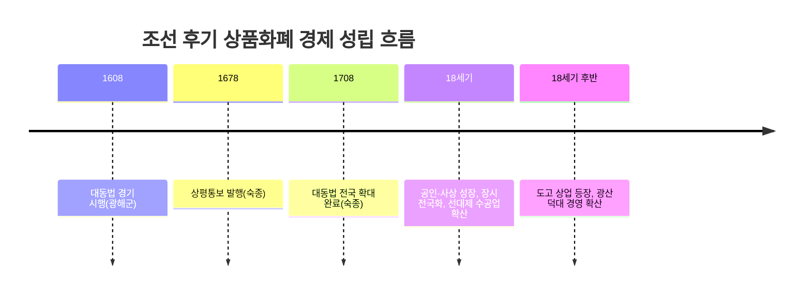

<Callout type="info">
  **이번 문서의 목표:** 이 파일을 다 읽으면 조선 후기에 농업·상업·수공업이 어떻게 바뀌었는지, 그 변화가 신분제를 어떻게 흔들었는지, 그리고 그 변화를 이론으로 뒷받침하거나 비판한 실학이 왜 중농·중상·국학 세 갈래로 나뉘었는지 서로 연결해 설명할 수 있다.
</Callout>

## 왜 "조선 후기 경제·사회"를 따로 떼어 보는가

11편에서 과전법 → 직전법 → 대동법 → 균역법으로 이어지는 토지·조세 제도의 뼈대를 이미 정리했습니다. 이번 편은 그 제도 변화, 특히 **대동법**(大同法)과 **상평통보**(常平通寶) 유통이 실제 농촌·시장·신분 구조를 어떻게 바꿔 놓았는지, 그리고 그 바뀐 현실을 보고 학자들이 어떤 처방을 내놓았는지(실학)를 하나의 이야기로 잇는 편입니다. 독학사 4단계는 "제도 하나, 사상 하나"를 따로 묻기보다 "이 경제 변화가 이 실학자의 주장과 어떻게 연결되는가"를 묻는 **비교·연결형 문항**을 좋아하므로, 흐름을 끊지 않고 통째로 읽는 것이 중요합니다.

> **쉽게 말하면:** 대동법과 상평통보가 조선의 경제를 "쌀과 옷감을 직접 주고받던 물물교환형 사회"에서 "돈과 시장을 매개로 하는 사회"로 바꿔 놓았고, 실학자들은 이 바뀐 사회를 보며 "땅을 어떻게 나눌까(중농)", "장사와 기술을 어떻게 키울까(중상)", "우리 역사·지리·언어를 어떻게 다시 볼까(국학)"라는 세 가지 답을 내놓았습니다.

## 1. 농업의 변화 — 이앙법과 광작

조선 후기 농업 변화의 출발점은 **이앙법**(모내기법, 移秧法)의 전국 확산입니다. 이앙법은 볍씨를 모판에서 미리 어느 정도 키운 뒤 논에 옮겨 심는 방식으로, 잡초를 뽑는 김매기 노동력을 크게 줄여 주고 벼와 보리를 한 해에 번갈아 지을 수 있는 **이모작**을 가능하게 했습니다. 조선 전기에는 모내기 도중 가뭄이 들면 그해 농사를 완전히 망칠 위험이 있어 정부가 확산을 꺼렸지만, 후기에 수리 시설이 점차 갖춰지면서 삼남 지방(충청·전라·경상)을 중심으로 널리 퍼졌습니다.

이앙법 덕분에 노동력이 절감되자, 한 농민 가족이 예전보다 훨씬 넓은 농지를 혼자 경작하는 **광작**(廣作, 넓게 짓는 농사)이 가능해졌습니다. 이는 두 가지 상반된 결과를 동시에 낳았습니다.

- **일부 농민의 부농화**: 넓은 땅을 광작으로 경영해 부를 쌓은 농민이 등장했고, 이들 중 일부는 그 부를 바탕으로 공명첩을 사거나 족보를 위조해 양반 신분을 얻기도 했습니다.
- **다수 농민의 몰락**: 광작이 확산되면 같은 면적의 땅을 경작하는 데 필요한 일손이 줄어들므로, 땅이 없거나 적은 소작농은 소작지를 얻기 더 어려워졌습니다. 이들은 도시나 광산으로 흘러가 품을 파는 **임노동자**가 되었습니다.

**자주 틀리는 점**: "이앙법 확산은 모든 농민에게 균등하게 이익을 주었다"는 설명은 틀렸습니다. 이앙법과 광작은 농민층을 부농과 임노동자로 **양극화**시킨 변화였다는 점이 시험에서 자주 강조됩니다.

## 2. 상품화폐 경제의 성립 — 대동법·상평통보·장시

### 대동법이 만든 새로운 상인, 공인

11편에서 다룬 대동법은 각 지역의 특산물(공납)을 현물 대신 쌀·베·동전으로 통일해 거두는 제도로, 경기도에서 먼저 시작되어 전국으로 확대되었습니다.

| 사건 | 시기 | 내용 |
|------|------|------|
| 대동법 경기 시행 | 1608년(광해군 즉위년) | 방납의 폐단을 줄이기 위해 경기도에 한해 공납을 쌀로 통일해 거둠 |
| 대동법 전국 확대 완료 | 1708년(숙종 34년) | 함경도·평안도를 제외한 전국에 대동법이 시행됨 |
| 상평통보 발행 | 1678년(숙종 4년) | 동전을 법정 화폐로 삼아 전국 유통을 시도함 |

정부는 대동법으로 거둔 쌀·베·동전을 가지고 필요한 물품을 직접 만들지 않고, **공인**(貢人)이라는 특허받은 상인에게 대금을 미리 주고 물품을 사들이게 했습니다. 공인은 대량의 물품을 안정적으로 조달해야 했으므로 수공업자에게 원료와 자금을 미리 대주고 생산을 맡기는 **선대제**(先貸制) 수공업을 발전시켰고, 이는 관청이 직접 운영하던 관영수공업이 쇠퇴하고 민간 수공업이 성장하는 계기가 되었습니다.

> **쉽게 말하면:** 조선 전기에는 나라가 필요한 물건을 지역마다 "이 고을은 인삼, 저 고을은 도자기" 식으로 직접 바치게 했습니다(공납). 대동법 이후로는 나라가 "돈은 줄 테니 알아서 사다 달라"고 방식을 바꾸었고, 그 심부름을 전담한 상인(공인)이 시장 경제의 큰손으로 성장했습니다.

### 상평통보와 장시, 그리고 사상의 성장

상평통보가 전국에 유통되면서 물건값을 동전으로 계산하는 **화폐경제**가 자리잡았습니다. 동시에 5일마다 열리는 지방 장시(場市)가 전국 곳곳에 자리잡아 농민과 상인이 정기적으로 만나 물품을 거래하는 유통망이 완성되었습니다.

이 유통망을 타고 정부의 허가 없이 자유롭게 활동하는 **사상**(私商)이 크게 성장했습니다. 대표적으로 개성의 **송상**(松商, 인삼 유통과 전국 지점망 운영으로 유명), 의주의 **만상**(灣商, 청과의 대중국 무역), 동래의 **내상**(萊商, 일본과의 대외 무역), 한강을 낀 **경강상인**(선박을 이용한 세곡·물품 운송과 상업)이 있습니다. 이들 중 일부는 특정 물품을 대량으로 사들여 두었다가 값이 오르면 되파는 방식으로 시장을 독점하는 **도고**(都賈) 상업으로까지 성장해, 물가를 조작한다는 사회적 비판을 받기도 했습니다.

광업에서도 비슷한 흐름이 나타났습니다. 정부가 광산 개발을 직접 통제하는 대신 세금을 받고 민간의 채굴을 허용하는 **설점수세제**가 시행되면서, 광산 경영을 전문으로 하는 경영인인 **덕대**가 등장해 노동자를 고용해 광산을 운영했습니다.

**자주 틀리는 점**: "대동법은 공납을 완전히 없앤 제도다"라는 설명은 과장입니다. 대동법은 공납을 **현물 대신 쌀·베·동전으로 통일해 징수**한 제도이지, 공물 자체를 폐지한 것이 아닙니다. 또한 왕실에 바로 진상하는 별공·진상 등 일부 현물 공납은 대동법 이후에도 남아 있었습니다.

## 3. 신분제의 동요

경제 변화는 신분제에도 균열을 냈습니다. 정부는 재정을 보충하기 위해 곡식이나 돈을 바친 사람에게 신분 상승이나 관직을 주는 **납속책**(納粟策)과, 이름을 비워 둔 관직 임명장을 팔아 명목상 관직·양반 신분을 주는 **공명첩**(空名帖)을 활용했습니다. 부를 축적한 농민이나 상인은 이를 이용해 양반 신분을 사들이거나 족보를 위조해 양반 행세를 하는 경우가 늘었습니다.

신분 상승은 아래에서도 일어났습니다. 양반 아버지와 첩(양인 또는 노비) 사이에서 태어난 **서얼**(庶孼)은 문과 응시가 제한되어 있었으나, 여러 차례의 서얼 허통(許通) 조치로 점차 관직 진출 제한이 완화되었습니다. 노비 신분에서도 **노비종모법**(奴婢從母法, 1731년 영조 7년)이 시행되어 노비와 양인 사이에서 태어난 자녀의 신분을 어머니 신분에 따르도록 하면서, 양인 어머니를 둔 자녀가 노비 신분에서 벗어나는 통로가 넓어졌습니다.

| 신분 변동 장치 | 방향 | 내용 |
|----------------|------|------|
| 납속책 | 상승 | 곡식·재물을 바치고 신분·관직을 얻음 |
| 공명첩 | 상승 | 이름 없는 관직 임명장을 매매해 명목상 신분을 얻음 |
| 서얼 허통 | 상승(제한 완화) | 서얼의 문과 응시·관직 진출 제한을 점차 완화 |
| 노비종모법(1731) | 상승(제한 완화) | 노비·양인 사이 자녀의 신분을 어머니 신분에 따르도록 함 |
| 광작·도고로 인한 몰락 | 하락 | 소작지를 잃은 농민이 임노동자·유민으로 전락 |

**자주 틀리는 점**: "노비종모법으로 조선 후기에 노비 제도가 완전히 폐지되었다"는 설명은 틀렸습니다. 노비종모법은 신분 세습의 한 통로를 양인 쪽으로 열어 준 것일 뿐이며, 노비제 자체가 법적으로 폐지된 것은 훨씬 뒤의 일입니다. 갑오개혁(1894)에서 신분제가 공식적으로 폐지된 사실과 혼동하지 않아야 합니다.

## 4. 실학의 전개 — 같은 현실, 세 가지 처방

조선 후기의 이런 경제·사회 변화를 지켜본 지식인들 중 일부는 기존 성리학이 현실 문제 해결에 무력하다고 보고, 실증적이고 실용적인 학풍인 **실학**(實學)을 내세웠습니다. 실학자 대부분은 정치적으로 소외된 재야 학자였고, 이들의 주장이 국가 정책으로 곧바로 채택되지는 못했지만, 조선 후기 사회를 이해하는 데 중요한 사상적 자료가 됩니다. 실학은 크게 토지 개혁에 집중한 **중농학파**, 상공업 진흥에 집중한 **중상학파**, 그리고 우리 역사·지리·언어를 실증적으로 연구한 **국학** 갈래로 나눌 수 있습니다.

### 중농학파(경세치용) — 토지를 어떻게 나눌 것인가

중농학파는 농업을 경제의 근본으로 보고, 토지 제도를 개혁해 농민에게 안정적인 경작권을 주어야 한다고 주장했습니다. 이 갈래는 흔히 **경세치용**(經世致用, 세상을 다스리는 데 실질적으로 쓰이는 학문)학파라고 부릅니다.

| 학자 | 대표 저서 | 핵심 주장 |
|------|-----------|-----------|
| 유형원 | 반계수록 | 균전론 — 신분에 따라 차등 있게, 그러나 국가가 토지를 재분배해 자영농을 육성해야 한다는 주장 |
| 이익 | 성호사설 | 한전론 — 한 가구가 반드시 보유해야 할 최소한의 영업전(永業田)을 정해 매매를 금지하고, 그 이상의 토지만 자유롭게 매매를 허용해 점진적으로 토지 소유를 균등화하자는 주장 |
| 정약용 | 경세유표, 목민심서 | 여전론(마을 단위 공동 소유·공동 경작·노동량에 따른 분배)을 제시했다가, 현실적 한계를 고려해 정전론(井田論, 토지를 우물 정(井) 자 모양으로 구획해 공동 경작지와 개인 경작지를 함께 두는 방안)으로 수정 |

**자주 틀리는 점**: 유형원의 **균전론**과 이익의 **한전론**을 서로 바꿔 기억하는 오답이 자주 나옵니다. 균전론은 국가가 나서서 토지를 재분배하는 쪽에 가깝고, 한전론은 "최소 보유량만 매매를 금지"해 점진적으로 균등화를 유도하는 쪽이라는 차이를 정확히 구분해야 합니다.

### 중상학파(이용후생, 북학파) — 상공업과 기술을 어떻게 키울 것인가

중상학파는 청(淸)의 발전한 문물을 배우자고 주장해 **북학파**(北學派)라고도 불리며, 상공업 진흥과 기술 혁신으로 백성의 생활을 이롭게 해야 한다는 뜻에서 **이용후생**(利用厚生)학파라고도 부릅니다.

| 학자 | 대표 저서 | 핵심 주장 |
|------|-----------|-----------|
| 유수원 | 우서 | 사농공상의 직업적 평등을 주장하며 상공업 진흥과 신분에 따른 직업 세습 폐지를 강조 |
| 홍대용 | 임하경륜, 의산문답 | 기술 혁신과 문벌 폐지를 주장했고, 지전설(地轉說, 땅이 스스로 돈다는 주장)을 내세워 중국 중심의 세계관에서도 벗어나려 함 |
| 박지원 | 열하일기, 양반전·허생전 등 | 청 문물 시찰 기록(열하일기)을 남기고, 한문 소설을 통해 양반의 무능과 상업의 중요성을 풍자 |
| 박제가 | 북학의 | 청 문물의 적극적 수용을 주장했고, "우물물처럼 소비해야 생산도 늘어난다"는 취지의 소비론을 통해 절약만이 능사가 아니라고 봄 |

> **쉽게 말하면:** 중농학파가 "땅을 공평하게 나누면 농민이 잘살게 된다"는 입장이라면, 중상학파는 "장사와 기술을 키우고 청의 앞선 문물을 받아들이면 나라가 부유해진다"는 입장입니다. 둘 다 백성의 삶을 개선하려는 목표는 같지만, 그 방법으로 삼은 수단(토지 vs 상공업·기술)이 다릅니다.

### 국학 연구 — 우리 것을 실증적으로 다시 보다

실학자들은 역사·지리·언어 등 우리 고유의 것을 실증적으로 연구하는 **국학**에도 힘을 쏟았습니다. 안정복은 『동사강목』에서 고조선부터 고려 말까지의 역사를 독자적인 정통론에 따라 체계적으로 정리했고, 유득공은 『발해고』에서 발해를 우리 역사의 일부로 자리매김하며 "남북국"이라는 용어를 사용했습니다(이 개념은 06편에서 다룬 통일신라·발해 시기 구분과 연결됩니다). 지리 분야에서는 김정호가 조선 후기 지도 제작의 성과를 집대성해 목판본 전국 지도인 『대동여지도』(1861년, 철종 12년)를 완성했습니다.

## 핵심 정리

- 이앙법 확산 → 광작 가능 → 일부 농민의 부농화와 다수 농민의 임노동자화라는 양극화가 동시에 일어났다.
- 대동법(경기 1608년 시행, 1708년 전국 확대)과 상평통보(1678년 발행)는 공납을 현물에서 화폐·물품 조달 방식으로 바꾸었고, 이 과정에서 공인·사상(송상·만상·내상·경강상인)·도고 상업이 성장했다.
- 납속책·공명첩·서얼 허통·노비종모법(1731년)은 신분 상승의 통로를 넓혔지만, 신분제 자체를 폐지한 것은 아니었다(신분제 공식 폐지는 1894년 갑오개혁).
- 실학은 토지 개혁을 강조한 중농학파(유형원의 균전론, 이익의 한전론, 정약용의 여전론·정전론), 상공업·기술을 강조한 중상학파=북학파(유수원·홍대용·박지원·박제가), 역사·지리를 실증적으로 연구한 국학(안정복·유득공·김정호)으로 나뉜다.
- 실학자는 대부분 정계에서 소외된 재야 학자로, 그 주장이 곧바로 국가 정책이 된 것은 아니라는 점을 놓치지 않아야 한다.

## 마무리 복습

<Quiz
  questionNumber={1}
  question="조선 후기 이앙법 확산과 광작에 대한 설명으로 가장 적절한 것은?"
  options={['이앙법 확산은 모든 농민의 소득을 균등하게 늘려 주었다.', '광작이 가능해지면서 부농으로 성장한 농민과 소작지를 잃고 임노동자가 된 농민이 동시에 나타났다.', '이앙법은 노동력을 오히려 더 많이 필요로 해 조선 후기에 점차 축소되었다.', '광작은 국가가 농민에게 토지를 재분배해 준 결과로 나타난 현상이다.']}
  correctAnswer={2}
  explanation="이앙법 확산으로 김매기 노동력이 줄어들자 한 농가가 넓은 토지를 경작하는 광작이 가능해졌고, 이는 일부 농민의 부농화와 다수 소작농의 임노동자화라는 양극화를 동시에 낳았다."
  optionExplanations={['이앙법 확산은 부농화와 몰락을 동시에 낳아 양극화를 심화시켰으므로 균등한 이익이라는 설명은 틀렸다.', '정답. 광작은 부농화와 임노동자화라는 상반된 결과를 함께 낳았다.', '이앙법은 노동력 절감 효과 때문에 오히려 후기에 확산되었다.', '광작은 국가의 토지 재분배가 아니라 노동력 절감에 따른 개별 농가의 경작 면적 확대 현상이다.']}
/>

<Quiz
  questionNumber={2}
  question="대동법에 대한 설명으로 옳지 않은 것은?"
  options={['경기도에서 먼저 시행되어 이후 전국으로 확대되었다.', '공납을 현물 대신 쌀, 베, 동전 등으로 통일해 징수했다.', '공물 조달을 위해 공인이라는 어용 상인이 등장하는 계기가 되었다.', '왕실에 직접 바치는 진상 등 모든 현물 납부를 완전히 폐지했다.']}
  correctAnswer={4}
  explanation="대동법은 공납을 현물 대신 쌀, 베, 동전으로 통일해 징수한 제도이며 일부 진상 등 현물 납부는 이후에도 남아 있었으므로, 모든 현물 납부를 완전히 폐지했다는 설명은 옳지 않다."
  optionExplanations={['옳은 설명이다. 경기도 시행 후 전국으로 확대되었다.', '옳은 설명이다. 대동법의 핵심은 공납의 물품 대체다.', '옳은 설명이다. 공인은 대동법 시행 이후 등장한 어용 상인이다.', '옳지 않은 설명이므로 정답이다. 일부 현물 진상은 대동법 시행 이후에도 유지되었다.']}
/>

<Quiz
  questionNumber={3}
  question="조선 후기 상업 발달에 대한 설명으로 가장 적절한 것은?"
  options={['개성의 송상은 인삼 유통과 전국 지점망 운영으로 성장한 사상이다.', '경강상인은 주로 청과의 국경 무역을 전담한 상인 집단이다.', '도고는 정부가 공인에게 부여한 공식적인 관직 명칭이다.', '설점수세제는 광업을 국가가 완전히 직접 경영한 제도다.']}
  correctAnswer={1}
  explanation="송상은 개성을 근거지로 인삼 유통과 전국적인 지점망 운영으로 성장한 대표적인 사상이다."
  optionExplanations={['정답. 송상은 개성 인삼 유통과 지점망 운영으로 유명한 사상이다.', '청과의 국경 무역을 전담한 상인은 의주의 만상이며, 경강상인은 한강을 이용한 운송·상업에 종사했다.', '도고는 관직이 아니라 특정 물품을 매점매석해 시장을 독점하는 상업 형태를 가리키는 말이다.', '설점수세제는 민간의 채굴을 허용하고 국가가 세금만 걷는 방식으로, 국가 직접 경영이 아니다.']}
/>

<Quiz
  questionNumber={4}
  question="조선 후기 신분제 동요에 대한 설명으로 옳지 않은 것은?"
  options={['납속책과 공명첩은 재물을 바친 사람에게 신분 상승 기회를 주었다.', '서얼 허통 조치로 서얼의 관직 진출 제한이 점차 완화되었다.', '노비종모법은 노비와 양인 사이 자녀의 신분을 어머니 신분에 따르도록 했다.', '노비종모법 시행으로 조선의 노비 제도는 이 시점에 법적으로 완전히 폐지되었다.']}
  correctAnswer={4}
  explanation="노비종모법(1731년)은 신분 세습의 한 통로를 양인 쪽으로 넓힌 조치일 뿐이며, 노비제 자체의 법적 폐지가 아니다. 신분제의 공식 폐지는 1894년 갑오개혁에서 이루어졌다."
  optionExplanations={['옳은 설명이다. 납속책과 공명첩은 재물을 매개로 한 신분 상승 통로였다.', '옳은 설명이다. 서얼 허통은 점진적으로 관직 진출 제한을 완화했다.', '옳은 설명이다. 노비종모법은 어머니 신분을 따르도록 한 제도다.', '옳지 않은 설명이므로 정답이다. 노비제의 법적 폐지는 1894년 갑오개혁 때의 일이다.']}
/>

<Quiz
  questionNumber={5}
  question="다음 중 중농학파(경세치용)에 속하는 학자와 그 주장을 옳게 짝지은 것은?"
  options={['유형원 — 상공업 진흥을 위한 사농공상의 직업적 평등', '이익 — 최소 보유 토지의 매매를 금지하는 한전론', '박제가 — 토지를 우물 정 자 모양으로 나누는 정전론', '홍대용 — 국가가 토지를 재분배하는 균전론']}
  correctAnswer={2}
  explanation="이익은 성호사설에서 한 가구가 반드시 보유해야 할 최소 토지인 영업전의 매매를 금지하고 그 이상의 토지만 매매를 허용하는 한전론을 주장했다."
  optionExplanations={['사농공상의 직업적 평등을 주장한 학자는 중상학파인 유수원이다.', '정답. 이익의 한전론에 대한 옳은 설명이다.', '정전론은 정약용이 여전론을 수정해 제시한 주장이다.', '균전론은 중농학파인 유형원의 주장이며, 홍대용은 중상학파에 속한다.']}
/>

<Quiz
  questionNumber={6}
  question="중상학파(북학파, 이용후생학파)에 대한 설명으로 가장 적절한 것은?"
  options={['청의 문물을 배격하고 조선 고유의 제도만을 고수해야 한다고 주장했다.', '홍대용은 지전설을 내세워 중국 중심의 세계관에서 벗어나려 했다.', '유형원과 이익이 이 학파를 대표하는 학자로 꼽힌다.', '토지의 균등한 재분배만이 백성을 이롭게 하는 유일한 방법이라고 보았다.']}
  correctAnswer={2}
  explanation="홍대용은 의산문답 등에서 지전설을 내세워 땅이 우주의 중심이 아니라 스스로 돈다고 주장하며, 중국 중심의 세계관에서 벗어나려는 사상적 시도를 보였다."
  optionExplanations={['북학파는 청의 앞선 문물을 적극적으로 수용해야 한다고 주장한 학파다.', '정답. 홍대용의 지전설에 대한 옳은 설명이다.', '유형원과 이익은 중농학파(경세치용)를 대표하는 학자다.', '토지 재분배를 중심 처방으로 삼은 쪽은 중농학파이며, 중상학파는 상공업·기술 진흥을 중심 처방으로 삼았다.']}
/>

<Quiz
  questionNumber={7}
  question="다음 중 국학 연구 성과와 그 저자의 연결로 옳은 것은?"
  options={['정약용 — 발해를 우리 역사로 자리매김하며 남북국이라는 용어를 사용한 발해고', '유득공 — 발해를 우리 역사로 자리매김하며 남북국이라는 용어를 사용한 발해고', '박지원 — 조선 후기 지도 제작 성과를 집대성한 대동여지도', '안정복 — 조선 후기 지도 제작 성과를 집대성한 대동여지도']}
  correctAnswer={2}
  explanation="유득공은 발해고에서 발해를 우리 역사의 일부로 자리매김하며 통일신라와 발해를 함께 가리키는 남북국이라는 용어를 사용했다."
  optionExplanations={['발해고의 저자는 정약용이 아니라 유득공이다.', '정답. 유득공과 발해고에 대한 옳은 설명이다.', '대동여지도의 제작자는 박지원이 아니라 김정호다.', '대동여지도의 제작자는 안정복이 아니라 김정호다.']}
/>

## 참고 자료

- [국사편찬위원회 한국사데이터베이스](https://db.history.go.kr)
- [우리역사넷](https://contents.history.go.kr)
