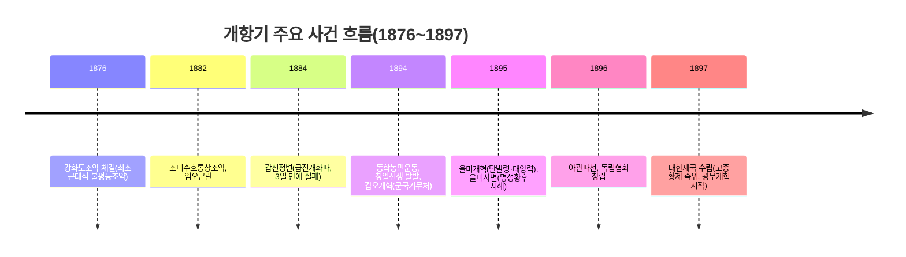

<Callout type="info">
  **이번 문서의 목표:** 이 파일을 다 읽으면 강화도조약으로 시작된 개항이 어떤 조약·사건을 거쳐 갑오·을미개혁과 대한제국 수립으로 이어졌는지 시간 순으로 설명할 수 있고, 위정척사·개화파·동학농민군이라는 서로 다른 세 입장이 왜 갈라졌는지, 대한제국의 근대화 정책이 어떤 한계 속에서 열강의 이권 침탈에 밀려났는지 답할 수 있다.
</Callout>

## 왜 "개항기"를 하나의 편으로 묶는가

13편까지는 조선 내부의 경제·신분·사상 변화를 다뤘습니다. 이번 편부터는 조선이 **외부 세계와 강제로 마주친 뒤** 벌어진 일들을 다룹니다. 개항기(1876~1897년 무렵)와 대한제국기(1897~1910년)는 조약·정변·개혁·전쟁이 몇 년 간격으로 연속해서 터진 시기라, 사건을 따로따로 외우면 순서가 쉽게 엉킵니다. 독학사 4단계는 "다음 중 시기 순으로 옳게 나열한 것은" 같은 **순서 배열형 문항**을 이 시기에서 즐겨 내므로, 이번 편은 사건을 하나의 연표 위에 올려놓고 그 인과관계를 함께 짚습니다.

> **쉽게 말하면:** 이 시기는 "문을 열자마자 이웃 나라들이 번갈아 들어와 이권을 챙기는데, 정작 집안에서는 문을 더 열자는 쪽과 걸어 잠그자는 쪽이 계속 싸우다가, 뒤늦게 대문과 지붕을 고치려 했지만 이미 옆집들이 안방까지 들어와 있던" 상황입니다.

## 1. 강제로 열린 문 — 개항과 불평등조약

### 강화도조약(1876)

1875년 일본 군함이 강화도 초지진에 접근해 조선군과 무력 충돌을 일으킨 **운요호 사건**을 구실로, 일본은 이듬해인 **1876년** 조선에 조약 체결을 강요했습니다. 그 결과 체결된 **강화도조약**(정식 명칭: 조일수호조규)은 조선이 외국과 맺은 최초의 근대적 조약이자, 다음과 같은 불평등 조항을 담은 조약이었습니다.

- 부산 외 두 곳(원산·인천)의 개항
- 일본의 조선 해안 측량권 허용(조선 해안을 조선 정부 허락 없이 조사할 권리)
- 일본인의 **치외법권**(조선에서 범죄를 저질러도 조선 법이 아닌 일본 법으로 재판받는 권리) 인정

강화도조약 이후 조선은 일본에 이어 서양 국가들과도 조약을 맺었습니다. 특히 **1882년** 체결된 **조미수호통상조약**은 서양 국가와 맺은 최초의 조약으로, 양국이 제3국의 침략을 받으면 서로 돕는다는 취지의 조항(거중조정)과, 조선에 유리한 조건을 다른 나라에 주면 미국에도 자동으로 적용한다는 **최혜국 대우** 조항을 담고 있었습니다. 이후 영국·독일·러시아 등과도 비슷한 성격의 조약이 이어졌습니다.

**자주 틀리는 점**: "강화도조약은 조선에 유리한 대등한 조약이었다"는 설명은 틀렸습니다. 해안 측량권과 치외법권은 명백히 일본에만 유리한 불평등 조항이라는 점을 놓치지 않아야 합니다.

## 2. 개항을 둘러싼 세 입장

### 위정척사파 — 성리학적 질서를 지키자

**위정척사**(衛正斥邪, 바른 것을 지키고 그릇된 것을 물리침)파는 성리학적 화이관(중화 문명과 오랑캐를 구분하는 세계관)에 근거해 서양·일본과의 통상 자체를 반대했습니다. 이항로·기정진 등이 초기 이론을 세웠고, 최익현은 강화도조약 체결에 반대하며 "일본과 서양은 한통속이므로 일본과의 통상도 곧 서양과의 통상과 같다"는 취지의 **왜양일체론**(倭洋一體論)을 내세웠습니다. 위정척사 운동은 이후 을미의병(1895)·을사의병(1905)·정미의병(1907)으로 이어지는 **항일 의병운동**의 사상적 뿌리가 되었습니다(이 흐름은 16편에서 이어 다룹니다).

### 개화파 — 그러나 방법은 갈렸다

개항을 받아들이고 서양 문물을 배워야 한다고 본 **개화파**는 그 방법을 두고 다시 둘로 나뉘었습니다.

| 갈래 | 대표 인물 | 핵심 입장 |
|------|-----------|-----------|
| 온건개화파 | 김홍집, 김윤식 | 동도서기론(東道西器論) — 유교적 정신·제도(동도)는 지키고 서양의 기술(서기)만 받아들이자는 점진적 개혁론 |
| 급진개화파 | 김옥균, 박영효 | 문명개화론 — 정치 제도까지 서양·일본식으로 근본적으로 바꿔야 한다는 급진적 개혁론 |

이 두 갈래의 입장 차이는 뒤에서 볼 **갑신정변**(1884)에서 급진개화파가 정변을 일으키는 배경이 됩니다.

### 동학농민군 — 안으로부터의 개혁 요구

한편 지배층의 개혁 논쟁과는 별개로, 농민들은 삼정의 문란과 지방관의 수탈에 직접 맞섰습니다. 이 흐름은 15편·16편과 이어지는 근현대사의 중요한 축이므로, 여기서는 "위정척사·개화파의 위로부터의 논쟁"과 구분되는 "아래로부터의 개혁 요구"라는 위치만 짚어 둡니다.

## 3. 정변과 전쟁이 이어진 10여 년

### 임오군란(1882)과 갑신정변(1884)

구식 군인에 대한 차별 대우에 반발해 **1882년** 임오군란이 일어나자 청이 군대를 파견해 진압에 개입했고, 이 사건을 계기로 조선에 대한 청의 내정 간섭이 강화되었습니다. 이런 상황에 위기감을 느낀 급진개화파 김옥균·박영효 등은 **1884년** 우정총국 개국 축하연을 기회로 정변을 일으켜 새 정부를 세웠으나(**갑신정변**), 청군의 즉각적인 개입으로 3일 만에 실패했습니다.

### 동학농민운동과 청일전쟁, 그리고 갑오개혁(1894)

**1894년** 전라도 고부에서 시작된 동학농민운동이 전국으로 번지자, 조선 정부는 이를 진압하기 위해 청에 파병을 요청했고, 톈진조약(1885년, 갑신정변 뒷수습 과정에서 청·일 양국이 조선에 파병할 때 서로 통보하기로 한 조약)을 근거로 일본도 군대를 파견했습니다. 이는 결국 같은 해 **청일전쟁**으로 이어졌습니다.

일본의 군사적 압박 속에서 조선 정부는 **군국기무처**를 중심으로 개혁을 추진했는데, 이를 **갑오개혁**이라 부릅니다. 갑오개혁은 신분제 폐지, 과거제 폐지, 조혼 금지 등 조선의 전통적인 신분·제도 질서를 법적으로 무너뜨린 개혁으로 평가받습니다.

### 을미개혁과 을미사변(1895), 아관파천(1896)

청일전쟁에서 일본이 승리하며 조선에 대한 일본의 영향력이 커지자, 조선 정부는 러시아 등을 끌어들여 일본을 견제하려 했습니다. 이에 위협을 느낀 일본은 **1895년** 경복궁을 습격해 명성황후를 시해하는 **을미사변**을 저질렀습니다. 같은 해 단발령 시행 등을 담은 **을미개혁**이 이어졌으나, 을미사변으로 반일 감정이 극도로 고조된 상황에서 단발령까지 겹치자 전국에서 **을미의병**이 일어났습니다. 신변의 위협을 느낀 고종은 **1896년** 러시아 공사관으로 거처를 옮기는 **아관파천**을 단행했고, 이 시기 서재필 등이 독립협회를 창립해 자주독립과 근대적 개혁을 주장하는 여론 운동을 펼쳤습니다.

**자주 틀리는 점**: 갑오개혁과 을미개혁을 하나로 뭉뚱그려 "1894년에 단발령까지 한 번에 시행됐다"고 잘못 기억하는 경우가 많습니다. 단발령은 **1895년 을미개혁** 때의 일이며, 1894년 갑오개혁(1·2차)과는 시기와 계기(군국기무처 주도 vs 을미사변 이후 추진)가 다르다는 점을 구분해야 합니다.

## 4. 대한제국과 광무개혁 — 근대화 시도와 한계

**1897년** 러시아 공사관에서 경운궁(덕수궁)으로 환궁한 고종은 국호를 **대한제국**으로 바꾸고 황제로 즉위해, 조선이 더 이상 청의 조공국이 아닌 자주적인 제국임을 대내외에 선포했습니다. 대한제국은 **광무개혁**(光武改革)을 통해 근대화를 시도했는데, 그 성격은 "구본신참"(舊本新參, 옛 것을 근본으로 삼고 새 것을 참고함)으로 요약됩니다. 이는 황제권 강화를 바탕에 두면서 서양의 기술·제도를 부분적으로 받아들이는 절충적 노선으로, 갑오·을미개혁의 급진성과는 대비됩니다.

광무개혁의 주요 내용으로는 근대적 토지 소유 증명서인 **지계**(地契) 발급 사업, 상공업 진흥을 위한 회사·공장 설립 지원, 군제 개편, 신식 학교와 유학생 파견을 통한 교육 진흥 등이 있습니다. 그러나 대한제국의 개혁은 재정 부족과 열강의 간섭 속에서 제한적으로만 진행되었고, 뒤이어 벌어진 러일전쟁(1904~1905)에서 일본이 승리하면서 그 자주적 개혁 시도는 크게 위축되었습니다.

## 5. 열강의 이권 침탈 구조

개항 이후 조선(대한제국)에서는 여러 나라가 경쟁적으로 철도 부설권·광산 채굴권·삼림 채벌권 등 각종 이권을 차지했습니다. 이 구조는 특정 한 나라의 단독 침탈이 아니라, 조선이 한 나라에 이권을 주면 다른 나라가 최혜국 대우 조항을 근거로 비슷한 이권을 요구하는 방식으로 **경쟁적·연쇄적**으로 확대되었다는 점이 특징입니다.

| 이권 종류 | 사례 |
|-----------|------|
| 철도 부설권 | 경인선(초기 미국이 착공권을 얻었다가 일본에 넘어감), 경부선(일본) |
| 광산 채굴권 | 운산 금광(미국), 그 밖에 여러 지역의 금광 채굴권이 각국에 분산 허용 |
| 삼림 채벌권 | 압록강·두만강 유역 삼림 채벌권(러시아) |

이런 이권 침탈은 대한제국의 재정 기반을 약화시키는 동시에, 러시아와 일본이 한반도를 둘러싸고 대립하는 배경이 되었고, 그 대립은 결국 러일전쟁으로 폭발했습니다. 러일전쟁 이후 일본이 을사늑약(1905)으로 대한제국의 외교권을 박탈하는 과정은 15편에서 이어 다룹니다.

## 핵심 정리

- 강화도조약(1876)은 운요호 사건을 구실로 체결된 최초의 근대적 불평등조약이며, 조미수호통상조약(1882)은 서양과 맺은 최초의 조약으로 최혜국 대우 조항을 담고 있었다.
- 개항을 둘러싼 입장은 위정척사(성리학적 화이관, 왜양일체론)·개화파(온건개화파의 동도서기론 vs 급진개화파의 문명개화론)로 갈렸고, 급진개화파는 갑신정변(1884)을 일으켰다가 3일 만에 실패했다.
- 1894년 동학농민운동을 계기로 청일전쟁이 발발했고, 그 사이 군국기무처를 중심으로 신분제·과거제 폐지 등을 담은 갑오개혁이 추진되었다.
- 1895년 을미사변(명성황후 시해)과 단발령을 담은 을미개혁이 이어지자 을미의병이 일어났고, 고종은 1896년 아관파천을 단행했다.
- 1897년 대한제국 수립 후 구본신참을 내세운 광무개혁(지계 발급, 상공업·교육 진흥 등)이 추진되었으나, 열강의 연쇄적 이권 침탈과 러일전쟁으로 그 성과는 제한적이었다.

## 마무리 복습

<Quiz
  questionNumber={1}
  question="강화도조약(1876)에 대한 설명으로 옳지 않은 것은?"
  options={['운요호 사건을 구실로 일본의 강요에 의해 체결되었다.', '조선이 외국과 맺은 최초의 근대적 조약이다.', '일본의 해안 측량권과 치외법권을 인정한 불평등조약이다.', '조선과 일본이 대등한 입장에서 맺은 호혜적 조약이다.']}
  correctAnswer={4}
  explanation="강화도조약은 해안 측량권과 치외법권 등 일본에만 유리한 조항을 담은 불평등조약이므로, 대등하고 호혜적인 조약이었다는 설명은 옳지 않다."
  optionExplanations={['옳은 설명이다. 운요호 사건이 조약 체결의 직접적 계기였다.', '옳은 설명이다. 강화도조약은 조선 최초의 근대적 조약이다.', '옳은 설명이다. 해안 측량권과 치외법권은 대표적인 불평등 조항이다.', '옳지 않은 설명이므로 정답이다. 이 조약은 일본에만 유리한 불평등조약이었다.']}
/>

<Quiz
  questionNumber={2}
  question="개화파의 두 갈래에 대한 설명으로 가장 적절한 것은?"
  options={['온건개화파는 문명개화론을 내세워 정치 제도까지 근본적으로 바꾸자고 주장했다.', '급진개화파는 동도서기론을 내세워 유교적 정신은 지키자고 주장했다.', '온건개화파는 동도서기론을, 급진개화파는 문명개화론을 내세웠다.', '온건개화파와 급진개화파는 개항 자체에 반대했다는 점에서 위정척사파와 같은 입장이었다.']}
  correctAnswer={3}
  explanation="온건개화파(김홍집, 김윤식 등)는 동도서기론을, 급진개화파(김옥균, 박영효 등)는 문명개화론을 내세워 개혁의 속도와 범위에서 서로 다른 입장을 취했다."
  optionExplanations={['문명개화론은 급진개화파의 입장이며 온건개화파의 입장이 아니다.', '동도서기론은 온건개화파의 입장이며 급진개화파의 입장이 아니다.', '정답. 온건개화파의 동도서기론과 급진개화파의 문명개화론에 대한 옳은 설명이다.', '개화파는 개항과 서양 문물 수용 자체는 찬성했다는 점에서 개항 자체를 반대한 위정척사파와 근본적으로 입장이 다르다.']}
/>

<Quiz
  questionNumber={3}
  question="다음 사건을 시기 순으로 옳게 나열한 것은?"
  options={['갑신정변 - 임오군란 - 갑오개혁 - 을미사변', '임오군란 - 갑신정변 - 갑오개혁 - 을미사변', '갑오개혁 - 임오군란 - 을미사변 - 갑신정변', '을미사변 - 갑오개혁 - 갑신정변 - 임오군란']}
  correctAnswer={2}
  explanation="임오군란(1882년) 다음 갑신정변(1884년), 이어서 갑오개혁(1894년), 그리고 을미사변(1895년) 순으로 사건이 전개되었다."
  optionExplanations={['임오군란이 갑신정변보다 먼저 일어났으므로 순서가 틀렸다.', '정답. 1882년 임오군란, 1884년 갑신정변, 1894년 갑오개혁, 1895년 을미사변 순서다.', '임오군란과 갑신정변이 갑오개혁보다 먼저 일어났으므로 순서가 틀렸다.', '을미사변이 가장 나중에 일어난 사건인데 첫머리에 놓여 순서가 틀렸다.']}
/>

<Quiz
  questionNumber={4}
  question="1894년 동학농민운동과 갑오개혁에 대한 설명으로 옳지 않은 것은?"
  options={['동학농민운동 진압을 위한 청의 파병에 맞서 일본도 톈진조약을 근거로 파병했다.', '청일전쟁은 조선에 대한 청일 양국의 군사 개입이 격화되며 발발했다.', '갑오개혁은 군국기무처를 중심으로 추진되어 신분제와 과거제를 폐지했다.', '갑오개혁 때 단발령이 함께 시행되어 전국적인 의병 봉기를 불러왔다.']}
  correctAnswer={4}
  explanation="단발령은 1894년 갑오개혁이 아니라 1895년 을미개혁 때 시행되었으며, 이에 반발해 일어난 의병은 을미의병이다."
  optionExplanations={['옳은 설명이다. 톈진조약을 근거로 일본도 파병했다.', '옳은 설명이다. 청일 양국의 군사 개입이 청일전쟁으로 이어졌다.', '옳은 설명이다. 갑오개혁은 신분제·과거제 폐지 등 큰 폭의 개혁을 담았다.', '옳지 않은 설명이므로 정답이다. 단발령은 1895년 을미개혁 때의 조치다.']}
/>

<Quiz
  questionNumber={5}
  question="아관파천과 대한제국 수립에 대한 설명으로 가장 적절한 것은?"
  options={['고종은 을미사변 이후 신변의 위협을 느껴 러시아 공사관으로 거처를 옮겼다.', '아관파천 직후 곧바로 갑신정변이 일어나 정부가 전복되었다.', '대한제국은 1876년 강화도조약 체결과 동시에 수립되었다.', '고종은 러시아 공사관에 머무는 동안 대한제국 수립을 선포했다.']}
  correctAnswer={1}
  explanation="을미사변으로 신변에 위협을 느낀 고종은 1896년 러시아 공사관으로 거처를 옮기는 아관파천을 단행했고, 이후 1897년 경운궁으로 환궁해 대한제국을 선포했다."
  optionExplanations={['정답. 을미사변 이후의 위협이 아관파천의 직접적 배경이다.', '갑신정변은 1884년에 일어난 사건으로 아관파천(1896년)보다 앞선 사건이다.', '대한제국 수립은 1897년의 일로 강화도조약 체결(1876년)과는 시기가 다르다.', '대한제국 선포는 고종이 러시아 공사관에서 경운궁으로 환궁한 이후인 1897년에 이루어졌다.']}
/>

<Quiz
  questionNumber={6}
  question="광무개혁에 대한 설명으로 옳지 않은 것은?"
  options={['구본신참을 내세워 황제권 강화를 바탕으로 서양 제도를 부분적으로 수용했다.', '근대적 토지 소유 증명서인 지계를 발급하는 사업을 추진했다.', '갑오개혁보다 더 급진적으로 왕정을 폐지하고 공화정을 수립하려 했다.', '재정 부족과 열강의 간섭 속에서 개혁 성과가 제한적이었다.']}
  correctAnswer={3}
  explanation="광무개혁은 황제권을 오히려 강화하는 구본신참 노선을 취했으며, 왕정 폐지나 공화정 수립을 시도한 적이 없다."
  optionExplanations={['옳은 설명이다. 구본신참은 광무개혁의 성격을 요약하는 표현이다.', '옳은 설명이다. 지계 발급은 광무개혁의 대표적인 사업이다.', '옳지 않은 설명이므로 정답이다. 광무개혁은 황제권 강화를 바탕으로 한 절충적 개혁이었다.', '옳은 설명이다. 재정 부족과 열강 간섭이 개혁의 한계로 작용했다.']}
/>

<Quiz
  questionNumber={7}
  question="개항 이후 열강의 이권 침탈 구조에 대한 설명으로 가장 적절한 것은?"
  options={['특정 한 나라만이 단독으로 조선의 모든 이권을 독점했다.', '한 나라에 이권을 허용하면 다른 나라가 최혜국 대우를 근거로 비슷한 이권을 요구하며 경쟁적으로 확대되었다.', '이권 침탈은 대한제국 수립 이전에만 있었고 이후에는 완전히 사라졌다.', '이권 침탈은 대한제국의 재정에 별다른 영향을 주지 않았다.']}
  correctAnswer={2}
  explanation="개항 이후 이권 침탈은 최혜국 대우 조항을 매개로 여러 나라가 연쇄적, 경쟁적으로 철도·광산·삼림 등의 이권을 차지하는 방식으로 확대되었다."
  optionExplanations={['이권 침탈은 여러 나라가 경쟁적으로 참여한 구조였지 한 나라의 단독 독점이 아니었다.', '정답. 최혜국 대우 조항을 매개로 한 연쇄적 이권 침탈에 대한 옳은 설명이다.', '이권 침탈은 대한제국 시기에도 계속되었으며 러일전쟁 전후까지 이어졌다.', '이권 침탈은 대한제국의 재정 기반을 약화시키는 요인이 되었다.']}
/>

## 참고 자료

- [국사편찬위원회 한국사데이터베이스](https://db.history.go.kr)
- [우리역사넷](https://contents.history.go.kr)
