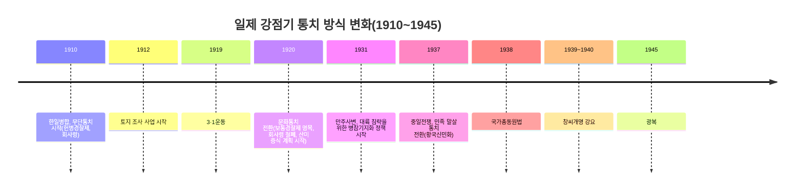

<Callout type="info">
  **이번 문서의 목표:** 이 파일을 다 읽으면 1910년부터 1945년까지 일제의 통치 방식이 무단통치 → 문화통치 → 민족 말살 통치로 왜, 어떤 계기로 바뀌었는지 설명할 수 있고, 토지 조사 사업·회사령·산미 증식 계획이 각각 어떤 방식으로 조선을 수탈했는지 시기별로 구분해 답할 수 있다.
</Callout>

## 왜 통치 방식의 "변화"를 중심으로 봐야 하는가

14편 끝에서 살펴본 대로, 일본은 러일전쟁(1904~1905) 승리 이후 을사늑약(1905)으로 대한제국의 외교권을 빼앗고 통감부를 설치했으며, 헤이그 특사 파견(1907)을 구실로 고종을 강제 퇴위시키고 정미7조약(1907)으로 군대까지 해산시킨 뒤, **1910년** 한일병합조약으로 대한제국의 국권을 완전히 빼앗았습니다. 이후 1945년 광복까지 35년의 일제 강점기 동안, 일제의 통치 방식은 한 가지로 고정되어 있지 않고 **3·1운동(1919)**, **중일전쟁(1937)** 같은 큰 사건을 계기로 뚜렷이 달라졌습니다. 독학사 4단계는 "이 정책이 무단통치기인지 문화통치기인지 민족 말살 통치기인지"를 묻는 **시기 구분형 문항**을 자주 내므로, 이번 편은 통치 방식의 변화를 축으로 삼아 각 시기의 정책을 배치합니다.

> **쉽게 말하면:** 일제는 처음에는 총과 칼로 억누르다가(무단통치), 3·1운동으로 저항이 거세지자 겉으로는 부드러운 척하며 실제로는 친일 세력을 키우는 방식으로 바꾸었고(문화통치), 중일전쟁 이후 전쟁 물자가 급해지자 아예 조선인을 "일본인처럼" 만들어 전쟁에 동원하려 했습니다(민족 말살 통치).

## 1. 조선총독부 — 식민 통치의 최고 기구

일제는 한일병합 직후 **조선총독부**(朝鮮總督府)를 설치해 조선을 통치했습니다. 조선총독은 일본 육해군 대장 출신만 임명될 수 있었고, 일본 의회의 통제를 거의 받지 않으며 입법·행정·사법·군사권을 모두 장악한 사실상의 절대 권력자였습니다. 이 구조 자체는 1945년 광복 때까지 형식적으로 유지되었지만, 그 아래에서 실제로 어떤 정책을 펴는지는 시기마다 크게 달라졌습니다.

## 2. 무단통치(1910년대) — 총과 칼로 다스리다

1910년대 통치를 흔히 **무단통치**(武斷統治)라고 부릅니다. 헌병(군인 신분의 경찰)이 일반 경찰 업무까지 담당하는 **헌병경찰제**를 시행해 감시와 억압을 일상화했고, 조선인에게만 적용되는 **조선태형령**을 두어 즉결 처분으로 매질(태형)을 가할 수 있게 했습니다. 관리와 교원까지 제복을 입고 칼을 차게 해 위압적인 분위기를 조성한 것도 이 시기의 특징입니다.

경제적으로는 **회사령**(1910년)을 시행해 회사를 설립하려면 조선총독의 허가를 받도록 강제했습니다. 이는 조선인의 민족 자본 성장을 억제하는 동시에, 총독부가 산업 전반을 통제할 수 있게 한 조치였습니다.

**자주 틀리는 점**: "무단통치기에는 조선인 관리와 일본인 관리에게 같은 법이 적용되었다"는 설명은 틀렸습니다. 조선태형령은 조선인에게만 적용된 차별적 법령이었다는 점이 시험에서 자주 강조됩니다.

## 3. 토지 조사 사업(1912~1918) — 신고주의라는 함정

무단통치기 최대의 경제 수탈 사업은 **토지 조사 사업**(1912~1918년)입니다. 표면적인 명분은 "근대적 토지 소유권 확립"이었지만, 실제 방식은 토지 소유자가 정해진 기간 안에 직접 신고해야만 소유권을 인정하는 **신고주의**(申告主義)였습니다.

- 신고 절차가 복잡하고 짧은 기간 안에 진행되어, 신고 방법을 몰랐거나 신고 기회를 놓친 농민이 많았습니다.
- 특히 마을이나 문중이 공동으로 소유해 온 토지처럼 개인 명의로 신고하기 애매한 토지, 왕실·관청 소유였던 토지 등은 신고자가 불분명하다는 이유로 **총독부 소유지로 편입**되었습니다.
- 총독부로 넘어간 토지의 상당 부분은 일본인 이주민에게 헐값에 넘기거나, 국책 회사인 **동양척식주식회사**를 통해 불하되었습니다.
- 신고를 통해 소유권을 인정받은 지주는 오히려 소유권이 명확해져 유리해진 반면, 관습적으로 경작권을 인정받아 온 소작농은 그 관습적 권리를 법적으로 보장받지 못하고 지주와의 소작 계약에 전적으로 의존하는 처지가 되었습니다.

> **쉽게 말하면:** "여러분 땅을 정확히 등록해 드리겠습니다"라고 홍보했지만, 정작 등록 방법과 기간을 제대로 알리지 않아 등록하지 못한 땅과, 원래 마을 공동 소유라 등록 자체가 애매했던 땅을 총독부가 챙긴 사업입니다.

**자주 틀리는 점**: "토지 조사 사업으로 조선 농민 대부분이 새로 토지 소유권을 얻었다"는 설명은 틀렸습니다. 실제로는 신고 절차의 허점을 이용해 총독부와 일본인이 토지를 확보하고, 다수의 소작농은 오히려 관습적 경작권마저 약화되는 결과를 낳았습니다.

## 4. 문화통치(1920년대) — 겉과 속이 다른 전환

**1919년 3·1운동**은 전국적, 전 계층적 만세 시위로 번지며 일제에 큰 충격을 주었습니다(3·1운동 자체의 전개와 의의는 16편에서 자세히 다룹니다). 국제 여론의 비판과 조선인의 거센 저항에 직면한 일제는 통치 방식을 **문화통치**(文化統治)로 바꾸었습니다.

문화통치는 헌병경찰제를 명목상 **보통경찰제**로 바꾸고, 조선일보·동아일보 같은 한글 신문의 창간을 허용하며, 조선인에게도 제한적으로 관리 임용 기회를 넓히는 등 겉으로는 유화적인 모습을 보였습니다. 그러나 실제로는 다음과 같은 이면이 있었습니다.

- 보통경찰제로 전환했지만 경찰관서·경찰 인원은 오히려 크게 늘어나 감시 체제는 더 촘촘해졌습니다.
- 신문·잡지의 발행은 허용했지만 사전 검열을 통해 기사를 삭제·정간시키는 일이 빈번했습니다.
- 친일 인사를 육성하고 지주·자본가 계층을 회유해, 민족 내부를 분열시키는 **민족 분열 정책**을 함께 폈습니다.

경제적으로는 **회사령을 철폐**(허가제 → 신고제)해 일본 자본이 조선에 더 쉽게 진출할 수 있게 했고, **산미 증식 계획**(1920~1934년, 중간에 세계 대공황 여파로 일시 중단)을 시행했습니다. 산미 증식 계획은 명목상 쌀 생산량을 늘리는 계획이었지만, 실제로는 늘어난 증산량보다 훨씬 많은 양의 쌀을 일본으로 반출해, 계획 기간 동안 조선인 1인당 쌀 소비량은 오히려 줄어들고 만주산 잡곡으로 그 부족분을 메워야 하는 상황이 벌어졌습니다.

**자주 틀리는 점**: "문화통치기에는 감시와 억압이 실질적으로 완화되었다"는 설명은 틀렸습니다. 경찰력은 오히려 양적으로 확대되었고, 검열과 민족 분열 정책이 함께 작동한 **기만적인 통치 전환**이었다는 점이 핵심입니다.

## 5. 병참기지화와 민족 말살 통치(1930년대 이후)

**1931년 만주사변**을 시작으로 일본이 대륙 침략을 본격화하면서, 조선은 일본의 전쟁 수행을 위한 **병참기지**(전쟁 물자를 생산·공급하는 후방 기지)로 취급되기 시작했습니다. 이 시기 북부 지방을 중심으로 중화학 공업 시설이 세워졌지만, 이는 조선의 산업 발전을 위한 것이 아니라 철·석탄 등 전쟁 물자를 조달하기 위한 목적이었습니다.

**1937년 중일전쟁** 발발 이후에는 통치 방식이 다시 한 번 바뀌어 **민족 말살 통치**(民族抹殺統治) 단계로 들어섭니다. 이 시기의 핵심 목표는 조선인의 민족의식 자체를 지우고 전쟁에 필요한 인력·자원으로 완전히 동원하는 것이었습니다.

| 정책 | 시기 | 내용 |
|------|------|------|
| 황국신민화 정책 | 1930년대 후반– | "황국신민의 서사" 암송 강요, 신사참배 강요로 일본 천황에 대한 충성을 주입 |
| 창씨개명 | 1939–1940년 | 조선인의 성과 이름을 일본식으로 바꾸도록 강요 |
| 조선어·조선사 교육 금지 | 1930년대 후반– | 학교에서 조선어 과목 폐지, 일본어 상용 강요, 조선 역사 교육 억제 |
| 국가총동원법 | 1938년 | 인력·물자를 전쟁 수행에 강제로 동원할 수 있는 법적 근거 마련 |
| 강제 징용·징병, 일본군 위안부 동원 | 1938년 이후 | 노동력과 병력을 강제로 동원했고, 여성을 일본군 위안부로 강제 동원하는 반인륜적 범죄가 자행됨 |
| 공출 제도 | 1930년대 후반– | 쌀·금속 등 전쟁 물자를 강제로 거두어들임(농기구·제기 등 금속류까지 공출 대상이 됨) |

**자주 틀리는 점**: 창씨개명(1939~1940년)과 국가총동원법(1938년)의 선후 관계를 뒤바꿔 기억하는 경우가 있습니다. 국가총동원법이 먼저 제정되어 인력·물자 동원의 법적 틀을 마련한 뒤, 그 틀 안에서 창씨개명·강제 징용 등이 순차적으로 강요되었다는 흐름을 기억해야 합니다.

## 핵심 정리

- 일제 강점기 통치 방식은 무단통치(1910년대, 헌병경찰제·조선태형령·회사령) → 문화통치(1920년대, 3·1운동을 계기로 전환, 실질은 기만적) → 민족 말살 통치(1937년 중일전쟁 이후, 황국신민화·창씨개명)로 변화했다.
- 토지 조사 사업(1912~1918)은 신고주의의 허점을 이용해 총독부와 일본인이 토지를 확보하고 소작농의 관습적 경작권을 약화시킨 사업이었다.
- 문화통치기의 회사령 철폐(허가제→신고제)와 산미 증식 계획(1920~1934)은 각각 일본 자본의 조선 진출 확대와 쌀 반출 확대라는 실질적 수탈로 이어졌다.
- 1931년 만주사변 이후 병참기지화 정책이 추진되었고, 1937년 중일전쟁 이후에는 국가총동원법(1938)을 바탕으로 강제 징용·징병·공출·일본군 위안부 동원 등 전면적인 인적·물적 수탈이 이루어졌다.
- "겉으로 완화된 것처럼 보이는 문화통치기가 실제로는 더 정교한 통제였다"는 관점을 놓치지 않아야 한다.

## 마무리 복습

<Quiz
  questionNumber={1}
  question="1910년대 무단통치에 대한 설명으로 옳지 않은 것은?"
  options={['헌병이 일반 경찰 업무까지 담당하는 헌병경찰제를 시행했다.', '조선인에게만 적용되는 조선태형령으로 즉결 처분을 가능하게 했다.', '회사 설립을 신고제로 완화해 조선인 자본의 자유로운 성장을 지원했다.', '관리와 교원에게까지 제복을 입고 칼을 차게 해 위압적 분위기를 조성했다.']}
  correctAnswer={3}
  explanation="1910년대에는 회사령을 통해 회사 설립을 허가제로 강력히 통제했으며, 회사령이 신고제로 완화된 것은 1920년대 문화통치기의 일이다."
  optionExplanations={['옳은 설명이다. 헌병경찰제는 무단통치의 핵심 기구였다.', '옳은 설명이다. 조선태형령은 조선인에게만 적용된 차별적 법령이다.', '옳지 않은 설명이므로 정답이다. 1910년대 회사령은 허가제였고, 신고제 전환은 1920년대의 일이다.', '옳은 설명이다. 제복과 칼은 무단통치기의 위압적 통치 상징이었다.']}
/>

<Quiz
  questionNumber={2}
  question="토지 조사 사업(1912~1918)에 대한 설명으로 가장 적절한 것은?"
  options={['정해진 기간 안에 소유자가 직접 신고해야 소유권을 인정받는 신고주의 방식이었다.', '신고 절차가 간단하고 홍보가 충분해 조선 농민 대부분이 손쉽게 소유권을 인정받았다.', '마을이나 문중이 공동으로 소유해 온 토지는 예외 없이 원래 경작자에게 귀속되었다.', '이 사업으로 소작농의 관습적 경작권이 오히려 법적으로 더욱 강화되었다.']}
  correctAnswer={1}
  explanation="토지 조사 사업은 정해진 기간 안에 소유자가 직접 신고해야만 소유권을 인정받는 신고주의 방식으로 진행되었고, 이 절차의 허점을 이용해 총독부와 일본인이 많은 토지를 확보했다."
  optionExplanations={['정답. 신고주의 방식에 대한 옳은 설명이다.', '신고 절차는 복잡하고 기간도 짧아 신고하지 못한 농민이 많았다.', '소유가 불분명한 공동 소유 토지는 오히려 총독부 소유지로 편입되는 경우가 많았다.', '소작농의 관습적 경작권은 이 사업 이후 법적 보호를 받지 못하고 오히려 약화되었다.']}
/>

<Quiz
  questionNumber={3}
  question="1920년대 문화통치에 대한 설명으로 옳지 않은 것은?"
  options={['3·1운동을 계기로 통치 방식을 전환하며 등장했다.', '헌병경찰제를 보통경찰제로 바꾸면서 경찰 인원과 관서 수를 오히려 늘렸다.', '한글 신문 창간을 허용하되 사전 검열로 기사를 삭제, 정간시켰다.', '친일 세력 육성이나 민족 분열 정책 없이 조선인 전체의 처우를 실질적으로 동등하게 개선했다.']}
  correctAnswer={4}
  explanation="문화통치는 친일 인사 육성과 지주, 자본가 계층 회유를 통한 민족 분열 정책을 핵심 수단으로 삼았으며, 조선인 전체의 처우를 실질적으로 동등하게 개선한 것은 아니었다."
  optionExplanations={['옳은 설명이다. 3·1운동이 문화통치 전환의 직접적 계기였다.', '옳은 설명이다. 보통경찰제 전환에도 경찰력은 오히려 확대되었다.', '옳은 설명이다. 신문 발행은 허용했지만 검열이 상시적으로 이루어졌다.', '옳지 않은 설명이므로 정답이다. 문화통치는 민족 분열 정책을 동반한 기만적 전환이었다.']}
/>

<Quiz
  questionNumber={4}
  question="산미 증식 계획(1920~1934)에 대한 설명으로 가장 적절한 것은?"
  options={['쌀 생산량 증가분보다 훨씬 많은 양이 일본으로 반출되어 조선인의 1인당 쌀 소비량이 줄었다.', '이 계획으로 조선 농민의 식량 사정이 이전보다 눈에 띄게 좋아졌다.', '이 계획은 1910년대 무단통치기에 처음 시작되어 1945년 광복까지 중단 없이 계속되었다.', '이 계획의 목적은 조선 내수 시장의 쌀 소비를 늘리는 데 있었다.']}
  correctAnswer={1}
  explanation="산미 증식 계획은 쌀 증산량보다 훨씬 많은 양을 일본으로 반출해, 계획 기간 동안 조선인 1인당 쌀 소비량이 오히려 줄어들고 만주산 잡곡으로 부족분을 메워야 했다."
  optionExplanations={['정답. 증산량보다 많은 반출량으로 조선 내 식량 사정이 악화된 결과에 대한 옳은 설명이다.', '실제로는 반출량이 늘어 조선 내 식량 사정이 악화되었다.', '산미 증식 계획은 1920년대에 시작되었고 세계 대공황 여파로 중간에 중단된 시기가 있었다.', '이 계획의 실질적 목적은 조선 내수 소비 확대가 아니라 일본으로의 반출량 확대였다.']}
/>

<Quiz
  questionNumber={5}
  question="1930년대 이후 병참기지화 정책과 민족 말살 통치에 대한 설명으로 옳지 않은 것은?"
  options={['만주사변(1931) 이후 조선은 일본의 전쟁 물자 생산 기지로 취급되었다.', '중일전쟁(1937) 발발 이후 황국신민화 정책과 신사참배 강요가 본격화되었다.', '국가총동원법(1938)은 인력과 물자를 전쟁에 강제로 동원할 법적 근거가 되었다.', '창씨개명은 국가총동원법보다 앞선 1920년대 문화통치기에 이미 강요되었다.']}
  correctAnswer={4}
  explanation="창씨개명은 1939년에서 1940년 사이 민족 말살 통치기에 강요된 정책으로, 1938년 제정된 국가총동원법보다 뒤에 시행되었으며 1920년대 문화통치기의 일이 아니다."
  optionExplanations={['옳은 설명이다. 만주사변 이후 병참기지화가 본격화되었다.', '옳은 설명이다. 중일전쟁 이후 황국신민화 정책이 강화되었다.', '옳은 설명이다. 국가총동원법은 전면적 동원의 법적 근거였다.', '옳지 않은 설명이므로 정답이다. 창씨개명은 국가총동원법 제정 이후인 1939~1940년의 일이다.']}
/>

<Quiz
  questionNumber={6}
  question="다음 중 조선총독부에 대한 설명으로 가장 적절한 것은?"
  options={['조선총독은 조선인 중에서만 임명될 수 있었다.', '조선총독은 일본 의회의 엄격한 통제를 받아 독자적인 권한이 거의 없었다.', '조선총독은 입법, 행정, 사법, 군사권을 모두 장악한 강력한 권력을 가졌다.', '조선총독부는 문화통치 시기에 완전히 폐지되었다.']}
  correctAnswer={3}
  explanation="조선총독은 일본 육해군 대장 출신만 임명될 수 있었고, 일본 의회의 통제를 거의 받지 않으며 입법, 행정, 사법, 군사권을 모두 장악한 사실상의 절대 권력자였다."
  optionExplanations={['조선총독은 일본인, 그중에서도 일본 육해군 대장 출신만 임명되었다.', '조선총독은 일본 의회의 통제를 거의 받지 않는 독자적인 강력한 권한을 가졌다.', '정답. 조선총독의 권한 집중에 대한 옳은 설명이다.', '조선총독부는 통치 방식이 바뀌었을 뿐 1945년 광복 때까지 최고 통치 기구로 존속했다.']}
/>

## 참고 자료

- [국사편찬위원회 한국사데이터베이스](https://db.history.go.kr)
- [우리역사넷](https://contents.history.go.kr)
- [국가유산청](https://www.khs.go.kr)
