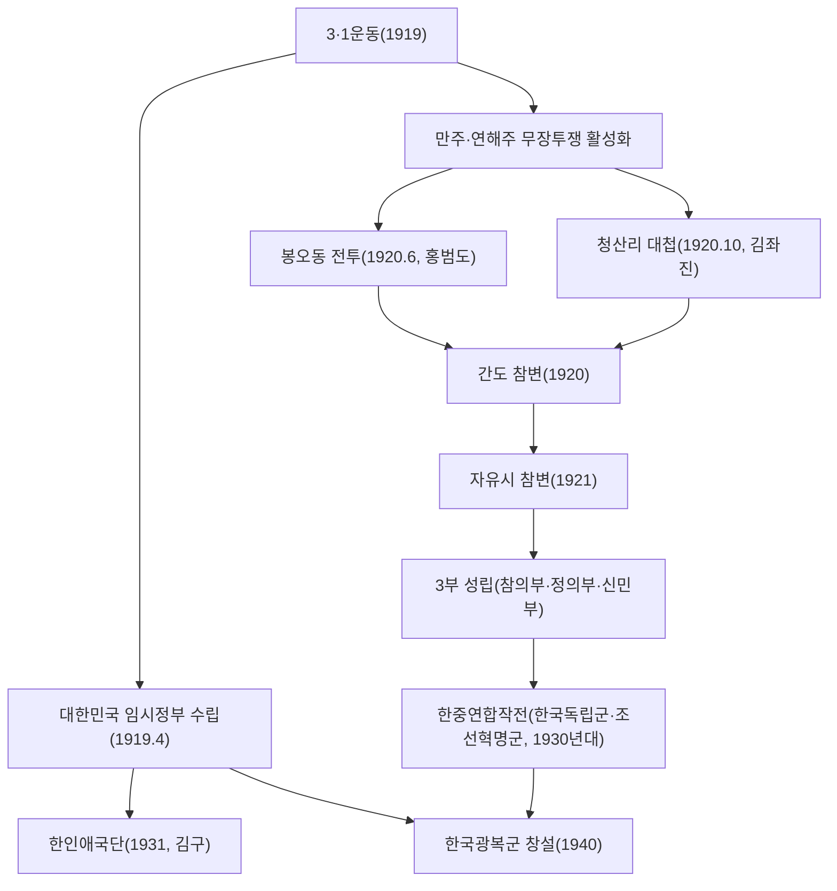

<Callout type="info">
  **이번 문서의 목표:** 이 파일을 다 읽으면 3·1운동이 왜 독립운동사의 분기점인지 설명할 수 있고, 그 이후 독립운동이 임시정부 노선, 만주·연해주의 무장투쟁 노선, 의열단·한인애국단의 의열투쟁 노선, 국내의 사회주의·노동·농민운동과 문화운동 노선으로 어떻게 갈라져 전개되었는지 구분해 답할 수 있다.
</Callout>

## 왜 독립운동을 "여러 갈래"로 나눠 보아야 하는가

15편에서 살펴본 대로 일제의 통치 방식은 시기마다 달라졌고, 그에 맞서는 독립운동도 하나의 조직·하나의 방법으로만 진행되지 않았습니다. 독학사 4단계는 "이 단체·이 인물이 어떤 노선에 속하는가"를 묻는 문항을 즐겨 내므로, 이번 편은 독립운동을 **임시정부(외교·통합 노선)**, **국내외 무장투쟁(군사 노선)**, **의열투쟁(암살·폭파 노선)**, **사회주의·노동·농민운동(계급 운동 노선)**, **문화·교육운동(실력 양성 노선)** 다섯 갈래로 나누어 각 갈래의 대표 사건과 인물을 짝지어 정리합니다.

> **쉽게 말하면:** 하나의 목표(독립)를 향해 "외교로 국제 사회를 설득하자", "군대를 길러 직접 싸우자", "핵심 인물을 노려 타격을 주자", "노동자·농민의 힘을 조직하자", "교육과 문화로 힘을 기르자"는 서로 다른 다섯 가지 방법이 동시에 시도되었습니다.

## 1. 3·1운동(1919) — 모든 갈래의 출발점

**1919년 3월 1일**, 민족대표들이 독립선언서를 발표한 것을 시작으로 서울과 평양 등 전국 주요 도시에서 만세 시위가 일어났고, 이 운동은 곧 전국 각지의 도시와 농촌, 나아가 만주·연해주·미주 등 해외 동포 사회로까지 확산되었습니다. 3·1운동은 특정 계층에 국한되지 않고 학생·농민·노동자·상인 등 전 계층이 참여한 최대 규모의 민족운동이었습니다.

3·1운동은 두 가지 중요한 결과를 낳았습니다.

1. **일제의 통치 방식 전환**: 15편에서 다룬 대로, 3·1운동에 대한 강경 진압과 그에 따른 국제 여론의 비판이 일제가 무단통치에서 문화통치로 전환하는 직접적 계기가 되었습니다.
2. **독립운동 최고 지도부의 필요성 확인**: 3·1운동을 계기로 국내외 각지에 흩어져 있던 임시정부 성격의 조직들을 하나로 통합해야 한다는 공감대가 형성되었고, 그 결과 **1919년 4월** 중국 상하이에서 여러 조직이 통합된 **대한민국 임시정부**가 수립되었습니다.

**자주 틀리는 점**: "3·1운동은 도시 지식인만 참여한 제한적인 운동이었다"는 설명은 틀렸습니다. 3·1운동은 전국·전 계층·해외 동포 사회까지 확산된 전민족적 운동이었다는 점이 핵심입니다.

## 2. 대한민국 임시정부 — 통합과 노선 조정의 역사

대한민국 임시정부는 삼권 분립에 기초한 민주 공화제 정부를 표방했고, 국내와의 비밀 연락망인 **연통제**와 **교통국**을 운영해 독립운동 자금을 모으고 정보를 주고받았습니다. 그러나 일제의 감시와 탄압으로 연통제·교통국이 무너지고, 외교 활동의 성과와 방법론을 둘러싼 내부 갈등(외교 중심 노선 vs 무장투쟁 중심 노선)이 겹치면서 초기 임시정부의 활동은 여러 차례 어려움을 겪었습니다.

1930년대에 접어들어 임시정부는 침체를 극복하기 위해 김구를 중심으로 **한인애국단**(1931년)을 조직해 의열투쟁을 다시 활성화시켰고(3절에서 자세히 다룸), 이후 중일전쟁으로 근거지를 여러 차례 옮기다가 충칭(重慶)에 정착한 뒤 **1940년** 임시정부의 정규군으로 **한국광복군**을 창설했습니다(4절에서 다룸). 이처럼 임시정부는 한 가지 노선에 머무르지 않고, 시기에 따라 외교·의열투쟁·무장투쟁을 넘나들며 독립운동의 구심점 역할을 하려 했습니다.

## 3. 의열투쟁 — 소수의 결단으로 큰 타격을

**의열단**은 **1919년** 김원봉을 중심으로 만주에서 결성된 단체로, 조선총독부·경찰서 등 식민 통치 기관과 침략에 앞장선 인물을 표적으로 삼는 암살·폭파 활동을 전개했습니다. 신채호가 작성한 **조선혁명선언**(1923년)은 의열단의 행동 노선에 사상적 기반을 제공한 선언문으로, 민중의 직접 혁명을 통한 독립 쟁취를 주장했습니다.

임시정부 침체기인 **1931년**에는 김구가 임시정부 산하에 **한인애국단**을 조직해 의열투쟁을 이어 갔습니다. 이 단체 소속의 이봉창은 1932년 도쿄에서, 윤봉길은 같은 해 상하이 훙커우 공원에서 각각 의거를 일으켰습니다. 특히 윤봉길 의거는 중국 국민당 정부가 이후 대한민국 임시정부를 적극적으로 지원하게 되는 중요한 전환점이 되었습니다.

| 단체 | 결성 시기 | 중심 인물 | 대표 활동 |
|------|-----------|-----------|-----------|
| 의열단 | 1919년 | 김원봉 | 조선혁명선언(1923, 신채호)을 사상적 기반으로 한 암살·폭파 활동 |
| 한인애국단 | 1931년 | 김구 | 이봉창 의거(1932, 도쿄), 윤봉길 의거(1932, 상하이 훙커우 공원) |

**자주 틀리는 점**: 의열단과 한인애국단의 결성 시기·중심 인물을 뒤바꿔 기억하는 경우가 많습니다. 의열단은 1919년 김원봉이, 한인애국단은 1931년 김구가 각각 조직했다는 점을 정확히 구분해야 합니다.

## 4. 국내외 무장투쟁 — 만주와 연해주의 전장

3·1운동 이후 많은 독립운동가들이 국경을 넘어 만주·연해주로 이동해 독립군 부대를 조직했습니다. **1920년**은 무장투쟁사에서 가장 중요한 해로, 두 차례의 큰 승리가 있었습니다.

- **봉오동 전투**(1920년 6월): 홍범도가 이끄는 대한독립군 등 연합 부대가 봉오동에서 일본군을 크게 격파했습니다.
- **청산리 대첩**(1920년 10월): 김좌진이 이끄는 북로군정서와 여러 독립군 부대의 연합이 청산리 일대에서 일본군에 승리를 거두었습니다.

이 두 전투에서 큰 타격을 입은 일본군은 보복으로 만주의 한인 마을을 습격해 다수의 한인을 살해하는 **간도 참변**(경신참변, 1920년)을 저질렀고, 이를 피해 이동한 독립군 부대는 러시아 자유시(스보보드니)에서 소련군과의 무력 충돌로 큰 희생을 입는 **자유시 참변**(1921년)을 겪었습니다.

이후 만주의 독립군 세력은 **참의부·정의부·신민부**의 3부로 재편되었고, 1920년대 후반에는 이를 다시 통합하려는 움직임 속에서 **국민부**(남만주)와 **혁신의회**(북만주) 계열로 정비되었습니다. 1930년대 들어 일본이 만주사변(1931)을 일으켜 만주국을 세우자, 한국독립군(지청천)과 조선혁명군(양세봉)은 각각 중국 군대와 연합해 항일 무장 투쟁을 이어 갔습니다(한중연합작전).

중일전쟁 발발(1937) 이후 중국 관내에서는 김원봉이 이끈 **조선의용대**(1938년)가 조직되어 중국군과 함께 항일전에 참여했고, 이 조선의용대의 일부 병력은 이후 한국광복군에 합류했습니다. 대한민국 임시정부는 충칭에 정착한 뒤 **1940년** 정규군인 **한국광복군**을 창설했고, 태평양전쟁 발발 이후에는 연합군의 일원으로 활동하며 미군 전략정보국(OSS)과 협력해 국내 진공 작전을 계획했습니다. 그러나 이 작전이 실행에 옮겨지기 전인 **1945년** 일본이 항복하며 광복을 맞았습니다.

**자주 틀리는 점**: "봉오동 전투와 청산리 대첩은 같은 해에 같은 부대가 치른 하나의 전투다"라는 인식은 부정확합니다. 두 전투는 모두 1920년에 일어났지만 시기(6월과 10월)와 주도 인물(홍범도 중심의 연합 부대, 김좌진의 북로군정서 중심 연합)이 다른 별개의 전투입니다.

## 5. 사회주의·노동·농민운동 — 계급의 눈으로 본 독립운동

1920년대 이후 사회주의 사상이 국내외 독립운동가들 사이에 퍼지면서, 민족 해방과 계급 해방을 함께 추구하는 흐름이 나타났습니다. 국내에서는 **1925년** 조선공산당이 결성되었으나 일제의 거듭된 검거로 조직이 와해와 재건을 반복했습니다.

노동운동에서는 **원산 총파업**(1929년)이 대표적입니다. 한 회사의 노동자 구타 사건을 계기로 시작된 이 파업은 원산 지역 노동자 전체가 연대해 참여한 대규모 파업으로 확산되며, 일제 강점기 노동운동의 조직력과 연대 의식을 보여 준 사건으로 평가받습니다. 농민운동에서는 지주의 소작료 인상에 맞선 **암태도 소작쟁의**(1923~1924년)가 대표적으로, 소작농들이 단체 행동을 통해 소작료 인하를 이끌어 낸 사례로 꼽힙니다.

민족주의 계열과 사회주의 계열이 이념 차이를 넘어 힘을 합쳐야 한다는 **민족유일당운동**의 흐름 속에서 **1927년** **신간회**가 결성되었습니다. 신간회는 민족주의 세력과 사회주의 세력이 좌우 합작으로 참여한 국내 최대 규모의 합법적 민족운동 단체였으나, 이념과 노선 차이로 **1931년** 해체되었습니다.

**자주 틀리는 점**: "신간회는 사회주의 계열만으로 구성된 단체다"라는 설명은 틀렸습니다. 신간회의 핵심적 의의는 민족주의와 사회주의라는 서로 다른 두 노선이 좌우 합작으로 함께 결성한 단체라는 데 있습니다.

## 6. 문화·교육 운동 — 실력을 길러 독립을 준비하다

국내에서는 무장투쟁이나 계급 운동과는 다른 방식으로, 교육·경제·언어 등 각 분야에서 민족의 실력을 기르려는 운동이 전개되었습니다.

- **물산장려운동**(1920년 평양에서 시작): "내 살림 내 것으로"라는 구호 아래 국산품 애용과 민족 자본 육성을 장려한 운동입니다.
- **민립대학 설립운동**(1920년대): 이상재 등이 중심이 되어 조선인의 힘으로 대학을 설립하려 한 운동으로, "한민족 1천만이 한 사람이 1원씩"이라는 구호로 모금을 시도했으나 일제의 방해와 자금 부족으로 뜻을 이루지 못했습니다(이후 일제는 이를 무마하기 위해 경성제국대학을 설립했습니다).
- **문맹 퇴치 운동**(1930년대, 이른바 브나로드 운동): 동아일보 등 언론이 주도해 학생들을 농촌에 파견하여 한글을 가르치고 문맹을 없애려 한 운동입니다.
- **조선어 연구·보급**: 1921년 조직된 조선어연구회는 1931년 **조선어학회**로 개편되어 한글 맞춤법 통일안(1933년) 제정 등 한글 연구와 보급에 힘썼습니다.

**자주 틀리는 점**: 민립대학 설립운동과 물산장려운동을 혼동해 "물산장려운동이 대학 설립을 목표로 했다"고 잘못 기억하는 경우가 있습니다. 물산장려운동은 국산품 애용·민족 자본 육성이 목표이고, 대학 설립이라는 별도의 목표를 가진 운동은 민립대학 설립운동이라는 점을 구분해야 합니다.

## 핵심 정리

- 3·1운동(1919)은 전 계층·전국·해외로 확산된 민족운동으로, 일제의 통치 방식을 문화통치로 전환시켰고 대한민국 임시정부 수립(1919년 4월, 상하이)의 직접적 계기가 되었다.
- 의열투쟁 노선에서는 1919년 김원봉의 의열단(조선혁명선언, 1923)과 1931년 김구의 한인애국단(이봉창·윤봉길 의거, 1932)이 대표적이다.
- 무장투쟁 노선에서는 1920년 봉오동 전투(홍범도)와 청산리 대첩(김좌진)이 대표적 승리이며, 이후 간도 참변(1920)과 자유시 참변(1921)을 거쳐 3부 성립, 1930년대 한중연합작전, 1940년 한국광복군 창설로 이어졌다.
- 사회주의·노동·농민운동 노선에서는 조선공산당(1925), 원산 총파업(1929), 암태도 소작쟁의(1923~1924)가 대표적이며, 민족주의와 사회주의가 합작한 신간회(1927~1931)가 그 정점을 보여 준다.
- 문화·교육운동 노선에서는 물산장려운동, 민립대학 설립운동, 브나로드 운동(문맹 퇴치), 조선어학회(1931)의 한글 연구·보급 활동이 실력 양성의 흐름을 대표한다.

## 마무리 복습

<Quiz
  questionNumber={1}
  question="3·1운동(1919)에 대한 설명으로 옳지 않은 것은?"
  options={['전국 도시뿐 아니라 농촌과 해외 동포 사회로까지 확산되었다.', '일제가 통치 방식을 무단통치에서 문화통치로 전환하는 계기가 되었다.', '대한민국 임시정부 수립의 직접적 계기가 되었다.', '학생과 지식인 계층만 참여하고 농민과 노동자는 참여하지 않았다.']}
  correctAnswer={4}
  explanation="3·1운동은 학생, 지식인뿐 아니라 농민, 노동자, 상인 등 전 계층이 참여한 전민족적 운동이었으므로, 학생과 지식인만 참여했다는 설명은 옳지 않다."
  optionExplanations={['옳은 설명이다. 3·1운동은 국내외로 확산된 전민족적 운동이었다.', '옳은 설명이다. 3·1운동은 문화통치 전환의 직접적 계기였다.', '옳은 설명이다. 3·1운동을 계기로 임시정부 통합 수립 움직임이 일어났다.', '옳지 않은 설명이므로 정답이다. 3·1운동은 전 계층이 참여한 운동이었다.']}
/>

<Quiz
  questionNumber={2}
  question="의열단과 한인애국단에 대한 설명으로 가장 적절한 것은?"
  options={['의열단은 1931년 김구가, 한인애국단은 1919년 김원봉이 조직했다.', '의열단은 1919년 김원봉이 조직했고, 한인애국단은 1931년 김구가 조직했다.', '두 단체 모두 국내에서 합법적으로 활동한 노동운동 단체였다.', '윤봉길과 이봉창은 의열단 소속으로 활동했다.']}
  correctAnswer={2}
  explanation="의열단은 1919년 김원봉이, 한인애국단은 1931년 김구가 각각 조직한 의열투쟁 단체다."
  optionExplanations={['결성 시기와 인물이 서로 뒤바뀌었다.', '정답. 의열단과 한인애국단의 결성 시기, 중심 인물에 대한 옳은 설명이다.', '두 단체는 암살, 폭파 등 의열투쟁을 전개한 단체이지 합법적 노동운동 단체가 아니다.', '윤봉길과 이봉창은 한인애국단 소속으로 의거를 일으켰다.']}
/>

<Quiz
  questionNumber={3}
  question="1920년 무장투쟁에 대한 설명으로 옳지 않은 것은?"
  options={['봉오동 전투는 홍범도가 이끄는 부대가 1920년 6월에 거둔 승리다.', '청산리 대첩은 김좌진이 이끄는 북로군정서 등 연합 부대가 1920년 10월에 거둔 승리다.', '봉오동 전투와 청산리 대첩은 같은 부대가 같은 시기에 치른 동일한 전투다.', '두 전투에서 타격을 입은 일본군은 보복으로 간도 참변을 일으켰다.']}
  correctAnswer={3}
  explanation="봉오동 전투(1920년 6월, 홍범도)와 청산리 대첩(1920년 10월, 김좌진)은 시기와 주도 부대가 다른 별개의 전투다."
  optionExplanations={['옳은 설명이다. 봉오동 전투는 홍범도 부대의 승리다.', '옳은 설명이다. 청산리 대첩은 김좌진의 북로군정서 등이 거둔 승리다.', '옳지 않은 설명이므로 정답이다. 두 전투는 시기와 주도 부대가 다른 별개의 전투다.', '옳은 설명이다. 간도 참변은 두 전투 패배에 대한 일본군의 보복이었다.']}
/>

<Quiz
  questionNumber={4}
  question="대한민국 임시정부와 한국광복군에 대한 설명으로 가장 적절한 것은?"
  options={['대한민국 임시정부는 1910년 한일병합 직후 서울에서 수립되었다.', '한국광복군은 1940년 충칭에서 임시정부의 정규군으로 창설되었다.', '연통제와 교통국은 일제 강점기 내내 아무런 방해 없이 원활히 운영되었다.', '한국광복군은 국내 진공 작전을 실제로 완료한 뒤 광복을 맞았다.']}
  correctAnswer={2}
  explanation="한국광복군은 대한민국 임시정부가 충칭에 정착한 뒤인 1940년에 정규군으로 창설되었다."
  optionExplanations={['대한민국 임시정부는 1919년 4월 중국 상하이에서 수립되었다.', '정답. 한국광복군의 창설 시기와 위치에 대한 옳은 설명이다.', '연통제와 교통국은 일제의 감시와 탄압으로 조직이 무너지는 어려움을 겪었다.', '국내 진공 작전은 실행에 옮겨지기 전인 1945년 일본이 항복하며 광복을 맞았다.']}
/>

<Quiz
  questionNumber={5}
  question="신간회(1927~1931)에 대한 설명으로 옳지 않은 것은?"
  options={['민족주의 세력과 사회주의 세력이 좌우 합작으로 결성한 단체다.', '민족유일당운동의 흐름 속에서 결성된 국내 최대 규모의 합법적 민족운동 단체다.', '사회주의 세력만으로 구성되어 민족주의 세력은 참여하지 않았다.', '이념과 노선 차이로 1931년 해체되었다.']}
  correctAnswer={3}
  explanation="신간회는 민족주의 세력과 사회주의 세력이 이념 차이를 넘어 함께 결성한 좌우 합작 단체이므로, 사회주의 세력만으로 구성되었다는 설명은 옳지 않다."
  optionExplanations={['옳은 설명이다. 신간회는 좌우 합작으로 결성되었다.', '옳은 설명이다. 신간회는 민족유일당운동의 산물이자 국내 최대 합법 단체였다.', '옳지 않은 설명이므로 정답이다. 신간회는 민족주의와 사회주의 세력이 함께 참여한 단체다.', '옳은 설명이다. 신간회는 이념과 노선 차이로 1931년 해체되었다.']}
/>

<Quiz
  questionNumber={6}
  question="일제 강점기 노동·농민운동에 대한 설명으로 가장 적절한 것은?"
  options={['원산 총파업(1929)은 원산 지역 노동자들이 연대해 참여한 대규모 파업이다.', '암태도 소작쟁의는 지주가 소작농에게 소작료 인상을 성공적으로 관철시킨 사례다.', '조선공산당은 1919년 3·1운동 직후 결성되어 안정적으로 활동을 이어 갔다.', '원산 총파업과 암태도 소작쟁의는 모두 1930년대 후반 민족 말살 통치기에 일어났다.']}
  correctAnswer={1}
  explanation="원산 총파업(1929)은 한 회사의 노동자 구타 사건을 계기로 원산 지역 노동자 전체가 연대해 참여한 대규모 파업으로 확산된 사건이다."
  optionExplanations={['정답. 원산 총파업의 성격에 대한 옳은 설명이다.', '암태도 소작쟁의는 소작농들의 단체 행동으로 소작료 인하를 이끌어 낸 사례다.', '조선공산당은 1925년에 결성되었으며 일제의 거듭된 검거로 와해와 재건을 반복했다.', '원산 총파업(1929)과 암태도 소작쟁의(1923~1924)는 모두 1920년대에 일어났다.']}
/>

<Quiz
  questionNumber={7}
  question="일제 강점기 문화·교육 운동에 대한 설명으로 옳지 않은 것은?"
  options={['물산장려운동은 국산품 애용과 민족 자본 육성을 목표로 삼았다.', '민립대학 설립운동은 조선인의 힘으로 대학을 설립하려 한 모금 운동이었다.', '조선어연구회는 1931년 조선어학회로 개편되어 한글 맞춤법 통일안 제정에 힘썼다.', '물산장려운동은 처음부터 조선인의 힘으로 대학을 설립하는 것을 핵심 목표로 삼았다.']}
  correctAnswer={4}
  explanation="대학 설립을 목표로 한 운동은 민립대학 설립운동이며, 물산장려운동의 핵심 목표는 국산품 애용과 민족 자본 육성이었다."
  optionExplanations={['옳은 설명이다. 물산장려운동의 핵심 목표에 대한 설명이다.', '옳은 설명이다. 민립대학 설립운동은 모금을 통한 대학 설립을 목표로 했다.', '옳은 설명이다. 조선어연구회는 1931년 조선어학회로 개편되었다.', '옳지 않은 설명이므로 정답이다. 대학 설립은 물산장려운동이 아니라 민립대학 설립운동의 목표였다.']}
/>

## 참고 자료

- [국사편찬위원회 한국사데이터베이스](https://db.history.go.kr)
- [우리역사넷](https://contents.history.go.kr)
- [국가유산청](https://www.khs.go.kr)
