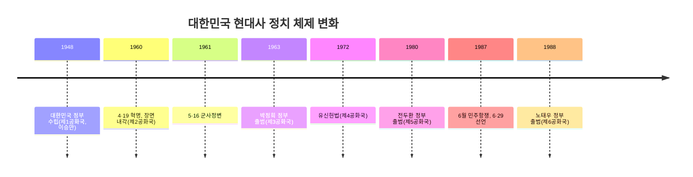

<Callout type="info">
  **이번 문서의 목표:** 이 파일을 다 읽으면 1945년 광복부터 1990년대 이후까지 대한민국 현대사를 정치 체제 변화(공화국 구분) · 경제 개발 단계 · 남북 관계 전개라는 세 축으로 나누어 설명하고, 각 시기의 대표 사건을 연도와 함께 정확히 짝지을 수 있게 된다.
</Callout>

## 왜 이 편이 필요한가

해방 이후 현대사는 독학사 4단계에서 가장 최근 시기이면서도, 정치 체제가 여러 번 바뀌고(제1공화국~제6공화국) 남북 관계와 경제 상황이 얽혀 있어 학습자가 사건의 **선후 관계**를 헷갈리기 쉬운 영역입니다. "5·16 군사정변이 먼저인가 4·19 혁명이 먼저인가", "유신헌법과 3선 개헌 중 무엇이 나중인가" 같은 순서형 문제, "이 사건이 어느 정부 시기에 일어났는가"를 묻는 시기 판별형 문제가 반복해서 출제됩니다.

> **쉽게 말하면:** 이 편은 "누가 언제 정권을 잡았고, 그 정부가 무엇을 했는가"를 시간 순서대로 하나의 줄로 꿰는 편입니다.

## 1. 미군정과 대한민국 정부 수립 (1945~1948)

1945년 8월 15일 일본이 항복하면서 한반도는 광복을 맞았지만, 곧바로 자주적인 정부를 세우지는 못했습니다. 38도선을 경계로 이북에는 소련군이, 이남에는 미군이 진주해 각각 군정을 실시했습니다. 남한에서는 미군이 통치 기구인 **미군정**(United States Army Military Government in Korea, 재조선 미육군사령부 군정청)을 세워 1945년 9월부터 직접 행정을 담당했습니다.

1945년 12월, 미국·영국·소련 3국 외상이 모여 연 **모스크바 3국 외상회의**에서 한반도에 임시 민주 정부를 수립하고 최고 5년간 신탁통치를 실시한다는 방안이 발표되었습니다. 이 소식이 국내에 전해지자 신탁통치에 반대하는 **반탁 운동**과, 신탁통치를 임시 정부 수립을 위한 과도적 조치로 받아들이자는 **찬탁(모스크바 협정 지지) 노선**이 좌우로 갈려 격렬하게 대립했습니다.

이후 미소공동위원회가 두 차례 열렸으나 임시 정부 참여 단체 범위를 두고 미국과 소련이 합의하지 못해 결렬되었고, 좌우 대립을 넘어서기 위해 여운형·김규식 등이 중심이 된 **좌우합작위원회**가 1946년 좌우합작 7원칙을 발표했지만 좌우 강경파의 반대로 큰 성과를 내지 못했습니다. 이승만은 1946년 6월 정읍에서 남한만이라도 단독 정부를 수립하자는 이른바 **정읍 발언**을 하여, 통일 정부 수립론과 단독 정부 수립론이 뚜렷이 갈라지는 계기가 되었습니다.

문제가 유엔으로 넘어가면서 1947년 **유엔 한국임시위원단**이 구성되어 남북 총선거를 통한 정부 수립을 추진했으나, 소련과 북측이 위원단의 이북 지역 활동을 거부하면서 유엔 소총회는 선거가 가능한 지역, 즉 남한만의 단독 선거를 결의했습니다. 이에 반발해 김구·김규식 등은 통일 정부 수립을 위한 **남북협상**(1948년)을 시도했지만 실질적인 성과로 이어지지는 못했습니다.

결국 1948년 5월 10일 남한 단독으로 총선거(**5·10 총선거**)가 실시되어 제헌 국회가 구성되었고, 제헌 국회는 헌법을 제정한 뒤 이승만을 초대 대통령으로 선출했습니다. 1948년 8월 15일 **대한민국 정부**가 수립되었고, 곧이어 9월 9일 이북에서는 **조선민주주의인민공화국**이 수립되어 한반도는 두 개의 정부로 분단되었습니다.

이 과정에서 단독 정부 수립에 반대하거나 그 여파로 발생한 대표적 사건이 **제주 4·3 사건**(1948년, 단독 선거 반대와 그 진압 과정에서 다수의 민간인이 희생된 사건)과 **여수·순천 사건**(1948년 10월, 제주 4·3 진압 출동 명령을 거부한 군부대의 봉기와 그 진압 과정에서 발생한 사건)입니다. 두 사건 모두 정부 수립 직후의 혼란과 이념 대립이 극심한 인명 피해로 이어진 사례로 함께 출제되는 경우가 많습니다.

<Callout type="warning">
  **자주 틀리는 점:** 대한민국 정부 수립(1948.8.15)과 조선민주주의인민공화국 수립(1948.9.9)의 선후를 뒤바꾸는 실수, 그리고 광복(1945.8.15)과 정부 수립(1948.8.15)을 같은 날로 착각하는 실수가 잦습니다. 광복과 정부 수립 사이에는 미군정기(약 3년)가 있었다는 점을 분명히 기억해야 합니다.
</Callout>

정부 수립 직후 제헌 국회는 일제에 협력한 인물을 처벌하기 위해 1948년 9월 **반민족행위처벌법**을 제정하고 반민족행위특별조사위원회(반민특위)를 구성했습니다. 그러나 이승만 정부의 소극적 태도와 정치적 압력 속에 반민특위는 1949년 사실상 해체되어, 친일 청산이 미완의 과제로 남았다는 평가를 받습니다.

## 2. 한국전쟁과 분단 구조의 고착 (1950~1953)

1950년 6월 25일 북한군이 38도선 전역에서 남침하면서 **한국전쟁**(6·25 전쟁)이 시작되었습니다. 전쟁 초기 북한군은 빠르게 남하해 낙동강 방어선까지 밀어붙였으나, 1950년 9월 15일 유엔군 사령관 맥아더가 지휘한 **인천상륙작전**의 성공으로 전세가 역전되어 국군과 유엔군은 압록강 인근까지 진격했습니다. 그러나 1950년 10월 중국이 인민지원군(중공군)을 파병해 개입하면서 전선이 다시 남쪽으로 밀렸고, 이후 38도선 부근에서 공방을 거듭하는 교착 상태가 이어졌습니다.

전쟁은 1953년 7월 27일 유엔군·북한군·중국군 대표가 서명한 **정전협정**(휴전협정)으로 일단 멈추었으며, 이때 그어진 군사분계선(휴전선)이 오늘날까지 남북을 가르는 경계로 남아 있습니다. 정전협정은 종전(전쟁의 완전한 종료)이 아니라 전투 행위를 멈춘 정전 상태라는 점, 그리고 대한민국은 정전협정의 서명 당사자가 아니라는 점이 자주 출제되는 함정 포인트입니다.

| 구분 | 내용 | 연도 |
|------|------|------|
| 전쟁 발발 | 북한군의 전면 남침 | 1950.6.25 |
| 전세 역전 | 인천상륙작전 성공 | 1950.9.15 |
| 전세 재역전 | 중공군 개입 | 1950.10 |
| 전쟁 정지 | 정전협정 체결(판문점) | 1953.7.27 |

한국전쟁은 남북 모두에 막대한 인명·재산 피해를 남겼고, 이후 분단 체제를 굳히는 결정적 계기가 되었습니다. 전쟁을 거치며 남한에서는 반공 체제가 강화되었고, 이는 이후 이승만 정부의 장기 집권 명분으로도 활용되었습니다.

## 3. 이승만 정부와 권위주의화, 4·19 혁명 (1948~1960)

이승만 정부(제1공화국)는 정부 수립 초기의 혼란과 전쟁을 거치며 점차 권위주의적 성격을 강화했습니다. 대표적 사례가 1952년 **발췌 개헌**(대통령 직선제 개헌, 전쟁 중 임시 수도 부산에서 강압적으로 통과)과 1954년 **사사오입 개헌**(초대 대통령에 한해 중임 제한을 철폐해 이승만의 3선을 가능하게 한 개헌으로, 의결 정족수 미달을 사사오입 산식으로 억지로 채워 통과시켰다는 논란이 있는 개헌)입니다.

1960년 3월 15일 정·부통령 선거에서 이승만 정부와 자유당은 각종 부정 선거를 자행했고(3·15 부정선거), 이에 대한 항의 시위가 전국으로 확산되어 1960년 4월 19일 대규모 시위(**4·19 혁명**)로 이어졌습니다. 그 결과 이승만은 대통령직에서 하야했고, 이후 내각책임제 개헌을 거쳐 장면을 국무총리로 하는 **제2공화국**(장면 내각)이 출범했습니다.

<Callout type="warning">
  **자주 틀리는 점:** 4·19 혁명(1960)과 5·16 군사정변(1961)의 순서를 혼동하는 경우가 매우 많습니다. 4·19 혁명으로 이승만 정부가 무너지고 장면 내각(제2공화국)이 들어선 뒤, 그 정부가 1년을 채우지 못하고 5·16 군사정변으로 무너졌다는 순서를 정확히 기억해야 합니다.
</Callout>

## 4. 박정희 정부와 경제 개발, 유신 체제 (1961~1979)

1961년 5월 16일 박정희를 중심으로 한 일부 군인들이 정변(**5·16 군사정변**)을 일으켜 장면 내각을 무너뜨리고 군사정부를 수립했습니다. 이후 1963년 대통령 선거를 거쳐 박정희가 대통령에 취임하면서 **제3공화국**이 출범했습니다.

박정희 정부는 경제 성장을 국정 최우선 과제로 삼아 1962년부터 **경제개발 5개년 계획**을 순차적으로 추진했습니다. 정부 주도로 수출 산업을 육성하는 방식이었으며, 초기에는 섬유·가발 등 경공업 중심 수출을 늘리다가 1970년대에는 중화학공업 육성으로 정책 방향을 전환했습니다. 1965년에는 일본과 국교를 정상화하는 **한일기본조약**을 체결해 청구권 자금을 경제 개발 재원으로 활용했고, 같은 시기 베트남 파병을 통해 외화 획득과 미국과의 관계 강화를 도모했습니다.

정치적으로는 1969년 대통령의 3선을 허용하는 **3선 개헌**을 강행했고, 1972년에는 대통령 간선제와 무제한 연임을 골자로 한 **유신헌법**을 제정해 **유신 체제**(제4공화국)를 출범시켰습니다. 유신 체제는 대통령에게 국회 해산권·긴급조치권 등 강력한 권한을 부여해, 견제받지 않는 권위주의 체제라는 평가를 받습니다. 한편 1972년 7월 4일에는 남북이 자주·평화·민족대단결이라는 통일 3대 원칙에 합의한 **7·4 남북공동성명**이 발표되기도 했으나, 실제 남북 관계의 획기적 개선으로 이어지지는 못했습니다.

유신 체제에 대한 반발이 커지는 가운데 1979년 10월 26일 박정희 대통령이 중앙정보부장에 의해 살해되는 사건(10·26 사태)이 일어나 유신 체제는 막을 내렸습니다.

## 5. 신군부와 5·18 민주화운동, 6월 민주항쟁 (1979~1988)

10·26 사태 이후 정치적 공백을 틈타 전두환을 중심으로 한 신군부 세력이 1979년 12월 12일 군사반란(**12·12 사태**)을 일으켜 군권을 장악했습니다. 이에 저항해 1980년 5월 광주에서 대규모 민주화 시위(**5·18 민주화운동**)가 일어났으나 신군부에 의해 무력으로 진압되었습니다. 이후 전두환이 대통령에 취임하며 **제5공화국**이 출범했습니다.

제5공화국의 권위주의 통치에 맞서 대통령 직선제 개헌을 요구하는 민주화 운동이 계속되었고, 1987년 6월 전국적인 대규모 시위(**6월 민주항쟁**)가 일어났습니다. 그 결과 여당 대표 노태우가 대통령 직선제 개헌을 수용하겠다는 **6·29 선언**을 발표했고, 이를 바탕으로 5년 단임 대통령 직선제를 골자로 한 **제9차 개헌**(현행 헌법)이 이루어졌습니다. 이 개헌으로 출범한 노태우 정부부터를 흔히 **제6공화국**이라 부르며, 현재 대한민국의 헌정 체제도 이 틀 위에 있습니다.

## 6. 민주화 이후의 정부와 경제, 남북 관계 (1988년 이후)

1988년 출범한 노태우 정부 시기에는 서울 올림픽 개최(1988), 북방외교(소련·중국 등 사회주의권 국가와의 수교), 그리고 1991년 남북한이 유엔에 동시 가입하고 같은 해 남북 사이의 화해와 불가침, 교류·협력에 관한 **남북기본합의서**를 채택하는 등 남북 관계에도 변화가 있었습니다.

1993년 김영삼 정부(문민정부)는 군 출신이 아닌 민간인 대통령이 이끄는 정부라는 점에서 의의가 있었으나, 임기 말인 1997년 외환 보유고 부족으로 국제통화기금(IMF)에 구제금융을 요청하는 **외환위기**를 맞았습니다. 이어 출범한 1998년 김대중 정부(국민의 정부)는 외환위기 극복을 위한 구조조정을 추진하는 한편, 대북 화해 협력 정책(이른바 햇볕정책)을 펼쳐 2000년 분단 이후 최초의 남북 정상회담을 성사시키고 **6·15 남북공동선언**을 발표했습니다. 이후 2003년 출범한 노무현 정부 시기인 2007년에는 두 번째 남북 정상회담이 열려 **10·4 남북정상선언**이 채택되었습니다.

| 정부(공화국) | 주요 대통령 | 대표 사건 | 연도 |
|---|---|---|---|
| 제1공화국 | 이승만 | 정부 수립, 사사오입 개헌, 4·19 혁명 | 1948, 1954, 1960 |
| 제2공화국 | 장면(내각) | 내각책임제 출범, 5·16로 붕괴 | 1960–1961 |
| 제3–4공화국 | 박정희 | 경제개발 5개년 계획, 유신헌법 | 1962, 1972 |
| 제5공화국 | 전두환 | 5·18 민주화운동, 6월 민주항쟁으로 종료 | 1980, 1987 |
| 제6공화국 | 노태우 이후 | 직선제 개헌, 남북기본합의서, 이후 정부들의 남북 정상회담 | 1987, 1991, 2000, 2007 |

<Callout type="warning">
  **자주 틀리는 점:** 6·15 남북공동선언(2000, 김대중 정부)과 10·4 남북정상선언(2007, 노무현 정부)의 연도와 정부를 뒤바꿔 출제하는 함정이 잦습니다. "첫 번째 남북 정상회담"이라는 표현이 나오면 김대중 정부·2000년임을 바로 떠올려야 합니다.
</Callout>

## 핵심 정리

- 광복(1945)과 정부 수립(1948) 사이에는 약 3년간의 미군정기가 있었고, 신탁통치 논쟁과 좌우 대립을 거쳐 남북에 각각 별도 정부가 수립되며 분단이 시작되었다.
- 한국전쟁(1950~1953)은 정전협정으로 전투가 멈춘 상태이며, 이때 그어진 군사분계선이 현재의 분단선으로 이어진다.
- 4·19 혁명(1960) → 5·16 군사정변(1961) → 유신 체제(1972) → 10·26 사태(1979) → 12·12 사태·5·18 민주화운동(1980) → 6월 민주항쟁·6·29 선언(1987)의 순서를 헷갈리지 않아야 한다.
- 박정희 정부의 경제개발 5개년 계획으로 산업화가 본격화되었고, 1987년 개헌 이후 대통령 직선제 헌정 체제(제6공화국)가 이어지고 있다.
- 남북 관계는 7·4 남북공동성명(1972) → 남북기본합의서(1991) → 6·15 남북공동선언(2000, 김대중) → 10·4 남북정상선언(2007, 노무현) 순으로 전개되었다.

## 마무리 복습

<Quiz
  questionNumber={1}
  question="광복 이후 대한민국 정부 수립 과정에 대한 설명으로 옳지 않은 것은?"
  options={['모스크바 3국 외상회의에서 신탁통치 방안이 논의되었다', '유엔 한국임시위원단의 활동이 이북 지역에서 거부되자 유엔 소총회가 선거 가능 지역의 단독 선거를 결의했다', '5·10 총선거로 구성된 제헌 국회가 헌법을 제정하고 대통령을 선출했다', '대한민국 정부 수립보다 먼저 조선민주주의인민공화국이 수립되었다']}
  correctAnswer={4}
  explanation="대한민국 정부는 1948년 8월 15일에, 조선민주주의인민공화국은 그보다 뒤인 1948년 9월 9일에 수립되었으므로 순서가 반대로 서술된 설명이 옳지 않다."
  optionExplanations={['모스크바 3국 외상회의(1945.12)에서 신탁통치 방안이 논의된 것은 사실이다', '유엔 소총회가 선거 가능 지역만의 단독 선거를 결의한 과정은 사실대로 서술되었다', '5·10 총선거(1948.5.10)로 구성된 제헌 국회가 헌법 제정과 대통령 선출을 한 것은 사실이다', '정답 — 대한민국 정부 수립(1948.8.15)이 조선민주주의인민공화국 수립(1948.9.9)보다 먼저였다']}
/>

<Quiz
  questionNumber={2}
  question="한국전쟁의 전개 순서를 옳게 나열한 것은?"
  options={['중공군 개입 → 인천상륙작전 → 정전협정 → 북한군 남침', '북한군 남침 → 인천상륙작전 → 중공군 개입 → 정전협정', '인천상륙작전 → 북한군 남침 → 정전협정 → 중공군 개입', '북한군 남침 → 중공군 개입 → 인천상륙작전 → 정전협정']}
  correctAnswer={2}
  explanation="한국전쟁은 1950년 6월 북한군의 남침으로 시작되어, 9월 인천상륙작전으로 전세가 역전되었고, 10월 중공군이 개입해 다시 전선이 남하했으며, 1953년 7월 정전협정으로 전투가 멈추었다."
  optionExplanations={['중공군 개입이 가장 먼저라는 순서는 실제 전개와 반대다', '정답 — 남침, 인천상륙작전, 중공군 개입, 정전협정 순서가 실제 전개와 일치한다', '인천상륙작전이 남침보다 먼저라는 순서는 반대로 서술된 것이다', '중공군 개입이 인천상륙작전보다 먼저였다는 서술은 실제 순서와 반대다']}
/>

<Quiz
  questionNumber={3}
  question="정전협정(1953)에 대한 설명으로 옳은 것은?"
  options={['전쟁의 완전한 종료를 선언하는 종전 협정이다', '대한민국이 서명 당사자로 참여했다', '전투 행위를 멈춘 정전 상태를 규정하며 군사분계선이 설정되었다', '이 협정으로 남북이 유엔에 동시 가입했다']}
  correctAnswer={3}
  explanation="정전협정은 전쟁을 완전히 끝내는 종전 협정이 아니라 전투를 멈추는 정전(휴전) 상태를 규정한 협정이며, 이때 설정된 군사분계선이 현재의 분단선으로 이어진다."
  optionExplanations={['정전협정은 종전이 아니라 정전 상태를 규정한 협정이다', '정전협정은 유엔군·북한군·중국군이 서명했고 대한민국은 서명 당사자가 아니었다', '정답 — 정전협정은 전투를 멈추고 군사분계선을 설정한 협정이다', '남북한의 유엔 동시 가입은 1991년의 별개 사건이다']}
/>

<Quiz
  questionNumber={4}
  question="다음 사건을 시간 순서대로 옳게 나열한 것은? (가) 5·16 군사정변 (나) 4·19 혁명 (다) 유신헌법 제정 (라) 6월 민주항쟁"
  options={['(가)-(나)-(다)-(라)', '(나)-(가)-(다)-(라)', '(나)-(다)-(가)-(라)', '(다)-(나)-(가)-(라)']}
  correctAnswer={2}
  explanation="4·19 혁명(1960) 이후 장면 내각이 들어섰으나 5·16 군사정변(1961)으로 무너졌고, 이후 박정희 정부가 유신헌법(1972)을 제정했으며, 그 체제가 6월 민주항쟁(1987)으로 종식되었다."
  optionExplanations={['5·16이 4·19보다 먼저라는 순서는 실제와 반대다', '정답 — 4·19 혁명, 5·16 군사정변, 유신헌법 제정, 6월 민주항쟁 순서가 옳다', '유신헌법 제정이 5·16 군사정변보다 먼저라는 순서는 반대로 서술된 것이다', '유신헌법 제정이 가장 먼저라는 순서는 실제 전개와 맞지 않는다']}
/>

<Quiz
  questionNumber={5}
  question="박정희 정부 시기의 경제·외교 정책에 대한 설명으로 옳지 않은 것은?"
  options={['1962년부터 정부 주도의 경제개발 5개년 계획을 추진했다', '1965년 한일기본조약을 체결해 국교를 정상화했다', '집권 초기부터 중화학공업을 최우선으로 육성하고 경공업 수출은 다루지 않았다', '베트남 파병을 통해 외화 획득과 대미 관계 강화를 도모했다']}
  correctAnswer={3}
  explanation="박정희 정부는 초기에 섬유·가발 등 경공업 중심 수출 산업을 육성하다가 1970년대에 들어서 중화학공업 육성으로 정책 방향을 전환했으므로, 집권 초기부터 중화학공업만 다루었다는 설명은 옳지 않다."
  optionExplanations={['1962년부터 경제개발 5개년 계획을 추진한 것은 사실이다', '1965년 한일기본조약 체결은 사실이다', '정답 — 초기에는 경공업 수출 중심이었고 중화학공업 육성은 1970년대의 정책 전환이었다', '베트남 파병이 외화 획득·대미 관계 강화와 관련된 것은 사실이다']}
/>

<Quiz
  questionNumber={6}
  question="12·12 사태와 5·18 민주화운동, 6월 민주항쟁의 관계로 옳은 것은?"
  options={['6월 민주항쟁 진압에 반발해 12·12 사태가 일어났다', '신군부의 12·12 사태 이후 이에 저항한 5·18 민주화운동이 무력 진압되었고, 이후 권위주의 통치에 대한 저항이 이어져 6월 민주항쟁으로 직선제 개헌을 이끌어냈다', '5·18 민주화운동의 결과로 곧바로 대통령 직선제 개헌이 이루어졌다', '세 사건은 모두 박정희 정부 시기에 일어났다']}
  correctAnswer={2}
  explanation="신군부가 12·12 사태(1979)로 군권을 장악한 뒤 이에 저항한 5·18 민주화운동(1980)을 무력 진압했고, 이후 권위주의 체제에 대한 저항이 누적되어 1987년 6월 민주항쟁으로 이어져 직선제 개헌(6·29 선언, 제9차 개헌)을 이끌어냈다."
  optionExplanations={['12·12 사태가 6월 민주항쟁보다 먼저 일어난 사건이므로 인과관계가 반대로 서술되었다', '정답 — 12·12 사태, 5·18 민주화운동, 6월 민주항쟁이 이어지는 인과 관계를 옳게 설명했다', '5·18 민주화운동 직후 곧바로 직선제 개헌이 이루어진 것이 아니라 1987년에 이르러서야 이루어졌다', '세 사건은 박정희 사후인 1979~1987년 사이, 즉 신군부·전두환 정부 시기에 일어났다']}
/>

<Quiz
  questionNumber={7}
  question="다음 중 김대중 정부 시기에 있었던 사건으로 옳은 것은?"
  options={['남북기본합의서 채택', '분단 이후 최초의 남북 정상회담과 6·15 남북공동선언', '10·4 남북정상선언', '남북한 유엔 동시 가입']}
  correctAnswer={2}
  explanation="2000년 김대중 정부 시기에 분단 이후 최초의 남북 정상회담이 열려 6·15 남북공동선언이 발표되었다."
  optionExplanations={['남북기본합의서는 1991년 노태우 정부 시기에 채택되었다', '정답 — 6·15 남북공동선언(2000)은 김대중 정부 시기의 일이다', '10·4 남북정상선언은 2007년 노무현 정부 시기의 일이다', '남북한 유엔 동시 가입은 1991년 노태우 정부 시기의 일이다']}
/>

## 참고 자료

- [국사편찬위원회 한국사데이터베이스](https://db.history.go.kr)
- [우리역사넷](https://contents.history.go.kr)
