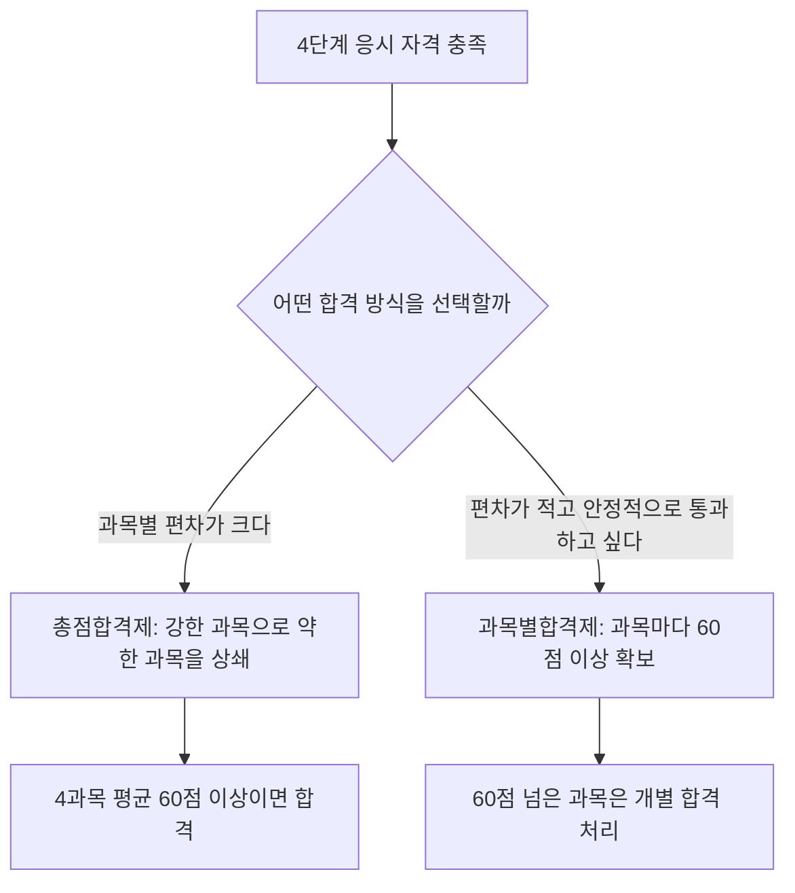

<Callout type="info">
  **이번 문서의 목표:** 독학사 국어국문학 전공 4단계 시험이 어떤 과목으로 구성되고 어떤 방식으로 채점되는지 정확히 파악하고, 이후 편들을 어떤 순서·비중으로 공부해야 효율적인지 스스로 계획할 수 있게 한다.
</Callout>

## 독학사 제도와 4단계의 위치

독학사(독학에 의한 학위취득시험)는 대학에 다니지 않고도 스스로 공부해 학사 학위를 딸 수 있게 국가평생교육진흥원이 운영하는 국가시험이다. 국어국문학 전공은 총 4단계로 나뉘며, 1단계(교양)·2단계(전공기초)·3단계(전공심화)를 차례로 통과한 뒤 마지막 4단계인 **학위취득 종합시험**에 응시한다. 4단계는 이름 그대로 "종합" 시험이다. 앞선 세 단계가 개별 과목별 이해를 확인했다면, 4단계는 국어국문학이라는 학문 전체를 아우르는 몇 개의 큰 과목으로 재편성해 전공 지식이 실제로 통합되었는지를 묻는다.

> **쉽게 말하면:** 1~3단계가 국어학·문학의 부품을 하나씩 확인하는 시험이라면, 4단계는 그 부품들을 조립해 "국어국문학 전공자"로서 종합적으로 사고할 수 있는지를 확인하는 마지막 관문이다.

4단계에 응시하려면 1~3단계를 모두 합격했거나, 학점은행제 학점 인정, 학사학위 소지 등 국가평생교육진흥원이 정한 별도의 응시 자격 요건을 충족해야 한다. 이 요건은 매년 공고가 갱신되므로 정확한 자격 조건은 반드시 **해당 회차 공고 확인이 필요**하다.

## 4단계 시험 과목 구성

독학사 국어국문학 전공 4단계는 보통 다음 네 과목으로 구성된다. 과목명 자체가 그 과목이 무엇을 통합해서 보는지 알려준다.

| 과목명 | 통합해서 보는 영역 | 이 시리즈에서 주로 대응하는 편 |
|---|---|---|
| 국어학개론 | 음운론·형태론·통사론·의미론·화용론·국어 규범·국어사 전반의 통합 | 02, 07–11, 24 |
| 국문학개론 | 문학 일반 이론, 갈래론, 문학비평 이론의 통합 | 03, 05, 21–22 |
| 한국문학사 | 상고시대부터 현대까지 한국 문학의 시대별 흐름과 대표 작가·작품 | 04, 12–20, 25–26 |
| 문학비평론 | 문학 작품을 분석·평가하는 이론적 틀과 한국 문학비평사 | 05, 21–22 |

네 과목 이름을 보면 "국어학개론"은 언어학적 측면(소리·단어·문장·의미의 규칙)을, 나머지 세 과목은 문학적 측면(작품·역사·이론)을 다룬다는 큰 구도가 보인다. 이 구도가 이 시리즈의 전체 설계 축이기도 하다 — 선행 편(01~05)에서 두 축의 지도를 먼저 그리고, 본론(06~22)에서 국어학 축(07~11)과 문학 축(12~22)을 차례로 심화한 뒤, 기출·모의 편(23~27)에서 다시 통합해 연습한다.

**개론**이라는 이름 때문에 "쉬운 입문 수준"이라고 오해하기 쉽지만, 4단계의 개론은 1~2단계의 개론과는 다르다. 여기서 "개론"은 "국어학 전체를 한 과목 안에 압축해 통합적으로 다룬다"는 뜻이지 난이도가 낮다는 뜻이 아니다. 음운론부터 화용론까지 다섯 하위 영역이 한 시험지 안에서 동시에 출제되므로, 오히려 영역 간 경계를 정확히 아는 능력이 더 중요해진다.

## 문항 유형과 배점 구조

독학사 학위취득 종합시험은 일반적으로 **객관식(사지선다형)과 주관식(단답형·서술형)을 함께 출제**하는 구조를 취한다. 정확한 문항 수와 배점 비율은 과목·회차 공고에 따라 달라지지만, 큰 틀에서 다음과 같은 형식을 전제로 학습 계획을 세우는 것이 안전하다.

| 문항 유형 | 특징 | 대비 방법 |
|---|---|---|
| 객관식(사지선다) | 개념의 정확한 이해와 오개념 구분을 묻는다. "옳지 않은 것 고르기" 유형이 잦다 | 정의뿐 아니라 개념 간 경계를 정확히 익힌다 |
| 단답형 서술 | 짧은 문장(보통 80자 내외)으로 핵심 용어·개념을 정리해 쓴다 | 정의를 자기 문장으로 요약하는 연습을 한다 |
| 서술형(논술형) | 긴 문장(보통 120자 이상)으로 개념 비교, 작품 분석, 이론 적용을 서술한다 | 근거를 들어 논리적으로 전개하는 답안 구조를 미리 익힌다 |

서술형 답안 분량 기준(예: 80자·120자)과 배점 비율은 회차마다 조정될 수 있으므로 이 역시 **공고 확인이 필요**하다. 다만 형식과 무관하게 공통되는 원칙은 하나다 — 정답을 "찍어서" 맞히는 것이 아니라 **개념의 경계와 근거를 설명할 수 있어야** 점수를 받는다는 점이다. 이 원칙 때문에 이 시리즈의 모든 편은 정의만 나열하지 않고 "왜 그런지", "무엇과 헷갈리는지"까지 함께 다룬다.

### 합격 기준: 총점합격제와 과목별합격제

독학사 학위취득 종합시험은 응시자가 두 가지 합격 방식 중 하나를 선택할 수 있다.

- **총점합격제**: 응시한 모든 과목의 점수를 합산해 평균 60점 이상이면 합격으로 인정하는 방식. 과목별 최저 점수 기준 없이 전체 평균으로 판단한다.
- **과목별합격제**: 과목마다 60점 이상을 받아야 그 과목이 합격 처리되는 방식. 이번 회차에 일부 과목만 60점을 넘겨도 그 과목은 이후 재응시 없이 합격으로 인정받고, 나머지 과목만 다시 준비하면 된다.

두 방식 중 어느 쪽이 유리한지는 응시자의 과목별 강약점에 따라 다르다. 예를 들어 국어학개론에 자신 있고 문학비평론이 약하다면, 국어학개론에서 고득점을 확보해 문학비평론의 부족한 점수를 상쇄하는 총점합격제가 유리할 수 있다. 반대로 과목별 편차가 크지 않다면 과목별합격제로 한 과목씩 확실히 통과시키는 전략이 안전하다. **정확한 제도 운영 방식과 선택 절차는 응시 회차 공고를 통해 다시 확인해야 한다.**

## 학습·시간 관리 전략

4단계는 네 과목이 사실상 국어국문학 전체 범위를 재편한 것이므로, 무작정 순서대로 읽기보다 **지도를 먼저 그리고 심화로 들어가는 전략**이 효율적이다. 이 시리즈의 구성 자체가 그 전략을 반영한다.

<Steps>

### 1단계 — 지도 그리기 (01~05편)

시험 구조, 국어학 하위 영역, 문학 일반 이론·갈래, 문학사 시대 구분, 문학비평 이론을 개론 수준으로 먼저 훑는다. 이 단계의 목적은 암기가 아니라 "이후 어떤 내용이 어디에 속하는지"를 아는 것이다.

### 2단계 — 영역별 심화 (06~22편)

출제기준을 확인한 뒤(06편), 국어학 심화(07~11편) → 고전문학(12~15편) → 현대문학(16~20편) → 문학비평(21~22편) 순으로 깊게 들어간다. 한 영역을 끝내지 않고 다음 영역으로 넘어가면 개념이 섞이기 쉬우므로, 영역 단위로 완결하는 것이 좋다.

### 3단계 — 통합 연습 (23~27편)

영역별 기출·예상 문제(24~26편)로 각 과목의 감각을 개별적으로 다진 뒤, 혼합 유형 모의세트(23편)와 최종 모의고사(27편)로 네 과목을 뒤섞어 실전처럼 연습한다. 이 단계에서 시간 배분과 합격 방식(총점합격제·과목별합격제) 전략도 함께 점검한다.

</Steps>

### 국어학과 문학, 두 축을 나누어 계획하기

4단계 학습에서 흔히 겪는 실패는 국어학과 문학을 뒤섞어 하루씩 번갈아 공부하다가 둘 다 어중간하게 남는 경우다. 국어학(음운·형태·통사·의미·화용)은 규칙 기반 학문이라 개념 간 위계와 경계를 정확히 아는 것이 핵심이고, 문학(고전·현대·비평)은 시대·작가·작품·이론의 그물을 촘촘히 엮는 것이 핵심이다. 두 축은 요구하는 학습 방식 자체가 다르므로, **일정 기간은 국어학에, 일정 기간은 문학에 집중**하는 블록 방식이 두 영역 모두를 깊게 다지는 데 더 유리하다.

## 자주 틀리는 점

- 4단계를 "1~3단계보다 쉬운 마무리 시험"으로 오해하는 경우가 있다. 4단계는 오히려 통합적 사고를 요구하는 종합시험이라 난이도가 낮다고 단정할 수 없다.
- 총점합격제와 과목별합격제를 "둘 다 자동으로 적용된다"고 착각하기 쉽다. 실제로는 응시자가 선택하는 제도이며, 선택 방식과 절차는 공고를 확인해야 한다.
- "개론"이라는 과목명만 보고 세부 암기를 소홀히 하는 경우가 있다. 4단계 개론 과목은 여러 하위 영역을 통합한 시험이라 오히려 영역 간 경계를 정확히 아는 것이 더 중요하다.
- 서술형 문항의 정확한 분량·배점 기준을 예전 공고 그대로 암기해 두는 경우가 있다. 회차마다 달라질 수 있으므로 매번 최신 공고로 갱신해야 한다.

## 핵심 정리

- 독학사 국어국문학 4단계는 국어학개론·국문학개론·한국문학사·문학비평론 네 과목으로 구성된 학위취득 종합시험이다.
- 시험은 객관식과 주관식(단답형·서술형)을 함께 출제하며, 정확한 문항 수·배점·분량 기준은 회차 공고 확인이 필요하다.
- 합격 방식은 총점합격제(전체 평균 60점 이상)와 과목별합격제(과목마다 60점 이상) 중 선택할 수 있다.
- 효율적인 학습 순서는 지도 그리기(01~05편) → 영역별 심화(06~22편) → 통합 연습(23~27편)이며, 국어학과 문학은 별도 블록으로 나눠 학습하는 것이 유리하다.

## 마무리 복습

<Quiz
  questionNumber={1}
  question="독학사 국어국문학 전공 4단계 학위취득 종합시험의 성격으로 가장 적절한 것은?"
  options={['1단계 교양 과목만 재확인하는 시험이다', '국어학·문학의 개별 영역을 통합해 전공 전체를 종합적으로 평가하는 시험이다', '창작 실습 능력만을 평가하는 시험이다', '외국 문학 이론 원전 강독을 평가하는 시험이다']}
  correctAnswer={2}
  explanation="4단계는 1~3단계에서 개별적으로 확인한 국어학·문학 지식을 국어학개론·국문학개론·한국문학사·문학비평론이라는 통합 과목으로 재편해 종합적으로 평가하는 학위취득 종합시험이다."
  optionExplanations={['1단계 교양 재확인이 아니라 전공 전체를 통합하는 종합시험이다', '정답이다', '창작 실습은 이 시험의 평가 범위에 포함되지 않는다', '외국 문학 이론 원전 강독은 4단계의 통상적 평가 범위가 아니다']}
/>

<Quiz
  questionNumber={2}
  question="독학사 국어국문학 4단계의 일반적인 시험 과목 구성으로 옳은 것은?"
  options={['음운론, 형태론, 통사론, 의미론', '국어학개론, 국문학개론, 한국문학사, 문학비평론', '현대문학, 고전문학, 한문학, 구비문학', '화법, 작문, 독서, 문법']}
  correctAnswer={2}
  explanation="4단계는 국어학개론, 국문학개론, 한국문학사, 문학비평론 네 과목으로 구성되는 것이 일반적이다."
  optionExplanations={['이는 국어학의 하위 영역 이름이지 4단계 과목명이 아니다', '정답이다', '이는 문학의 세부 갈래 구분이지 4단계의 공식 과목명이 아니다', '이는 국어 교과의 언어 기능 영역 구분이지 4단계 과목명이 아니다']}
/>

<Quiz
  questionNumber={3}
  question="독학사 학위취득 종합시험의 문항 유형에 대한 설명으로 옳지 않은 것은?"
  options={['객관식 사지선다형 문항이 출제된다', '단답형·서술형 등 주관식 문항도 함께 출제될 수 있다', '서술형 문항의 정확한 글자 수 기준과 배점 비율은 회차마다 달라질 수 있어 공고 확인이 필요하다', '모든 회차, 모든 과목에서 문항 수와 배점 비율이 완전히 동일하게 고정되어 있다']}
  correctAnswer={4}
  explanation="문항 수와 배점 비율은 과목과 회차 공고에 따라 달라질 수 있으므로 고정되어 있다고 단정할 수 없다."
  optionExplanations={['옳은 설명이므로 정답이 아니다', '옳은 설명이므로 정답이 아니다', '옳은 설명이므로 정답이 아니다', '문항 수·배점은 회차마다 달라질 수 있어 옳지 않은 설명이며 이것이 정답이다']}
/>

<Quiz
  questionNumber={4}
  question="총점합격제와 과목별합격제에 대한 설명으로 가장 적절한 것은?"
  options={['총점합격제는 과목마다 60점 이상을 받아야 하는 방식이다', '과목별합격제는 전체 과목 평균 점수만으로 합격을 판단하는 방식이다', '총점합격제는 응시 과목 전체 점수의 평균이 60점 이상이면 합격으로 인정하는 방식이다', '두 방식은 응시자가 선택할 수 없고 항상 총점합격제만 적용된다']}
  correctAnswer={3}
  explanation="총점합격제는 응시한 모든 과목 점수를 합산한 평균이 60점 이상이면 합격으로 인정하는 방식이며, 과목별합격제는 과목마다 60점 이상을 받아야 그 과목이 개별적으로 합격 처리되는 방식이다."
  optionExplanations={['이는 과목별합격제에 대한 설명이다', '이는 총점합격제에 대한 설명이며 과목별합격제와는 반대다', '정답이다', '두 방식은 응시자가 선택 가능한 제도이며 세부 절차는 공고 확인이 필요하다']}
/>

<Quiz
  questionNumber={5}
  question="이 시리즈에서 제시하는 4단계 학습 순서로 가장 적절한 것은?"
  options={['기출 문제만 반복해서 풀고 개념 학습은 생략한다', '전체 지도(01~05편)를 먼저 그린 뒤 영역별 심화(06~22편)를 거쳐 통합 연습(23~27편)으로 마무리한다', '문학비평 이론만 집중적으로 공부하고 나머지는 생략한다', '국어학과 문학을 매일 번갈아 조금씩만 공부한다']}
  correctAnswer={2}
  explanation="지도 그리기(01~05편) → 영역별 심화(06~22편) → 통합 연습(23~27편) 순서로 학습하면 개념이 섞이지 않고 효율적으로 범위를 완성할 수 있다."
  optionExplanations={['기출만 반복하면 개념의 경계를 정확히 익히기 어렵다', '정답이다', '문학비평 이론만으로는 국어학·문학사 영역을 대비할 수 없다', '두 축을 뒤섞어 조금씩 공부하면 어느 쪽도 깊이 다지기 어렵다']}
/>

<Quiz
  questionNumber={6}
  question="국어학과 문학 두 학습 축의 성격 차이에 대한 설명으로 가장 적절한 것은?"
  options={['국어학과 문학은 요구하는 학습 방식이 동일해 구분할 필요가 없다', '국어학은 규칙과 개념의 위계·경계를 정확히 아는 것이 중요하고, 문학은 시대·작가·작품·이론을 촘촘히 엮는 것이 중요하다', '문학은 암기가 전혀 필요 없는 영역이다', '국어학은 서술형 문항이 전혀 출제되지 않는 영역이다']}
  correctAnswer={2}
  explanation="국어학은 음운·형태·통사·의미·화용의 규칙 기반 개념 체계를 정확히 아는 것이 핵심이고, 문학은 시대·작가·작품·이론을 하나의 흐름으로 엮어 이해하는 것이 핵심이라 학습 방식을 구분해 접근하는 것이 유리하다."
  optionExplanations={['두 축은 요구하는 학습 방식이 달라 구분해 접근하는 것이 유리하다', '정답이다', '문학도 작가·작품·이론 등 상당한 암기와 이해가 필요하다', '국어학개론에서도 서술형 문항이 출제될 수 있다']}
/>

## 참고 자료

- [국가평생교육진흥원 독학학위제 시험안내](https://bdes.nile.or.kr)
