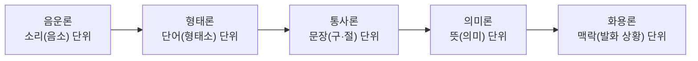
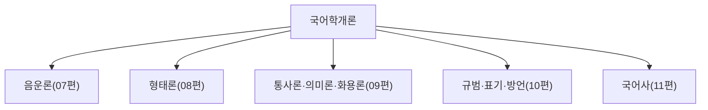

<Callout type="info">
  **이번 문서의 목표:** 국어학을 구성하는 음운론·형태론·통사론·의미론·화용론이 각각 어떤 단위를 연구 대상으로 삼는지 구분하고, 07~11편의 심화 학습에서 길을 잃지 않을 개념 지도를 갖춘다.
</Callout>

## 국어학이란 무엇을 연구하는 학문인가

**국어학**(國語學, Korean Linguistics)은 한국어라는 하나의 개별 언어를 대상으로, 그 언어가 어떤 소리 체계·단어 형성 규칙·문장 구조·의미 관계·사용 맥락을 가지는지 체계적으로 밝히는 학문이다. "언어학(Linguistics)"이 세계 여러 언어에 공통되는 일반 원리를 다루는 상위 학문이라면, 국어학은 그 일반 원리의 틀을 한국어라는 구체적 대상에 적용해 한국어 고유의 규칙을 찾아내는 개별언어학에 해당한다.

> **쉽게 말하면:** 국어학은 "한국어가 어떻게 소리 나고, 어떻게 단어가 되고, 어떻게 문장이 되고, 어떻게 뜻을 전달하는지"를 규칙으로 정리하는 학문이다.

독학사 4단계의 **국어학개론**은 이 국어학을 다섯 개의 하위 영역으로 나누어 통합적으로 묻는다. 다섯 영역은 언어가 만들어지는 단위의 크기 순서로 배열할 수 있다.

이 순서는 우연이 아니다. 소리가 모여 단어가 되고, 단어가 모여 문장이 되고, 문장이 뜻을 전달하며, 그 뜻이 실제 대화 맥락 속에서 어떻게 쓰이는지까지 확장되는 것이 언어가 실제로 작동하는 층위이기 때문이다. 이 층위 구조를 미리 알아 두면 07~11편에서 각 영역을 깊게 배울 때 "지금 배우는 개념이 어느 크기의 단위를 다루는가"를 스스로 점검할 수 있다.

## 음운론: 소리의 최소 단위를 연구한다

**음운론**(音韻論, Phonology)은 말소리 중에서 뜻을 구별하는 데 쓰이는 최소 단위를 연구한다. 이 최소 단위를 **음소**(音素, Phoneme)라고 부른다. 예를 들어 한국어에서 "물"과 "불"은 첫소리 하나만 다른데도 완전히 다른 뜻이 된다. 이때 다른 뜻을 갈라내는 그 첫소리 하나하나(ㅁ, ㅂ)가 음소다.

> **쉽게 말하면:** 음운론은 "어떤 소리 차이가 뜻을 바꾸는가"를 연구하는 분야다.

음운론이 다루는 핵심 대상은 다음 세 가지다.

| 대상 | 설명 | 예 |
|---|---|---|
| 음소(Phoneme) | 뜻을 구별하는 최소의 소리 단위. 자음과 모음으로 나뉜다 | ㄱ, ㄴ, ㅏ, ㅣ 등 |
| 운소(韻素, Prosodeme) | 음소 외에 뜻을 구별하는 데 쓰이는 소리 요소(장단·억양 등) | 눈(雪, 눈 오는 눈)과 눈:(眼, 신체의 눈)의 장단 차이 |
| 음운 변동 | 형태소가 결합할 때 소리가 원래와 다르게 바뀌는 현상 | "국물"이 "궁물"로 발음되는 비음화 |

음소를 판별하는 대표적 방법은 **최소대립쌍**(Minimal Pair)을 찾는 것이다. "물"과 "불"처럼 한 자리의 소리만 다르고 나머지는 같은데 뜻이 달라지는 한 쌍의 단어를 찾으면, 그 다른 자리의 두 소리가 각각 별개의 음소임이 증명된다. 이 방법은 07편에서 국어 음운 체계 전체를 세울 때 기본 도구로 다시 쓰인다.

## 형태론: 단어가 만들어지는 규칙을 연구한다

**형태론**(形態論, Morphology)은 단어 내부의 구조, 즉 단어가 더 작은 조각으로 어떻게 쪼개지고 그 조각들이 어떤 규칙으로 결합해 단어를 이루는지를 연구한다. 이때 더 이상 쪼개면 뜻이 없어지는 최소 단위를 **형태소**(形態素, Morpheme)라고 한다.

예를 들어 "먹었다"라는 단어는 "먹-"(동작의 의미를 지닌 부분), "-었-"(과거 시제를 나타내는 부분), "-다"(문장을 끝맺는 부분)로 쪼갤 수 있다. 이 세 조각은 각각 더 쪼개면 의미가 사라지므로 형태소다.

> **비유로 이해하기:** 형태소는 레고 블록 한 칸과 같다. 블록 하나하나는 그 자체로 의미(모양·기능)를 가지지만, 그 블록을 반으로 자르면 더는 블록 구실을 하지 못한다.

형태소는 크게 두 기준으로 나뉜다.

| 기준 | 구분 | 설명 |
|---|---|---|
| 자립성 | 자립 형태소 | 다른 형태소 없이 혼자 쓰일 수 있다 (예: 하늘, 밥) |
| | 의존 형태소 | 반드시 다른 형태소와 결합해야 쓰일 수 있다 (예: 먹-, -다, -이) |
| 의미 성격 | 실질 형태소 | 구체적인 대상·동작·상태의 실질적 의미를 나타낸다 (예: 하늘, 먹-) |
| | 형식 형태소 | 문법적 관계만을 나타낸다 (예: 조사 -이, 어미 -다) |

형태소가 결합해 만들어지는 더 큰 단위가 **단어**이고, 국어학에서는 이 단어를 문법적 성격에 따라 **품사**(品詞, Parts of Speech, 명사·동사·형용사 등 단어를 문법적 기능에 따라 나눈 갈래)로 분류한다. 형태소 분석과 품사 분류, 단어 형성(파생·합성)의 세부 규칙은 08편에서 본격적으로 다룬다.

## 통사론: 문장이 짜이는 규칙을 연구한다

**통사론**(統辭論, Syntax)은 단어들이 결합해 더 큰 단위인 **구**(句, Phrase, 두 개 이상의 단어가 모여 하나의 문장 성분처럼 기능하는 단위)와 **절**(節, Clause, 주어와 서술어를 갖추고 있으나 독립된 문장은 아닌 단위), 그리고 최종적으로 **문장**(文章, Sentence)을 이루는 규칙을 연구한다.

예를 들어 "예쁜 꽃이 활짝 피었다"라는 문장에서 "예쁜 꽃이"는 관형어와 명사가 결합해 주어 역할을 하는 구이고, 전체 문장은 주어("예쁜 꽃이")와 서술어("활짝 피었다")로 이루어진 하나의 완결된 절이자 문장이다.

> **쉽게 말하면:** 통사론은 "단어를 어떤 순서와 방식으로 배열해야 문법적으로 올바른 문장이 되는가"를 연구하는 분야다.

통사론에서 중요하게 다루는 개념은 **문장 성분**(주어·서술어·목적어·보어·관형어·부사어·독립어처럼 문장 안에서 각 단어(구)가 맡는 문법적 역할)이다. 같은 단어라도 문장 안에서 어떤 성분으로 기능하느냐에 따라 문장의 구조가 달라진다. 이 개념은 09편에서 문장 구조 분석과 함께 심화된다.

## 의미론: 뜻의 관계를 연구한다

**의미론**(意味論, Semantics)은 단어와 문장이 가지는 뜻 자체, 그리고 단어들 사이의 의미 관계를 연구한다. 대표적인 의미 관계는 다음과 같다.

| 의미 관계 | 정의 | 예 |
|---|---|---|
| 동의 관계 | 소리는 다르지만 뜻이 거의 같은 관계 | 마을 – 동네 |
| 반의 관계 | 의미가 서로 대립하는 관계 | 크다 – 작다 |
| 다의 관계 | 하나의 단어가 서로 관련된 여러 뜻을 가지는 관계 | "손"(신체 부위 / 일손 / 인맥) |
| 동음이의 관계 | 소리는 같지만 뜻이 전혀 다른 별개의 단어 관계 | "배"(신체 부위 / 과일 / 탈것) |
| 중의성 | 한 문장이 두 가지 이상으로 해석되는 현상 | "그는 나보다 영화를 더 좋아한다" (비교 대상이 나인지, 나와의 비교 기준인지 모호) |

다의 관계와 동음이의 관계는 시험에서 특히 자주 헷갈리는 지점이다. 다의어는 하나의 단어가 의미적으로 연관된 여러 뜻으로 **확장**된 것이고, 동음이의어는 소리만 우연히 같을 뿐 어원과 의미가 전혀 다른 **별개의 단어**다. 이 구분은 09편에서 사전 등재 방식(하나의 표제어 아래 여러 뜻풀이 vs. 별도의 표제어)과 함께 더 자세히 다룬다.

## 화용론: 맥락 속의 언어 사용을 연구한다

**화용론**(話用論, Pragmatics)은 문장 자체의 뜻(의미론의 영역)을 넘어, 그 문장이 실제 대화 상황·맥락 속에서 어떤 의도로 쓰이고 어떻게 해석되는지를 연구한다.

예를 들어 "여기 좀 춥지 않아요?"라는 문장은 의미론적으로는 단순한 질문이지만, 화용론적으로는 "창문 좀 닫아 주세요"라는 요청의 **함축**(含蓄, Implicature, 문장이 직접 말하지 않았지만 맥락상 전달되는 의미)을 담을 수 있다. 이처럼 말로 무언가를 "하는" 행위 자체를 **발화 행위**(發話行爲, Speech Act)라고 부른다.

> **비유로 이해하기:** 의미론이 "사전에 적힌 뜻"을 다룬다면, 화용론은 "그 말을 지금 이 상황에서 왜 했는지"를 다룬다.

## 다섯 영역의 관계와 독학사 국어학개론과의 연계

다섯 영역은 서로 독립된 것이 아니라 한 문장을 발화하는 과정 전체를 층위별로 나눈 것이다. 소리(음운론)가 모여 단어(형태론)가 되고, 단어가 모여 문장(통사론)이 되며, 그 문장은 뜻(의미론)을 가지고, 그 뜻은 실제 상황(화용론) 속에서 쓰인다. 독학사 국어학개론은 이 다섯 층위를 한 시험 안에서 통합적으로 묻기 때문에, "지금 이 문제가 묻는 것이 소리의 문제인지, 단어의 문제인지, 문장의 문제인지, 뜻의 문제인지, 맥락의 문제인지"를 먼저 구분하는 습관이 정답률을 크게 좌우한다.

또한 이 다섯 영역과 별개로 국어학개론은 **국어 규범**(맞춤법·표준어·외래어 표기)과 **국어사**(시대별 변천)도 함께 다룬다. 이 두 영역은 다섯 층위 전체에 걸쳐 있는 응용 분야로, 10편과 11편에서 별도로 심화한다.

## 국어학의 연구 방법: 공시적 관점과 통시적 관점

국어학은 언어를 바라보는 시간축에 따라 두 가지 연구 방법으로 나뉜다.

- **공시적 연구**(共時的, Synchronic): 특정 한 시점(주로 현재)의 언어 체계를 그 자체로 분석하는 방법. 음운론·형태론·통사론·의미론·화용론의 기본 연구는 대부분 공시적 관점을 취한다.
- **통시적 연구**(通時的, Diachronic): 시간의 흐름에 따라 언어가 어떻게 변화해 왔는지를 추적하는 방법. 11편에서 다루는 국어사가 대표적인 통시적 연구다.

두 관점은 대립하는 것이 아니라 서로 보완적이다. 예를 들어 현재 국어에서 왜 특정 음운 변동이 일어나는지(공시적 질문)를 설명하다 보면, 그 변동의 뿌리가 중세국어 시기의 음가 변화(통시적 사실)에 있는 경우가 많다.

## 자주 틀리는 점

- 음운론과 음성학(Phonetics, 실제 물리적 소리 자체를 연구하는 분야)을 혼동하기 쉽다. 음성학은 소리의 물리적 성질을, 음운론은 그 소리가 뜻을 구별하는 방식을 연구한다.
- 형태소와 단어를 같은 크기의 단위로 착각하기 쉽다. 단어는 하나 이상의 형태소로 이루어질 수 있으므로 형태소가 더 작은(혹은 같은) 단위다.
- 다의어와 동음이의어를 "뜻이 여러 개면 무조건 같은 부류"로 묶어 버리는 실수가 잦다. 의미적 연관성의 유무가 판별 기준이다.
- 화용론을 "말을 예의 있게 하는 법"으로 오해하기 쉽다. 화용론은 맥락에 따른 의미 해석의 규칙을 연구하는 학문적 영역이지 예절 교육이 아니다.

## 핵심 정리

- 국어학은 음운론(소리)·형태론(단어)·통사론(문장)·의미론(뜻)·화용론(맥락)의 다섯 하위 영역으로 나뉘며, 이는 언어 단위가 커지는 순서를 따른다.
- 음운론의 최소 단위는 음소, 형태론의 최소 단위는 형태소이며, 통사론은 구·절·문장을, 의미론은 단어·문장 사이의 의미 관계를, 화용론은 맥락 속 발화 행위와 함축을 다룬다.
- 국어학은 공시적 연구(한 시점의 체계 분석)와 통시적 연구(시간에 따른 변화 추적)로 나뉘며, 국어사(11편)는 통시적 연구의 대표 영역이다.
- 독학사 국어학개론은 다섯 영역과 규범·국어사를 통합해 출제하므로, 문제가 어느 층위를 묻는지 구분하는 습관이 중요하다.

## 마무리 복습

<Quiz
  questionNumber={1}
  question="국어학의 하위 영역 중 뜻을 구별하는 최소의 소리 단위를 연구하는 분야는?"
  options={['형태론', '음운론', '통사론', '화용론']}
  correctAnswer={2}
  explanation="음운론은 뜻을 구별하는 최소의 소리 단위인 음소를 연구하는 분야다."
  optionExplanations={['형태론은 단어 내부의 형태소 구조를 연구한다', '정답이다', '통사론은 구·절·문장의 구조를 연구한다', '화용론은 맥락 속 언어 사용을 연구한다']}
/>

<Quiz
  questionNumber={2}
  question="다음 중 형태소에 대한 설명으로 옳지 않은 것은?"
  options={['더 이상 쪼개면 의미가 사라지는 최소의 단위다', '자립 형태소와 의존 형태소로 나눌 수 있다', '실질적 의미를 지닌 것과 문법적 기능만 하는 것으로 나눌 수 있다', '형태소는 항상 문장 하나와 같은 크기를 가진다']}
  correctAnswer={4}
  explanation="형태소는 단어보다 작거나 같은 크기의 최소 의미 단위이며, 문장과 같은 크기를 가진다는 설명은 옳지 않다."
  optionExplanations={['옳은 설명이므로 정답이 아니다', '옳은 설명이므로 정답이 아니다', '옳은 설명이므로 정답이 아니다', '형태소는 단어 내부의 최소 단위로 문장 크기와는 무관하며 이것이 정답이다']}
/>

<Quiz
  questionNumber={3}
  question="구, 절, 문장을 연구하는 국어학의 하위 영역은?"
  options={['음운론', '형태론', '통사론', '의미론']}
  correctAnswer={3}
  explanation="통사론은 단어들이 결합해 구, 절, 문장을 이루는 규칙을 연구하는 분야다."
  optionExplanations={['음운론은 소리 단위를 연구한다', '형태론은 단어 내부 구조를 연구한다', '정답이다', '의미론은 뜻의 관계를 연구한다']}
/>

<Quiz
  questionNumber={4}
  question="다의어와 동음이의어의 구분 기준으로 가장 적절한 것은?"
  options={['소리가 같은지 여부만으로 구분한다', '여러 뜻 사이에 의미적 연관성이 있는지 여부로 구분한다', '단어의 글자 수가 같은지로 구분한다', '품사가 같은지 여부로만 구분한다']}
  correctAnswer={2}
  explanation="다의어는 서로 관련된 여러 뜻으로 확장된 하나의 단어이고, 동음이의어는 소리만 우연히 같은 별개의 단어이므로 의미적 연관성의 유무가 핵심 판별 기준이다."
  optionExplanations={['소리가 같다는 것만으로는 다의어와 동음이의어를 구분할 수 없다', '정답이다', '글자 수는 두 개념을 구분하는 기준이 아니다', '품사 일치 여부는 핵심 판별 기준이 아니다']}
/>

<Quiz
  questionNumber={5}
  question="화용론이 주로 연구하는 대상으로 가장 적절한 것은?"
  options={['최소대립쌍을 이용한 음소 판별', '단어 내부 형태소의 결합 규칙', '문장 자체의 사전적 의미 목록', '맥락 속에서 발화가 실제로 수행하는 의도와 함축']}
  correctAnswer={4}
  explanation="화용론은 문장의 사전적 의미를 넘어, 실제 대화 맥락 속에서 발화가 수행하는 의도와 함축된 의미를 연구하는 분야다."
  optionExplanations={['음소 판별은 음운론의 방법이다', '형태소 결합 규칙은 형태론의 영역이다', '사전적 의미 목록은 의미론의 영역이다', '정답이다']}
/>

<Quiz
  questionNumber={6}
  question="공시적 연구와 통시적 연구에 대한 설명으로 옳은 것은?"
  options={['공시적 연구는 시간의 흐름에 따른 언어 변화를 추적하는 방법이다', '통시적 연구는 특정 한 시점의 언어 체계만을 분석하는 방법이다', '공시적 연구는 특정 한 시점의 언어 체계를, 통시적 연구는 시간에 따른 언어 변화를 다룬다', '두 연구 방법은 서로 완전히 배타적이어서 함께 쓰일 수 없다']}
  correctAnswer={3}
  explanation="공시적 연구는 한 시점의 언어 체계 자체를 분석하고, 통시적 연구는 시간에 따른 언어의 변화 과정을 추적하는 방법이다."
  optionExplanations={['공시적 연구에 대한 설명이 반대로 되어 있다', '통시적 연구에 대한 설명이 반대로 되어 있다', '정답이다', '두 관점은 서로 보완적으로 함께 활용될 수 있다']}
/>

## 참고 자료

- [표준국어대사전](https://stdict.korean.go.kr)
- [국립국어원](https://www.korean.go.kr)
