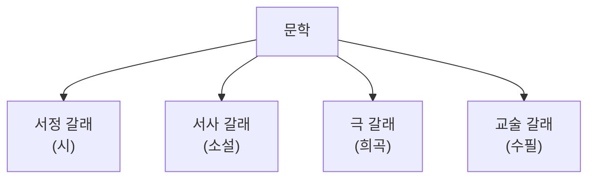

<Callout type="info">
  **이번 문서의 목표:** 문학이 무엇이고 왜 존재하는지 정의하고, 시·소설·희곡·수필·비평이라는 다섯 갈래를 구분하는 기준과 각 갈래를 분석할 때 쓰는 기본 용어를 익혀 12편 이후의 작품 분석에서 흔들리지 않게 한다.
</Callout>

## 문학이란 무엇인가

**문학**(文學, Literature)은 언어를 매개로 인간의 삶과 정서, 사상을 형상화(形象化, 추상적인 생각이나 감정을 구체적인 이미지·장면·이야기로 표현하는 것)하여 미적 가치를 지닌 언어 예술로 만들어 내는 활동, 그리고 그 결과물을 가리킨다. 신문 기사나 설명서도 언어로 되어 있지만 문학이라 부르지 않는 이유는, 문학이 정보 전달을 넘어 **정서적 감동과 미적 경험**을 목적으로 언어를 조직하기 때문이다.

> **쉽게 말하면:** 문학은 "사실을 정확히 전달하는 글"이 아니라 "언어로 삶과 감정을 형상화해 독자에게 미적 경험을 주는 글"이다.

### 문학의 기능

문학이 왜 필요한가에 대한 답은 전통적으로 두 가지 축으로 정리된다.

| 기능 | 설명 |
|---|---|
| 쾌락적 기능(교시적 기능과 대비) | 문학은 독자에게 아름다움과 즐거움, 정서적 감동을 준다 |
| 교시적 기능 | 문학은 독자에게 삶에 대한 깨달음, 가치관, 교훈을 전달한다 |

두 기능은 어느 한쪽만 강조되면 문학의 본질을 놓친다. 즐거움만 남으면 문학이 오락물과 구분되지 않고, 교훈만 남으면 설교문이나 다름없어진다. 좋은 문학 작품은 이 두 기능을 형상화된 언어 안에서 동시에 성취한다고 보는 것이 국문학개론의 전통적 관점이다.

## 문학의 갈래(장르) 구분

문학을 분류하는 갈래(genre)는 여러 기준으로 나눌 수 있지만, 독학사 4단계에서 가장 기본이 되는 구분은 표현 방식에 따른 **서정·서사·극·교술**의 4분법이다.

| 갈래 | 대표 형식 | 핵심 특징 |
|---|---|---|
| 서정(抒情) | 시(詩) | 화자의 내면 정서를 압축된 언어로 표현. 사건보다 정서·이미지 중심 |
| 서사(敍事) | 소설(小說) | 인물과 사건을 시간의 흐름 속에서 서술자가 이야기로 전달 |
| 극(劇) | 희곡(戲曲) | 인물의 대사와 행동으로 사건을 직접 보여줌(서술자 없음) |
| 교술(敎述) | 수필(隨筆) | 글쓴이 자신의 체험과 생각을 사실에 바탕해 직접 서술 |

여기에 더해 문학 작품을 다른 각도에서 관찰하고 평가하는 **비평**(批評, Criticism)이 독립된 영역으로 다뤄진다. 비평은 창작물 자체는 아니지만, 국문학개론과 문학비평론에서 문학 갈래 못지않게 중요하게 취급되므로 이 시리즈에서도 05편·21~22편에서 별도로 심화한다.

### 왜 이 네 갈래로 나뉘는가

4분법의 기준은 "누가 이야기하는가"와 "어떻게 전달하는가"이다. 서정은 화자가 자기 감정을 직접 노래하고, 서사는 서술자가 사건을 이야기로 전달하며, 극은 서술자 없이 인물들의 말과 행동만으로 사건이 펼쳐지고, 교술은 글쓴이 자신이 체험한 사실을 꾸밈없이 서술한다. 이 기준을 알아 두면 "이 작품은 왜 소설이 아니라 수필인가" 같은 갈래 판별형 문제에서 헷갈리지 않는다.

## 시(서정 갈래)의 기본 용어

시를 분석할 때 가장 먼저 구분해야 하는 개념은 **화자**(話者, Speaker 또는 시적 자아, Persona)다. 화자는 시 속에서 말하고 있는 목소리로, 시를 쓴 실제 시인과 반드시 같은 사람은 아니다. 예를 들어 남성 시인이 여성 화자의 목소리를 빌려 쓴 시가 존재하는 것처럼, 화자는 시인이 의도적으로 설정한 발화 주체다.

| 용어 | 정의 |
|---|---|
| 화자(시적 자아) | 시 속에서 말하는 목소리. 시인 자신과 구별되는 문학적 장치 |
| 행(行, Line) | 시에서 한 줄에 해당하는 단위 |
| 연(聯, Stanza) | 몇 개의 행이 모여 이루는 하나의 단락 단위 |
| 심상(心象, Image) | 언어로 떠올리게 되는 감각적 이미지(시각·청각·촉각 등) |
| 운율(韻律, Rhythm) | 시어의 반복·배열이 만들어 내는 소리의 규칙적 흐름 |

이 개념들의 실제 적용(이미지 분석, 화자의 정서 추적)은 17편 현대시 작품 분석과 12~13편 고전 시가 편에서 실제 작품(새로 구성한 예시)에 적용해 심화한다.

## 소설(서사 갈래)의 기본 용어

소설은 **서술자**(敍述者, Narrator)가 이야기를 전달한다는 점에서 시와 결정적으로 다르다. 서술자는 실제 작가와 구별되는, 이야기를 전달하도록 설정된 목소리다.

> **쉽게 말하면:** 화자가 "시 속에서 말하는 이"라면, 서술자는 "소설 속 이야기를 들려주는 이"다.

소설 분석의 핵심 용어는 다음과 같다.

| 용어 | 정의 |
|---|---|
| 서술자 | 이야기를 전달하는 목소리(작가 자신과는 구별) |
| 인물(人物, Character) | 이야기 속에서 행동하고 말하는 존재 |
| 시점(視點, Point of View) | 서술자가 이야기를 바라보고 전달하는 위치와 방식 |
| 갈등(葛藤, Conflict) | 인물과 인물, 혹은 인물과 상황 사이의 대립 |
| 플롯(Plot) | 사건을 인과 관계로 재구성해 배열한 것(단순 시간 순서인 스토리와 구별) |

시점은 크게 1인칭 주인공 시점, 1인칭 관찰자 시점, 전지적 작가 시점, 3인칭(작가) 관찰자 시점으로 나뉘며, 이 구분과 실제 서사 구조 분석(발단·전개·위기·절정·결말)은 18편에서 본격적으로 다룬다.

## 희곡(극 갈래)의 기본 용어

희곡은 소설과 달리 서술자가 없다는 점이 가장 큰 차이다. 모든 사건과 정보는 인물의 **대사**(對詞, Dialogue)와 **지문**(地文, Stage Direction, 인물의 동작·표정·무대 장치 등을 지시하는 부분)만으로 전달된다.

| 용어 | 정의 |
|---|---|
| 대사 | 인물이 직접 하는 말(대화·독백·방백을 포함) |
| 지문(무대 지시) | 인물의 동작·표정, 무대의 장치·조명 등을 지시하는 서술 부분 |
| 막(幕, Act) / 장(場, Scene) | 희곡의 큰 구성 단위(막)와 그 안의 작은 단위(장) |
| 해설(解說) | 막이 오르기 전 무대 상황을 설명하는 부분 |

서술자가 없다는 특징 때문에 희곡은 소설보다 **압축과 집중**이 강하게 요구되는 갈래로 다뤄진다. 이 특징과 한국 현대 희곡사의 흐름은 20편에서 다룬다.

## 수필(교술 갈래)의 기본 용어

수필은 글쓴이 자신이 곧 화자이자 서술자라는 점에서 앞의 세 갈래와 근본적으로 다르다. 시·소설·희곡은 허구(虛構, Fiction)를 전제로 화자·서술자·인물이라는 문학적 장치를 따로 두지만, 수필은 글쓴이의 실제 체험과 생각을 사실 그대로 서술하는 **비허구적(non-fiction) 성격**을 지닌다.

> **비유로 이해하기:** 시·소설·희곡이 배우를 세워 이야기를 "연기"하게 한다면, 수필은 글쓴이 자신이 무대에 직접 나서서 자기 이야기를 하는 것과 같다.

수필은 형식의 제약이 거의 없는 **무형식의 형식**을 특징으로 하며, 개인적 감상과 체험을 자유롭게 서술하는 경수필과, 사회적·논리적 주제를 다루는 중수필(비평적 수필·논설적 수필)로 나누기도 한다. 이 구분과 비평·논설문과의 경계는 20편에서 추가로 다룬다.

## 갈래 판별 시 흔한 함정 정리

독학사 시험은 "이 글은 어느 갈래에 속하는가"를 묻는 문제를 즐겨 낸다. 판별의 핵심 질문을 정리하면 다음과 같다.

<Steps>

### 1. 허구인가, 실제 체험인가

허구를 전제로 하면 시·소설·희곡 중 하나이고, 글쓴이의 실제 체험을 사실 그대로 다루면 수필(교술)이다.

### 2. 서술자가 있는가, 없는가

서술자가 이야기를 전달하면 소설(서사)이고, 서술자 없이 인물의 대사·지문만으로 사건이 전개되면 희곡(극)이다.

### 3. 사건 중심인가, 정서 중심인가

사건의 전개보다 화자의 내면 정서·이미지가 중심이면 시(서정)다.

</Steps>

이 세 질문의 순서로 접근하면, "인물의 대사가 나오니까 희곡이다"처럼 표면적 특징만 보고 성급히 판단하는 실수를 줄일 수 있다. 예를 들어 소설에도 인물의 대사가 등장하지만, 그 대사를 전달하는 서술자가 존재한다는 점에서 희곡과 구별된다.

## 자주 틀리는 점

- 화자(또는 서술자)를 실제 작가와 동일시하는 실수가 잦다. 화자와 서술자는 작품 안에 설정된 문학적 장치이지, 작가 자신의 육성이 아니다.
- 시의 "행"과 "연"을 혼동하기 쉽다. 행은 한 줄, 연은 행들이 모인 단락이다.
- 수필을 "형식이 없으니 아무렇게나 써도 되는 글"로 오해하기 쉽다. 형식의 자유로움은 있지만, 사실에 기반한 진솔한 서술이라는 본질적 요건은 지켜야 한다.
- 소설의 "스토리"와 "플롯"을 같은 개념으로 착각하기 쉽다. 스토리는 사건의 시간 순서 나열이고, 플롯은 그 사건을 인과 관계로 재구성한 것이라는 차이가 있다.

## 핵심 정리

- 문학은 언어를 통해 삶과 정서를 형상화해 미적 가치를 만드는 예술이며, 쾌락적 기능과 교시적 기능을 함께 지닌다.
- 문학 갈래는 표현 방식에 따라 서정(시)·서사(소설)·극(희곡)·교술(수필)의 4분법으로 나뉘며, 비평은 별도의 영역으로 다뤄진다.
- 시는 화자·행·연·심상·운율을, 소설은 서술자·인물·시점·갈등·플롯을, 희곡은 대사·지문·막·장을, 수필은 비허구성과 무형식성을 핵심 개념으로 삼는다.
- 갈래 판별은 허구 여부 → 서술자 유무 → 사건 중심인지 정서 중심인지의 순서로 접근하면 함정을 피할 수 있다.

## 마무리 복습

<Quiz
  questionNumber={1}
  question="문학의 정의로 가장 적절한 것은?"
  options={['정보를 정확하고 객관적으로 전달하는 모든 글', '언어를 매개로 삶과 정서를 형상화하여 미적 가치를 만드는 예술', '사실만을 기록하는 보고서 형식의 글', '문법 규칙을 정확히 지킨 모든 문장']}
  correctAnswer={2}
  explanation="문학은 언어를 통해 삶과 정서를 형상화하여 미적 가치를 지닌 언어 예술을 만드는 활동과 그 결과물을 가리킨다."
  optionExplanations={['정보의 정확한 전달은 문학 고유의 목적이 아니다', '정답이다', '사실 기록 자체가 문학의 정의는 아니다', '문법 준수 여부는 문학성과 직접적인 관련이 없다']}
/>

<Quiz
  questionNumber={2}
  question="문학의 4분법(서정·서사·극·교술) 갈래와 대표 형식의 연결로 옳지 않은 것은?"
  options={['서정 - 시', '서사 - 소설', '극 - 수필', '교술 - 수필']}
  correctAnswer={3}
  explanation="극 갈래의 대표 형식은 희곡이며, 수필은 교술 갈래에 해당하므로 극과 수필을 연결한 설명은 옳지 않다."
  optionExplanations={['옳은 연결이므로 정답이 아니다', '옳은 연결이므로 정답이 아니다', '극 갈래의 대표 형식은 희곡이며 이것이 정답이다', '옳은 연결이므로 정답이 아니다']}
/>

<Quiz
  questionNumber={3}
  question="소설과 희곡의 가장 근본적인 차이로 가장 적절한 것은?"
  options={['소설에는 인물이 등장하지 않는다', '소설에는 서술자가 있지만 희곡에는 서술자가 없다', '희곡은 반드시 운율이 있어야 한다', '소설은 항상 실제 있었던 사실만 다룬다']}
  correctAnswer={2}
  explanation="소설은 서술자가 이야기를 전달하는 갈래이고, 희곡은 서술자 없이 인물의 대사와 지문만으로 사건이 전개되는 갈래다."
  optionExplanations={['소설에도 인물은 등장한다', '정답이다', '운율은 희곡의 필수 요건이 아니라 시의 특징에 가깝다', '소설은 허구를 전제로 하는 서사 갈래다']}
/>

<Quiz
  questionNumber={4}
  question="시에서 몇 개의 행이 모여 이루는 하나의 단락 단위를 가리키는 용어는?"
  options={['화자', '연', '지문', '플롯']}
  correctAnswer={2}
  explanation="연은 몇 개의 행이 모여 이루는 시의 단락 단위를 가리킨다."
  optionExplanations={['화자는 시 속에서 말하는 목소리를 가리키는 용어다', '정답이다', '지문은 희곡에서 무대 지시를 가리키는 용어다', '플롯은 소설에서 사건을 인과 관계로 재구성한 것을 가리킨다']}
/>

<Quiz
  questionNumber={5}
  question="수필(교술 갈래)의 특징에 대한 설명으로 옳지 않은 것은?"
  options={['글쓴이 자신의 실제 체험을 사실에 바탕해 서술한다', '허구를 전제로 화자와 서술자라는 별도의 문학적 장치를 반드시 설정한다', '형식의 제약이 비교적 적은 무형식의 형식을 특징으로 한다', '개인적 감상 중심의 경수필과 사회적 주제 중심의 중수필로 나누기도 한다']}
  correctAnswer={2}
  explanation="수필은 허구가 아닌 비허구적 성격을 지니며, 글쓴이 자신이 곧 화자이자 서술자이므로 별도의 문학적 장치를 반드시 설정한다는 설명은 옳지 않다."
  optionExplanations={['옳은 설명이므로 정답이 아니다', '수필은 비허구적 갈래로 별도의 장치를 반드시 설정하지 않으며 이것이 정답이다', '옳은 설명이므로 정답이 아니다', '옳은 설명이므로 정답이 아니다']}
/>

<Quiz
  questionNumber={6}
  question="어떤 글의 문학 갈래를 판별할 때 가장 먼저 확인해야 할 기준으로 가장 적절한 것은?"
  options={['글자 수가 몇 자인지', '허구를 전제로 하는지, 실제 체험을 사실대로 다루는지', '출판된 연도가 언제인지', '제목에 특정 단어가 포함되어 있는지']}
  correctAnswer={2}
  explanation="갈래 판별의 첫 단계는 허구를 전제로 하는 갈래(시·소설·희곡)인지, 실제 체험을 사실대로 다루는 교술 갈래(수필)인지를 구분하는 것이다."
  optionExplanations={['글자 수는 갈래 판별의 기준이 아니다', '정답이다', '출판 연도는 갈래 자체를 판별하는 기준이 아니다', '제목에 포함된 단어만으로 갈래를 판별할 수는 없다']}
/>

## 참고 자료

- [표준국어대사전](https://stdict.korean.go.kr)
- [국립국어원](https://www.korean.go.kr)
