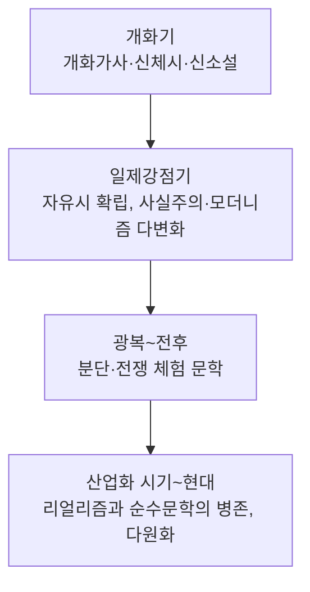

<Callout type="info">
  **이번 문서의 목표:** 한국 문학사를 상고~조선의 고전문학기와 개화기~현대의 현대문학기로 크게 나누고, 각 시대를 대표하는 갈래와 흐름을 지도처럼 그려 12편 이후 고전·현대문학 심화 학습의 시간축을 갖춘다.
</Callout>

<Callout type="warning">
  이 편에서 다루는 작품은 실제 원문을 인용하지 않고 줄거리·특징을 요약해 설명한다. 저작권이 있는 작품의 원문이나 시험 지문을 그대로 옮기지 않으며, 꼭 필요한 경우에도 한두 구절 이내의 짧은 인용에 그친다.
</Callout>

## 왜 문학사를 시간 순으로 먼저 그려야 하는가

한국문학사 과목은 개별 작품 하나하나를 몰라도 시대의 큰 흐름(어떤 시대에 어떤 갈래가 왜 유행했는지)을 알면 문제의 절반은 풀린다. 예를 들어 "이 작품이 창작된 시기로 가장 적절한 것은?" 같은 문제는 작품을 몰라도, 그 작품의 형식(예: 4음보 연속체, 판소리 사설투)이나 소재(예: 신문물, 계몽사상)만 보고도 시대를 좁혀 나갈 수 있다. 이 편은 그런 **시대 판별의 지도**를 미리 그려 두는 것이 목표다.

> **쉽게 말하면:** 개별 작품을 외우기 전에, "이 시대에는 이런 갈래가, 이런 이유로 유행했다"는 큰 지도를 먼저 머리에 넣어 두자는 것이다.

한국 문학사는 관습적으로 갑오개혁(1894년)을 기준으로 **고전문학**과 **현대문학**으로 크게 나뉜다. 이 기준 이전을 상고시대부터 조선시대까지로, 이후를 개화기부터 현대까지로 세분한다.

## 고전문학기의 시대 구분과 특징

### 상고시대와 삼국시대: 구비문학과 초기 서정시가

문자 기록이 충분치 않았던 상고시대 문학은 대부분 입에서 입으로 전해지는 **구비문학**(口碑文學, 말로 전승되는 문학. 설화·민요·무가 등)의 형태로 남아 있다. 이 시기의 대표적 서정시가로는 집단적 제의(祭儀, 공동체가 신에게 지내는 의식)와 관련된 노래들이 있었을 것으로 추정되며, 삼국시대에 들어서면 개인의 서정을 담은 짧은 노래들이 문헌에 언급되기 시작한다. 이 시기 문학의 핵심은 **공동체 중심의 구비 전승**에서 점차 **개인의 정서를 담은 기록 문학**으로 옮겨가는 과도기라는 점이다.

삼국시대 후기에서 통일신라에 걸쳐 등장한 **향가**(鄕歌)는 한자의 음과 뜻을 빌려 우리말을 표기하는 **향찰**(鄕札) 표기 방식으로 기록된 서정시가다. 향가는 승려·화랑 등이 지었다고 전해지며, 불교적 기원(祈願, 바라고 원함)이나 개인적 정서를 담은 작품이 많다. 향가의 표기 방식(향찰)과 형식(4구체·8구체·10구체)의 세부 내용은 11편 국어사(차자 표기)와 12편 고전 시가 갈래에서 이어서 다룬다.

### 고려시대: 향가의 쇠퇴와 속요·경기체가의 등장

고려시대에 들어 향가는 점차 쇠퇴하고, 평민층의 정서를 담은 **속요**(俗謠, 고려가요라고도 함)와 신흥 사대부 계층이 즐긴 **경기체가**(景幾體歌)가 새롭게 등장한다. 속요는 후렴구를 반복하며 부르는 노래의 형식적 특징을 지니고, 남녀 간의 애정이나 삶의 애환처럼 평민의 정서를 진솔하게 담았다. 경기체가는 반대로 사대부 계층이 지식과 교양을 과시하듯 나열하는 형식적 특징을 지녀, 두 갈래가 계층에 따라 상반된 성격을 지닌다는 점이 시험에서 자주 대비되어 출제된다.

| 갈래 | 향유 계층 | 형식·정서적 특징 |
|---|---|---|
| 속요(고려가요) | 평민층 | 후렴구 반복, 남녀 애정·삶의 애환을 진솔하게 표현 |
| 경기체가 | 신흥 사대부 | 사물·경치·지식을 나열하는 교술적 성격이 강함 |

### 조선시대: 시조와 가사의 확립, 국문 산문의 성장

조선시대는 한글 창제(11편에서 국어사 관점으로 심화) 이후 국문 문학이 본격적으로 성장한 시기다. 이 시기를 대표하는 시가 갈래는 **시조**(時調)와 **가사**(歌辭)다.

- **시조**는 3장(초장·중장·종장) 형식에 정해진 음수율을 따르는 정형시로, 조선 전기에는 사대부의 유교적 이념(충의·자연 친화 등)을, 조선 후기에는 평민층까지 향유층이 확대되며 더 다양한 소재를 담게 된다.
- **가사**는 시조보다 길이 제약이 없는 연속체 형식으로, 자연 예찬·기행·유배 체험·규방(閨房, 여성의 생활 공간) 정서 등 폭넓은 내용을 담았다.

조선 후기에는 서사 갈래도 크게 성장한다. **고전소설**이 등장해 영웅의 일대기를 다루는 영웅소설, 가정 내 갈등을 다루는 가정소설, 남녀의 사랑을 다루는 애정소설 등으로 다양화되었고, 판소리와 연계된 판소리계 소설도 등장했다. 이 흐름은 14편 고전 산문·한문학 편에서 갈래별로 심화한다.

> **쉽게 말하면:** 조선시대는 "정형화된 짧은 노래(시조)"와 "자유로운 긴 노래(가사)"가 함께 발전하면서, 동시에 "이야기(소설)"라는 새로운 서사 갈래가 본격적으로 자리 잡은 시기다.

## 현대문학기의 시대 구분과 특징

### 개화기: 계몽사상과 신문학의 태동

갑오개혁(1894년) 전후의 **개화기**는 서구 문물과 근대적 사고가 유입되며 문학의 형식과 내용이 급격히 변화한 시기다. 이 시기에는 옛 시가 형식에 개화·계몽사상을 담은 **개화가사**, 창가(唱歌)를 거쳐 정형에서 다소 벗어난 **신체시**(新體詩)가 등장해 자유시로 가는 다리 역할을 했다. 산문에서는 봉건 질서 비판과 개화사상 계몽을 목적으로 한 **신소설**(新小說)이 등장해 고전소설과 근대소설을 잇는 과도기적 갈래로 자리 잡았다.

### 일제강점기: 자유시의 확립과 사조의 다변화

1910년대 이후 일제강점기에 들어서면 정형에서 완전히 벗어난 **자유시**가 자리 잡고, 문학 사조도 급격히 다양해진다. 낭만적 감상을 노래한 흐름, 식민지 현실을 사실적으로 그린 **사실주의**(현실을 있는 그대로 묘사하려는 사조), 서구의 실험적 기법을 받아들인 **모더니즘**(전통적 형식을 벗어나 새로운 표현 기법을 시도하는 사조), 그리고 일제 말기 저항적 목소리를 담은 시들이 이 시기 문학사의 큰 축을 이룬다. 소설에서도 식민지 현실의 궁핍과 지식인의 고뇌를 그린 작품들이 사실주의·자연주의(인간을 환경과 본능에 지배되는 존재로 냉정하게 관찰하려는 사조) 경향으로 다수 창작되었다.

이 시기 사조의 세부 흐름(모더니즘·리얼리즘 등)과 대표 작가·작품의 문학사적 위치는 16편(현대시)과 19편(현대소설)에서 각각 심화한다.

### 광복 이후~현대: 분단 현실과 다원화된 문학

광복(1945년) 이후 한국 문학은 분단이라는 새로운 현실을 마주하며, 전쟁의 상흔과 이산(離散)의 아픔을 다루는 작품들이 등장한다. 이후 산업화 시기에는 도시화·산업화 과정에서 소외된 사람들의 삶을 그리는 **리얼리즘**(현실의 구조적 문제를 비판적으로 형상화하려는 사조) 계열 작품과, 인간 존재·형식 실험에 집중하는 순수문학·모더니즘 계열 작품이 함께 발전하며 오늘날까지 이어지는 **다원화된 문학 지형**을 형성한다.

## 시대 판별을 위한 핵심 단서 정리

문제에서 작품의 창작 시기를 판별해야 할 때 참고할 수 있는 단서를 정리하면 다음과 같다.

| 단서 | 판별 방향 |
|---|---|
| 향찰 표기, 4구체·8구체·10구체 형식 | 향가 → 삼국–통일신라 |
| 후렴구 반복, 평민 정서 | 속요 → 고려시대 |
| 3장 형식, 초장·중장·종장 | 시조 → 조선시대(전기는 사대부, 후기는 평민층 확대) |
| 개화·계몽사상, 정형에서 벗어나기 시작하는 시형 | 개화가사·신체시 → 개화기 |
| 완전한 자유시 형태, 식민지 현실이나 실험적 기법 | 일제강점기 |
| 분단·전쟁 체험, 산업화 시기의 소외 문제 | 광복 이후–현대 |

이 단서들은 단독으로 완벽한 판별 기준이 되지는 않지만, 다른 선지를 소거하는 데 효과적으로 쓰인다. 예를 들어 향찰 표기가 언급된 작품을 "조선 후기 시조"로 보는 선지는 형식적 단서만으로도 바로 배제할 수 있다.

## 자주 틀리는 점

- 향가와 속요를 형식·향유 계층 구분 없이 "옛날 노래"로 뭉뚱그려 이해하는 경우가 많다. 향가는 향찰 표기의 삼국~통일신라 서정시가이고, 속요는 후렴구가 있는 고려시대 평민층 노래로 시대와 계층이 다르다.
- 시조와 가사를 "옛 시가"로 같은 갈래처럼 다루는 경우가 있다. 시조는 3장의 정형시, 가사는 길이 제약이 없는 연속체 형식으로 구조 자체가 다르다.
- 신소설을 "완전한 근대소설"로 오해하기 쉽다. 신소설은 고전소설의 흔적(권선징악적 결말 등)이 남아 있는 과도기적 갈래다.
- 개화기와 일제강점기를 하나로 뭉쳐 "근대"로만 이해하는 경우가 많다. 개화기는 계몽·과도기적 성격이, 일제강점기는 자유시 확립과 사조의 다변화가 핵심이라는 점에서 구분된다.

## 핵심 정리

- 한국 문학사는 갑오개혁(1894년)을 기준으로 고전문학기(상고~조선)와 현대문학기(개화기~현대)로 크게 나뉜다.
- 고전문학기는 구비문학 → 향가(삼국~통일신라) → 속요·경기체가(고려) → 시조·가사·고전소설(조선)의 흐름을 보인다.
- 현대문학기는 개화가사·신체시·신소설(개화기) → 자유시 확립과 사조 다변화(일제강점기) → 분단 체험과 다원화(광복 이후~현대)의 흐름을 보인다.
- 시대 판별 문제는 형식적 특징(향찰, 후렴구, 3장 형식 등)과 소재적 특징(계몽사상, 식민지 현실, 분단 등)을 단서로 접근하면 선지를 효율적으로 소거할 수 있다.

## 마무리 복습

<Quiz
  questionNumber={1}
  question="한국 문학사를 고전문학과 현대문학으로 크게 나누는 관습적 기준 시점은?"
  options={['훈민정음 창제', '갑오개혁(1894년)', '광복(1945년)', '한국전쟁 발발']}
  correctAnswer={2}
  explanation="한국 문학사는 갑오개혁(1894년)을 기준으로 관습적으로 고전문학과 현대문학으로 크게 나뉜다."
  optionExplanations={['훈민정음 창제는 국어사·표기의 중요한 사건이지만 고전·현대문학 구분 기준은 아니다', '정답이다', '광복은 현대문학 내부의 세부 시기 구분에 쓰이는 사건이다', '한국전쟁 발발도 현대문학 내부의 세부 사건일 뿐 대구분 기준은 아니다']}
/>

<Quiz
  questionNumber={2}
  question="향가에 대한 설명으로 옳지 않은 것은?"
  options={['한자의 음과 뜻을 빌린 향찰 표기로 기록되었다', '삼국시대 후기에서 통일신라에 걸쳐 창작되었다', '고려시대 평민층이 후렴구를 반복하며 향유한 노래다', '4구체·8구체·10구체 등의 형식이 있다']}
  correctAnswer={3}
  explanation="후렴구를 반복하며 평민층이 향유한 노래는 고려시대의 속요이며, 향가는 삼국~통일신라 시기 향찰 표기의 서정시가다."
  optionExplanations={['옳은 설명이므로 정답이 아니다', '옳은 설명이므로 정답이 아니다', '이는 향가가 아니라 고려시대 속요에 대한 설명이며 이것이 정답이다', '옳은 설명이므로 정답이 아니다']}
/>

<Quiz
  questionNumber={3}
  question="고려시대 속요와 경기체가의 향유 계층을 바르게 짝지은 것은?"
  options={['속요 - 신흥 사대부, 경기체가 - 평민층', '속요 - 평민층, 경기체가 - 신흥 사대부', '속요와 경기체가 모두 왕실 전용 갈래다', '속요와 경기체가 모두 평민층 전용 갈래다']}
  correctAnswer={2}
  explanation="속요는 평민층이 애정과 삶의 애환을 진솔하게 담아 향유한 노래이고, 경기체가는 신흥 사대부 계층이 지식과 교양을 나열하는 방식으로 향유한 갈래다."
  optionExplanations={['계층 연결이 반대로 되어 있다', '정답이다', '두 갈래 모두 왕실 전용 갈래는 아니다', '경기체가는 평민층이 아니라 신흥 사대부 계층이 주로 향유했다']}
/>

<Quiz
  questionNumber={4}
  question="조선시대 시조와 가사의 형식적 차이에 대한 설명으로 가장 적절한 것은?"
  options={['시조는 길이 제약이 없는 연속체이고, 가사는 3장 형식의 정형시다', '시조는 초장·중장·종장의 3장 형식을 가지고, 가사는 길이 제약이 비교적 없는 연속체 형식이다', '시조와 가사는 형식상 완전히 동일한 갈래다', '시조와 가사 모두 판소리와 결합된 형식이다']}
  correctAnswer={2}
  explanation="시조는 초장·중장·종장의 3장 형식을 갖춘 정형시이고, 가사는 길이에 제약이 비교적 없는 연속체 형식의 시가다."
  optionExplanations={['시조와 가사의 형식 설명이 반대로 되어 있다', '정답이다', '두 갈래는 형식상 뚜렷이 구분된다', '판소리와의 결합은 판소리계 소설 등 서사 갈래와 관련이 깊다']}
/>

<Quiz
  questionNumber={5}
  question="신소설에 대한 설명으로 가장 적절한 것은?"
  options={['완전히 근대적인 서구식 소설 기법만을 사용한다', '개화·계몽사상을 담으면서도 고전소설의 흔적이 일부 남아 있는 과도기적 갈래다', '조선 전기에 창작된 사대부 중심의 소설이다', '향찰 표기로 기록된 서사 갈래다']}
  correctAnswer={2}
  explanation="신소설은 개화기에 등장해 봉건 질서 비판과 개화사상 계몽을 다루면서도 고전소설의 요소가 일부 남아 있는 과도기적 갈래로 평가된다."
  optionExplanations={['신소설은 고전소설의 흔적이 남아 있어 완전한 근대소설로 보기 어렵다', '정답이다', '신소설은 조선 전기가 아니라 개화기의 갈래다', '향찰 표기는 향가와 관련된 표기 방식이다']}
/>

<Quiz
  questionNumber={6}
  question="일제강점기 문학사의 특징으로 가장 적절한 것은?"
  options={['정형시 형식만 지속적으로 사용되었다', '자유시가 확립되고 사실주의·모더니즘 등 사조가 다변화되었다', '한글 창제가 이루어져 국문 문학이 처음 등장했다', '분단 현실을 다루는 작품이 본격적으로 창작되었다']}
  correctAnswer={2}
  explanation="일제강점기에는 정형에서 완전히 벗어난 자유시가 확립되었고, 사실주의·모더니즘 등 다양한 문학 사조가 함께 발전했다."
  optionExplanations={['일제강점기에는 자유시가 확립되어 정형시 형식만 지속되었다고 보기 어렵다', '정답이다', '한글 창제는 조선 전기의 사건이다', '분단 현실을 다루는 문학은 광복 이후에 본격화되었다']}
/>

## 참고 자료

- [표준국어대사전](https://stdict.korean.go.kr)
- [국립국어원](https://www.korean.go.kr)
